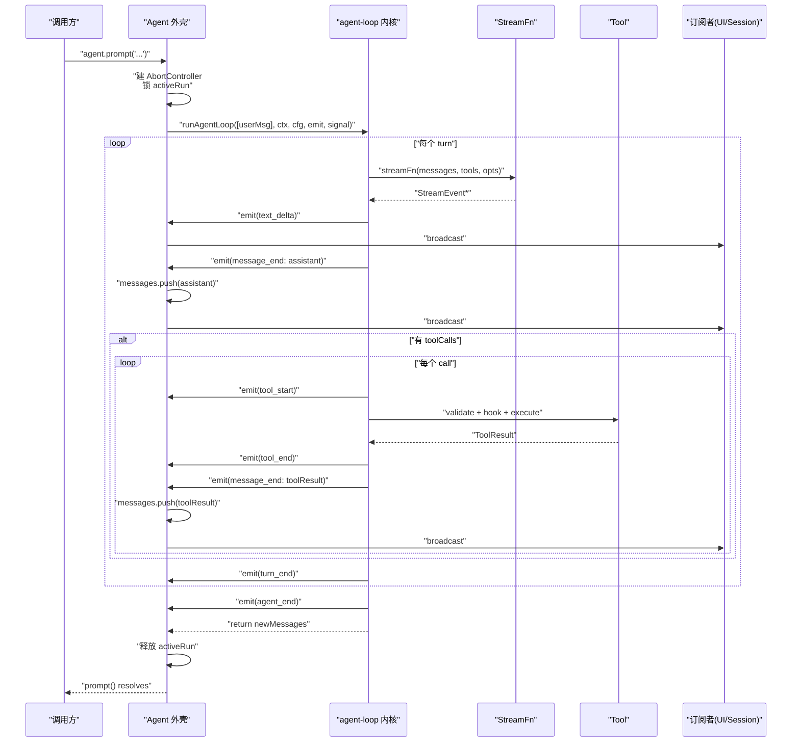

# agent/ — 协议推进内核 + 有状态外壳（L2 + L3）

> **一句话**：`agent-loop.ts` 是不持有长期状态的协议推进内核；`agent.ts` 是围绕它的有状态外壳。二者通过 DI 解耦，运行时体现为 IoC。

> **这是 mini-pi 最重要的一层**。如果只读一个文件，读 `agent-loop.ts`。如果读完想进一步理解，请读 pi-mono 的 `readingdocs/[4月27日]Agent与agent-loop分层设计-IoC与DI详解.md`。

## 这一层负责什么

### agent-loop.ts（L2 - 无状态内核）

- **协议推进**：turn 循环 + tool 循环
- **调 LLM**：消费 `streamFn` 的流，聚合成 `AssistantMessage`
- **执行工具**：校验参数 → 调 hook → 执行 → 回填结果
- **通过 emit 把事件反向回调给外壳**

### agent.ts（L3 - 有状态外壳）

- **持有 transcript**（跨 prompt 存活）
- **管理 listeners**（事件订阅）
- **管理 activeRun**（并发互斥 + abort controller）
- **聚合内核事件 → 广播给订阅者**

## 暴露的公共接口

```ts
// 类型（外壳 ↔ 内核的契约）
export type { AgentContext, AgentLoopConfig, AgentEvent, AgentEventSink, BeforeToolCallResult };

// 内核（无状态函数）
export async function runAgentLoop(
   newUserMessages: Message[],
   context: AgentContext,
   config: AgentLoopConfig,
   emit: AgentEventSink,
   signal?: AbortSignal,
): Promise<Message[]>;

// 外壳
export class Agent {
   constructor(options: AgentOptions);
   subscribe(listener: AgentEventSink): () => void;
   getMessages(): readonly Message[];
   isRunning(): boolean;
   abort(): void;
   replaceTranscript(messages: Message[]): void;  // for session compaction
   prompt(text: string): Promise<void>;
}
```

## 依赖什么能力

- **向下**：`ai/`（Message / StreamFn / ToolCall 类型）、`tools/`（Tool 接口 + validateToolArguments）
- **不依赖**：任何 UI、任何持久化、任何会话管理

## 核心设计理念

### 1. Shell vs Core 分层

这是整个 mini-pi 最关键的设计。**长期运行时状态**（transcript / listeners / activeRun）留在 Agent 外壳里；**协议推进**（turn / tool loop）留在 agent-loop 内核里。

**判据**：如果某段逻辑**可以独立跑**、**可以独立测试**、**可以被不同外壳复用**，就属于内核。否则属于外壳。

`runAgentLoop` 是顶层函数，没有 `this`、没有 class、没有模块级状态 —— 它甚至可以脱离 `Agent` 存在（见 `index.ts` 的导出，可以直接用它写无状态脚本）。

### 2. DI 作为解耦手段，IoC 作为运行时表现

```ts
// Agent 外壳把能力打包成 config，传给内核
await runAgentLoop(
   newUserMessages,
   { systemPrompt, messages, tools },        // context：纯数据
   { streamFn, beforeToolCall, ... },         // config：能力 + 策略
   (event) => { /* 反向回调 */ },             // emit：让内核在特定时机回调外壳
   signal,                                     // 取消
);
```

- **DI**：`streamFn` / `tools` / `beforeToolCall` / `emit` 都是参数化注入的
- **IoC**：主流程时序由 `runAgentLoop` 掌握，外壳只在事件点被回调

这两件事同时成立，才有"干净的分层"。

### 3. 事件驱动的状态聚合

```ts
// Agent 外壳只关心一件事：内核发来 message_end，就把消息追加到 transcript
emit = async (event) => {
   if (event.type === "message_end") {
      this.messages.push(event.message);
   }
   for (const listener of this.listeners) await listener(event);
};
```

这让 Agent 不需要同时接收多路数据源（返回值 + 回调 + 事件流）—— **所有状态变更走同一条事件通道**。UI、SessionStore、日志都订阅同一组事件，互不耦合。

**关键约定**：
- `message_start` / `text_delta` 只是**流式反馈**，不改变 transcript
- `message_end` 才是"**完整消息已生成**"的权威事件，此时外壳追加到 transcript
- tool result 也走 `message_end`（紧跟 `tool_end` 之后），让 transcript 订阅者有统一入口

### 4. System Prompt 不进 transcript

```ts
// Agent 的 messages 字段**不含** system prompt
// agent-loop 在每次调 LLM 时从 context.systemPrompt 重新注入
const llmMessages = systemPrompt
   ? [{ role: "system", content: systemPrompt }, ...messages]
   : messages;
```

**为什么这样？**

- System prompt 是**配置**，不是**历史**。它在运行中可能变（换模型、加调试信息）
- 如果 system 进了 transcript，压缩/恢复时会出现"历史里的旧 system"和"当前 system"冲突
- 保持 transcript 纯粹是"用户+助手+工具"的交互记录，system 由外壳在每次调用前重新注入

### 5. 并发互斥

```ts
if (this.activeRun) {
   throw new Error("Agent is already processing a prompt.");
}
```

Agent 刻意**不支持**并发 prompt。为什么？

- 并发会破坏 transcript 的线性语义（"A 的回复 push 之前 B 已经开始"）
- 需要并发的场景（batch / multi-agent）应该创建多个 Agent 实例
- 单 Agent 专心做好"一个会话"—— 这是 SRP

### 6. AbortSignal 的生命周期

- AbortController **由 Agent 外壳拥有**（在 `prompt()` 开始时创建，结束时丢弃）
- Signal 通过参数传入 agent-loop，再传入 `streamFn` 和 `tool.execute`
- 取消只能由外壳发起（`agent.abort()`），**内核不创建 controller**
- 这是 "谁拥有生命周期，谁控制取消" 的 SSOT 原则

### 7. 返回值是"本次新增的消息"

```ts
// agent-loop 返回 newMessages（不是 void）
// 这让无外壳场景也能用 —— 调一次 loop，拿一组消息，自己 push 到自己的 transcript
const newMessages = await runAgentLoop([userMessage], context, config, noopEmit);
```

把**协议事实**（新增了哪些消息）和**副作用**（追加到哪个 transcript）分开，让内核保持纯函数性质。

## 数据流图



## 文件地图

| 文件 | 作用 | 类型 |
|---|---|---|
| `types.ts` | 外壳 ↔ 内核的契约（3 组） | 纯类型 |
| `agent-loop.ts` | 协议推进内核（顶层函数） | **无状态** |
| `agent.ts` | 有状态外壳（class） | **有状态** |
| `index.ts` | 公共导出 | — |

## 与 pi-mono 的对照

| mini-pi | pi-mono | 差异 |
|---|---|---|
| `agent-loop.ts` 的 `runAgentLoop` | `packages/agent/src/agent-loop.ts` 的 `runAgentLoop` | pi-mono 有 steering / follow-up / transformContext，mini-pi 都没有 |
| `agent.ts` 的 `Agent` | `packages/agent/src/agent.ts` 的 `Agent` | pi-mono 有队列、proxy、transport；mini-pi 只有 transcript + activeRun |
| 事件类型 `AgentEvent` | pi-mono 同名类型 | pi-mono 细分得更多（thinking / reasoning / error 等） |

## 一个可以回答的测试题

> **"如果想让 `runAgentLoop` 支持'流式摘要'（每轮 turn 结束自动触发摘要），应该改哪里？"**

**错误答案**：在 `runLoop` 内部加 `if (needSummarize) await summarize(...)` —— 这把压缩知识塞进了内核，破坏分层。

**正确答案**：不改内核。让外壳（或上层协调者）订阅 `turn_end` 事件，自己决定要不要触发压缩；压缩后调 `agent.replaceTranscript(...)`。内核零改动。

这就是分层的价值：**新需求的冲击面被限制在一个组件**。

## 下一层

→ [../session/README.md](../session/README.md) 看会话持久化 + 上下文压缩如何作为"有状态协作者"与 Agent 平级共存。
