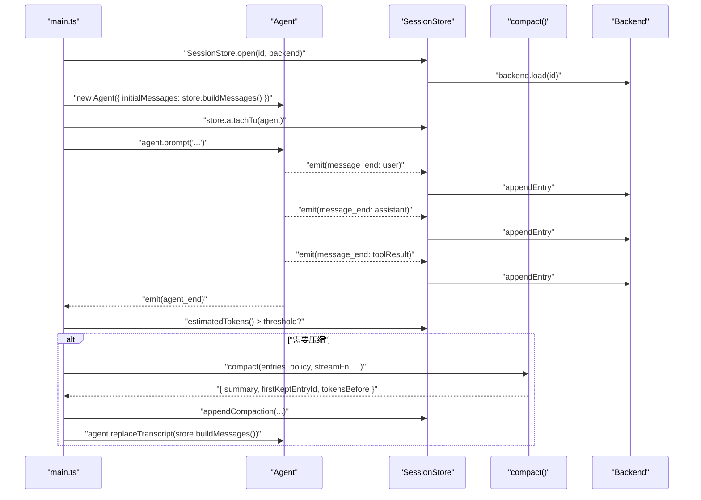

# session/ — 持久化 + 上下文压缩（L1 + L3）

> **一句话**：把"会话持久化"和"上下文压缩"做成与 Agent 平级的**有状态协作者**，用事件订阅和数据注入与 Agent 单向通信。

## 这一层负责什么

1. **定义 append-only 会话格式**（`types.ts`）
   - `SessionEntry`（`message` / `compaction` / `model_change`）
   - `SessionHeader`
2. **抽象持久化后端**（`types.ts` 的 `SessionBackend` 接口）
3. **提供两个后端实现**：
   - `InMemorySessionBackend`（测试 / 浏览器）
   - `FsSessionBackend`（JSONL 文件，默认 `~/.mini-pi/sessions/`）
4. **`SessionStore` 有状态协作者**（`session-store.ts`）
   - 读写 entries、维护 leaf 指针
   - `buildMessages()` 重建给 LLM 的 transcript（处理 compaction）
   - `attachTo(agent)` 订阅 Agent 事件自主落盘
5. **`compact()` 压缩函数**（`compactor.ts`）
   - 纯函数（LLM 除外）：输入 entries + policy + streamFn，输出 `{ summary, firstKeptEntryId, tokensBefore }`
   - 可配置策略 `CompactionPolicy`

## 暴露的公共接口

```ts
// 后端抽象
export interface SessionBackend {
   load(id): Promise<SessionFileRecord[] | null>;
   writeHeader(id, header): Promise<void>;
   appendEntry(id, entry): Promise<void>;
   list(cwd): Promise<SessionSummary[]>;
}

// 两个实现
export class InMemorySessionBackend implements SessionBackend {}
export class FsSessionBackend implements SessionBackend {}

// 有状态协作者
export class SessionStore {
   static create(cwd, backend): Promise<SessionStore>;
   static open(id, backend): Promise<SessionStore>;
   buildMessages(): Message[];                     // 关键：重建 LLM transcript
   appendMessage(message): Promise<string>;
   appendCompaction(summary, firstKeptId, tokens): Promise<string>;
   estimatedTokens(): number;
   attachTo(agent): () => void;                    // 订阅事件自动落盘
}

// 压缩
export function compact(req: CompactionRequest): Promise<CompactionResult | null>;
export const DEFAULT_COMPACTION_POLICY: CompactionPolicy;
```

## 依赖什么能力

- **向下**：`ai/`（Message / StreamFn）
- **横向**：`agent/`（Agent 类、AgentEvent —— **只用于 attachTo 的类型**）
- **不依赖**：web / cli

> 注意：`SessionStore.attachTo` 需要导入 `Agent` 类型，但这是**类型依赖**而非**实现依赖**。
> Store 不知道 Agent 的内部实现，只通过 `subscribe()` 公开 API 交互。

## 核心设计理念

### 1. Store 是"平级协作者"，不是 Agent 的成员

```ts
// ✅ 正确：平级 + 订阅
const agent = new Agent({...});
const store = await SessionStore.create(cwd, backend);
const unsubscribe = store.attachTo(agent);

// ❌ 错误：把 Store 塞给 Agent
const agent = new Agent({..., sessionStore: store });   // 破坏 Agent 的"无持久化"纪律
```

为什么？
- Agent 需要在"不持久化"场景也能跑（单元测试、一次性任务、浏览器预览）
- Store 依赖 Agent（通过事件），Agent 不依赖 Store —— 单向依赖
- 想换存储层，只动 Store 装配；Agent 零改动

### 2. append-only 的好处

```
每个 entry 一旦写入 → 永不修改
压缩 = 追加一个 compaction entry，旧消息保留在文件里
```

- 崩溃安全：进程挂了，已追加的行仍然有效
- 可审计：任何时候 `cat session.jsonl` 都能看到完整历史
- 语义简单：没有"就地更新"带来的并发问题

### 3. buildMessages() 是纯函数

```ts
buildMessages(): Message[] {
   // 只读 this.entries 和 this.leafId，不写任何状态
   // 处理 compaction：summary 替代被压缩的消息
}
```

这让"上下文如何被构建"**可以单独测试**，不需要 mock 后端。参见 `test/session-store.test.ts`（PR6 会加）。

### 4. 压缩由 Composition Root 编排，不由 Store 自发

```ts
// 在 web/server.ts 里（PR5）：
agent.subscribe(async (event) => {
   if (event.type === "agent_end" && store.estimatedTokens() > 30000) {
      const result = await compact({ entries: store.getEntries(), ..., streamFn });
      if (result) {
         await store.appendCompaction(result.summary, result.firstKeptEntryId, result.tokensBefore);
         agent.replaceTranscript(store.buildMessages());
      }
   }
});
```

为什么压缩不在 Store 或 Agent 自己做？
- 压缩是**跨组件事务**："生成摘要" + "写 entry" + "替换 transcript" —— 任何一个组件都无权做全部三件事
- Composition Root 是唯一合法的编排地点
- 这让 Store 保持"只管读写"，Agent 保持"只管运行时状态"

### 5. 两个后端证明"后端是真正的抽象"

```ts
// 测试里：
const backend = new InMemorySessionBackend();
const store = await SessionStore.create("/tmp", backend);

// 生产里：
const backend = new FsSessionBackend();
const store = await SessionStore.create(process.cwd(), backend);
```

- 一行改动，换后端；Store / Compactor / Agent 一律零改动
- 这是 **Liskov 替换原则** 的活教材：两个实现可以无差别替换

### 6. 预留分支字段但当前只做线性链

```ts
export interface SessionEntryBase {
   id: string;
   parentId: string | null;   // ← 预留分支结构
   timestamp: string;
}
```

当前 `SessionStore.leafId` 只追尾，整棵"树"退化成链表。**但字段已经准备好**：
- 未来加分支，只需要新增 `branch(entryId)` 方法改 leaf 指针
- 存储格式不变，已有会话向前兼容
- 这是**渐进式演进**的示范：接口预留扩展，实现先做最简

## 数据流图：Agent + Store + Compactor 协作



## 文件地图

| 文件 | 作用 |
|---|---|
| `types.ts` | `SessionEntry` / `SessionHeader` / `SessionBackend` / `CompactionPolicy` 契约 |
| `memory-backend.ts` | 内存后端（测试 / 浏览器） |
| `fs-backend.ts` | JSONL 文件后端（生产默认） |
| `session-store.ts` | `SessionStore` 协作者 + `buildMessages` 上下文重建 |
| `compactor.ts` | `compact()` 压缩函数 + `DEFAULT_COMPACTION_POLICY` |
| `index.ts` | 公共导出 |

## 与 pi-mono 的对照

| mini-pi | pi-mono | 差异 |
|---|---|---|
| `types.ts` 3 种 entry | `coding-agent/core/session-manager.ts` 9 种 entry | pi-mono 有 label / custom / branch_summary / thinking_level_change 等 |
| 线性链（leafId = 最后一个 entry） | 真正的树（支持 branch/forkFrom/createBranchedSession） | mini-pi 预留字段，未启用 |
| 无版本迁移 | v1 → v2 → v3 migration | pi-mono 的 `CURRENT_SESSION_VERSION` 机制 |
| `compact()` 单函数 | `coding-agent/core/compaction/` 整个目录 | pi-mono 有层级摘要、滑动窗口、artifact 索引 |

## 一个可以回答的测试题

> **"如果我想把 session 存到 SQLite，需要改哪几层？"**

**答案**：只需要写一个 `class SqliteSessionBackend implements SessionBackend`，然后在 `web/server.ts` 里换一行 `new FsSessionBackend()` → `new SqliteSessionBackend(...)`。
- `SessionStore`：不动
- `compact()`：不动
- `Agent` / `agent-loop`：不动
- UI：不动

这就是接口抽象的价值。

## 下一层

→ [../web/README.md](../web/README.md) 看如何用 HTTP/SSE + React 把 Agent 的事件流渲染给用户，并在 Composition Root 里编排压缩。
