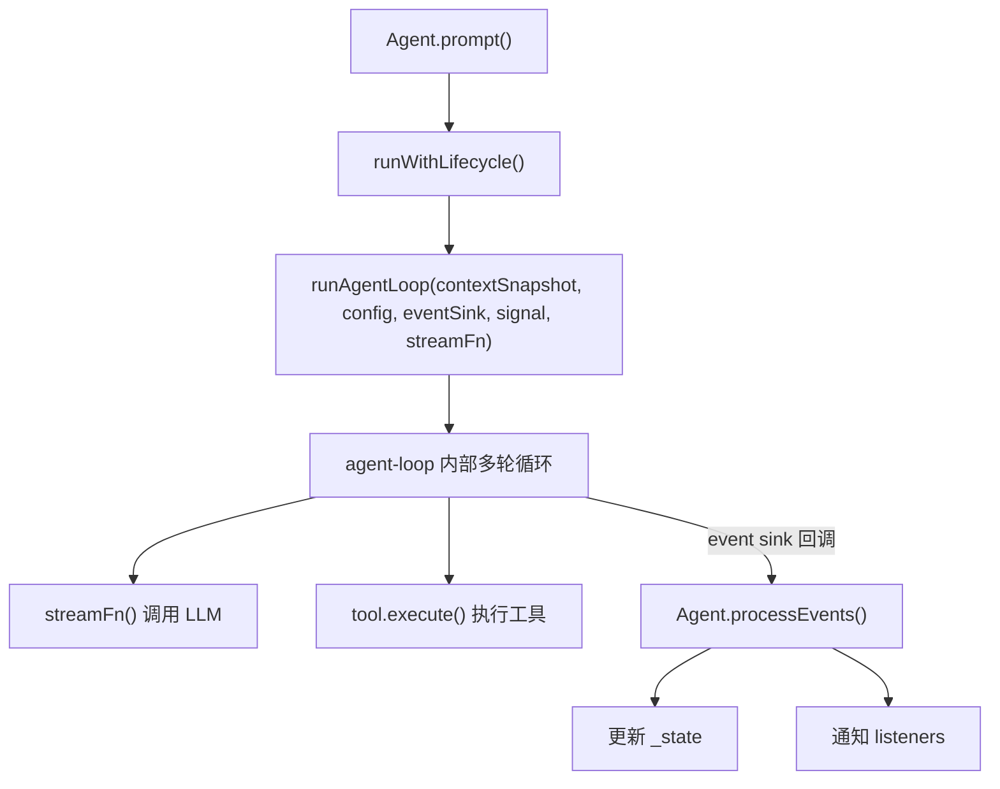
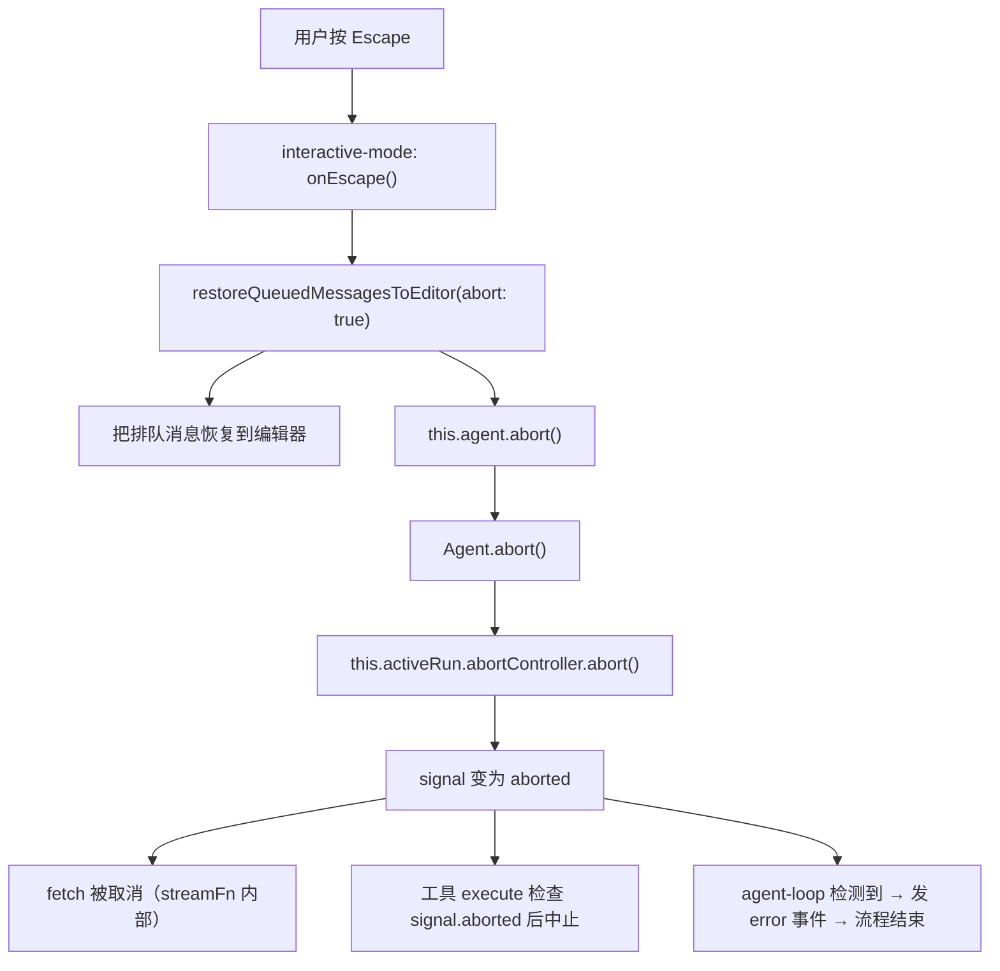

# Pi Agent 核心架构深度解析

> 基于 `packages/agent`（`@mariozechner/pi-agent-core`）和 `packages/coding-agent` 的源码阅读笔记。
> 记录日期：2026-04-20

## 目录

1. [整体架构分层](#1-整体架构分层)
2. [Agent 类：有状态的上层壳](#2-agent-类有状态的上层壳)
3. [agent-loop：无状态的底层引擎](#3-agent-loop无状态的底层引擎)
4. [AgentSession：上层会话封装](#4-agentsession上层会话封装)
5. [两层 subscribe 事件系统详解](#5-两层-subscribe-事件系统详解)
6. [消息队列机制：steering 与 follow-up](#6-消息队列机制steering-与-follow-up)
7. [config 与依赖注入/闭包原理](#7-config-与依赖注入闭包原理)
8. [Agent 的生命周期管理：runWithLifecycle](#8-agent-的生命周期管理runwithlifecycle)
9. [Abort 机制：从 Escape 到 HTTP 取消](#9-abort-机制从-escape-到-http-取消)
10. [processEvents 的屏障语义](#10-processevents-的屏障语义)
11. [_agentEventQueue：Promise 链式串行队列](#11-_agenteventqueuepromise-链式串行队列)
12. [持久化机制：message_end 时发生了什么](#12-持久化机制message_end-时发生了什么)
13. [TypeScript 函数重载](#13-typescript-函数重载)
14. [createAgentSession：工厂函数与启动流程](#14-createagentsession工厂函数与启动流程)
15. [Agent 构造参数的溯源](#15-agent-构造参数的溯源)

---

## 1. 整体架构分层

Pi 的 agent 运行时分为三层，各层职责清晰：

```
┌─────────────────────────────────────────────────────┐
│  UI 层 (InteractiveMode / RPC / Print)              │  ← 用户交互、渲染
│    └─ session.subscribe(handleEvent)                │
├─────────────────────────────────────────────────────┤
│  AgentSession (packages/coding-agent)               │  ← 持久化、扩展、重试、compaction
│    └─ agent.subscribe(_handleAgentEvent)            │
├─────────────────────────────────────────────────────┤
│  Agent (packages/agent)                             │  ← 状态管理、事件分发、队列
│    └─ runAgentLoop / runAgentLoopContinue           │
├─────────────────────────────────────────────────────┤
│  agent-loop (packages/agent)                        │  ← LLM 调用循环、工具执行（无状态）
│    └─ streamFn → pi-ai (LLM HTTP 调用)             │
└─────────────────────────────────────────────────────┘
```

### 关键理解

- **Agent 不是全部**。Agent 是一个"状态容器 + 事件分发器"，真正的循环逻辑在 `agent-loop.ts` 的纯函数中。
- **agent-loop 是无状态的**。它接收 context 快照 + config，通过 event sink 回调吐事件，自己不持有任何状态。
- **两者通过 event sink + config 回调协作**。Agent 把状态和能力以闭包形式打包成 config，注入给 agent-loop。

### 调用关系流程图



---

## 2. Agent 类：有状态的上层壳

### 2.1 Agent 的状态（AgentState）

```typescript
interface AgentState {
  systemPrompt: string;                           // 系统提示词
  model: Model<any>;                              // 当前使用的模型
  thinkingLevel: ThinkingLevel;                   // "off"|"minimal"|"low"|"medium"|"high"|"xhigh"
  tools: AgentTool<any>[];                        // 当前可用工具（set 时自动 slice 拷贝）
  messages: AgentMessage[];                       // 完整对话记录（set 时自动 slice 拷贝）
  readonly isStreaming: boolean;                  // 是否正在处理
  readonly streamingMessage?: AgentMessage;       // 当前流式输出的 partial assistant 消息
  readonly pendingToolCalls: ReadonlySet<string>; // 正在执行的 tool call ID 集合
  readonly errorMessage?: string;                 // 最近一次失败/中止的错误信息
}
```

**为什么 `tools` 和 `messages` 的 setter 会做 `slice()` 拷贝？**

这是一种防御性编程。外部赋值 `agent.state.tools = myArray` 时，Agent 内部存的是 `myArray.slice()`（浅拷贝），这样外部后续修改 `myArray` 不会意外影响 Agent 内部状态。但注意 `agent.state.tools.push(...)` 直接操作的是内部数组，会立刻生效。

### 2.2 内部额外状态（不对外暴露）

| 属性 | 类型 | 用途 |
|------|------|------|
| `activeRun` | `{ promise, resolve, abortController }` | 当前运行的控制句柄 |
| `steeringQueue` | `PendingMessageQueue` | steering 消息队列 |
| `followUpQueue` | `PendingMessageQueue` | follow-up 消息队列 |
| `listeners` | `Set<(event, signal) => void>` | 事件订阅者集合 |

### 2.3 Agent 对外暴露的接口

| 类别 | 接口 | 说明 |
|------|------|------|
| **发起对话** | `prompt(text/message/messages)` | 发送用户消息，触发完整的 agent 循环 |
| | `continue()` | 从当前 transcript 继续（用于错误重试） |
| **控制** | `abort()` | 中止当前运行 |
| | `reset()` | 清空 transcript + 运行时状态 + 队列 |
| | `waitForIdle()` | 等待当前运行完全结束（包括 agent_end listener 执行完毕） |
| **事件订阅** | `subscribe(listener)` | 监听 AgentEvent，返回取消函数 |
| **消息队列** | `steer(msg)` | 运行中插入 steering 消息（当前 turn 工具执行完后注入） |
| | `followUp(msg)` | 排队 follow-up 消息（agent 全部结束后才处理） |
| | `clearSteeringQueue/clearFollowUpQueue/clearAllQueues` | 清空队列 |
| **状态读写** | `state.*` | 直接读写 systemPrompt / model / tools / messages 等 |

### 2.4 创建时机

**生产代码中只有一个创建点**：`packages/coding-agent/src/core/sdk.ts:291` 的 `createAgentSession` 函数内部。

**全局只有一个 Agent 实例吗？不一定。** 每次执行 `/new`（新会话）、`/resume`（恢复）、`/fork`（分叉）时会创建新的 Agent + AgentSession 对。但在一个会话的生命周期内，确实只有一个 Agent。

---

## 3. agent-loop：无状态的底层引擎

### 3.1 事件流（AgentEvent）

agent-loop 产生的事件序列：

**普通对话：**
```
agent_start → turn_start
  → message_start(user) → message_end(user)
  → message_start(assistant) → message_update* → message_end(assistant)
  → turn_end
  → agent_end
```

**带工具调用：**
```
agent_start → turn_start
  → message_start/end(user)
  → message_start → message_update* → message_end(assistant with toolCall)
  → tool_execution_start → tool_execution_update* → tool_execution_end
  → message_start/end(toolResult)
  → turn_end
  → turn_start  ← 新一轮，LLM 处理工具结果
  → message_start → message_update* → message_end(assistant)
  → turn_end
  → agent_end
```

### 3.2 低级 API

除了被 Agent 类包装使用，agent-loop 也导出了可直接使用的无状态函数：

- `agentLoop(messages, context, config)` → `AsyncIterable<AgentEvent>`
- `agentLoopContinue(context, config)` → 从已有上下文继续
- `runAgentLoop` / `runAgentLoopContinue` → 带 event sink 回调的版本

低级 API 不管理状态，不等待 listener，适合需要完全自定义控制的场景。

---

## 4. AgentSession：上层会话封装

`AgentSession` 位于 `packages/coding-agent/src/core/agent-session.ts`，是 Agent 之上的高层封装。

### 4.1 职责

- **Session 持久化**：每条消息在 `message_end` 时写入 `.jsonl` 文件
- **扩展系统**：把 Agent 事件转发给扩展（extension），处理扩展命令
- **自动 compaction**：上下文过长时自动压缩
- **自动重试**：LLM 返回可重试错误（overloaded、rate limit）时自动重试
- **消息队列 UI 视图**：维护 `_steeringMessages` / `_followUpMessages` 用于 UI 显示
- **模型/工具管理**：提供 `setModel`、`setThinkingLevel`、`setActiveToolsByName` 等

### 4.2 构造

在 `createAgentSession`（`sdk.ts:344`）中创建：

```typescript
const session = new AgentSession({
    agent,                    // 上面刚创建的 Agent 实例
    sessionManager,           // 持久化管理器
    settingsManager,          // 设置管理器
    cwd,                      // 工作目录
    scopedModels,             // 可用模型列表
    resourceLoader,           // 扩展/skill/模板加载器
    customTools,              // 自定义工具
    modelRegistry,            // 模型注册表
    initialActiveToolNames,   // 初始活跃工具
    extensionRunnerRef,       // 扩展运行器引用
    sessionStartEvent,        // 启动事件
});
```

构造时立即做两件关键事：
1. `this.agent.subscribe(this._handleAgentEvent)` — 订阅 Agent 事件
2. `this._installAgentToolHooks()` — 安装 `beforeToolCall` / `afterToolCall` 钩子

---

## 5. 两层 subscribe 事件系统详解

这是理解整个架构的关键。Pi 有两层事件系统，形成一条链：

### 5.1 Agent 层的 subscribe

```typescript
// agent.ts:216
subscribe(listener: (event: AgentEvent, signal: AbortSignal) => Promise<void> | void): () => void
```

- **事件类型**：`AgentEvent`（agent_start/end、turn_start/end、message_start/update/end、tool_execution_start/update/end）
- **谁注册**：只有 `AgentSession` 注册了**唯一一个** listener：`_handleAgentEvent`
- **listener 是否被 await**：**是**。这很关键——agent-loop 在每个 `await emit(event)` 处等待 listener 执行完才继续，形成**屏障**

### 5.2 AgentSession 层的 subscribe

```typescript
// agent-session.ts:680
subscribe(listener: AgentSessionEventListener): () => void
```

- **事件类型**：`AgentSessionEvent`（AgentEvent 的超集，额外包含 compaction_start/end、auto_retry_start/end、queue_update 等）
- **谁注册**：UI 层。根据运行模式不同：
  - **InteractiveMode**（`interactive-mode.ts:2293`）：注册 `handleEvent`，处理 TUI 渲染
  - **RPC Mode**（`rpc-mode.ts:334`）：注册 `(event) => output(event)`，序列化发给客户端
  - **Print Mode**（`print-mode.ts:82`）：注册 JSON 输出函数
- **listener 是否被 await**：**否**。`_emit` 是同步遍历调用

### 5.3 事件流完整链路

```
agent-loop: await emit({ type: "message_end", message })
  ↓ emit = Agent.processEvents
Agent.processEvents:
  ① 更新 Agent._state（如 messages.push）
  ② for (const listener of this.listeners) { await listener(event, signal) }
    ↓ 唯一的 listener
  AgentSession._handleAgentEvent:
    ③ 同步：为 agent_end 创建 retry promise（如需要）
    ④ 异步排队：_processAgentEvent(event)
      → 从 session 队列中移除已消费的消息文本
      → await _emitExtensionEvent(event)  // 通知扩展
      → _emit(event)                      // 同步通知 UI（fire-and-forget）
      → 持久化（sessionManager.appendMessage）
      → agent_end 时：检查重试 / compaction
        ↓ _emit
  InteractiveMode.handleEvent:
    ⑤ switch(event.type) 渲染到终端
```

### 5.4 为什么 `_emit`（AgentSession 层）是同步调用而不 await？

因为 `_emit` 的调用者 `_processAgentEvent` 已经在异步队列 `_agentEventQueue` 中串行执行了。`_emit` 给 UI 的 listener 只是触发渲染（`requestRender`），**不需要等 UI 画完才继续**。

如果 `_emit` 也 await 每个 listener：
- agent-loop 的屏障被拉长（Agent.processEvents await → _handleAgentEvent 变慢 → agent-loop 被阻塞 → LLM 流式输出延迟）
- 没必要：UI 渲染是"通知即可"的操作

对比 Agent 层的 `await listener(event, signal)` 是**必须 await** 的，因为那是屏障，保证状态一致性。

---

## 6. 消息队列机制：steering 与 follow-up

### 6.1 两种队列的语义区别

| | Steering | Follow-up |
|---|---|---|
| **注入时机** | 当前 turn 的工具执行完后，下一次 LLM 调用前 | agent 全部结束后（无更多工具调用、无 steering 消息时） |
| **语义** | "停下！改做这个"（中途插队） | "做完后再做这个"（追加任务） |
| **agent-loop 的检查点** | 每个 turn_end 后调 `config.getSteeringMessages()` | steering 为空时调 `config.getFollowUpMessages()` |

### 6.2 为什么 Session 和 Agent 各有一份队列

**Agent 的队列**（`steeringQueue` / `followUpQueue`）：
- 功能层面的队列，被 agent-loop 通过 `config.getSteeringMessages()` / `config.getFollowUpMessages()` 消费
- 存的是完整的 `AgentMessage` 对象

**Session 的队列**（`_steeringMessages` / `_followUpMessages`）：
- **纯 UI 展示用**的镜像，存的是 `string`（原始文本）
- 用途：
  1. UI 显示待处理消息（"Steering: xxx" / "Follow-up: xxx"）
  2. 用户按 dequeue 快捷键时恢复文本到编辑器
  3. `pendingMessageCount` getter 返回两个队列长度之和
  4. `_processAgentEvent` 中 `message_start` 时匹配移除，保持同步

### 6.3 用户交互场景

| 用户操作 | 调用链 | 最终效果 |
|----------|--------|----------|
| **Enter**（agent 空闲时） | `editor.onSubmit` → `session.prompt(text)` → `agent.prompt(messages)` | 发起新对话 |
| **Enter**（agent streaming 时） | `session.prompt(text, { streamingBehavior: "steer" })` → `_queueSteer` → `agent.steer(msg)` | 排入 steering 队列 |
| **Alt+Enter**（streaming 时） | `handleFollowUp()` → `session.prompt(text, { streamingBehavior: "followUp" })` → `_queueFollowUp` → `agent.followUp(msg)` | 排入 follow-up 队列 |
| **Alt+Enter**（空闲时） | `handleFollowUp()` → `editor.onSubmit(text)` | 等同于普通 Enter |

### 6.4 `session.followUp` vs `session.prompt(text, { streamingBehavior: "followUp" })`

| | `session.followUp(text)` | `session.prompt(text, { streamingBehavior: "followUp" })` |
|---|---|---|
| 扩展命令 | **抛错**（不能排队） | **立即执行** |
| input 扩展事件 | 不触发 | 触发（扩展可拦截/修改） |
| 主要调用者 | RPC mode、compaction 后消息重放 | InteractiveMode 的 Alt+Enter |

**为什么扩展命令不能通过 `followUp` 排队？** 扩展命令是立即执行的函数调用（handler），有自己的副作用。延迟执行会让行为不可预测。

---

## 7. config 与依赖注入/闭包原理

### 7.1 什么是依赖注入/控制反转

**普通写法**（自己做饭）：
```typescript
function runAgentLoop() {
  const streamFn = streamSimple;           // 我自己决定用哪个流函数
  const messages = globalState.messages;    // 我自己去全局拿状态
  const apiKey = process.env.API_KEY;       // 我自己去读环境变量
}
```

问题：agent-loop 和具体实现耦合死了。换 stream 函数要改源码，mock 测试不可能。

**依赖注入**（去餐厅点菜）：
```typescript
function runAgentLoop(context, config, emit, signal, streamFn) {
  // config.convertToLlm — 你告诉我怎么转换消息
  // config.getApiKey     — 你告诉我怎么拿 key
  // streamFn             — 你告诉我用什么函数调 LLM
  // emit                 — 你告诉我往哪发事件
}
```

**"控制反转"**：
- 正常：agent-loop 主动**去拿**它需要的东西（"我控制"）
- 反转：由外面**给**agent-loop 它需要的东西（"你控制"）

好处：agent-loop 不知道 Agent 类、AgentSession、全局状态的存在。测试时传个 mock 的 `streamFn` 就行。

### 7.2 AgentLoopConfig 中的闭包

`createLoopConfig` 是闭包原理的典型应用：

```typescript
// agent.ts:407
private createLoopConfig(): AgentLoopConfig {
    return {
        model: this._state.model,                   // 值拷贝（快照）
        convertToLlm: this.convertToLlm,            // 闭包：引用 Agent 属性
        getSteeringMessages: async () => {
            return this.steeringQueue.drain();       // 闭包：读并清空 Agent 的队列
        },
        getFollowUpMessages: async () => {
            return this.followUpQueue.drain();       // 同上
        },
        beforeToolCall: this.beforeToolCall,          // 闭包
        afterToolCall: this.afterToolCall,            // 闭包
    };
}
```

**关键点**：agent-loop 是无状态纯函数，但通过调用 config 里的回调函数，它可以**间接地读写 Agent 的状态**。这些回调函数通过 `this` 捕获了 Agent 实例，这就是闭包——函数"记住了"创建时的词法环境。

`processEvents` 回调也是闭包：`(event) => this.processEvents(event)` 传给 agent-loop，loop 每次 `await emit(event)` 实际上都在调用 Agent 实例的方法来修改状态。

---

## 8. Agent 的生命周期管理：runWithLifecycle

### 8.1 为什么需要 runWithLifecycle

有两个入口需要同样的生命周期管理：

```typescript
prompt()   → runPromptMessages() → runWithLifecycle(executor)
continue() → runContinuation()   → runWithLifecycle(executor)
```

如果把生命周期代码塞进 `runAgentLoop`，`runAgentLoopContinue` 也得重复一遍。而且 `runAgentLoop` 是**外部库**（`packages/agent` 中的无状态函数），它不应知道 Agent 类的 `activeRun`、`isStreaming`、`AbortController` 这些概念。

### 8.2 runWithLifecycle 做了什么

```typescript
private async runWithLifecycle(executor: (signal: AbortSignal) => Promise<void>): Promise<void> {
    // 1. 创建 AbortController
    const abortController = new AbortController();

    // 2. 创建 promise 用于 waitForIdle()
    let resolvePromise = () => {};
    const promise = new Promise<void>((resolve) => { resolvePromise = resolve; });

    // 3. 存到实例属性，让外部可以访问
    this.activeRun = { promise, resolve: resolvePromise, abortController };

    // 4. 标记 streaming 状态
    this._state.isStreaming = true;

    try {
        // 5. 执行实际循环，把 signal 传下去
        await executor(abortController.signal);
    } catch (error) {
        // 6. 错误处理
        await this.handleRunFailure(error, abortController.signal.aborted);
    } finally {
        // 7. 清理
        this.finishRun();  // isStreaming=false, activeRun=undefined
    }
}
```

### 8.3 关于"没有 return"

`runWithLifecycle` 返回 `Promise<void>`，没有显式 `return`。在 JS/TS 中，`async` 函数不写 `return` 等价于 `return undefined`，对于 `Promise<void>` 完全合法。调用方 `await this.runWithLifecycle(...)` 等的是"这个异步函数执行完毕"，不需要返回值。

### 8.4 isStreaming 的用途

`isStreaming` 是一个布尔标志，告诉外面"agent 正在工作中"：
- `runWithLifecycle` 开始时设为 `true`
- `finishRun` 时设为 `false`
- 上层用它决定：用户新输入走 `prompt`（空闲时）还是走 `steer/followUp`（工作中）

---

## 9. Abort 机制：从 Escape 到 HTTP 取消

### 9.1 完整链路



### 9.2 abortController 是局部变量，外面怎么访问？

`abortController` 在 `runWithLifecycle` 内部声明，但创建后立刻存到了实例属性 `this.activeRun`：

```typescript
const abortController = new AbortController();
this.activeRun = { promise, resolve, abortController };  // 存到实例属性
```

`Agent.abort()` 通过实例属性访问：

```typescript
abort(): void {
    this.activeRun?.abortController.abort();  // 从实例属性取出
}
```

同时，`abortController.signal` 被传给 `runAgentLoop`，loop 内部再传给 `streamFn`（HTTP fetch）和工具的 `execute`。所以 abort 后：
1. signal 变为 aborted 状态
2. fetch 被中止
3. agent-loop 检测到 → 发 error 事件 → 流程结束

### 9.3 AbortController 是什么

`AbortController` 是 Web/Node.js 的标准 API，用于取消异步操作：

```typescript
const controller = new AbortController();
const signal = controller.signal;  // 一个只读的 AbortSignal

// 传给 fetch
fetch(url, { signal });

// 需要取消时
controller.abort();  // signal.aborted 变为 true，fetch 被中止
```

一个 controller 产生一个 signal，signal 可以传给多个消费者（fetch、tool.execute 等），abort 时所有消费者同时收到通知。

---

## 10. processEvents 的屏障语义

### 10.1 为什么强调 processEvents 是 async 且被 await

agent-loop 中是这样调用的：

```typescript
await emit({ type: "message_end", message: finalMessage });
// ← emit = Agent.processEvents，是 async 的
// ← agent-loop 在这里 AWAIT，直到 processEvents 完成才往下走

// 下面才开始工具执行
const toolCalls = message.content.filter(c => c.type === "toolCall");
await executeToolCalls(...);
```

### 10.2 如果不 await 会怎样

- 持久化还没做完，工具就开始执行了
- 工具 preflight（`beforeToolCall`）看到的 Agent 状态可能不完整
- UI 还没收到消息就看到工具开始了

### 10.3 屏障的意义

`await` 形成一个**屏障（barrier）**：确保上一步的所有副作用（状态更新、持久化、扩展通知）全部完成后，下一步才开始。这就是 README 里说的 "message processing acts as a barrier before tool preflight begins"。

### 10.4 processEvents 内部的状态更新

```typescript
private async processEvents(event: AgentEvent): Promise<void> {
    switch (event.type) {
        case "message_start":
            this._state.streamingMessage = event.message;
            break;
        case "message_end":
            this._state.streamingMessage = undefined;
            this._state.messages.push(event.message);  // 消息入 transcript
            break;
        case "tool_execution_start":
            pendingToolCalls.add(event.toolCallId);
            break;
        case "tool_execution_end":
            pendingToolCalls.delete(event.toolCallId);
            break;
        case "turn_end":
            if (event.message.errorMessage) this._state.errorMessage = ...;
            break;
        case "agent_end":
            this._state.streamingMessage = undefined;
            break;
    }
    // 然后遍历 listeners，await 每一个
    for (const listener of this.listeners) {
        await listener(event, signal);
    }
}
```

---

## 11. _agentEventQueue：Promise 链式串行队列

这一节解释 Agent 层的 `processEvents` 和 AgentSession 层的 `_processAgentEvent` 之间的**解耦机制**——为什么事件处理要分成"快路径"和"慢路径"，以及它在 JS 单线程模型下如何工作。

### 11.1 问题：_handleAgentEvent 为什么不直接 await

Agent 层的 `processEvents` 通过 `await listener(event, signal)` 调用 `_handleAgentEvent`。但看它的签名：

```typescript
private _handleAgentEvent = (event: AgentEvent): void => {  // 返回 void，不是 Promise!
```

**它故意不返回 Promise**。如果它 `await _processAgentEvent(event)` 然后返回 Promise，Agent 层就会等持久化、扩展通知等所有重活做完才继续。问题是 `message_update` 事件在每个流式 chunk 都会触发，如果每次都等持久化完成，流式输出就会卡顿。

所以它选择：**接收事件后立即返回，把重活扔进一个异步队列**。

### 11.2 核心机制：Promise 链实现串行异步队列

```typescript
// 初始值：一个已完成的 Promise
private _agentEventQueue: Promise<void> = Promise.resolve();

// 每次收到事件
this._agentEventQueue = this._agentEventQueue.then(
    () => this._processAgentEvent(event),  // 上一个成功后执行
    () => this._processAgentEvent(event),  // 上一个失败也执行（队列不能断）
);

this._agentEventQueue.catch(() => {});  // 防止未捕获 rejection
```

用伪代码展开：

```
初始：queue = Promise.resolve()           // 已完成的空 promise

收到事件 A：
  queue = queue.then(() => processA())    // Promise.resolve().then(() => processA())
                                          // processA 不会立刻执行，等微任务调度

收到事件 B（A 还没处理完）：
  queue = queue.then(() => processB())    // processA().then(() => processB())
                                          // processB 要等 processA resolve 后才开始

收到事件 C：
  queue = queue.then(() => processC())    // 继续串在后面
```

**为什么 `onFulfilled` 和 `onRejected` 回调一样？** 意思是不管前一个事件处理成功还是失败，队列都不能断，下一个事件必须继续处理。

### 11.3 两条链在单线程下的执行时间线

JS 是单线程的，不可能真正并行。两条链是通过**事件循环（Event Loop）交替执行**的：

```
时间线（单线程，从上到下是时间流逝方向）：

[1]  agent-loop: await emit(event_A)
[2]    → processEvents: 更新 _state
[3]    → 调用 _handleAgentEvent(event_A)
[4]      → 同步：_createRetryPromiseForAgentEnd
[5]      → .then(() => processA()) 挂到微任务队列    ← 只是注册，不执行！
[6]      → 返回 void
[7]    → processEvents 返回（await void 立刻完成）
[8]  agent-loop: await emit(event_B)
[9]    → processEvents: 更新 _state
[10]   → 调用 _handleAgentEvent(event_B)
[11]     → .then(() => processB()) 挂到微任务队列
[12]     → 返回 void
[13]   → processEvents 返回
[14] agent-loop: await 下一个 stream chunk（等网络 I/O）
          ↓
       --- 当前调用栈清空，事件循环检查微任务队列 ---
          ↓
[15] 执行 processA()：持久化 event_A，通知扩展，通知 UI
[16] processA() 中 await 写磁盘（I/O 挂起，调用栈清空）
          ↓
       --- 可能处理其他微任务/宏任务 ---
          ↓
[17] processA() 写磁盘完成，继续执行，processA() 结束
[18] .then 链触发 → 执行 processB()：持久化 event_B ...
```

**关键点**：
- `[5]` 处 `.then()` 只是注册回调，不执行。回调要等当前调用栈全部清空后，才从微任务队列中取出执行
- `[1]-[13]` 是 agent-loop 侧的"快路径"——只做状态更新，立刻返回
- `[15]-[18]` 是 session 侧的"慢路径"——持久化、扩展通知等，在微任务中逐个执行
- 两者不是同时跑的，而是 agent-loop 侧**先跑完一段**，调用栈空出来后 session 侧**再补上**

### 11.4 时序图

```mermaid
sequenceDiagram
    participant Loop as "agent-loop"
    participant Agent as "Agent.processEvents"
    participant Handler as "_handleAgentEvent"
    participant Queue as "_agentEventQueue"
    participant Process as "_processAgentEvent"

    Loop->>Agent: "await emit(message_update A)"
    Agent->>Agent: "更新 _state"
    Agent->>Handler: "await listener(event_A)"
    Handler->>Queue: ".then(() => processA()) 注册"
    Handler-->>Agent: "立刻返回 void"
    Agent-->>Loop: "await 结束，继续下一个 chunk"

    Loop->>Agent: "await emit(message_update B)"
    Agent->>Handler: "await listener(event_B)"
    Handler->>Queue: ".then(() => processB()) 注册"
    Handler-->>Agent: "立刻返回 void"

    Note over Queue,Process: "调用栈清空，微任务开始执行"
    Queue->>Process: "processA() 开始：持久化、扩展通知、UI"
    Process-->>Queue: "processA() 完成"
    Queue->>Process: "processB() 开始"
    Process-->>Queue: "processB() 完成"
```

### 11.5 为什么 _createRetryPromiseForAgentEnd 必须同步执行

```typescript
private _handleAgentEvent = (event: AgentEvent): void => {
    // 这一行必须在 .then() 之前同步执行
    this._createRetryPromiseForAgentEnd(event);

    this._agentEventQueue = this._agentEventQueue.then(
        () => this._processAgentEvent(event),
    );
};
```

注释里解释了原因：`prompt()` 调用 `agent.prompt()` 后会立刻调 `waitForRetry()`，此时需要 `_retryPromise` 已经创建好。如果创建 retry promise 的逻辑也放进异步队列，前面还没处理完的慢事件（比如某个 `message_update` 的持久化）会导致 `agent_end` 还没被处理，`waitForRetry()` 就已经检查过了——结果是错过了重试窗口。

### 11.6 总结：快路径与慢路径分离

| | 快路径（Agent 层） | 慢路径（Session 层） |
|---|---|---|
| **执行时机** | agent-loop emit 时同步执行 | 微任务队列中异步串行执行 |
| **做什么** | 更新 `_state`（messages.push 等） | 持久化、扩展通知、UI 通知、重试/compaction 检查 |
| **是否阻塞 agent-loop** | 是（但很快） | 否 |
| **保证** | 状态一致性（屏障） | 事件处理顺序（Promise 链串行） |

---

## 12. 持久化机制：message_end 时发生了什么

### 11.1 事件处理顺序

```
agent-loop: await emit({ type: "message_end", message })
  → Agent.processEvents:
    ① _state.streamingMessage = undefined
    ② _state.messages.push(event.message)
    ③ await listener(event, signal)
      → AgentSession._handleAgentEvent → _processAgentEvent:
        ④ 从 session 队列移除已消费的消息文本
        ⑤ await _emitExtensionEvent(event)  // 通知扩展
        ⑥ _emit(event)                      // 通知 UI（同步，不等待）
        ⑦ 持久化
```

### 11.2 持久化逻辑

```typescript
if (event.type === "message_end") {
    if (event.message.role === "custom") {
        this.sessionManager.appendCustomMessageEntry(
            event.message.customType,
            event.message.content,
            event.message.display,
            event.message.details,
        );
    } else if (
        event.message.role === "user" ||
        event.message.role === "assistant" ||
        event.message.role === "toolResult"
    ) {
        this.sessionManager.appendMessage(event.message);
    }
}
```

**持久化几乎必定发生**（除了 `bashExecution`、`compactionSummary` 等少数特殊类型在别处持久化）。写入的是 JSONL 格式的 session 文件。

### 11.3 agent_end 时的额外逻辑

`_processAgentEvent` 在 `agent_end` 时还会：
1. 检查最后一条 assistant message 是否是可重试错误 → 自动重试
2. 检查是否需要自动 compaction

---

## 13. TypeScript 函数重载

Agent 的 `prompt` 方法有三个声明：

```typescript
// 类型签名（给调用者看的"菜单"）
async prompt(message: AgentMessage | AgentMessage[]): Promise<void>;      // 菜单项 1
async prompt(input: string, images?: ImageContent[]): Promise<void>;       // 菜单项 2

// 实现签名（厨房里实际干活的，调用者看不到）
async prompt(
    input: string | AgentMessage | AgentMessage[],
    images?: ImageContent[]
): Promise<void> {
    // 实际代码
}
```

- **类型签名**：告诉调用者"你可以这样调用我"。调用者只能选择菜单项 1 或菜单项 2
- **实现签名**：兼容所有类型签名的参数，用联合类型 `string | AgentMessage | AgentMessage[]`
- 实现签名**不对外暴露**，编辑器里看到的只有两个类型签名

**为什么要这样？** 不用重载的话，调用者传参时 TypeScript 无法精确约束——它不知道"传 string 时可以带 images，传 AgentMessage 时不能带 images"。重载让每种调用方式的类型检查更严格。

---

## 14. createAgentSession：工厂函数与启动流程

### 14.1 Pi 启动的完整调用链

```
pi 命令
  → cli.ts: main(argv)
    → main.ts: parseArgs → resolveAppMode
      → 定义 createRuntime 工厂函数
        → createAgentSessionServices(cwd, agentDir, ...)  // 创建基础服务
        → createAgentSessionFromServices(services, ...)
          → createAgentSession(options)                    // sdk.ts:169
            → new Agent({...})                             // sdk.ts:291
            → new AgentSession({...})                      // sdk.ts:344
      → createAgentSessionRuntime(createRuntime, ...)
    → 根据 appMode 分流：
      → interactive → InteractiveMode.run()
      → rpc        → runRpcMode()
      → print/json → runPrintMode()
```

### 14.2 createAgentSession 做了什么

1. 创建基础服务：`AuthStorage`、`ModelRegistry`、`SettingsManager`、`SessionManager`
2. 加载扩展和资源（`ResourceLoader`）
3. 解析 model、thinking level
4. `new Agent({...})` — 创建底层 Agent
5. 恢复已有会话消息（如果有）
6. `new AgentSession({...})` — 创建上层会话
7. 返回 `{ session, extensionsResult, modelFallbackMessage }`

### 14.3 全局只调一次吗

**不是。** `createAgentSessionRuntime` 把 `createRuntime` 工厂函数保存下来，之后用户执行 `/new`、`/resume`、`/fork` 时会再次调用来创建新的 Agent + AgentSession。

---

## 15. Agent 构造参数的溯源

`new Agent({...})` 各选项的最终来源：

| Agent 选项 | 来源 |
|---|---|
| `initialState.model` | CLI `--model` 参数 → `resolveModel()` → `ModelRegistry` |
| `initialState.thinkingLevel` | CLI `--thinking` 参数 / settings 文件 |
| `initialState.tools` | 初始为 `[]`，之后由 AgentSession._buildRuntime 填充 |
| `convertToLlm` | `sdk.ts` 内部定义的 `convertToLlmWithBlockImages` |
| `streamFn` | `sdk.ts:299` 定义的闭包，调 `streamSimple` 并从 `modelRegistry` 获取 API key |
| `steeringMode/followUpMode` | `SettingsManager`（用户配置文件） |
| `transport` | `SettingsManager` |
| `thinkingBudgets` | `SettingsManager` |
| `sessionId` | `SessionManager.getSessionId()` |

最终源头：**CLI 参数 + 用户配置文件（settings.json）+ 环境变量（API keys）+ 扩展系统**。
