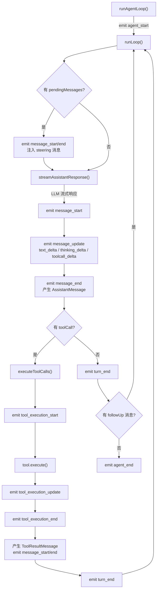
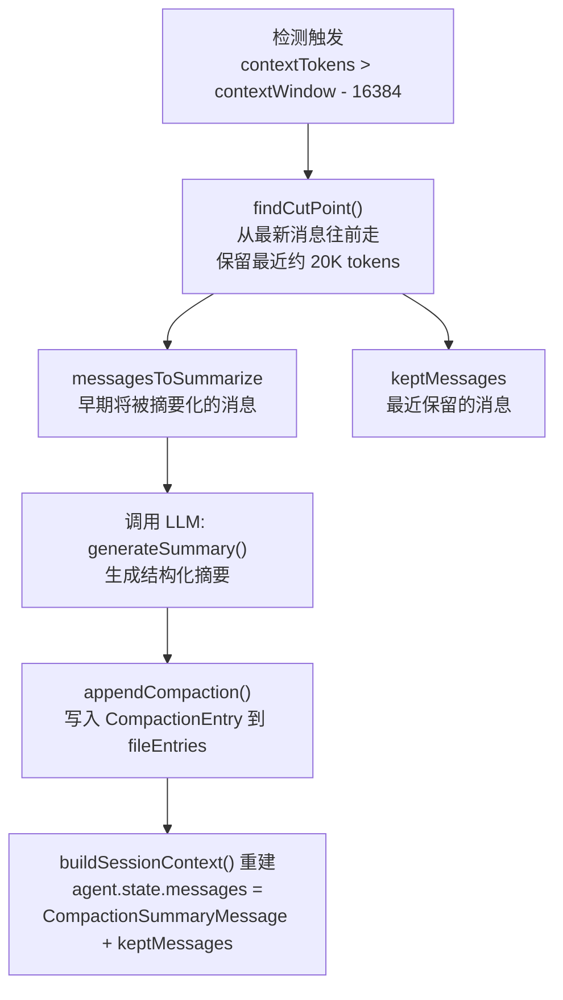
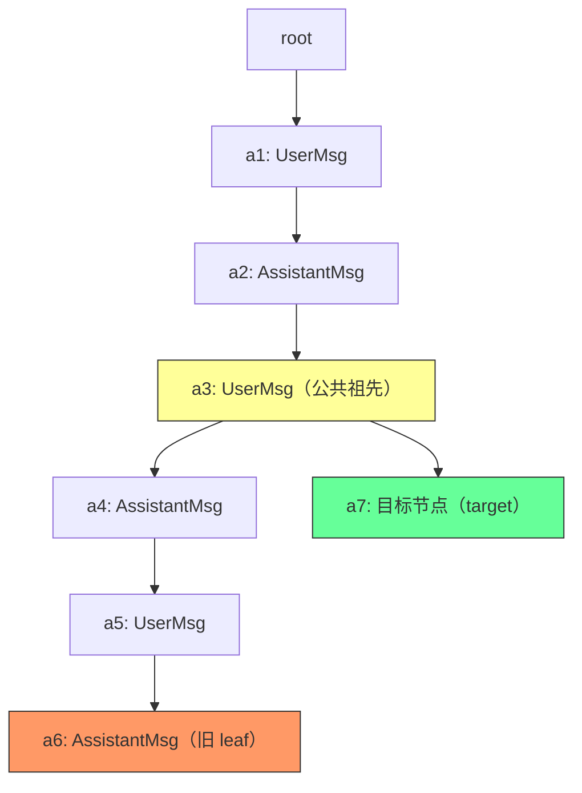

# pi-mono 消息系统与持久化机制深度解析

> 本文通过源码分析，梳理 pi-mono 项目中消息的完整生命周期：从类型定义、产生位置、扩展机制、持久化策略，到 Compaction/Branch Summary 的上下文管理方案。

---

## 目录

1. [消息类型体系：三层架构](#1-消息类型体系三层架构)
2. [第一层：ai 层基础消息类型](#2-第一层ai-层基础消息类型)
3. [第二层：agent 层的可扩展框架](#3-第二层agent-层的可扩展框架)
4. [第三层：应用层的 CustomAgentMessages 扩展](#4-第三层应用层的-customagentmessages-扩展)
5. [消息在 agent-loop 中的产生流程](#5-消息在-agent-loop-中的产生流程)
6. [自定义消息的两大用途](#6-自定义消息的两大用途)
7. [持久化机制](#7-持久化机制)
8. [Compaction 上下文压缩](#8-compaction-上下文压缩)
9. [Branch Summary 分支摘要](#9-branch-summary-分支摘要)
10. [Compaction vs Branch Summary 对比](#10-compaction-vs-branch-summary-对比)
11. [两层存储模型：ground truth 与派生值](#11-两层存储模型ground-truth-与派生值)

---

## 1. 消息类型体系：三层架构

整个项目的消息系统采用三层架构，通过 TypeScript 的**声明合并（declaration merging）** 实现可扩展性：

```
┌───────────────────────────────────────────────────────┐
│  第三层：应用层扩展                                     │
│  coding-agent: bashExecution, custom,                 │
│                branchSummary, compactionSummary        │
│  web-ui: user-with-attachments, artifact              │
├───────────────────────────────────────────────────────┤
│  第二层：pi-agent-core（可扩展框架）                    │
│  CustomAgentMessages（空接口，声明合并扩展点）           │
│  AgentMessage = Message | CustomAgentMessages[key...] │
├───────────────────────────────────────────────────────┤
│  第一层：pi-ai（LLM 基础消息）                          │
│  UserMessage | AssistantMessage | ToolResultMessage    │
└───────────────────────────────────────────────────────┘
```

**核心设计理念**：LLM 只认识三种 role（user / assistant / toolResult），但应用层需要更丰富的消息语义。通过在中间层留一个声明合并扩展点，上层可以自由添加消息类型，在发送给 LLM 前统一通过 `convertToLlm()` 转换回标准消息。

---

## 2. 第一层：ai 层基础消息类型

**文件**：`packages/ai/src/types.ts`

直接对应 LLM API 的三种角色，组成基础联合类型：

```typescript
export type Message = UserMessage | AssistantMessage | ToolResultMessage;
```

- **UserMessage**（`role: "user"`）— 用户输入，content 可以是纯文本或文本+图片数组
- **AssistantMessage**（`role: "assistant"`）— LLM 回复，content 包含文本、thinking、toolCall 三种内容块；同时携带 `usage`（token 用量）和 `stopReason`（停止原因）
- **ToolResultMessage**（`role: "toolResult"`）— 工具执行结果，通过 `toolCallId` 关联到 AssistantMessage 中的某个 ToolCall

**产生位置**：
- `UserMessage` — 上层（interactive-mode、web-ui）在用户输入时创建
- `AssistantMessage` — `agent-loop.ts` 的 `streamAssistantResponse()` 中，LLM 流式响应完成后产生
- `ToolResultMessage` — `agent-loop.ts` 的 `emitToolCallOutcome()` 中，工具执行完成后产生

---

## 3. 第二层：agent 层的可扩展框架

**文件**：`packages/agent/src/types.ts`

```typescript
// 空接口 — 应用通过声明合并扩展
export interface CustomAgentMessages {}

// AgentMessage = 标准 LLM 消息 + 所有自定义消息的联合
export type AgentMessage = Message | CustomAgentMessages[keyof CustomAgentMessages];
```

**为什么用空接口 + 声明合并？** 因为 `pi-agent-core` 作为通用框架不知道上层会有哪些自定义消息。上层只需 `declare module` 往 `CustomAgentMessages` 添加字段，`AgentMessage` 联合类型就自动扩展，实现了**开放-封闭原则**——框架代码不需要修改。

---

## 4. 第三层：应用层的 CustomAgentMessages 扩展

### 4.1 coding-agent 扩展（4 种）

**文件**：`packages/coding-agent/src/core/messages.ts`

```typescript
declare module "@mariozechner/pi-agent-core" {
    interface CustomAgentMessages {
        bashExecution: BashExecutionMessage;
        custom: CustomMessage;
        branchSummary: BranchSummaryMessage;
        compactionSummary: CompactionSummaryMessage;
    }
}
```

| 消息类型 | role | 用途 | 产生位置 |
|---|---|---|---|
| `BashExecutionMessage` | `"bashExecution"` | 用户通过 `!` 命令执行 bash，记录命令、输出、退出码等 | `recordBashResult()` |
| `CustomMessage<T>` | `"custom"` | 扩展通过 `sendMessage()` 注入的自定义消息 | `sendCustomMessage()` |
| `BranchSummaryMessage` | `"branchSummary"` | 分支切换时对旧分支的摘要 | `navigateTree()` → `branchWithSummary()` |
| `CompactionSummaryMessage` | `"compactionSummary"` | 上下文压缩后的摘要 | `_compact()` → `appendCompaction()` |

**为什么不直接用 UserMessage？** 因为这些消息在 agent 内部需要不同的语义和元数据：
- `BashExecutionMessage` 需要 `command`、`exitCode`、`cancelled`、`truncated` 等结构化字段，便于 UI 渲染和 session 恢复
- `CompactionSummaryMessage` 需要 `tokensBefore`，用于监控压缩效果
- `BranchSummaryMessage` 需要 `fromId`，用于追踪分支来源
- `CustomMessage` 有 `display` 标志控制是否在 TUI 显示，有 `customType` 供扩展区分

### 4.2 web-ui 扩展（2 种）

**文件**：`packages/web-ui/src/components/Messages.ts`

| 消息类型 | role | 用途 |
|---|---|---|
| `UserMessageWithAttachments` | `"user-with-attachments"` | 带附件（图片等）的用户消息 |
| `ArtifactMessage` | `"artifact"` | Artifact 的创建/更新/删除，用于会话内状态重建 |

### 4.3 所有自定义消息发给 LLM 前的转换

自定义消息不能直接发给 LLM，在 `convertToLlm()` 中统一转换为标准 `UserMessage`：

```typescript
// packages/coding-agent/src/core/messages.ts
export function convertToLlm(messages: AgentMessage[]): Message[] {
    return messages.map((m) => {
        switch (m.role) {
            case "bashExecution":
                return { role: "user", content: [...], timestamp: m.timestamp };
            case "custom":
                return { role: "user", content: ..., timestamp: m.timestamp };
            case "branchSummary":
                return { role: "user", content: [{ type: "text",
                    text: BRANCH_SUMMARY_PREFIX + m.summary + BRANCH_SUMMARY_SUFFIX }] };
            case "compactionSummary":
                return { role: "user", content: [{ type: "text",
                    text: COMPACTION_SUMMARY_PREFIX + m.summary + COMPACTION_SUMMARY_SUFFIX }] };
            case "user": case "assistant": case "toolResult":
                return m; // 标准消息直通
        }
    });
}
```

---

## 5. 消息在 agent-loop 中的产生流程

**文件**：`packages/agent/src/agent-loop.ts`



关键路径：
1. **AssistantMessage 产生**：`streamAssistantResponse()` 调用 `streamSimple()` 与 LLM 通信，流式接收后构建最终消息
2. **ToolResultMessage 产生**：`emitToolCallOutcome()` 在工具执行完成后构建
3. **自定义消息注入**：通过 `config.getSteeringMessages()` 和 `config.getFollowUpMessages()` 回调注入
4. **LLM 边界转换**：`streamAssistantResponse()` 中调用 `config.convertToLlm(messages)` 将 `AgentMessage[]` 转为 `Message[]` 后才发给 LLM

---

## 6. 自定义消息的两大用途

### 6.1 参与 LLM 上下文（间接方式）

自定义消息不能直接发给 LLM，但会在 `convertToLlm()` 中转换为标准 `UserMessage`。之所以不直接用 UserMessage，是因为 agent 内部需要**比标准消息更丰富的语义和元数据**——结构化的 bash 执行信息、压缩前的 token 数、分支来源 ID 等。

### 6.2 UI 渲染

不同 role 在 TUI / Web UI 中有完全不同的渲染方式：
- `bashExecution` → 带命令高亮 + 输出 + 退出码的代码块
- `custom` → 由扩展注册的 `MessageRenderer` 自定义渲染
- `compactionSummary` → 压缩提示
- `branchSummary` → 分支切换提示
- web-ui 的 `artifact` → 推入 `state.messages` 用于重建 artifact 状态

---

## 7. 持久化机制

### 7.1 存储格式：JSONL

**一个 session = 一个 JSONL 文件**。存储路径：

```
~/.pi/agent/sessions/
  --Users-you-project--/              ← 按 cwd 编码的目录名
    2026-04-21T10-30-00-000Z_<uuid>.jsonl   ← 一个 session
```

每行一个 JSON 对象，不同 `type` 代表不同含义：

```jsonl
{"type":"session","version":3,"id":"uuid","timestamp":"...","cwd":"/path"}
{"type":"message","id":"a1","parentId":null,"message":{"role":"user",...}}
{"type":"message","id":"a2","parentId":"a1","message":{"role":"assistant",...}}
{"type":"message","id":"a3","parentId":"a2","message":{"role":"toolResult",...}}
{"type":"custom_message","id":"a4","parentId":"a3","customType":"...","content":"..."}
{"type":"thinking_level_change","id":"a5","parentId":"a4","thinkingLevel":"high"}
{"type":"model_change","id":"a6","parentId":"a5","provider":"anthropic","modelId":"..."}
{"type":"compaction","id":"a7","parentId":"a6","summary":"...","firstKeptEntryId":"a3"}
{"type":"branch_summary","id":"a8","parentId":"a6","summary":"...","fromId":"a6"}
```

每个 entry 都有 `id` 和 `parentId`，形成**树结构**。

### 7.2 内存映像：fileEntries

`SessionManager` 中的 `fileEntries` 数组是 JSONL 文件在内存中的完整映像：

```typescript
// session-manager.ts
class SessionManager {
    private fileEntries: FileEntry[] = [];       // JSONL 完整映像
    private byId: Map<string, SessionEntry>;     // id → entry 快速查找
    private leafId: string | null = null;        // 当前叶节点指针
}
```

### 7.3 各消息类型的持久化入口

所有路径最终汇入 `_appendEntry()`：

```typescript
private _appendEntry(entry: SessionEntry): void {
    this.fileEntries.push(entry);       // 内存映像
    this.byId.set(entry.id, entry);     // 索引
    this.leafId = entry.id;             // 推进指针
    this._persist(entry);               // 写磁盘
}
```

| 消息类型 | 持久化入口 | Session Entry 类型 |
|---|---|---|
| `user` / `assistant` / `toolResult` | `_handleAgentEvent` → `appendMessage()` | `type: "message"` |
| `bashExecution` | `recordBashResult()` → `appendMessage()` | `type: "message"` |
| `custom` | `_handleAgentEvent` → `appendCustomMessageEntry()` | `type: "custom_message"` |
| `compactionSummary` | `_compact()` → `appendCompaction()` | `type: "compaction"` |
| `branchSummary` | `navigateTree()` → `branchWithSummary()` | `type: "branch_summary"` |

### 7.4 延迟写入策略（重要设计细节）

`_persist()` 不是每次都立即写磁盘，有一个**延迟策略**：

```typescript
_persist(entry: SessionEntry): void {
    if (!this.persist || !this.sessionFile) return;

    const hasAssistant = this.fileEntries.some(
        (e) => e.type === "message" && e.message.role === "assistant"
    );

    if (!hasAssistant) {
        // 还没有 assistant 回复 → 不写文件
        this.flushed = false;
        return;
    }

    if (!this.flushed) {
        // 首次有 assistant → 把所有积攒的 entry 一次性写入
        for (const e of this.fileEntries) {
            appendFileSync(this.sessionFile, `${JSON.stringify(e)}\n`);
        }
        this.flushed = true;
    } else {
        // 后续正常逐条追加
        appendFileSync(this.sessionFile, `${JSON.stringify(entry)}\n`);
    }
}
```

**为什么要延迟到第一条 assistant 消息？** 避免创建"废弃 session 文件"。如果用户输入了一条消息但 LLM 还没回复（网络超时、用户立刻取消），这个对话没有实际价值。延迟写入确保**只有真正产生了对话的 session 才会被持久化**，不会在 sessions 目录下积累只有用户消息的空壳文件。

### 7.5 恢复（反序列化）

`buildSessionContext()` 从 `fileEntries` 沿 `leafId` 的 `parentId` 链提取路径，根据 entry type 重建 `AgentMessage[]`：
- `type: "message"` → 直接还原
- `type: "custom_message"` → 调用 `createCustomMessage()` 重建
- `type: "branch_summary"` → 调用 `createBranchSummaryMessage()` 重建
- `type: "compaction"` → 调用 `createCompactionSummaryMessage()` 重建

---

## 8. Compaction 上下文压缩

### 8.1 解决什么问题

对话越来越长，token 数逼近模型上下文窗口上限。如果不压缩，下一轮调用会 overflow。

### 8.2 触发条件

三种触发方式：
- **threshold（自动）**— 每轮结束后检查 `contextTokens > contextWindow - reserveTokens`（默认 reserveTokens=16384）
- **overflow** — LLM 返回 `stopReason: "length"` 时紧急压缩
- **manual** — 用户手动执行 `/compact` 命令

### 8.3 压缩流程



### 8.4 JSONL 文件不删旧数据（重要）

Compaction **不会**修改或删除 JSONL 文件中的旧消息。JSONL 是 append-only 的。

```
JSONL 文件（磁盘）—— 永远只追加：
  UserMsg-1          ← 旧消息，永远留在文件里
  AssistantMsg-1
  UserMsg-2
  AssistantMsg-2
  UserMsg-3          ← firstKeptEntryId
  AssistantMsg-3
  CompactionEntry    ← 新追加

内存重建后的 agent.state.messages：
  CompactionSummaryMessage（摘要）
  UserMsg-3          ← 从 firstKeptEntryId 开始
  AssistantMsg-3
```

"移除"只发生在**内存重建时**——`buildSessionContext()` 读 CompactionEntry 的 `firstKeptEntryId`，跳过之前的 entries。磁盘上的数据完整保留，可用于导出和审计。

### 8.5 一个 JSONL 里可以有多个 CompactionEntry

可以。但重建时**只用最后一个**：

```typescript
for (const entry of path) {
    if (entry.type === "compaction") {
        compaction = entry;  // 每次覆盖，最终只保留最后一个
    }
}
```

这是因为后一次 compaction 的摘要是基于前一次**增量更新**生成的（见下文 8.6），所以前一次的信息已被合并进来。

### 8.6 增量更新（Compaction 独有能力）

第二次 compaction 时，不会从头生成摘要，而是把新消息**合并进旧摘要**。

**第一次 compaction**（使用 `SUMMARIZATION_PROMPT`）：
```
消息 1-50（80K tokens） → LLM 生成摘要 A
消息 51-60（保留）
```

摘要 A：
```
## Goal: 重构 auth 模块
## Progress:
### Done: 提取 AuthService、添加 JWT
### In Progress: 迁移测试
```

**第二次 compaction**（使用 `UPDATE_SUMMARIZATION_PROMPT`）：
```
previousSummary = 摘要 A
消息 51-80（需要压缩） → LLM 生成摘要 B（基于 A 更新）
消息 81-90（保留）
```

```typescript
// compaction.ts
let basePrompt = previousSummary
    ? UPDATE_SUMMARIZATION_PROMPT   // 有旧摘要 → 用增量更新 prompt
    : SUMMARIZATION_PROMPT;         // 无旧摘要 → 用初始 prompt

promptText += `<previous-summary>\n${previousSummary}\n</previous-summary>`;
```

UPDATE prompt 明确要求 LLM："PRESERVE all existing information, ADD new progress, UPDATE the Progress section: move items from In Progress to Done..."

摘要 B：
```
## Goal: 重构 auth 模块
## Progress:
### Done: 提取 AuthService、添加 JWT、迁移测试 ← 从 In Progress 移来
### In Progress: 性能测试 ← 新增
```

好处：历史越长摘要越完整，早期信息不会丢失。

---

## 9. Branch Summary 分支摘要

### 9.1 解决什么问题

Session 是一棵树结构（通过 `parentId` 链接），用户可以导航到任意历史节点开始新分支。从分支 A 切到分支 B 时，分支 A 的上下文会丢失。Branch Summary 在切换时生成旧分支的摘要，注入到新分支上下文中。

### 9.2 用户视角的使用场景

假设你在让 agent 重构一个函数：

```
你: 把 processData 函数重构成 async
Agent: 好的，改了 3 个文件…
你: 再加上错误处理
Agent: 已添加 try-catch…
你: 跑测试
Agent: 测试失败了，XYZ 报错…
```

你觉得方案不对，想回到最初重新来过。在 session 树中导航到最早的节点，pi 会：
1. 收集当前分支独有的内容（"重构成 async" 到 "测试失败" 这一段）
2. 调用 LLM 生成摘要
3. 把摘要作为 `BranchSummaryMessage` 注入新分支起点

然后你在新分支说"用 Worker 线程重构 processData"，agent 上下文里会有：
```
[BranchSummaryMessage: "之前尝试过 async 重构但测试失败了…"]
你: 用 Worker 线程重构 processData
```

Agent 知道之前试过什么、失败在哪，不会重蹈覆辙。

### 9.3 公共祖先与选取范围

**公共祖先**是两条路径（旧分支路径和目标路径）上最深的共同节点。



- 旧路径：`root → a1 → a2 → a3 → a4 → a5 → a6`
- 目标路径：`root → a1 → a2 → a3 → a7`
- 公共祖先 = `a3`（两条路径最深的交叉点）
- **被选取生成摘要的 entries = `a4, a5, a6`**（旧分支独有的部分，从公共祖先到旧 leaf）

`a1, a2, a3` 是共享的，不需要摘要——目标分支已经有这些上下文了。

代码逻辑（`branch-summarization.ts`）：

```typescript
function collectEntriesForBranchSummary(session, oldLeafId, targetId) {
    // 1. 构建两条路径
    const oldPath = new Set(session.getBranch(oldLeafId).map(e => e.id));
    const targetPath = session.getBranch(targetId);

    // 2. 找最深公共祖先（从 target 路径末端往前找）
    let commonAncestorId = null;
    for (let i = targetPath.length - 1; i >= 0; i--) {
        if (oldPath.has(targetPath[i].id)) {
            commonAncestorId = targetPath[i].id;
            break;
        }
    }

    // 3. 从旧 leaf 往上走到公共祖先，收集沿途 entries
    const entries = [];
    let current = oldLeafId;
    while (current && current !== commonAncestorId) {
        entries.push(session.getEntry(current));
        current = entry.parentId;
    }
    entries.reverse(); // 变回时间顺序
    return { entries, commonAncestorId };
}
```

### 9.4 Branch 导航在同一个 JSONL 文件内操作

`navigateTree()` **不会**创建新的 JSONL 文件。它只做：
1. 移动 `leafId` 指针到目标节点
2. 在 `fileEntries` 末尾追加一条 `branch_summary` entry（`parentId` 指向目标节点附近）
3. 调用 `buildSessionContext()` 重建 `agent.state.messages`

所有 entry（新旧分支）都在同一个 JSONL 文件里，树结构完全靠 `parentId` 表达。

```
同一个 JSONL 文件：
  [Header]
  [a1: UserMsg, parentId: null]
  [a2: AssistantMsg, parentId: a1]
  [a3: UserMsg, parentId: a2]          ← 分叉点
  [a4: AssistantMsg, parentId: a3]     ← 旧分支
  [a5: UserMsg, parentId: a4]
  [a6: AssistantMsg, parentId: a5]     ← 旧 leaf
  [a7: BranchSummary, parentId: a2]    ← 新追加，挂在目标节点下
  [a8: UserMsg, parentId: a7]          ← 新分支
```

旧分支 `a3→a4→a5→a6` 不在新路径 `a1→a2→a7→a8` 上，所以 `buildSessionContext()` 不会加载它们。

### 9.5 Branch Summary 不支持增量（与 Compaction 不同）

Branch Summary 是**一次性的**：从旧分支切走时生成一次，不会再更新。你不会反复切走又切回同一个分支。所以每次都是独立的全量总结，没有"旧摘要"需要合并。

---

## 10. Compaction vs Branch Summary 对比

| | Compaction | Branch Summary |
|---|---|---|
| **目的** | 压缩上下文窗口，防止 overflow | 保留分支切换时的上下文 |
| **触发时机** | token 接近上限 / 用户手动 / overflow | 用户在 session 树中导航到其他节点 |
| **处理的消息** | 当前路径上的**早期**消息 | 当前分支**独有**的消息（到公共祖先） |
| **效果** | 早期消息被摘要**替代**（内存中） | 摘要被**追加**到目标分支上下文 |
| **是否丢消息** | 内存中跳过早期消息（磁盘保留） | 旧分支消息不在新路径上（磁盘保留） |
| **增量更新** | 支持（后续压缩合并旧摘要） | 不支持（一次性全量生成） |
| **Session Entry** | `type: "compaction"` | `type: "branch_summary"` |
| **同一文件可以有多个** | 可以，重建时只用最后一个 | 可以，每次导航追加一个 |
| **是否创建新 JSONL** | 否 | 否（`navigateTree` 在同文件操作） |

---

## 11. 两层存储模型：ground truth 与派生值

整个系统有两层存储，理解它们的关系是理解消息系统的关键：

### fileEntries（ground truth）

```
SessionManager.fileEntries  +  SessionManager.leafId
       ↕ 同步
    磁盘 JSONL 文件
```

- append-only，永不删除
- 包含所有分支、所有 entry 类型
- 是唯一的真相来源

### agent.state.messages（派生值）

```
agent.state.messages = buildSessionContext(fileEntries, leafId).messages
```

- 从 fileEntries + leafId 按路径提取并转换
- 只包含当前分支路径上的 `AgentMessage[]`
- 是发给 LLM 的上下文

### 统一操作模式

无论是 compaction、branch 导航还是 session 恢复，都走同一条路：

```typescript
// 1. 修改 ground truth
this.sessionManager.appendCompaction(...);       // 或 branchWithSummary() / setSessionFile()

// 2. 从 ground truth 重建派生值
const ctx = this.sessionManager.buildSessionContext();
this.agent.state.messages = ctx.messages;
```

`agent.state.messages` 本身不被当作 source of truth——agent-loop 运行时往里 push 的新消息，也会同步通过 `_handleAgentEvent` 持久化回 `fileEntries`，保持两层一致。
