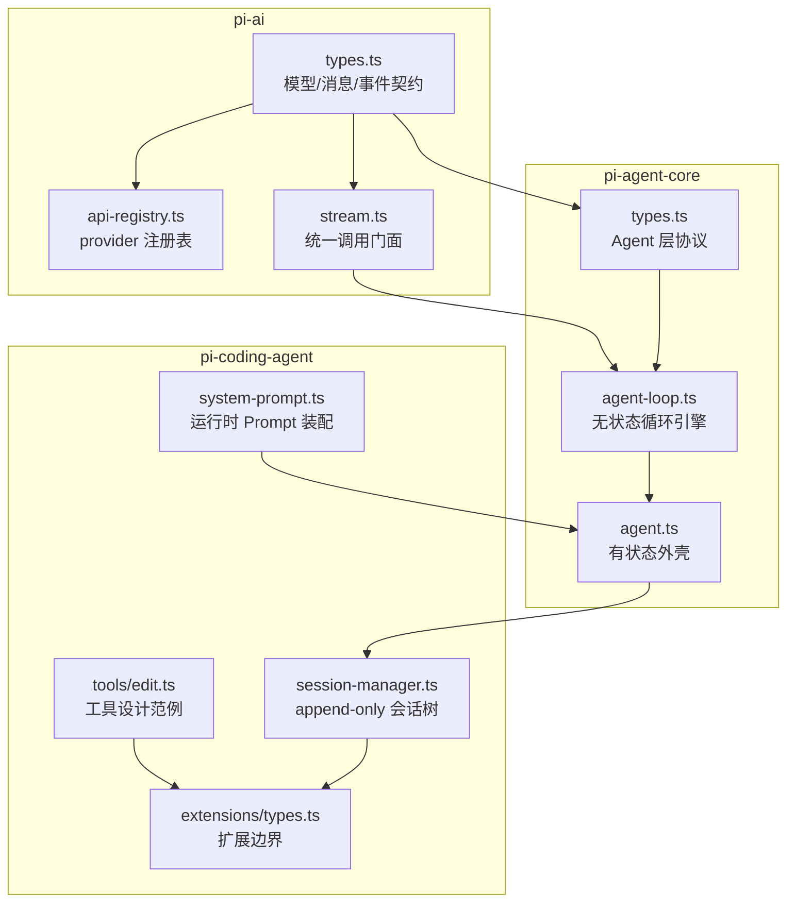
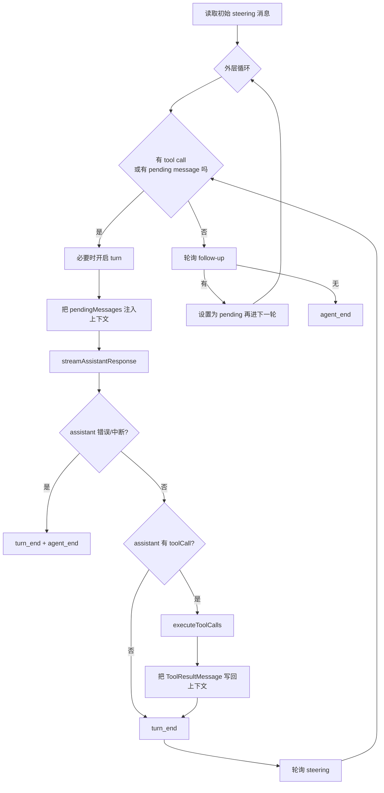
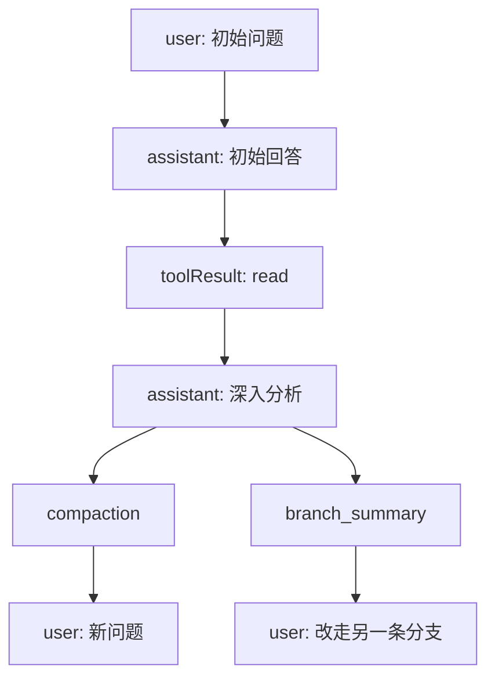

## 第 3 章补充：按 `pi-ai → pi-agent-core → pi-coding-agent` 深读“先读的 10 个文件”

这篇文档是对 `pi-book/src/ch03-reading-map.md` 的补充，不替代源码，但目标是让你在进入实现细节之前，先把这 10 个文件里的**协议、边界、消费关系和设计重心**尽量读完整。

和原表不同，本文**不按优先级表的列出顺序**展开，而是按依赖方向重排为：

1. `pi-ai`：先看最底层的模型 / 消息 / 事件 / provider 路由协议
2. `pi-agent-core`：再看如何把这些协议组织成无状态循环和有状态 agent
3. `pi-coding-agent`：最后看产品层如何持久化会话、构造 system prompt、暴露工具与扩展 API

如果把整个系统看成一条向上的搭建链，可以先记住下面这张图：



---

## 这 10 个文件在本文中的位置

| 层级 | 文件 | 在系统里的角色 | 读完后你会掌握什么 |
| --- | --- | --- | --- |
| `pi-ai` | `packages/ai/src/types.ts` | 最底层公共协议 | 什么是模型、消息、工具、事件流 |
| `pi-ai` | `packages/ai/src/api-registry.ts` | provider 注册表 | provider 是如何被按 `api` 路由的 |
| `pi-ai` | `packages/ai/src/stream.ts` | 对外调用门面 | 上层到底如何“发起一次 LLM 调用” |
| `pi-agent-core` | `packages/agent/src/types.ts` | Agent 层 schema | loop、tool、event、state 的公共形状 |
| `pi-agent-core` | `packages/agent/src/agent-loop.ts` | 无状态循环引擎 | 一轮 agent 如何流式出字、调工具、继续下一轮 |
| `pi-agent-core` | `packages/agent/src/agent.ts` | 有状态壳 | 状态、队列、订阅、abort 在哪里被管理 |
| `pi-coding-agent` | `packages/coding-agent/src/core/session-manager.ts` | 会话树 + JSONL 持久化 | 为什么 pi 的对话可以分叉、压缩、恢复 |
| `pi-coding-agent` | `packages/coding-agent/src/core/system-prompt.ts` | Prompt 装配器 | system prompt 为什么是运行时产物 |
| `pi-coding-agent` | `packages/coding-agent/src/core/tools/edit.ts` | 工具范例 | 一个内置工具如何定义 schema、执行、渲染 |
| `pi-coding-agent` | `packages/coding-agent/src/core/extensions/types.ts` | 扩展边界总表 | extension 能做什么、不能做什么 |

---

## 一、`pi-ai`：先把最底层协议读明白

`pi-ai` 这一层基本不关心 TUI、会话树、slash command，也不关心具体产品交互。它关心的是：

- 模型是什么
- 发给模型的上下文长什么样
- 模型如何把回答以事件流形式吐出来
- 不同 provider 如何挂接到统一入口上

### 1. `packages/ai/src/types.ts`

### 你会看到什么

这是 `pi-ai` 的总协议文件。它没有 HTTP 请求细节，也没有 provider 特有实现；它做的是**给整个上层世界提供共同语言**。

读这个文件时，你会先后遇到 6 组东西：

1. **provider / api 标识**：`KnownApi`、`Api`、`KnownProvider`、`Provider`
2. **调用选项**：`StreamOptions`、`SimpleStreamOptions`、`ThinkingBudgets`
3. **内容块与消息协议**：`TextContent`、`ThinkingContent`、`ImageContent`、`ToolCall`、`UserMessage`、`AssistantMessage`、`ToolResultMessage`
4. **工具与上下文协议**：`Tool`、`Context`
5. **流式事件协议**：`AssistantMessageEvent`
6. **模型元数据与兼容层**：`Model<TApi>`、`OpenAICompletionsCompat`、`OpenRouterRouting` 等

### 1.1 provider / api 标识：`KnownApi`、`Api`、`KnownProvider`、`Provider`

- `KnownApi`：内置支持的 API 协议名，例如 `"anthropic-messages"`、`"openai-responses"`、`"google-vertex"`
- `Api`：`KnownApi | (string & {})`
  - 关键点在后半段，它意味着 **API 标识是开放的**
  - 这让 extension 或外部 provider 可以注册自定义协议，而不是只能用内置枚举
- `KnownProvider`：更偏“厂商或接入源”维度，如 `"anthropic"`、`"openai"`、`"github-copilot"`
- `Provider`：`KnownProvider | string`
  - 同样保持开放，允许自定义 provider 名称

这里的一个重要设计是：

- `api` 决定**调用协议 / 路由方式**
- `provider` 决定**模型来自谁 / 显示给用户时怎么标识**

两者经常相关，但不强行等同。

### 1.2 调用选项：`ThinkingBudgets`、`StreamOptions`、`SimpleStreamOptions`

#### `ThinkingBudgets`

| 字段 | 作用 |
| --- | --- |
| `minimal` | `minimal` 推理等级对应的 token 预算 |
| `low` | `low` 推理等级对应的 token 预算 |
| `medium` | `medium` 推理等级对应的 token 预算 |
| `high` | `high` 推理等级对应的 token 预算 |

它只描述“预算”，不描述“是否启用”。是否启用由 `reasoning` / `ThinkingLevel` 决定。

#### `StreamOptions`

这是所有 provider 共享的基础调用参数。

| 字段 | 作用 | 上游 / 下游如何消费 |
| --- | --- | --- |
| `temperature?` | 采样温度 | provider 在构造请求体时读取 |
| `maxTokens?` | 输出 token 上限 | provider 转成各家 API 的最大输出字段 |
| `signal?` | 中断信号 | provider 和更上层 loop 都应尊重它 |
| `apiKey?` | 本次调用使用的密钥 | 可被 `agent-loop` 或 model registry 动态注入 |
| `transport?` | 希望使用的传输方式：`sse` / `websocket` / `auto` | 支持多传输的 provider 可据此选链路 |
| `cacheRetention?` | prompt cache 保留偏好：`none` / `short` / `long` | 由 provider 映射到各自的缓存语义 |
| `sessionId?` | 可选的会话标识 | 支持 session-aware cache / 路由的 provider 可使用 |
| `onPayload?` | 在请求真正发出前查看或替换 payload 的钩子 | coding-agent 的 extension 可以借此改写 provider 请求 |
| `headers?` | 额外 HTTP 请求头 | 支持 HTTP header 的 provider 会 merge 进去 |
| `maxRetryDelayMs?` | 允许 provider 接受的最大服务器建议重试延迟 | 超出后直接失败，让上层有可见错误 |
| `metadata?` | 额外元数据 | provider 自取自用，不认识的字段忽略 |

#### `SimpleStreamOptions`

`SimpleStreamOptions` 在 `StreamOptions` 之上增加两项：

| 字段 | 作用 |
| --- | --- |
| `reasoning?` | 统一的推理等级请求 |
| `thinkingBudgets?` | 针对不同推理等级的预算覆盖 |

它的定位不是“最强能力集合”，而是“跨 provider 可统一表达的公共子集”。

### 1.3 `StreamFunction<TApi, TOptions>`：整个 `pi-ai` 的函数契约核心

```ts
type StreamFunction<TApi extends Api, TOptions extends StreamOptions> = (
  model: Model<TApi>,
  context: Context,
  options?: TOptions,
) => AssistantMessageEventStream;
```

这里有三个关键约束：

- 第一个参数必须是某个 `Model<TApi>`
- 第二个参数必须是统一格式的 `Context`
- 返回值必须是 `AssistantMessageEventStream`

源码注释强调了更重要的一点：

- **一旦函数返回了 stream，错误应被编码进 stream，而不是通过 throw 抛出**
- 错误结束时必须产出 `stopReason: "error" | "aborted"` 的 `AssistantMessage`

这条约束是后面 `agent-loop.ts` 能“只消费事件流、不为每个 provider 写特判”的前提。

### 1.4 内容块与消息协议

#### `TextSignatureV1`

| 字段 | 作用 |
| --- | --- |
| `v` | 版本号，当前固定为 `1` |
| `id` | 这段文本内容的上游标识 |
| `phase?` | 文本所处阶段，例如 `commentary` 或 `final_answer` |

它不是所有 provider 都用，但它告诉你：pi-ai 的文本块可以携带 provider 自己的追踪签名。

#### `TextContent`

| 字段 | 作用 |
| --- | --- |
| `type` | 固定为 `"text"` |
| `text` | 文本内容 |
| `textSignature?` | 文本块的 provider 侧签名或元数据 |

#### `ThinkingContent`

| 字段 | 作用 |
| --- | --- |
| `type` | 固定为 `"thinking"` |
| `thinking` | reasoning / thinking 的可见内容 |
| `thinkingSignature?` | 上游 provider 的 reasoning item ID 或加密载荷 |
| `redacted?` | 表示 thinking 已被安全策略裁剪，但签名仍可回传上游维持多轮连续性 |

#### `ImageContent`

| 字段 | 作用 |
| --- | --- |
| `type` | 固定为 `"image"` |
| `data` | base64 编码图片数据 |
| `mimeType` | 图片类型，例如 `image/png` |

#### `ToolCall`

| 字段 | 作用 |
| --- | --- |
| `type` | 固定为 `"toolCall"` |
| `id` | 这次工具调用的唯一标识 |
| `name` | 工具名 |
| `arguments` | 工具参数对象 |
| `thoughtSignature?` | 某些 provider 用于延续 thought / reasoning 上下文的 opaque 签名 |

#### `Usage`

`Usage` 既是 token 统计，也是成本统计。

| 字段 | 作用 |
| --- | --- |
| `input` | 输入 token 数 |
| `output` | 输出 token 数 |
| `cacheRead` | cache read token 数 |
| `cacheWrite` | cache write token 数 |
| `totalTokens` | 总 token 数 |
| `cost.input` | 输入成本 |
| `cost.output` | 输出成本 |
| `cost.cacheRead` | cache read 成本 |
| `cost.cacheWrite` | cache write 成本 |
| `cost.total` | 总成本 |

#### `StopReason`

可选值为：

- `stop`：正常停止
- `length`：达到长度上限
- `toolUse`：模型要求调用工具
- `error`：错误终止
- `aborted`：被取消

#### `UserMessage`

| 字段 | 作用 |
| --- | --- |
| `role` | 固定为 `"user"` |
| `content` | 纯字符串，或 `TextContent | ImageContent` 数组 |
| `timestamp` | 毫秒时间戳 |

#### `AssistantMessage`

这是最关键的一种消息。

| 字段 | 作用 | 为什么重要 |
| --- | --- | --- |
| `role` | 固定为 `"assistant"` | 标识来源 |
| `content` | `TextContent | ThinkingContent | ToolCall` 数组 | 一个 assistant turn 既可吐文本，也可吐 thinking，也可提出工具调用 |
| `api` | 本次回答实际使用的 API 协议 | 便于调试 / 恢复 / provider 特定处理 |
| `provider` | 模型提供方 | UI 展示与后续选择模型时可用 |
| `model` | 实际模型 ID | 后续恢复上下文时可推断模型 |
| `responseId?` | 上游返回的响应 ID | 某些 provider 的续写 / 追踪需要 |
| `usage` | token / cost 统计 | 所有上层统计都依赖它 |
| `stopReason` | 停止原因 | agent-loop 判断是否继续调工具、是否错误结束都依赖它 |
| `errorMessage?` | 错误文案 | 错误路径下展示给用户 |
| `timestamp` | 毫秒时间戳 | 会话恢复和排序时需要 |

#### `ToolResultMessage<TDetails>`

| 字段 | 作用 |
| --- | --- |
| `role` | 固定为 `"toolResult"` |
| `toolCallId` | 对应哪一次 `ToolCall.id` |
| `toolName` | 对应工具名 |
| `content` | 回给模型看的文本 / 图片内容 |
| `details?` | 给 UI、日志、扩展看的结构化细节，不一定发回模型 |
| `isError` | 这次工具结果是否应被当成错误 |
| `timestamp` | 时间戳 |

最后，`Message = UserMessage | AssistantMessage | ToolResultMessage`。

这意味着在 `pi-ai` 看来，模型上下文里真正重要的只有三类角色：

- 用户
- 助手
- 工具结果

上层若有更多消息类型，必须自己决定如何映射回这三类之一。

### 1.5 工具与上下文协议：`Tool`、`Context`

#### `Tool<TParameters>`

| 字段 | 作用 |
| --- | --- |
| `name` | 工具名，给模型调用时用 |
| `description` | 给模型看的说明 |
| `parameters` | TypeBox schema，定义参数形状 |

#### `Context`

| 字段 | 作用 |
| --- | --- |
| `systemPrompt?` | 本轮调用的 system prompt |
| `messages` | 当前对话上下文 |
| `tools?` | 当前可用工具列表 |

`Context` 是非常重要的“统一截面”：上层在进入 provider 前，所有个性化消息系统、事件系统、会话系统，最终都要折叠成这个形状。

### 1.6 流式事件协议：`AssistantMessageEvent`

这套协议定义了一个 assistant 回答是如何渐进生成出来的。

| 事件 | 含义 |
| --- | --- |
| `start` | assistant turn 开始，携带初始 partial message |
| `text_start` | 某个文本块开始 |
| `text_delta` | 文本块增量 |
| `text_end` | 文本块结束 |
| `thinking_start` | thinking 块开始 |
| `thinking_delta` | thinking 增量 |
| `thinking_end` | thinking 块结束 |
| `toolcall_start` | 工具调用块开始 |
| `toolcall_delta` | 工具调用参数增量 |
| `toolcall_end` | 工具调用块结束，给出完整 `ToolCall` |
| `done` | 正常完成，给出最终 `AssistantMessage` |
| `error` | 错误或中断完成，给出最终错误消息 |

源码注释明确规定了协议顺序：

- 先有 `start`
- 中间是各种 partial update
- 最终必须以 `done` 或 `error` 终止

这就是 `AssistantMessageEventStream.result()` 能够安全拿到最终消息的原因。

### 1.7 兼容层与路由偏好：`OpenAICompletionsCompat`、`OpenRouterRouting`、`VercelGatewayRouting`

这组类型不是每次阅读都会用到，但如果你关心“为什么 `pi-ai` 能把统一接口翻译成不同厂商的微差异请求”，这里是关键。

#### `OpenAICompletionsCompat`

| 字段 | 作用 |
| --- | --- |
| `supportsStore?` | provider 是否支持 `store` 字段 |
| `supportsDeveloperRole?` | 是否支持 `developer` 角色而不是 `system` |
| `supportsReasoningEffort?` | 是否支持 `reasoning_effort` |
| `reasoningEffortMap?` | `ThinkingLevel` 到 provider 特定 effort 值的映射 |
| `supportsUsageInStreaming?` | streaming 时是否能拿 usage |
| `maxTokensField?` | 最大 token 对应使用哪个字段名 |
| `requiresToolResultName?` | tool result 是否必须带 `name` |
| `requiresAssistantAfterToolResult?` | tool result 后是否必须插一个 assistant 消息 |
| `requiresThinkingAsText?` | thinking 是否必须被转成 `<thinking>` 包裹的文本 |
| `thinkingFormat?` | reasoning/thinking 参数的格式变体 |
| `openRouterRouting?` | OpenRouter 专用路由偏好 |
| `vercelGatewayRouting?` | Vercel AI Gateway 专用路由偏好 |
| `zaiToolStream?` | z.ai 是否支持顶层 `tool_stream` |
| `supportsStrictMode?` | tool 定义中是否支持 `strict` |

#### `OpenRouterRouting`

这部分字段很多，但本质上都在表达“把 OpenRouter 作为多上游代理时，希望如何选路”。

| 字段 | 作用 |
| --- | --- |
| `allow_fallbacks?` | 是否允许备用 provider |
| `require_parameters?` | 是否只保留完全支持当前参数的 provider |
| `data_collection?` | 数据收集策略 |
| `zdr?` | 是否只走零数据保留端点 |
| `enforce_distillable_text?` | 是否限制为可蒸馏文本模型 |
| `order?` | 按顺序尝试 provider 列表 |
| `only?` | 只允许某些 provider |
| `ignore?` | 跳过某些 provider |
| `quantizations?` | 量化过滤 |
| `sort?` | 排序偏好 |
| `max_price?` | 价格上限 |
| `preferred_min_throughput?` | 最低吞吐偏好 |
| `preferred_max_latency?` | 最高延迟偏好 |

#### `VercelGatewayRouting`

| 字段 | 作用 |
| --- | --- |
| `only?` | 只允许某些 provider |
| `order?` | 指定 provider 尝试顺序 |

### 1.8 `Model<TApi>`：一切最终都落到这里

| 字段 | 作用 |
| --- | --- |
| `id` | 模型 ID |
| `name` | 展示名 |
| `api` | 调用时使用哪种协议 |
| `provider` | 提供方名称 |
| `baseUrl` | 接口基地址 |
| `reasoning` | 是否支持 reasoning / thinking |
| `input` | 支持哪些输入类型：文本、图片 |
| `cost` | 成本单价表 |
| `contextWindow` | 上下文窗口大小 |
| `maxTokens` | 最大输出 token |
| `headers?` | 该模型默认附带的 header |
| `compat?` | 仅特定 `api` 下有效的兼容覆盖项 |

### 1.9 它被哪些文件消费

- `packages/ai/src/api-registry.ts`
  - 读取 `Api`、`Model<TApi>`、`StreamFunction`
- `packages/ai/src/stream.ts`
  - 读取 `Context`、`AssistantMessage`、`SimpleStreamOptions`
- `packages/agent/src/types.ts`
  - 把 `Message`、`Tool`、`AssistantMessageEvent` 嵌进更高层 agent 协议
- 所有 provider 实现
  - 直接基于这些类型把 HTTP/SDK 返回转换成统一协议
- `packages/coding-agent/src/core/extensions/types.ts`
  - 让 extension 能注册 provider、读写模型、处理 tool / assistant 事件

### 1.10 真实字面量示例

#### 一个 `Model`

```ts
const model = {
  id: "claude-sonnet-4-5",
  name: "Claude Sonnet 4.5",
  api: "anthropic-messages",
  provider: "anthropic",
  baseUrl: "https://api.anthropic.com",
  reasoning: true,
  input: ["text", "image"],
  cost: { input: 3, output: 15, cacheRead: 0.3, cacheWrite: 3.75 },
  contextWindow: 200000,
  maxTokens: 64000,
};
```

#### 一个 `Context`

```ts
const context = {
  systemPrompt: "You are a careful coding assistant.",
  messages: [
    { role: "user", content: "Summarize this file.", timestamp: Date.now() },
  ],
  tools: [
    {
      name: "read_file",
      description: "Read one file from disk",
      parameters: Type.Object({ path: Type.String() }),
    },
  ],
};
```

#### 一个带 tool call 的 `AssistantMessage`

```ts
const assistantMessage = {
  role: "assistant",
  content: [
    { type: "text", text: "我需要先读取文件。" },
    { type: "toolCall", id: "call_1", name: "read_file", arguments: { path: "README.md" } },
  ],
  api: "anthropic-messages",
  provider: "anthropic",
  model: "claude-sonnet-4-5",
  usage: {
    input: 1200,
    output: 80,
    cacheRead: 0,
    cacheWrite: 0,
    totalTokens: 1280,
    cost: { input: 0.0036, output: 0.0012, cacheRead: 0, cacheWrite: 0, total: 0.0048 },
  },
  stopReason: "toolUse",
  timestamp: Date.now(),
};
```

### 1.11 读这个文件时最该注意什么

最重要的不是记住每个字段，而是记住两件事：

1. **`Context` 是 provider 边界处的统一世界**：上层不管多复杂，到了这里都要变成 `systemPrompt + messages + tools`
2. **`AssistantMessageEvent` 是整个流式系统的基石**：没有这套协议，`agent-loop`、TUI、扩展系统就都得理解每家 provider 的私有增量格式

---

### 2. `packages/ai/src/api-registry.ts`

### 你会看到什么

这是一个非常小、但非常关键的 provider 注册表。它的职责只有一句话：

> 把 `api` 字符串映射到对应的 `stream` / `streamSimple` 实现。

它没有网络逻辑、没有模型逻辑、没有消息转换逻辑。它只负责：

- 定义注册时的强类型约束
- 把这些约束擦成内部统一形状
- 提供查表与清理能力

### 2.1 关键类型

#### `ApiStreamFunction`

```ts
(model: Model<Api>, context: Context, options?: StreamOptions) => AssistantMessageEventStream
```

它是“注册表内部通用函数签名”。注意这里的 `Model<Api>` 是**泛型擦除后的统一入口**，不再保留某个 provider 的精确 `TApi`。

#### `ApiProvider<TApi, TOptions>`

| 字段 | 作用 |
| --- | --- |
| `api` | 该 provider 负责的协议名 |
| `stream` | provider 特定 options 版本的 stream 函数 |
| `streamSimple` | 统一 `SimpleStreamOptions` 版本的 stream 函数 |

它是**注册阶段的静态约束**：`api`、`stream` 第一个参数里的 `model.api`、`streamSimple` 第一个参数里的 `model.api`，在类型上必须绑定到同一个 `TApi`。

#### `ApiProviderInternal`

| 字段 | 作用 |
| --- | --- |
| `api` | 协议名 |
| `stream` | 统一签名的内部 stream 函数 |
| `streamSimple` | 统一签名的内部 simple stream 函数 |

它的作用不是增加新语义，而是让 `Map<string, ...>` 能存异构 provider。

### 2.2 `apiProviderRegistry`

```ts
const apiProviderRegistry = new Map<string, RegisteredApiProvider>();
```

这里的 key 直接就是 `provider.api`。因此：

- 同一个 `api` 只能有一个当前实现
- 后注册会覆盖先注册
- 这给“扩展 provider 覆盖内置 provider”留出了空间

### 2.3 `wrapStream()` / `wrapStreamSimple()`：泛型擦除后的安全补偿

两个函数都做同一件事：

1. 把窄签名 `StreamFunction<TApi, TOptions>` 包成宽签名 `ApiStreamFunction`
2. 在运行时检查 `model.api === api`

参数说明：

| 参数 | 作用 |
| --- | --- |
| `api` | 注册时声明的协议名 |
| `stream` / `streamSimple` | 原始 provider 函数 |

返回值：

- 一个内部统一签名的函数

为什么必须这样做？因为注册表要同时存：

- `StreamFunction<"anthropic-messages", AnthropicOptions>`
- `StreamFunction<"openai-responses", OpenAIResponsesOptions>`
- `StreamFunction<"google-vertex", GoogleVertexOptions>`

这些函数不能直接无损放进同一个 `Map<string, V>` 的 `V` 里，只能入库前先“擦成统一形状”，再用运行时检查守住边界。

### 2.4 `registerApiProvider(provider, sourceId?)`

| 参数 | 作用 |
| --- | --- |
| `provider` | 待注册的 provider 定义 |
| `sourceId?` | 可选来源 ID，便于批量反注册 |

它做 3 件事：

1. 把 `provider.stream` 包成内部统一签名
2. 把 `provider.streamSimple` 包成内部统一签名
3. 写入 `apiProviderRegistry`

### 2.5 读取与清理函数

#### `getApiProvider(api)`

- 按 `api` 查出对应 provider
- 返回 `ApiProviderInternal | undefined`

#### `getApiProviders()`

- 返回所有已注册 provider
- 常用于调试、测试或列举当前注册表状态

#### `unregisterApiProviders(sourceId)`

- 删除所有 `entry.sourceId === sourceId` 的 provider
- 对扩展系统尤其重要：一个 extension 可能注册多个 provider，卸载时只需要用自己的 `sourceId` 批量清掉

#### `clearApiProviders()`

- 清空整个注册表
- 主要被测试和 `resetApiProviders()` 消费

### 2.6 它被哪些模块消费

- `packages/ai/src/stream.ts`
  - 在统一入口里查表
- `packages/ai/src/providers/register-builtins.ts`
  - 在模块加载时注册内置 provider
- 扩展 / 自定义 provider 路径
  - 最终也会走到“往 registry 填表”这一步

### 2.7 真实调用场景示例

```ts
registerApiProvider({
  api: "anthropic-messages",
  stream: streamAnthropic,
  streamSimple: streamSimpleAnthropic,
});
```

这段字面量之所以重要，不在于它“看起来很简单”，而在于它说明整个 provider 系统的最小挂接面其实只有三项：

- 一个 `api` 标识
- 一个完整版 `stream`
- 一个简化版 `streamSimple`

### 2.8 读这个文件时最该注意什么

这不是一个“功能多”的文件，而是一个“架构地位高”的文件。它体现了两个设计选择：

1. **provider 路由由字符串决定，而不是由类层次决定**
2. **注册表尽量保持无知识**：不理解 Anthropic，也不理解 OpenAI，只做映射

---

### 3. `packages/ai/src/stream.ts`

### 你会看到什么

这是整个 `pi-ai` 对上层暴露的公共门面。对于绝大多数上层模块来说，它们不需要知道：

- provider 是怎么注册的
- 是否做了懒加载
- 真实实现文件在哪

它们只需要知道：

- 调 `stream()` 或 `streamSimple()`
- 得到一个 `AssistantMessageEventStream`

### 3.1 第一行为什么极其重要

```ts
import "./providers/register-builtins.js";
```

这是一个纯副作用导入。作用只有一个：

- 保证内置 provider 在模块初始化时就注册进 registry

如果没有这一行，`resolveApiProvider(model.api)` 查表时会发现注册表为空。

### 3.2 `resolveApiProvider(api)`

| 参数 | 作用 |
| --- | --- |
| `api` | 希望使用的 API 协议 |

行为：

- 调用 `getApiProvider(api)`
- 若没找到则直接抛错：`No API provider registered for api: ...`

注意这个错误是**在还没进入 stream 之前**抛出的，因为这里连 provider 都没找到，不属于“provider 运行中错误编码进 stream”的范畴。

### 3.3 四个对外函数

#### `stream(model, context, options?)`

| 参数 | 作用 |
| --- | --- |
| `model` | 使用哪个模型 |
| `context` | 发给模型的上下文 |
| `options?` | provider 特定扩展选项 |

返回：`AssistantMessageEventStream`

工作流程：

1. 按 `model.api` 查 provider
2. 调用 `provider.stream(model, context, options)`

#### `complete(model, context, options?)`

等价于：

```ts
const s = stream(model, context, options);
return s.result();
```

适合不关心增量事件、只关心最终完整 `AssistantMessage` 的调用方。

#### `streamSimple(model, context, options?)`

与 `stream()` 类似，但只暴露统一抽象的 `SimpleStreamOptions`。

#### `completeSimple(model, context, options?)`

等价于：

```ts
const s = streamSimple(model, context, options);
return s.result();
```

### 3.4 它被哪些模块消费

最直接的消费方是 `packages/agent/src/agent-loop.ts`：

- `agent-loop.ts` 默认用 `streamSimple`
- 这样上层只表达 reasoning、sessionId、transport 这类统一语义
- provider 自己负责把这些统一语义翻译成各家 API 能理解的字段

### 3.5 真实调用场景示例

```ts
const response = streamSimple(model, {
  systemPrompt: "You are a careful coding assistant.",
  messages: [{ role: "user", content: "Read README and summarize.", timestamp: Date.now() }],
  tools: [],
}, {
  reasoning: "medium",
  sessionId: "sess_123",
  transport: "sse",
});

for await (const event of response) {
  if (event.type === "text_delta") {
    process.stdout.write(event.delta);
  }
}

const finalMessage = await response.result();
```

### 3.6 读这个文件时最该注意什么

`stream.ts` 的价值不在“复杂实现”，而在“把复杂性都藏住”。它是一个非常标准的门面层：

- 对外给统一接口
- 对内做 provider 路由
- 调用者无需知道任何具体厂商差异

---

## 二、`pi-agent-core`：把协议变成可运行的 agent

`pi-agent-core` 的工作不是定义 provider 协议，而是把 `pi-ai` 提供的：

- 统一消息协议
- 统一事件流协议
- 统一 tool 协议

进一步组织成：

- agent loop
- 有状态 agent
- tool 生命周期和 hook 点

### 4. `packages/agent/src/types.ts`

### 你会看到什么

这个文件是 `pi-agent-core` 的 schema 总表。读完它之后，你应该清楚：

- agent 运行时需要什么配置
- 工具长什么样
- loop 会发出哪些事件
- `Agent` 暴露给产品层的 state 是什么

### 4.1 `StreamFn`

它直接复用了 `pi-ai` 的 `streamSimple` 签名：

- 参数与 `streamSimple` 一致
- 返回值也与 `streamSimple` 一致

它的意义在于：

- `agent-loop.ts` 默认用 `pi-ai` 提供的 `streamSimple`
- 但测试或特殊场景可以把 `streamFn` 换成别的实现

### 4.2 `ToolExecutionMode`

| 值 | 含义 |
| --- | --- |
| `sequential` | 每个 tool call 严格串行：准备、执行、收尾都做完再做下一个 |
| `parallel` | 先顺序做 preflight / prepare，再允许多个工具并发执行，最终结果仍按 assistant 原顺序发出 |

这直接影响多工具调用时的并发语义。

### 4.3 `BeforeToolCallResult` / `AfterToolCallResult`

#### `BeforeToolCallResult`

| 字段 | 作用 |
| --- | --- |
| `block?` | 为 `true` 时阻止工具执行 |
| `reason?` | 阻止时回给模型 / UI 的说明 |

#### `AfterToolCallResult`

| 字段 | 作用 |
| --- | --- |
| `content?` | 覆盖工具回给模型的内容 |
| `details?` | 覆盖结构化 details |
| `isError?` | 覆盖错误标记 |

源码注释特意说明了它的合并语义：

- 不是深合并
- 提供哪个字段就整项替换哪个字段
- 不提供的字段保持原值

### 4.4 `BeforeToolCallContext` / `AfterToolCallContext`

这两个 context 是给 hook 用的。

#### `BeforeToolCallContext`

| 字段 | 作用 |
| --- | --- |
| `assistantMessage` | 发起工具调用的 assistant 消息 |
| `toolCall` | assistant 内容里的原始 `ToolCall` 块 |
| `args` | 已经按 schema 校验过的参数 |
| `context` | 当前 agent 上下文快照 |

#### `AfterToolCallContext`

比 `BeforeToolCallContext` 多三项：

| 字段 | 作用 |
| --- | --- |
| `result` | 工具原始执行结果 |
| `isError` | 当前是否被视为错误 |
| `context` | 执行完成时的上下文 |

### 4.5 `AgentLoopConfig`

这是 `agent-loop.ts` 最核心的配置对象。

| 字段 | 作用 | 谁消费它 |
| --- | --- | --- |
| `model` | 当前模型 | `streamAssistantResponse()` 里真正发请求时使用 |
| `convertToLlm` | 把 `AgentMessage[]` 转成 `Message[]` | loop 在每次调用 LLM 前调用 |
| `transformContext?` | 在 `convertToLlm` 前对上下文做加工 | 常用于裁剪上下文、注入额外内容 |
| `getApiKey?` | 动态取 API key | 长运行场景里处理短期令牌 |
| `getSteeringMessages?` | 取中途插入的 steering 消息 | inner loop 每轮之后轮询 |
| `getFollowUpMessages?` | 取 agent 本来要停时才处理的 follow-up 消息 | outer loop 停止前轮询 |
| `toolExecution?` | 多 tool call 并发策略 | `executeToolCalls()` 消费 |
| `beforeToolCall?` | 工具执行前 hook | `prepareToolCall()` 消费 |
| `afterToolCall?` | 工具执行后 hook | `finalizeExecutedToolCall()` 消费 |
| `reasoning?` 等继承字段 | 来自 `SimpleStreamOptions` | 最终透传给 `streamSimple` |

源码注释对 `convertToLlm` 和 `transformContext` 都特别强调：

- **尽量不要 throw**
- 返回安全 fallback 比直接抛异常更符合 loop 设计

因为 loop 把大多数失败都设计成“消息 / 事件流内可见错误”，而不是直接中断整条控制流。

### 4.6 `ThinkingLevel`（agent 层版本）

这里比 `pi-ai` 多了一个：

- `off`

这不是 provider 协议本身的一部分，而是 agent / 产品层的“用户意图表达”。

### 4.7 `CustomAgentMessages` 与 `AgentMessage`

- `CustomAgentMessages` 默认是空接口
- 应用层可以用 declaration merging 扩展它
- `AgentMessage = Message | CustomAgentMessages[keyof CustomAgentMessages]`

这说明 `pi-agent-core` 并不把消息系统锁死在 `user / assistant / toolResult` 三种上，而是允许上层引入自定义消息类型；但在真正发给 LLM 前，上层必须自己把它们转回 `pi-ai` 的 `Message`。

### 4.8 `AgentState`

| 字段 | 作用 |
| --- | --- |
| `systemPrompt` | 未来 turn 默认使用的 system prompt |
| `model` | 未来 turn 使用的模型 |
| `thinkingLevel` | 未来 turn 请求的推理等级 |
| `tools` | 当前可用工具数组；setter 会复制顶层数组 |
| `messages` | 当前 transcript；setter 会复制顶层数组 |
| `isStreaming` | 是否正在运行 |
| `streamingMessage?` | 当前流式中的 assistant partial message |
| `pendingToolCalls` | 正在执行中的 tool call ID 集合 |
| `errorMessage?` | 最近一次失败 / 中断的错误文案 |

这里的重点不是字段数量，而是这个 state 已经足够支撑绝大多数 UI：

- 是否忙碌
- 当前 assistant 正在说什么
- 哪些工具在跑
- 最近是否报错

### 4.9 `AgentToolResult<T>`、`AgentToolUpdateCallback<T>`、`AgentTool<TParameters, TDetails>`

#### `AgentToolResult<T>`

| 字段 | 作用 |
| --- | --- |
| `content` | 回给模型看的文本 / 图片内容 |
| `details` | 给 UI / 日志 / 扩展看的结构化结果 |

#### `AgentToolUpdateCallback<T>`

- 工具执行过程中可以用它发送 partial result
- 这些 partial result 不会直接变成 `ToolResultMessage`
- 它们先变成 `tool_execution_update` 事件，供 UI 实时展示

#### `AgentTool<TParameters, TDetails>`

| 字段 | 作用 |
| --- | --- |
| `name` | 工具名 |
| `description` | 给模型看的说明 |
| `parameters` | TypeBox schema |
| `label` | 给 UI 展示的名字 |
| `prepareArguments?` | 执行前兼容 / 预处理参数 |
| `execute` | 真正执行工具调用 |

`prepareArguments` 的意义很重要：

- 它发生在 schema validation 之前
- 适合做老字段兼容、输入标准化
- `tools/edit.ts` 就用它兼容旧版 `oldText/newText` 形式

### 4.10 `AgentContext`

| 字段 | 作用 |
| --- | --- |
| `systemPrompt` | 当前要发给模型的系统提示 |
| `messages` | 当前 transcript（可含 custom message） |
| `tools?` | 当前可用工具 |

### 4.11 `AgentEvent`

这套事件是 UI 与产品层消费 agent 运行时的统一接口。

#### 生命周期事件

| 事件 | 作用 |
| --- | --- |
| `agent_start` | 一次 run 开始 |
| `agent_end` | 一次 run 完成 |
| `turn_start` | 一轮 assistant 响应开始 |
| `turn_end` | 一轮 assistant 响应和工具结果结束 |

#### 消息事件

| 事件 | 作用 |
| --- | --- |
| `message_start` | 一条消息开始 |
| `message_update` | assistant 流式增量更新 |
| `message_end` | 一条消息结束 |

#### 工具事件

| 事件 | 作用 |
| --- | --- |
| `tool_execution_start` | 工具开始执行 |
| `tool_execution_update` | 工具流式更新 |
| `tool_execution_end` | 工具执行结束 |

### 4.12 它被哪些模块消费

- `packages/agent/src/agent-loop.ts`
  - 直接使用几乎全部关键类型
- `packages/agent/src/agent.ts`
  - 实现 `AgentState`、消费 `AgentEvent`
- `packages/coding-agent/src/core/tools/edit.ts`
  - 内置工具最终都要变成 `AgentTool`
- `packages/coding-agent/src/core/extensions/types.ts`
  - 扩展 API 里公开的 tool / event 类型基本都基于这里再包装

### 4.13 真实字面量示例

#### 一个 `AgentTool`

```ts
const helloTool = {
  name: "hello",
  label: "Hello",
  description: "A simple greeting tool",
  parameters: Type.Object({ name: Type.String() }),
  async execute(_toolCallId, params) {
    return {
      content: [{ type: "text", text: `Hello, ${params.name}!` }],
      details: { greeted: params.name },
    };
  },
};
```

#### 一个 `AgentLoopConfig`

```ts
const config = {
  model,
  convertToLlm: (messages) => messages.filter((m) =>
    m.role === "user" || m.role === "assistant" || m.role === "toolResult"),
  transformContext: async (messages) => messages,
  getSteeringMessages: async () => [],
  getFollowUpMessages: async () => [],
  toolExecution: "parallel",
};
```

### 4.14 读这个文件时最该注意什么

这个文件真正定义的是：

- `pi-agent-core` 的**可配置面**
- `pi-agent-core` 的**可观察面**
- `pi-agent-core` 的**可扩展面**

后面 `agent-loop.ts` 和 `agent.ts` 再复杂，也只能在这里定义的边界内活动。

---

### 5. `packages/agent/src/agent-loop.ts`

### 你会看到什么

这是整个 agent 系统的无状态引擎。你会看到一个非常清楚的设计：

- `AgentMessage[]` 是 loop 内部世界
- 只有在真正调用 LLM 的边界上，才把它转换为 `pi-ai` 的 `Message[]`
- assistant 返回后，如果带 `toolCall`，立即执行工具
- 工具结果回写上下文后继续下一轮

这也是为什么源码开头就写着：

> Agent loop that works with AgentMessage throughout. Transforms to Message[] only at the LLM call boundary.

### 5.1 对外入口：`agentLoop()` 与 `agentLoopContinue()`

#### `agentLoop(prompts, context, config, signal?, streamFn?)`

| 参数 | 作用 |
| --- | --- |
| `prompts` | 这次新增的 prompt 消息 |
| `context` | 运行前已有的上下文 |
| `config` | loop 配置 |
| `signal?` | 中断信号 |
| `streamFn?` | 可替换的 stream 实现 |

返回：`EventStream<AgentEvent, AgentMessage[]>`

它做的事情非常薄：

- 创建一个 agent 级别的事件流
- 后台调用 `runAgentLoop()`
- 每发出一个 `AgentEvent` 就 `stream.push(event)`
- 完成后 `stream.end(messages)`

#### `agentLoopContinue(context, config, signal?, streamFn?)`

它和 `agentLoop()` 的区别是：

- 不额外加 prompt
- 从已有上下文直接继续
- 但要求最后一条消息不是 assistant

为什么有这个限制？因为大多数 provider 都要求新一轮请求的最后一条可见消息是：

- 用户消息，或
- 工具结果消息

如果最后一条已经是 assistant，就意味着“你在要求模型对自己的回答直接续写”，这通常不是合法上下文。

### 5.2 `runAgentLoop()` / `runAgentLoopContinue()`

这两个 async 函数是同步版入口的真正实现。

共同点：

- 先发 `agent_start`
- 再发 `turn_start`
- 然后进入 `runLoop()`

区别：

- `runAgentLoop()` 会先把新的 prompt 记入 `currentContext.messages`
- `runAgentLoopContinue()` 则直接从现有上下文起步

### 5.3 `createAgentStream()`

它把 `AgentEvent` 流包装成一个能在 `agent_end` 结束时拿到 `AgentMessage[]` 最终结果的 `EventStream`。

也就是说，`agent-loop` 这层其实延续了 `pi-ai` 的设计：

- 过程靠事件流
- 结果靠 `result()`

### 5.4 核心控制流：`runLoop()`

这是整份文件最重要的函数。可以把它分成“外层 while”与“内层 while”。



#### 外层循环

- 处理“本来要停下来了，但又收到了 follow-up 消息”的情况

#### 内层循环

- 处理“一条 assistant 响应 + 它触发的工具调用 + 期间插入的 steering 消息”

这个分层是很关键的：

- steering 是**当前工作中插队**
- follow-up 是**本来停了再继续**

### 5.5 `streamAssistantResponse()`

这是“真正调用模型”的地方。

参数：

| 参数 | 作用 |
| --- | --- |
| `context` | 当前 agent 上下文 |
| `config` | loop 配置 |
| `signal` | 中断信号 |
| `emit` | 事件下发器 |
| `streamFn?` | 可替代的 stream 函数 |

流程：

1. 若配置了 `transformContext`，先在 `AgentMessage[]` 层面处理上下文
2. 调 `convertToLlm()` 把 `AgentMessage[]` 转成 `Message[]`
3. 构造 `pi-ai` 的 `Context`
4. 解析 API key
5. 调 `streamFunction(config.model, llmContext, ...)`
6. `for await` 消费 `AssistantMessageEvent`
7. 把 partial assistant message 实时写进 `context.messages`
8. 结束时用 `response.result()` 拿最终消息并返回

这里有三个设计非常值得记：

#### 设计点 1：partial assistant message 先进入上下文

当收到 `start` 时，loop 会：

- 把 `event.partial` 放进 `context.messages`
- 发出 `message_start`

之后每个 `text_delta` / `thinking_delta` / `toolcall_delta` 到来时，都是用 `event.partial` 替换最后那条 assistant message。

这意味着：

- UI 可以拿到“不断增长中的 assistant 消息”
- 上层状态始终保留当前最新 partial

#### 设计点 2：done/error 分支里再次用 `response.result()` 归一最终结果

即便已经收到了 `done` 或 `error` 事件，代码仍然会：

```ts
const finalMessage = await response.result();
```

这样做的好处是：

- 统一从 stream 自己的最终结果通道取“最终定稿”
- 避免调用方散落地自己拼终值

#### 设计点 3：API key 是“每次 LLM 调用前动态解析”的

```ts
const resolvedApiKey =
  (config.getApiKey ? await config.getApiKey(config.model.provider) : undefined) || config.apiKey;
```

这直接服务于：

- GitHub Copilot 这类短期 token
- 工具执行时间很长、再次请求时 token 可能已过期的场景

### 5.6 工具执行路径：`executeToolCalls()`

它只是一个分发器：

- `toolExecution === "sequential"` → `executeToolCallsSequential()`
- 否则走 `executeToolCallsParallel()`

### 5.7 `prepareToolCall()`：工具执行前的三道闸

它按顺序做 4 件事：

1. 找工具：`currentContext.tools?.find(...)`
2. 如定义了 `prepareArguments`，先做参数兼容转换
3. 用 `validateToolArguments()` 按 schema 校验参数
4. 如果有 `beforeToolCall`，执行 hook 并允许阻止执行

返回值可能有两类：

- `PreparedToolCall`
  - 表示可以真正执行
- `ImmediateToolCallOutcome`
  - 表示不用执行了，直接得到一个错误 tool result

这也是 loop 里一个很好的设计点：

- “找不到工具”
- “参数校验失败”
- “beforeToolCall 阻止执行”

这些都不通过 throw 直接炸掉一整轮 agent，而是被转换成**可见的 tool error result**。

### 5.8 `executePreparedToolCall()`：真正执行工具

它调用：

```ts
tool.execute(toolCall.id, prepared.args, signal, onUpdate)
```

并把工具运行中的 partial update 转成 `tool_execution_update` 事件。

如果 `execute()` 抛异常，也不会直接中断整个 loop，而是被转换为：

```ts
createErrorToolResult(errorMessage)
```

### 5.9 `finalizeExecutedToolCall()`：收尾与后置覆盖

这里消费 `afterToolCall`：

- 若 hook 返回覆盖项，则替换 `content` / `details` / `isError`
- 然后统一走 `emitToolCallOutcome()` 生成 `ToolResultMessage`

### 5.10 `emitToolCallOutcome()`：把 tool result 变成消息与事件

它做两件事：

1. 发 `tool_execution_end`
2. 构造一个 `ToolResultMessage`，再发 `message_start` / `message_end`

也就是说，在 loop 的世界里，工具结果最终总要落成**一条正式消息**，才能继续参与后续 LLM 上下文。

### 5.11 它被谁消费

- `packages/agent/src/agent.ts`
  - 作为真正的执行内核
- 上层 UI / 产品层
  - 通过 `AgentEvent` 流实时展示状态

### 5.12 真实调用场景示例

```ts
const stream = agentLoop(
  [{ role: "user", content: "Read README and explain", timestamp: Date.now() }],
  { systemPrompt: "You are helpful.", messages: [], tools: [readTool] },
  {
    model,
    convertToLlm: (messages) => messages.filter((m) =>
      m.role === "user" || m.role === "assistant" || m.role === "toolResult"),
    getSteeringMessages: async () => [],
    getFollowUpMessages: async () => [],
    toolExecution: "parallel",
  },
);
```

### 5.13 读这个文件时最该注意什么

这个文件最值得你看清楚的不是某个工具分支，而是：

- **LLM 调用边界只在一处**
- **错误尽量被编码成消息 / 事件，而不是异常扩散**
- **tool result 最终一定落为消息，重新喂回下一轮上下文**

---

### 6. `packages/agent/src/agent.ts`

### 你会看到什么

如果说 `agent-loop.ts` 是无状态引擎，那么 `agent.ts` 就是给应用层用的“有状态薄壳”。

它负责：

- 保存 transcript
- 保存当前模型、工具、thinking level
- 暴露 `prompt()` / `continue()` / `steer()` / `followUp()`
- 管理监听器、abort、运行中状态

### 6.1 顶层辅助结构

#### `defaultConvertToLlm()`

默认只把三类消息发给模型：

- `user`
- `assistant`
- `toolResult`

这和 `pi-ai` 的 `Message` 联合保持一致。

#### `EMPTY_USAGE` / `DEFAULT_MODEL`

它们主要用于失败兜底，尤其是 `handleRunFailure()` 构造错误 assistant message 时。

#### `PendingMessageQueue`

这是 `steering` / `followUp` 队列的内部实现。

| 方法 | 作用 |
| --- | --- |
| `enqueue()` | 入队 |
| `hasItems()` | 是否非空 |
| `drain()` | 按模式取出消息 |
| `clear()` | 清空 |

模式有两种：

- `all`
- `one-at-a-time`

### 6.2 `AgentOptions`

| 字段 | 作用 |
| --- | --- |
| `initialState?` | 初始 state |
| `convertToLlm?` | 覆盖默认消息转换逻辑 |
| `transformContext?` | 每轮请求前加工上下文 |
| `streamFn?` | 替换默认 `streamSimple` |
| `getApiKey?` | 动态解析密钥 |
| `onPayload?` | provider 请求发出前的 payload 钩子 |
| `beforeToolCall?` | 工具执行前 hook |
| `afterToolCall?` | 工具执行后 hook |
| `steeringMode?` | steering 队列 drain 策略 |
| `followUpMode?` | follow-up 队列 drain 策略 |
| `sessionId?` | 透传给 provider 的 session 标识 |
| `thinkingBudgets?` | 推理预算 |
| `transport?` | 传输偏好 |
| `maxRetryDelayMs?` | 最大重试延迟上限 |
| `toolExecution?` | 多 tool call 执行策略 |

### 6.3 `Agent` 的公开职责

#### 状态相关

- `state`
- `signal`
- `steeringMode` / `followUpMode`
- `hasQueuedMessages()`
- `waitForIdle()`

#### 消息驱动相关

- `prompt()`
- `continue()`
- `steer()`
- `followUp()`
- `clearSteeringQueue()`
- `clearFollowUpQueue()`
- `clearAllQueues()`
- `reset()`

#### 生命周期相关

- `subscribe()`
- `abort()`

### 6.4 `prompt()` 与 `continue()` 的区别

#### `prompt()`

- 从文本、单条消息或消息数组发起一次新 prompt
- 若当前已有 active run，会直接报错，要求改用 `steer()` / `followUp()`

#### `continue()`

- 从现有 transcript 继续
- 若最后一条是 assistant，会先尝试消耗队列里的 steering / follow-up
- 如果队列也空，则报错

这个分支很能体现 `Agent` 是“有状态壳”：

- loop 不会自己猜该怎么继续
- `Agent` 结合当前 state 和队列状态，决定是续写、插队，还是拒绝继续

### 6.5 `createLoopConfig()`：`Agent` 如何把自己的状态投影到 `agent-loop`

这是理解两者关系的关键函数。它会把：

- `this._state.model`
- `this._state.thinkingLevel`
- `this.sessionId`
- `this.onPayload`
- `this.transport`
- `this.beforeToolCall`
- `this.afterToolCall`
- `this.convertToLlm`
- `this.transformContext`
- `this.getApiKey`
- 队列 drain 函数

全部组装成 `AgentLoopConfig`。

也就是说：

- `agent-loop` 负责执行
- `Agent` 负责把当前运行时状态**编排成 loop 所需的配置**

### 6.6 `runWithLifecycle()`：一次运行的生命周期壳

它做了几件关键的运行期管理：

1. 创建新的 `AbortController`
2. 设置 `activeRun`
3. 把 `isStreaming` 置为 `true`
4. 清掉旧的 `streamingMessage` 与 `errorMessage`
5. 执行真正的 loop
6. 若抛异常，则走 `handleRunFailure()`
7. 最后在 `finishRun()` 中清理状态

### 6.7 `handleRunFailure()`：把异常转成一条 assistant error message

这是 `Agent` 的重要兜底策略：

- 它不会让产品层只拿到一个裸异常
- 而是会构造一条 `role: "assistant"`、`stopReason: "error" | "aborted"` 的消息
- 再通过 `agent_end` 事件交给上层

这和 `pi-ai`、`agent-loop` 的错误编码策略是一致的。

### 6.8 `processEvents()`：如何把 loop 事件折叠进 state

这是 `Agent` 真正“有状态”的地方。

- `message_start` / `message_update` → 更新 `streamingMessage`
- `message_end` → 把消息写进 transcript
- `tool_execution_start` / `tool_execution_end` → 维护 `pendingToolCalls`
- `turn_end` → 如果 assistant 带 `errorMessage`，记录到 state
- `agent_end` → 清理 `streamingMessage`

处理完内部状态后，它还会按订阅顺序 await 所有 listener。

源码注释特别提醒：

- `agent_end` 虽然是最后一个事件
- 但 agent 真正变 idle，要等所有 `agent_end` listener settle 之后

### 6.9 它被谁消费

`packages/coding-agent/src/core/agent-session.ts` 就是最典型的消费者：

- 它拿 `Agent` 作为底层运行器
- 自己再往上叠加 session、prompt、扩展、资源加载等产品逻辑

### 6.10 真实调用场景示例

```ts
const agent = new Agent({
  initialState: {
    systemPrompt: "You are a careful coding assistant.",
    model,
    tools: [readTool, editTool],
    messages: [],
    thinkingLevel: "medium",
  },
  toolExecution: "parallel",
  sessionId: "sess_123",
});

agent.subscribe((event) => {
  if (event.type === "message_update" && event.assistantMessageEvent.type === "text_delta") {
    process.stdout.write(event.assistantMessageEvent.delta);
  }
});

await agent.prompt("Read README and summarize it.");
```

### 6.11 读这个文件时最该注意什么

`Agent` 不是另一个 loop，它只是把以下职责装进一个对象里：

- 当前状态
- 当前队列
- 当前 abort controller
- 当前监听器集合
- 到 `agent-loop` 的桥接方法

如果你把 `agent-loop` 理解成内核，把 `Agent` 理解成 runtime shell，会更容易读。

---

## 三、`pi-coding-agent`：产品层如何承接底层协议

到了 `pi-coding-agent`，重点开始变化：

- 不再只关心“如何让 agent 跑起来”
- 而是关心“如何让它在产品里长期存在、可恢复、可扩展、可编辑文件、可被 extension 接管部分行为”

### 7. `packages/coding-agent/src/core/session-manager.ts`

### 你会看到什么

这是一个信息密度极高的文件。它定义的不只是“保存聊天记录”，而是一个**append-only 的会话树系统**。

关键词：

- JSONL 持久化
- `id` / `parentId` 形成树
- `leafId` 表示当前光标
- compaction / branch summary 都不是就地修改历史，而是追加新 entry

### 7.1 顶层版本与头部类型

#### `CURRENT_SESSION_VERSION`

- 当前版本常量，源码中是 `3`
- 迁移逻辑依赖它

#### `SessionHeader`

| 字段 | 作用 |
| --- | --- |
| `type` | 固定为 `"session"` |
| `version?` | 会话文件版本，v1 没有该字段 |
| `id` | 会话 ID |
| `timestamp` | 会话创建时间 |
| `cwd` | 会话启动目录 |
| `parentSession?` | 如果是 fork 出来的，会记录父会话文件路径 |

#### `NewSessionOptions`

| 字段 | 作用 |
| --- | --- |
| `id?` | 手动指定 session ID |
| `parentSession?` | 指定父会话路径 |

### 7.2 所有 entry 都继承自 `SessionEntryBase`

| 字段 | 作用 |
| --- | --- |
| `type` | entry 类型 |
| `id` | 当前 entry ID |
| `parentId` | 父 entry ID，形成树结构 |
| `timestamp` | entry 时间戳 |

### 7.3 具体 entry 类型

#### `SessionMessageEntry`

| 字段 | 作用 |
| --- | --- |
| `type` | 固定为 `"message"` |
| `message` | 一条 `AgentMessage` |

#### `ThinkingLevelChangeEntry`

| 字段 | 作用 |
| --- | --- |
| `type` | 固定为 `"thinking_level_change"` |
| `thinkingLevel` | 当前思考等级 |

#### `ModelChangeEntry`

| 字段 | 作用 |
| --- | --- |
| `type` | 固定为 `"model_change"` |
| `provider` | provider 名 |
| `modelId` | 模型 ID |

#### `CompactionEntry<T>`

| 字段 | 作用 |
| --- | --- |
| `type` | 固定为 `"compaction"` |
| `summary` | 压缩摘要文本 |
| `firstKeptEntryId` | 被保留路径中第一条 entry 的 ID |
| `tokensBefore` | 压缩前 token 规模 |
| `details?` | 扩展私有数据 |
| `fromHook?` | 是否来自 extension hook |

#### `BranchSummaryEntry<T>`

| 字段 | 作用 |
| --- | --- |
| `type` | 固定为 `"branch_summary"` |
| `fromId` | 被总结的起点 |
| `summary` | 分支摘要文本 |
| `details?` | 扩展私有数据 |
| `fromHook?` | 是否来自 extension |

#### `CustomEntry<T>`

| 字段 | 作用 |
| --- | --- |
| `type` | 固定为 `"custom"` |
| `customType` | 扩展自定义类型标识 |
| `data?` | 扩展自定义持久化数据 |

它**不参与 LLM 上下文**，只用于会话重载时恢复 extension 状态。

#### `CustomMessageEntry<T>`

| 字段 | 作用 |
| --- | --- |
| `type` | 固定为 `"custom_message"` |
| `customType` | 自定义消息类型标识 |
| `content` | 字符串或文本 / 图片块数组 |
| `details?` | 扩展私有元数据 |
| `display` | 是否展示在 TUI 中 |

它与 `CustomEntry` 的关键区别是：

- `CustomEntry` 不进 LLM 上下文
- `CustomMessageEntry` 会在 `buildSessionContext()` 中转成真正的 custom message，再参与上下文重建

#### `LabelEntry`

| 字段 | 作用 |
| --- | --- |
| `type` | 固定为 `"label"` |
| `targetId` | 被打标签的 entry |
| `label` | 标签文本；为空时表示清除 |

#### `SessionInfoEntry`

| 字段 | 作用 |
| --- | --- |
| `type` | 固定为 `"session_info"` |
| `name?` | 用户定义的会话展示名 |

### 7.4 `SessionContext`、`SessionInfo`、`SessionTreeNode`

#### `SessionContext`

| 字段 | 作用 |
| --- | --- |
| `messages` | 当前 leaf 对应、可发给 LLM 的消息列表 |
| `thinkingLevel` | 当前叶子路径推导出的 thinking level |
| `model` | 当前叶子路径推导出的模型信息 |

#### `SessionInfo`

这是给列表页 / 会话选择器用的聚合视图，包含：

- `path`
- `id`
- `cwd`
- `name?`
- `parentSessionPath?`
- `created`
- `modified`
- `messageCount`
- `firstMessage`
- `allMessagesText`

#### `SessionTreeNode`

它不是持久化格式，而是给树视图消费的只读结构：

- `entry`
- `children`
- `label?`
- `labelTimestamp?`

### 7.5 迁移与解析辅助函数

#### `migrateV1ToV2()`

- 给旧会话补 `id` / `parentId`
- 把 compaction 的 `firstKeptEntryIndex` 升级成 `firstKeptEntryId`

#### `migrateV2ToV3()`

- 把旧的 `hookMessage` role 重命名为 `custom`

#### `parseSessionEntries(content)` / `loadEntriesFromFile(filePath)`

- 从 JSONL 里按行解析 entry
- 会跳过 malformed line
- `loadEntriesFromFile()` 还会检查首行 header 是否真的是 session header

#### `findMostRecentSession(sessionDir)`

- 找最近修改的 `.jsonl` 会话文件
- `SessionManager.continueRecent()` 就靠它工作

### 7.6 `buildSessionContext()`：这份文件最关键的函数

它做的不是简单“把所有 message entry 拿出来”，而是：

1. 从 `leafId` 回溯到根，得到当前路径
2. 顺着路径推导当前 `thinkingLevel` 与 `model`
3. 识别路径中是否出现 `compaction`
4. 如果有 compaction：
   - 先放 compaction summary message
   - 再从 `firstKeptEntryId` 开始恢复保留消息
   - 再追加 compaction 之后的消息
5. 如果没有 compaction：
   - 顺序追加所有 message / custom_message / branch_summary

这一步非常关键，因为它解释了：

- session 文件里可以保存很多“非模型上下文”entry
- 但发给 LLM 的上下文不是简单平铺全部 entry，而是经过**路径选择 + 语义折叠**后的结果

### 7.7 `getDefaultSessionDir(cwd)`

- 把 cwd 编码成安全目录名
- 默认落到 `~/.pi/agent/sessions/<encoded-cwd>/`

它体现了一个产品层选择：

- 会话默认按项目工作目录分桶
- 同一项目的“最近会话”更容易被找回

### 7.8 `SessionManager` 类：按职责分组来看

#### 构造 / 打开 / 工厂

| 方法 | 作用 |
| --- | --- |
| `setSessionFile()` | 切换到一个会话文件 |
| `newSession()` | 初始化新会话 |
| `create()` | 创建持久化新会话 |
| `open()` | 打开指定会话文件 |
| `continueRecent()` | 继续最近会话，没有就新建 |
| `inMemory()` | 创建纯内存会话 |
| `forkFrom()` | 从另一个项目目录 fork 会话 |

#### 基本读取

| 方法 | 作用 |
| --- | --- |
| `getCwd()` | 当前会话 cwd |
| `getSessionDir()` | 会话目录 |
| `getSessionId()` | 会话 ID |
| `getSessionFile()` | 会话文件路径 |
| `getLeafId()` / `getLeafEntry()` | 当前叶子 |
| `getEntry(id)` | 按 ID 取 entry |
| `getLabel(id)` | 取标签 |
| `getBranch(fromId?)` | 从某点回溯到根 |
| `getHeader()` | 读 header |
| `getEntries()` | 所有非 header entry |
| `getTree()` | 树状结构 |
| `getSessionName()` | 取最新 session 名称 |

#### 追加型写入

| 方法 | 作用 |
| --- | --- |
| `appendMessage()` | 追加普通消息 |
| `appendThinkingLevelChange()` | 追加 thinking level 变化 |
| `appendModelChange()` | 追加模型切换 |
| `appendCompaction()` | 追加压缩摘要 |
| `appendCustomEntry()` | 追加纯扩展状态 entry |
| `appendSessionInfo()` | 追加会话元信息 |
| `appendCustomMessageEntry()` | 追加进入 LLM 上下文的扩展消息 |
| `appendLabelChange()` | 追加标签变化 |

关键点：这些写入**全是 append-only**。不会改历史、不做原地更新。

#### 分支与导航

| 方法 | 作用 |
| --- | --- |
| `branch(branchFromId)` | 把 leaf 指到旧节点，从那里长新分支 |
| `resetLeaf()` | 把 leaf 设为 `null`，相当于回到根前 |
| `branchWithSummary(...)` | 在切换分支时附带一条 branch summary entry |
| `createBranchedSession(leafId)` | 抽出某条路径生成新会话文件 |

#### 列表能力

| 方法 | 作用 |
| --- | --- |
| `list()` | 列出某个 cwd 下的会话 |
| `listAll()` | 列出全局所有项目会话 |

### 7.9 它被哪些模块消费

最重要的直接消费方是 `packages/coding-agent/src/core/agent-session.ts`：

- 普通消息结束时：
  - `appendMessage()` / `appendCustomMessageEntry()`
- 压缩完成时：
  - `appendCompaction()`
  - 然后 `buildSessionContext()` 重建可见上下文
- 树导航时：
  - `branchWithSummary()` / `branch()` / `resetLeaf()`

另外：

- `packages/coding-agent/src/main.ts`
  - 负责决定创建、打开、继续哪个会话
- 交互模式 / SDK 文档与测试
  - 广泛使用它的工厂方法

### 7.10 真实调用场景示例

#### 创建并追加消息

```ts
const sessionManager = SessionManager.create(process.cwd());

sessionManager.appendMessage({
  role: "user",
  content: "Read README and summarize.",
  timestamp: Date.now(),
});
```

#### 压缩后重建上下文

```ts
sessionManager.appendCompaction(summary, firstKeptEntryId, tokensBefore, details, false);
const sessionContext = sessionManager.buildSessionContext();
agent.state.messages = sessionContext.messages;
```

#### 树导航时生成分支摘要

```ts
const summaryId = sessionManager.branchWithSummary(newLeafId, summaryText, summaryDetails, false);
sessionManager.appendLabelChange(summaryId, "before-refactor");
```

### 7.11 一个简化的树结构示意



### 7.12 读这个文件时最该注意什么

最重要的不是某个静态工厂，而是这条设计原则：

> **会话不是线性数组，而是可分叉、可压缩、可重建上下文的 append-only 树。**

理解这一点后，pi 为什么能做“从旧节点分支继续”“压缩历史但保留摘要”“导出一条路径为新会话”就都顺了。

---

### 8. `packages/coding-agent/src/core/system-prompt.ts`

### 你会看到什么

这个文件说明了一件事：在 pi 里，system prompt 不是一个常量字符串，而是一个**运行时装配产物**。

装配来源可能包括：

- 默认 prompt 模板
- 用户自定义 system prompt
- append system prompt
- 激活工具集合及其 prompt snippet
- 工具附带 guideline
- 项目上下文文件（如 `AGENTS.md`）
- 已加载 skill
- 当前日期与工作目录

### 8.1 `BuildSystemPromptOptions`

| 字段 | 作用 |
| --- | --- |
| `customPrompt?` | 自定义 system prompt；提供时替换默认模板 |
| `selectedTools?` | 本轮要在 prompt 中暴露的工具名 |
| `toolSnippets?` | 每个工具对应的一行简介 |
| `promptGuidelines?` | 额外附加的 guideline 列表 |
| `appendSystemPrompt?` | 追加到 prompt 末尾的文本 |
| `cwd?` | 当前工作目录 |
| `contextFiles?` | 已预读的上下文文件数组 |
| `skills?` | 已加载的 skill 数组 |

### 8.2 `buildSystemPrompt(options = {})`

它分成两条主路径：

#### 路径 A：提供了 `customPrompt`

行为：

1. 以 `customPrompt` 为基底
2. 追加 `appendSystemPrompt`
3. 若有 `contextFiles`，追加 `# Project Context` 区块
4. 若 read 工具可用且有 skill，追加 skill prompt 片段
5. 最后再写入：
   - `Current date: ...`
   - `Current working directory: ...`

也就是说，**自定义 prompt 并不意味着完全绕过上下文拼装**；它只是替换默认模板，但项目上下文和运行时元信息仍会附加。

#### 路径 B：没提供 `customPrompt`

行为：

1. 找到 `README` / `docs` / `examples` 路径
2. 根据 `selectedTools` 和 `toolSnippets` 生成 `Available tools` 区块
3. 根据工具可用性和 `promptGuidelines` 生成去重后的 guideline 列表
4. 拼出默认系统提示模板
5. 若有 `appendSystemPrompt`、`contextFiles`、`skills` 继续追加
6. 最后再写当前日期和 cwd

### 8.3 默认路径下的几个关键细节

#### 细节 1：不是“所有工具”都会显示在 `Available tools`

只有同时满足：

- 在 `selectedTools` 里
- `toolSnippets[name]` 存在

才会显示出来。

因此工具的 prompt 可见性实际上取决于两层：

- 这个工具是否激活
- 这个工具是否提供了 prompt snippet

#### 细节 2：guideline 会按工具组合动态变化

源码里会根据工具可用性自动加入一些规则，例如：

- 有 bash 但没 grep/find/ls → 倾向 bash 做文件探索
- 同时有 bash 和 grep/find/ls → 倾向优先使用 grep/find/ls

再叠加用户提供的 `promptGuidelines`，并去重。

#### 细节 3：日期和 cwd 最后追加

这说明 prompt builder 把它们当成“当前运行时元信息”，而不是模板正文的一部分。

### 8.4 它被谁消费

最关键的消费方是 `packages/coding-agent/src/core/agent-session.ts` 的 `_rebuildSystemPrompt()`：

- 会先筛选当前激活工具
- 从 tool registry 提取 `toolSnippets` 与 `promptGuidelines`
- 从 resource loader 取：
  - custom system prompt
  - append system prompt
  - skills
  - context files
- 再调用 `buildSystemPrompt()` 得出最新基底 prompt

这意味着：

- 改 active tools 会重建 prompt
- reload skill / AGENTS 文件会重建 prompt
- 切换不同 prompt 资源也会重建 prompt

### 8.5 真实调用场景示例

```ts
const prompt = buildSystemPrompt({
  cwd: process.cwd(),
  customPrompt: "You are a careful coding assistant.",
  appendSystemPrompt: "Prefer small, reviewable edits.",
  selectedTools: ["read", "edit", "write"],
  toolSnippets: {
    read: "Read one file",
    edit: "Apply exact text replacements",
    write: "Create or overwrite a file",
  },
  promptGuidelines: ["Prefer read before write", "Be concise in your responses"],
  contextFiles: [
    { path: "AGENTS.md", content: "Project-specific rules..." },
  ],
  skills: [],
});
```

### 8.6 读这个文件时最该注意什么

这个文件回答的是：

> **为什么同一个 agent 在不同项目、不同工具集、不同扩展装载状态下，会表现出不同的系统行为。**

答案就是：它的 system prompt 在运行时被重新装配了。

---

### 9. `packages/coding-agent/src/core/tools/edit.ts`

### 你会看到什么

如果你想选一个“最能代表 pi 工具设计风格”的文件，`edit.ts` 非常合适。因为它同时展示了：

- schema 定义
- 旧参数兼容
- 文件访问抽象
- 路径解析
- 并发写保护
- 内容归一化与 diff 生成
- 工具结果渲染
- tool definition 与 agent tool 的双重导出

### 9.1 顶层 schema 与输入类型

#### `replaceEditSchema`

定义单个 replacement：

| 字段 | 作用 |
| --- | --- |
| `oldText` | 需要精确匹配的旧文本 |
| `newText` | 替换后的新文本 |

描述里明确强调：

- `oldText` 必须在**原始文件**中唯一
- 同一次调用中多个 edit 不能重叠

#### `editSchema`

| 字段 | 作用 |
| --- | --- |
| `path` | 相对或绝对文件路径 |
| `edits` | 一组 replacement |

这里的关键注释是：

- `edits[]` 每一项都基于**原始文件**匹配，而不是按前一项改完后的增量内容继续匹配

这条语义后来在 `edit-diff.ts` 里被严格实现。

#### `EditToolInput` / `LegacyEditToolInput`

- `EditToolInput`：新格式，要求 `path + edits[]`
- `LegacyEditToolInput`：兼容旧版 `oldText/newText` 直接挂在顶层的调用方式

### 9.2 结果与文件操作抽象

#### `EditToolDetails`

| 字段 | 作用 |
| --- | --- |
| `diff` | 统一 diff 字符串 |
| `firstChangedLine?` | 新文件中首个变更行号 |

#### `EditOperations`

| 字段 | 作用 |
| --- | --- |
| `readFile` | 读取文件 buffer |
| `writeFile` | 写文件 |
| `access` | 检查可读写权限 |

它的意义是把“编辑文件”这件事从“本地磁盘”抽象出来。默认实现走本地 `fs/promises`，但扩展可以替换它，例如：

- 走 SSH
- 走远程执行器
- 走虚拟文件系统

### 9.3 关键辅助函数

#### `prepareEditArguments(input)`

作用：

- 如果调用方传的是旧格式 `oldText/newText`
- 就把它塞进 `edits[]`
- 返回统一的新格式输入

这就是前面在 `AgentTool.prepareArguments` 提到的典型用法。

#### `validateEditInput(input)`

- 确保 `edits` 非空
- 返回规范后的 `{ path, edits }`

#### `formatEditCall()` / `formatEditResult()`

这是 TUI 渲染层逻辑：

- `formatEditCall()` 决定工具调用行长什么样
- `formatEditResult()` 决定结果 diff 或错误信息怎么展示

### 9.4 `createEditToolDefinition(cwd, options?)`

这是本文件真正的核心。它返回一个完整的 `ToolDefinition`。

重要字段：

| 字段 | 作用 |
| --- | --- |
| `name` | `edit` |
| `label` | UI 展示名 |
| `description` | 给模型看的完整说明 |
| `promptSnippet` | system prompt 里的一行简介 |
| `promptGuidelines` | 工具级 guideline |
| `parameters` | `editSchema` |
| `prepareArguments` | 使用 `prepareEditArguments` 兼容旧格式 |
| `execute` | 真正执行编辑 |
| `renderCall` | 自定义工具调用渲染 |
| `renderResult` | 自定义结果渲染 |

### 9.5 `execute()` 的实际执行流程

`execute()` 里的控制流可以概括为：

1. `validateEditInput()`
2. `resolveToCwd(path, cwd)` 得到绝对路径
3. 用 `withFileMutationQueue(absolutePath, ...)` 把同一路径的写操作串行化
4. 检查 abort
5. `ops.access()` 检查文件是否存在且可读写
6. `ops.readFile()` 读取原始内容
7. `stripBom()` 去 BOM
8. `detectLineEnding()` 识别原文件行尾风格
9. `normalizeToLF()` 统一到 LF 空间
10. `applyEditsToNormalizedContent()` 计算新内容
11. `restoreLineEndings()` 还原原有行尾风格
12. `ops.writeFile()` 写回文件
13. `generateDiffString()` 生成 diff 与首个变更行号
14. 返回 `AgentToolResult<EditToolDetails>`

### 9.6 为什么这里还要读 `edit-diff.ts`

因为真正的“文本匹配语义”都在 `edit-diff.ts`：

- 精确匹配优先
- 必要时 fuzzy match
- 所有 edits 都针对原始内容定位
- 重叠 edits 会报错
- 不允许空 `oldText`
- 不允许“替换后与原文完全一样”的空操作

这意味着 `edit.ts` 不只是一个文件系统 wrapper，它还依赖一套明确的替换契约。

### 9.7 它被谁消费

- `packages/coding-agent/src/core/tools/index.ts`
  - 把它导出为：
    - `createEditTool()`
    - `createEditToolDefinition()`
    - `editTool`
    - `editToolDefinition`
- 内置工具集合
  - `codingTools` 默认包含 `editTool`
- 扩展示例
  - 可以直接 `createEditTool(cwd)` 复用
  - 也可以通过传入自定义 `EditOperations` 改造成远程编辑工具

### 9.8 真实调用场景示例

#### 模型实际会发出的工具参数形状

```ts
{
  path: "README.md",
  edits: [
    {
      oldText: "Old title",
      newText: "New title",
    },
  ],
}
```

#### 作为内置工具定义被创建

```ts
const tool = createEditToolDefinition(process.cwd());
```

#### 在工具集合里被收进默认 coding tools

```ts
const codingTools = [readTool, bashTool, editTool, writeTool];
```

### 9.9 读这个文件时最该注意什么

`edit.ts` 体现了 pi 工具设计的几条典型原则：

1. **对模型暴露强约束 schema**
2. **执行前允许做兼容层标准化**
3. **并发访问同一文件时要有队列保护**
4. **结果给模型和结果给 UI 是两套信息**
   - `content` 回给模型
   - `details.diff` 给 UI 渲染

---

### 10. `packages/coding-agent/src/core/extensions/types.ts`

### 你会看到什么

这是整个 extension API 的总边界定义，也是 10 个文件里“面积最大”的一张地图。与其把它当作一个普通 types 文件，不如把它当成：

> **pi-coding-agent 对外声明：扩展能看到什么、能订阅什么、能注册什么、能驱动什么。**

因为内容很多，最好的读法是分块读，而不是从头到尾机械扫。

### 10.1 UI 相关：`ExtensionUIDialogOptions`、`ExtensionWidgetOptions`、`ExtensionUIContext`

#### `ExtensionUIDialogOptions`

| 字段 | 作用 |
| --- | --- |
| `signal?` | 用于程序化关闭对话框 |
| `timeout?` | 自动超时时间 |

#### `ExtensionWidgetOptions`

| 字段 | 作用 |
| --- | --- |
| `placement?` | widget 放在 editor 上方还是下方 |

#### `ExtensionUIContext`

这是一组“扩展如何与用户交互”的能力集合，主要包括：

- 选择 / 确认 / 输入对话框：`select()`、`confirm()`、`input()`
- 通知与状态：`notify()`、`setStatus()`、`setWorkingMessage()`、`setHiddenThinkingLabel()`
- widget / footer / header：`setWidget()`、`setFooter()`、`setHeader()`
- 编辑器集成：`pasteToEditor()`、`setEditorText()`、`getEditorText()`、`editor()`、`setEditorComponent()`
- 主题与展示：`theme`、`getAllThemes()`、`getTheme()`、`setTheme()`、`getToolsExpanded()`、`setToolsExpanded()`
- 更底层的交互能力：`onTerminalInput()`、`custom()`、`setTitle()`

它的含义是：extension 不只是“后台 hook”，还可以介入强交互 UI。

### 10.2 运行时上下文：`ExtensionContext` 与 `ExtensionCommandContext`

#### `ExtensionContext`

| 字段 | 作用 |
| --- | --- |
| `ui` | UI 能力入口 |
| `hasUI` | 当前模式是否可用 UI |
| `cwd` | 当前工作目录 |
| `sessionManager` | 只读 session manager |
| `modelRegistry` | 模型注册表 |
| `model` | 当前模型 |
| `isIdle()` | agent 是否空闲 |
| `signal` | 当前 abort signal |
| `abort()` | 中断当前操作 |
| `hasPendingMessages()` | 是否有排队消息 |
| `shutdown()` | 关闭 pi |
| `getContextUsage()` | 获取上下文占用 |
| `compact()` | 触发压缩 |
| `getSystemPrompt()` | 读取当前有效 system prompt |

#### `ExtensionCommandContext`

在 `ExtensionContext` 基础上多出“只有用户主动触发命令时才安全开放”的能力：

| 方法 | 作用 |
| --- | --- |
| `waitForIdle()` | 等当前 run 结束 |
| `newSession()` | 新建会话 |
| `fork()` | 从指定 entry fork |
| `navigateTree()` | 在会话树里跳转 |
| `switchSession()` | 切换会话文件 |
| `reload()` | 重载扩展 / skills / prompt / themes |

这是一条很清楚的边界：

- 普通事件回调拿到的是 `ExtensionContext`
- slash command handler 拿到的是更强的 `ExtensionCommandContext`

### 10.3 工具相关：`ToolDefinition`、`ToolRenderContext`、`defineTool()`

#### `ToolDefinition<TParams, TDetails, TState>`

| 字段 | 作用 |
| --- | --- |
| `name` | 工具名 |
| `label` | UI 标签 |
| `description` | 给模型看的说明 |
| `promptSnippet?` | 默认 system prompt 的一行工具简介 |
| `promptGuidelines?` | 启用该工具时附加的 guideline |
| `parameters` | TypeBox 参数 schema |
| `prepareArguments?` | 参数标准化钩子 |
| `execute(...)` | 真正执行工具 |
| `renderCall?` | 自定义调用行渲染 |
| `renderResult?` | 自定义结果渲染 |

这里能看出 extension 工具与内置工具实际上是同一个抽象层级。

#### `ToolRenderContext`

它把 UI 渲染所需的运行期信息全部暴露出来，例如：

- `args`
- `toolCallId`
- `invalidate()`
- `lastComponent`
- `state`
- `cwd`
- `executionStarted`
- `argsComplete`
- `isPartial`
- `expanded`
- `showImages`
- `isError`

#### `defineTool()`

它本身逻辑很薄，只是为了保住泛型推断。其存在的意义是：

- 当你把工具定义先存进变量、再传给 `registerTool()` 时
- 如果没有 `defineTool()`，参数类型容易被宽化成 `unknown`

### 10.4 事件系统：资源、会话、agent、输入、工具、模型

这个文件把 extension 可订阅事件分成几个大块。

#### 资源事件

- `resources_discover`
  - 让 extension 在启动或 reload 时追加 skill / prompt / theme 路径

#### 会话事件

- `session_start`
- `session_before_switch`
- `session_before_fork`
- `session_before_compact`
- `session_compact`
- `session_shutdown`
- `session_before_tree`
- `session_tree`

这组事件的重点在于：extension 可以拦截会话生命周期，例如：

- fork 前取消
- compact 前接管或覆盖摘要结果
- tree 导航时插入自定义 summary

#### agent 事件

- `context`
- `before_provider_request`
- `before_agent_start`
- `agent_start`
- `agent_end`
- `turn_start`
- `turn_end`
- `message_start`
- `message_update`
- `message_end`
- `tool_execution_start`
- `tool_execution_update`
- `tool_execution_end`

其中最重要的几个：

- `context`：可以改 LLM 可见消息列表
- `before_provider_request`：可以改真正发给 provider 的 payload
- `message_update`：可以消费 assistant 流式增量

#### 模型事件

- `model_select`
  - 包含新旧模型和来源（`set` / `cycle` / `restore`）

#### 用户命令行事件

- `user_bash`
  - 拦截 `!` / `!!` 触发的用户 bash 执行

#### 输入事件

- `input`
  - 在 agent 真正处理前拦截输入
  - 结果可为：
    - `continue`
    - `transform`
    - `handled`

#### 工具事件

分成两类：

- `tool_call`
  - 在工具执行前触发，可阻止执行，也可原地改 `event.input`
- `tool_result`
  - 在工具执行后触发，可覆盖 `content` / `details` / `isError`

这里其实是把 `agent-core` 的 `beforeToolCall` / `afterToolCall` 扩成了 extension 世界里更细粒度、具备工具类型细分的事件系统。

### 10.5 事件结果类型

这部分内容很多，但可以抓住几类最关键返回值：

| 类型 | 作用 |
| --- | --- |
| `ContextEventResult` | 覆盖 messages |
| `ToolCallEventResult` | 阻止工具执行 |
| `ToolResultEventResult` | 覆盖工具结果 |
| `BeforeAgentStartEventResult` | 插入 custom message 或覆写本轮 system prompt |
| `SessionBeforeCompactResult` | 取消 compact 或直接提供 compaction result |
| `SessionBeforeTreeResult` | 取消导航或给出自定义 summary |
| `InputEventResult` | 继续、转换输入或完全接管 |

### 10.6 `ExtensionAPI`

这是 extension 编写者直接拿到的 API 对象，按能力分组看最清楚。

#### 订阅事件

- `on(event, handler)`

支持的事件字符串就是前面那整套 `resources_discover`、`session_*`、`agent_*`、`tool_*`、`input` 等。

#### 注册能力

- `registerTool()`
- `registerCommand()`
- `registerShortcut()`
- `registerFlag()`
- `registerMessageRenderer()`

#### 会话与消息驱动

- `sendMessage()`
- `sendUserMessage()`
- `appendEntry()`
- `setSessionName()` / `getSessionName()`
- `setLabel()`

#### 工具 / 命令 / 模型管理

- `getActiveTools()` / `getAllTools()` / `setActiveTools()`
- `getCommands()`
- `setModel()`
- `getThinkingLevel()` / `setThinkingLevel()`

#### provider 注入

- `registerProvider()`
- `unregisterProvider()`

#### 共享通信

- `events`

### 10.7 `ProviderConfig` / `ProviderModelConfig`

这两组类型定义了 extension 如何注册新 provider。

#### `ProviderConfig`

| 字段 | 作用 |
| --- | --- |
| `baseUrl?` | API 基地址 |
| `apiKey?` | 直接提供 API key 或环境变量名 |
| `api?` | provider 级默认 API 协议 |
| `streamSimple?` | 自定义 `streamSimple` 实现 |
| `headers?` | 额外 header |
| `authHeader?` | 是否自动加 Bearer header |
| `models?` | provider 下的模型列表 |
| `oauth?` | `/login` 支持所需的 OAuth 定义 |

#### `ProviderModelConfig`

| 字段 | 作用 |
| --- | --- |
| `id` | 模型 ID |
| `name` | 展示名 |
| `api?` | 模型级 API 协议覆盖 |
| `reasoning` | 是否支持 thinking |
| `input` | 输入类型能力 |
| `cost` | 成本配置 |
| `contextWindow` | 上下文窗口 |
| `maxTokens` | 最大输出 token |
| `headers?` | 模型级 header |
| `compat?` | OpenAI 兼容覆盖 |

### 10.8 runtime / loader 相关类型

这部分是给实现 extension runner 的代码看的，但理解它能帮助你知道“API 是怎么落地的”：

- `ExtensionRuntimeState`
- `ExtensionActions`
- `ExtensionContextActions`
- `ExtensionCommandContextActions`
- `ExtensionRuntime`
- `Extension`
- `LoadExtensionsResult`
- `ExtensionError`

最值得记的点：

- loader 阶段会先收集注册项
- 运行时再把真正的 action 实现绑定进去
- 因此 extension API 既能在初始加载期注册东西，也能在运行中即时操作 session / model / provider

### 10.9 它被谁消费

最关键的承接点其实在 `packages/coding-agent/src/core/agent-session.ts`：

- `sendUserMessage()` 最终转到 `agentSession.sendUserMessage()`
- `appendEntry()` 最终转到 `sessionManager.appendCustomEntry()`
- `setSessionName()` 最终转到 `sessionManager.appendSessionInfo()`
- `setLabel()` 最终转到 `sessionManager.appendLabelChange()`
- `registerProvider()` / `unregisterProvider()` 最终转到 model registry 并刷新当前模型

这说明 `extensions/types.ts` 不是“脱离运行时的独立世界”，而是一份**被 `agent-session.ts` 具体兑现的契约**。

### 10.10 真实示例

#### 自定义工具：来自 `examples/extensions/hello.ts`

```ts
const helloTool = defineTool({
  name: "hello",
  label: "Hello",
  description: "A simple greeting tool",
  parameters: Type.Object({
    name: Type.String({ description: "Name to greet" }),
  }),
  async execute(_toolCallId, params) {
    return {
      content: [{ type: "text", text: `Hello, ${params.name}!` }],
      details: { greeted: params.name },
    };
  },
});

export default function (pi: ExtensionAPI) {
  pi.registerTool(helloTool);
}
```

#### 发送用户消息：来自 `examples/extensions/send-user-message.ts`

```ts
pi.sendUserMessage(args);
pi.sendUserMessage(args, { deliverAs: "steer" });
pi.sendUserMessage(args, { deliverAs: "followUp" });
```

这三种调用正对应：

- 空闲时直接发起一轮
- 运行中插入 steering
- 运行中排队 follow-up

#### 注册 provider：来自 `examples/extensions/custom-provider-anthropic/index.ts`

```ts
pi.registerProvider("custom-anthropic", {
  baseUrl: "https://api.anthropic.com",
  apiKey: "CUSTOM_ANTHROPIC_API_KEY",
  api: "custom-anthropic-api",
  models: [
    {
      id: "claude-opus-4-5",
      name: "Claude Opus 4.5 (Custom)",
      reasoning: true,
      input: ["text", "image"],
      cost: { input: 5, output: 25, cacheRead: 0.5, cacheWrite: 6.25 },
      contextWindow: 200000,
      maxTokens: 64000,
    },
  ],
});
```

### 10.11 读这个文件时最该注意什么

这个文件真正定义的是**扩展边界**。边界的含义不是“能做的事情很多”，而是“能做的事情是被清晰列出来的”：

- 扩展可以插手输入、工具、provider、session、UI
- 但它必须通过这些显式 API 与事件来做
- 它不是直接拿到整个内部实现随便改

这恰恰说明 pi 的可扩展性是“强边界、弱耦合”的设计。

---

## 四、跨层串起来看：真正重要的 4 条链

前面 10 个文件如果分开看，很容易觉得“类型太多、函数太多、都懂一点但连不起来”。下面把最重要的 4 条链明确串一下。

### 1. 从模型调用到 assistant 流式事件

```text
Model + Context
  → stream.ts: stream/streamSimple
  → api-registry.ts: 按 api 查 provider
  → register-builtins.ts: 懒加载 provider 模块
  → provider 实现返回 AssistantMessageEventStream
  → agent-loop.ts: for-await 消费 start/delta/done/error
  → Agent / AgentSession / UI 更新 partial message
```

### 2. 从 tool call 到 tool result 再回喂模型

```text
AssistantMessage.content 里的 ToolCall
  → agent-loop.ts: prepareToolCall
  → AgentTool.execute
  → AgentToolResult
  → ToolResultMessage
  → 加回 context.messages
  → 下一次 LLM 调用时随 Context 一起发送
```

这条链是整个 agent 能“边思考边调工具边继续”的核心闭环。

### 3. 从会话 entry 到 LLM 可见上下文

```text
SessionManager JSONL 文件
  → entry 树 + leafId
  → buildSessionContext()
  → 解析 compaction / branch summary / custom_message
  → SessionContext.messages
  → Agent.state.messages
  → convertToLlm()
  → pi-ai Context.messages
```

这条链解释了：**磁盘里保存的不等于模型看到的；真正发给模型的是重建后的上下文。**

### 4. 从扩展 API 到实际运行时行为

```text
extensions/types.ts 定义 ExtensionAPI
  → extension 调用 pi.registerTool / pi.sendUserMessage / pi.registerProvider
  → agent-session.ts 把这些 action 绑定到真实实现
  → SessionManager / Agent / ModelRegistry / UI 被驱动
```

这条链解释了：`extensions/types.ts` 不是“只给编辑器提示用的类型表”，而是真正的运行时合同。

---

## 五、读完本文后，下一步最值得继续跟的源码点

如果你已经把本文的 10 个文件读顺了，后续最推荐按下面顺序继续：

1. 想继续看 provider 路由细节：
   - `packages/ai/src/providers/register-builtins.ts`
   - `packages/ai/src/utils/event-stream.ts`
2. 想继续看事件流如何驱动 UI：
   - `pi-book/src/ch06-event-stream.md`
3. 想继续看 agent loop 的控制流：
   - `pi-book/src/ch08-agent-loop.md`
4. 想继续看 edit 工具的替换语义：
   - `packages/coding-agent/src/core/tools/edit-diff.ts`
   - `pi-book/src/ch20-edit-tool.md`
5. 想继续看产品层如何整合一切：
   - `packages/coding-agent/src/core/agent-session.ts`

---

## 六、最后的总括：这 10 个文件各自“守住了哪条边界”

- `packages/ai/src/types.ts`
  - 守住**模型调用协议边界**
- `packages/ai/src/api-registry.ts`
  - 守住**provider 路由边界**
- `packages/ai/src/stream.ts`
  - 守住**对外调用门面边界**
- `packages/agent/src/types.ts`
  - 守住**agent 运行时协议边界**
- `packages/agent/src/agent-loop.ts`
  - 守住**无状态控制流边界**
- `packages/agent/src/agent.ts`
  - 守住**有状态运行时边界**
- `packages/coding-agent/src/core/session-manager.ts`
  - 守住**会话持久化与分支边界**
- `packages/coding-agent/src/core/system-prompt.ts`
  - 守住**system prompt 装配边界**
- `packages/coding-agent/src/core/tools/edit.ts`
  - 守住**单个工具定义与执行边界**
- `packages/coding-agent/src/core/extensions/types.ts`
  - 守住**扩展能力边界**

从这个角度再回头看整个仓库，会更容易发现：

- pi 不是把所有东西揉成一个大应用
- 它是先在 `pi-ai` 把协议讲清楚
- 再在 `pi-agent-core` 把运行模型讲清楚
- 最后在 `pi-coding-agent` 把产品行为、持久化、工具与扩展拼上去

也正因为这三层边界相对清楚，你才可以只替换某一层的一部分，而不必推翻整个系统。