# Pi Monorepo 系统架构图集

> 本文档从多种视角、粒度和侧重点，用 Mermaid 图展示 pi-mono 系统的架构设计。

---

## 1. 高层包依赖图（鸟瞰视角）

从最高层次展示 7 个包之间的依赖关系和各自定位。

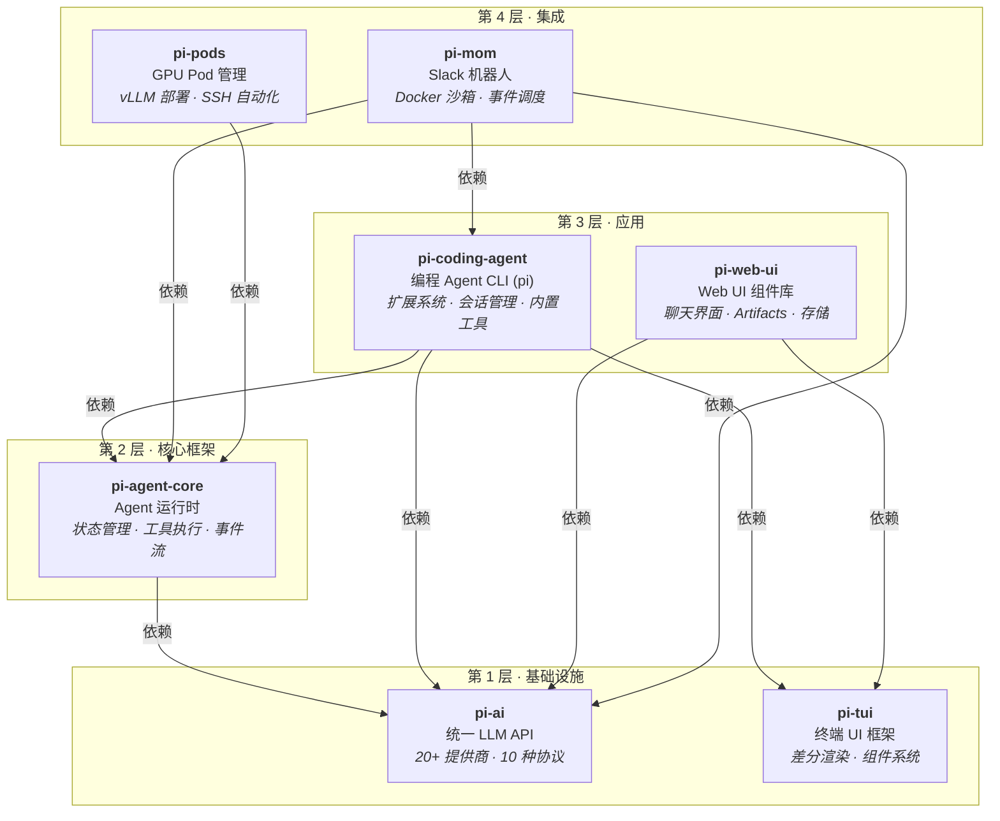

---

## 2. 数据流全景图（端到端视角）

展示一条用户消息从输入到 LLM 响应再到工具执行的完整路径。

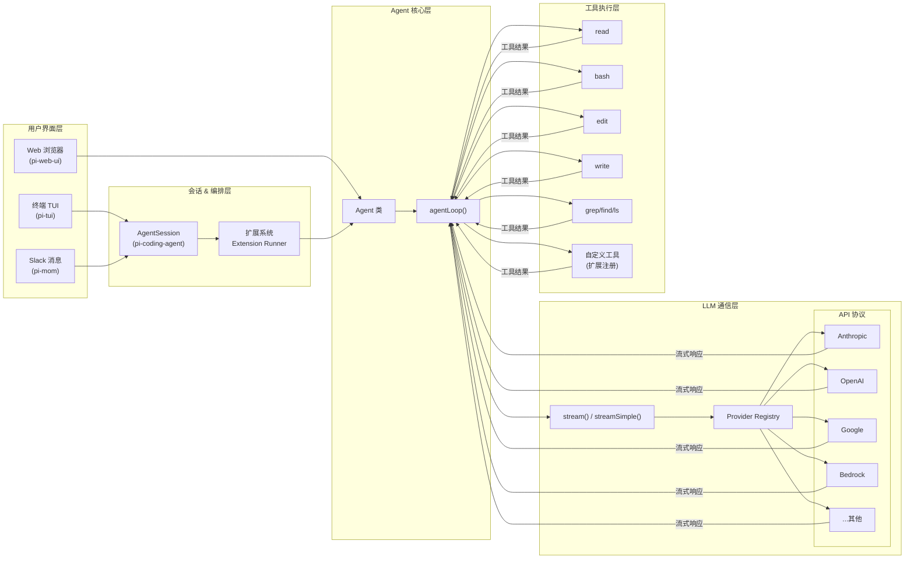

---

## 3. Agent Loop 详细时序图（运行时视角）

展示 Agent 核心循环的内部执行时序，包括消息注入、LLM 调用、工具执行和 steering 机制。

```mermaid
sequenceDiagram
    participant User as 用户
    participant Agent as Agent 类
    participant Loop as agentLoop()
    participant Ctx as transformContext()
    participant Conv as convertToLlm()
    participant LLM as LLM Provider
    participant Tool as Tool Executor
    participant Sub as 事件订阅者

    User->>Agent: prompt("修改 config.ts")
    Agent->>Sub: agent_start
    Agent->>Loop: 启动循环 (pending messages)

    loop 内层循环（每个 turn）
        Loop->>Sub: turn_start
        Loop->>Sub: message_start (user)
        Loop->>Sub: message_end (user)

        Note over Loop,LLM: 准备上下文
        Loop->>Ctx: transformContext(messages)
        Ctx-->>Loop: 裁剪后的 AgentMessage[]
        Loop->>Conv: convertToLlm(messages)
        Conv-->>Loop: LLM Message[]

        Note over Loop,LLM: 流式调用 LLM
        Loop->>LLM: streamSimple(model, context)
        Loop->>Sub: message_start (assistant)
        LLM-->>Loop: text_delta...
        Loop->>Sub: message_update (streaming)
        LLM-->>Loop: toolcall_start/delta/end
        Loop->>Sub: message_end (assistant)

        alt 有工具调用
            Note over Loop,Tool: 工具执行
            Loop->>Sub: tool_execution_start
            Loop->>Tool: execute(params, signal)
            Tool-->>Loop: AgentToolResult
            Loop->>Sub: tool_execution_end
            Loop->>Sub: message_start/end (toolResult)
        end

        Loop->>Sub: turn_end

        Note over Loop: 检查 steering 消息队列
        alt 有 steering 消息
            Loop->>Loop: 注入 steering 消息，继续循环
        else 有 follow-up 消息
            Loop->>Loop: 注入 follow-up 消息，继续外层循环
        else 无更多消息
            Loop->>Loop: 退出循环
        end
    end

    Agent->>Sub: agent_end
    Agent-->>User: Promise resolve
```

---

## 4. 消息类型体系（类型系统视角）

展示从底层 LLM 消息到应用层自定义消息的完整类型继承与转换关系。

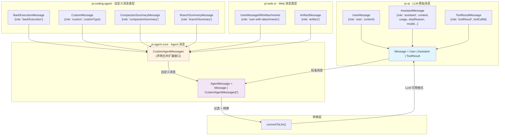

---

## 5. 内容块与流事件模型（协议视角）

展示 AssistantMessage 的内容块类型和流式事件协议。

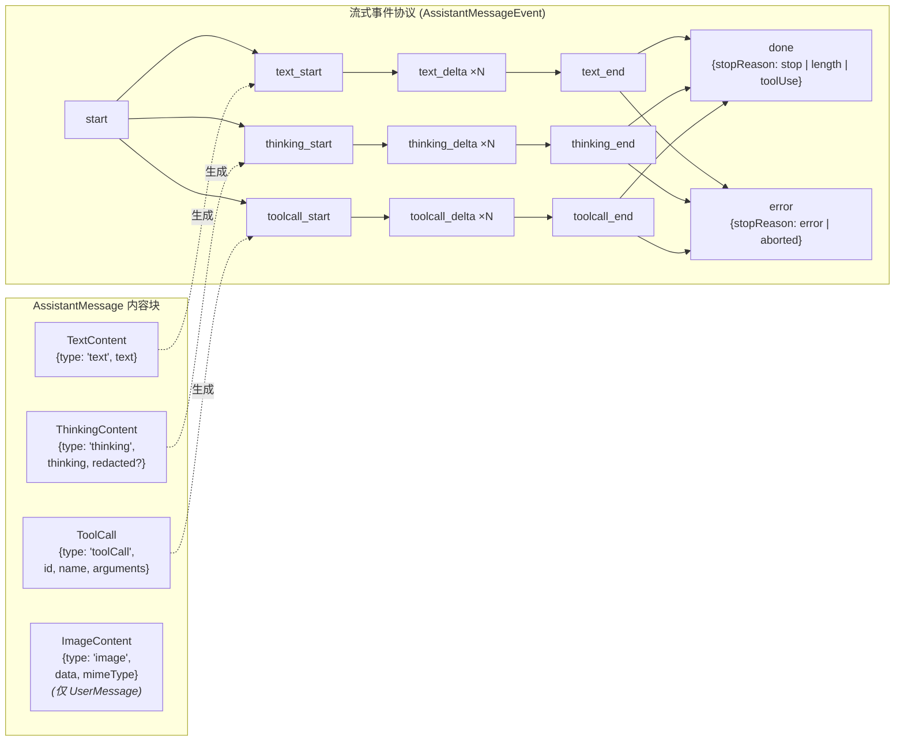

---

## 6. LLM Provider 架构（提供商视角）

展示从 API 协议到商业提供商的映射关系和懒加载机制。

```mermaid
graph TB
    subgraph "统一入口"
        S["stream(model, context, options)"]
        SS["streamSimple(model, context, options)"]
    end

    subgraph "API 注册表"
        REG["apiProviderRegistry<br/>Map&lt;Api, RegisteredApiProvider&gt;"]
    end

    subgraph "API 协议层（10 种协议）"
        OC["openai-completions"]
        OR["openai-responses"]
        OCR["openai-codex-responses"]
        AZ["azure-openai-responses"]
        AN["anthropic-messages"]
        GG["google-generative-ai"]
        GC["google-gemini-cli"]
        GV["google-vertex"]
        MI["mistral-conversations"]
        BR["bedrock-converse-stream"]
    end

    subgraph "商业提供商（多对一映射）"
        P_OAI["OpenAI"]
        P_ANT["Anthropic"]
        P_GOO["Google"]
        P_GRO["Groq"]
        P_CER["Cerebras"]
        P_XAI["xAI"]
        P_OPR["OpenRouter"]
        P_VER["Vercel AI"]
        P_HF["Hugging Face"]
        P_AWS["Amazon Bedrock"]
        P_AZU["Azure OpenAI"]
        P_MIS["Mistral"]
        P_GCP["GitHub Copilot"]
        P_MM["MiniMax"]
        P_MORE["...其他"]
    end

    S --> REG
    SS --> REG
    REG --> OC & OR & OCR & AZ & AN & GG & GC & GV & MI & BR

    P_OAI --> OC
    P_OAI --> OR
    P_GRO --> OC
    P_CER --> OC
    P_XAI --> OC
    P_OPR --> OC
    P_VER --> OC
    P_HF --> OC
    P_MM --> OC
    P_MORE --> OC
    P_ANT --> AN
    P_GOO --> GG
    P_AWS --> BR
    P_AZU --> AZ
    P_MIS --> MI
    P_GCP --> OR

    style OC fill:#fff9c4
    style AN fill:#fce4ec
    style GG fill:#e8f5e9
    style BR fill:#e3f2fd
```

---

## 7. Coding Agent 内部架构（模块视角）

展示 pi-coding-agent 包内部的核心模块及其关系。

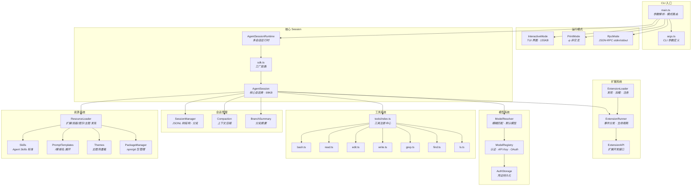

---

## 8. 扩展系统事件流（扩展开发者视角）

展示扩展系统的全部事件类型和触发时机。

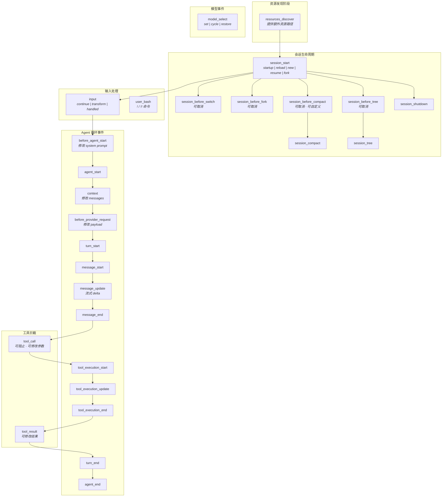

---

## 9. Web UI 组件架构（前端视角）

展示 pi-web-ui 的组件层次和数据流。

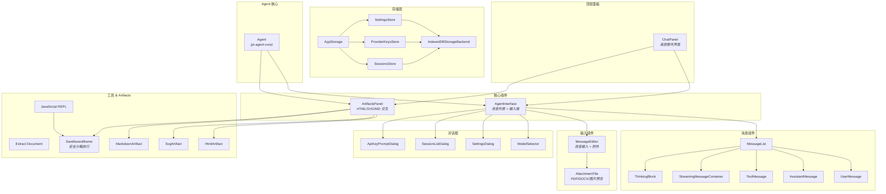

---

## 10. Mom Slack Bot 架构（集成视角）

展示 pi-mom 的内部架构和与 Slack 的交互流程。

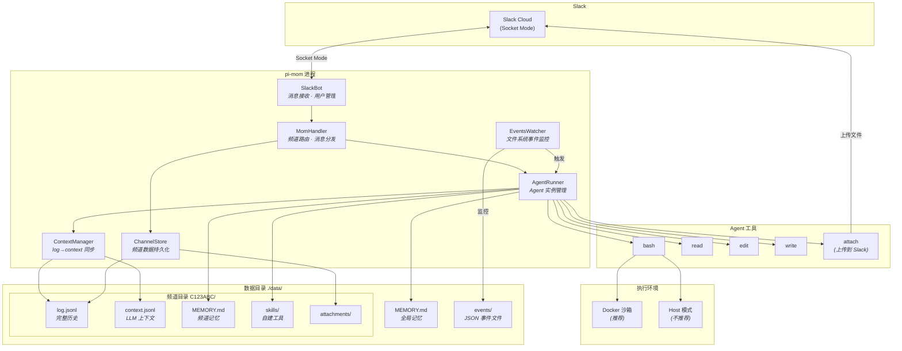

---

## 11. 会话持久化与分支模型（数据视角）

展示 JSONL 会话文件的树形结构和分支/压缩机制。

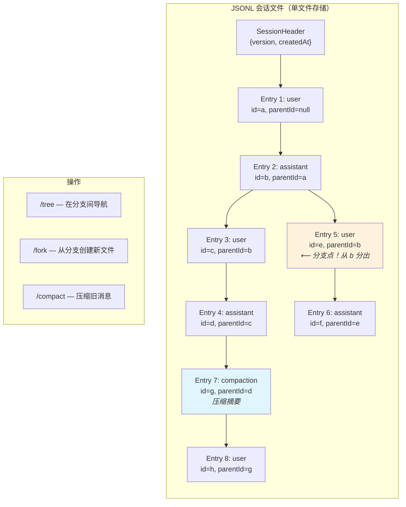

---

## 12. 工具执行管道（工具系统视角）

展示一个工具从 LLM 请求到执行完成的完整管道。

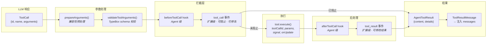

---

## 13. 多运行模式对比（使用模式视角）

展示 pi coding agent 的四种运行模式和各自的特点。

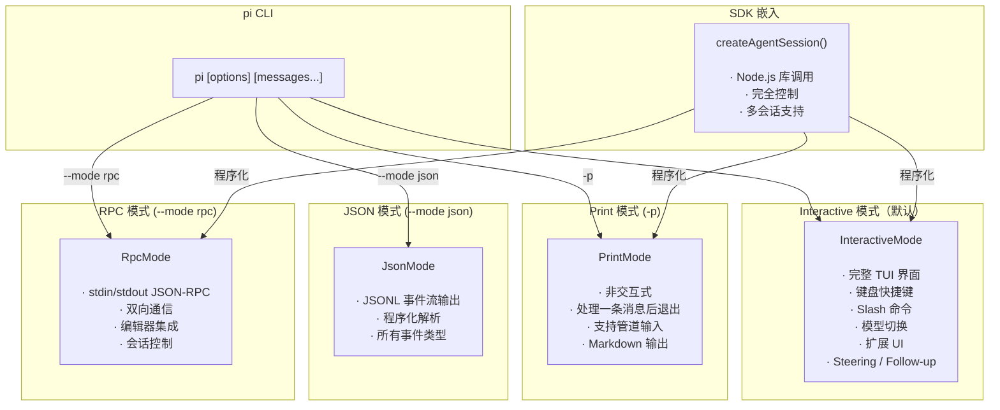

---

## 14. GPU Pod 部署架构（基础设施视角）

展示 pi-pods 管理的 GPU Pod 部署拓扑。

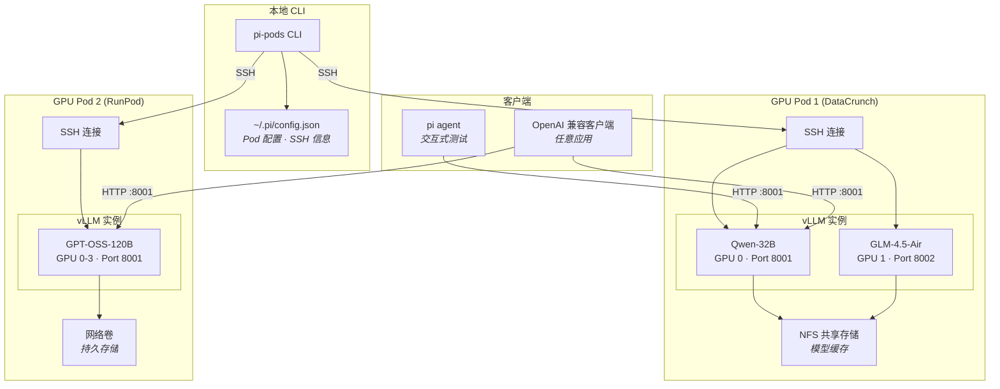

---

## 15. 跨提供商消息转换（兼容性视角）

展示在切换 LLM 提供商时消息需要经过的兼容性转换。

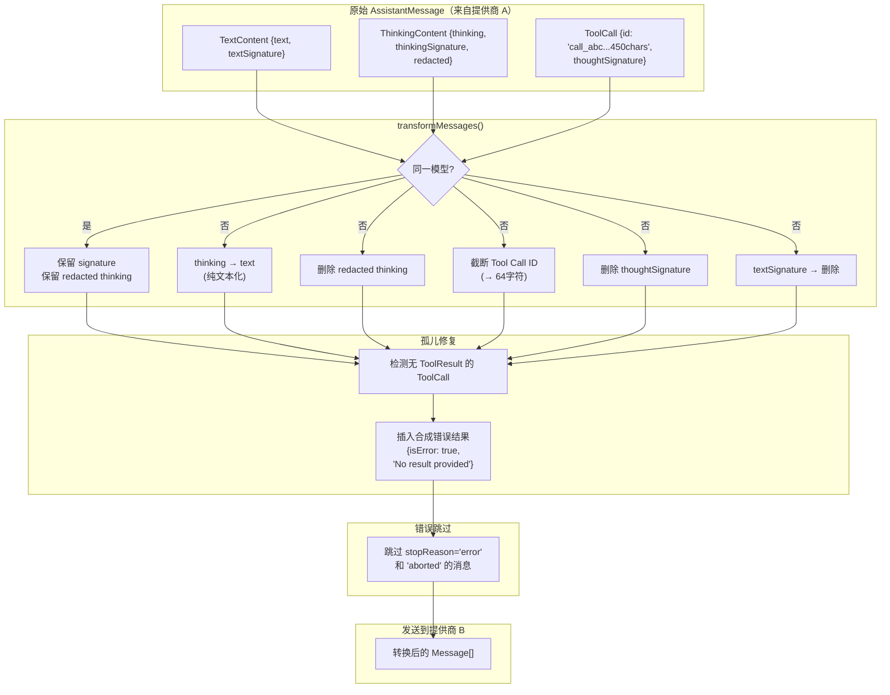

---

## 16. 定制系统全景（可扩展性视角）

展示 pi coding agent 支持的所有定制机制。

```mermaid
mindmap
    root((Pi 定制系统))
        扩展 Extensions
            自定义工具
            自定义命令
            键盘快捷键
            CLI 标志
            生命周期钩子
            自定义 UI 组件
            自定义编辑器
            Provider 注册
        技能 Skills
            SKILL.md 文件
            自动/手动加载
            /skill:name 调用
            Agent Skills 标准
        提示模板 Prompts
            Markdown 文件
            /模板名 展开
            {{参数}} 占位符
        主题 Themes
            JSON 配色文件
            热重载
            dark / light 内置
        Pi 包 Packages
            npm 安装
            git 安装
            打包分享
            pi install/remove/update
        System Prompt
            AGENTS.md / CLAUDE.md
            .pi/SYSTEM.md 替换
            APPEND_SYSTEM.md 追加
        设置 Settings
            ~/.pi/agent/settings.json
            .pi/settings.json
            /settings 命令
