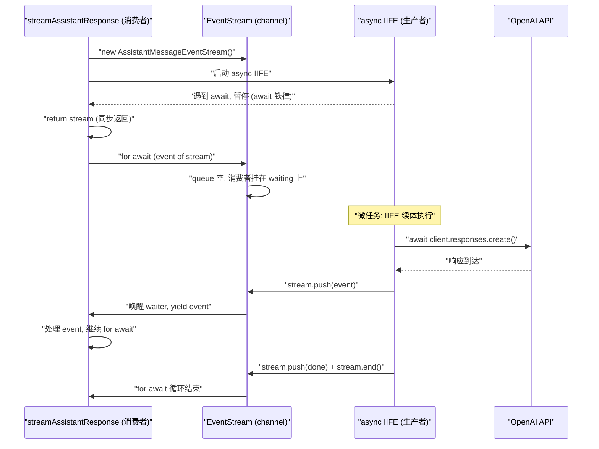

# async stream 控制流与 await 铁律

> 基于 pi-mono 项目中 `packages/ai` 和 `packages/agent` 的源码分析。

## 核心问题

`streamOpenAIResponses` 是同步返回还是异步返回？调用方 `await streamFunction(...)` 拿到的 `response` 是什么？为什么之后还能 `for await (const event of response)` 遍历它？

## 关键代码结构

### 生产者：`streamOpenAIResponses`（openai-responses.ts）

```ts
export const streamOpenAIResponses = (model, context, options): AssistantMessageEventStream => {
    const stream = new AssistantMessageEventStream();

    // 启动 async IIFE（生产者）
    (async () => {
        // ... 构建 output, client, params ...
        const nextParams = await options?.onPayload?.(params, model); // 第一个 await
        const openaiStream = await client.responses.create(params);  // 网络 IO
        stream.push({ type: "start", partial: output });
        await processResponsesStream(openaiStream, output, stream, model, ...);
        stream.push({ type: "done", reason: output.stopReason, message: output });
        stream.end();
    })();

    return stream; // 同步返回
};
```

**关键**：这是一个**普通函数**（非 async），内部启动了一个 async IIFE。函数本身**同步返回** `AssistantMessageEventStream` 对象。async IIFE 的后续执行（网络请求、push 事件）全部在微任务/宏任务中异步完成。

### 消费者：`streamAssistantResponse`（agent-loop.ts）

```ts
async function streamAssistantResponse(context, config, signal, emit, streamFn) {
    const streamFunction = streamFn || streamSimple;
    const response = await streamFunction(config.model, llmContext, { ... });

    for await (const event of response) {
        switch (event.type) {
            case "start": ...
            case "text_delta": ...
            case "done": ...
        }
    }
}
```

### 桥梁：`EventStream`（event-stream.ts）

```ts
export class EventStream<T, R = T> implements AsyncIterable<T> {
    private queue: T[] = [];                              // 缓冲区（生产者先到时）
    private waiting: ((value: IteratorResult<T>) => void)[] = []; // 等待队列（消费者先到时）

    push(event: T): void {
        const waiter = this.waiting.shift();
        if (waiter) {
            waiter({ value: event, done: false }); // 直接唤醒消费者
        } else {
            this.queue.push(event);                // 缓冲事件
        }
    }

    async *[Symbol.asyncIterator](): AsyncIterator<T> {
        while (true) {
            if (this.queue.length > 0) {
                yield this.queue.shift()!;         // 消费缓冲
            } else if (this.done) {
                return;
            } else {
                // 消费者挂起，等待生产者 push
                const result = await new Promise<IteratorResult<T>>(
                    (resolve) => this.waiting.push(resolve)
                );
                if (result.done) return;
                yield result.value;
            }
        }
    }
}
```

这是一个手写的 **CSP channel**：
- **生产者**（async IIFE）通过 `push()` 写入
- **消费者**（`for await`）通过 async iterator 读取
- 消费者先到 → 挂在 `waiting` 数组上等待
- 生产者先到 → 缓冲在 `queue` 数组中

## await 铁律

**无论 `await` 的操作数是什么（Promise、非 Promise、undefined），async 函数都必定暂停，控制权都必定返还给调用者。**

这是 ECMAScript 规范明确规定的行为。`await x` 的语义等价于：

```js
const promise = Promise.resolve(x);
promise.then(continuation);
// 暂停当前 async 函数，返回给调用者
```

即使 `Promise.resolve(42)` 是一个已经 fulfilled 的 Promise，`.then(continuation)` 也**不会同步执行** continuation，而是将其**入微任务队列**。所以 async 函数**必定暂停至少一个微任务 tick**。

### 应用到本场景

`streamFunction` 同步返回 `stream`（非 Promise），但调用方写了 `await streamFunction(...)`：

```
await stream → Promise.resolve(stream).then(续体)
```

- `Promise.resolve(stream)` 已 fulfilled
- 续体入微任务队列
- `streamAssistantResponse` 暂停

这个 `await` 没有实际"等待"任何异步操作，但仍然引入了一个微任务 tick 的延迟。

## 精确控制流时序

### 同步阶段

```
① streamAssistantResponse 被调用
② 调用 streamFunction (即 streamSimple → streamOpenAIResponses)
③ streamOpenAIResponses 内部：
   - new AssistantMessageEventStream()              ← 同步
   - (async () => { ... })() 启动 async IIFE
     - 同步执行到 await options?.onPayload?.(params, model)
     - 调用 onPayload(params, model)，拿到返回值 R
       情况A: onPayload undefined / sync 函数 → R 非 Promise
       情况B: onPayload 是 async 函数 → R 是 pending Promise
     - await R → Promise.resolve(R).then(IIFE续体)
       情况A: Promise.resolve(R) 已 fulfilled → IIFE续体入微任务队列（M1）
       情况B: Promise.resolve(pendingPromise) 仍 pending → IIFE续体暂不入队
     - IIFE 暂停
   - return stream                                   ← 同步返回
④ 回到 agent-loop.ts: const response = await streamFunction(...)
   - streamFunction 同步返回 stream（非 Promise）
   - await stream → Promise.resolve(stream).then(SAR续体)
   - SAR续体入微任务队列（M2）
   - streamAssistantResponse 暂停
⑤ 调用栈继续向上退，直到调用栈清空
```

### 微任务阶段 — 情况A（onPayload 非 async 或 undefined）

```
⑥ 出队 M1：IIFE续体执行
   - nextParams = ...
   - await client.responses.create(...)  ← 网络 IO，pending Promise
   - IIFE 再次暂停

⑦ 出队 M2：SAR续体执行
   - response = stream
   - for await (const event of response)
   - stream.queue 为空，done 为 false
   - 消费者挂在 waiting 数组上，等待生产者 push
```

### 微任务阶段 — 情况B（onPayload 是 async 函数）

```
⑥ 出队 M2：SAR续体执行（M1 还没入队！）
   - response = stream
   - for await (const event of response)
   - 消费者挂在 waiting 数组上

⑦ ...onPayload 内部 async 链路层层完成后...
   - IIFE续体才入微任务队列并执行
   - await client.responses.create(...)  ← 网络 IO
   - IIFE 再次暂停
```

**关键区别**：情况B下，消费者先于生产者执行。但这完全没问题——`EventStream` 的 `waiting` 机制确保消费者挂起等待，生产者到来后通过 `push` 唤醒它。

### 网络响应到达后

```
⑧ 网络响应回来（宏任务 callback → 微任务）
   - IIFE 继续执行
   - stream.push({ type: "start", ... })
     → waiting 中有 waiter → waiter({ value: event, done: false })
     → 唤醒 for await 循环中的消费者
   - await processResponsesStream(...)
     → 内部持续 stream.push() 事件
   - stream.push({ type: "done", ... })
   - stream.end()
```

## 设计模式总结



这是一个经典的 **push-based async iterator** 模式（也可称为 CSP channel 模式）：

| 角色 | 实现 | 职责 |
|------|------|------|
| 生产者 | async IIFE | 发起网络请求，通过 `push()` 写入事件 |
| Channel | `EventStream` | 缓冲和同步生产者/消费者 |
| 消费者 | `for await` 循环 | 消费事件，驱动 UI 更新/状态变更 |

核心要点：
- `streamOpenAIResponses` **同步返回** `EventStream`，调用方的 `await` 只多了一个无意义的微任务 tick
- 真正的"等待"发生在 `for await` 消费 async iterator 时
- 生产者和消费者通过 `EventStream` 解耦，无论谁先到达都能正确工作
