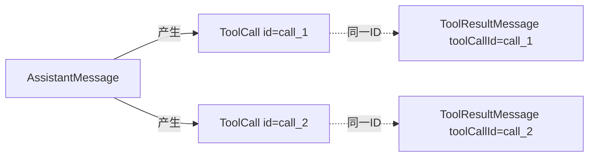
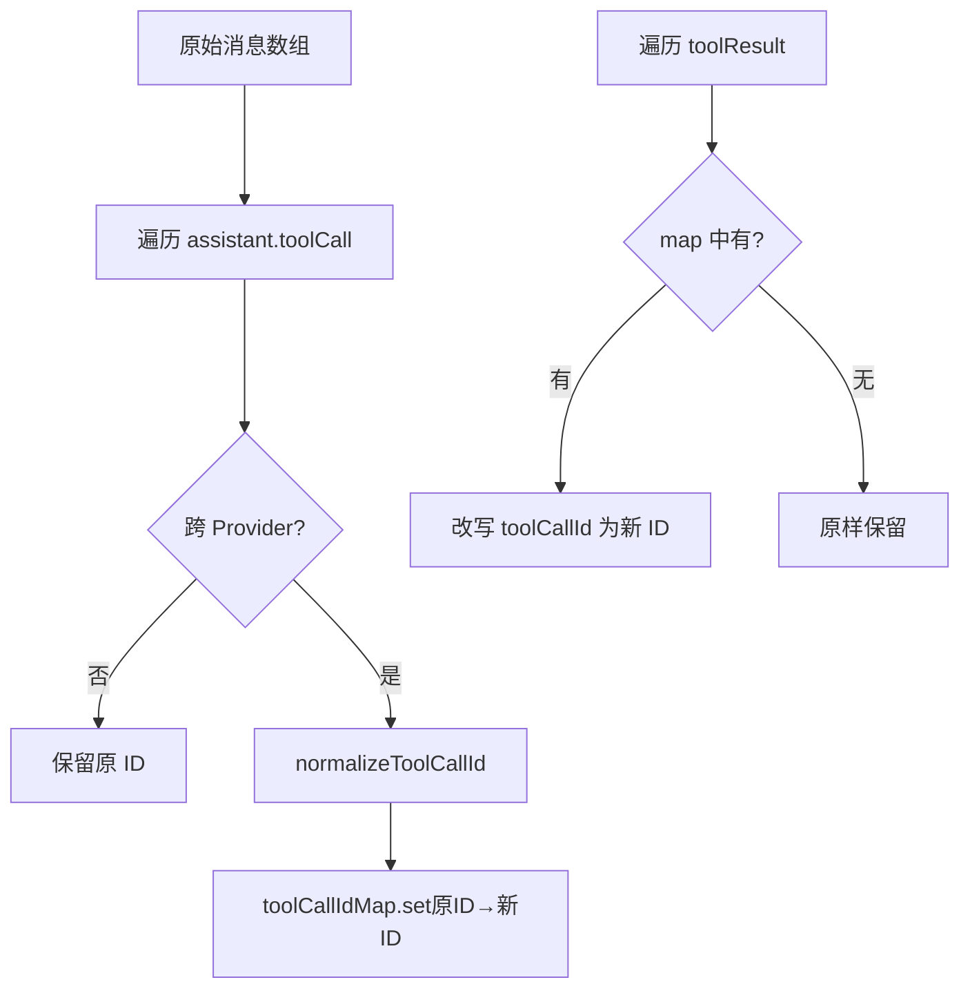
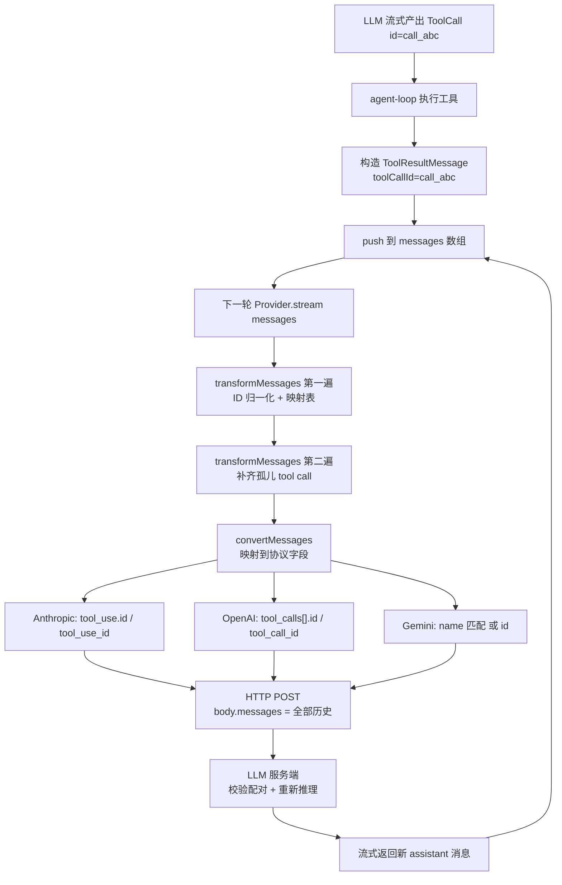

# toolCallId 配对机制与消息重放

## 0. 问题起点

阅读 `packages/ai/src/types.ts` 时发现 `ToolResultMessage` 除了 `toolName` 还有一个 `toolCallId` 字段：

```ts
export interface ToolResultMessage<TDetails = any> {
    role: "toolResult";
    toolCallId: string;
    toolName: string;
    content: (TextContent | ImageContent)[];
    details?: TDetails;
    isError: boolean;
    timestamp: number;
}
```

对应的 `ToolCall` 也有个 `id`：

```ts
export interface ToolCall {
    type: "toolCall";
    id: string;
    name: string;
    arguments: Record<string, any>;
}
```

由此展开三个问题：

1. `toolCallId` 具体干什么用？
2. 配对是怎么做的、为什么必须配对？
3. 「每轮重放完整消息历史」到底是什么意思？

本文把这三个问题一次讲透。

---

## 1. `toolCallId` 是什么：调用与结果之间的唯一主键

一条 assistant 消息里可能**同时**发起多个 tool call（并行工具调用），后续会产生多条 `ToolResultMessage`。仅靠数组顺序无法可靠对齐（并行执行返回顺序不定），必须靠显式 ID：



在 pi-mono 中，`agent-loop` 执行完工具后把 `toolCall.id` 原样回填：

```ts
// packages/agent/src/agent-loop.ts
const toolResultMessage: ToolResultMessage = {
    role: "toolResult",
    toolCallId: toolCall.id,
    toolName: toolCall.name,
    content: result.content,
    details: result.details,
    ...
};
```

这时 ID 还是 Provider 生成的**原始 ID**（例如 Anthropic 的 `toolu_xxx`、OpenAI 的 `call_xxx`、OpenAI Responses 的 `fc_xxx|rs_xxx` 超长复合串）。

---

## 2. 为什么必须配对：LLM API 是无状态的

这是整个机制的根本前提，也是最容易被忽略的一点。

### 2.1 「无状态」的含义

**LLM API 不是微信聊天**：
- 服务端**不保存**上一轮说过什么
- 服务端**不记得**这是第几轮对话
- 每次 HTTP 调用都是**独立的**

客户端每次都要把**从第一条 user 消息到现在的全部历史**塞进 `messages` 字段一起发过去。这个动作就叫**重放完整消息历史**。

### 2.2 重放过程举例

假设会话是：

```
turn 1: user   → "帮我读一下 a.ts"
turn 1: llm    → tool_call(read, id=call_1)
turn 1: agent  → tool_result(call_1, "文件内容是...")
turn 1: llm    → "这个文件实现了 X"

turn 2: user   → "那再读一下 b.ts"
```

**turn 1 第一次调 LLM**，请求体：

```json
{
  "messages": [
    {"role": "user", "content": "帮我读一下 a.ts"}
  ]
}
```

**turn 1 第二次调 LLM（工具执行完，要让 LLM 看结果）**，请求体：

```json
{
  "messages": [
    {"role": "user", "content": "帮我读一下 a.ts"},
    {"role": "assistant", "content": [
      {"type":"tool_use","id":"call_1","name":"read","input":{...}}
    ]},
    {"role": "user", "content": [
      {"type":"tool_result","tool_use_id":"call_1","content":"文件内容是..."}
    ]}
  ]
}
```

**turn 2 调 LLM**，请求体：

```json
{
  "messages": [
    {"role": "user", "content": "帮我读一下 a.ts"},
    {"role": "assistant", "content": [
      {"type":"tool_use","id":"call_1","name":"read","input":{...}}
    ]},
    {"role": "user", "content": [
      {"type":"tool_result","tool_use_id":"call_1","content":"文件内容是..."}
    ]},
    {"role": "assistant", "content": "这个文件实现了 X"},
    {"role": "user", "content": "那再读一下 b.ts"}
  ]
}
```

**每一轮都要把前面所有东西重新发一遍**——像磁带一样，每次从头播放。

### 2.3 由此产生的三个硬约束

既然每次都重放，服务端要在**本次请求体内部**就地校验合法性：

1. **并行工具调用**：一次 assistant turn 发起多个 tool call 时，结果回到数组里顺序不定，只能靠 ID 对齐。
2. **推理链重放**：Claude extended thinking、OpenAI Responses reasoning 会校验 `tool_use → tool_result` 链完整性，ID 不对会丢失 reasoning 签名甚至报错。
3. **API 合法性**：Anthropic 强制要求每个 `tool_use` 必须有匹配 `tool_use_id` 的 `tool_result`，否则直接 400。

---

## 3. 配对是如何实现的：`transformMessages` 两遍扫描

核心逻辑在 `packages/ai/src/providers/transform-messages.ts`。每次 Provider 发起请求前，都会先用它"净化"一次消息数组。

### 3.1 第一遍：ID 归一化 + 建立映射表

问题：跨 Provider 切换时（比如历史来自 OpenAI Responses、现在要用 Anthropic 继续），原始 ID 可能不符合新 Provider 的规则（字符集、长度）。

解法：维护 `toolCallIdMap`，把 `ToolCall.id` 和对应 `ToolResultMessage.toolCallId` **同步改写**。

```ts
// packages/ai/src/providers/transform-messages.ts（节选）
const toolCallIdMap = new Map<string, string>();

const transformed = messages.map((msg) => {
    if (msg.role === "toolResult") {
        const normalizedId = toolCallIdMap.get(msg.toolCallId);
        if (normalizedId && normalizedId !== msg.toolCallId) {
            return { ...msg, toolCallId: normalizedId };
        }
        return msg;
    }
    if (msg.role === "assistant") {
        // ...对每个 toolCall block 调用 normalizeToolCallId
        // 如果改变了 ID，则 toolCallIdMap.set(原ID, 新ID)
    }
});
```



### 3.2 第二遍：补齐孤儿 tool call

问题：用户中途按 ESC 打断、网络 abort、或者历史里 tool call 还没等到 result 就被新的 user 消息插入——此时 `tool_use` 没有匹配的 `tool_result`，API 会 400。

解法：扫描一遍，基于 ID 集合做差集，用合成的 `"No result provided"` 占位。

```ts
let pendingToolCalls: ToolCall[] = [];
let existingToolResultIds = new Set<string>();

for (const msg of transformed) {
    if (msg.role === "assistant") {
        // 新 assistant 到来前，先补齐上一个 assistant 留下的孤儿
        for (const tc of pendingToolCalls) {
            if (!existingToolResultIds.has(tc.id)) {
                result.push({
                    role: "toolResult",
                    toolCallId: tc.id,
                    toolName: tc.name,
                    content: [{ type: "text", text: "No result provided" }],
                    isError: true,
                    ...
                });
            }
        }
        // ...
    } else if (msg.role === "toolResult") {
        existingToolResultIds.add(msg.toolCallId);
    } else if (msg.role === "user") {
        // user 消息插入时也要先补齐孤儿
    }
}
```

这样保证**任意时刻**送给 LLM 的数组都满足：每个 `tool_use` 都有匹配 `tool_use_id` 的 `tool_result`。

---

## 4. 最终喂给 LLM 时，ID 叫什么字段名

`toolCallId` 这个字符串**会**进入 HTTP 请求体，但字段名会被映射成各家协议自己的标准字段。

| Provider / Api | ToolCall 侧 | ToolResult 侧 | ID 归一化约束 |
|---|---|---|---|
| **Anthropic Messages** | `tool_use.id` | `tool_result.tool_use_id` | `[a-zA-Z0-9_-]`，≤64 字符 |
| **OpenAI Chat Completions** | `assistant.tool_calls[].id` | `tool.tool_call_id` | ≤40 字符 |
| **OpenAI Responses** | `function_call.call_id` | `function_call_output.call_id` | 复合格式 `call_xxx`\|`fc_xxx` |
| **Google Gemini（原生）** | `functionCall.name`（**无 id**） | `functionResponse.name`（**无 id**） | 按 `name` 匹配 |
| **Google（via Vertex 的 Claude/gpt-oss）** | `functionCall.id` | `functionResponse.id` | `[a-zA-Z0-9_-]`，≤64 |
| **Mistral / Bedrock Converse** | `toolUseId` / `toolCallId` | `toolUseId` | 因家族而异 |

### 代码映射点

**Anthropic**（`packages/ai/src/providers/anthropic.ts`）：

```ts
toolResults.push({
    type: "tool_result",
    tool_use_id: msg.toolCallId,   // ← 内部 toolCallId 写入 tool_use_id
    content: convertContentBlocks(msg.content),
    is_error: msg.isError,
});
```

**OpenAI Completions**（`packages/ai/src/providers/openai-completions.ts`）：

```ts
const toolResultMsg: ChatCompletionToolMessageParam = {
    role: "tool",
    content: sanitizeSurrogates(...),
    tool_call_id: toolMsg.toolCallId,   // ← 写入 tool_call_id
};
```

**Google Gemini 的特殊处理**（`packages/ai/src/providers/google-shared.ts`）：

```ts
export function requiresToolCallId(modelId: string): boolean {
    return modelId.startsWith("claude-") || modelId.startsWith("gpt-oss-");
}

const includeId = requiresToolCallId(model.id);
const functionResponsePart: Part = {
    functionResponse: {
        name: msg.toolName,
        response: msg.isError ? { error: responseValue } : { output: responseValue },
        ...(includeId ? { id: msg.toolCallId } : {}),   // ← 只有 Claude/gpt-oss via Vertex 才塞 id
    },
};
```

原生 Gemini 协议**压根不发送 ID**，只用 `functionResponse.name` 去匹配最近的 `functionCall.name`。后果：Gemini 上并行调用同一个工具时，协议层无法区分哪个结果对应哪次调用（只能依赖顺序）。Vertex 转发 Claude/gpt-oss 时才加上 `id` 字段。

---

## 5. 这些 `*_id` 字段对 LLM 服务端的三个作用

1. **配对校验**：服务端 diff 请求体里 `tool_use` 集合和 `tool_result` 集合，缺一个就 400。这也是 `transformMessages` 必须合成 `"No result provided"` 占位的根本原因。
2. **推理签名绑定**：OpenAI Responses 的 `call_id` 关联了 reasoning block（`rs_xxx`）。ID 被任意篡改就会导致 reasoning 断链——所以它故意用 `{call_id}|{rs_id}` 的复合 ID，跨 Provider 时 `openai-completions.ts` 会 `split("|")` 取前半：

```ts
const normalizeToolCallId = (id: string): string => {
    if (id.includes("|")) {
        const [callId] = id.split("|");
        return callId.replace(/[^a-zA-Z0-9_-]/g, "_").slice(0, 40);
    }
    if (model.provider === "openai") return id.length > 40 ? id.slice(0, 40) : id;
    return id;
};
```

3. **并行结果路由**：assistant 一次发起 N 个 tool call 时，服务端靠 ID 把每个 result 精确对应回原 call，而不是按顺序。

---

## 6. 和 UI 显示的关系：同一份数据、两个消费者

容易误解：以为「重放」是在讲 UI 渲染。**不是**。`messages` 数组有两个**完全独立**的消费者：

| 用途 | 读取者 | 目的 |
|---|---|---|
| **重放** | Provider（`convertMessages`） | 告诉 LLM 之前发生了什么 |
| **UI 渲染** | `MessageList` / `Messages` 组件 | 给人看 |

UI 不渲染也不影响 LLM 拿到完整历史；反过来，LLM 不需要某些字段（如 `timestamp`、`details`）但 UI 需要。两者各取所需。

---

## 7. 端到端完整流程图



---

## 8. 一页总结

| 问题 | 答案 |
|---|---|
| `toolCallId` 是什么 | ToolCall 和 ToolResult 之间的唯一主键字符串 |
| 为什么需要它 | LLM API 无状态，每次重放都要在请求体内就地配对校验 |
| 配对怎么做 | `toolCallId === ToolCall.id` 字符串相等；`transformMessages` 负责跨 Provider 同步改写两侧 ID，并补齐孤儿 |
| 会喂给 LLM 吗 | 会，但以 `tool_use_id` / `tool_call_id` / `call_id` / `functionResponse.id` 等协议字段名出现；原生 Gemini 退化为按 `name` 匹配 |
| 服务端拿它做什么 | 配对校验、reasoning 签名绑定、并行结果路由 |
| 「重放」是指什么 | 每次调 LLM API 时，客户端把本地保存的全部历史消息打包进 HTTP 请求体发过去。和 UI 渲染无关 |
