# pi-ai 到 AgentSession 完整链路阅读笔记

> 范围：`packages/ai`、`packages/agent`、`packages/coding-agent/src/core`。
>
> 本文不讨论 `mini-pi` 相关内容。

这篇笔记沿用下面几个术语：

- **agentloop**：一次用户输入进入 agent，到 agent 完成这次任务为止的完整运行过程。为了建立主线，先不把 follow-up 和 steering 当作核心场景。
- **turn**：一次 LLM 调用，加上该次 assistant message 中所有 tool call 的执行与 tool result 回填。
- **ai 层**：`pi-ai`，负责把不同 provider 的调用统一成同一种模型、消息、事件流协议。
- **agent-loop 层**：`pi-agent-core` 的 `agent-loop.ts`，负责“一轮又一轮调用 LLM、执行工具、继续调用 LLM”的纯运行循环。
- **Agent 层**：`pi-agent-core` 的 `agent.ts`，负责持有状态、队列、abort signal，并把 agent-loop 的事件归约进 `agent.state`。
- **AgentSession 层**：`pi-coding-agent` 的 `agent-session.ts`，负责持久化、扩展、compaction、retry、bash、TUI/RPC/print 等产品级副作用。

一句话概括：

> `pi-ai` 统一 LLM 流式事件；`agent-loop` 消费这些事件并执行工具；`Agent` 把低层事件提交到内存状态；`AgentSession` 把这些事件接入持久化、扩展、UI、compaction 和 retry。

## 1. 总体分层

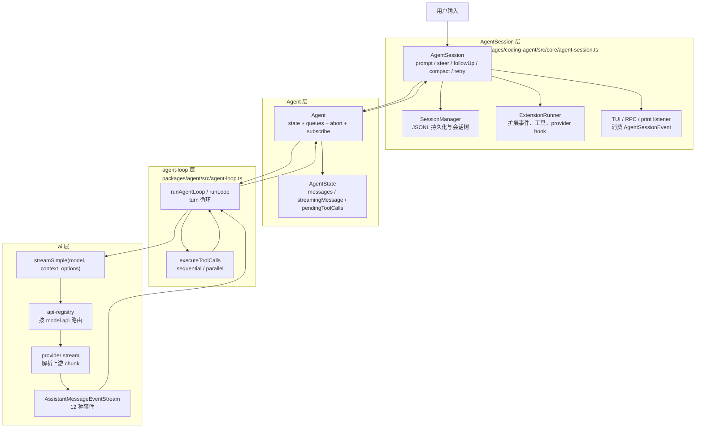

这个图里最容易误解的是两点：

1. `streamSimple()` 是统一入口和路由入口，不是所有解析逻辑本身。真正把 Anthropic/OpenAI/Gemini 等原始 stream chunk 解析成统一事件的代码，在各 provider 实现里。
2. `AgentSession` 虽然订阅 `Agent` 事件，但它不会把持久化、扩展、compaction 这些慢操作直接塞回 agent-loop 的关键路径。它用 `_agentEventQueue` 把慢副作用串行排队。

## 2. ai 层：统一 LLM 输出事件

ai 层的核心抽象是：

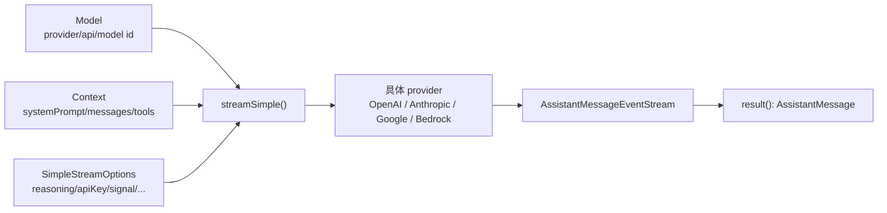

`AssistantMessageEvent` 一共有 12 种：

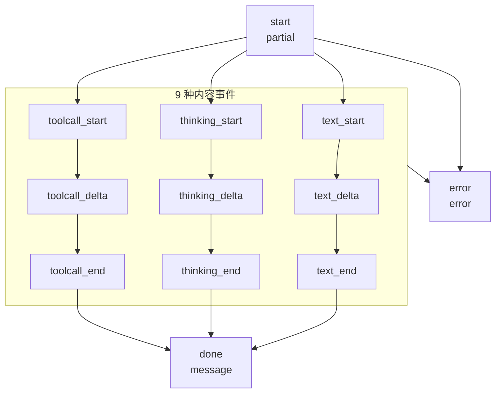

这里有一个重要修正：

`partial` 不是“此次 LLM 调用目前为止收到的所有消息”，而是“本次 assistant message 到当前时刻的完整快照”。它的类型是 `AssistantMessage`，不是 `Message[]` 或 `Context`。

所以在一次 LLM 调用中，事件语义是：

- `start.partial`：空内容或初始内容的 assistant message。
- `text_delta.partial` / `thinking_delta.partial` / `toolcall_delta.partial`：当前 assistant message 的最新版本。
- `done.message`：成功结束后的最终 assistant message。
- `error.error`：失败或 abort 后的最终 assistant message，`stopReason` 是 `"error"` 或 `"aborted"`。

`AssistantMessageEventStream` 同时支持两种消费方式：

- `for await (const event of stream)`：逐事件消费，用于流式 UI 和状态更新。
- `await stream.result()`：拿最终 `AssistantMessage`，用于提交历史。

agent-loop 两种都会用：先逐个处理事件，遇到 `done/error` 时再取最终结果。

## 3. agent-loop 层：无持久状态，但有运行期临时状态

agent-loop 层不拥有跨 run 的长期状态。它每次运行时只拿到一个 context snapshot，然后在本次 agentloop 内维护临时变量。

核心临时状态：

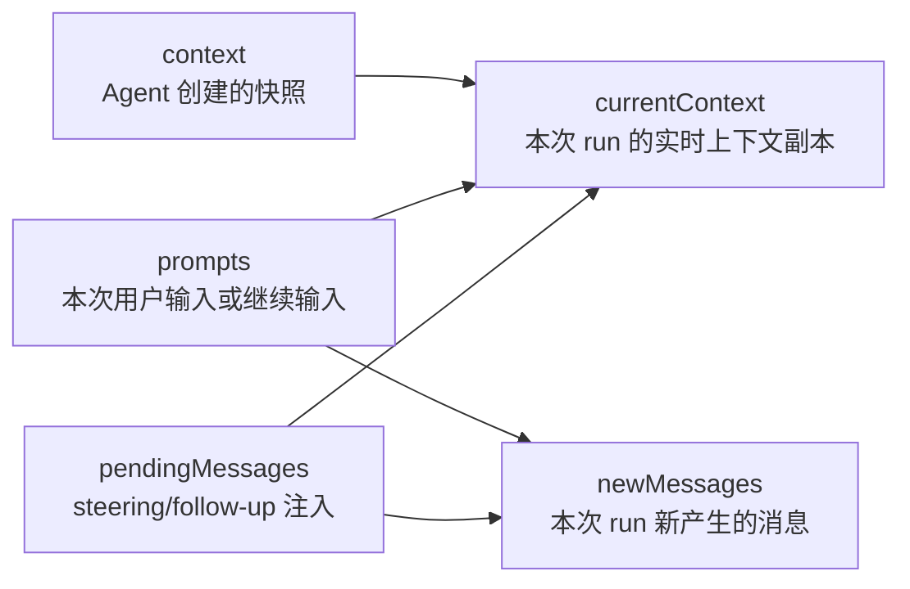

这里说它“无状态”时，准确含义是：

- 它不持有 `Agent.state`。
- 它不持有 session 文件。
- 它不跨 agentloop 保存消息。
- 但它在一次 run 内一定维护 `currentContext`、`newMessages`、`pendingMessages`、`firstTurn` 等临时运行状态。

## 4. 一个 agentloop 的主流程

先看不考虑 steering/follow-up 的主线：

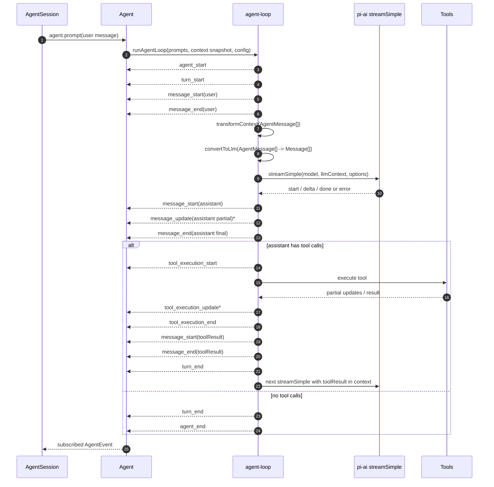

这条链有几个关键点。

### 4.1 用户 prompt 只在入口处进入

`runAgentLoop(prompts, context, ...)` 会先把 prompt 放入：

- `newMessages`
- `currentContext.messages`

然后发：

- `agent_start`
- `turn_start`
- 每条 prompt 的 `message_start`
- 每条 prompt 的 `message_end`

所以用户 prompt 通常只出现在 agentloop 的第一个 turn 前面。

如果考虑 steering 和 follow-up，则它们会被当成 pending message，在后续 turn 前发出自己的 `message_start/message_end`，并写入 `currentContext` 与 `newMessages`。

### 4.2 transformContext 和 convertToLlm 的边界

每次真正调用 LLM 前，agent-loop 会做两步：

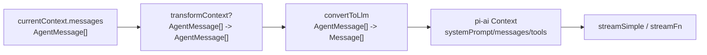

语义区别：

- `transformContext`：还在 `AgentMessage[]` 层工作，适合裁剪上下文、注入扩展上下文、处理上层自定义消息。
- `convertToLlm`：把 `AgentMessage[]` 转成 pi-ai 能发送给 provider 的 `Message[]`，过滤或转换 LLM 不该直接看到的消息。

注意：`transformContext` 返回的新数组只用于这一次 LLM 调用边界。agent-loop 不会自动把它赋回 `currentContext.messages`。如果某个 transformer 想产生持久副作用，需要在上层显式处理。

### 4.3 partial assistant 会被插入 currentContext

agent-loop 消费 `AssistantMessageEventStream` 时，处理方式如下：

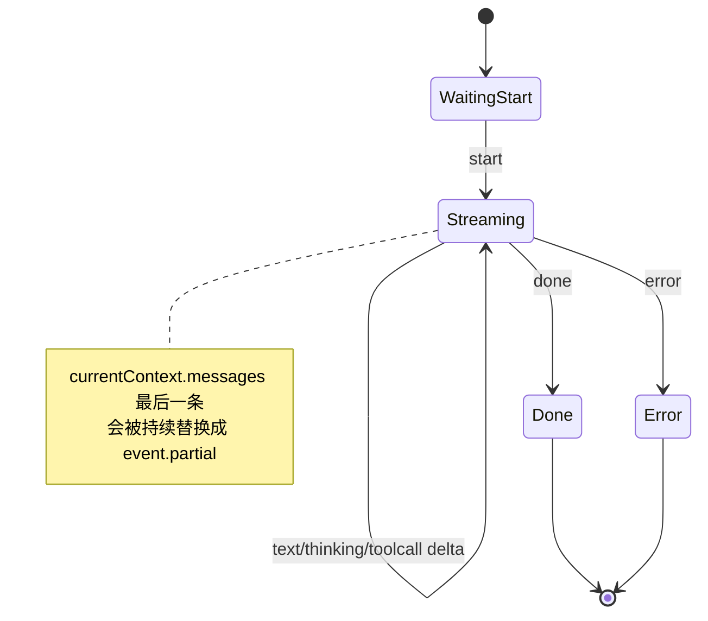

具体语义：

- 收到 `start`：把 `event.partial` push 到 `currentContext.messages`，发 `message_start(assistant)`。
- 收到 9 种内容事件：用 `event.partial` 替换 `currentContext.messages` 最后一条，发 `message_update`。
- 收到 `done/error`：拿 `response.result()` 得到最终 assistant message，替换最后一条，发 `message_end`。

这是一种一致性设计：即使当前实现没有在 LLM 还没完成时消费 `currentContext`，它仍保证 loop 内的上下文始终代表“目前为止最新的 assistant message”。

### 4.4 turn 的结束点

assistant message 结束后，agent-loop 会检查其中是否有 tool call。

- 如果没有 tool call：这个 turn 结束。
- 如果有 tool call：执行工具，产生 tool result，把 tool result 放回上下文，然后这个 turn 才结束。

所以一个 turn 的边界不是“LLM 停止输出”。

准确说：

> 一个 turn = assistant response + 该 response 要求执行的所有 tool call + 对应 tool result。

## 5. 工具执行：tool call 是 assistant message 的后半场

工具执行的主要事件：

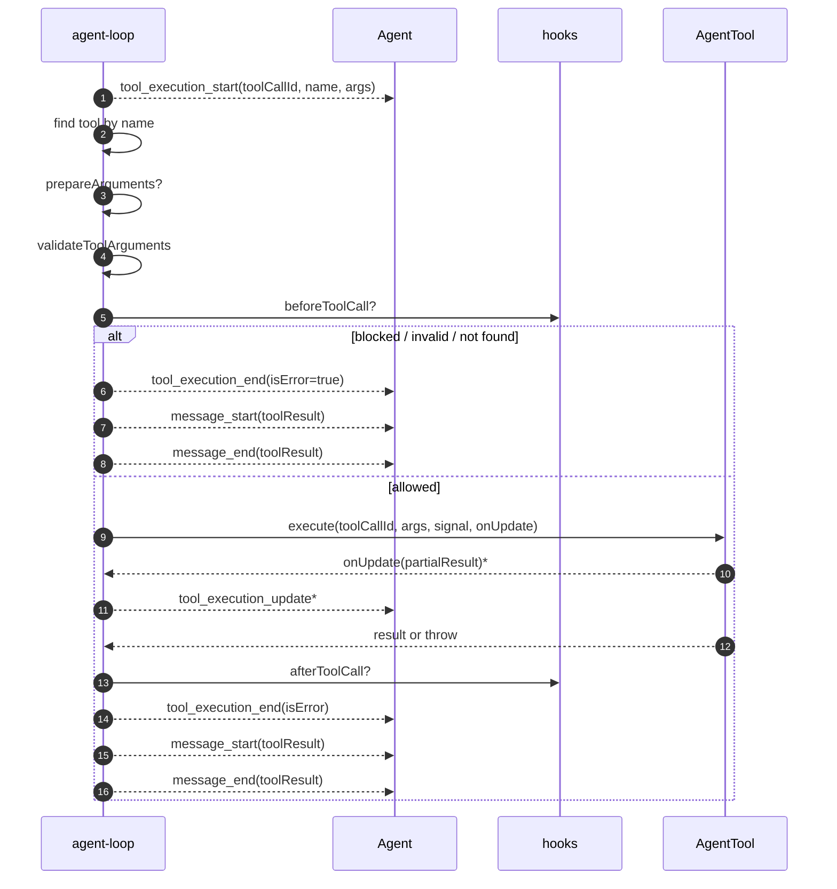

默认工具模式是 `parallel`：

- preflight 仍按 assistant message 中 tool call 的顺序进行。
- 被允许执行的工具可以并发执行。
- 最终 tool result 仍按 assistant source order 汇总回 turn 结果。

如果配置 `toolExecution: "sequential"`，则每个工具完整执行完再执行下一个。

## 6. Agent 层：状态容器、队列、订阅者屏障

Agent 不是 LLM 循环本身。真正的循环在 agent-loop。Agent 做的是：

- 保存 `AgentState`。
- 把当前 state 投影成 agent-loop 所需的 context snapshot。
- 提供 `prompt()`、`continue()`、`steer()`、`followUp()`。
- 维护 steering/follow-up 队列。
- 处理 agent-loop emit 出来的事件。
- 在处理完自身状态后，把事件交给订阅者。

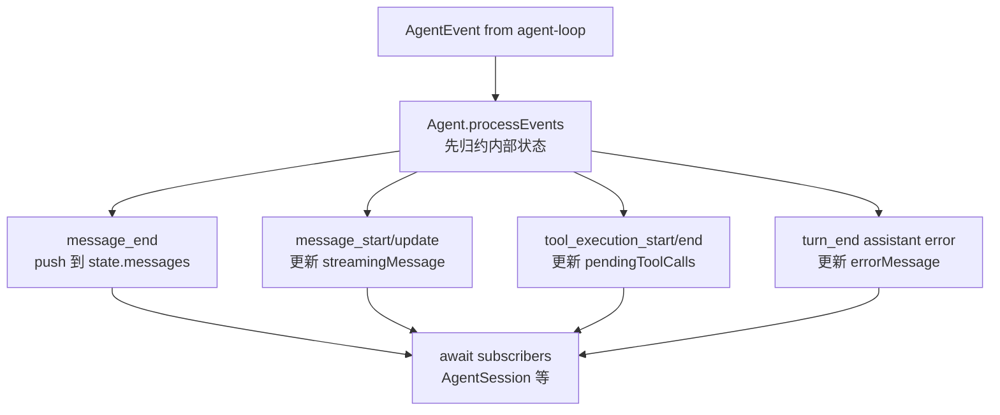

你对这里最关键点的判断是对的：

> `Agent` 只有在收到 `message_end` 时，才把该消息追加到 `agent.state.messages`。

但还要补上另外三个状态：

- `message_start/message_update` 会维护 `streamingMessage`，用于 UI 显示当前流式 assistant。
- `tool_execution_start/tool_execution_end` 会维护 `pendingToolCalls`。
- assistant error 会写入 `errorMessage`。

### 6.1 Agent.subscribe 默认是会被 await 的

`Agent.processEvents()` 的顺序是：

1. 先同步/快速更新 `Agent.state`。
2. 再按订阅顺序 `await listener(event, signal)`。

因此，如果某个 listener 直接做慢操作，agent-loop 会被拖慢。

AgentSession 正是为了避免这个问题，才让自己的 listener 立即返回，把慢操作挂到 `_agentEventQueue`。

## 7. AgentSession 层：产品级副作用调度器

AgentSession 是 coding-agent 的核心会话层。它把通用 Agent 变成真正的产品运行时。

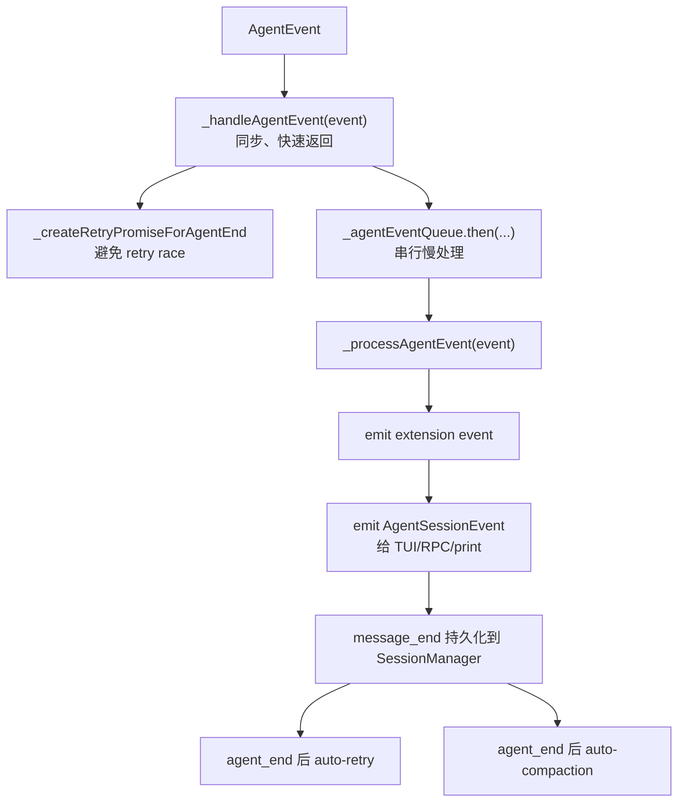

这就是“快慢分离”的核心：

- Agent 订阅者必须快，否则会卡住 agent-loop。
- AgentSession 的 `_handleAgentEvent` 是快的。
- 真正慢的 `_processAgentEvent` 被串到一个 Promise 队列里。
- 队列保证副作用顺序与事件顺序一致。

这也解释了为什么 AgentSession 的 listener 不会阻塞 agent-loop 的继续执行。

更准确地说：

> `_handleAgentEvent` 同步执行，只把 `_processAgentEvent(event)` 挂到已存在的 Promise 链后面；这会进入后续微任务调度，并且通过 `_agentEventQueue` 保证顺序。

## 8. AgentSession.prompt() 不只是转发 prompt

`AgentSession.prompt(text)` 在调用 `agent.prompt()` 之前，会经过一整条产品级前处理链。

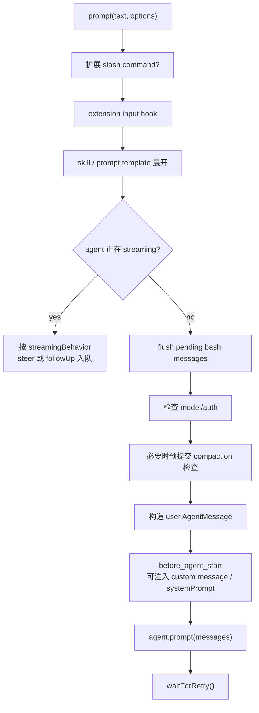

这一层补了很多 agent-core 不关心的事：

- slash command 和 extension command。
- input hook。
- `/skill:name` 与 prompt template 展开。
- streaming 时选择 steering 或 follow-up 入队。
- 模型和鉴权检查。
- 发送前 compaction 检查。
- `before_agent_start` 注入消息或替换 system prompt。
- auto-retry 等待。

所以，AgentSession 是“会话控制面”，Agent 是“运行时状态壳”，agent-loop 是“执行内核”。

## 9. coding-agent 的 convertToLlm：自定义消息如何进入模型

`pi-agent-core` 允许上层通过声明合并扩展 `AgentMessage`。coding-agent 扩展了几类消息：

- `bashExecution`
- `custom`
- `branchSummary`
- `compactionSummary`

它们最终要通过 `convertToLlm()` 转成 pi-ai 的 `Message[]`。

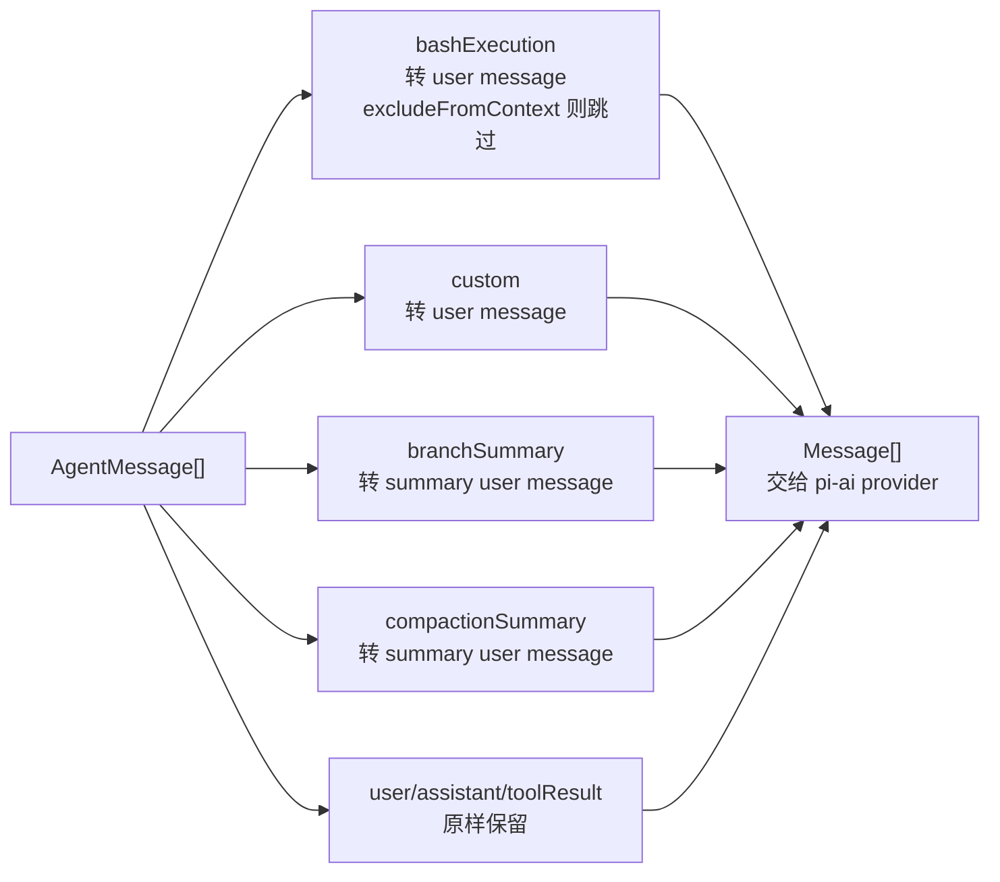

这解释了 `!!` bash 命令这类行为：

- bash 执行结果可以作为 `bashExecution` 保存在 agent/session 历史里。
- 如果 `excludeFromContext` 为 true，`convertToLlm()` 会跳过它。
- 因此它可以被 UI/历史看到，但不会进入下一次 LLM 上下文。

## 10. createAgentSession：把四层装配起来

SDK 创建 session 时，不是简单 `new AgentSession(new Agent())`。它会把很多桥接逻辑注入 Agent：

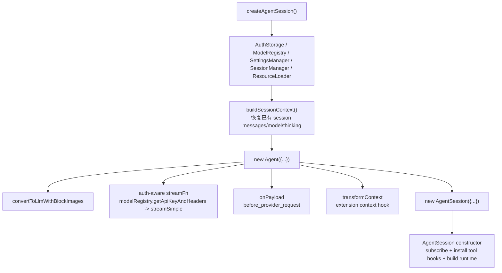

这里的几个桥非常重要：

- `streamFn`：每次 LLM 调用前动态解析 API key/headers，再调用 `streamSimple()`。
- `onPayload`：允许扩展在 provider request 发出前查看或替换 payload。
- `transformContext`：接入扩展的 context handler。
- `convertToLlmWithBlockImages`：先用 coding-agent 的 `convertToLlm()`，再根据设置过滤图片。

这意味着 agent-loop 虽然默认能直接用 `streamSimple`，但在 coding-agent 产品里，实际用的是 Agent 注入过的 `streamFn`。

## 11. retry 与 compaction：agent_end 之后的恢复逻辑

AgentSession 在 `agent_end` 后才检查自动 retry 与 compaction。

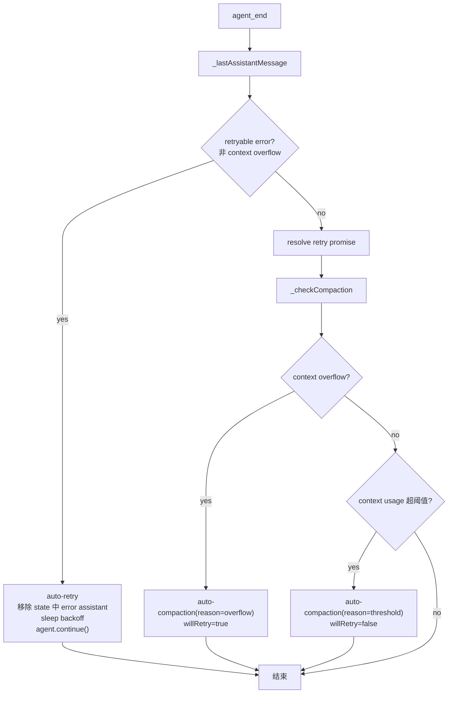

设计含义：

- 普通 transient error 走 retry。
- context overflow 不走 retry，走 compaction。
- overflow compaction 完成后会 `agent.continue()`，保留原上下文语义继续执行。
- threshold compaction 不自动重试当前请求，因为当前请求已经成功结束，只是为后续请求降低上下文压力。

## 12. 最终校准版心智模型

可以把整个系统理解为四个同心层：

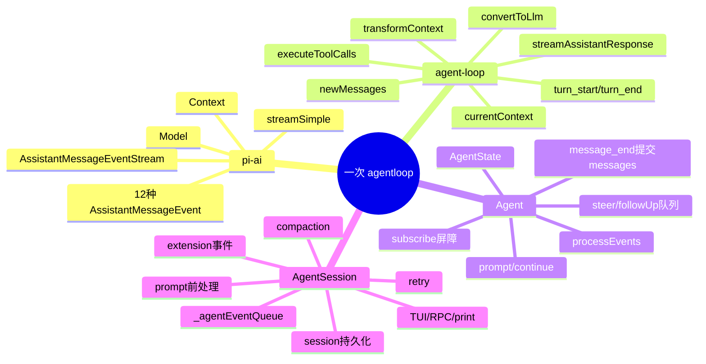

如果用一句更工程化的话收束：

> `pi-ai` 解决“不同模型如何统一说话”；`agent-loop` 解决“模型说完要不要执行工具并继续问”；`Agent` 解决“这次运行如何反映到内存状态”；`AgentSession` 解决“这次运行如何变成一个可恢复、可扩展、可交互的产品会话”。

## 13. 读源码时的关键锚点

建议按下面顺序回看源码：

1. `packages/ai/src/types.ts`
   - `Message`
   - `AssistantMessage`
   - `AssistantMessageEvent`
   - `Context`
   - `Model`

2. `packages/ai/src/utils/event-stream.ts`
   - `EventStream`
   - `AssistantMessageEventStream`
   - `result()`

3. `packages/ai/src/stream.ts`
   - `stream()`
   - `streamSimple()`
   - `complete()`
   - `completeSimple()`

4. `packages/ai/src/api-registry.ts`
   - `registerApiProvider()`
   - `getApiProvider()`
   - `wrapStreamSimple()`

5. `packages/agent/src/agent-loop.ts`
   - `runAgentLoop()`
   - `runLoop()`
   - `streamAssistantResponse()`
   - `executeToolCalls()`

6. `packages/agent/src/agent.ts`
   - `Agent.prompt()`
   - `Agent.continue()`
   - `createLoopConfig()`
   - `processEvents()`
   - `subscribe()`

7. `packages/coding-agent/src/core/sdk.ts`
   - `createAgentSession()`
   - auth-aware `streamFn`
   - `transformContext`
   - `convertToLlmWithBlockImages`

8. `packages/coding-agent/src/core/agent-session.ts`
   - `prompt()`
   - `_handleAgentEvent()`
   - `_processAgentEvent()`
   - `_checkCompaction()`
   - `_handleRetryableError()`

9. `packages/coding-agent/src/core/messages.ts`
   - coding-agent 自定义消息类型
   - `convertToLlm()`

## 14. 最容易混淆的几组概念

| 概念 | 正确定义 | 容易误解 |
|---|---|---|
| `AssistantMessageEvent.partial` | 当前 assistant message 的流式快照 | 不是完整上下文，也不是所有消息 |
| `newMessages` | 本次 agentloop 新产生的消息集合 | 不是全量历史 |
| `currentContext` | 本次 agentloop 内的实时上下文副本 | 不是 `agent.state` 本体 |
| `Agent.state.messages` | Agent 持有的长期内存历史 | 只在 `message_end` 提交消息 |
| `transformContext` | LLM 调用边界前的 `AgentMessage[]` 转换 | 返回值不会自动写回长期状态 |
| `convertToLlm` | 把上层消息过滤/转换成 provider 可用的 `Message[]` | 不是裁剪上下文的唯一位置 |
| `turn` | assistant response + tool execution + tool results | 不只是一次 LLM 输出 |
| `Agent.subscribe` | Agent 状态归约后通知 listener，listener 会被 await | 不是天然异步 fire-and-forget |
| `_agentEventQueue` | AgentSession 为慢副作用建立的串行队列 | 不是 Agent 的事件队列 |

## 15. 一张最终流程图

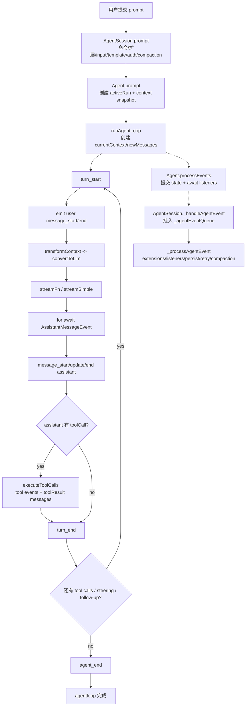

这张图可以作为阅读源码时的“罗盘”：如果你看到一段代码不知道属于哪一层，就问它在做哪件事：

- 统一 provider 输出：ai 层。
- 管理 turn 和工具循环：agent-loop 层。
- 提交内存状态与队列：Agent 层。
- 接入产品副作用：AgentSession 层。
