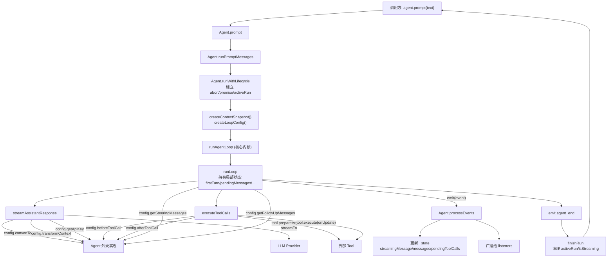

# Agent 与 agent-loop 分层设计：IoC 与 DI 详解

> 阅读范围：`packages/agent/src/agent.ts`、`packages/agent/src/agent-loop.ts`、`packages/agent/src/types.ts`
>
> 核心问题：为什么 `agent-loop` 要从 `Agent` 类中拆出来？这种拆分背后的设计哲学是什么？IoC 与 DI 在源码里到底对应哪些具体写法？

---

## 一、核心命题

`packages/agent` 把一个完整的 agent 运行时拆成两个文件：

- `agent.ts`：`Agent` 类
- `agent-loop.ts`：独立的顶层函数 `agentLoop` / `runAgentLoop` / `agentLoopContinue` / `runAgentLoopContinue`

这不是"代码太长顺手拆一下"，而是一次**有意的分层设计**，可以用一句话概括：

> **Agent 是"有状态外壳"，agent-loop 是"无长期状态的协议推进内核"；二者通过 DI 解耦，运行时表现为 IoC。**

下面从"定义—判据—源码证据—推演链条"四个层面展开。

---

## 二、关键概念的精准定义

这一节是全文的地基，措辞刻意收紧，避免后面被误用。

### 2.1 有状态外壳（Stateful Shell）

**定义：** 一个长期存活的对象/模块，负责持有跨调用存活的运行时状态，承担与外部世界（UI、调用方、I/O、生命周期）的对接工作。

**识别判据（满足其一即可）：**

- 通过 `this` 或闭包**长期封装**某种状态，且该状态在方法调用之间存活
- 承担**订阅者管理、队列管理、会话管理、生命周期管理**
- 对接 I/O、事件、取消、错误传播
- 对调用方暴露**面向对象的可变 API**（如 `prompt()`、`abort()`、`subscribe()`）

**典型职责：**

- 会话 transcript 的拥有与追加
- listener 注册与事件派发
- 请求排队（steering、follow-up）
- abort 控制、isStreaming 状态
- 错误状态的暴露

### 2.2 无（长期）状态核心（Stateless Core）

**定义：** 一个不持有跨调用存活对象状态的运行内核，每次运行所需的一切上下文都从参数传入，调用结束后不依赖内部残留状态继续工作。

**识别判据（三条全部满足）：**

1. **不拥有 `this` 形式的长期状态**：本质是函数或函数集合，不是"保存会话的对象"
2. **输入完备**：每次运行所需的上下文、依赖、回调都由参数提供，不暗中依赖某个全局/宿主对象
3. **调用结束即结束**：不留下等待下次继续使用的内部 runtime state

**重要澄清 —— "无状态"不等于"纯函数"：**

这里的"无状态"是**架构意义**上的，不是函数式编程意义上的：

- 它**可以有**局部变量（`firstTurn`、`pendingMessages`、`hasMoreToolCalls`）
- 它**可以有**副作用（调 LLM、执行工具、emit 事件）
- 它**可以有**异步时序控制
- 它**只是不长期封装状态**、**不充当会话 owner**

所以更严谨的叫法是 **"无长期状态核心"** 或 **"短生命周期状态机内核"**，而不是 FP 语境的 "stateless pure core"。

### 2.3 控制反转（IoC, Inversion of Control）

**定义：** 一段代码不再亲自控制某些可变决策（依赖如何创建、使用哪个实现、某个步骤如何执行，乃至流程本身如何编排），而是只声明自己需要什么能力或提供什么能力，通过接口、抽象、协议、回调或配置把这些控制点交给外部，这就是控制反转————某些**控制点**从函数自身**反转**到了外部调用者。

IoC 可以从“使用能力的一方”和“提供能力的一方”两个角度观察，两个角度其实是对立统一的。代码自身可以仍然掌握主流程（比如此项目的agent-loop），也可以把主流程交给框架（一些框架的使用中，把自己写成组件、回调、handler、hook等"声明式的描述"，让框架在合适的时机调用我，框架掌握一切流程）；关键在于，**原本由自己写死的决策被外部化了**。

> 关于 IoC 的两种典型形态（**形态 A：依赖/策略反转** vs **形态 B：主流程反转**）、它们的接口所有权差异，以及 `agent-loop` 在这张光谱上的精确定位，详见专题：[[4月27日]IoC的几种典型形态.md](./[4月27日]IoC的几种典型形态.md)。


### 2.4 依赖注入（DI, Dependency Injection）

**定义：** IoC 的一种**具体实现手段**。一个模块不自己实例化或硬编码依赖，而是通过**构造参数、函数参数、配置对象、接口实现**等方式，从外部接收它所需的能力。

**DI 常见形式：**

- 构造器注入（constructor injection）
- 方法参数注入（method parameter injection）
- 配置对象注入（把一组 hook/strategy 打包成 config）
- 回调注入（callback injection）
- 策略注入（strategy injection）

### 2.5 IoC 与 DI 的关系（避免混用）

- **IoC 是运行时现象**：主流程由核心掌握，外部能力被回调
- **DI 是语法/结构手段**：把依赖从外面传进来
- **DI 不必然导致 IoC**：把依赖传进去，但外部仍然一步步指挥调用顺序，这只是 DI，不是 IoC
- **IoC 不必然通过 DI 实现**：模板方法模式靠子类覆写也是 IoC，不是 DI

**本文对 `agent-loop` 的主张：** 这里同时成立 DI 和 IoC，且 DI 是实现手段，IoC 是运行时表现。

---

## 三、源码证据：Agent 作为"有状态外壳"

下面每一条都对应 `packages/agent/src/agent.ts` 的具体片段。

### 3.1 Agent 自己在注释里就把自己定位成"外壳"

```151:156:packages/agent/src/agent.ts
/**
 * Stateful wrapper around the low-level agent loop.
 *
 * `Agent` owns the current transcript, emits lifecycle events, executes tools,
 * and exposes queueing APIs for steering and follow-up messages.
 */
```

注释原话是 **"Stateful wrapper around the low-level agent loop"**，字面意义就是"包在低层 loop 外面的有状态外壳"。

### 3.2 Agent 拥有长期存活的内部状态

```157:186:packages/agent/src/agent.ts
export class Agent {
	private _state: MutableAgentState;
	private readonly listeners = new Set<(event: AgentEvent, signal: AbortSignal) => Promise<void> | void>();
	private readonly steeringQueue: PendingMessageQueue;
	private readonly followUpQueue: PendingMessageQueue;

	public convertToLlm: (messages: AgentMessage[]) => Message[] | Promise<Message[]>;
	public transformContext?: ...
	public streamFn: StreamFn;
	public getApiKey?: ...
	public onPayload?: SimpleStreamOptions["onPayload"];
	public beforeToolCall?: ...
	public afterToolCall?: ...
	private activeRun?: ActiveRun;
	public sessionId?: string;
	public thinkingBudgets?: ThinkingBudgets;
	public transport: Transport;
	public maxRetryDelayMs?: number;
	public toolExecution: ToolExecutionMode;
```

这里每一个字段都是典型的"外壳状态"：

- `_state`：transcript、model、tools 等会话状态
- `listeners`：订阅者集合
- `steeringQueue` / `followUpQueue`：跨调用存活的消息队列
- `activeRun`：当前运行的 abort/promise/resolver
- `convertToLlm`、`streamFn`、`beforeToolCall` 等：外部注入的能力，由外壳持有并在每次 run 时转交给 loop

这些状态在多次 `prompt()`/`continue()` 调用之间**持续存活**，因此满足 2.1 节判据。

### 3.3 Agent 负责生命周期、错误、abort、事件派发

```434:457:packages/agent/src/agent.ts
private async runWithLifecycle(executor: (signal: AbortSignal) => Promise<void>): Promise<void> {
	if (this.activeRun) {
		throw new Error("Agent is already processing.");
	}

	const abortController = new AbortController();
	let resolvePromise = () => {};
	const promise = new Promise<void>((resolve) => {
		resolvePromise = resolve;
	});
	this.activeRun = { promise, resolve: resolvePromise, abortController };

	this._state.isStreaming = true;
	this._state.streamingMessage = undefined;
	this._state.errorMessage = undefined;

	try {
		await executor(abortController.signal);
	} catch (error) {
		await this.handleRunFailure(error, abortController.signal.aborted);
	} finally {
		this.finishRun();
	}
}
```

`runWithLifecycle` 干的事全都是"外壳活儿"：

- 抢占并发锁（`activeRun` 互斥）
- 建立 abort 通道
- 建立 idle 同步原语（promise + resolve）
- 维护 `isStreaming`、`streamingMessage`、`errorMessage`
- 兜底异常 → 转成 `agent_end` 事件
- 最终清理 runtime 状态

这些都是**跨越一次 loop 调用**的状态管理，loop 自己不负责这些。

### 3.4 Agent 把"长期状态"打包成 snapshot/config 丢给 loop

```371:397:packages/agent/src/agent.ts
private async runPromptMessages(
	messages: AgentMessage[],
	options: { skipInitialSteeringPoll?: boolean } = {},
): Promise<void> {
	await this.runWithLifecycle(async (signal) => {
		await runAgentLoop(
			messages,
			this.createContextSnapshot(),
			this.createLoopConfig(options),
			(event) => this.processEvents(event),
			signal,
			this.streamFn,
		);
	});
}

private async runContinuation(): Promise<void> {
	await this.runWithLifecycle(async (signal) => {
		await runAgentLoopContinue(
			this.createContextSnapshot(),
			this.createLoopConfig(),
			(event) => this.processEvents(event),
			signal,
			this.streamFn,
		);
	});
}
```

这是外壳与内核之间**唯一的接触面**，形式非常干净：

- `messages`：新输入
- `createContextSnapshot()`：当前 transcript + tools + systemPrompt 的快照
- `createLoopConfig()`：把 hook、策略、队列访问器打包成一个配置对象
- `emit = (event) => this.processEvents(event)`：反向回调入口
- `signal`：abort 通道
- `streamFn`：LLM 适配函数

注意：**loop 拿到的不是 `Agent` 实例本身**，而是一组从 `Agent` 抽出来的纯数据/纯函数。

### 3.5 Agent 通过闭包把"队列访问"桥接进 loop

```407:431:packages/agent/src/agent.ts
private createLoopConfig(options: { skipInitialSteeringPoll?: boolean } = {}): AgentLoopConfig {
	let skipInitialSteeringPoll = options.skipInitialSteeringPoll === true;
	return {
		model: this._state.model,
		reasoning: this._state.thinkingLevel === "off" ? undefined : this._state.thinkingLevel,
		sessionId: this.sessionId,
		onPayload: this.onPayload,
		transport: this.transport,
		thinkingBudgets: this.thinkingBudgets,
		maxRetryDelayMs: this.maxRetryDelayMs,
		toolExecution: this.toolExecution,
		beforeToolCall: this.beforeToolCall,
		afterToolCall: this.afterToolCall,
		convertToLlm: this.convertToLlm,
		transformContext: this.transformContext,
		getApiKey: this.getApiKey,
		getSteeringMessages: async () => {
			if (skipInitialSteeringPoll) {
				skipInitialSteeringPoll = false;
				return [];
			}
			return this.steeringQueue.drain();
		},
		getFollowUpMessages: async () => this.followUpQueue.drain(),
	};
}
```

这段代码值得仔细看：`getSteeringMessages` 和 `getFollowUpMessages` **不是直接把队列暴露给 loop**，而是把"从队列里 drain 一批"这个**能力**以函数形式注入。Loop 自己没有"队列"的概念，它只知道"在某个时刻我要问一下外部还有没有 steering / follow-up"。

这是 **典型的 DI**。

### 3.6 Agent 自己聚合 loop 事件，驱动状态机

```491:538:packages/agent/src/agent.ts
private async processEvents(event: AgentEvent): Promise<void> {
	switch (event.type) {
		case "message_start":
			this._state.streamingMessage = event.message;
			break;

		case "message_update":
			this._state.streamingMessage = event.message;
			break;

		case "message_end":
			this._state.streamingMessage = undefined;
			this._state.messages.push(event.message);
			break;

		case "tool_execution_start": {
			const pendingToolCalls = new Set(this._state.pendingToolCalls);
			pendingToolCalls.add(event.toolCallId);
			this._state.pendingToolCalls = pendingToolCalls;
			break;
		}

		case "tool_execution_end": {
			const pendingToolCalls = new Set(this._state.pendingToolCalls);
			pendingToolCalls.delete(event.toolCallId);
			this._state.pendingToolCalls = pendingToolCalls;
			break;
		}
		...
	}

	const signal = this.activeRun?.abortController.signal;
	if (!signal) {
		throw new Error("Agent listener invoked outside active run");
	}
	for (const listener of this.listeners) {
		await listener(event, signal);
	}
}
```

这是 Agent 外壳的"事件 reducer"：

- 把 loop 丢出来的事件 → 聚合成持久化的外壳状态（`streamingMessage`、`messages`、`pendingToolCalls`、`errorMessage`）
- 再广播给订阅者

**loop 不关心这些**。Loop 只负责按协议顺序发事件，外壳自己消费。

---

## 四、源码证据：agent-loop 作为"无长期状态核心"

### 4.1 agent-loop 的公共入口全部是顶层函数

```31:54:packages/agent/src/agent-loop.ts
export function agentLoop(
	prompts: AgentMessage[],
	context: AgentContext,
	config: AgentLoopConfig,
	signal?: AbortSignal,
	streamFn?: StreamFn,
): EventStream<AgentEvent, AgentMessage[]> {
	const stream = createAgentStream();

	void runAgentLoop(
		prompts,
		context,
		config,
		async (event) => {
			stream.push(event);
		},
		signal,
		streamFn,
	).then((messages) => {
		stream.end(messages);
	});

	return stream;
}
```

全文**没有 class、没有 `this`、没有模块级可变全局状态**。每次调用需要的所有输入：

- `prompts`、`context`：会话数据
- `config`：策略、hook、钩子
- `signal`：取消
- `streamFn`：LLM 适配
- `emit`（内部用 `AgentEventSink`）：事件回调

全部**从参数传入**，满足 2.2 节的"输入完备"。

### 4.2 核心 loop 的状态都是函数局部变量

```155:232:packages/agent/src/agent-loop.ts
async function runLoop(
	currentContext: AgentContext,
	newMessages: AgentMessage[],
	config: AgentLoopConfig,
	signal: AbortSignal | undefined,
	emit: AgentEventSink,
	streamFn?: StreamFn,
): Promise<void> {
	let firstTurn = true;
	let pendingMessages: AgentMessage[] = (await config.getSteeringMessages?.()) || [];

	while (true) {
		let hasMoreToolCalls = true;

		while (hasMoreToolCalls || pendingMessages.length > 0) {
			if (!firstTurn) {
				await emit({ type: "turn_start" });
			} else {
				firstTurn = false;
			}

			if (pendingMessages.length > 0) {
				for (const message of pendingMessages) {
					await emit({ type: "message_start", message });
					await emit({ type: "message_end", message });
					currentContext.messages.push(message);
					newMessages.push(message);
				}
				pendingMessages = [];
			}

			const message = await streamAssistantResponse(currentContext, config, signal, emit, streamFn);
			newMessages.push(message);

			if (message.stopReason === "error" || message.stopReason === "aborted") {
				await emit({ type: "turn_end", message, toolResults: [] });
				await emit({ type: "agent_end", messages: newMessages });
				return;
			}

			const toolCalls = message.content.filter((c) => c.type === "toolCall");
			hasMoreToolCalls = toolCalls.length > 0;

			const toolResults: ToolResultMessage[] = [];
			if (hasMoreToolCalls) {
				toolResults.push(...(await executeToolCalls(currentContext, message, config, signal, emit)));

				for (const result of toolResults) {
					currentContext.messages.push(result);
					newMessages.push(result);
				}
			}

			await emit({ type: "turn_end", message, toolResults });

			pendingMessages = (await config.getSteeringMessages?.()) || [];
		}

		const followUpMessages = (await config.getFollowUpMessages?.()) || [];
		if (followUpMessages.length > 0) {
			pendingMessages = followUpMessages;
			continue;
		}

		break;
	}

	await emit({ type: "agent_end", messages: newMessages });
}
```

这里**确实有状态**：

- `firstTurn`
- `pendingMessages`
- `hasMoreToolCalls`
- `currentContext`（参数传入的副本）
- `newMessages`（参数传入的数组）

但这些状态的生命周期**就是这次 `runLoop` 调用**，函数返回后全部作废。  
**不持有跨调用存活的对象状态**，满足 2.2 节的"调用结束即结束"。

这就是我们说它是"架构意义上的无状态核心"的根据。

### 4.3 LLM 调用是可注入的

```261:271:packages/agent/src/agent-loop.ts
const streamFunction = streamFn || streamSimple;

// Resolve API key (important for expiring tokens)
const resolvedApiKey =
	(config.getApiKey ? await config.getApiKey(config.model.provider) : undefined) || config.apiKey;

const response = await streamFunction(config.model, llmContext, {
	...config,
	apiKey: resolvedApiKey,
	signal,
});
```

LLM 调用这一步被做成两层可注入：

- `streamFn`：整个 stream 函数可替换（测试用 faux provider 就是走这条）
- `getApiKey`：凭证解析也是回调，便于短生命周期 token（OAuth、Copilot）按需刷新

核心 loop 只负责"**在这里我要调 LLM**"这一事实，不负责"调哪个 LLM、用什么 key"。

### 4.4 工具调用是接口化的

```472:522:packages/agent/src/agent-loop.ts
async function prepareToolCall(
	currentContext: AgentContext,
	assistantMessage: AssistantMessage,
	toolCall: AgentToolCall,
	config: AgentLoopConfig,
	signal: AbortSignal | undefined,
): Promise<PreparedToolCall | ImmediateToolCallOutcome> {
	const tool = currentContext.tools?.find((t) => t.name === toolCall.name);
	if (!tool) {
		return {
			kind: "immediate",
			result: createErrorToolResult(`Tool ${toolCall.name} not found`),
			isError: true,
		};
	}

	try {
		const preparedToolCall = prepareToolCallArguments(tool, toolCall);
		const validatedArgs = validateToolArguments(tool, preparedToolCall);
		if (config.beforeToolCall) {
			const beforeResult = await config.beforeToolCall(...);
			if (beforeResult?.block) {
				return {
					kind: "immediate",
					result: createErrorToolResult(beforeResult.reason || "Tool execution was blocked"),
					isError: true,
				};
			}
		}
		return {
			kind: "prepared",
			toolCall,
			tool,
			args: validatedArgs,
		};
	} catch (error) {
		...
	}
}
```

Loop **不知道任何具体工具**，它只做：

- 从 `context.tools` 里按名字找工具（工具是外部传入的）
- 调用 `tool.prepareArguments`、`validateToolArguments`
- 在执行前回调 `config.beforeToolCall`（允许外部拦截）
- 在执行后回调 `config.afterToolCall`（允许外部改写结果）
- 通过 `tool.execute` 真正调用工具能力

所有"工具是什么、怎么校验、要不要放行、执行后要不要重写"的决策**全部反转到外部**。

### 4.5 事件派发是回调注入

```25:25:packages/agent/src/agent-loop.ts
export type AgentEventSink = (event: AgentEvent) => Promise<void> | void;
```

Loop 不知道 UI、不知道订阅者、不知道是否要 await。它只知道"在这个时机调一下 `emit`"，怎么消费由外壳决定。

---

## 五、两者的接触面：一次 run 的数据流

把前面分散的点合起来，看一次 `Agent.prompt()` 是怎么走完的：



从这张图可以一眼看出：

- **主流程时序由 `runLoop` 掌握**（turn loop、tool loop、follow-up loop 全在它手里）
- **所有"这里需要某种能力"的点都反向回调外部**（Agent 外壳或工具）
- **Agent 只负责"状态 + 适配"，不负责"流程"**

这就是 IoC。

---

## 六、设计哲学：从"对象方法"到"独立内核"的判据

回到最初的问题：**为什么 agent-loop 不留在 Agent 类里？**

可以给一个可操作的判据：

> **如果一段复杂控制流只服务于某个对象的一次性需求 → 作为类内方法即可；  
> 如果它已经是可独立复用的协议/状态机/工作流引擎 → 拆成独立内核。**

`agent-loop` 为什么属于后者？

- **可以独立运行**：只要传参齐全，脱离 `Agent` 也能跑
- **可以独立测试**：测试里可以不 new 一个 `Agent`，直接调 `runAgentLoop` + faux provider
- **可以被多个入口复用**：`agentLoop`（stream 版）、`runAgentLoop`（async 版）、`agentLoopContinue`、`runAgentLoopContinue` 都在复用同一套 `runLoop`
- **可以被不同外壳调用**：`Agent` 只是其中一种外壳，未来可以有别的外壳（例如"无状态一次性调用"场景）复用同一个 loop

---

## 七、推演链条（收紧版）

综合前面所有分析，把"为什么会用到 IoC+DI"这件事写成一条严谨的推演：

1. **先做分层**：把"长期运行时状态"和"协议推进逻辑"切开 → 得到 `Agent` 外壳 + `agent-loop` 内核
2. **要求内核可复用**：内核不能硬编码 `this._state`、`this.steeringQueue`、`this.listeners`、`streamSimple`，否则它只是 `Agent` 的内联方法
3. **把依赖从外面传进来**：  
   - 会话数据走 `context`  
   - 策略/钩子走 `config`  
   - 事件输出走 `emit`  
   - LLM 走 `streamFn`  
   - 工具走 `context.tools`  
   这一步就是 **DI**
4. **主流程时序由核心掌握**：turn、tool、follow-up 的顺序全在 `runLoop` 手里，外部能力只在特定节点被回调
5. **于是运行时表现为 IoC**：外部代码不再一步步指挥 loop，而是被 loop 在既定时机回调

**注意两条边界条件（避免把结论说太死）：**

- **无状态核心 ≠ 必然要 DI**：纯函数内核完全可以没有注入
- **DI ≠ 必然是 IoC**：只传依赖、不反转时序控制权，那只是 DI

在 `packages/agent` 里，两个条件**同时成立**，才让我们能一口气说出"DI 解耦、IoC 体现"。

---

## 八、一句话定稿

> **`Agent` 是长期运行时状态的宿主外壳，`agent-loop` 是不持有长期对象状态的协议推进内核；为了保持内核通用，依赖通过 DI（`context` / `config` / `emit` / `streamFn` / `tools`）注入；而当时序由 loop 掌控、外部能力仅在特定节点被反向调用时，运行时就体现为 IoC。**

---

## 九、附：源码对照速查表

| 概念 | Agent 外壳侧 | agent-loop 内核侧 |
|---|---|---|
| 长期状态 | `_state`、`listeners`、`steeringQueue`、`followUpQueue`、`activeRun` | 无，只有函数局部变量 |
| 生命周期 | `runWithLifecycle` / `handleRunFailure` / `finishRun` | `agent_start` / `turn_start` / `turn_end` / `agent_end` 事件 |
| 消息持久化 | `processEvents` 里 push 到 `_state.messages` | 只维护本次 run 的 `newMessages` 局部数组 |
| 队列 | `PendingMessageQueue` 实例，跨 run 存活 | 只通过 `getSteeringMessages` / `getFollowUpMessages` 回调拉取 |
| LLM 调用 | 通过 `streamFn` 字段提供默认值（`streamSimple`） | `streamFunction(config.model, llmContext, ...)` |
| 工具 | 通过 `_state.tools` 持有 | 通过 `context.tools` 按需查找并调用 |
| 拦截点 | `beforeToolCall` / `afterToolCall` 作为字段 | 在 `prepareToolCall` / `finalizeExecutedToolCall` 内回调 |
| 事件 | `subscribe` + `processEvents` + listener 广播 | `emit: AgentEventSink` 回调 |
| 取消 | 拥有 `AbortController`，暴露 `abort()` | 只接收 `signal: AbortSignal`，不拥有 controller |

这张表可以一眼看出：**所有"长期的东西"都留在外壳里，所有"协议推进"都在内核里**，二者只通过一组参数/回调接触。这就是全文要说明的分层。
