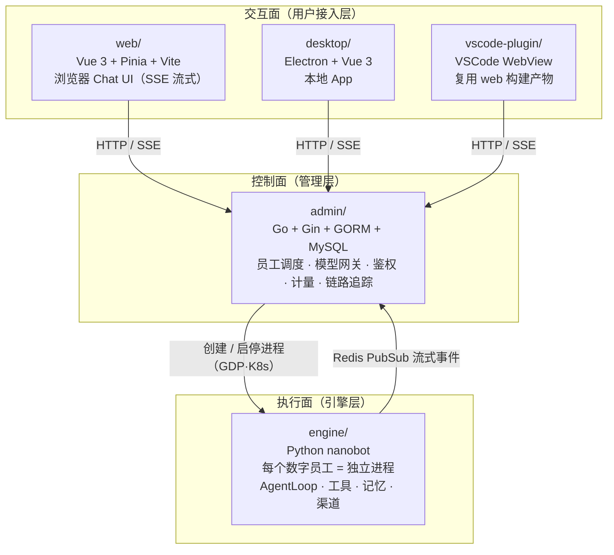
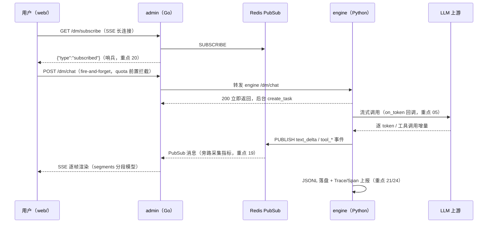

# 重点 00：项目总览与文档索引

> **一句话亮点（简历可直接用）**：星图数字员工（Digi-Pal）是一套生产级 AI 数字员工平台，采用"Web 交互面 / Go 控制面 / Python 执行面"三层架构，每个数字员工是独立 Agent 进程，支持多 Agent 群聊协作、工具调用、长期记忆与定时任务，具备完整的企业级鉴权、计量计费、链路追踪与多进程 K8s 编排能力。

## 项目是什么

星图数字员工平台让用户创建、管理并对话一群"AI 员工"：每个员工有自己的角色设定（System Prompt）、可使用的工具集（文件/Shell/WebSearch/MCP）、长期记忆与会话历史，可以接入外部消息渠道，也可以在 Web/桌面端/VSCode 插件里直接对话。多个员工还能拉进同一个"房间"（Room），通过 @mention 链式调用完成跨角色协作（如 PM 派活 → 后端开发 → 测试验收）。

三层架构（application/ 根仓 CLAUDE.md，五子包以 Git Submodule 聚合，见重点 24）：

端到端主链路（以 Web 端 DM 对话为例）：

## 技术栈总览

| 层 | 子包 | 语言 | 核心框架 | 运行形态 |
|---|---|---|---|---|
| 交互面 | `web/` | TypeScript | Vue 3 · Pinia · Vite | 浏览器 SPA |
| 交互面 | `desktop/` | TypeScript | Electron · Vue 3 | 桌面 App |
| 交互面 | `vscode-plugin/` | TypeScript | VSCode Extension API | IDE 插件 |
| 控制面 | `admin/` | Go | Gin · GORM · MySQL · Redis | 服务端多副本 |
| 执行面 | `engine/` | Python 3.11+ | aiohttp · LiteLLM · Pydantic | 每员工一独立进程 |

## 为什么这个项目能证明岗位要求的三种能力

"LLM 大模型应用 Agent 开发"岗位的核心要求可以拆成三条，本项目各有对应的重度设计点：

**1. 懂 LLM 原理（01-06）**。不是会调 API，而是理解模型行为的工程约束：上下文窗口有限所以要做工具结果 Offload 与分层 SystemPrompt（01/02）；Function Calling 的参数是流式到达的，需要按 turn 全局序号累积与容错解析（03）；LLM API 对消息序列有硬约束（孤立 tool_result 会被 400 拒），会话历史管理必须适配（04）；流式不只是文本，思维链、工具参数增量都要独立成帧（05）；Prompt 是责任边界，运行时注入与持久化数据严格分离（06）。

**2. 会 Agent 架构（07-13）**。Agent 的本质是"LLM 自主决策的开放循环"，最大的生产风险是死循环——本项目有轮数 + 时间 + 状态归因的多层防护（07）；工具系统支持本地工具与 MCP 统一注册、指纹增量热更（08）；有"读一次落一次"涌现式死循环的三层防护实战（09）；多 Agent 群聊有显式三态路由与 per-bot 预算环控（10）；子 Agent 有四重隔离边界与模型降档（11）；记忆系统三层（12）；Heartbeat/Cron 让员工从被动应答走向主动执行（13）。这些都是"Agent 平台"与"聊天壳子"的分水岭。

**3. 有大型项目全栈经验（14-24）**。平台侧是完整的企业级后端：多上游 LLM 统一网关（14）、SSE 三层代理（15）、三轨鉴权与四层权限（16）、计量计费与额度管控（17/18）、旁路指标采集（19）；系统侧是多进程运行时与 K8s 编排（22）、读写分离与流式恢复（20/23）、服务端权威 ID 与合并算法（21）、五子包 submodule monorepo 工作流与自研链路追踪（24）。从浏览器渲染到 K8s 调度，每一层都有真实代码。

## 文档索引

| 编号 | 文档 | 一句话摘要 | 能力维度 |
|---|---|---|---|
| 01 | [上下文工程：分层 SystemPrompt 构建](01-上下文工程-分层SystemPrompt构建.md) | 六信息源按"所有者+变更频率+优先级"分层拼装 SystemPrompt，兼顾维护性、缓存命中与多租户定制 | LLM 原理 |
| 02 | [上下文体积治理：工具结果 Offload](02-上下文体积治理-工具结果Offload.md) | 超 16K token 工具结果自动落盘换引用，JSON 走结构化摘要，根治上下文膨胀与截断误导 | LLM 原理 |
| 03 | [Function Calling 流式协议设计](03-FunctionCalling流式协议设计.md) | tool_calls 流式增量按 turn 全局序号编排，前端按序号精确匹配工具卡片 | LLM 原理 |
| 04 | [会话历史管理与 LLM API 约束适配](04-会话历史管理与LLM-API约束适配.md) | append-only JSONL + 读取侧多层清洗，保证消息序列永远满足 API 硬约束 | LLM 原理 |
| 05 | [流式输出全链路](05-流式输出全链路.md) | LLM token 到屏幕的五级链路、统一事件帧协议与逐级容错 | LLM 原理 |
| 06 | [Prompt 工程责任边界](06-Prompt工程责任边界.md) | 前端轻量注入 vs engine 权威文件实时读盘注入的双通道责任划分，斜杠命令前端短路 | LLM 原理 |
| 07 | [AgentLoop 核心循环与多层防死循环设计](07-AgentLoop核心循环与多层防死循环设计.md) | ReAct 主循环 + 轮数/时间/状态归因多层防死循环，七态 stop_reason 归因 | Agent 架构 |
| 08 | [工具系统架构：ToolRegistry 与 MCP](08-工具系统架构-ToolRegistry与MCP.md) | 30+ 内置工具与 MCP 统一注册，懒加载 + 指纹增量热更 + 按 server 精确卸载 | Agent 架构 |
| 09 | [涌现式死循环：读一次落一次三层防护](09-涌现式死循环-读一次落一次三层防护.md) | 落盘机制与 LLM 重试行为交互产生的涌现死循环，前缀保护/入参嗅探/双轨一致三层防护 | Agent 架构 |
| 10 | [多 Agent 协作：Room 链式调用](10-多Agent协作-Room链式调用.md) | @mention 双轨解析、PM 星型拓扑、显式三态路由 + max_hops/per-bot 预算双层环控 | Agent 架构 |
| 11 | [子 Agent 隔离与独立限额](11-子Agent隔离与独立限额.md) | 上下文/工具集/限额/模型降档四重隔离边界，运行时热更 | Agent 架构 |
| 12 | [Agent 记忆系统](12-Agent记忆系统.md) | 短期滑窗 + SUMMARY 滚动摘要 + MEMORY 事实库三层，token 预算触发异步压缩 | Agent 架构 |
| 13 | [Heartbeat 与 Cron：从被动到主动](13-Heartbeat与Cron-从被动到主动.md) | 虚拟工具两阶段心跳决策 + Cron 无状态化纯函数调度 | Agent 架构 |
| 14 | [Go 模型网关——多上游 LLM 统一代理](14-Go模型网关-多上游LLM统一代理.md) | OpenAI /v1 兼容网关承载鉴权/审计/流式透传/故障降级标记四大横切能力 | 后端工程 |
| 15 | [SSE 流式代理三层工程](15-SSE流式代理三层工程.md) | Redis 直连 + engine 降级双链路，256KB 缓冲、25s ping、哨兵+快照首帧 | 系统工程化（兼后端工程） |
| 16 | [企业级双鉴权与细粒度权限](16-企业级双鉴权与细粒度权限.md) | JWE/iHub/API Key 三轨鉴权 + 角色→授权域→用户×模型四层权限 | 后端工程 |
| 17 | [计量计费——usage 三通道与成本固化](17-计量计费-usage三通道与成本固化.md) | 三通道汇聚事实表，单价内存快照写时固化，inflated prompt_tokens 归一化 | 后端工程 |
| 18 | [额度管控——三层 quota 与 Lua 原子累加](18-额度管控-三层quota与Lua原子累加.md) | 四层优先级额度解析 + Lua 原子累加防超扣 + 快照/singleflight + MyOA 审批扩容 | 后端工程（兼系统工程化） |
| 19 | [流式旁路指标采集](19-流式旁路指标采集.md) | 字节级预筛 + 局部 struct 反序列化的零阻塞旁路采集，per-task 状态机双兜底 | 系统工程化（兼后端工程） |
| 20 | [读写分离架构：Fire-and-Forget 与哨兵握手](20-读写分离架构-FireAndForget与哨兵握手.md) | 收发通道拆分 + subscribed 哨兵/NUMSUB 双保险解订阅竞态，quota 前置拦截补偿错误可见性 | 系统工程化 |
| 21 | [服务端权威 ID 与历史合并算法](21-服务端权威ID与历史合并算法.md) | turn 级 UUID 三通路透传，ID 精确匹配合并替代启发式（六代演进） | 系统工程化 |
| 22 | [多进程数字员工架构与 K8s 编排](22-多进程数字员工架构与K8s编排.md) | 每员工一进程、Supervisor 熔断 reconcile、DB 唯一键端口分配、GDP Workload 编排 | 系统工程化 |
| 23 | [流式恢复防御体系](23-流式恢复防御体系.md) | 快照/增量会师的五道正交幂等防线，任一失效下游自愈 | 系统工程化 |
| 24 | [工程化实践：monorepo 工作流与可观测性](24-工程化实践-monorepo工作流与可观测性.md) | 五子包 submodule 工作流 + 分支联动 githooks + 自研轻量 Trace/Span 链路追踪 | 系统工程化 |

## 阅读建议

- **时间有限**：先读 07（Agent 最核心的循环设计）→ 20/21（最有区分度的系统设计）→ 22（架构广度）；
- **面试准备**：每篇末尾的"面试话术"可直接背诵，"可能的追问"用于自测；
- **深入验证**：每篇"代码依据"节给出了精确到文件:行号的源码锚点，可对照真实仓库核实。

## 事实边界

- 本系列全部文档以 `/Users/mattmdfang/Developer/application/` 各子仓当前工作区为唯一事实源核实（engine develop 2026-07-31 / admin feature/application-share-notice 2026-07-28 / web feature/application-share 2026-07-21）；本地另一份 `digi-pal/` 目录为 2026-05 中旬旧快照，不作为依据；
- 项目为真实生产代码（腾讯内部业务），文中涉及的内部平台（GDP、Rainbow、MyOA、太湖网关等）均有外部等价物；
- 各篇行号基于撰写时的工作区快照，后续代码演进可能导致行号漂移，函数名锚点仍然有效；
- 本索引各篇摘要对照各篇正文开头的"一句话亮点"撰写，细节以各篇正文为准。
