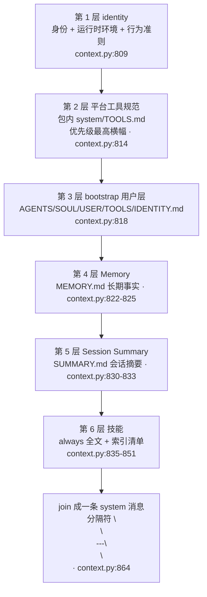

# 重点 01：上下文工程 —— 分层 SystemPrompt 构建

> **一句话亮点（简历可直接用）**：设计并实现 Agent 运行时的分层 SystemPrompt 构建器（ContextBuilder），将身份、平台工具规范、用户引导文件、长期记忆、会话摘要、技能清单六个信息源按"所有者 + 变更频率 + 优先级"分层拼装，解决了单一巨型 prompt 的维护性、缓存命中率与多租户定制冲突三大工程问题。

## 为什么这是一个值得重点介绍的难点

写过一个 LLM Demo 的人都知道 system prompt 怎么写：把所有指令拼成一个大字符串发给模型。但把 Agent 产品化之后，"一个大字符串"会同时撞上三堵墙：

- **所有者不同**。工具使用规范（offload / exec / jq 的行为约定）描述的是引擎自身行为，必须跟随引擎版本升级；而人设（SOUL.md）、用户画像（USER.md）是每个数字员工（bot）各自的工作区文件，员工可以自定义、引擎绝不能覆盖。一个字符串无法表达"这段归平台管、这段归用户管"。
- **变更频率不同**。身份与工具规范几乎不变，记忆和摘要每天变，运行时上下文（当前时间、群聊花名册）每轮都变。LLM API 的 prompt cache 按前缀匹配计费/加速，把每轮都变的内容放在前面会让整个前缀缓存失效。
- **优先级冲突**。当员工在自己的 TOOLS.md 里写了与平台规范冲突的内容（比如旧版员工残留了过时的工具约定），必须有一个明确的仲裁规则，否则不同员工的行为漂移无法收敛。

这个难点的本质是：**prompt 不是一段文本，而是一个有所有权、有优先级、有缓存语义的数据结构**。分层构建就是把这些工程语义显式编码进拼装顺序里。

## 先备知识：本文涉及的术语与变量

| 术语/变量 | 含义与示例 |
|---|---|
| **system prompt** | 发给 LLM 的消息列表里 `role="system"` 的第一条消息，承载"你是谁、你能做什么、你必须遵守什么"。本项目的所有分层都拼在这**一条** system 消息内部，用 `\n\n---\n\n` 分隔。 |
| **ContextBuilder** | 类，上下文构建器（`engine/nanobot/agent/context.py:722`）。负责把各信息源组装成 LLM 的 messages 数组。 |
| **build_system_prompt** | 方法（`context.py:777`）。分层拼装 system prompt 的入口，返回完整字符串。 |
| **identity / 身份层** | `_get_identity()` 产出（`context.py:866`）。内容：bot 名称与 ID、运行时环境（OS/Python 版本）、工作区路径、行为准则（如"修改文件前先读取"）。示例片段：`"# Nova\n\n你是 Nova，一个乐于助人的 AI 助手。（ID: emp-a3f9）"`。 |
| **平台层 prompt** | 代码持有的工具规范，从包内 `nanobot/templates/system/TOOLS.md` 读取，运行时注入。映射表是常量 `PLATFORM_PROMPT_FILES`（`context.py:59`）。 |
| **bootstrap 文件 / 用户层** | bot 工作区根目录下的引导文件，列表是常量 `BOOTSTRAP_FILES = ["AGENTS.md", "SOUL.md", "USER.md", "TOOLS.md", "IDENTITY.md"]`（`context.py:744`）。员工可自由编辑。 |
| **MEMORY.md** | 长期记忆文件，存跨会话稳定事实。示例内容：`"## 用户偏好\n用户喜欢简洁直接的回答"`。由 LLM 调 memory 工具维护。 |
| **SUMMARY.md** | 本会话滚动摘要，老消息的压缩叙述。示例：`"[2026-07-30 14:00] 用户要求重构登录模块，已交付 login_v2.tsx…"`。 |
| **always 技能** | frontmatter 里标了 `always: true` 的技能，其 SKILL.md 全文注入每一轮上下文。 |
| **技能摘要列表** | 所有可用技能的 XML 格式索引（名称+描述+是否可用），LLM 需要时再 `read_file` 加载全文——渐进式加载，避免一次性塞爆。 |
| **运行时上下文** | 每轮都变的元数据：当前时间、频道、群聊花名册等。**不在 system prompt 里**，而是与用户消息合并成同一条 user 消息。 |
| **_RUNTIME_CONTEXT_TAG** | 常量标记（`context.py:745`），运行时上下文块的起始标签，保存会话时据此把它从持久化历史里剥离——因为它每轮都不同，不该写进 JSONL。 |
| **prompt cache** | LLM 提供商的上下文缓存机制：请求前缀与上次一致的部分可以复用、省钱省时。前缀越稳定收益越大。 |

## 技术剖析

### 分层顺序总览

`build_system_prompt`（`context.py:777-864`）的拼装顺序是固定六层：



核心代码骨架（`context.py:809-864`）：

```python
parts = [self._get_identity(memory_enabled=_mem_on)]
platform_prompt = self._load_platform_prompts()   # 平台层：代码持有
if platform_prompt:
    parts.append(platform_prompt)
bootstrap = self._load_bootstrap_files()          # 用户层：workspace 文件
if bootstrap:
    parts.append(bootstrap)
if _mem_on:
    memory = self.memory.get_memory_context()     # 长期记忆
    if memory:
        parts.append(f"# Memory\n\n{memory}")
    if chat_id:
        summary_block = self.memory.get_summary_context(chat_id)  # 会话摘要
        if summary_block:
            parts.append(f"# Session Summary\n\n{summary_block}")
# …… always 技能全文、技能索引清单 ……
return "\n\n---\n\n".join(parts)
```

### 为什么是这个顺序：三个维度的排序依据

**维度一：稳定性递减（缓存友好）**。越靠前越稳定：身份层一个版本周期才变一次，平台层随引擎版本变，bootstrap 随员工定制变，Memory/Summary 随对话变。LLM prompt cache 按前缀匹配，把最稳定的内容放最前面，前缀命中率最大化。反过来每轮都变的运行时上下文（当前时间、群花名册）干脆不进 system，而是合并进 user 消息（`context.py:1766-1776`），注释里写明了第二个原因——"避免部分 LLM provider 拒绝连续同角色消息"。

**维度二：优先级递增宣告（冲突仲裁）**。平台层前面挂着一条横幅（`context.py:1636-1640`）：

```python
"> ⬇️ 以下为**平台级工具使用规范**，由系统统一注入、**优先级最高**；"
"若与后文「用户自定义」内容冲突，一律以本节为准。\n\n"
```

而用户层的同名 TOOLS.md 被显式降级标注（`context.py:1697-1700`）：`"## TOOLS.md（用户自定义工具补充 · 优先级低于平台规范）"`。顺序本身不构成仲裁，**文案显式声明**才构成——这是在用 LLM 能理解的语言把工程所有权翻译给它。

**维度三：所有权分离（目录即职责）**。平台层从包内 `nanobot/templates/system/TOOLS.md` 读取（`_read_packaged_template`，`context.py:70-94`），模板同步逻辑只遍历顶层 `templates/*.md`，`system/` 子目录天然不会下发到员工工作区——位置自己表达"这是代码的"。用户层在同一个工作区，员工可编辑。历史上平台规范曾被同步进每个员工工作区且"只创建不覆盖"，导致引擎升级后存量员工永远拿不到新规范（`context.py:46-58` 的模块注释完整记录了这段教训）。

### 细节设计：三个值得讲的工程点

**1. 纯注释脚手架不注入**。新建员工的工作区会种下一个只有注释的 TOOLS.md 脚手架。`_is_effectively_empty`（`context.py:97-99`）用正则剥掉 HTML 注释后判空，纯注释文件不注入——否则每个新员工都顶着一段空壳说明浪费 token。

**2. 包内模板缓存只缓存成功**。`_PACKAGED_TEMPLATE_CACHE`（`context.py:64-67`）的注释明确指出：读失败返回空串但**不写缓存**，避免 `lru_cache` 把一次瞬时 IO 失败固化成"平台层永久禁用"。这是防御性缓存的经典细节。

**3. 人格占位符每次构建时渲染**。bootstrap 文件支持 `${login_name}` / `${bot_name}` 等占位符（`_persona_vars`，`context.py:1643-1667`），每轮构建时替换、原文不回写磁盘——同一个 SOUL.md 文件对不同登录用户渲染出不同称呼，且心跳等无用户上下文的后台路径渲染为空串而非泄漏占位符原文。

## 关键设计决策与权衡

1. **一条 system 消息内部分层，而非多条 system 消息**：多家 provider 对多条 system 消息的兼容性参差不齐，分层用 `---` 分隔符在单条消息内表达，规避兼容性问题，同时保留了层的语义边界。
2. **平台层运行时注入而非下发到工作区**：换来的是"全员永远最新"（含存量员工），代价是员工看不到自己 prompt 的完整实物（要看包内模板）。权衡结果是正确性优先——工具规范与引擎行为不一致的代价远高于透明度。
3. **运行时上下文与用户消息合并为同一条 user 消息**：牺牲了一点消息结构纯度（user 消息里混着元数据），换来 provider 兼容性（Claude 拒绝连续同角色消息）和缓存友好。
4. **技能用"索引 + 按需 read_file"而非全量注入**：技能全文只在标了 always 时注入，其余只给名称和描述。这是渐进式披露（progressive disclosure）在 prompt 工程里的落地——上下文是稀缺资源，按需加载。

## 面试话术（怎么讲）

> 我们的 Agent 每个员工都有人设文件、长期记忆、技能，全塞一个 prompt 里维护不了。我做了分层 ContextBuilder，把 system prompt 分成六层：身份、平台工具规范、用户引导文件、MEMORY 长期记忆、SUMMARY 会话摘要、技能清单。分层依据有三个：稳定性递减放前面吃 prompt cache；平台层带"优先级最高"横幅做冲突仲裁；目录即所有权——平台层从代码包内读、运行时注入，引擎升级全员生效，用户层留在员工工作区可自由定制。还有几个细节：纯注释脚手架不注入、模板缓存只缓存成功结果、人格占位符每轮渲染不回写。这套结构让几十个数字员工的 prompt 行为可收敛、可灰度、可升级。

## 可能的追问及答案

**Q：为什么不直接用多个 system 消息表达层？**
A：兼容性。部分 provider 对多条 system 消息处理不一致甚至报错，单条消息 + 分隔符是最保守的公共子集。而且分层语义靠文案声明（优先级横幅）而非消息结构，对 LLM 更直白。

**Q：平台层和用户层冲突时，LLM 真的会听横幅的吗？**
A：大模型对"以本节为准"这类显式仲裁指令的遵循度相当高，尤其是放在靠近头部的位置。但我们也承认这是软约束，所以硬保障是另一层：用户层 TOOLS.md 在纯注释时根本不注入，从源头上减少冲突面。

**Q：分层顺序对模型行为影响大吗？**
A：有影响。LLM 对上下文不同位置的信息注意力不同（近因效应），我们把"你是谁、必须遵守什么"放头部，把"我记得什么"放中部，把"你还能学什么"（技能索引）放尾部。运行时上下文这类每轮变化的则移出 system 放到 user 消息里，顺便解决 provider 对连续同角色消息的拒绝问题。

**Q：新增一个平台层文件要改几处？**
A：只改一处——`PLATFORM_PROMPT_FILES` 映射表（`context.py:59`），加一行"工作区文件名 → 包内路径"。加载、优先级横幅、缓存都是通用逻辑。这是当初设计映射表的目的：新增平台层不该是代码变更，该是配置变更。

**Q：如果重新设计，会改什么？**
A：会引入 token 预算的分层配额——目前各层没有独立的 token 上限，极端情况下 MEMORY.md 或某个巨型 SOUL.md 会挤压其他层。理想做法是给每层设预算、超预算降级为摘要，并上报指标。现在只有 SUMMARY（4000 字符）和 MEMORY（4000 字符）有硬上限，其他层靠自觉。

## 事实边界

- 本文基于 `application/` 工作区（engine develop 分支，最新提交 2026-07-31）逐行核实；`digi-pal/` 为 2026-05 中旬旧快照，不作为依据。旧快照中该文件仅 806 行、无平台层与 Summary 层，与本文描述不一致，以 `application/` 为准。
- 分层靠文案声明与顺序约定引导 LLM，不是机制强约束；模型在极端长上下文下仍可能"忘记"头部指令，这是所有 prompt 工程的共同局限。
- "prompt cache 命中率提升"是设计意图，具体命中率取决于提供商缓存策略，项目内未做逐层命中率的量化实验。
- 技能索引的"按需 read_file"依赖模型自觉触发，对弱模型可能不主动加载。

## 简历亮点描述（可直接引用）

- 设计实现六层 SystemPrompt 构建器 ContextBuilder，按"所有者/变更频率/优先级"分层拼装身份、平台规范、用户文件、记忆、摘要、技能，解决多数字员工 prompt 的所有权冲突与升级漂移问题；
- 建立平台层运行时注入机制（代码持有、优先级横幅仲裁、纯注释脚手架跳过），引擎升级后全员 prompt 规范即时生效，无需逐员工迁移；
- 通过稳定性排序优化 prompt cache 前缀命中、运行时上下文与 user 消息合并规避 provider 兼容性限制。

## 代码依据

- `engine/nanobot/agent/context.py:777-864`（build_system_prompt 六层拼装）、`:866`（identity 层）、`:59`（PLATFORM_PROMPT_FILES 映射）、`:70-94`（包内模板读取与成功缓存）、`:97-99`（纯注释判空）、`:744`（BOOTSTRAP_FILES）、`:1624-1641`（平台层注入与优先级横幅）、`:1669-1704`（用户层加载与降级标注）、`:1643-1667`（人格占位符变量）、`:1706-1827`（build_messages）、`:1766-1776`（运行时上下文并入 user 消息）、`:745`（_RUNTIME_CONTEXT_TAG）
