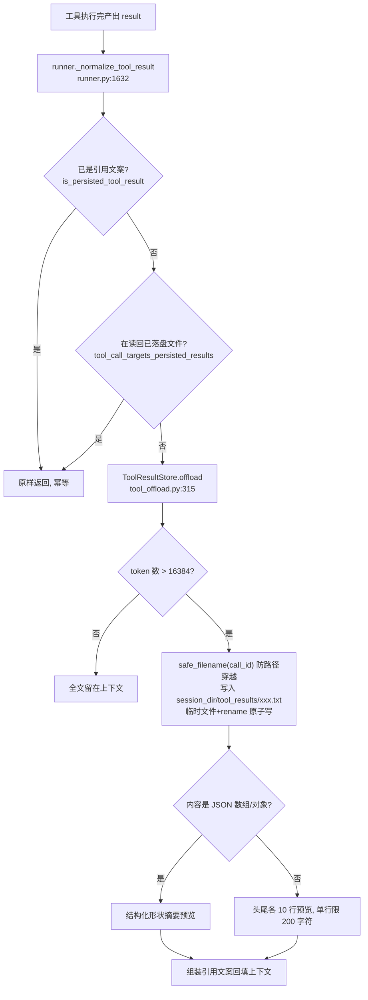

# 重点 02：上下文体积治理 —— 工具结果 Offload（超阈值落盘 + 引用回填）

> **一句话亮点（简历可直接用）**：设计并实现工具结果的 token 阈值 Offload 机制——单条工具输出超过 16K token 自动落盘、上下文里替换为"路径 + 原始大小 + 头尾预览"的引用文案，JSON 结果走结构化形状摘要，根治了"大工具输出撑爆上下文"与"截断误导 LLM 重跑工具"两类生产事故。

## 为什么这是一个值得重点介绍的难点

Agent 的工具会产出任意大的输出：`find` 几千行、电商接口返回几十 KB 的商品列表 JSON、构建脚本输出几百行日志。这些输出要回填进 LLM 上下文让模型读，但上下文窗口是稀缺资源——一条 40KB 的工具结果就是一万多 token，几条就把 128K 窗口啃掉一大块，还会推高每一轮的输入成本。

直观的解法是截断，但截断会引入一个更隐蔽的杀手：**LLM 看到被截断的结果，会误判"输出不完整"，于是重跑同一个工具**——结果又被截断，形成死循环（这个项目里真实出现过 LLM 自建一整套 python 解析流水线的案例）。所以难点不是"怎么省 token"，而是：

1. 省 token 的同时，必须让 LLM **明确知道**"全文在哪、有多大、要不要去拉"；
2. 预览必须覆盖"结果的关键语义入口"——脚本输出的关键结果往往打印在**末尾**，只截头部会把结果挡在门外；
3. minified JSON 是单行巨串，按行截断会把它切成误导性碎片；
4. LLM 给的 `tool_call_id` 可能含 `/`、`..` 这类路径穿越字符，落盘文件名不能直接用。

这套机制就是围绕这四个真实问题设计的。

## 先备知识：本文涉及的术语与变量

| 术语/变量 | 含义与示例 |
|---|---|
| **offload** | 本意"卸载"。指把过大的工具结果从 LLM 上下文里"卸"到磁盘文件，上下文里只留一个引用。 |
| **ToolResultStore** | 类（`engine/nanobot/agent/tool_offload.py:258`）。单会话维度的工具结果落盘存储，只对一个目录负责。 |
| **session_dir** | 会话目录，如 `<workspace>/sessions/dm-emp-a3f9-1234/`。offload 文件落在它的 `tool_results/` 子目录下，与会话同生命周期。 |
| **call_id / tool_call_id** | 一次工具调用的唯一 ID，由 LLM 生成。示例：`"toolu_01ABCxyz"`。落盘文件名由它派生。 |
| **token_threshold** | 参数。触发 offload 的 token 阈值，默认 16384（16K）。`<= 0` 关闭功能。 |
| **NANOBOT_TOOL_OFFLOAD_TOKENS** | 环境变量（`engine/nanobot/agent/session_md_flags.py:72-74`），配置上述阈值；也可运行时用 `my(set, tool_offload_tokens=N)` 热改。 |
| **引用文案 / 引用态** | offload 后塞回上下文的替代文本，固定以 `"[tool output persisted]\n"` 开头（常量 `TOOL_RESULT_PERSISTED_PREFIX`，`engine/nanobot/utils/helpers.py:348`），包含落盘路径、原始大小、预览。 |
| **形态闭包** | 设计原则（`engine/nanobot/agent/loop.py:16-19`）：上下文里的工具结果只允许两种身份——鲜活态（≤阈值，全文保留）或引用态（落盘 + 引用文案），不存在第三种"被裸截断"的形态。 |
| **safe_filename** | 函数（`helpers.py:108`）。把文件名中的不安全字符（`< > : " / \ \| ? *`）替换为下划线，防路径穿越。 |
| **头尾预览** | 引用文案里的预览口径：前 10 行 + 后 10 行，中间标注省略行数。 |
| **结构化 JSON 摘要** | 当落盘内容是 JSON 数组/对象时，预览不用行预览，改给"形状摘要"：几条数据、每条有哪些字段、首尾几条样例。 |
| **_count_tokens** | 函数（`tool_offload.py:58-78`）。优先用 tiktoken 精确计数，未安装回退 `len(text) * 0.4` 的经验估算。 |

## 技术剖析

### 整体流程



### 单一阈值机制：消灭"丢尾盲区"

`runner.py:1642-1647` 的 docstring 记录了关键演化：现在**只**有 token 阈值这一种判定——`≤ 16384` 留全文，`> 16384` 落盘换引用，**不再有任何字符级硬截断**。历史上曾同时存在"字符截断（3000 chars）"和"token 落盘（8192）"两套口径，单位不一致夹出一个盲区：某条结果够长被裸切、却又没过 token 阈值不落盘——LLM 拿到的是没有引用路径、没有结尾提示的残片，连"去文件里读全文"的逃生通道都被切掉了。统一为单一 token 阈值后，任何形态都自带逃生通道，这就是"形态闭包"。

### 阈值为什么是 16K：数据驱动调参

`session_md_flags.py:65-71` 的注释完整记录了这次调参的依据：旧默认 8192（≈20KB 字符）在数据流水线类工作负载下偏保守——生产 room 目录里观察到 41KB ≈ 16.5K tokens 的电商礼包结果被频繁 offload，逼得 agent 自建解析脚本绕路。提到 16384 后，这类中等结果可直接进上下文，在 128K 窗口里仅占约 12.5%；仍超阈值的才落盘。单实例还能用 `my(set, tool_offload_tokens=32768)` 给重数据 room 继续上调。这不是拍脑袋的数值，是**观测生产落盘分布后**的调整。

### 预览口径：头尾各 10 行 + 单行 200 字符钳制

`_format_preview`（`tool_offload.py:81-113`）取前 10 行 + 后 10 行。为什么要尾部？docstring 写得很直接：脚本类输出的关键结果（新建资源 ID、URL、最终状态）通常打印在**末尾**，只取头部会把结果挡在预览之外，导致 LLM 误判要重跑。同时单行超过 200 字符会被截断加 `"..."`（`_PREVIEW_LINE_MAX_CHARS`，`tool_offload.py:46`），防止一行巨大的 minified JSON 把整个预览块撑爆。

### JSON 结构化摘要：专治 minified JSON 误导

这是最有故事性的一个设计（`tool_offload.py:116-204`）。列表型工具结果常是"N 条对象的数组"，且经常序列化成**单行**——纯行预览要么只露出 200 字符（单行被钳），要么吞掉中间项，让 LLM 误判"结果被截断"于是重跑工具、甚至自写 python 解析脚本（生产 room 目录里真实观察到一整套手工流水线）。`_structured_json_preview` 在内容首字符是 `[`/`{` 时尝试 `json.loads`，成功后给形状摘要：

```
JSON array · 1523 items
item keys: [id, name, price, stock, …]
[0] {"id":1001,"name":"礼包A",…}
[1] {"id":1002,"name":"礼包B",…}
[2] {"id":1003,"name":"礼包C",…}
... 1517 more items (full list on disk) ...
[1520] {...}
```

LLM 一眼知道"这是 1523 条的数组、字段是什么、全文在盘上"，可以用 `jq` 精确提取而不是重跑。对象则给 `JSON object · N top-level keys` + 各字段类型/规模描述。

### 安全与可靠性细节

- **防路径穿越**：`path_for`（`tool_offload.py:296-302`）的文件名走 `safe_filename`——注释里点名 Anthropic 实测会出现 `toolu_xxx/yyy` 这种含斜杠的 call_id。
- **原子写**：`_write_text_atomic`（`tool_offload.py:240-252`）先写临时文件再 `replace`，避免并发读取看到半截内容。
- **幂等**：内容已是引用文案就直接返回（`tool_offload.py:339-340`），同 call_id 已落盘不重复写（`:371`）。
- **失败降级**：建目录失败、写盘失败都原样返回全文（`:359-378`）——offload 是优化不是闸口，绝不能把工具结果弄丢。
- **生命周期与会话绑定**：`/new` 命令重置会话时 `tool_results/` 整目录一起 GC（`loop.py:3670-3676` + `ToolResultStore.reset`，`tool_offload.py:427-446`），磁盘不会无限累积。

## 关键设计决策与权衡

1. **token 阈值而非字符阈值**：token 才是 LLM 上下文的计价与容量单位，字符数与 token 的换算随中英比例漂移。代价是要引入 tiktoken 软依赖，未安装时用 `len*0.4` 经验值兜底。
2. **落盘到 session_dir 而非全局桶**：换来 `/new` 整目录 GC 的简洁生命周期，不需要 LRU 清理那套复杂逻辑；代价是跨会话无法复用同一文件——但工具结果本就是会话级产物，复用价值低。
3. **引用文案前缀新旧两轨完全一致**：旧路径（`.nanobot/tool-results/` 全局桶）与新路径产出的前缀都是 `[tool output persisted]\n`，所有消费方（判重、防二次截断）零改动无感切换。
4. **预览给头尾而非只给头**：覆盖"结果在末尾"的高频场景，代价是多给 10 行——10 行 × 200 字符钳制下成本有硬上界。

## 面试话术（怎么讲）

> 工具结果治理我踩过最深的坑是：直接截断会让 LLM 误判输出不完整而反复重跑工具。我做的方案是 token 阈值 offload：单条工具结果超过 16K token 就落盘到会话目录，上下文里换成引用文案——落盘路径、原始大小、头尾各 10 行预览。尾部预览是因为脚本的关键结果通常打在末尾。JSON 结果单独走结构化形状摘要，告诉模型"这是 1523 条数组、字段是这些"，防止单行 minified JSON 被行截断切碎误导。阈值从 8K 调到 16K 是看了生产落盘分布后定的，41KB 的电商结果不再被误伤。安全上 call_id 过 safe_filename 防路径穿越，写盘走临时文件加 rename 原子写，失败一律降级留全文——offload 是优化，不能成为数据丢失的闸口。

## 可能的追问及答案

**Q：LLM 怎么知道去读落盘文件？**
A：引用文案里明确写着 `Full output saved to: <path>` 和 `(Read the saved file if you need the full output.)`。且系统有旁路保护：LLM 真的去 `read_file` 这个路径时，`tool_call_targets_persisted_results` 会嗅探出来，这次读回的全文**不再**被二次 offload，打破"读一次落一次"的死循环。

**Q：为什么不用向量检索/RAG 替代落盘？**
A：工具结果是结构化、强精确性的数据（接口返回、日志），LLM 需要的是确定性访问（jq、grep、按行读），不是语义相似度。文件系统 + jq 比向量库更精确、零额外基础设施。RAG 适合知识库，不适合工具输出。

**Q：16K 阈值会不会让上下文还是太大？**
A：阈值管的是"单条结果"，上下文的总量治理是另一套机制（记忆整合按 0.4×128K 触发，即 `NANOBOT_CONTEXT_TOKEN_RATIO`）。单条 16K 在 128K 窗口占 12.5%，属于"模型能直接消费"的量级；真正危险的是几十 K 的单条结果，那部分稳定落盘。两级机制是正交的。

**Q：原子写为什么必要？谁会并发读？**
A：同会话的工具调用可能并发派发，且 admin 端历史接口、前端轮询都可能读到这个目录。临时文件 + rename 保证读者只看到替换前或替换后的完整文件，成本极低，是文件写入的标配防御。

**Q：如果重新设计，会改什么？**
A：会加"引用文案的自动失效与召回"——目前引用文案永久留在历史里，几十轮后 LLM 可能拿着早已 GC 掉的路径去读。理想做法是历史出口处检测引用指向的文件是否还存在，不存在就替换为"该结果已过期"的明确标注，避免模型对一个死路径反复 read_file。

## 事实边界

- 本文基于 `application/` 工作区（engine develop 分支，最新提交 2026-07-31）逐行核实；`digi-pal/` 为 2026-05 中旬旧快照，不作为依据（旧快照中本机制是 4000 字符阈值 + 1200 字符头部预览的 char-based 版本，与本文描述差异很大，以 `application/` 为准）。
- token 计数在 tiktoken 不可用时退化为 `len(text)*0.4` 经验估算，阈值判定会有偏差，但对"粗粒度阈值判断"足够。
- "根治死循环"指消除了截断误导这一类诱因，不能保证模型不会因其他原因重跑工具。
- 结构化摘要只覆盖标准 JSON 数组/对象；流式 JSON、JSONL 等多行格式回退到行预览。
- 8K→16K 的调参依据是生产观测的定性结论，未做严格 A/B 量化实验。注意 `tool_offload.py:35` 的模块内默认值是 8K，生产生效的 16K 来自 `session_md_flags.py` 的 env 默认值——store 由 `_make_tool_offload_store`（`loop.py:5275-5299`）每轮用实例字段构造，`my(set,...)` 热改下一轮即生效。

## 简历亮点描述（可直接引用）

- 设计工具结果 token 阈值 Offload 机制（默认 16K，env 可配、运行时可热改），超阈值落盘 + 引用回填，统一"鲜活态/引用态"形态闭包，消除截断误导导致的工具重跑死循环；
- 针对 minified JSON 列表结果设计结构化形状摘要（条数 + 字段 + 首尾样例），结合头尾各 10 行预览口径，让 LLM 一眼判断"全文多大、要不要拉、怎么 jq"；
- 落地 safe_filename 防路径穿越、临时文件 + rename 原子写、读回旁路防二次 offload、/new 整目录 GC 等可靠性细节，并基于生产落盘分布完成 8K→16K 数据驱动调参。

## 代码依据

- `engine/nanobot/agent/tool_offload.py:258-446`（ToolResultStore）、`:315-404`（offload 主流程）、`:296-302`（safe_filename 路径）、`:81-113`（头尾预览）、`:116-204`（JSON 结构化摘要）、`:207-237`（引用文案组装）、`:240-252`（原子写）、`:427-446`（reset GC）
- `engine/nanobot/agent/session_md_flags.py:65-78`（阈值 16384、8K→16K 调参注释、预览行数）
- `engine/nanobot/agent/runner.py:1632-1690`（_normalize_tool_result 单一阈值机制）
- `engine/nanobot/agent/loop.py:5275-5299`（_make_tool_offload_store）、`:16-19`（形态闭包）、`:3670-3676`（/new GC）
- `engine/nanobot/utils/helpers.py:348`（引用前缀常量）、`:352-361`（is_persisted_tool_result）、`:397`（读回旁路）、`:108`（safe_filename）
