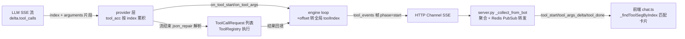

# 重点 03：Function Calling 流式协议设计——从 tool_use 块到工具卡片的全链路

> **一句话亮点（简历可直接用）**：设计并实现了 Function Calling 全链路流式协议——LLM 流式输出 tool_calls 参数增量、engine 按 turn 内全局序号（toolIndex）编排工具事件、前端按序号精确匹配工具卡片，解决了"同一轮多次调用同名工具"和"刷新恢复后序号错位"两个业界常见但鲜有人处理好的配对难题。

## 为什么这是一个值得重点介绍的难点

Function Calling（工具调用）是 Agent 与普通聊天机器人的分水岭。它看起来只是"LLM 返回一个 JSON，后端执行一下"，但真正做起来会撞上三个流式系统特有的难题：

- **参数是逐段流出来的，不是一次性到的**。OpenAI 协议里 tool_calls 的 `arguments` 是一个 JSON 字符串，在 SSE 流中被切成几十个小片段（`{"path":` → `"src/` → `main` → `.py"}`）。要边收边拼、拼完还要容忍模型偶尔输出不合法 JSON。
- **同一轮可以并行调用多个工具，也可能跨多轮反复调用同名工具**。一轮里 LLM 可能同时调 3 次 `read_file` 读 3 个文件。如果只按"工具名"配对前端卡片，三张 `read_file` 卡片会互相串数据：第一张卡片的参数 delta 可能流到第三张卡片上。
- **前端会刷新、会恢复历史，序号必须跨中断保持一致**。用户刷新页面后，历史消息已经把前两个工具卡片塞进气泡，engine 重新订阅后继续按 turn 全局序号推第 3 个工具的事件——如果前端按"气泡内数组下标"匹配，第 3 个工具的事件会错误地命中下标为 0 的旧卡片。

这三个难题的共性是：**需要一个端到端一致的、单调递增的调用序号体系**，从 LLM 原生流到前端 DOM 一路传递不丢失。本项目用 toolIndex 全局序号 + call_id 回查两层机制解决了它。

## 先备知识：本文涉及的术语与变量

| 术语/变量 | 含义与示例 |
|---|---|
| **tool_calls** | OpenAI 协议中 LLM 响应携带的工具调用指令数组。每个元素形如 `{"id": "call_abc", "type": "function", "function": {"name": "read_file", "arguments": "{\"path\":\"a.py\"}"}}`。注意 `arguments` 是**字符串**（JSON 序列化后的），不是对象。 |
| **tool_call.id / call_id** | 单次工具调用的唯一标识，由 LLM 下发，如 `"call_abc123"`、`"toolu_01Xy"`。同一次调用在 start/done 事件中 id 不变，是跨阶段配对的天然关联键。 |
| **SSE（Server-Sent Events）** | 服务器向浏览器单向推流的 HTTP 协议。LLM 的流式响应、engine 给前端的工具事件都走 SSE，数据格式为一连串 `data: {...}\n\n` 帧。 |
| **delta（增量）** | 流式协议中每个 SSE 帧只携带"新增的一小段"，而非全量。文本 delta 是几个字符的 token；工具参数 delta 是 arguments JSON 字符串的一小段，如 `"\""`、`"path"`、`"\": \""`。 |
| **tool_acc** | 变量名，`dict[int, dict]`，位于 provider 层。流式过程中按**响应内下标**累积每个工具调用的 id/name/arguments 片段的"累积桶"。示例：`{0: {"id": "call_1", "name": "read_file", "arguments": "{\"path\":\"a.py\"}"}}`。 |
| **toolIndex（turn 内全局序号）** | 本项目的核心设计：一次用户消息（turn）内，所有工具调用从 0 开始**跨 iteration 单调递增**编号。第 1 轮 LLM 调了 2 个工具（toolIndex 0、1），第 2 轮又调 1 个（toolIndex 2）。前端用它做卡片匹配的主键。 |
| **iteration（轮）** | 一次 LLM 调用算一轮。LLM 调工具 → 执行 → 结果回填 → 再调 LLM，就是两轮。一个 turn 通常含多轮 iteration。 |
| **_tool_index_offset** | 变量名，`int`。当前这轮 iteration 的工具序号起点，取值为"之前所有轮已用工具数"。第 3 轮之前已用了 4 个工具，本轮 LLM 响应内的下标 0 就要加上 offset 4，变成全局 toolIndex 4。 |
| **_call_id_to_index** | 变量名，`dict[str, int]`。hook 上缓存的"call_id → toolIndex"映射。工具执行完发 done 事件时，按 call_id 回查出它在 start 阶段分配的 toolIndex，保证 start/done 同一序号。 |
| **tool_events（结构化工具事件帧）** | engine 下发给前端的 JSON 帧契约：`{"toolEvents": [{"phase": "start"\|"end"\|"error"\|"progress", "toolIndex": 2, "name": "read_file", "arguments": {...}, "result": ...}]}`。替代早期的纯文本 tool_hint。 |
| **segment（气泡片段）** | 前端概念。一个 bot 气泡由若干 segment 组成：文本段（type='text'）和工具卡片段（type='tool'）按序排列，还原"文字→工具→文字"的交错形态。 |
| **json_repair** | 一个容错 JSON 解析库。模型偶尔输出缺引号、尾逗号的不合法 arguments，流式拼完后再用 json_repair 兜底解析，避免一次格式抖动让整个工具调用失败。 |

## 技术剖析

### 全链路总览



### 第一跳：provider 流式累积 tool_calls

OpenAI 流式协议中，工具调用以 `delta.tool_calls` 数组逐帧到达，每个元素带一个**响应内下标** `index`（同一响应里并行调 3 个工具，index 分别为 0、1、2）。`custom_provider.py:577-605` 的累积逻辑：

```python
for tc_delta in (delta.tool_calls or []):
    idx = tc_delta.index  # 同一次响应中多个并行工具调用用 index 区分
    if idx not in tool_acc:
        tool_acc[idx] = {"id": "", "name": "", "arguments": ""}
    if tc_delta.id:
        tool_acc[idx]["id"] += tc_delta.id           # id 通常只在首帧出现
    if tc_delta.function:
        if tc_delta.function.name:
            tool_acc[idx]["name"] += tc_delta.function.name
        if tc_delta.function.arguments:
            frag = tc_delta.function.arguments
            tool_acc[idx]["arguments"] += frag        # 参数 JSON 逐段拼接
            if on_tool_args:
                await on_tool_args(idx, frag)         # 实时把片段透传给上层
```

这里的设计要点是**边累积边透传**：`tool_acc` 负责拼出完整参数供流结束后解析（`json_repair.loads` 容错，`custom_provider.py:669`），而 `on_tool_args` 回调把每个片段实时推出去——用户在界面上能看到工具参数"逐字打出"的效果，而不是等整个 JSON 到齐才闪现。

### 第二跳：engine 把"响应内下标"翻译成"turn 全局序号"

provider 给的 index 只在**单次响应内**唯一——第 2 轮 LLM 响应的 index 0 和第 1 轮的 index 0 是两个完全不同的调用。engine 在 `loop.py:2079-2098` 用 offset 做翻译（legacy 内联路径）：

```python
_tool_index_offset = len(tools_used)   # 之前各轮已用工具数 = 本轮序号起点

async def _on_tool_start(idx: int, name: str) -> None:
    hint = json.dumps(
        [{"name": name, "args": {}, "toolIndex": _tool_index_offset + idx}],
    )
    await on_progress(hint, tool_hint=True)

async def _on_tool_args(idx: int, delta: str) -> None:
    await on_progress(
        json.dumps({"toolArgsDelta": True,
                    "toolIndex": _tool_index_offset + idx, "delta": delta}),
        tool_args_delta=True,
    )
```

举例：第 1 轮 LLM 调了 `read_file`（响应内 idx=0）和 `list_dir`（idx=1），offset=0，全局 toolIndex 就是 0、1；执行完后 `tools_used` 长度为 2，第 2 轮 LLM 再调 `write_file`（响应内 idx=0），offset=2，全局 toolIndex=2。**同名工具在多轮中被天然区分开**——这就是为什么不能用名称匹配。

### 第三跳：hook 的 call_id 回查，保证 start/done 同号

工具执行是异步的，done 事件在 `after_iteration` 阶段才发出，此时手头只有执行上下文里的 call_id。`_LoopHook` 在 `loop.py:473-474` 维护了两份状态：

```python
self._tool_index_counter: int = 0              # turn 内单调递增计数器
self._call_id_to_index: dict[str, int] = {}    # call_id → toolIndex 映射
```

`before_execute_tools` 阶段（`loop.py:524-532`）按调用顺序连续编号并缓存映射：

```python
for tc in context.tool_calls:
    payload = build_tool_event_start_payload(tc)
    idx = self._tool_index_counter
    self._tool_index_counter += 1
    payload["toolIndex"] = idx
    cid = payload.get("call_id") or ""
    if cid:
        self._call_id_to_index[cid] = idx
```

`after_iteration` 阶段（`loop.py:588-591`）按 call_id 回查写回 done 载荷；工具执行期的增量输出（如 `exec_long_task` 的实时日志）也通过 `hook.tool_index_for(call_id)`（`hook.py:67`、`runner.py:1248`）查到同一序号，编码成 `phase="progress"` 事件。于是**同一个工具调用的 start / progress / done 三类事件共享一个 toolIndex**，前端不会把执行日志贴错卡片。

### 第四跳：前端按序号精确匹配卡片

前端 Pinia store（`web/src/stores/chat.ts`）把气泡内容建模为 segment 数组。`addToolCall`（`chat.ts:1327-1344`）在收到 tool_start 时插入一张卡片，并把 engine 全局序号存进 `tool.index`：

```typescript
const tool: ToolCall = {
  name,
  args: {},
  done: false,
  index: typeof toolIndex === 'number' ? toolIndex : fallbackIndex,
}
msg.segments.push({ type: 'tool', tool })
```

后续的 args delta、done、stream 全部经 `_findToolSegByIndex`（`chat.ts:1307-1312`）定位：

```typescript
function _findToolSegByIndex(msg: Message, index: number) {
  const toolSegs = msg.segments.filter(s => s.type === 'tool')
  const exact = toolSegs.find(s => s.tool?.index === index)  // 优先按全局序号精确匹配
  if (exact) return exact
  return toolSegs[index]                                     // 兜底按数组下标（兼容老数据）
}
```

"优先精确匹配、兜底数组下标"这个双策略是为**刷新恢复场景**设计的：正常场景下一个气泡只含一个 turn，全局序号恰好等于数组下标；但刷新后历史已往气泡里塞了 2 张已完成的卡片（下标 0、1 被占），engine 重订阅 Redis 后继续推 toolIndex=2 的事件——若按下标匹配会命中旧卡片，把新参数灌进已完成的卡片里；精确匹配 `tool.index === 2` 找不到时才会新建，保证"卡片与事件严格一一对应"。

## 关键设计决策与权衡

1. **用序号而非名称做配对主键**：名称在一轮内可重复（3 次 `read_file`），序号天然唯一。代价是全链路每个环节都要透传一个额外字段，但换来的是配对逻辑零歧义。
2. **两层序号体系（响应内 index + turn 全局 toolIndex）而非一层**：provider 层的 index 是 OpenAI 协议给定的、engine 无法更改；在其上加 offset 翻译层，既不碰协议，又拿到 turn 内唯一性。
3. **call_id 作为跨阶段关联键，而非透传上下文对象**：hook 的 start/done 两个回调点之间没有共享对象的干净通道，而 call_id 由 LLM 下发、全程不变，用它做映射键比改造 hook 接口传上下文更稳健。
4. **前端双策略匹配（精确优先、下标兜底）**：新数据按 tool.index 精确匹配保证正确性，老数据（没有 tool.index 字段的历史消息）仍能按下标渲染——协议演进不破坏存量数据。
5. **args 容错解析放在流结束后**：流式途中不解析 JSON（片段本身就不是合法 JSON），拼完用 json_repair 一次解析，容忍模型格式抖动。

## 面试话术（怎么讲）

> Function Calling 在我这个项目里不是"调一下 API"那么简单，我做的是全链路的流式协议设计。LLM 的 tool_calls 参数是逐段流出来的，provider 层按响应内 index 累积参数片段并实时透传；engine 层把响应内 index 加上已用工具数 offset，翻译成 turn 内单调递增的全局 toolIndex，并用 call_id 做映射保证同一调用的 start、progress、done 事件同号；前端按 toolIndex 精确匹配工具卡片。这套设计解决了两个真实问题：一是一轮并行调用多个同名工具时卡片串数据，二是用户刷新页面后历史卡片已占位、engine 继续推流导致序号错位——前端用"精确匹配优先、数组下标兜底"的双策略兼容了新旧两种数据形态。参数 JSON 在流结束后用 json_repair 容错解析，模型的格式抖动不会搞挂整个调用。

## 可能的追问及答案

**Q：为什么不用 tool_call.id 直接做前端配对主键，而要自己编一套 toolIndex？**
A：两个原因。一是 id 是 LLM 下发的字符串（如 `call_abc123`），在"刷新恢复 + 领养 snapshot 气泡"场景下，历史消息里的老调用和重订阅后的新事件需要用统一的、可比较的序号对齐，字符串 id 无法表达"第几个"的顺序语义；二是极老的 SSE 兼容场景里 id 可能缺失（代码里有 `tc_partial_N` 合成 id 的兜底分支），而序号是 engine 自增的，永远存在。toolIndex 是给"排序和定位"优化的，id 是给"跨阶段关联"优化的，各司其职。

**Q：并行工具调用的执行是串行还是并发？增量日志会不会串台？**
A：工具执行支持并发，这正是需要 toolIndex 的根本原因——如果串行执行，"最后一个工具"就是当前工具，不需要序号。并发场景下每个工具执行期的增量输出（如 `exec_long_task` 的实时日志）通过 `hook.tool_index_for(call_id)` 查到各自序号独立推送，前端按序号追加到各自卡片的 streamLog，互不串台。早期有个 `appendExecLog` 接口就是"追加到最后一张卡片"，在并发场景下是错的，后来才补了按 index 定位的 `appendToolStream`。

**Q：arguments 逐段累积，如果模型输出的 JSON 中途就是不合法的怎么办？**
A：流式途中不解析，每个片段只是字符串拼接。流结束后用 json_repair 容错解析——它能修缺引号、尾逗号、未闭合括号这类常见抖动。如果连 json_repair 都修不好，这一次工具调用整体降级（代码里有 `tool_calls=[]` 不返回截断调用的保护分支），不会把半个 JSON 交给工具执行器。

**Q：这套协议对模型/provider 有依赖吗？换个供应商要改吗？**
A：协议主体是 OpenAI 兼容的 `delta.tool_calls` 结构，主流供应商（OpenAI、DeepSeek、Kimi、通义等）都遵循；Anthropic 的 tool_use 块结构不同，由 LiteLLM 层归一化成同一形态。engine 层只面向归一后的 `ToolCallRequest`，换供应商不动协议。

**Q：如果让你重新设计，会改什么？**
A：会把"响应内 index → 全局 toolIndex"的翻译从 loop 层下沉到 provider 层，让 provider 直接产出全局唯一的调用序号。现在翻译逻辑散在 loop 的 offset 计算和 hook 的计数器两处，两处都必须与 `tools_used` 的累积口径严格一致，是一个隐性的耦合点；下沉后单一事实源，loop 和 hook 只消费不计算。

## 事实边界

- 本文基于 `application/` 工作区（engine develop 分支，最新提交 2026-07-31；web 2026-07-21）逐行核实；`digi-pal/` 为 2026-05 中旬旧快照，不作为依据（旧快照中 hook.py 无 `tool_index_for`、exec 日志不走 toolIndex，与本文描述不一致，以 `application/` 为准）。
- toolIndex 的"turn 内全局唯一"由 engine 计数器保证；跨 turn（新用户消息）重新从 0 编号，前端气泡也是按 turn 划分的，二者生命周期一致。
- 文中前端代码在 `web/` 子仓（Vue 3 + Pinia），engine 与 web 之间经由 HTTP Channel SSE → server.py `_collect_from_bot` → Redis PubSub 三段转发，toolIndex 在每段都原样透传。
- `_tool_args_delta` 在 `bus/events.py:80` 标注为 legacy 契约——hook 架构下新契约是统一的 `_tool_events` 结构化帧（`bus/events.py:82-85`），但帧内 `toolIndex` 字段语义一致，前端匹配逻辑不变。

## 简历亮点描述（可直接引用）

- 设计并实现 Function Calling 全链路流式协议：provider 侧按响应内 index 累积 tool_calls 参数片段并实时透传，engine 侧翻译为 turn 内全局单调递增 toolIndex，支撑工具参数"逐字打出"的实时 UI；
- 以 call_id 为跨阶段关联键，保证同一工具调用的 start/progress/done 三类事件同号派发，解决并发多工具场景下增量日志串台问题；
- 前端采用"全局序号精确匹配 + 数组下标兜底"双策略，兼容刷新恢复与历史数据两种形态，实现卡片与事件严格一一对应。

## 代码依据

- `engine/nanobot/providers/custom_provider.py:577-605`（tool_acc 按 index 累积 + on_tool_args 实时透传）、`:669`（json_repair 容错解析）、`:762`（非流式路径容错）
- `engine/nanobot/agent/loop.py:2079-2098`（offset 翻译全局 toolIndex）、`:473-474`（计数器与 call_id 映射）、`:524-532`（start 阶段编号）、`:588-591`（done 阶段 call_id 回查）
- `engine/nanobot/agent/hook.py:67-72`（tool_index_for 接口）、`engine/nanobot/agent/runner.py:1224-1263`（progress 事件经 hook 回查 toolIndex）
- `engine/nanobot/bus/events.py:75-85`（SSE metadata 帧契约：_tool_hint / _tool_events / toolIndex）
- `engine/nanobot/server/server.py:3919-4530`（_collect_from_bot 聚合转发 toolIndex）
- `web/src/stores/chat.ts:1307-1312`（_findToolSegByIndex 双策略）、`:1327-1344`（addToolCall 存全局序号）、`:1360-1424`（completeToolByIndex / appendToolArgsDelta / appendToolStream 按序号定位）
