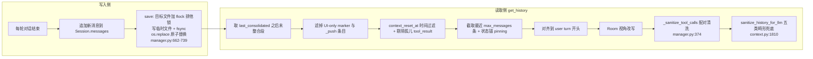

# 重点 04：会话历史管理与 LLM API 约束适配

> **一句话亮点（简历可直接用）**：设计并实现 append-only JSONL 会话持久化与出口多层清洗体系，在"脏历史必然产生"的现实下，用读取侧统一兜底保证发给 OpenAI/Anthropic 的消息序列永远满足 API 硬约束（tool_use/tool_result 配对、user turn 对齐、role 白名单），根治"一条坏历史卡死整个会话"的生产事故。

## 为什么这是一个值得重点介绍的难点

LLM 是无状态的，"多轮对话"靠每轮把历史消息数组完整重发。主流 LLM API 对这个数组有**硬结构约束**，违反就是 400：

- OpenAI：`messages with role 'tool' must be a response to a preceeding message with 'tool_calls'`——tool 消息必须紧跟在带 tool_calls 的 assistant 之后，孤立的 tool 消息直接拒绝；
- Anthropic：`tool_use` 块后必须有配对的 `tool_result` 块，且 `assistant turn must have content`（空 assistant 被拒）；
- 多数 provider：role 只允许 user/assistant/system/tool 白名单，自定义 role 直接 400；部分 provider 还拒绝连续同角色消息。

工程上的麻烦在于：**历史是持久化的，而写入路径有几十条**（正常对话、工具回填、中断恢复、后台任务回调、多 bot 共享房间、admin 直写通知……）。任何一条写入路径的 bug 产生一条畸形历史，下一轮 LLM 调用就整段 400，且因为历史是落盘的，**每一轮都会 400**——会话永久卡死，直到人工清理 JSONL。这个项目真实经历过这类事故（`_history_sanitizer.py:35-36` 记录了 OpenAI 的报错原文）。

难点的核心判断是：逐条修写入侧 bug 是打地鼠，**读取侧统一兜底**才能用一处防线覆盖所有已知与未知的写入缺陷。

## 先备知识：本文涉及的术语与变量

| 术语/变量 | 含义与示例 |
|---|---|
| **JSONL** | 存储格式：每行一个 JSON 对象。会话文件第一行是元数据（`_type: "metadata"`），之后每行一条消息。示例：`{"role": "user", "content": "你好", "timestamp": "..."}`。 |
| **append-only** | 只追加不修改的写入模型。已有消息永不被改写，对 LLM 缓存友好，也避免并发改写的竞态。 |
| **Session** | 数据类（`engine/nanobot/session/manager.py:74`）。单个会话的内存表示，含 `messages` 列表与 `last_consolidated` 整合边界。 |
| **last_consolidated** | 整数索引。标记"前 N 条消息已被压缩进摘要"，`get_history` 只取它之后的未整合段。示例值：`42` 表示前 42 条已归档。 |
| **tool_calls** | assistant 消息里携带的工具调用指令数组，每个调用有唯一 `id`。 |
| **tool_result / tool 消息** | `role: "tool"` 的消息，带 `tool_call_id` 字段，与 assistant 的 tool_calls 按 id 配对。 |
| **孤儿 tool_result** | `tool_call_id` 在前面任何 assistant 的 tool_calls 里都找不到的 tool 消息——API 视角下的非法存在。 |
| **user turn 对齐** | 出口历史必须从一条 user 消息（或带 tool_calls 的 assistant）开始，保证序列对模型可理解。 |
| **视角改写** | Room 模式特有：多个 bot 共享一份 JSONL，出口时把"别的 bot 的 assistant 发言"改写成 `[来自 @某人] ...` 的 user 消息，避免 bot 把别人的话当成自己说的。 |
| **_sanitize_tool_calls** | 函数（`manager.py:379`）。出口清洗：工具名归一 + 剔除无配对的 tool_calls。 |
| **sanitize_history_for_llm** | 函数（`engine/nanobot/agent/_history_sanitizer.py:21`）。LLM 入参前最后一道防线，处理五类畸形。 |
| **context_reset_at** | 时间戳。用户点"清空上下文"后，早于它的消息不再喂给 LLM（但磁盘保留）。 |
| **fcntl 文件锁** | Unix 文件锁（`LOCK_EX` 排他锁）。多 bot 进程共享房间 JSONL 时串行化写入。 |

## 技术剖析

### 存储模型：append-only JSONL + 原子全量覆写



写入的精髓在 `save`（`manager.py:662-739`）的一段注释：为什么不能直接 `open(path, "w")`？因为那样会在**拿到锁之前**就把文件截成 0 字节——写到一半崩溃留下残缺文件，整段对话历史消失；且读侧全是裸读（admin 历史接口、桌面端云同步），截断窗口里读到的就是半个文件。改成"临时文件 + fsync + `os.replace`"后，读者只会看到替换前或替换后的完整文件。文件锁挂在目标文件上以 `"a"` 模式打开（只创建不截断），保证多 bot 进程写同一房间 JSONL 时串行。

### 出口六层清洗（get_history）

`get_history`（`manager.py:114-376`）是"磁盘真相 → LLM 合法输入"的转换器，按序做六件事：

**第 1 层：未整合段切片**（`:171`）。只取 `messages[last_consolidated:]`——已压缩进摘要的老消息不再重发。

**第 2 层：UI-only 条目过滤**（`:186-204`）。前端分隔线（context_reset）、确认卡片（demand_confirm）、推送回调条目（`_push`）这类 `role: "system"` 的 meta 消息只给前端渲染，绝不能喂 LLM——注释点名 Claude/OpenAI 对非白名单 role 直接 400。

**第 3 层：context_reset 过滤 + 孤儿剔除**（`:209-240`）。按时间戳过滤后，可能把 assistant(tool_calls) 裁掉却留下对应 tool_result，于是立刻扫描保留的 tool_use id 集合，把找不到配对的 tool_result 剔除：

```python
filtered = [
    m for m in filtered
    if m.get("role") != "tool"
    or m.get("tool_call_id") in kept_tool_use_ids
]
```

**第 4 层：窗口截取 + 状态锚 pinning**（`:243-260`）。截取最近 N 条后，把被截掉的 `mark_demand_pending` 标记消息补回头部（最多 5 条）——那是"上个需求已收尾"的信号，丢了它 PM bot 会重复派发任务形成死循环（`_collect_pinned_state_markers`，`:468-526`）。

**第 5 层：user turn 对齐**（`:262-271`）。跳过开头所有非 user 消息；但遇到带 tool_calls 的 assistant 必须从它开始保留，否则后续 tool_result 变孤儿：

```python
for i, m in enumerate(sliced):
    if m.get("role") == "user":
        sliced = sliced[i:]
        break
    elif m.get("role") == "assistant" and m.get("tool_calls"):
        sliced = sliced[i:]
        break
```

**第 6 层：配对清洗**（`_sanitize_tool_calls`，`:379-465`）。两件事：① 工具名归一——Bedrock Claude 实测会把 `mcp_foo_x` "美化"成 `mcp_foo.x`，这种非法工具名一旦落盘，之后每轮 API 校验都 400，在出口归一、不动磁盘脏数据；② 无配对的 tool_calls 处理——一个 tool_result 都没有就剥掉整个 tool_calls 字段，部分配对就只保留有配对的 call。注释里记录了一次重要的行为修正（`:442-450`）：历史做法是"整轮删除"，但那会让 PM 在下一轮彻底失忆、重复触发 mark_demand_pending 形成催促死循环；新行为只剔除孤儿 call，assistant 的文本完整保留。

### 最后一道防线：sanitize_history_for_llm

即使过了 get_history，写入侧 bug 还可能在"同 tool_call_id 多条 tool 行""重复 assistant tool_use 轮"等维度制造畸形。`_history_sanitizer.py` 在 `context.py:1810` 作为入参前最终兜底，处理五类（`:42-62`）：重复 tool 行保留首条、孤儿 tool 行丢弃、缺配对的 tool_calls 剪枝、完全空 assistant 丢弃、重复 assistant tool_use 轮整条丢弃。两个设计要点：

- **健康历史零开销**：先扫一遍指标，无任何畸形直接返回原 list 引用（`:111-126`），不为防御付出常态成本；
- **只读不写回 + 打 ERROR 日志**：磁盘原样保留，同时把 tool_call_id、dup_count、内容摘要打进日志——兜底防线同时是写入侧 bug 的**持续暴露通道**，这是"读取侧兜底"策略能长期成立的关键：它不把根因埋掉。

### 配对边界渗透全局

"不能切在 tool_use/tool_result 配对中间"这条约束不只在 get_history：记忆整合推进指针时 `_advance_consolidated_pointer`（`engine/nanobot/agent/memory.py:736-753`）发现边界落在 `role == "tool"` 上就向前退一步；上下文预算切分点 `_adjust_split_for_tool_pairing`（`engine/nanobot/agent/context_budget.py:251-290`）同样向前推过孤立 tool_result。这是一条贯穿整个引擎的不变量。

## 关键设计决策与权衡

1. **读取侧统一兜底优先于修写入侧**：写入路径几十条且持续增加，读取入口只有个位数。代价是磁盘上脏数据仍在（审计可见），换来任何新写入路径天生被保护。
2. **append-only + 原子覆写**：append-only 保证逻辑简单与缓存友好，但 save 本身是全量覆写，所以用 tmp + fsync + rename 把"覆写"做成原子操作，兼顾两者。
3. **清洗不回写磁盘**：出口清洗都是只读副本，磁盘保留原始真相供审计与根因排查；代价是每轮都要重算清洗逻辑，用"健康零开销"短路摊平成本。
4. **部分配对保留文本而非整轮删除**：用一点上下文冗余（保留孤儿 assistant 的文字）换 PM 不失忆，避免更高阶的死循环。

## 面试话术（怎么讲）

> LLM API 对消息序列有硬约束：tool 消息必须有配对的 tool_calls、role 必须在白名单内，违反就是 400，而且历史是落盘的，一条脏数据会让会话永久卡死。我的思路是写入侧打地鼠不如读取侧建防线。会话用 append-only JSONL 持久化，save 走 flock 加临时文件加 rename 原子替换。出口 get_history 做六层清洗：未整合段切片、UI-only 条目过滤、reset 时间过滤加孤儿剔除、窗口截取加状态锚 pinning、user turn 对齐、tool 配对清洗。最后还有一道 sanitize 兜底处理五类畸形，健康历史零开销短路，且只读不写回、打 ERROR 日志持续暴露写入侧根因。配对完整性这条不变量贯穿了整合指针推进、预算切分所有模块。

## 可能的追问及答案

**Q：为什么不用数据库（SQLite）存会话？**
A：JSONL append-only 对文件锁友好、对人类可读（排障直接 tail）、对 LLM 缓存语义天然匹配（历史只增不改）。SQLite 引入 schema 迁移与锁复杂度，而这里的查询模式只有"顺序读全量"一种。几十 KB 到几 MB 的会话文件，文件系统就是最优存储。

**Q：读取侧兜底会不会掩盖写入侧 bug，让它永远修不好？**
A：这是刻意权衡过的——兜底层每清一条畸形都打 ERROR 日志（含 chat_id、tool_call_id、内容预览），线上 grep `[sanitize_history]` 就能定位写入侧根因。兜底保证用户不卡死，日志保证根因持续可见，两者是纵深关系不是替代关系。

**Q：状态锚 pinning 只 pin mark_demand_pending 一种，够吗？**
A：目前是。注释里写明了设计约束：pinning 列表不能无限膨胀，否则等于把截断窗口又撑回去了。新需求的状态信号改走 SUMMARY.md 通道（ consolidate 时显式保留），只有"已收尾"这个丢了会死循环的信号才走 pinning。

**Q：Room 模式多 bot 写同一文件，flock 够吗？**
A： flock 只串行化 save 这一瞬。Room 还有一条更严格的架构约束兜底：共享 JSONL 只走追加接口 `_append_room_session`，禁止全量覆写（全量覆写会把缓存里被视角污染的对象回写）。锁是机制层，写入纪律是架构层，两者缺一不可。

**Q：如果重新设计，会改什么？**
A：会把消息结构从"扁平 role/content"升级为带 turn_id 的两级结构——一个 turn 内的 assistant + 其全部 tool_result 作为原子单元存储与截断，从数据模型上让"配对断裂"不可表示，而不是每层代码各自防御同一个不变量。现在每条防线都在重复实现"配对完整性"这个检查。

## 事实边界

- 本文基于 `application/` 工作区（engine develop 分支，最新提交 2026-07-31）逐行核实；`digi-pal/` 为 2026-05 中旬旧快照，不作为依据（旧快照中 `_history_sanitizer.py`、状态锚 pinning、原子 save、视角改写均不存在，`_sanitize_tool_calls` 部分配对是整轮删除，与本文描述不一致，以 `application/` 为准）。
- 文件锁在部分 NFS 挂载上不可用，代码对 `flock` 失败是容忍的（`manager.py:707-710`），极端环境下并发写入保护会降级。
- 清洗策略保证 API 不报 400，但被剔除的消息对模型不可见，极端情况下可能造成轻微的上下文信息损失。
- "根治卡死"指消除结构性 400 这一类，不覆盖网络、配额等其他失败源。
- Windows 上 `os.replace` 被占用时降级为原地重写（`manager.py:719-726`），原子性在该平台降级。

## 简历亮点描述（可直接引用）

- 设计 append-only JSONL 会话持久化（flock 串行写 + 临时文件 fsync + os.replace 原子替换），支撑多 bot 进程共享房间会话的并发安全与崩溃不丢历史；
- 实现 get_history 出口六层清洗与 sanitize_history_for_llm 最终兜底，保证消息序列永远满足 OpenAI/Anthropic 硬约束，根治"一条坏历史 400 卡死整会话"事故；
- 将 tool_use/tool_result 配对完整性作为全局不变量贯穿整合指针、预算切分、视角改写等模块，并以 ERROR 日志通道持续暴露写入侧根因。

## 代码依据

- `engine/nanobot/session/manager.py:74-112`（Session 与 add_message）、`:114-376`（get_history 六层清洗）、`:379-465`（_sanitize_tool_calls）、`:468-526`（状态锚 pinning）、`:662-739`（原子 save 与 flock）
- `engine/nanobot/agent/_history_sanitizer.py:21-240`（五类畸形兜底、健康零开销）
- `engine/nanobot/agent/context.py:1800-1812`（兜底接入点与 400 报错注释）
- `engine/nanobot/agent/memory.py:736-753`（整合指针配对保护）
- `engine/nanobot/agent/context_budget.py:251-290`（切分点配对保护）
- `engine/nanobot/agent/loop.py:3960-3964`（get_history 调用点）
