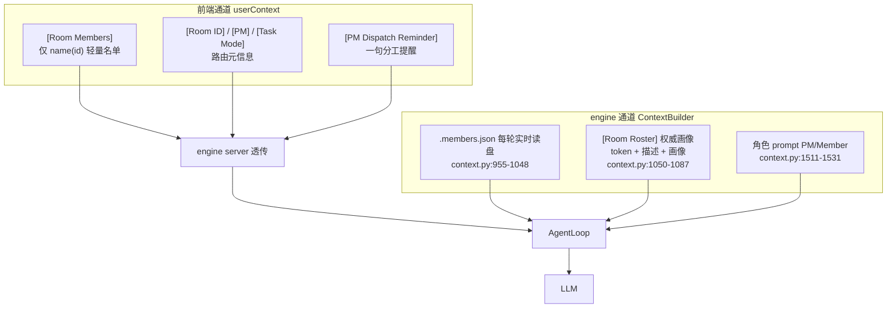

# 重点 06：Prompt 工程责任边界 —— 前端轻量路由信息 vs 引擎权威注入

> **一句话亮点（简历可直接用）**：在多端（Web 前端 / Go server / Python engine）协同的 Agent 系统里确立了 prompt 责任边界——前端只注入"本轮消息路由给谁"的轻量信息，完整成员画像由 engine 从权威文件 `.members.json` 每轮实时读盘注入，解决了双数据源不一致与 prompt 膨胀问题；斜杠命令在前端短路，根本不进 LLM。

## 为什么这是一个值得重点介绍的难点

这个项目的链路是：Vue 前端 → Go admin → engine server → Python AgentLoop → LLM。prompt 的内容来自多个端，"谁负责往 prompt 里塞什么"如果没有明确边界，会出现两类典型问题：

**问题一：双源不一致**。以"群聊成员画像"（哪个 bot 擅长什么）为例，它存在于两处：前端 employeesStore 的缓存、engine 侧 `.members.json` 文件（admin 维护 + PM 访谈后更新）。如果前端把自己的缓存拼进 prompt，而 engine 也注入文件版本，LLM 会同时看到两份可能不一致的数据——前端缓存可能滞后于 PM 刚更新的访谈画像，PM 按过期画像分工就是错的。

**问题二：prompt 膨胀与覆盖盲区**。前端注入的信息只在"用户发消息触发"的链路存在；而监工巡检、cron 定时任务、心跳这些**没有前端参与**的触发路径拿不到它。如果关键信息只走前端通道，这些路径上的 Agent 就是"瞎"的。

责任边界的答案是一条原则：**决策依据走权威文件、引擎注入；前端只注入"本轮路由元信息"这类引擎无法自知的瞬时事实**。此外还有一个反直觉的设计：并非所有用户输入都该进 LLM——`/new` 这类命令在前端短路，根本不发出聊天消息。

## 先备知识：本文涉及的术语与变量

| 术语/变量 | 含义与示例 |
|---|---|
| **userContext** | 前端随聊天请求一起发的字符串字段，拼在用户消息尾部，承载路由元信息。示例值：`"\n[Room ID: room-123]\n[Room Members: @张三(emp-a1), @李四(emp-b2)]\n[PM: emp-a1]"`。 |
| **[Room Members]** | userContext 里的一个 bracket，只列成员 `name(id)` 轻量名单，告诉 LLM"本轮消息被路由到哪几位"。 |
| **[Room Roster]** | engine 注入的权威花名册块（`context.py:1067`），每行含 mention token、描述、画像。示例：`"- @[张三](bot:emp-a1) [PM]\n  描述: 后端开发\n  画像: 擅长 Go 微服务与数据库设计"`。 |
| **.members.json** | 群工作区下的权威成员文件，admin 写入、PM 访谈更新，含每个成员的 botId/name/description/profile。 |
| **mention token** | 结构化 @ 格式 `@[显示名](bot:成员ID)`，按 bot_id 路由。示例：`@[张三](bot:emp-a3f9)`。 |
| **[PM Dispatch Reminder]** | 前端在"PM 被直接 @ 且成员 ≥ 2"时追加的一句轻量提醒，让 PM 按画像分工。 |
| **/new** | 斜杠命令，语义是"清空上下文开新会话"。 |
| **前端短路** | 输入不发给 LLM，直接在前端走本地逻辑处理。 |
| **chaining** | bot-to-bot 链式调用：一个 bot 的回复里 @ 了另一个 bot，前端递归触发对方。 |
| **ContextBuilder** | engine 侧上下文构建器（`engine/nanobot/agent/context.py:722`），权威注入的执行者。 |

## 技术剖析

### 两通道注入的对照



### 前端侧：刻意的"轻"

`web/src/composables/useChat.ts:593-603` 构造 `[Room Members]` 时只拼 `name(id)`，注释把设计意图写得非常清楚：

```typescript
// 群成员名单（仅 name+id，轻量）。
// description 和 PM 访谈后的 profile 由 engine ContextBuilder 从
// `.members.json` 权威读取并注入到 runtime context 的 [Room Roster] 块 ——
// 那才是真正影响 PM 分工决策的信息源。这里前端只负责告诉 LLM "本轮消息被
// 路由到了哪几位"，不重复 description，避免两份数据不一致或 prompt 膨胀。
```

`[PM Dispatch Reminder]`（`useChat.ts:615-624`）同样克制——它不重复画像内容，只在 PM 被直接寻址且成员 ≥ 2 时打一句"按 [Room Roster] 画像择优指派、同类工作分摊"的提醒，强化的是 engine 角色 prompt 里已有的规则，而非新增信息源。

### engine 侧：权威、全路径覆盖

`context.py:1477-1481` 的注释点明了互补关系：前端 userContext **只在"用户消息触发"的 chaining 里存在**，监工/cron 等路径拿不到；engine 读共享文件，**任何触发路径都能拿到**，是真正的权威来源。实现上 `_load_room_roster`（`context.py:955-1048`）每轮实时读 `.members.json`——注意它不缓存，因为 PM 访谈会随时更新画像；读失败/文件损坏返回空快照，绝不阻断 LLM 调用（`context.py:1006-1011`）。

`_format_room_roster`（`context.py:1050-1087`）把成员渲染成行首带可复制 mention token 的清单，并标注 `[PM]`/`[YOU]`。画像为空的成员显示 `"(未访谈)"`，这是给 PM 的显式信号，会联动触发强制访谈指令注入（`context.py:1514-1516`）——权威数据不仅展示，还驱动行为分支。

### 前端短路：/new 不进 LLM

`useChat.ts:188-207` 记录了一次真实的 bug 修复。历史上 `/new` 作为普通消息发给 engine，由 loop 拦截判等；但前端发送时会把 userContext 拼到 content 尾部，engine 拿到的是 `"/new\n\n[Room ID: ...]..."`，判等失败——`/new` 落进正常 LLM 流程，room 模式下被路由给 PM，PM 读到看板残留任务后**重新规划并再次执行**（用户反馈"/new 没清看板还重新执行任务"）。

修复是前端直接短路（`useChat.ts:197-207`）：

```typescript
if (text.trim().toLowerCase() === '/new') {
  const ok = await chatStore.clearContext(active.id)  // 走与橡皮擦按钮相同的 reset-context 链路
  if (ok) {
    chatStore.addSystemMessage('[context-reset]')
  } ...
  return  // 不发送任何聊天消息
}
```

这确立了另一条边界：**命令是 UI 语义，消息是 LLM 语义**。让 LLM 去解释"/new"既是浪费（一次 LLM 调用），又引入不确定性（模型可能不当成命令）。确定性的东西就该确定性处理。

### server 的角色：透传而不加工

engine server 的 `dm_chat`（`engine/nanobot/server/server.py:2963-2983`）与 `room_chat`（`server.py:5942-5950`）只是取出 `userContext` 透传给 bot 进程，不解析、不增删——加工责任收敛在 engine 的 ContextBuilder 一处，server 保持管道角色，避免又一个数据源。

## 关键设计决策与权衡

1. **权威数据文件化而非消息化**：`.members.json` 是文件不是请求参数，所以 cron/监工/心跳等无前端路径天然可及。代价是每轮一次磁盘读（带 flock），换来全路径一致性。
2. **前端注入收敛为"引擎无法自知的瞬时事实"**：本轮路由给谁、房间 ID、用户身份——这些 engine 自己推不出来；画像、规则这类 engine 能读到的，一律不在前端重复。
3. **提醒与信息分离**：`[PM Dispatch Reminder]` 只强化规则不给数据，即使与 engine 注入重复，也只是几十字符的冗余，不会造成事实冲突。
4. **命令前端短路**：牺牲一点架构纯粹性（前端要懂命令语义），换来确定性与零 LLM 成本。

## 面试话术（怎么讲）

> 我们系统横跨 Vue 前端、Go 后端、Python 引擎三端，prompt 内容谁塞什么必须有边界，否则双源不一致和膨胀都来了。我定的原则是：决策依据走权威文件由引擎注入，前端只注入引擎无法自知的瞬时路由信息。比如群成员画像，前端只发 name 加 id 的轻量名单，完整画像由引擎每轮从 .members.json 实时读盘注入到 Room Roster——这样监工、cron 这些没有前端参与的触发路径也能拿到一致数据。前端还有一个 PM Dispatch Reminder，只强化规则不给数据。另外我把 /new 这类命令在前端短路掉，走本地 reset 链路不进 LLM——之前它混着 userContext 发给引擎判等失败，被 PM 当成新任务重新执行过。确定性的东西就要确定性处理。

## 可能的追问及答案

**Q：前端完全不注入画像，那前端自己展示用的画像从哪来？**
A：前端展示走自己的 employeesStore（admin API 拉的），那是 UI 层的事，不进 prompt。prompt 层只认 .members.json。展示与决策用不同通道是可以接受的，因为展示滞后无害，决策滞后有害。

**Q：每轮读一次 .members.json，性能会不会有问题？**
A：文件只有几 KB，一次 open + 解析是微秒级。真正的成本曾是重复读——同一次构建里两个消费方各读一遍，后来合并成读一次分发（`context.py:1469-1474` 注释记录了这次优化）。相比一轮 LLM 调用的几百毫秒，磁盘读可以忽略。

**Q：如果前端和 engine 的数据真的不一致了会怎样？**
A：设计让不一致无害化。[Room Members] 只影响"模型知道这轮有谁在"，[Room Roster] 才影响分工决策。即便名单有出入，PM 的 mention token 来自 Roster 行首（权威），路由不会错。不一致的最坏结果是模型对"谁在"的感知偏差一轮，下轮自愈。

**Q：为什么 [PM Dispatch Reminder] 不在 engine 侧注入？**
A：它的触发条件"PM 本轮被直接 @"是前端路由决策的结果，engine 在构建 prompt 时虽然也能推出来，但那是前端 chaining 的瞬时状态。这条提醒本质是前端对 engine 角色 prompt 的"场景化强化"，跟着触发源走最内聚。它也足够轻，双写不会冲突。

**Q：如果重新设计，会改什么？**
A：会把 userContext 从"自由拼接的 bracket 字符串"升级为结构化字段（JSON），engine 侧解析 bracket 现在是靠字符串匹配，脆弱且散落各处。结构化后前后端契约显式化，加字段不用改解析正则。历史包袱是 bracket 格式已渗入存量会话与多个解析点，迁移要双写过渡。

## 事实边界

- 本文基于 `application/` 工作区（engine develop 分支，最新提交 2026-07-31；web 2026-07-21）逐行核实；`digi-pal/` 为 2026-05 中旬旧快照，不作为依据（旧快照中前端无 `/new` 短路、web 链路的判等失败 bug 仍存在，与本文描述不一致，以 `application/` 为准）。
- "权威注入"保证的是单轮内一致性；`.members.json` 本身由 admin/PM 维护，其内容准确性依赖上游流程。
- 前端短路目前只覆盖 `/new` 一个命令，其他斜杠语义仍走 engine 判定。
- userContext 的 bracket 解析是字符串级的，恶意构造的用户输入理论上可以伪造 bracket——依赖服务端对发送者身份的信任假设。
- 监工/cron 路径"拿得到画像"指 engine 通道可达，不保证这些路径的 prompt 里一定注入了 Roster（取决于具体路径的构建参数）。

## 简历亮点描述（可直接引用）

- 确立三端协同 Agent 系统的 prompt 责任边界：前端仅注入轻量路由元信息（[Room Members]/[PM]/[PM Dispatch Reminder]），权威成员画像由 engine 从 .members.json 每轮实时读盘注入 [Room Roster]，消除双源不一致与 prompt 膨胀；
- 权威注入覆盖用户消息、监工巡检、cron 等全部触发路径，解决"前端通道覆盖盲区"导致的 Agent 决策失明；
- 将 /new 等命令改为前端短路处理（本地 reset-context 链路），修复命令被误判为任务重执行的线上 bug，确立"命令是 UI 语义不进 LLM"的边界。

## 代码依据

- `web/src/composables/useChat.ts:188-207`（/new 前端短路）、`:593-603`（轻量 [Room Members] 与设计注释）、`:615-644`（[PM Dispatch Reminder] 与 userContext 组装）
- `engine/nanobot/agent/context.py:955-1048`（_load_room_roster 权威读盘）、`:1050-1087`（_format_room_roster）、`:1476-1531`（Roster 注入与角色分支）、`:1477-1481`（双通道互补注释）
- `engine/nanobot/server/server.py:2963-2983`（dm_chat 透传 userContext）、`:5942-5950`（room_chat 透传）
- `engine/nanobot/agent/loop.py:3966`（engine 解析前端注入的 room 元数据）
