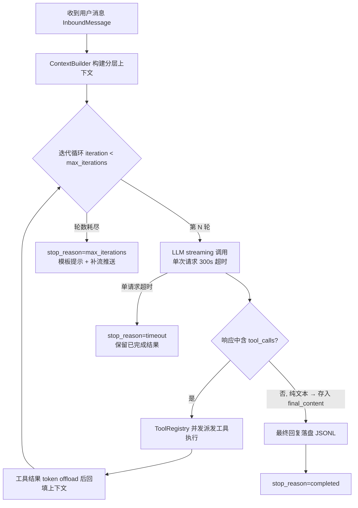

# 重点 07：AgentLoop 核心循环与多层防死循环设计

> **一句话亮点（简历可直接用）**：设计并实现生产级 Agent 运行时核心循环（ReAct Loop），通过"轮数 + 时间 + 状态归因"三层防护体系解决 LLM 工具调用死循环这一 Agent 系统最大的生产稳定性风险，支撑多数字员工 7×24 小时在线运行。

## 为什么这是一个值得重点介绍的难点

Agent 系统与普通 LLM 应用的本质区别是：LLM 不再只生成文本，而是可以**自主决策调用工具、读取结果、再决策**，形成一个开放式的循环。这带来一个原型阶段不会暴露、但生产环境必然踩中的问题——**LLM 会陷入工具重试死循环**：

- 工具返回报错，LLM 原样重试同一调用，参数都不改；
- 工具输出被截断，LLM 误判"结果不完整"，反复重跑同一工具；
- LLM 自认为任务没完成，不断"再检查一遍"，每轮都消耗几千 token。

如果没有硬约束，一次死循环就是几十轮 LLM 调用、几十万 token 的浪费，且用户端看到的是"Agent 卡死"。这个问题的难点在于：**上限好加，但"加上限之后系统行为依然优雅"很难**——到达上限时用户看到什么？已完成的工具结果保不保留？如何区分"正常完成"和"被迫中断"以便监控归因？子 Agent 和主对话的限额该不该一样？这些都是本项目的实际设计点。

## 先备知识：本文涉及的术语与变量

| 术语/变量 | 含义与示例 |
|---|---|
| **一轮迭代（iteration）** | LLM 被调用一次并处理完它的响应，算一轮。例如：第 1 轮 LLM 决定调用 `read_file`，第 2 轮 LLM 读完结果后决定调用 `edit_file`，第 3 轮输出文字总结——共 3 轮。 |
| **tool_calls（工具调用）** | LLM 响应中携带的"我要调用某个工具"的结构化指令，如 `{"name": "read_file", "arguments": {"path": "a.py"}}`。运行时执行后把结果塞回上下文，进入下一轮。 |
| **AgentRunner / AgentRunSpec** | `runner.py` 里的无产品层执行器与其参数包（dataclass，`runner.py:129`）。`AgentRunSpec` 打包 `initial_messages`、`tools`、`model`、`max_iterations`、`tool_offload_store` 等一次运行所需的全部配置。 |
| **final_content** | 变量名，`str` 类型。循环结束时 Agent 要给用户的**最终文字回复**。LLM 一旦返回"不含 tool_calls 的纯文本"，就认为它做完了，这段文本存入 `final_content` 并跳出循环。示例值：`"已完成重构，3 个测试全部通过。"` |
| **tools_used** | 变量名，`list[str]`。本次会话到目前为止**调用过的工具名字列表**，如 `["read_file", "edit_file"]`。用来判断"LLM 刚才是不是在干活"。 |
| **stop_reason** | 变量名，`str` 枚举。记录**循环是因为什么停下来的**，如 `"completed"`（正常完成）、`"max_iterations"`（轮数耗尽）、`"timeout"`（单次 LLM 请求超时）。是监控归因的核心字段。 |
| **clean** | 变量名，`str`。LLM 返回文本**清洗掉内部标记（`<think>` 思考块）后的干净内容**。若 LLM 只输出空串或纯思考内容，`clean` 为空——后文"空响应兜底"判断的就是它。 |
| **工具产物** | LLM 通过工具**写入磁盘的文件**。例如 LLM 调用 `write_file` 工具往 `.announcement.json` 写入任务分工，这个文件就是"工具产物"——它不是回复给用户的文字，而是 Agent 干活留下的实体成果。 |
| **.announcement.json** | 本项目多 Agent 房间（Room）模式里，PM 角色的 bot 用来**记录任务分工的约定文件**（类似一块任务看板）。PM bot 收到需求后先调 `write_file` 把分工写进它，再 @ 对应成员。后文的 bug 场景发生在"写完它之后"。 |
| **流式通道 / on_stream** | LLM 逐字输出时的回调管道。用户看到"打字机效果"靠的就是它：provider 每产出一个 token，就触发一次流式回调，一路经 SSE 推到前端。 |
| **final_content_streamed** | 变量名，布尔标记（`runner.py:235`）。记录 `final_content` 这段文字**是否已经通过流式通道逐字推给前端过**。正常完成时是 `True`；但"达到上限时的提示文案"是代码合成的，从没流过，为 `False`——需要补推一次（后文详解）。 |
| **_content_parts** | 前端变量，记录当前气泡已收到的文本片段。前端用它判重：如果补发的文字和 done 帧重复，就不会出现两个气泡。 |
| **nudge** | 英文"轻推"。指 LLM 卡住（该说话没说）时，系统以 user 身份追加一条提示消息把它"推"回循环，让它继续干。 |
| **SubagentManager** | 子 Agent 管理器。主 Agent 可以把子任务"spawn"（派发）给一个独立的子 Agent 执行，它有自己的迭代限额。 |
| **my(set, ...)** | 一个名为 `my` 的工具的调用形式，用于运行时修改 Agent 自身参数，如 `my(set, "subagent_max_iterations", 20)` 表示把子 Agent 限额热改为 20。 |
| **NANOBOT_LLM_TIMEOUT_S** | 环境变量，单次 LLM 请求超时秒数，默认 300（`runner.py:1003`）。超时后该次请求合成为 `finish_reason="error"`、`error_kind="timeout"` 的响应。 |

## 技术剖析

### 整体循环结构

核心循环位于 `engine/nanobot/agent/runner.py`（现行实现）与 `engine/nanobot/agent/loop.py`（编排层），本质是一个经典的 ReAct（Reasoning + Acting，即"思考→行动→观察→再思考"）循环：



### 第一层：轮数上限（max_iterations）

`loop.py:701` 定义默认值 `max_iterations: int = 80`，即"单次消息处理最多允许 80 轮 LLM↔工具往返"。主循环在 `runner.py:420`：

```python
for iteration in range(spec.max_iterations):
    # LLM 调用 → 工具派发 → 结果回填 → 下一轮
```

80 这个数值不是拍脑袋：正常任务（如"帮我重构这个文件并跑测试"）通常在 5~15 轮内收敛，80 轮给了复杂多步任务（跨文件重构、多工具编排）足够的空间，又把失控场景的 token 损耗钉死在可预测的范围内。轮数耗尽走 `for...else` 分支（`runner.py:907-927`），用模板渲染引导性文案。

### 第二层：时间维度的两道闸

**单次 LLM 请求超时**（现行主路径，`runner.py:1000-1007`）：

```python
raw = os.environ.get("NANOBOT_LLM_TIMEOUT_S", "300").strip()
timeout_s = float(raw)  # 默认 300 秒；<=0 表示关闭
```

超时后该次请求被合成为 `finish_reason="error"`、`error_kind="timeout"` 的响应，循环把它归因为独立的 `stop_reason="timeout"`（`runner.py:809-813`）——而不是笼统的 error。注释写明动机：防止网关/网络卡死导致 per-session 锁被无限占用（`runner.py:1000-1002`）。

**总时长硬上限（max_loop_seconds）**：配置真实存在——默认 1800 秒（30 分钟），入口防御性钳制（`loop.py:803-804`）：

```python
_mls = max_loop_seconds if max_loop_seconds and max_loop_seconds > 0 else 1800
self.max_loop_seconds = min(_mls, 3600)   # 无论配置写多大，代码钳制在 3600 秒（60 分钟）以内
```

支持热更（`reload_params`，`loop.py:3145-3148`）。逐轮总耗时检查的实现保留在 legacy 对照实现里（`loop.py:2049-2061`，超时文案"处理时间超过 30 分钟限制，已自动停止。已完成的工具调用结果已保留，你可以发送「继续」来完成剩余步骤"）——这一事实边界的含义见末节。设计原则不变：**中断也是产品体验的一部分**——已落盘的中间结果不丢，用户回复"继续"两个字，Agent 就能基于已有上下文接着干。

### 第三层：stop_reason 状态归因（可观测性）

循环终止不是一个"成功/失败"布尔值，而是细粒度枚举（六元组返回契约见 `loop.py:1522`，各分支赋值在 `runner.py`）：

| stop_reason 取值 | 赋值位置 | 含义 | 运维意义 |
|---|---|---|---|
| `completed` | `runner.py:394` | LLM 给出 final_content，正常收敛 | 健康 |
| `ask_user` | `runner.py:625` | Agent 主动暂停循环，向用户提问（HITL 人机回环） | 健康 |
| `max_iterations` | `runner.py:908` | 80 轮耗尽仍没做完 | **告警信号**，可能是 Prompt 或工具设计问题 |
| `timeout` | `runner.py:809-813` | 单次 LLM 请求超时（error_kind=timeout） | 模型/网络性能问题 |
| `error` | `runner.py:809-813` | LLM 请求级失败（非超时） | 模型网关故障 |
| `tool_error` | `runner.py:659` | 工具持续报错无法继续 | 工具实现缺陷 |
| `empty_final_response` | `runner.py:851` | 重试后 LLM 仍没输出任何文字 | 模型行为异常 |

有了归因分类，`max_iterations` 从"一个模糊的超时"变成可监控、可告警、可归因的指标——线上看到某员工 `max_iterations` 发生率上升，可以直接定位是 Prompt 退化还是某个工具返回了误导性结果。

### 难点深挖 1：空响应兜底与 nudge 机制

生产中观察到一个反直觉的模型行为。先把场景铺开：

**场景**：在 Room（多 Agent 群聊）模式里，PM bot 收到需求后的标准动作是两步——① 调用 `write_file` 工具把任务分工写入 `.announcement.json`（前文术语表解释过，这是 PM 的任务看板文件）；② 输出一段文字 @ 对应成员（如"@backend 请负责接口开发"）。

**问题**：Claude 系模型经常做完第①步就"自认为任务完成"——它返回的响应里 `finish_reason=stop`，但文本内容为空（清洗后 `clean` 为空白），第②步的 @ 消息永远没发出来。从机制上讲，这是因为模型在训练时学到"调用工具完成任务产物"就是一个回合的终点，它把"写文件"当成了终点动作，而没意识到还有"通知成员"这个后续义务。

**后果**：如果代码按常规逻辑"拿到空文本就 break"，整个 PM 分配链路**静默中断**——群里永远等不到 @ 消息，其他 bot 永远不会被唤醒，且没有任何报错。

**解法分两层**。现行 runner 路径是"重试 + finalization 补问"（`runner.py:712-750`）：空响应先原样重试（预算 `_MAX_EMPTY_RETRIES = 2`，`runner.py:60`），仍空则追加一条"请基于以上对话给出回复"的 user 消息再问一次，且补问产出的文本手动补一次流式推送（`runner.py:748-750`）；最终还是空才以 `empty_final_response` 具名终止（`runner.py:849-874`）。legacy 对照实现里保留了另一种条件化 nudge（`loop.py:2335-2354`）——只有同时满足"本轮确实调用过工具（`tools_used` 非空）+ 还有剩余迭代额度"时，才以 user 身份追加一条系统提示，把 LLM 推回循环：

```python
if not clean and tools_used and iteration < self.max_iterations:
    messages.append({"role": "user", "content": "[系统] 你刚刚调用了工具但没有给出文字回复。请基于工具执行结果继续完成任务：..."})
    continue  # 不 break，进入下一轮，LLM 看到提示后会补上 @ 消息
```

两种思路的约束一致：不对普通空回复 nudge（用户只是打个招呼，这时也 nudge 就制造了新的死循环）；不在额度耗尽时 nudge（推了也没有下一轮了，白推）。

### 难点深挖 2：中断路径的"补流"一致性

回顾术语表里的 `final_content_streamed` 标记。问题的来源是：**正常完成的 final_content 是 LLM 逐字"流"出来的，用户看着它打字；但异常终止路径的 final_content 是代码合成的**——比如达到 80 轮上限时那句提示文案，是 `runner.py:918-927` 用模板渲染的，从没经过流式通道（`final_content_streamed = False`，`runner.py:910`）。

如果直接 return，前端 SSE 通道里用户什么都看不到，表现为"Agent 无声卡死"。`loop.py:1989-1994` 做了统一补流：出口处检查该标记，对所有 `False` 的终止路径补一次整段推送（`await _effective_stream(result.final_content)`），保证**任何终止路径用户都能看到文字反馈**：

```python
if not result.final_content_streamed and result.final_content:
    _effective_stream = on_stream or on_token
    if _effective_stream:
        await _effective_stream(result.final_content)
```

补发会不会导致前端显示两遍？不会——done 帧携带的同一文本到达前端时，前端发现当前气泡的 `_content_parts` 已有内容，会忽略重复文本（`loop.py:1985-1988` 注释）。这是流式系统里"宁可补发、不可漏发，重复由消费端去重"的典型处理。

### 难点深挖 3：子 Agent 限额解耦与运行时热更

主 Agent 可以把子任务 spawn 给子 Agent（比如主 Agent 负责整体规划，spawn 一个子 Agent 专门"查这个接口的文档"）。子 Agent 有独立限额 `subagent_max_iterations: int = 15`（`loop.py:727`），与主对话的 80 轮**刻意解耦**：子任务职责单一、应当快速收敛，不该继承主对话的大预算；反之调主限额也不应牵连子 Agent。

同步路径是：任何人调用 `my(set, "subagent_max_iterations", N)` → MyTool 按 RESTRICTED 白名单校验（int，1~100，`tools/self.py:143`）并写值到 loop → `_sync_subagent_runtime_limits`（`loop.py:1448-1462`）把新值下沉 `mgr.max_iterations = max(1, int(...))`；admin 配置变更走 `reload_params`（`loop.py:3149-3157`）汇到同一个同步函数。整条链路**运行时热生效，不需要重启进程**——配合 SIGHUP 热重载，线上调参零停机。

## 关键设计决策与权衡

1. **双维度上限而非单维度**：轮数管"决策失控"，时间管"调用卡死"，两者正交。只限轮数会被慢工具/挂死请求拖死，只限时间会被快工具烧 token。
2. **上限触达返回引导性文案而非异常**：Agent 的中断对终端用户是可见的，文案要告诉用户"发生了什么 + 结果还在 + 怎么继续"。
3. **限额可配置但钳制硬上限**：配置中心可以调，但代码里 `min(x, 3600)` 兜底——不信任配置的正确性。
4. **模型行为异常全部具名化**：空响应、length 截断（`_MAX_LENGTH_RECOVERIES = 3` 次续写恢复，`runner.py:752-779`）、请求超时各自有独立分支、独立计数预算、独立 stop_reason，把"玄学卡死"变成可量化指标。
5. **归因先行**：所有终止路径打 stop_reason，监控指标按维度聚合。

## 面试话术（怎么讲）

> Agent 系统上线后最大的稳定性风险不是代码 bug，而是 LLM 陷入工具重试死循环烧 token。我设计的 AgentLoop 有三层防护：第一层轮数上限 80 轮，是按正常任务 5-15 轮收敛的分布定的；第二层是时间维度，单次 LLM 请求 300 秒超时并单独归因为 timeout，总时长预算默认 30 分钟、代码硬钳 60 分钟；第三层是 stop_reason 归因枚举，把每次循环终止分类成 completed、ask_user、max_iterations、timeout、tool_error、empty_final_response 等七种，接入监控后可以按维度告警。到达上限时不是抛异常，而是返回引导性文案告诉用户结果已保留、可以说"继续"。另外处理过两个生产中真实出现的边界 case：一是模型写完工具产物就返回空内容、不再履行后续动作，我做了空响应重试加 finalization 补问把它推回循环；二是中断路径的提示文案是代码合成的、没走过流式通道，我在出口按 final_content_streamed 标记统一补流，保证任何终止路径用户都能看到反馈。

## 可能的追问及答案

**Q：80 轮会不会太少？复杂任务不够用怎么办？**
A：限额是运行时热更的，配置中心改完立即生效，不用重启。但实践中很少需要调大——如果任务频繁触顶，正确的解法是拆任务或用子 Agent 分解，而不是放大死循环的预算。限额本质是"失控保险丝"，不是"任务容量"。

**Q：为什么不直接用 LLM 的 max_tokens 限制？**
A：max_tokens 限的是**单次生成**的输出长度，死循环烧 token 发生在"轮次"维度——每轮都是一次完整的 LLM 调用，且上下文越滚越大（第 79 轮的输入可能已接近上下文窗口上限）。两者是正交的约束。max_tokens 截断反而是循环内需要专门恢复的边界 case（length recovery，最多续写 3 次）。

**Q：nudge 会不会造成新的死循环？**
A：nudge 有三个保险：只在有工具调用时触发、只在有剩余额度时触发、nudge 后的继续执行本身消耗迭代额度——最坏情况是把剩余轮数用完，然后走 max_iterations 路径优雅退出，不会无限循环。现行 runner 的重试/补问同样有硬预算（重试 2 次、补问 1 次）。

**Q：子 Agent 为什么是 15 轮？**
A：子 Agent 承担的是主 Agent 分解出来的单一职责子任务（如"查一下这个接口的文档"），正常 3-5 轮收敛，15 轮留了 3 倍余量。如果子任务频繁触顶，说明任务分解粒度不对，应该在上层拆得更细，而不是给子 Agent 加轮数。

**Q：如果让你重新设计，会改什么？**
A：两件事。一是把 max_loop_seconds 总时长检查接到 runner 主路径上——目前逐轮总耗时检查只在 legacy 对照实现里，主路径靠单请求超时兜底，慢工具连发可以绕过总预算；二是加"重复工具调用检测"——统计同一工具 + 相同参数的调用频次，超过阈值直接中断，比纯轮数上限更早发现死循环。这是从"被动兜底"走向"主动识别"。

## 事实边界

- 本文基于 `application/` 工作区（engine develop 分支，最新提交 2026-07-31）逐行核实；`digi-pal/` 为 2026-05 中旬旧快照，不作为依据。
- **总时长检查的生效路径**：`max_loop_seconds` 配置、默认值（1800 秒）与钳制（3600 秒）真实存在且可热更，但逐轮总耗时检查当前只在 legacy 对照实现 `_run_agent_loop_legacy`（`loop.py:2049-2061`，不可达代码）中；runner 主路径的时间保护是单次 LLM 请求 300 秒超时（单独归因为 `stop_reason="timeout"`）。本文按真实代码叙述，未把 legacy 行为当作现行行为。
- **nudge 机制**：条件化中文 nudge 同样只在 legacy 实现（`loop.py:2335-2354`）；现行路径是"空响应重试 + finalization 补问"。两者语义等价、实现不同。
- 轮数/时长默认值（80 轮 / 1800 秒 / 300 秒）是工程经验值，非理论推导；"7×24 运行"指网关模式支持长期驻留，不代表单会话无限运行（受时间维度约束）。

## 简历亮点描述（可直接引用）

- 设计并实现 Agent 运行时核心 ReAct 循环，建立"轮数上限 + 请求级超时 + stop_reason 七态归因"三层防死循环体系，将 LLM 失控场景的 token 损耗钉死在可预测范围；
- 针对生产中模型空响应、中断路径无反馈两类真实边界 case，设计空响应重试/finalization 补问与基于 final_content_streamed 标记的统一补流机制，保证任何终止路径的用户体验一致性；
- 实现主/子 Agent 迭代限额解耦（80/15）与运行时热更（my(set) 白名单校验 + _sync_subagent_runtime_limits 下沉），线上调参零停机。

## 代码依据

- `engine/nanobot/agent/runner.py:420`（主循环）、`:394/625/659/809-813/851/908`（stop_reason 各分支）、`:129-213`（AgentRunSpec 限额定义）、`:907-927`（上限提示文案模板）、`:712-750`（空响应重试 + finalization 补问）、`:752-779`（length 截断续写）、`:60-61`（_MAX_EMPTY_RETRIES=2 / _MAX_LENGTH_RECOVERIES=3）、`:1000-1007`（NANOBOT_LLM_TIMEOUT_S 默认 300）、`:235/398/910/966`（final_content_streamed 标记）
- `engine/nanobot/agent/loop.py:701-702`（默认值 80 轮 / 1800 秒）、`:803-804`（硬上限钳制 3600）、`:1522`（stop_reason 六元组契约）、`:1989-1994`（统一补流）、`:2019-2061`（legacy 总时长检查）、`:2335-2354`（legacy 条件化 nudge）、`:727/798-801`（subagent_max_iterations）、`:1448-1462`（_sync_subagent_runtime_limits 热更下沉）、`:3145-3157`（reload_params 同构路径）
- `engine/nanobot/agent/tools/self.py:139-149`（my(set) RESTRICTED 白名单，subagent_max_iterations 1~100）、`:517-525`（改后同步）
