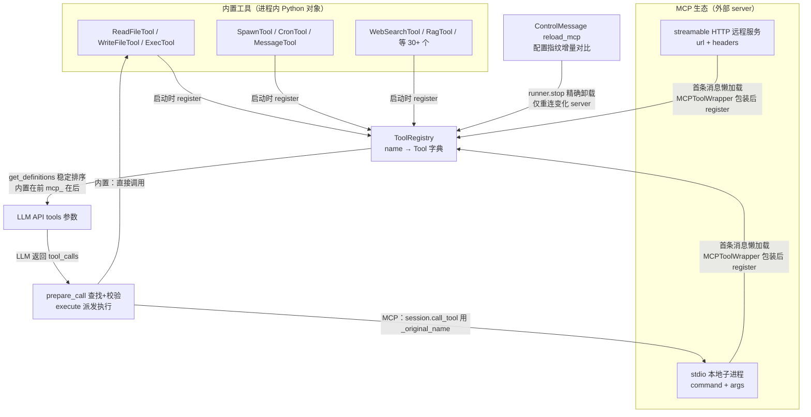

# 重点 08：工具系统架构——ToolRegistry 统一抽象与 MCP 开放生态接入

> **一句话亮点（简历可直接用）**：设计并实现统一工具注册中心 ToolRegistry，纳管 30+ 内置工具与 MCP（Model Context Protocol）开放协议工具；MCP 工具采用首条消息懒加载注册、配置指纹增量热更新、按 server 维度精确卸载，实现第三方工具生态"零重启接入、零停机变更"。

## 为什么这是一个值得重点介绍的难点

Agent 的能力边界就是它的工具集边界。一个生产级 Agent 平台的工具系统要解决的不只是"能调工具"，而是三个架构问题：

- **异构工具源的统一抽象**。内置工具（读文件、执行 shell）是进程内 Python 对象；MCP 工具是外部进程/远程服务，通过 stdio 或 HTTP 协议调用。两者的发现、参数校验、超时、错误形态完全不同，但 LLM 看到的必须是同一份 OpenAI function schema 列表，调用入口必须是同一个。
- **第三方工具的接入成本**。MCP 是 Anthropic 主导的开放协议（先备知识里有扫盲），生态里有成百上千个现成 server（文件系统、数据库、SaaS API）。接入它们不该要求用户改代码——配上地址就能用，这才叫平台。
- **运行时变更不能重启进程**。数字员工是 7×24 在线服务：加一个 MCP server、改一个鉴权 token、摘掉一个故障 server，如果每次都要重启进程，正在进行的对话全部中断。热更新必须是一等公民。

这三个问题的难点集中在"动态性"上：工具集合是运行时变化的，而 LLM 的 schema 列表、前端的工具面板、正在执行的调用都依赖这个集合，变更时不能出乱子。

## 先备知识：本文涉及的术语与变量

| 术语/变量 | 含义与示例 |
|---|---|
| **MCP（Model Context Protocol）** | Anthropic 发布的开放协议，定义了"LLM 应用"与"工具/数据提供方"之间的标准通信方式。一个 MCP server 就是一个独立进程或远程服务，向外暴露若干工具（如读写文件、查数据库）。类比：MCP 之于 AI 工具，类似 LSP（语言服务器协议）之于 IDE 插件——一次实现，处处接入。 |
| **stdio / streamable HTTP** | MCP 的两种传输方式。stdio：engine 用 `command`+`args` 拉起一个本地子进程，走标准输入输出通信（适合本地工具）；streamable HTTP：连一个远程 `url`，走 HTTP 请求（适合 SaaS/内网服务）。配置示例：`{"command": "npx", "args": ["-y", "@modelcontextprotocol/server-filesystem", "/data"]}` 或 `{"url": "https://mcp.example.com/", "headers": {...}}`。 |
| **ToolRegistry** | 工具注册中心类（`tools/registry.py:66`）。内部维护 `name → Tool` 字典，负责注册/注销/查找工具、生成给 LLM 的工具 schema 列表、派发执行。AgentLoop 持有唯一实例 `self.tools`。 |
| **Tool（工具基类）** | 所有工具的抽象基类（`tools/base.py`），约定 `name`/`description`/`parameters` 三个属性与 `execute(**kwargs)` 方法。`to_schema()` 把它转成 OpenAI function schema。 |
| **MCPToolWrapper** | MCP 工具包装器类（`tools/mcp.py:236`）。把一个 MCP server 的单个工具包装成标准 Tool 接口，注册进 ToolRegistry 后，LLM 和主循环完全感知不到它是远程工具。 |
| **mcp_{server}_{tool} 命名** | MCP 工具对 LLM 暴露的名字格式，如 server 叫 `yumi`、工具叫 `getOrder`，则注册名为 `mcp_yumi_getOrder`。用于与内置工具区分，也避免不同 server 的工具重名。 |
| **_original_name** | MCPToolWrapper 上保留的 MCP 原始工具名（如 `batch.renewAppend.yumiActionInfo`）。对 LLM 暴露的是归一化后的合法名，但真正调用下游 server 时必须用原始名——下游只认注册时的真名。 |
| **sanitize_tool_name** | 工具名归一化函数（`tools/base.py`）。把工具名中 `[a-zA-Z0-9_-]` 之外的字符（`.`、`:` 等）替换为 `_`。Bedrock/Claude 对 function name 有强制字符集校验，非法名直接 400。 |
| **懒加载（lazy connect）** | MCP server 不在进程启动时连接，而是**第一条用户消息到达时**才建立连接并注册工具。 |
| **配置指纹（fingerprint）** | 把一份 MCP 配置序列化后算出的字符串（`loop.py` 的 `_mcp_config_fingerprint`，排序键保证同配置同指纹）。热更新时逐 server 对比新旧指纹，只有指纹变了的 server 才断连重连，没变的保持不动。 |
| **MCPServerRunner** | 每个 MCP server 一个的运行时句柄（`tools/mcp.py:800`），持有该 server 的连接资源全生命周期。关停只通过它自己的 `stop()`（先卸工具再关 session），不跨 task 关闭——这是修过 anyio 跨 task 取消作用域导致 CPU 100% 的真实 bug 后的设计。 |
| **catalog（内置工具目录）** | 内置工具开关面板的数据源（`registry.py:269` 起的 catalog 区）。员工配置 `builtinAllowlist` 关掉某工具时注册表不动，由 per-turn 屏蔽集生效（`loop.py:963-971`）。 |
| **_cached_definitions** | ToolRegistry 内部缓存的工具 schema 列表（`registry.py:78`）。注册表不变时直接复用，避免每次 LLM 调用都重新生成几十份 schema。 |
| **toolTimeout** | 单个 MCP 工具调用的超时秒数，默认 30，可按 server 配置（`mcp.py:542-549`）。超时返回友好提示而非抛异常打断 Agent 循环。 |

## 技术剖析

### 整体架构



### ToolRegistry：一个字典撑起的统一抽象

`ToolRegistry` 的核心实现克制到近乎朴素（`registry.py:75-96`）：一个 `dict[str, Tool]`，加 register/unregister/get 三个方法。真正的设计含量在两处。

**第一处是 schema 的稳定供给**（`registry.py:98-166`）。`get_definitions()` 生成给 LLM 的工具列表时，经 `_stable_definitions` 做稳定排序：

```python
builtins.sort(key=cls._schema_name)
mcp_tools.sort(key=cls._schema_name)
return builtins + mcp_tools   # 内置工具在前，MCP 工具在后
```

为什么排序重要？因为工具 schema 列表是 LLM prompt 的一部分，**顺序不变意味着 prompt 前缀不变，prompt cache 命中率高**。如果每次调用顺序随机，缓存全废。同时结果带 `_cached_definitions` 缓存，注册表没变化时零开销；只有 per-turn 需要屏蔽工具（`exclude`，如 room 模式屏蔽 PM-only 工具）或注入客户端工具（`extra`，`client__*` 客户端工具殿后）时才绕过缓存重新生成——**状态切换不动注册表本身**，避免多 room 并发时互相覆盖。

**第二处是派发时的容错查找**（`registry.py:190-194`）。实测 Bedrock Claude 会把工具名"美化"成点分形式——注册名是 `mcp_foo_batch_renewAppend_x`，LLM 偏要输出 `mcp_foo_batch.renewAppend.x`：

```python
tool = self._tools.get(name)
if not tool:
    sanitized = sanitize_tool_name(name)   # 点分形式归一回合法字符集再查一次
    if sanitized != name:
        tool = self._tools.get(sanitized)
```

首次 lookup 失败时归一化后再查一次作为兜底。这一小行兜底挡住的是"LLM 行为不可控"这一类整型故障——你永远无法靠 prompt 让模型 100% 不输出点分名。

执行路径上，`execute()`（`registry.py:208-262`）先 `prepare_call` 做参数校验，失败后给 LLM 返回统一后缀 `[Analyze the error above and try a different approach.]`（`registry.py:226`）——错误信息也是写给 LLM 看的 prompt，引导它换方案而不是原样重试。

### MCP 工具的包装与接入

每个 MCP 工具被包装成 `MCPToolWrapper`（`tools/mcp.py:236-312`），三个关键设计：

```python
self._server_name = server_name                                   # 热更新精确卸载的索引键
self._original_name = tool_def.name                               # 调用下游用的真名
self._name = sanitize_tool_name(f"mcp_{server_name}_{tool_def.name}")  # 对 LLM 暴露的合法名
self._parameters = tool_def.inputSchema or {...}                  # 参数 schema 直接透传 MCP 的 inputSchema
```

**双名制**是核心：MCP 协议允许工具名含 `.`、`:`（如 `batch.renewAppend.yumiActionInfo`），但 Bedrock/Claude 的 function name 强制 `[a-zA-Z0-9_-]`，非法名不仅调用时 400，还会被写进 session 历史让整条会话报废（`mcp.py:281-284` 注释）。所以注册前一次性归一；同时 `_original_name` 保留真名，`execute()` 里 `session.call_tool(self._original_name, ...)` 用真名调下游——下游收到归一名会 404。超时由 `asyncio.wait_for` 按 `toolTimeout` 控制（默认 30 秒，`mcp.py:542-549`），超时返回友好提示而非抛异常。

### 懒加载：为什么是第一条消息才连接

`_connect_mcp`（`loop.py:1219-1302`）的触发时机是**首条消息到达前**，而非进程启动时：

```python
if self._mcp_connected or self._mcp_connecting or not self._mcp_servers:
    return []
# 全部失败后，至少间隔 60 秒才重试，避免每条消息都尝试连接
if self._mcp_last_attempt and (time.monotonic() - self._mcp_last_attempt) < 60:
    return []
```

三个理由（docstring 写明）：启动快（MCP 连接要拉子进程、握手，阻塞启动会让健康检查超时）；没消息不浪费连接资源；连接失败不影响进程启动——进程先活着，下一条消息再重试。配合 `_mcp_connecting` 标志防并发重入、60 秒重试间隔防"每条消息都重连故障 server"的惊群。部分失败时保留成功连接（`loop.py:1278-1279`），全部失败才整体拆除等下轮重试。

### 热更新：指纹增量 + 精确卸载

`reload_mcp`（`loop.py:2803-2916`）接收整表新配置，但**只动变化的部分**（docstring 写明增量策略，`loop.py:2807-2808`）：

```python
removed = set(old) - set(new)
added = set(new) - set(old)
changed = {n for n in set(old) & set(new) if fp({n: old[n]}) != fp({n: new[n]})}
need_reconnect = added | changed      # 只有新增和配置变化的才重连
need_teardown = removed | changed     # 只有删除和配置变化的才拆掉
```

卸载旧工具时**不靠工具名前缀切分**，而是优先由该 server 自己的 `MCPServerRunner.stop()` 完成（它内部已按"先卸 wrapper 再关 session"排好序），兜底路径再按 wrapper 上的 `server_name` 属性精确匹配（`loop.py:2872-2889`）：

```python
for tool_name, tool in list(self.tools._tools.items()):
    if isinstance(tool, MCPToolWrapper) and tool.server_name == name:
        self.tools.unregister(tool_name)
```

这是踩过坑后的修正：早期按前缀切字符串卸载，`github` 和 `github_v2` 这种共前缀 server name 会误删对方工具，下划线数量错位也会切错。热更指令本身走 `ControlMessage(action="reload_mcp")` 控制队列，带 0.5 秒防抖（`loop.py:3195-3220`）——高频 PATCH 配置时合并成最后一次，避免反复断连建连；另有 `reconnect_mcp` 单 server 重连指令（`loop.py:3188-3194`）。每个 server 的连接由独立的 `MCPServerRunner` 持有（`loop.py:928-934` 注释记了根因）：旧实现把 AsyncExitStack 在 agent_task 内 enter、却在 control_task 内 aclose，触发 anyio "Attempted to exit cancel scope in a different task"，残留 CancelScope 反复投递取消导致单核 CPU 100%（chainlit#2182 / mcp-python-sdk#521）——关停只通过 runner 自己的 `stop()`，绝不跨 task 调用 aclose。

## 关键设计决策与权衡

1. **统一 Tool 抽象而非分支派发**：LLM 和主循环只看到一种工具接口，MCP 的远程性被 wrapper 完全屏蔽。代价是每个 MCP 工具多一层包装对象，换来的是主循环零感知、前端零特殊协议。
2. **懒加载而非启动即连**：启动快、失败不阻塞进程，代价是首条消息延迟略增。对"配置了一堆 MCP 但今天没用到"的场景是纯赚。
3. **增量热更新而非全量重建**：指纹对比只动变化的 server，未受影响的连接和工具原地保留。代价是要维护精确的卸载逻辑（server_name 索引键 + runner 自关停），但避免了全量断连造成的服务抖动。
4. **双名制（归一名 + 原始名）**：对 LLM 合法、对下游保真。注册时归一、查找时兜底归一，两个关口冗余防护，不信任任何单一环节。
5. **稳定排序服务 prompt cache**：内置在前、MCP 在后、各自按名排序，把"工具列表"从变量变成常量前缀，直接提升 LLM API 的缓存命中率、降低时延和成本。

## 面试话术（怎么讲）

> 工具系统我做的是统一抽象加开放生态两层。统一层是 ToolRegistry，一个 name 到 Tool 的字典纳管 30 多个内置工具，生成 schema 时做稳定排序保证 prompt cache 命中，派发时有容错查找——实测 Bedrock 会把下划线工具名美化成点分形式导致 lookup 失败，我做了归一化兜底重查。开放层是 MCP 协议接入，每个外部工具包装成 MCPToolWrapper 注册进同一个 Registry，LLM 完全感知不到它是远程进程。工程上处理过三个真实问题：一是 MCP 懒加载，首条消息才连接，启动快且失败不阻塞进程；二是工具名双名制，MCP 允许点号但 Claude 校验严格，注册时归一、调用时用原始真名；三是热更新，配置指纹逐 server 对比只重连变化的，卸载靠 server_name 属性精确匹配而非字符串前缀切分——后者踩过 github 和 github_v2 共前缀误删的坑；每个 server 的连接由独立 runner task 持有，源自 anyio 跨 task 关闭 cancel scope 导致 CPU 100% 的真实 bug。整套机制让第三方工具接入零代码、变更零停机。

## 可能的追问及答案

**Q：MCP 工具调用的延迟和可靠性怎么保证？**
A：单次调用有 `toolTimeout` 控制的 `asyncio.wait_for` 超时（默认 30 秒，可配），超时返回友好提示文本而不是抛异常打断 Agent 循环。连接层每个 server 独立 runner 持有连接，单个 server 故障、重连不影响其他 server；连接失败有 60 秒重试间隔防止惊群。运行时还有 `GET /api/agent/mcp/status` 暴露每个 server 的 state/error/tool_count 供管理端监控。

**Q：为什么不把 MCP 工具在启动时一次性注册完？**
A：三个原因。一是启动速度——MCP 连接要拉子进程或远程握手，全部阻塞在启动路径上会让进程健康检查超时；二是资源——没人用的会话不该白占连接；三是故障隔离——某个 server 挂了就修它自己，进程先活着服务其他能力。这是"连接是消耗品"的思路，不是"连接是固定资产"。

**Q：新增一个内置工具要改哪些地方？**
A：实现一个 Tool 子类（name/description/parameters/execute 四要素），在 `_register_default_tools`（`loop.py:1007` 起）里 register 进 ToolRegistry，就这两步。schema 生成、LLM 派发、前端面板（catalog 自动收录）都不需要额外接线——这就是统一抽象的回报。如果要让它可被员工配置开关，开关语义由 builtinAllowlist 的 per-turn 屏蔽集承载，注册表本身不动。

**Q：热更新时正在执行的 MCP 调用怎么办？**
A：reload 前会等 `_mcp_connecting` 标志清零（最多 5 秒），避免与首条消息的懒加载竞态。旧 server 的关停由它自己的 runner 内完成，卸载 wrapper 和关闭 session 的顺序在 runner.stop() 内部排好——先卸工具（新调用查不到）再关连接（进行中调用自然结束或超时），不会出现"工具还在注册表但连接已死"的中间态。

**Q：如果让你重新设计，会改什么？**
A：会给 Tool 接口加一个 `health_check()` 方法并做周期性探测。现在 MCP server 的健康状态是"调用时才发现"，一个挂了但没被调用的 server 会长时间显示 connected。有了主动探测，配合已有的 status 接口可以做故障 server 的自动摘除和告警，把被动发现变成主动巡检。

## 事实边界

- 本文基于 `application/` 工作区（engine develop 分支，最新提交 2026-07-31）逐行核实；`digi-pal/` 为 2026-05 中旬旧快照（其 reload_mcp 为整表重建、无 MCPServerRunner），不作为依据。
- "30+ 内置工具"以 `_register_default_tools`（`loop.py:1007-1199`）实际注册项为准：文件 5（含 CreateZip）+ 检索 2 + ask_user + demand 六件套 + exec + exec_long_task + web 2 + rag + workflow 3 + memory（条件）+ message + reminder + spawn + subagent_admin + task + cron（条件）+ room 系列 4 + my（条件）+ skill_manage（条件），具体数量随版本变化；MCP 工具数量取决于用户配置。
- MCP 热更新的"零停机"指 engine 进程不重启、未变化 server 的连接原地保留；被重连的那个 server 本身有秒级断连窗口，期间的调用会走超时/错误提示路径。
- 文中 MCP 的 X-Ams-* 上报通道（httpx event_hook / stdio 参数注入）细节见 `tools/mcp.py` 头部注释与 `engine/doc/06-mcp.md`，本文只覆盖架构主干。

## 简历亮点描述（可直接引用）

- 设计统一工具注册中心 ToolRegistry，纳管 30+ 内置工具与 MCP 开放协议工具，稳定排序 + 缓存的 schema 供给提升 LLM prompt cache 命中率；
- 实现 MCP 工具懒加载注册与包装器双名制（LLM 侧合法归一名、下游调用原始真名），第三方工具生态零代码接入；
- 实现基于配置指纹的 MCP 逐 server 增量热更新与按 server_name/runner 精确卸载，工具生态变更零停机，修复共前缀误删、anyio 跨 task 关闭致 CPU 100% 等生产级缺陷。

## 代码依据

- `engine/nanobot/agent/tools/registry.py:75-96`（注册中心核心）、`:98-166`（get_definitions 稳定排序/缓存/extra 客户端工具）、`:190-194`（点分名归一兜底）、`:208-262`（execute 派发与错误提示后缀 226）、`:60-63`（内置工具判定 mcp_/client__ 前缀）
- `engine/nanobot/agent/tools/mcp.py:236-312`（MCPToolWrapper 双名制）、`:542-549`（toolTimeout 默认 30）、`:710`（connect_mcp_servers）、`:800-818`（MCPServerRunner 与 stop 关停顺序）
- `engine/nanobot/agent/loop.py:1219-1302`（_connect_mcp 懒加载与 60 秒重试 1236）、`:2803-2916`（reload_mcp 指纹增量热更 2835-2841、runner.stop/server_name 精确卸载 2872-2889）、`:928-934`（MCPServerRunner 独立持有连接的 bug 根因注释）、`:3195-3220`（控制队列 0.5 秒防抖）、`:3188-3194`（reconnect_mcp 单 server 重连）、`:963-971`（builtinAllowlist per-turn 屏蔽集）
- `engine/doc/06-mcp.md`（MCP 配置与运维细节）
