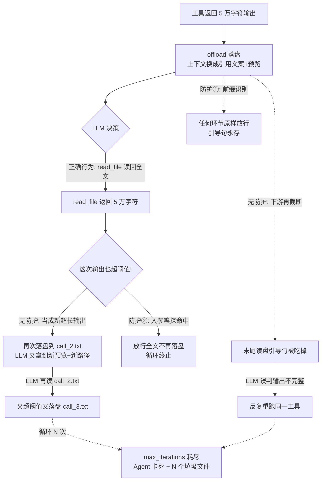

# 重点 09：涌现式死循环——"读一次落一次"与工具结果 offload 的三层防护

> **一句话亮点（简历可直接用）**：定位并根治了一个由"工具结果超长落盘机制"与"LLM 重试行为"交互产生的涌现式死循环（LLM 读回全文→被当成新超长输出再落盘→再读→再落盘，直到轮数耗尽），设计了"引用文案前缀保护 + 入参嗅探旁路 + 双轨前缀一致"三层防护体系，把一类隐蔽的生产级稳定性事故转化为可证伪的不变量。

## 为什么这是一个值得重点介绍的难点

这是我在项目里遇到的最有"系统思维"味道的一个问题：它不是任何一行代码的 bug，而是**两个各自正确的设计组合后涌现出的恶性行为**。

先说背景机制。Agent 的工具输出可能非常大——`exec` 跑个构建脚本输出几千行、`read_file` 读个大文件几万字符。如果原样塞进 LLM 上下文，几轮就把 context window 撑爆。所以项目有 offload（卸载）机制：**超长工具输出落盘到文件，上下文里只留一段"引用文案"**——包含文件路径、原始大小、头部预览，以及一句关键引导："需要全文请读这个文件"。

这个机制单看完美。但它与 LLM 的两条固有行为模式交互后，产生了两个死循环：

- **循环 A（逃生通道被截断吃掉）**：引用文案生成后，还会流经下游多个环节（上下文预算裁剪、session 落盘、历史重组）。只要任何一个环节对它"再砍一刀"，末尾那句"可读文件拿全文"的引导句就被吃掉。LLM 看到的是一段没头没尾的截断文本，按它的训练本能判断"输出不完整，需要重跑工具"——重跑还是被截，再重跑……直到轮数上限。用户看到的是 Agent 卡死，监控看到的是几十轮无效 LLM 调用。
- **循环 B（读一次落一次）**：这是更隐蔽的一个。LLM 看了预览后，正确地选择"调 `read_file` 读回全文"——但这下一次工具调用的输出（比如 5 万字符）**本身又超过了 offload 阈值**，被当成"新的超长工具输出"再次落盘，LLM 又拿到一段新预览和一个新路径，再去读新文件，再落盘……每读一次就制造一个新的落盘文件，像青蛙产卵一样指数制造垃圾，直到轮数耗尽。

这两个循环的可怕之处在于：**每个环节的代码都在做"正确的事"，但系统整体行为是灾难**。排查时你看任何一个函数都找不到 bug，必须把"机制 × LLM 行为"当作一个整体来推理。这正是涌现式问题，也是 Agent 系统区别于传统后端的新型故障域。

## 先备知识：本文涉及的术语与变量

| 术语/变量 | 含义与示例 |
|---|---|
| **offload（结果卸载/落盘）** | 把超长工具输出从 LLM 上下文搬到磁盘文件的机制。上下文里只留一段简短的"引用文案"代替原文。目的：控制上下文 token 体积。 |
| **引用文案（reference string）** | offload 后塞进上下文代替原文的文本，形如：`[tool output persisted]\nFull output saved to: /ws/sessions/s1/tool_results/call_1.txt\nOriginal size: 51234 chars\nPreview:\n<头尾预览>\n...\n(Read the saved file if you need the full output.)` |
| **TOOL_RESULT_PERSISTED_PREFIX** | 公开常量，`"[tool output persisted]\n"`（`helpers.py:348`）。所有引用文案的统一开头，是后续所有防护识别的锚点。新旧两条落盘路径共用。 |
| **is_persisted_tool_result** | 函数（`helpers.py:352-361`）。判断一段文本是否是引用文案（就是看有没有这个前缀）。任何下游环节看到 True 都必须原样放行。 |
| **maybe_persist_tool_result** | 旧路径落盘函数（`helpers.py`）。按字符阈值判定，落盘到 `<workspace>/.nanobot/tool-results/<session>/<tool_call_id>.txt`，返回引用文案。现仅服务无 store 的老入口/测试。 |
| **ToolResultStore** | 新路径落盘类（`tool_offload.py:258`）。按 **token 阈值**判定，落盘到 `<session_dir>/tool_results/<call_id>.txt`，与会话目录同根，`/new` 新会话时整目录回收。生产主路径。 |
| **tool_offload_tokens** | 新路径的 token 阈值，生产默认 **16384**（`session_md_flags.py:72-74`，env `NANOBOT_TOOL_OFFLOAD_TOKENS` 可调；`my(set)` 运行时也可调）。 |
| **tool_call_id / call_id** | 单次工具调用的唯一 ID，如 `"call_abc123"`，同时作为落盘文件名。 |
| **tool_call_targets_persisted_results** | 函数（`helpers.py:397-459`）。嗅探一次工具调用的**入参**是否在"读回"已落盘的 tool-result 文件——即 LLM 是不是在按引用文案的指引拉全文。命中则放行全文，不再落盘。 |
| **max_iterations** | Agent 主循环的轮数上限（默认 80 轮）。死循环的终点站——循环 B 里 LLM 会一路读/落盘到把这 80 轮烧完。 |
| **裸切文本** | 本文定义的反面概念：一段被截断过、但**既没有前缀标识、也没有读盘路径**的文本。它进入历史后，LLM 无法判断它是"完整输出"还是"被砍过的输出"，是循环 A 的燃料。 |
| **形态闭包** | `loop.py:4978` 注释里的设计原则：session 落盘文件（JSONL）里的工具结果只允许两种身份——鲜活态（全文）或引用态（带前缀），绝不允许裸切文本混入。 |
| **双轨** | 旧路径（helpers 字符阈值）与新路径（ToolResultStore token 阈值）两条 offload 实现并存。生产主路径是新路径（自 2026-05-27 起 store 恒为非空，`runner.py:1659-1661`），旧路径留给无 store 的老入口/测试兜底。 |
| **_iter_string_leaves** | 函数（`helpers.py:378-394`）。深度优先遍历工具入参字典，把所有字符串叶子节点挖出来——因为不同工具的 path/command 字段嵌套深度各异。 |
| **_TOOL_RESULT_MAX_CHARS** | 旧字符阈值常量，当前代码值 3000（`loop.py:693`），仅作用于无 store 的兜底路径；其上方注释保留早期 4000 的取值讨论。 |

## 技术剖析

### 死循环的形成机理



### 防护①：前缀识别，引用文案永不二次截断

第一层的核心是一个契约：**看到 `[tool output persisted]\n` 前缀的内容，任何环节都必须原样放行**。识别函数极简（`helpers.py:352-361`）：

```python
def is_persisted_tool_result(content: Any) -> bool:
    return isinstance(content, str) and content.startswith(_TOOL_RESULT_PERSISTED_PREFIX)
```

它的 docstring 把利害关系讲得很直白：引用文案"本身已经是一份压缩好的、指向磁盘原文的稳定结构，不能再被任何 truncate / persist 动作砍第二刀，**否则末尾的 'Read the saved file...' 引导句会被吃掉，最终让 LLM 看不到逃生通道而陷入'反复读、反复被截断'的死循环**"。

这个检查被埋进每一个可能动刀的地方：runner 的结果整形（`runner.py:1667-1669`，直接 return 放行）、loop 的 session 落盘（`loop.py:5007`，多重短路之一）、`maybe_persist_tool_result` 入口（幂等返回）、`ToolResultStore.offload` 入口（`tool_offload.py:339-340`）。一处不漏，循环 A 才算封死。

### 防护②：入参嗅探，读回全文时旁路落盘

第二层针对循环 B，思路是：**LLM 主动选择读全文，就把全文如数交还，绝不再落盘**。关键是怎么识别"这次调用是在读回"。`tool_call_targets_persisted_results`（`helpers.py:397-459`）用三条策略嗅探工具入参（任一命中即旁路）：

```python
# 策略 1：把入参字符串解析为绝对路径，看是否落在 <workspace>/.nanobot/tool-results 子树下
if candidate == workspace_path or candidate.is_relative_to(workspace_path):
    return True
# 策略 2：子串嗅探 ".nanobot/tool-results/"——覆盖 exec({"command": "cat .../..."}) 这种路径嵌在 shell 命令里的写法
if _TOOL_RESULTS_PATH_FRAGMENT in normalized:
    return True
# 策略 3：正则匹配新路径 "/sessions/<x>/tool_results/"——覆盖 ToolResultStore 的落盘位置
if _PR3_TOOL_RESULTS_RE.search(normalized):
    return True
```

为什么需要三条？因为 LLM 的读法不可控：它可能用 `read_file({"path": "..."})`（策略 1 的路径解析能抓到），也可能用 `exec({"command": "cat 路径"})` 或 `head -100 路径`（路径只是命令字符串的一个片段，策略 1 解析不了，靠策略 2 的子串匹配兜底）；而新路径的目录结构不同，靠策略 3 的正则（`helpers.py:375`，`<x>` 不含 `/` 防误命中多级目录）。入参用 `_iter_string_leaves` 深度遍历所有字符串叶子，因为不同工具的参数嵌套深度不一样（`read_file` 一层、`edit_file` 两层）。

这个旁路同样埋在所有动刀点：`runner.py:1675-1676`、`loop.py:5009-5013`。docstring 里那句总结非常传神——"**LLM 已经看过预览后主动选择'读全文'，再次落盘只会产生一个新的 tool_call_id 文件，让 LLM 又拿到一份截断预览，进入'读一次落一次'的死循环**"。

### 防护③：双轨前缀一致，消费方无需感知实现版本

项目里 offload 有两条实现路径：旧的 `maybe_persist_tool_result`（字符阈值，落 `.nanobot/tool-results/`）和新的 `ToolResultStore`（token 阈值，落 `<session_dir>/tool_results/`，`tool_offload.py:258`）。两条路径的目录布局、阈值单位、预览格式都不同（旧的是前 1200 字符预览，新的是"头 10 行 + 尾 10 行"加结构化 JSON 摘要，`tool_offload.py:81-113、116-125`）。

如果消费方（`is_persisted_tool_result`、上下文裁剪、session 落盘）需要区分"这是哪条轨道产出的引用文案"，防护逻辑就会翻倍且永远跟不上新轨道。所以第三层防护是一个**接口契约**：两条路径产出的引用文案前缀必须字面一致——新路径直接 import 旧路径的公开常量（`tool_offload.py:24`）：

```python
from nanobot.utils.helpers import (
    TOOL_RESULT_PERSISTED_PREFIX,  # 与旧路径共享前缀（公开常量），消费方无需感知双轨
)
```

`helpers.py:344-347` 的注释把这个契约定为宪法："旧/新两条路径产出的引用文案前缀必须完全一致——这是消费方能'双轨无感'的根基"。配套地，防护②的策略 2/3 也覆盖了新旧两种路径的嗅探，形成闭环。

### 兜底闭环：落盘时的"形态闭包"

三层防护之外，session 落盘（`loop.py:4978-5023`）还有最后一道闸：**写进 JSONL 历史文件的工具结果只允许两种身份——鲜活态（token ≤ 阈值的全文）或引用态（带前缀），绝不允许"无前缀的裸切文本"进入冷存储**。注释里点明了历史教训：旧版本曾把单行大 JSON 按 char 阈值砍成 3000 字符裸切，下一轮从历史拼回上下文时"既没有'已落盘'提示、又没有'可读全文'路径"，直接给循环 A 供弹。现在落盘前复用同一台 `ToolResultStore` 对每条 tool 消息做最后一次 offload（同一 store、同一阈值、同一份引用文案），配合多重短路（已是引用态/缺 call_id/读回旁路），保证冷存储形态纯净。`runner.py:1642-1647` 还记录了另一处统一：超长判定只看 token 阈值一处，**字符级硬截断已从主路径移除**——历史上 char(3000) 兜底截断与 token 落盘单位不一致，曾夹出"够长被裸切、却没过 token 阈值不落盘"的丢尾盲区。

### 新路径预览的信息密度设计

新路径把阈值从旧路径的 4000 字符（约 1k token）放宽到 16384 token，底气来自预览格式升级（`tool_offload.py:31-46`）：头 10 行 + 尾 10 行（脚本类输出的关键结果——新建资源 ID/URL/最终状态——通常打印在末尾，只取头部会挡住它，导致 LLM 误判需要重跑命令）；单行超 200 字符本地截断；若内容是 JSON 数组/对象，改出"形状摘要"（几条、每条哪些字段、首尾几条长什么样），LLM 一眼能判断要不要用 `jq` 精确提取还是拉全文。生产默认 16384 的立意写在 `session_md_flags.py:67-70`：电商礼包/商品列表类结果常在 8K~16K token，提到 16K 后这类中等结果可直接进上下文（128K 窗口约占 12.5%），免去落盘绕路。

## 关键设计决策与权衡

1. **用"前缀契约"而非"元数据标记"识别引用文案**：前缀跟着内容走，复制、裁剪、跨进程传递都不丢；代价是依赖字符串字面量一致性（所以才有防护③的常量共享）。
2. **放行全文而非限量放行**：读回旁路是"如数交还"，不做"给你多看一点"的折中——LLM 既然主动要全文，给半截只会让它再要一次，又回到循环。
3. **嗅探入参而非记录状态**：不维护"哪些 call_id 落过盘"的状态表，而是从无状态的入参特征（路径子串）判断——状态表在重试、跨会话、双轨场景下都会失效，入参特征不会。
4. **三条嗅探策略冗余覆盖**：路径解析、子串、正则各管一类场景，宁可误判放行（多读一次全文，代价是一次大输出）也不漏判（漏一次就是死循环）。这是典型的"失败代价不对称"下的取舍。
5. **token 阈值取代字符阈值**：token 才是上下文的真实货币单位，字符数对不同语言/token 器的换算不稳定；且预览升级为"头尾行 + JSON 结构摘要"后信息密度更高，LLM 看预览就能准确判断要不要拉全文，不需要靠"小阈值逼它落盘"。

## 面试话术（怎么讲）

> 这是我排查过的最有意思的一类故障：工具结果超长落盘机制本身是对的，但它和 LLM 的重试行为组合后涌现出死循环。具体两个循环：一个是引用文案下游再被截断，末尾"可读文件拿全文"的引导句被吃掉，LLM 失去逃生通道反复重跑工具；另一个更隐蔽——LLM 按引导读回全文，这这次输出自己又超阈值被当成新输出再落盘，LLM 拿新预览再读，读一次落一次直到 80 轮上限烧完。我的解法是三层防护：一是前缀契约，任何环节看到 `[tool output persisted]` 前缀原样放行永不二刀；二是入参嗅探旁路，检测出 LLM 在读回落盘文件时全文放行不再落盘；三是新旧两条落盘路径共享同一前缀常量，消费方无需感知双轨。最后还在 session 落盘处加了形态闭包，保证历史里只有全文和引用两种身份，杜绝无前缀的裸切文本。这类问题的教训是：Agent 系统的故障模式要按"机制 × 模型行为"整体推理，不能只看单点代码。

## 可能的追问及答案

**Q：这个死循环在监控上长什么样？怎么发现的？**
A：典型特征是某个会话的迭代轮数一路打到 max_iterations（80 轮）上限，且工具调用序列呈现病态模式——循环 B 里是 `read_file` 连续调用且 path 参数都指向 tool-results 目录，循环 A 里是同一工具同一参数反复重试。落盘目录里短时间出现大量 tool_call_id 文件也是循环 B 的物证。发现路径就是 stop_reason=max_iterations 的告警聚类后下钻看工具调用序列。

**Q：为什么不直接禁止 LLM 读 tool-results 目录？**
A：那是因噎废食。LLM 读回全文是 offload 机制设计内的正当行为——预览就是勾引它在需要时拉全文的。问题不在"读"，而在"读完的结果又被当新输出落盘"。禁止读目录等于把逃生通道焊死，LLM 只能基于预览做决策，能力大幅下降。正确做法是让它读，但读的结果原样交还。

**Q：token 阈值 16384 会不会太大？上下文不还是被撑吗？**
A：16384 token 是单条工具输出的上限，相对 128K 主流上下文窗口约占 12.5%，且这是"够大才落盘"的阈值——比旧的 4000 字符（约 1k token）宽松，是因为新路径的预览格式（头尾各 10 行 + 结构化 JSON 摘要 + 明确的大小标注）信息密度更高，LLM 看预览就能准确判断要不要拉全文。阈值选择的本质是在"上下文体积"和"LLM 决策信息完整度"之间取平衡，且 env 与 my(set) 都可运行时调。

**Q：前缀契约会不会被 LLM 自己生成的文本误触发？**
A：理论上 LLM 可以输出一段以 `[tool output persisted]` 开头的文本（比如在讨论这个机制时）。但误判的后果是"这段文本被原样保留、不再截断"——代价是有益无害的。真正危险的是反方向（真引用文案没被识别），而前缀匹配对真阳性是 100% 命中的。这又是一处失败代价不对称下的刻意取舍。

**Q：如果让你重新设计，会改什么？**
A：会把"是否允许再次 offload"做成内容自带的元信息，而不是靠前缀字符串契约。比如引用文案改成结构化块（`{"type": "persisted_ref", "path": ..., "size": ...}`），类型即契约，字符串匹配升级为结构判断，LLM 伪造和意外前缀碰撞的概率归零；同时把三条嗅探策略收敛为"路径注册表 + 规范解析"一条路径。现在的设计是演进式修复的最优解，但从零设计的话类型化契约更干净。

## 事实边界

- 本文基于 `application/` 工作区（engine develop 分支，最新提交 2026-07-31）逐行核实；`digi-pal/` 为 2026-05 中旬旧快照（无 tool_offload.py），不作为依据。
- **生产生效的 token 阈值是 16384**（`session_md_flags.py:72-74` env 默认值，经 `loop.py:879` → `_make_tool_offload_store` 注入 store）；`tool_offload.py:35` 的 `_DEFAULT_TOKEN_THRESHOLD = 8 * 1024`（8192）只是未显式传参时的类级缺省，不是生产生效值。环境变量与 `my(set, tool_offload_tokens)` 均可调。
- 生产主路径是 `ToolResultStore`（token 阈值），`runner.py:1659-1661` 注明"生产自 2026-05-27 起恒为非空"；`maybe_persist_tool_result` 字符路径仅服务无 store 的老入口/测试。两条路径共享前缀与防护逻辑。
- `_TOOL_RESULT_MAX_CHARS` 当前代码值为 3000（`loop.py:693`），其上方注释仍保留早期 4000 的取值讨论，以代码值为准；该字符阈值仅作用于旧路径兜底。
- "读一次落一次"的循环行为基于代码注释、docstring 与项目文档的机制描述推演的故障模型，非单次事故的完整复盘记录。

## 简历亮点描述（可直接引用）

- 定位并根治工具结果 offload 机制与 LLM 重试行为交互产生的涌现式死循环（读回全文→再落盘→再读的"读一次落一次"循环），建立"前缀契约保护 + 入参嗅探旁路 + 双轨前缀一致"三层防护；
- 设计 session 落盘"形态闭包"不变量（历史仅允许全文/引用两种身份），并推动超长判定统一为单一 token 阈值、移除字符级裸切，杜绝无前缀裸切文本导致的模型误判重试；
- 主导 offload 机制从字符阈值向 token 阈值（生产 16384）升级，预览格式升级为头尾行 + 结构化 JSON 摘要，兼顾上下文体积与模型决策信息完整度。

## 代码依据

- `engine/nanobot/utils/helpers.py:348-349`（TOOL_RESULT_PERSISTED_PREFIX 公开常量与双轨契约注释 344-347）、`:352-361`（is_persisted_tool_result）、`:375`（_PR3_TOOL_RESULTS_RE）、`:378-394`（_iter_string_leaves）、`:397-459`（tool_call_targets_persisted_results 三策略嗅探）、`:334-337`（预览 1200 字符 / 7 天 retention / 32 桶上限）
- `engine/nanobot/agent/tool_offload.py:24`（双轨共享前缀 import）、`:31-46`（阈值与预览口径默认值）、`:81-113`（头尾行预览）、`:116-125`（结构化 JSON 摘要）、`:258-404`（ToolResultStore.offload）
- `engine/nanobot/agent/session_md_flags.py:72-78`（生产阈值 16384 与预览 10 行 env 默认）
- `engine/nanobot/agent/runner.py:1632-1708`（_normalize_tool_result 分层语义：引用放行/读回旁路/token offload/无 store 兜底，生产恒非空注释 1659-1661，单一 token 阈值说明 1642-1647）
- `engine/nanobot/agent/loop.py:4978-5023`（_save_turn 形态闭包与多重短路）、`:693`（_TOOL_RESULT_MAX_CHARS=3000 及取值讨论 679-692）、`:879/5275-5299`（tool_offload_tokens 运行时旋钮与 store 构造）
