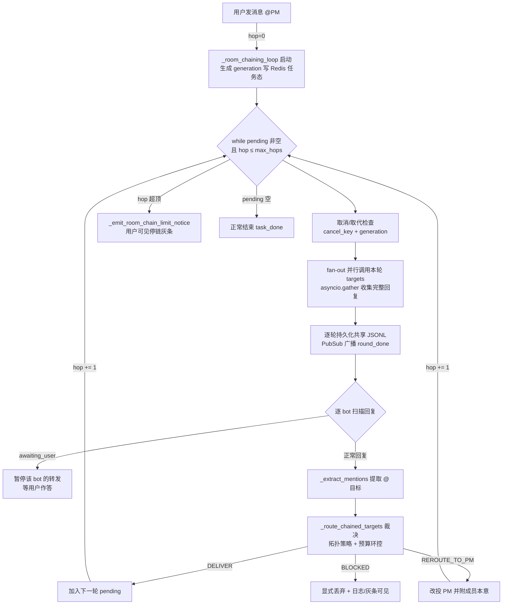

# 重点 10：多 Agent 协作——Room 模式的 bot-to-bot 链式调用与路由决策树

> **一句话亮点（简历可直接用）**：设计并实现多 Agent 群聊（Room）模式的服务端链式编排：@mention 双轨解析路由、PM 星型拓扑兜底分工、hop 递增的逐轮 fan-out 执行、max_hops 全局轮数硬顶 + per-bot 调用预算双层环控，解决了多 Agent 系统最典型的"无限接力"与"消息静默丢弃"两大可靠性难题。

## 为什么这是一个值得重点介绍的难点

单 Agent 系统的控制流是一棵深度可控的树：用户说一句，Agent 内部循环若干轮，回一句。多 Agent 系统的控制流是一张**图**——A 说一句话 @ 了 B，B 回复时又 @ 了 C，C 再 @ 回 A……消息在 bot 之间接力，每一棒都是一次完整的 LLM Agent 循环。这带来三个单 Agent 不存在的问题：

- **路由决策是分布式的**。没有中央调度器告诉每个 bot 该把话传给谁——是 bot 自己在回复文本里 @ 下家。系统要做的是"理解 bot 的寻址意图，并按协作拓扑裁决是否放行"，这是一个策略问题，不是简单的字符串匹配。
- **循环接力是天然的**。后端 bot 修完 bug @ 测试 bot，测试发现问题 @ 回后端，后端再修再 @……这是正常协作；但两个 bot 也可能陷入无意义互 @，每跳都烧一次完整的 LLM 调用。如何区分"健康的往复协作"和"死循环"？
- **失败是静默的**。bot @ 了一个不该 @ 的对象，如果路由层直接丢弃这条消息，用户看到的就是"话说到一半没人接了"——没有任何报错，排查无从下手。多 Agent 系统的可观测性要求比单 Agent 高一个量级。

本项目是一个"数字员工团队"产品（PM、前端、后端、测试等 bot 组成一个房间），Room 链式调用就是它的协作引擎。难点在于：**既要让协作自然发生（bot 用自然语言 @ 彼此），又要让每一次接力可裁决、可限量、可观测**。

## 先备知识：本文涉及的术语与变量

| 术语/变量 | 含义与示例 |
|---|---|
| **Room（房间）** | 多 bot 群聊会话，一个房间里有若干 bot 员工（如 pm、backend、frontend、test）和人类用户。会话 ID 形如 `room-xxxx`。 |
| **hop（跳）** | 链式调用的一轮。hop=0 是用户消息触发的首轮；某个 bot 回复中 @ 了其他 bot，触发下一轮 hop=1，以此类推。每 hop 可能并行调用多个 bot。 |
| **chaining（链式调用）** | bot 回复 → 扫描 @mention → 把回复转发给被 @ 的 bot → 新 bot 回复再扫描……的接力过程。由服务端的 `_room_chaining_loop` 驱动。 |
| **ChainingCall** | 一次接力调用的数据结构（`server.py` namedtuple）：记录"谁（src_bid）把什么内容（content）发给谁（dst_bid）"。每轮的所有目标构成 pending 列表。 |
| **@mention token** | 结构化提及标记，形如 `@[后端](bot:backend)`。bot 在回复里用它点名下家；同时兼容裸 `@后端` 写法（双轨解析）。 |
| **pm_bot_id** | 房间里的 PM（项目经理）bot 的 ID。PM 模式是一种星型拓扑：PM 是唯一编排者，成员的发言默认都回到 PM，由 PM 分派下一步。无 PM 的房间是扁平模式。 |
| **max_hops** | 全局接力轮数硬顶。当前实现：PM 模式 30 跳、扁平模式 2 跳（`server.py:5137`）。防止无限接力的总闸。 |
| **call_counts** | 字典 `{bot_id: 被调用次数}`，记录本次 chaining 中每个 bot 已被 fan-out 调用过几轮。 |
| **_PER_BOT_BUDGET** | 常量 8（`server.py:3352`）。单个非 PM 成员在一次 chaining 内被调用的次数上限。流水线天然要回访同一成员（后端被多轮修复），所以阈值大于 1；PM 作为星型枢纽豁免。 |
| **RoutingDecision** | 路由裁决结果（namedtuple，`server.py:3367`）：`kind`（DELIVER / REROUTE_TO_PM / BLOCKED）、`targets`、`reason`、`relay_to`、`partial_blocked`。强制调用方显式处理每条边的去向。 |
| **REROUTE_TO_PM** | 裁决类型之一：成员 bot 只 @ 了其他成员（没 @ PM），按星型拓扑这条边不直接放行，而是**改投 PM** 并附说明，由 PM 决定是否分派。 |
| **BLOCKED** | 裁决类型之一：目标 bot 的 per-bot 预算耗尽，显式丢弃并记录原因——与"静默丢弃"相对。 |
| **fan-out** | 一轮内并行调用多个目标 bot。用 `asyncio.gather` 并发发起 HTTP 请求收集各 bot 的完整回复。 |
| **PubSub（Redis）** | 房间事件的实时广播通道。每轮的 round_start / round_done、文本 delta、工具事件都经它推给前端；同时维护任务状态 key。 |
| **generation（代际 ID）** | 每次 chaining loop 启动生成一个 UUID。用户在 loop 进行中又发新消息时，新 loop 上位、旧 loop 通过 generation 检查发现"自己被取代"而退出——避免两代 loop 并发写同一房间。 |
| **awaiting_user** | 标记位：某 bot 本轮调用了 ask_user 类工具，正在等用户作答。此时它的发言**不能再往下转发**，否则 PM 会代替用户推进，把人际交互跳过去。 |
| **visited 封杀（历史方案）** | 早期环控：一个 bot 被访问过就终生不再调用。副作用是正常流水线无法回访成员，已被 call_counts 预算制取代。 |

## 技术剖析

### 链式编排主循环



主循环骨架（`server.py:5348-5349` 起）非常简洁：`pending` 是本轮要调用的 ChainingCall 列表，初始为用户消息 @ 的目标（通常只有 PM）；每轮 fan-out 收集回复、解析 mention、裁决出下一轮 pending，`hop += 1`（`server.py:5768`），直到 pending 为空（协作收敛）或 hop 触顶。

环控参数在 `server.py:5137`：

```python
all_bids = set(all_bot_ids)
max_hops = 30 if pm_bot_id else 2
```

PM 模式给 30 跳是因为星型拓扑下所有协作都要经过 PM 往返（PM→成员→PM→成员……），一次完整需求开发十几跳很正常；扁平模式没有编排者，2 跳以上基本是异常互 @，直接封顶。

### @mention 双轨解析

接力的前提是"听懂 bot 想叫谁"。`_extract_mentions`（`server.py:3322-3344`）按优先级双轨解析：

1. **结构化 token**：`@[后端](bot:backend)` ——带 bot_id，精确无歧义；
2. **裸 @name 回落**：`@后端` ——按"最长名字优先 + 词边界 + 命中挖空"匹配，防止 `@{后端}` 和 `@{后端组长}` 这类前缀名互相误命中。

bot 侧由 `nanobot/agent/mentions.py` 的协议提示引导输出结构化 token，但 LLM 不保证守规矩——裸名回落兜底保证"意图再野也能解析出候选集"。

### 路由决策树：显式三态杜绝静默丢弃

这是全文最核心的一段。`_route_chained_targets`（`server.py:3373-3438`）把路由拆成三步，每步的拒绝都落到具名类型上：

```python
# ① 解析寻址意图：排除自身与非法 id
intent = [bid for bid in mentioned if bid != sender_bid and bid in all_bids]
is_member = bool(pm_bot_id) and sender_bid != pm_bot_id

# ② 应用拓扑策略（PM 星型模式）
if is_member:
    if pm_bot_id in intent:
        targets, kind, reason, relay = [pm_bot_id], "DELIVER", "member->pm", []
    elif intent:
        # 成员只 @ 了其他成员：不直接放行，改投 PM 统筹
        targets, kind, reason, relay = [pm_bot_id], "REROUTE_TO_PM", "member->member relayed to pm", intent
    else:
        # 成员没 @ 任何人：默认回 PM
        targets, kind, reason, relay = [pm_bot_id], "DELIVER", "member no-mention->pm", []
else:
    targets, kind, reason, relay = intent, "DELIVER", "pm/flat normal", []

# ③ 环控：per-bot 预算（PM 豁免）
def _allowed(b): return b == pm_bot_id or call_counts.get(b, 0) < per_bot_budget
```

翻译成决策树就是：

| 发言者 | 发言内容 | 裁决 |
|---|---|---|
| 成员 | @ 了 PM | 投给 PM（DELIVER，member→pm） |
| 成员 | 只 @ 了其他成员 | **改投 PM**（REROUTE_TO_PM），并附"成员本意想 @ 谁"供 PM 判断 |
| 成员 | 谁都没 @ | 自动回 PM（DELIVER，no-mention→pm） |
| PM / 扁平模式 | @ 了谁 | 按 mention 正常投递（DELIVER） |
| 任意 | 目标预算耗尽 | 显式 BLOCKED，记原因 |

`REROUTE_TO_PM` 这一条最值得讲：成员之间的直接横向协作在 PM 星型拓扑里是"越权"——曾经的做法是静默丢弃，导致"成员 @ 了同事，同事永远收不到，任务无声终止"。现在的做法是把这条协作诉求**忠实转交 PM**（`server.py:5713-5717`），消息改写成"[成员转交] X 的发言中 @ 了其他成员（Y），按本群协作规则由你统筹，请判断是否调度……"——拓扑纪律和用户意图两全。

### 环控双层：全局 max_hops + per-bot 预算

防无限接力不是一道闸而是两道，管的是不同失效模式：

- **max_hops 管总轮数**：整条链最多跑 30 跳（PM 模式），是失控的总保险丝。触顶时发 `_emit_room_chain_limit_notice`（`server.py:5784`）——用户可见的停链灰条，而不是静默停止。
- **per-bot 预算管单点重复**：`_PER_BOT_BUDGET = 8`，同一成员被调用满 8 次后，后续指向它的边被 BLOCKED。这取代了旧的"visited 终生封杀"——封杀制的 bug 是正常流水线（后端被多轮修复回访）第二跳就被掐死；预算制承认"回访是常态，超限才是异常"。PM 作为枢纽豁免预算，其往返由 max_hops 兜底。

调用次数在**端口校验通过、真正发起调用前**才累加（`server.py:5416-5423`）——注释里明确写了 BUG-001 的教训：端口缺失被跳过的 bot 若也计数，会被"未发起的调用"错误地提前封顶。

### 可观测性：每一条边都有账

多 Agent 系统的可靠性很大程度是观测设计堆出来的：路由裁决的 BLOCKED / REROUTE / PARTIAL_BLOCKED 三态都强制落 logger + helplog（`server.py:5683-5733`）；Redis 任务态带 generation 防止两代 loop 并发（`server.py:5360-5377`，旧 loop 发现自己被取代即退出）；每 hop 广播 round_start / round_done 让前端精确渲染"谁在打字"；某 bot 调用 ask_user 类工具进入 awaiting_user 状态时，它的发言不再往下转发（`server.py:5660-5669`）——否则 PM 会代替用户推进，把人际交互跳过去；编排层异常时向房间推用户可见的中断提示并落盘（`server.py:5809` 起）——任何一个环节出问题，用户和运维都能感知。

## 关键设计决策与权衡

1. **服务端编排而非前端编排**：早期版本链式调用在前端做，但前端无法做跨用户的一致性、取消和持久化。移到服务端 `_room_chaining_loop` 后，环控、审计、共享 JSONL 写入都有了唯一权威点。
2. **预算制取代封杀制**：8 次预算承认回访常态；代价是要维护 call_counts 并在 fan-out 前精确累加（跳过的不计），实现复杂度高于 visited 集合，但行为正确性不可比。
3. **显式三态裁决（类型化）而非返回裸列表**：`RoutingDecision` 强制调用方处理 REROUTE/BLOCKED，从类型层面杜绝"targets 被悄悄清空"——这是真实事故的根治方案。
4. **PM 星型拓扑 + REROUTE 而非自由网状**：限制成员直连换来编排可解释性；用 REROUTE 保留成员意图，避免纪律伤害协作自然度。
5. **hop 级 fan-out 而非逐边串行**：一跳内多个目标并行调用，延迟从"各 bot 时长之和"降为"最大值"；代价是单跳内 bot 之间互相看不到对方本轮发言（只能等下一跳），对星型拓扑是可接受取舍。

## 面试话术（怎么讲）

> 多 Agent 协作的核心难题是控制流从树变成了图，消息在 bot 之间接力，每棒都是一次完整 LLM 循环。我做的 Room 链式编排有几层设计：路由上，bot 用 @mention 点名下家，服务端双轨解析后过一个三步裁决器——先解析寻址意图，再应用 PM 星型拓扑策略，成员之间不能直接互 @，越权边改投 PM 统筹，最后过环控预算。环控是双层的：全局 max_hops 30 跳管总轮数，per-bot 8 次预算管单点重复，取代了旧的终生封杀制——封杀制会把正常的多轮修复回访也掐死。可靠性上我处理过一个真实事故：成员 @ 成员的消息被路由层静默丢弃，任务无声终止，我把它改成类型化的显式三态裁决，每条边的去向都强制落日志和用户可见灰条。整个循环还支持取消、代际取代和等待用户暂停，是多 Agent 场景下完整度比较高的编排实现。

## 可能的追问及答案

**Q：为什么不学 AutoGen/CrewAI 那样让 bot 自由对话，而要用 PM 星型拓扑？**
A：自由网状对话在 demo 里惊艳，在生产里是灾难——n 个 bot 两两可能互 @，路径组合爆炸，且无法回答"这件事现在归谁负责"。星型拓扑把编排权责收敛到 PM 一个点：成员的输出必经 PM 裁决，分工、验收、收尾都有唯一责任人，审计链路也是一条线。代价是 PM 成为单点瓶颈，所以给它豁免 per-bot 预算，用全局 max_hops 兜底它的往返总量。

**Q：max_hops=30 和预算=8 是怎么定的？**
A：30 跳来自对真实协作链的观测：一次"需求→开发→测试→修复→验收"完整流水线，PM 往返派活约 6-10 跳，30 留了 3 倍以上余量；8 次预算同理——同一成员被回访超过 8 次，基本可以判定是"修不好还反复派"的病态循环。两个值都是配置化的工程经验值，触顶时有用户可见灰条，不是静默掐断，所以定紧比定松安全。

**Q：一跳内多个 bot 并行，它们能看到彼此本轮的发言吗？**
A：不能，这是刻意的。fan-out 并行收集的是"各 bot 对上一跳消息的响应"，本轮并行 bot 之间互不可见——如果互相可见，就要等齐所有回复才能开始任一调用（回到串行），或者引入"发言到一半被引用"的一致性难题。跨 bot 信息交换一律走下一跳的显式转发，共享 JSONL 是最终的共同事实源。

**Q：如果 PM 自己陷入反复派活怎么办？**
A：PM 豁免 per-bot 预算，但不豁免 max_hops——它主导的所有往返仍受 30 跳硬顶约束。另外代际机制也管这个：用户发现 PM 车轱辘时可以直接发新消息或调 room/stop，新 loop 的 generation 上位后旧 loop 自查退出，相当于人能随时介入打断。

**Q：如果让你重新设计，会改什么？**
A：会把路由从"文本 @mention"升级为"结构化移交协议"：让 bot 的工具集里多一个 `handoff(to=[...], reason=...)` 工具，寻址意图走 function calling 通道而不是自然语言文本通道。文本 @ 的解析永远有双轨兜底和歧义处理成本，工具调用的参数是强类型的，路由裁决可以省掉整个解析层；文本层只保留给人看的呈现。这是把"约定"升级为"协议"。

## 事实边界

- 本文基于 `application/` 工作区（engine develop 分支，最新提交 2026-07-31）逐行核实；`digi-pal/` 为 2026-05 中旬旧快照（当时仍是 visited 封杀制、无 RoutingDecision 三态），不作为依据。
- 文中 max_hops（30/2）、_PER_BOT_BUDGET（8）为当前 `server.py` 代码值，均为可调工程经验值。
- "PM 星型拓扑"在配置了 pm_bot_id 的房间生效；无 PM 房间退化为扁平模式（按 mention 直投、max_hops=2）。
- bot 单次回复内部仍受各自 AgentLoop 的 max_iterations 约束，hop 级环控与单 Agent 轮数上限是两层独立保险。

## 简历亮点描述（可直接引用）

- 设计并实现多 Agent Room 模式服务端链式编排引擎：@mention 双轨解析路由、hop 递增逐轮 fan-out、Redis PubSub 实时广播与代际取代机制；
- 建立"全局 max_hops + per-bot 调用预算"双层环控，以预算制取代终生封杀制，兼顾健康往复协作与死循环防护；
- 将路由裁决重构为类型化显式三态（DELIVER/REROUTE_TO_PM/BLOCKED），根治成员间 @ 消息静默丢弃的生产事故，实现全链路可观测（含 awaiting_user 暂停与用户可见停链灰条）。

## 代码依据

- `engine/nanobot/server/server.py:5348-5349`（_room_chaining_loop 主循环）、`:5137`（max_hops=30/2）、`:5360-5377`（取消与代际取代检查）、`:5416-5423`（端口校验通过后才计数，BUG-001 注释）、`:5660-5669`（awaiting_user 暂停转发）、`:5683-5733`（BLOCKED/REROUTE/PARTIAL_BLOCKED 三态落日志）、`:5713-5717`（[成员转交] 改写）、`:5740-5753`（多源 From 前缀合并）、`:5768`（hop 递增）、`:5775-5798`（触顶/预算用户可见灰条 _emit_room_chain_limit_notice）、`:5809-`（编排层异常用户可见兜底）
- `engine/nanobot/server/server.py:3322-3344`（_extract_mentions 双轨解析）、`:3347-3352`（_PER_BOT_BUDGET=8 及设计注释）、`:3367-3438`（RoutingDecision 与 _route_chained_targets 三步裁决）
- `engine/nanobot/agent/mentions.py`（@mention 协议定义与裸名回落）、`engine/nanobot/agent/loop.py:4968-4977`（落盘前的 mention 归一化）
