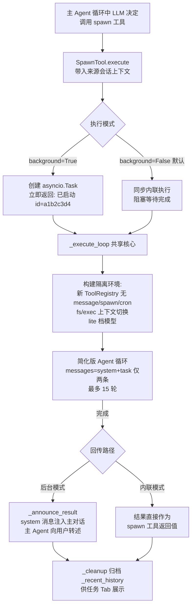

# 重点 11：子 Agent 隔离与独立限额——spawn 机制的边界设计

> **一句话亮点（简历可直接用）**：设计并实现子 Agent（Subagent）派生机制：主 Agent 可将子任务 spawn 给独立子 Agent 执行，具备上下文隔离（不继承主对话历史）、工具集隔离（禁递归 spawn）、独立迭代限额（15 轮，运行时热更）、模型降档（lite 档省 token）四重边界，是复杂任务分解与主对话保护的关键手段。

## 为什么这是一个值得重点介绍的难点

单 Agent 处理复杂任务有一个结构性矛盾：**主对话的上下文既是工作记忆，也是稀缺资产**。假设用户说"帮我调研这三个竞品 API 的差异，然后写一份对比报告"——如果主 Agent 自己干，三次调研的网页内容、中间分析全部堆进主对话历史，上下文迅速膨胀，后续每轮 LLM 调用都背着这些包袱，成本升高且注意力被稀释。

子 Agent 是解这个矛盾的标准手段：主 Agent 把"调研竞品 A"这样的自包含子任务 **spawn（派生）** 给一个全新的 Agent 实例去跑，跑完只把结论带回来。但"新建一个 Agent 跑任务"这句话背后有一连串必须回答的设计问题：

- **子 Agent 能看到什么？** 把主对话全部历史给它，上下文隔离就形同虚设；什么都不给，它又缺乏完成任务的必要背景。边界划在哪？
- **子 Agent 能做什么？** 如果它也能 spawn 子 Agent，递归派生就没有底线；如果它能调用 message 工具直接骚扰用户，主 Agent 的"汇报"节奏就被打乱。
- **子 Agent 失控了怎么办？** 主 Agent 有 80 轮迭代上限，子 Agent 继承这个额度合理吗？一个跑偏的子任务烧 80 轮 token 值得吗？
- **结果怎么回来？** 主 Agent 是阻塞等它（失去并行性），还是各跑各的（结果回来时怎么接回对话）？

这四个问题的答案构成本文的"四重边界"。难点不在实现一个子循环——那几十行代码就够——而在**划对隔离的边界**：隔得太死子 Agent 干不了活，隔得太松主 Agent 被反噬。

## 先备知识：本文涉及的术语与变量

| 术语/变量 | 含义与示例 |
|---|---|
| **Subagent（子 Agent）** | 一个轻量级的独立 Agent 实例，由主 Agent 通过 spawn 工具创建，执行单一职责的子任务（如"查一下这个接口的文档"）。跑一个简化版 Agent 循环（LLM ↔ 工具），完成后把结论交还主 Agent。 |
| **SubagentManager** | 子 Agent 管理器类（`subagent.py:84`）。负责 spawn、跟踪运行中任务（`_running_tasks`）、按会话取消、结果回传与历史归档。AgentLoop 持有实例 `self.subagents`。 |
| **spawn** | 动词，派生子 Agent；也是工具名（SpawnTool）。LLM 调用 `spawn({"task": "调研 X", "label": "调研-X"})` 触发。 |
| **task_id** | 子任务唯一 ID，8 位 UUID 前缀，如 `"a1b2c3d4"`。用于跟踪、取消和结果对应。 |
| **subagent_max_iterations** | 子 Agent 单次任务的迭代轮数上限，默认 **15**（主对话是 80）。存于 AgentLoop 上（`loop.py:727`），运行时可通过 `my(set, ...)` 热改并下沉到管理器。 |
| **max_iterations（子 Agent 内）** | SubagentManager 实例属性（`subagent.py:110/142`），子循环每轮检查 `while iteration < max_iterations`。 |
| **后台模式（background=True）** | spawn 的后台历史模式：创建 asyncio.Task 异步执行，主 Agent 立即拿到"已启动"提示继续对话；子 Agent 完成后通过消息总线把结果注入主对话。fire-and-forget。 |
| **同步内联模式（background=False）** | 主 Agent 阻塞等待子 Agent 完成，结果**直接作为 spawn 工具的返回值**回到主循环；子 Agent 的逐 token 输出还能实时流式渲染在 spawn 工具卡片里。当前默认模式（`subagent_background_default` 默认 False，`loop.py:728`）。 |
| **_announce_result** | 方法（`subagent.py:607`）。后台模式的结果回传：把子任务结论包装成 `channel="system"` 的 InboundMessage 发到消息总线，主 Agent 像收到一条新消息一样处理它。 |
| **InboundMessage(channel="system")** | 系统来源消息。不是用户发的，是平台内部（子 Agent 完成、定时任务触发等）注入对话的消息，主 Agent 读到后自然地向用户转述。 |
| **ModelRouter / lite 档** | 模型分档路由器（main/lite/nano 三档）。主 Agent 用 `main` 档（旗舰模型），子 Agent 用 `router.resolve("lite")` 解析出的**中档模型**——子任务聚焦、上下文短，不需要旗舰推理能力，显著省 token。 |
| **fs/exec 上下文** | 文件系统工具和 shell 工具的工作目录上下文（ContextVar）。子 Agent 执行前切换到有效工作区（群聊=群共享目录，单聊=bot 根目录），跑完在 finally 里复位。 |
| **allowed_dir** | 受限模式下的目录白名单。开启 `restrict_to_workspace` 时，子 Agent 的文件/shell 操作被围栏在白名单目录内（群聊放行 [群工作区, bot 根]，单聊仅 [bot 根]）。 |
| **reqctx / serial** | 请求上下文与流水号。子 Agent 也要绑定 serial，否则它的 token 用量上报会落到兜底值，成本归因失真。 |
| **_recent_history** | 管理器内一个 `deque(maxlen=50)`（`subagent.py:157`），记录最近完成的子任务（状态/耗时/结果摘要），供工作区"任务"Tab 展示；仅内存，重启即失。 |

## 技术剖析

### 派生与回传全流程



### 第一重边界：上下文隔离——messages 只有两条

子 Agent 的会话是从零构建的（`subagent.py:494-497`）：

```python
messages: list[dict[str, Any]] = [
    {"role": "system", "content": system_prompt},
    {"role": "user", "content": task},
]
```

**不继承主对话的任何历史**。主 Agent 把任务描述写进 `task` 字段，这就是子 Agent 能看到的全部"背景"——加上一份精简的专用 system prompt（`subagent.py:645-701`，含工作区路径、会话目录上下文、技能摘要）。这是刻意的职责划分：**上下文打包是主 Agent 的义务**。主 Agent 了解全局，由它把子任务所需的信息浓缩进 task 描述；子 Agent 拿一份干净、聚焦的上下文干活，其内部产生的十几轮中间消息（工具调用、结果）在任务结束即抛弃。

隔离的另一半是**文件系统上下文的显式切换**（`subagent.py:444-465`）：子 Agent 的 fs/exec 工具绑定到"有效工作区"（群聊=群共享目录、单聊=bot 根），并用 `set_fs_context`/`set_exec_context` 切换当前协程的 ContextVar，finally 里复位（`subagent.py:602-604`）——保证并发场景下子 Agent 和主 Agent 的相对路径解析互不污染，也修复了单聊/群聊写盘错位的历史 bug。

### 第二重边界：工具集隔离——防递归的三把锁

子 Agent 的工具注册表是**新建的独立 ToolRegistry**（`subagent.py:469-485`），只装 8 个工具：

```python
tools = ToolRegistry()
tools.register(ReadFileTool(...))
tools.register(WriteFileTool(...))
tools.register(EditFileTool(...))
tools.register(ListDirTool(...))
tools.register(CreateZipTool(...))
tools.register(ExecTool(...))
tools.register(WebSearchTool(...))
tools.register(WebFetchTool(...))
```

对照主 Agent 的 30+ 工具，**刻意拿掉的三类**是：`spawn`（子 Agent 不能再派生子 Agent，递归深度被硬锁在 1 层）、`message`（不能绕过主 Agent 直接给用户发消息，汇报节奏由主 Agent 统一）、`cron`（不能创建定时任务，防止子任务埋下脱离本次对话的长期副作用）。注意这里没有 MCP 工具——子 Agent 的工具环境是白名单制的最小集，外部生态默认不开放。

### 第三重边界：独立迭代限额——15 与 80 的刻意解耦

子 Agent 跑一个简化版 Agent 循环（`subagent.py:499-500, 537`）：

```python
max_iterations = self.max_iterations   # 默认 15
...
while iteration < max_iterations:
    iteration += 1
    response = await self.provider.chat(messages=messages, tools=tools.get_definitions(), model=sub_model, ...)
```

15 与主对话 80 的解耦依据是任务形态：子任务是主 Agent 分解出的单一职责单元，正常 3-5 轮收敛，15 留 3 倍余量；如果子任务频繁触顶，说明分解粒度不对，该在上层拆更细，而不是给子 Agent 加预算——限额是失控保险丝，不是任务容量。

限额**运行时热更**走两条同构路径：`my(set, "subagent_max_iterations", 20)` 由 MyTool 按 RESTRICTED 白名单校验（int，1~100，`tools/self.py:143`）写值到 loop，再经 `_sync_subagent_runtime_limits`（`loop.py:1448-1462`）下沉 `mgr.max_iterations = max(1, int(...))`；admin 配置变更走 `reload_params`（`loop.py:3149-3157`）汇到同一个同步函数。与主限额互不牵连，进程不重启。

### 第四重边界：模型降档——lite 档的成本设计

子 Agent 的 LLM 调用模型来自 `router.resolve("lite")`（`subagent.py:506`）——主 Agent 用 `main` 档旗舰模型做规划，子 Agent 用中档模型做执行。依据是子任务"更聚焦、上下文更短、不需要 Opus 级推理能力"（`subagent.py:118-120` 注释）。`reload_router`（`subagent.py:159-178`）热换模型时有一个精细语义：**只影响下次 spawn 的新任务**——运行中的子任务在协程入口已把模型拍扁成局部变量 `sub_model`，中途换模型会破坏 tool_call 协议的连续性。

### 结果回传：两种模式，一条终点

**后台模式**（fire-and-forget）：spawn 立即返回"已启动"提示，主 Agent 继续对话；子 Agent 完成后 `_announce_result`（`subagent.py:625-642`）把结果包成系统消息注入：

```python
msg = InboundMessage(
    channel="system",
    sender_id="subagent",
    chat_id=f"{origin['channel']}:{origin['chat_id']}",
    content=announce_content,   # "Summarize this naturally for the user. Keep it brief..."
)
await self.bus.publish_inbound(msg)
```

主 Agent 收到这条消息，按提示把技术细节转述成一两句人话给用户。**同步内联模式**（当前默认，`spawn.py:102-106` 的工具描述也引导默认同步）则省去这一圈：结果直接作为 spawn 工具返回值进主循环（`subagent.py:220-224`），子 Agent 的逐 token 输出还经 `on_token` 实时渲染在 spawn 卡片里（`spawn.py:86-95` 声明 `wants_output_stream`）。两条路径殊途同归：**子 Agent 永远不直接触达用户**。

## 关键设计决策与权衡

1. **上下文全新构建而非选择性继承**：打包职责上移到主 Agent，实现简单且边界清晰；代价是主 Agent 任务描述写得不全时子 Agent 会"缺背景"——这是用 prompt 工程（spawn 工具的 description 引导）而非机制解决的问题。
2. **白名单工具集而非黑名单**：新建空 Registry 只加 8 个工具，比"复制主 Registry 再删"安全——主 Registry 新增危险工具时不会漏删。
3. **限额解耦 + 热更**：15/80 双轨各自独立调整，运行时生效；钳制 `max(1, ...)` 防配置写 0 把子 Agent 废掉。
4. **后台/内联双模式**：后台换并行性，内联换结果即时性（主 Agent 可直接基于结果继续推理）；默认模式可配置（`subagent_background_default`，当前默认内联），单次调用可覆盖。
5. **结果经主 Agent 转述而非直推用户**：用户看到的永远是一个连贯的"主人格"，子 Agent 是幕后劳动力；announce 文案明确要求主 Agent"简短转述、别提 subagent 和 task ID"。

## 面试话术（怎么讲）

> 子 Agent 机制解决的是主对话上下文膨胀和复杂任务分解的问题。我的设计有四重边界：上下文隔离——子 Agent 的 messages 只有 system prompt 和任务描述两条，完全不继承主对话历史，上下文打包是主 Agent 的职责；工具集隔离——子 Agent 用白名单新建的 ToolRegistry 只装 8 个工具，刻意拿掉 spawn、message、cron 三个工具，递归派生深度硬锁在一层，也不能绕过主 Agent 直接骚扰用户或埋定时任务；限额隔离——子 Agent 独立 15 轮上限，与主对话 80 轮刻意解耦，支持运行时热更；模型降档——通过 ModelRouter 走 lite 中档模型，子任务不需要旗舰推理，省 token。结果回传分两种模式：后台模式 fire-and-forget，完成后以 system 消息注入主对话由主 Agent 转述；同步内联模式结果直接作为工具返回值，子 Agent 的输出还能实时流式渲染在 spawn 卡片里。细节上还处理过运行中任务不热换模型（会破坏 tool_call 协议）、fs/exec 上下文按会话模式切换防止写盘错位、子 Agent 也要绑定流水号否则成本归因失真这类问题。

## 可能的追问及答案

**Q：子 Agent 和主 Agent 共享 workspace，文件写冲突怎么办？**
A：共享是有意的——子 Agent 写的文件（如调研产出的 markdown）主 Agent 要能读到，这是成果交付的通道。冲突防护靠两层：一是 fs/exec 上下文切换时按会话模式对齐"有效工作区"（群聊写群共享目录、单聊写 bot 根），子 Agent 与主 Agent 落点一致，不会出现各写各的；二是受限模式下 allowed_dir 白名单围栏，子 Agent 越不出授权目录。真正的写冲突场景（主/子同时写同一文件）由任务分解层面规避——主 Agent 派活时按文件/目录划分职责。

**Q：为什么子 Agent 不能 spawn 子 Agent？这是能力损失吗？**
A：是有意的深度锁。递归派生一旦放开，任务树深度不可控，限额体系（每层 15 轮）会乘出一个巨大的失控空间，且"结果层层回传"的延迟和失真都随深度放大。实践中两层足够：主 Agent 负责规划，子 Agent 负责执行。真需要再分解的任务，子 Agent 会在结果里说明，由主 Agent 决定再 spawn 一个新子 Agent——决策权始终在主 Agent 手里。

**Q：后台模式下主 Agent 怎么知道子 Agent 完成了？轮询吗？**
A：不轮询，是事件驱动。子 Agent 完成后通过消息总线发一条 channel=system 的 InboundMessage，主 Agent 的消息循环像收到用户消息一样被唤醒处理它。同时管理器维护 _running_tasks 和 _recent_history，HTTP 接口 `/api/subagents` 可以带外查询运行中/已完成任务，前端任务 Tab 直接消费，不经过 LLM。

**Q：15 轮子 Agent 跑到一半发现任务描述给错了怎么办？**
A：两条路。一是取消：`/stop` 命令按 session 维度取消该会话所有运行中子任务（`cancel_by_session`），也可以按 task_id 单独取消（对 asyncio.Task 发 cancel 并等待收尾）。二是不管它——15 轮上限保证它最坏也就烧 15 轮 lite 档 token，触顶后返回"任务完成但未产出最终回复"的兜底文本，主 Agent 拿到这个结果可以修正描述后重新 spawn。

**Q：如果让你重新设计，会改什么？**
A：会给子 Agent 加"结构化结果契约"。现在结果回传是一段自由文本加一句"请简短转述"的提示，主 Agent 要自己理解成败与要点。如果让子 Agent 的循环终止时强制输出一个 JSON 结论块（status/key_findings/artifacts/下一步建议），主 Agent 可以精确消费——比如 artifacts 列出产出文件路径，主 Agent 不用再去猜子任务写了哪些文件。自由文本对人友好，结构契约对 Agent 间的可靠协作更友好。

## 事实边界

- 本文基于 `application/` 工作区（engine develop 分支，最新提交 2026-07-31）逐行核实；`digi-pal/` 为 2026-05 中旬旧快照（当时无 lite 档、无双模式、15 轮硬编码），不作为依据。
- 15 轮为 `subagent_max_iterations` 默认值（`loop.py:727`、`subagent.py:110`），可经 `my(set)` 或 admin 配置热更；进程重启后恢复配置默认值。
- 后台/内联的默认模式由 `subagent_background_default` 配置决定（`loop.py:728`，当前默认 False 即同步内联），spawn 单次调用可显式覆盖。
- 子 Agent"无会话持久化"指其 LLM 对话历史不落盘；其产出文件（写盘工具的成果）和 `_recent_history` 内存归档不受此限。
- lite 档具体映射到哪个模型由 ModelRouter 配置决定；未配置 router 时退化为与主 Agent 同模型（`subagent.py:127-132`）。

## 简历亮点描述（可直接引用）

- 设计并实现子 Agent 派生机制（spawn），建立上下文隔离（全新 messages 不继承主对话）、工具白名单隔离（8 工具禁递归 spawn）、独立迭代限额（15 轮热更）、模型 lite 降档四重边界；
- 实现后台 fire-and-forget 与同步内联双执行模式，结果经 system 消息注入主对话转述或直接作为工具返回值，支持子 Agent 输出实时流式渲染（wants_output_stream）；
- 完善子任务全生命周期管理：按会话/按任务取消、运行中与历史任务带外查询、fs/exec 上下文按会话切换防写盘错位、成本流水号绑定与用量聚合上报。

## 代码依据

- `engine/nanobot/agent/subagent.py:84`（SubagentManager）、`:96-157`（__init__，max_iterations=15 见 110/142，default_background 见 111/144，_recent_history deque 见 157）、`:159-178`（reload_router 不影响运行中任务）、`:180-305`（spawn 双模式）、`:405-605`（_execute_loop 共享核心：fs/exec 上下文切换 444-465/602-604、工具白名单 469-485、messages 仅两条 494-497、lite 档 506、限额循环 537）、`:607-643`（_announce_result system 消息回传）、`:645-701`（专用 system prompt）、`:703-721`（cancel_by_session）
- `engine/nanobot/agent/tools/spawn.py:86-95`（wants_output_stream 流式声明）、`:102-106`（默认同步的引导性 description）、`:122-131`（background 参数）
- `engine/nanobot/agent/loop.py:727-728`（subagent_max_iterations / subagent_background_default 参数）、`:798-801`（限额挂载与热更说明）、`:907-922`（SubagentManager 实例化含 router/max_iterations/default_background）、`:1448-1462`（_sync_subagent_runtime_limits 热更下沉）、`:3149-3157`（reload_params 同构路径）
- `engine/nanobot/agent/tools/self.py:143`（my(set) RESTRICTED 白名单 subagent_max_iterations 1~100）、`:517-525`（改后同步）
