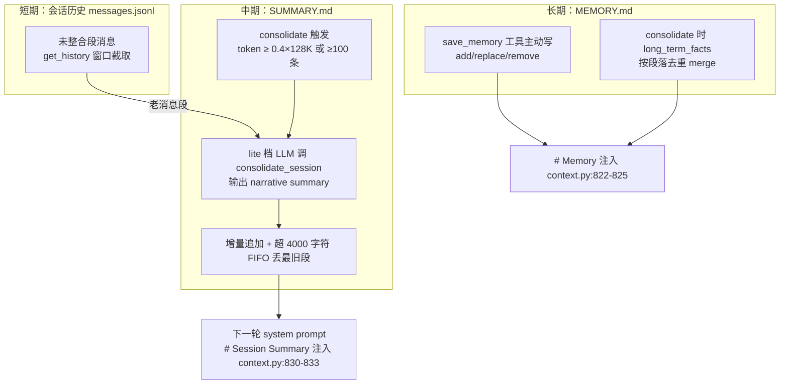

# 重点 12：Agent 记忆系统 —— 短中长三层记忆的工程实现

> **一句话亮点（简历可直接用）**：针对 LLM 无状态的本质，设计并实现"短期会话历史 + 中期 SUMMARY 滚动摘要 + 长期 MEMORY 事实库"三层记忆体系，以 token 预算触发异步压缩、增量追加与超限 FIFO 修剪控制体积，让 Agent 在长会话与跨会话场景下既不忘事、又不被上下文成本拖垮。

## 为什么这是一个值得重点介绍的难点

LLM 本身没有记忆——每次调用都是无状态的函数求值，"记得"完全是工程产物：把历史重新塞进上下文。朴素的"全量重发"在真实使用下必然崩溃：一个跑了几十轮工具调用的会话，历史轻松突破上下文窗口；就算塞得下，每轮都重发几万 token 的成本也无法接受。

所以"记忆"要回答三个问题：

1. **近期的事怎么不忘**——短期记忆，就是会话历史本身；
2. **久远的事怎么不丢又不贵**——中期记忆，把老消息压缩成摘要，用几百 token 替代几万 token；
3. **跨会话的事怎么沉淀**——长期记忆，用户偏好、稳定事实要在新会话里天然可用。

难点不在"写个摘要"，而在工程细节：压缩什么时候触发（按消息数还是 token）？压缩过程会不会和正常对话打架（并发）？摘要体积怎么不无限膨胀？压缩边界能不能切在 tool_use/tool_result 配对中间（会 400）？LLM 写摘要时哪些事实必须逐字保留？这个项目把这些都踩过一遍，还经历了 v1（全局流水 HISTORY.md）→ v2（字段化 SESSION.md）→ v3（叙述摘要 SUMMARY.md）两次推倒重来——`memory.py:9-32` 的模块 docstring 完整记录了 v2 字段化方案失败的四个原因，是很典型的"过度设计"教训。

## 先备知识：本文涉及的术语与变量

| 术语/变量 | 含义与示例 |
|---|---|
| **MEMORY.md** | 长期记忆文件（`<workspace>/memory/MEMORY.md`）。存跨会话稳定事实，分"用户偏好/项目事实/工具知识/通用"四个 section。示例条目：`"用户偏好简洁直接的回答"`。总字符上限 4000。 |
| **SUMMARY.md** | 中期记忆文件（`<workspace>/sessions/<chat_id>/SUMMARY.md`）。本会话老消息的滚动叙述摘要。示例：`"[2026-07-30 14:00] 用户要求重构登录模块，已通过 update_demand_step 交付 login_v2.tsx…"`。上限 4000 字符。 |
| **consolidate / 整合** | 把老消息压缩成摘要的动作。由一次专门的 LLM 调用完成（用便宜的 lite 档模型）。 |
| **consolidate_session** | 整合时 LLM 必须调用的虚拟工具（`memory.py:87-131`），参数两个：`summary`（必填，追加进 SUMMARY.md）、`long_term_facts`（可选，merge 进 MEMORY.md）。 |
| **last_consolidated** | 会话上的整数指针，标记"前 N 条已压缩"。`get_history` 只取它之后的消息喂 LLM。 |
| **memory_window** | 短期窗口大小（默认 80 条，`loop.py:706`）。整合时保留最近一半（40 条）不动，只压缩更老的（`memory.py:698`）。 |
| **should_consolidate** | 触发判定函数（`engine/nanobot/agent/context_budget.py:184`）。规则：未整合消息 token 估算 ≥ 128000 × 0.4，或条数 ≥ 100 兜底。 |
| **_consolidating** | AgentLoop 里的 set（`loop.py:943`），记录"正在整合中的 session key"，防同一会话重复触发。 |
| **_consolidation_locks** | per-session 异步锁（`loop.py:945`），保证同会话整合串行。 |
| **save_memory 工具** | LLM 主动写长期记忆的工具（add/replace/remove 三个操作，`memory.py` 的 MemoryTool，经 `loop.py:1147` 注册）。与 consolidate 的被动触发互补。 |
| **flock** | 文件排他锁。Room 模式多 bot 会并行触发整合，写 MEMORY.md/SUMMARY.md 时加锁防互相覆写。 |
| **CONTEXT_TOKEN_RATIO / CONTEXT_FALLBACK_MSGS / CONTEXT_WINDOW_TOKENS** | 触发阈值三参数（`session_md_flags.py:55-63`）：比例 0.4、消息数兜底 100、窗口 128000，均可经 env 调。 |

## 技术剖析

### 三层记忆架构



三层注入位置在 system prompt 里相邻（`context.py:822-833`）：`# Memory`（长期）在前、`# Session Summary`（中期）在后，短期历史则作为 messages 数组跟在 system 之后。

### 触发：token 预算优先，消息数兜底

旧方案按消息条数触发（≥100 条），但 `context_budget.py` 的注释解释了为什么换：消息条数和模型真实负载无关——工具密集场景里几条 tool_result 就能把上下文打爆。新规则（`context_budget.py:184-213`）：

```python
if len(unconsolidated) >= fb:              # 兜底：100 条
    return True, f"msgs:{len(unconsolidated)}>={fb}"
used = estimate_tokens(unconsolidated, model=model)
threshold = int(win * r)                   # 128000 * 0.4 = 51200 tokens
if used >= threshold:
    return True, f"tokens:{used}>={threshold}"
```

token 估算优先 tiktoken 精确计数，但编码器首次构建要下载词表、可能阻塞——所以 tiktoken 是软依赖，未就绪时主链路回退 `len(text)*0.4` 经验估算，绝不让触发判定卡住对话主链路。触发判定本身还有埋点（`log_decision`），灰度期间可观察触发是 token 主导还是消息数主导。

### 执行：异步、带锁、失败不前推

触发后整合跑在独立 asyncio Task 里（`loop.py:3757-3792`），不阻塞当前对话。三道并发防护：`_consolidating` set 去重（同会话同时在跑的整合只有一个）、`_consolidation_locks` per-session 锁（整合内部串行）、`_consolidation_tasks` 强引用防 GC。写盘侧 MEMORY.md/SUMMARY.md 都加 flock（`memory.py:411-428`、`461-481`），Room 模式多 bot 并行整合也不会互相覆写。整合成功后任务还会自己落一次盘把 `last_consolidated` 指针写出去（`loop.py:3776-3784`）——否则进程重启后"SUMMARY 已有摘要、指针却回退"，那段消息会被重新喂给 LLM，摘要和原文同时进上下文。

失败语义很克制（`memory.py:524-525`）：LLM 输出异常或写盘异常，`last_consolidated` 都**不前推**——下一轮重试，绝不出现"消息已标记压缩但摘要没写成"的数据丢失。

### 摘要的生命周期：增量追加 + FIFO 修剪

`_apply_summary_update`（`memory.py:603-630`）把每批摘要用 `\n\n----\n\n` 分隔追加；整体超过 4000 字符（约 1.2K token）时从最旧段开始丢：

```python
while len(chunks) > 1 and len(...) > SUMMARY_CHAR_LIMIT:
    chunks.pop(0)  # 丢最旧
```

4000 字符的立意注释（`memory.py:78-80`）：控制在主流模型 10% 上下文窗口以内，给短期滑窗留足空间。**中期记忆是滚动窗口不是档案库**——更久远的事要么已被消化进更新的摘要叙述，要么该由长期记忆承接。

### 整合 prompt 的事实保真设计

让 LLM 写摘要最大的风险是"丢关键事实"。`_format_consolidate_prompt`（`memory.py:632-685`）做了三件事：① 把现有 SUMMARY.md 和 MEMORY.md 一并给模型看，避免重复总结；② 明确列出**必须逐字保留**的清单——用户给过的约束/截止日期/技术决策、交付物路径、每个 ask_user 问答对（`Q: … → A: …`）、可复用标识符（ID/URL/日期/是否决策）；③ 冲突解决规则——用户纠正过的事实只保留最新值。同时 `long_term_facts` 的 description 明确禁止把会话级需求/决策写进长期记忆（`memory.py:117-125`），划清中期与长期的归口。

### 指针推进的配对保护

`_advance_consolidated_pointer`（`memory.py:735-753`）推进 `last_consolidated` 时，若边界落在 `role == "tool"` 的消息上就向前退一步——保证 `messages[last_consolidated:]` 永远不会以孤立 tool_result 开头（那会触发 LLM API 400）。这与会话历史管理里"切分点配对保护"是同一条全局不变量。

### v2 的教训：字段化为什么失败

`memory.py:16-23` 记录了 SESSION.md 字段化方案（intent/key_decisions/demands/artifacts/open_questions）失败的四个原因，其中两个特别有普适性：`open_questions` 是"用状态字段做记忆"的反模式——LLM 不会主动 unset，list 永久膨胀，引发"幽灵 TODO"死循环；字段化 patch 让 LLM 维护一致性的认知负担远高于叙述文本，反而更容易出错。v3 回到"叙述文本 + 追加 + FIFO"，是对"LLM 最擅长什么形态"的尊重。

## 关键设计决策与权衡

1. **异步整合而非同步**：整合是一次额外 LLM 调用（几秒级），同步会卡住用户对话。代价是要处理并发与失败回滚，用 set + lock + 不前推指针兜住。
2. **叙述文本而非结构化字段**：对 paraphrase 更宽容、对关键事实保留更可靠，LLM 维护成本最低。代价是无法做字段级精确查询——用 grep 全文检索兜底。
3. **4000 字符硬上限 + FIFO**：记忆体积有界，成本可预测。代价是超久远细节会丢——接受这个损失，因为长期事实有 MEMORY.md 承接，过程细节本来就该被遗忘。
4. **整合用 lite 档模型**：输入输出都很短且结构化，便宜模型完全够用（`loop.py:5262-5266`），记忆维护不烧旗舰模型的钱。
5. **SUMMARY.md 物理位置 per-bot per-chat**：v2 共享 room workspace 的 SESSION.md 会让 PM 视角的看板污染普通成员上下文；per-bot per-chat（`<bot_ws>/sessions/<chat_id>/SUMMARY.md`）天然解决共享污染（`memory.py:25-31`）。

## 面试话术（怎么讲）

> LLM 是无状态的，记忆全靠工程。我做了三层：短期是会话历史 JSONL 滑窗；中期是 SUMMARY.md 滚动摘要，未整合消息 token 估算达到 128K 窗口的 40% 就触发一次异步整合，用便宜模型把老消息压成叙述摘要增量追加，超 4000 字符丢最旧段；长期是 MEMORY.md 存跨会话事实，LLM 主动用 save_memory 写，整合时也可以 promote。细节上：整合失败指针不前推保证不丢数据，指针推进避开 tool 配对中间防 API 400，整合完成后立即落盘指针防重启后摘要原文双重进上下文，写盘加 flock 防 Room 模式多 bot 并行覆写。中间还推翻过一版字段化方案——LLM 不会主动清理状态字段导致幽灵 TODO，叙述文本才是模型最擅长的形态。

## 可能的追问及答案

**Q：为什么不用向量数据库做长期记忆？**
A：这里的长期记忆是"少量高价值稳定事实"（几十条），全量注入 system prompt 才 4000 字符，检索是伪需求——全量给比按相似度捞更可靠，还省掉 embedding 基础设施。向量库适合大规模知识库，不适合个人事实库。规模变了选型才会变。

**Q：摘要压缩会不会丢关键信息导致答错？**
A：这是核心风险，所以整合 prompt 里显式列了"必须逐字保留"清单：约束、交付路径、ask_user 问答对、标识符。并且短期滑窗里最近 40 条消息永远原文保留，摘要只覆盖更老的部分。极端情况下还有 JSONL 全文在磁盘上，模型可以 grep。

**Q：异步整合和正在进行的对话并发，会不会摘要写串了？**
A：三层防护：`_consolidating` set 保证同会话只有一个整合在跑；per-session 锁串行化；写盘 flock。整合读的是触发时刻的消息快照，`last_consolidated` 只在成功后推进，新消息继续追加不受影响。

**Q：MEMORY.md 的 4000 字符上限到了怎么办？**
A：`add` 会拒绝并返回当前用量和全部条目，强制 LLM 先 `remove` 低价值条目腾空间。这是刻意的"容量压力"设计：让模型自己判断什么事实值得长期保留，而不是无限堆积稀释注意力。

**Q：如果重新设计，会改什么？**
A：会加"记忆召回的显式化"——目前 MEMORY/SUMMARY 是全量注入，模型被动接收。更优做法是增加一个 recall 工具让模型按需查询归档摘要（现在 JSONL 全文可查但没有友好的检索层），把"全量注入"和"按需召回"结合，进一步压低常驻 token。另外想给摘要质量加离线评测：定期抽样检查"逐字保留清单"的保真度。

## 事实边界

- 本文基于 `application/` 工作区（engine develop 分支，最新提交 2026-07-31）逐行核实；`digi-pal/` 为 2026-05 中旬旧快照（当时仍是 MEMORY.md + HISTORY.md 两层），不作为依据。
- **memory_window 默认值是 80**（`loop.py:706`），整合保留最近一半即 40 条；旧文档中"默认 100 条、保留 50 条"为旧值，以代码为准。触发阈值里的 100 条是另一个独立参数 `CONTEXT_FALLBACK_MSGS`（`session_md_flags.py:58-60`），不要与 memory_window 混淆。
- 摘要保真度依赖模型遵循"逐字保留"指令的程度，存在概率性损失，不是机制保证。
- token 估算在 tiktoken 未就绪时用经验值（len×0.4），触发时机可能偏早或偏晚，但兜底方向是"宁早勿晚"。
- 跨会话记忆目前只有 MEMORY.md 一个通道，且依赖 LLM 主动调用 save_memory——模型可能忘记写。
- v3 方案在 DM 与 Room 模式下都运行良好，但超长期（数月）单会话的摘要质量未做系统性评测。

## 简历亮点描述（可直接引用）

- 设计三层 Agent 记忆体系（会话历史滑窗 + SUMMARY 滚动摘要 + MEMORY 长期事实库），以 token 预算（0.4×128K）触发异步 LLM 整合，兼顾不忘事与上下文成本有界；
- 实现整合全链路可靠性：per-session 锁与去重集合防并发、失败指针不前推防数据丢失、指针推进避开 tool 配对中间防 API 400、整合后即刻落盘指针防重启双重注入、flock 防多 bot 覆写；
- 主导字段化 SESSION.md → 叙述摘要 SUMMARY.md 的方案迭代，以"增量追加 + 4000 字符 FIFO 修剪 + 逐字保留清单"平衡体积与保真度。

## 代码依据

- `engine/nanobot/agent/memory.py:9-32`（v1→v2→v3 演进与 v2 失败四因）、`:72-80`（SECTION_NAMES 四类与 4000 字符上限及立意）、`:87-131`（consolidate_session 工具 schema）、`:505-599`（consolidate 主流程，失败不前推 524-525）、`:603-630`（增量追加 + FIFO）、`:632-685`（保真 prompt）、`:735-753`（指针配对保护）、`:756-778`（段落去重 merge）、`:411-428`（flock 写 MEMORY.md）、`:461-481`（flock 写 SUMMARY.md）
- `engine/nanobot/agent/context_budget.py:184-213`（should_consolidate token 优先 + 条数兜底）
- `engine/nanobot/agent/session_md_flags.py:55-63`（0.4 / 100 / 128000 阈值 env 默认）
- `engine/nanobot/agent/loop.py:706`（memory_window=80）、`:943-945`（并发防护三件套）、`:3734-3792`（异步整合触发与指针落盘 3776-3784）、`:5262-5266`（lite 档模型）、`:3625-3724`（/new 归档 + SUMMARY/tool_results/看板重置）
- `engine/nanobot/agent/context.py:822-833`（MEMORY/SUMMARY 注入 system prompt）
