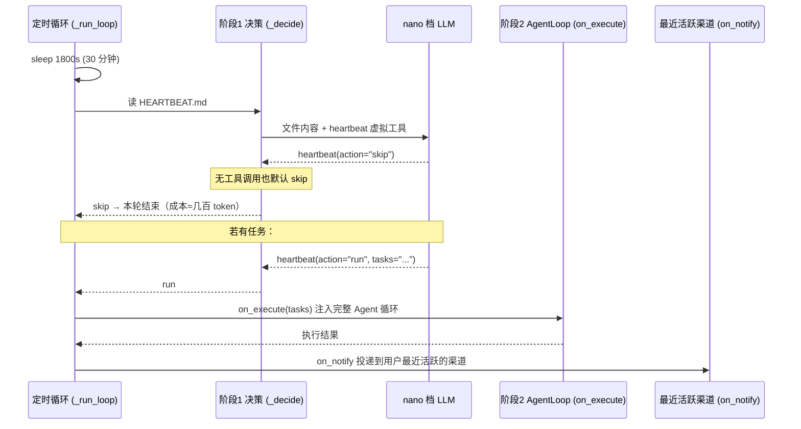

# 重点 13：Heartbeat 与 Cron —— 从"问一句答一句"到主动干活

> **一句话亮点（简历可直接用）**：设计并实现 Agent 的主动化双引擎——Heartbeat 每 30 分钟主动唤醒、用"虚拟工具调用"两阶段 LLM 决策避免自由文本解析的不可靠；Cron 定时任务采用无状态化调度（下次触发时刻是定义的纯函数），消除了运行态持久化派生的一整套并发伤疤，让数字员工从被动应答升级为 7×24 主动干活。

## 为什么这是一个值得重点介绍的难点

普通 LLM 应用是"刺激-响应"模型：用户发消息，Agent 才活过来；用户不说话，Agent 就是死的。但"数字员工"的产品定位要求主动性——每天早上汇总数据、定时巡检任务看板、到点提醒用户。这需要两个基础设施能力：**周期性自我唤醒**（Heartbeat）与**精确时点调度**（Cron）。

听起来只是"加个定时器"，真正的难点在深处：

1. **"有没有活干"该不该由 LLM 判断？** HEARTBEAT.md 是用户/Agent 自己维护的任务清单，内容自由文本。让 LLM 判断"现在有没有该做的事"很自然，但怎么可靠地拿到它的判断结果？解析自由文本（"我觉得要运行"还是"SKIP"）脆弱不堪。
2. **唤醒不是免费的**。每 30 分钟醒一次，如果每次空醒也走完整 Agent 循环，一天 48 轮 LLM 调用全在烧冤枉钱。决策要便宜、执行才值得贵。
3. **定时调度的状态地狱**。持久化"下次触发时间/上次执行状态"这类运行态，在多进程（主进程扫描 + 员工子进程执行）多写场景下会派生双触发、孤儿引用、时钟漂移等一整套并发 bug——这个项目真实经历过，最后靠"无状态化"连根拔掉。

## 先备知识：本文涉及的术语与变量

| 术语/变量 | 含义与示例 |
|---|---|
| **HEARTBEAT.md** | 工作区根目录的任务清单文件，Agent 每 30 分钟读一次。示例内容：`"## 进行中的任务\n- 检查昨天交付的报告有没有用户回复"`。空文件则跳过本次心跳。 |
| **HeartbeatService** | 类（`engine/nanobot/heartbeat/service.py`）。心跳服务，后台 asyncio 循环。 |
| **两阶段设计** | 阶段 1（决策）：轻量 LLM 调用判断 skip/run；阶段 2（执行）：仅 run 时把任务注入完整 AgentLoop。 |
| **_HEARTBEAT_TOOL** | 虚拟工具定义（`service.py:41-64`）。决策阶段 LLM 必须通过它汇报结果，参数 `action`（枚举 skip/run）+ `tasks`（任务描述）。 |
| **nano 档模型** | 模型分档（main/lite/nano）里的最便宜档。心跳决策输入输出都很短（一个文件 + 二选一），用 nano 档控制成本（`service.py:105-112、181-187`）。 |
| **on_execute / on_notify** | 回调。on_execute 把任务文本交给完整 AgentLoop 跑一轮；on_notify 把结果投递到最近活跃的渠道。 |
| **CronService** | 类（`engine/nanobot/cron/service.py:126`）。定时任务调度服务。 |
| **CronSchedule** | 调度规则（`engine/nanobot/cron/types.py:28`），三种 kind：`at`（一次性）、`every`（固定间隔）、`cron`（cron 表达式，支持时区）。 |
| **jobs.json** | 任务定义持久化文件，**纯定义**——不含任何运行态（下次触发时间等）。 |
| **_compute_next_run** | 纯函数（`service.py:47`）。给定 (调度定义, 当前时间, 锚点) 算出下次触发时刻，任何进程任何时候算结果都一样。 |
| **croniter** | 第三方库，解析 cron 表达式（如 `"0 9 * * *"` 每天 9 点）算下一个匹配时刻。 |
| **固定锚点** | `every` 模式的语义：触发序列对齐到任务创建时刻的整数倍（`T_n = anchor + ceil((now-anchor)/every)*every`），重启后可确定性重建，不漂移。 |
| **ContextVar 防递归** | CronTool 用 `_in_cron_context`（`engine/nanobot/agent/tools/cron.py:47`）标记"正在 cron 回调里"，禁止嵌套创建新任务，防无限递归调度。 |
| **load_passive** | 多进程模式：员工子进程只读定义不启动定时器（`service.py:301`），由主进程统一触发，避免双触发。 |
| **origin 标记** | 系统自动触发的消息在 JSONL 里带 `_origin: "cron"/"heartbeat"`，前端据此渲染为"系统通知"而非真人发言（`loop.py:5317-5322`）。 |

## 技术剖析

### Heartbeat：两阶段唤醒



**为什么用虚拟工具而不是文本解析**（`service.py:5-9`）：让 LLM 通过结构化 tool_call 汇报决策，`action` 是枚举值 skip/run——不存在"模型说了一堆话但没说清要不要运行"的解析歧义。LLM 未调工具时默认 skip（`service.py:208-210`），偏保守：宁可漏跑一轮，不可空转烧 token。

**成本分档**：决策走 nano 档模型（`service.py:105-112` 初始化 router、`:181-187` resolve），一次决策只需几百 token；只有决策为 run 才进入昂贵的完整 Agent 循环。执行通过 `process_direct` 注入，session_key 固定为 `"heartbeat"`（`engine/nanobot/cli/commands.py:1386`），且带 `origin="heartbeat"` 标记（`commands.py:1390`）——这条触发消息在 LLM 上下文里仍是 `role: user`（正常驱动本轮），但写入 JSONL 的 `_origin` 字段让前端历史接口把它渲染成"系统自动触发"通知，不会伪装成真人发言。

**投递目标选择**（`commands.py:1341-1365`）：扫描会话列表找最近活跃的外部渠道投递；只有 CLI 渠道时静默丢弃——心跳结果不该发到一个没人看的终端。

**寄生扩展点**：`on_tick` 钩子（`service.py:124-128、298-303`）允许 curator 等后台任务挂在心跳节拍上，即便 HEARTBEAT.md 主流程关闭（enabled=False）也照常运行——心跳循环同时是进程级的"分钟级 cron"。

### Cron：无状态化调度

核心洞察写在 `service.py:5-8`：**下一次该触发的时刻是对 (定义, now) 的纯函数**——`at` 模式就是目标时间戳；`every` 模式按公式 `T_n = anchor + ceil((now-anchor)/every)*every` 对齐创建时刻的整数倍；`cron` 模式交给 croniter 解析（`service.py:83-96`）。既然能随时重算，就**不持久化**它：

```python
def _compute_next_run(schedule, now_ms, anchor_ms=0):
    if schedule.kind == "at":
        return schedule.at_ms if schedule.at_ms and schedule.at_ms > now_ms else None
    if schedule.kind == "every":
        anchor = anchor_ms if anchor_ms and anchor_ms > 0 else now_ms
        n = (now_ms - anchor) // every + 1
        return anchor + n * every
    if schedule.kind == "cron" and schedule.expr:
        cron = croniter(schedule.expr, base_dt)
        return int(cron.get_next(datetime).timestamp() * 1000)
```

这一刀删掉了什么（`service.py:10-14` 如实记录）：`CronJobState`（next_run/last_run/last_status）、`_recompute_next_runs`、`_heal_stale_next_run`、`last_armed_for`、孤儿引用补丁、at+delete 竞态上移补丁——**全部消失**，因为根因（持久化可变运行态 + 多写）被消除。`types.py:9-21` 的模块 docstring 同样记录了重构前"主进程 ScheduleManager 扫描 + emp 子进程执行"多写场景派生出的双 fire 风暴等伤疤。

调度循环极简：单个 asyncio 定时器睡到"按定义重算出的最近 tick"（`_arm_timer`，`service.py:332-353`），到点执行所有到期任务，再重算 re-arm（`_on_timer`，`service.py:355-394`）。重启无损——`start()` 只做"加载定义 → arm"两步，没有"重算并保存 next_run"（`service.py:285-299`）。外部改 jobs.json 通过 mtime 检测自动重载（`service.py:164-172`）。多进程模式下员工子进程用 `load_passive` 只读定义（`service.py:301-311`），由主进程 ScheduleManager 统一触发、Redis token 幂等去重，子进程经 `/cron/fire` 执行 `run_job`（`service.py:539` 起）——执行路径除"一次性任务执行后自删"外绝不回写 jobs.json（唯一的执行期写盘是 at+delete_after_run 的定义清理，`service.py:389-392`）。

**创建侧的安全闸**：LLM 通过 CronTool 创建任务，工具用 ContextVar 标记"cron 回调执行中"，此时 `add` 操作被拒绝（`tools/cron.py:46-47`、`:191-198`）——防止 cron 触发的 Agent 又创建新 cron，无限递归调度。

## 关键设计决策与权衡

1. **两阶段而非直接执行**：决策（便宜模型 + 结构化输出）与执行（完整 Agent 循环）分离，空心跳的成本压到几百 token。代价是决策可能误判——用"默认 skip"把误判方向偏向省钱。
2. **虚拟工具调用而非文本解析**：用 LLM 的结构化能力（tool_call schema 校验）替代脆弱的正则解析。这是"让 LLM 输出机器可读结果"的范式选择，本项目记忆整合（consolidate_session）也是同一范式。
3. **无状态化而非修补并发**：面对多写竞态，选择消除可变运行态而非加锁修补。代价是丢失了 last_run/last_status 等执行历史（前端兼容字段固定为 null），换来一整类 bug 的根除。
4. **every 用固定锚点而非滑动**：`now + every` 滑动锚点每次重启都漂移，固定锚点对齐创建时刻整数倍，任何时刻重启都能重算出同一序列。

## 面试话术（怎么讲）

> 数字员工不能用户不说话就是死的，我做了两个主动化引擎。Heartbeat 每 30 分钟唤醒一次读 HEARTBEAT.md，但不是醒来就跑完整 Agent 循环——先用最便宜的 nano 档模型做一次决策，让 LLM 通过一个虚拟工具调用结构化地汇报 skip 还是 run，避免了自由文本解析的不可靠，空心跳只烧几百 token；run 了才注入完整 AgentLoop 执行并投递到最近活跃渠道。Cron 这块我主导了无状态化重构：下次触发时刻是定义的纯函数，jobs.json 只存定义不存运行态，把之前持久化运行态派生的双触发、孤儿引用、时钟漂移那一整类并发 bug 连根删掉，重启无损重建。创建侧用 ContextVar 防止 cron 回调里嵌套建任务的递归调度。

## 可能的追问及答案

**Q：为什么心跳是 30 分钟，不能更频繁吗？**
A：可以配（`interval_s` 参数）。30 分钟是成本与响应度的平衡：决策再便宜也是 LLM 调用，一天 48 次空决策和一天 480 次差一个数量级。真正需要精确到分钟的任务应该走 Cron，Heartbeat 的定位是"周期性检查自由文本任务清单"的兜底机制。

**Q：LLM 决策会不会把"该跑的"判成 skip？**
A：会，这是概率性判断。缓解措施：HEARTBEAT.md 有明确格式引导（进行中的任务写在固定 section），决策输入就是文件全文；对时效敏感的任务引导用户走 Cron（确定性调度）而非 Heartbeat（概率性唤醒）。两个引擎是互补的：确定时点用 Cron，模糊巡检用 Heartbeat。

**Q：无状态化丢了执行历史，怎么排查"任务到底跑没跑"？**
A：执行日志走 loguru（`Cron: executing job`），执行结果按 deliver 配置投递到渠道并落在会话 JSONL（带 `_origin: "cron"`）。前端展示用的 `nextRunAtMs` 由定义即时派生；`lastRunAtMs` 等字段保留键名但固定 null，是刻意的兼容决策。真需要执行审计可以查会话历史。

**Q：多进程下主进程挂了，子进程的任务会停吗？**
A：会停触发，但不会丢——jobs.json 定义在磁盘上，主进程恢复后按定义重算下次 tick 继续调度。错过的时间点不会补跑（cron 语义天然如此），这符合用户对定时任务的预期。

**Q：如果重新设计，会改什么？**
A：会给 Heartbeat 加"决策质量反馈环"——记录每次决策与实际执行的相关性，连续 N 次 skip 后自动拉长间隔（指数退避），连续 run 后缩短。目前间隔是静态配置。另外 Cron 想补一个"错过补跑策略"（misfire policy）配置项，让关键任务在进程恢复后补跑一次。

## 事实边界

- 本文基于 `application/` 工作区（engine develop 分支，最新提交 2026-07-31）逐行核实；`digi-pal/` 为 2026-05 中旬旧快照（当时 Cron 仍持久化 CronJobState、every 为滑动锚点），不作为依据。
- Heartbeat 的"主动"仍是轮询语义（最长 30 分钟延迟），不是事件驱动的实时响应。
- 决策阶段是概率性 LLM 判断，存在误判率；"两阶段"保证的是解析可靠性，不保证决策正确性。
- Cron 不保证恰好准点（event loop 调度有毫秒级抖动），且进程停机期间的任务不补跑。
- 多进程幂等依赖主进程 Redis token，Redis 不可用时降级路径的重叠执行保护会减弱。
- nano 档具体映射到哪个模型由 ModelRouter 配置决定；未配置 router 时退化为与主 Agent 同模型（`service.py:107-110` 兜底）。"决策几百 token"为量级估计。

## 简历亮点描述（可直接引用）

- 设计 Heartbeat 主动唤醒服务（30 分钟周期），以"虚拟工具调用"两阶段 LLM 决策替代自由文本解析，nano 档模型决策 + 完整 AgentLoop 执行的成本分档使空唤醒成本降至几百 token；
- 主导 Cron 服务无状态化重构：下次触发时刻抽象为 (定义, now) 纯函数、jobs.json 收敛为纯定义，根除持久化运行态派生的双触发/孤儿引用/时钟漂移整类并发 bug，重启无损重建；
- 落地执行来源标记（_origin）、ContextVar 防递归调度、多进程 load_passive + Redis 幂等触发等机制，支撑数字员工 7×24 主动执行定时任务。

## 代码依据

- `engine/nanobot/heartbeat/service.py:41-64`（_HEARTBEAT_TOOL 虚拟工具）、`:94`（默认 30 分钟）、`:105-112`（nano 档 router 兜底）、`:163-214`（_decide 两阶段决策，nano resolve 见 181-187，默认 skip 见 208-210）、`:249-303`（_run_loop/_tick）、`:124-128、298-303`（on_tick 寄生钩子）、`:305-320`（trigger_now）
- `engine/nanobot/cron/service.py:5-14`（无状态化设计记录）、`:47-98`（_compute_next_run 纯函数，every 固定锚点 75-81）、`:164-172`（mtime 重载）、`:285-299`（start 无"重算并保存"）、`:301-311`（load_passive）、`:320-353`（_get_next_wake_ms/_arm_timer）、`:355-394`（_on_timer，at+delete 清理 389-392）、`:539-`（run_job）
- `engine/nanobot/cron/types.py:9-21`（重构前伤疤记录）、`:28-55`（CronSchedule 三种模式与固定锚点 docstring 44-49）、`:58-90`（CronPayload 含 room 执行语义）
- `engine/nanobot/agent/tools/cron.py:46-47`、`:191-198`（ContextVar 防递归）
- `engine/nanobot/cli/commands.py:874`（origin="cron"）、`:1341-1365`（_pick_heartbeat_target 投递目标选择）、`:1368-1405`（on_heartbeat_execute/on_notify）、`:1422-1434`（服务装配含 router）
- `engine/nanobot/agent/loop.py:5301-5339`（process_direct 与 _origin 标记）
