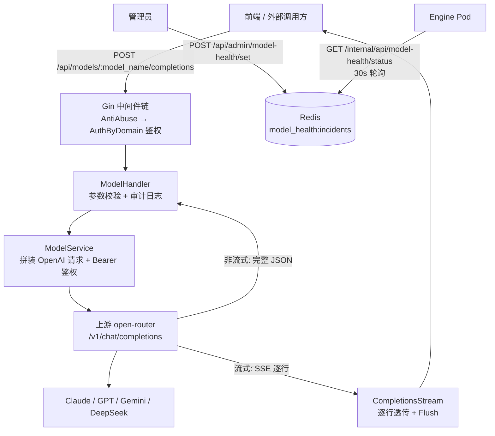

# 重点 14：Go 模型网关——多上游 LLM 统一代理与故障降级

> **一句话亮点（简历可直接用）**：用 Go/Gin 实现了一个生产级 LLM 模型网关，将上游 open-router 聚合网关封装为对内统一的 OpenAI `/v1` 兼容接口，承载鉴权、审计日志、流式透传与模型故障降级标记四大横切能力，让全平台数字员工与外部调用方对"模型从哪来"完全无感知；模型故障切换靠 Redis 标记 + engine 30 秒轮询，全网生效零发版。

## 为什么这是一个值得重点介绍的难点

LLM 应用发展到多模型阶段，一定会遇到一个问题：**模型调用不能散落在各个业务代码里**。如果每个数字员工、每个前端页面都直接拿着上游 API Key 去调模型，那么：上游 Key 泄露面不可控；谁在调、调了什么、花了多少 token 无法审计；某个模型故障时要改 N 处配置才能切换；限流、权限、配额更无从谈起。所以需要在业务与上游之间加一层"模型网关"。

这件事听上去只是"转发请求"，但真正做到生产可用有几个深坑：

- **协议适配的坑**：对外要伪装成标准 OpenAI `/v1/chat/completions` 协议（包括错误体格式），对内的上游地址配置却有各种历史写法（带不带 `/v1`、带不带尾斜线），处理不好就是全网 404；
- **错误透传的坑**：上游返回 429、500 时，调用方希望拿到**上游真实状态码和错误体**，而不是网关统一包一层 500 把自己的锅和上游的锅混在一起；
- **流式响应的坑**：SSE 流不能整段读完再转发（首 token 延迟会爆炸），也不能被反向代理缓冲，还会被 Go 默认的 64KB 扫描缓冲掐断；
- **故障降级的坑**：模型挂了的最高优先级诉求是"全网秒级切换"，但不能靠发版重启解决，且多个管理员并发操作降级标记时不能互相覆盖。

## 先备知识：本文涉及的术语与变量

| 术语/变量 | 含义与示例 |
|---|---|
| **open-router** | 本项目的上游 LLM 聚合网关（内部地址如 `https://ctool.woa.com/ai`），它再向下聚合 Claude、GPT、Gemini、DeepSeek 等多家模型。admin 模型网关是它的"对内门面"。 |
| **OpenAI /v1 兼容协议** | 业界事实标准的 LLM HTTP 接口格式：`POST /v1/chat/completions`，请求体含 `model`、`messages`（`role`/`content` 数组）、`stream` 等字段；响应含 `choices`、`usage`。上游各家厂商都适配它，网关对外暴露同一格式就能"一次对接、处处可用"。 |
| **SSE（Server-Sent Events）** | 一种基于 HTTP 长连接的单向流式协议，服务端持续推送 `data: {...}\n\n` 格式的文本帧。LLM 的"打字机效果"靠它逐 token 下发。 |
| **ModelService** | Go 结构体（`admin/internal/services/model_service.go:85`），模型网关的 service 层，持有 `baseURL`（上游地址）、`apiKey`（上游 Key）、`httpClient` 三个字段。 |
| **baseURL** | 变量，`string`。上游网关地址。构造函数里做了归一化：无论配置写成 `.../ai`、`.../ai/`、`.../ai/v1` 还是 `.../ai/v1/`，都归一化为"不含 `/v1`、不含尾斜线"的形式，路径由代码自己拼。示例值：`"https://ctool.woa.com/ai"`。 |
| **ChatCompletionRequest** | 发往上游的请求 DTO（`model_service.go:39`），字段与 OpenAI 协议一一对应；`Stream` 字段由 service 强制设定，客户端传了也不算数。 |
| **UpstreamError** | 上游错误体结构（`model_service.go:71`），含 `message`/`type`/`code`，与 OpenAI 错误格式一致，用于把上游错误原样透传给调用方。 |
| **降级标记（incident）** | 一条"模型 A 故障，请切换到模型 B"的记录，存 Redis。结构为 `ModelHealthIncident{Model, FallbackModel, Reason, SetBy, CreatedAt}`（`admin/internal/api/model_health_handler.go:16`）。示例值：`{"model":"claude-opus-4-6","fallback_model":"gpt-5.2","reason":"上游 502 持续","set_by":"mattfang"}`。 |
| **WATCH/MULTI** | Redis 的乐观锁事务：WATCH 监视一个 key，事务执行前若 key 被别人改过则整体失败重试。用于并发写降级标记时防丢更新。 |
| **GAuth 管理员** | 公司内部权限系统的角色（管理员 1079/超管 1087），设置降级标记是平台级开关，必须过这道门禁。 |

## 技术剖析

### 网关整体位置



路由注册在 `admin/internal/api/router.go:1349-1356`：`GET /api/models` 列表直接可用，而 `completions` 两个端点挂在 `/models/:model_name` 分组下，分组上可挂 `Permission` 中间件做"用户×模型"粒度的权限校验——权限校验集中在路由层声明，业务 handler 完全不管。

### 上游地址归一化：协议适配的第一个坑

`NewModelService`（`model_service.go:99-115`）处理了配置兼容性：

```go
base := strings.TrimRight(llmAPIBase, "/")
// 兼容带 /v1 结尾的旧配置：本服务统一在路径中拼 /v1
base = strings.TrimSuffix(base, "/v1")
```

无论运维把上游地址写成 `https://ctool.woa.com/ai`、`.../ai/`、`.../ai/v1` 还是 `.../ai/v1/`，归一化后都是同一个 base，代码里固定拼 `base + "/v1/chat/completions"`（`model_service.go:157`）。这个细节看着小，但它是"配置不可信"防御性编程的典型：**配置中心的历史值千奇百怪，代码必须全兼容，否则一次配置变更就是一次全网 404**。

### 错误透传：不替上游背锅

非流式调用 `ChatCompletion`（`model_service.go:148-182`）里有一个关键分支：

```go
// 上游返回非 2xx 时，透传上游状态码
if resp.StatusCode >= 400 {
    return &result, resp.StatusCode, nil
}
```

handler 侧（`admin/internal/api/model_handler.go:88-92`）拿到这个状态码后，把上游错误体的 `code` 和 `message` 原样返回给调用方：上游 429（限流）就回 429，上游 400（参数错）就回 400。只有"连上游都够不着"（网络错误、超时）才返回 502 `UPSTREAM_ERROR`（`model_handler.go:82-86`）。这样的语义划分让调用方能区分"我的问题 / 上游的问题 / 网关链路的问题"，监控告警也能按状态码分维度归因。

### 流式透传：首 token 延迟优先

`CompletionsStream`（`model_handler.go:115-179`）是流式路径的核心：

```go
scanner := services.NewSSEScanner(upResp.Body)
for scanner.Scan() {
    line := scanner.Text()
    _, _ = fmt.Fprintf(c.Writer, "%s\n", line)
    if strings.HasPrefix(line, "data:") {
        _, _ = fmt.Fprint(c.Writer, "\n")   // data 行后补空行，凑成完整 SSE 消息
    }
    if canFlush {
        flusher.Flush()   // 每行立即刷出，绝不攒批
    }
}
```

三个工程细节：

1. **逐行转发 + 每行 Flush**：绝不等整段响应读完，保证首 token 延迟 ≈ 上游首 token 延迟 + 一跳网络开销，用户看到的打字机效果不被网关拖慢；
2. **256KB 扫描缓冲**：`NewSSEScanner`（`model_service.go:238-243`）把 `bufio.Scanner` 默认 64KB 缓冲扩到 256KB（`scanner.Buffer(make([]byte, 256*1024), 256*1024)`），因为 LLM 流式 chunk 是单行大 JSON（工具调用参数、长文本 delta 都在一行里），默认缓冲会触发 `bufio.Scanner: token too long` 直接把流掐断；
3. **错误也用 SSE 格式回写**：参数校验失败、上游连接失败时，不是返回普通 JSON 错误，而是 `writeSSEError`（`model_handler.go:186-195`）写一帧 `data: {"error":{...}}`——因为前端 EventSource 已经建立了 SSE 连接，只能用 SSE 帧告诉它出错了，协议一致性比"错误码纯洁性"重要。

### 模型故障降级标记：Redis + 乐观锁 + 引擎轮询

模型降级分两半：admin 只负责**标记的读写**，真正的模型切换由 engine 在 LLM 调用层透明完成。

写入侧（`model_health_handler.go:158-198`）用 Redis WATCH/MULTI 乐观锁包裹"读-改-写"：

```go
for i := 0; i < maxRetries; i++ {          // maxRetries = 5（:163）
    err := h.redis.Watch(ctx, txn, key)
    if err == nil { return nil }
    if err == goredis.TxFailedErr { continue }  // key 被并发修改，重试
    return err
}
```

为什么需要它：降级标记是一个 JSON 数组（多个模型可能同时故障），两个管理员同时操作"标记 A 故障"和"恢复 B"时，裸的 GET→改→SET 会互相覆盖丢更新；WATCH 期间 key 被改动则事务失败自动重试，最多 5 次。另一个细节是**区分"key 不存在"与"读失败"**：`loadIncidents`（`model_health_handler.go:130-151`）里 `redis.Nil` 是正常空态返回空数组，真实网络错误只记 Warn 并降级为空——而在写路径的 txn 里，真实错误直接 return 中断事务（`model_health_handler.go:167-169`），不会把一次 Redis 抖动误当成"空数组"覆盖掉现有所有故障标记。

分发侧：engine pod 通过内网接口 `GET /internal/api/model-health/status`（`router.go:265-268`，挂在 `/internal/api` 前缀下由网关 IP 白名单保护）轮询这份标记。engine 侧 `model_health.py` 默认每 30 秒轮询一次（`engine/nanobot/providers/model_health.py:61-68`，可用环境变量 `NANOBOT_MODEL_DEGRADE_INTERVAL` 调整、最低 5 秒），拿到 `{model: fallback_model}` 映射后在 LLM provider 层透明改写模型名，还留了 `NANOBOT_MODEL_DEGRADE_ENABLED` 总开关（`model_health.py:55-58`）可以一键关闭整个降级链路。全网生效不需要任何发版重启。管理端写入入口 `POST /api/admin/model-health/set|resolve` 收紧到 GAuth 管理员门禁（`router.go:1390-1396`），同时普通登录用户也能读 `GET /api/model-health/status`（`router.go:1385`）用于前端展示故障横幅。

## 关键设计决策与权衡

1. **薄网关而非厚网关**：网关不做请求改写、不做 prompt 审计、不做缓存，只做鉴权/日志/透传/降级标记。越薄延迟越低、故障面越小；厚功能（计费、配额）放在旁路（见重点 17/18）。
2. **stream 字段服务端强制**：`ChatCompletion` 里 `upReq.Stream = false`、`ChatCompletionStream` 里 `upReq.Stream = true`（`model_service.go:149/189`），客户端传什么都不算。非流式端点收到流式响应、或反之，都会把协议搞乱，由网关钉死最安全。
3. **降级切换与降级标记分离**：admin 只写标记，engine 自己决定怎么切。好处是 admin 不需要知道 engine 的 provider 细节，坏处是切换有轮询延迟（默认 30 秒级），对"模型故障"这个低频运维场景可接受。
4. **HTTP 客户端调优**：`httpClient` 超时 300s（长响应兜底）、每 host 20 条空闲连接、90s 空闲超时（`model_service.go:107-113`），避免高并发下反复建连的 TCP 握手开销；但注意这个 300s 总超时同样作用于流式响应，是"长流"场景的已知兜底边界。

## 面试话术（怎么讲）

> 我们平台有几十个数字员工和多个前端入口都要调 LLM，我设计了一个 Go 模型网关把上游 open-router 封装成对内统一的 OpenAI /v1 接口。它承载四个横切能力：企业网关身份鉴权、全量审计日志、SSE 流式透传、模型故障降级。工程上处理过几个真实的坑：上游配置带不带 /v1 的历史写法导致 404，我在构造函数里做归一化；上游 429/500 要原样透传状态码和错误体，让调用方能区分是谁的锅；流式路径逐行转发加每行 Flush，扫描缓冲从 64KB 扩到 256KB 防大 JSON 行被掐断；错误也要用 SSE 帧格式回写保持协议一致。另外实现了模型故障降级：管理员打标记写 Redis，用 WATCH/MULTI 乐观锁防并发丢更新，engine 每 30 秒轮询标记在 provider 层透明切换，全网模型故障切换不用发版。

## 可能的追问及答案

**Q：网关怎么做限流？**
A：当前限流主要靠两层：入口的 AntiAbuse 中间件做基础防刷（sha256 签名 + 时间窗，挂在鉴权之前，`router.go:775`），用户维度的月度额度管控（quota，见重点 18）在聊天入口做前置拦截。网关自身没有做 QPS 级限流，因为上游 open-router 自身有供应商级限流并会返回 429，网关把 429 透传给调用方即可。如果要加，位置就在鉴权中间件之后，按 login_name + model 维度做令牌桶。

**Q：为什么对外也暴露 OpenAI 协议而不是自定义协议？**
A：三个原因：一是前端和各调用方已有的 OpenAI SDK 可以直接复用，零适配成本；二是协议语义（messages 数组、stream、usage）已被业界验证，不需要自己发明；三是未来如果接入第二上游（比如直连 Anthropic），对外协议不变，调用方无感知。

**Q：降级切换的 30 秒轮询延迟能接受吗？**
A：可以。模型故障是低频运维事件（一个月几次量级），30 秒级生效足够；而它的收益是"不发版不切流量，一个 Redis 写入全网生效"，比改配置中心再滚动重启快几个数量级。engine 侧还把轮询间隔做成了环境变量可调（最低 5 秒），真遇到大面积故障可以临时调小。代价是 engine 侧每个实例都要轮询，用 Redis 单 key 承载，开销可忽略。

**Q：上游 Key 怎么管理？**
A：Key 只存在于 admin 的配置里（配置中心下发），通过 `Authorization: Bearer` 头在服务端拼到上游请求上（`model_service.go:223-227`），从不下发到任何客户端。客户端拿到的只是 admin 自己的会话身份，这就是网关"统一鉴权"的核心价值：上游 Key 的暴露面从 N 个调用方收敛到 1 个服务端。

**Q：如果重新设计，会改什么？**
A：会加"按模型的自动熔断"。现在降级是人工打标记，更理想的是网关统计每个模型的 5xx/超时比率，超过阈值自动写入降级标记，恢复后自动摘除，把"人盯故障"变成"系统自动熔断 + 人工兜底"。engine 侧已经有轮询通道，自动熔断只需要在 admin 侧加一个按模型聚合错误率的统计器。

## 事实边界

- 本文全部行号以 `application/` 目录现行代码为准（2026-07 快照）；早期 `digi-pal/` 快照中**不存在**模型健康降级模块（`model_health_handler.go`、engine `model_health.py`），该能力是后续版本新增的；
- 网关当前只代理 chat completions 与 models 列表两类端点，不代理 embeddings / images 等其他 OpenAI 端点；
- 模型降级标记的"实际切换动作"发生在 engine 侧 LLM provider 层，admin 只负责标记的存取与分发，切换的即时性依赖 engine 轮询周期（默认 30s）；
- 模型路由的 `Permission` 中间件（`router.go:1351-1353` 挂载）依赖 gin context 中的 `user_id`（int64）键（`middlewares/permission.go:20`），但当前鉴权链只注入 `login_name`/`staff_id`（`middlewares/auth.go:61-62`），全仓库无任何代码注入 `user_id`——该中间件按现状会 fail-closed 返回 401。生产主聊天链路（/api/dm/chat 等）不经过此中间件，不受影响；这个"挂载即断链"的隐患是阅读源码时的真实发现，面试中可主动讲；
- 限流能力以 AntiAbuse 与月度 quota 为主，网关无独立 QPS 限流器；
- `httpClient` 的 300s 总超时同样覆盖流式连接，超长流（>5 分钟）会被客户端侧掐断，属已知兜底行为。

## 简历亮点描述（可直接引用）

- 设计并实现 Go/Gin LLM 模型网关，对内统一暴露 OpenAI /v1 兼容协议，收敛上游 Key 暴露面，承载统一鉴权与全量审计日志；
- 实现 SSE 流式逐行透传（256KB 缓冲防大行截断、每行 Flush 保首 token 延迟、SSE 帧化错误回写），上游错误状态码与错误体原样透传，保证调用方可归因；
- 实现基于 Redis WATCH/MULTI 乐观锁的模型故障降级标记机制，engine 30s 轮询透明切换，全网模型故障切换零发版。

## 代码依据

- `application/admin/internal/api/router.go:1349-1356`（模型路由 + Permission 中间件挂载）、`:1385-1396`（模型健康管理路由 + GAuth 门禁）、`:265-268`（engine 轮询用内网 status 接口）、`:775`（AntiAbuse 位置）
- `application/admin/internal/api/model_handler.go:32-45`（List）、`:59-96`（Completions 非流式 + 错误透传）、`:115-179`（CompletionsStream 逐行透传 + Flush）、`:186-195`（writeSSEError）
- `application/admin/internal/services/model_service.go:99-115`（baseURL 归一化 + HTTP 客户端调优）、`:148-182`（上游状态码透传）、`:188-217`（流式请求，Accept: text/event-stream）、`:223-227`（setAuth Bearer）、`:238-243`（256KB SSE Scanner）
- `application/admin/internal/api/model_health_handler.go:16-22`（ModelHealthIncident）、`:42-45`（Status）、`:48-95`（SetDegraded）、`:98-128`（Resolve）、`:130-151`（loadIncidents 区分 Nil 与真实错误）、`:158-198`（WATCH/MULTI 乐观锁读-改-写，maxRetries=5）
- `application/engine/nanobot/providers/model_health.py:55-58`（降级总开关）、`:61-68`（30s 默认轮询间隔）
- `application/admin/internal/api/middlewares/permission.go:20`（user_id 读取点，无注入源的事实边界）
