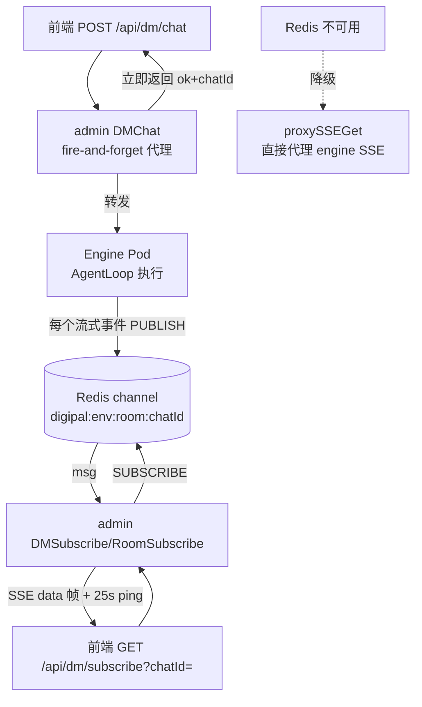

# 重点 15：SSE 流式代理三层工程——转发、保活与降级

> **一句话亮点（简历可直接用）**：设计并实现了生产级 SSE 流式代理体系：Redis PubSub 直连订阅 + engine SSE 降级代理双链路，通过 256KB 大缓冲防截断、逐帧透传 + Flush 保首 token 延迟、25s 应用层 ping 帧防 LB 断连、subscribed 哨兵 + 状态快照首帧解决订阅传播窗口丢事件四大工程手段，支撑数字员工对话流式体验 7×24 稳定运行。

## 为什么这是一个值得重点介绍的难点

LLM 对话产品的核心体验是"打字机效果"，技术上靠 SSE（Server-Sent Events）长连接。demo 里转发 SSE 只要十行代码，但生产环境的 SSE 代理会踩一串连环坑：

- **断连坑**：SSE 连接动辄存活几分钟到几十分钟，中间的负载均衡器（LB）、Nginx 都有 idle 超时（常见 60s），用户看着"AI 正在思考"几十秒没新字，连接就被中间层悄悄掐了；
- **缓冲坑**：Nginx 默认会缓冲上游响应攒够再发，打字机变成"整段蹦字"；Go 的 `bufio.Scanner` 默认 64KB 缓冲，遇到单行大 JSON（工具调用参数常几十 KB）直接报错断流；
- **丢事件坑**：Redis PubSub 是即发即弃的，SSE 连接建立和 Redis 订阅真正生效之间有个传播窗口，这期间发布的事件永久丢失——短任务可能整个结果都丢了；
- **依赖坑**：Redis 挂了，整个实时通道不能跟着挂，要有降级链路。

这些坑每一个单拎出来都不难，难的是**在一套代理里把它们全部兜住，且主链路保持轻量**。这就是本文的"三层工程"：第一层转发（怎么把流透传过去），第二层保活（怎么让连接活着），第三层降级（依赖故障时怎么继续服务）。

## 先备知识：本文涉及的术语与变量

| 术语/变量 | 含义与示例 |
|---|---|
| **SSE（Server-Sent Events）** | HTTP 长连接上的单向文本流协议。服务端响应头 `Content-Type: text/event-stream`，之后持续推送帧。数据帧形如 `data: {"type":"text_delta",...}\n\n`；以冒号开头的行（如 `: ping`）是注释帧，浏览器会忽略，常用于心跳。 |
| **EventSource** | 浏览器原生 SSE 客户端 API，自带断线自动重连（本项目前端固定约 60s 无消息即重连一次，属正常语义，代码注释见 `chat_handler.go:1708`）。 |
| **Redis PubSub** | Redis 的发布/订阅：`PUBLISH channel msg` 瞬时广播给当前所有订阅者，**无持久化、无回放**——发布时没人在线，消息就没了。 |
| **channel（频道名）** | 订阅的 key，本项目格式 `digipal:{环境}:room:{chatId}`，例：`digipal:prod:room:room-1718000000`。DM 会话复用同一 `room:` 前缀（`chat_handler.go:1601`），靠 `dm-` 开头的 chatId 天然区分。 |
| **subscribed 哨兵** | 一帧服务端主动写的 `data: {"type":"subscribed"}`，告诉前端"订阅通道已建好，可以发消息了"。 |
| **session_status_snapshot 首帧** | 哨兵之后立即推的一帧当前任务真实状态（idle/processing 等），解决"建立连接之前的状态变更事件已丢"的问题。 |
| **ping 帧** | 本项目每 25s 写一帧 `: ping\n\n` 注释帧，只为让连接上有字节流动，骗过中间层 idle 超时。 |
| **X-Accel-Buffering: no** | 响应头，告诉 Nginx"不要缓冲这个响应，来多少发多少"。 |
| **pubsub.Channel** | go-redis 把订阅包装成 Go channel 的方法；`WithChannelHealthCheckInterval(15s)` 让它每 15s 自动发 PING 保活底层 Redis 连接。 |
| **proxySSEGet** | 降级路径函数（`chat_handler.go:4027`）：Redis 不可用时，admin 改为直接 HTTP 代理 engine 自己的 SSE 接口。 |
| **sseClient** | 专用于 SSE 的 `http.Client`（`chat_handler.go:146-153`）：整体超时 `Timeout: 0`（SSE 连接不能设总超时），只设 5s 拨号超时防 Pod 不可达时死等。 |

## 技术剖析

### 整体架构：聊天请求与流式通道分离



关键架构决策是**聊天请求不再直接返回 SSE 流**：`POST /api/dm/chat` 是 fire-and-forget，只同步返回 `{"ok": true, "chatId": "..."}`（`chat_handler.go:392-398` 头注释），真正的流式事件全部由 engine 发布到 Redis，前端再建立 `GET /api/dm/subscribe` 长连接接收。这样的好处是：发消息和收消息解耦，HTTP 请求不再被长任务占住，刷新页面重连订阅即可恢复现场。

### 第一层：转发——大缓冲 + 逐帧透传 + Flush

订阅循环的核心（Room：`chat_handler.go:1180-1276`，DM：`chat_handler.go:1650-1703`，两者同构）是一个 `select` 三件套：Redis 消息到了就写 SSE 帧；25s 定时器到了就写 ping；ctx 结束（客户端断开）就退出。

写帧函数（`chat_handler.go:3883-3889`）：

```go
func writeSSEData(w gin.ResponseWriter, data string) error {
    if _, err := fmt.Fprintf(w, "data: %s\n\n", data); err != nil {
        return err
    }
    w.Flush()   // 每帧立即 flush，不攒批
    return nil
}
```

响应头四件套（`chat_handler.go:1133-1137`）：`text/event-stream`、`Cache-Control: no-cache`、`Connection: keep-alive`、**`X-Accel-Buffering: no`**——最后一个就是告诉 Nginx 别缓冲，没有这个头，所有逐 token 的努力都会在 Nginx 层被攒成整段。

模型网关路径（`model_handler.go:147-151`）还有特有的缓冲放大：`services.NewSSEScanner` 把 `bufio.Scanner` 缓冲扩到 256KB（`model_service.go:238-243`）。因为 SSE 按"行"扫描，而 LLM 流式 chunk 是单行大 JSON（一个工具调用参数就能几十 KB），默认 64KB 缓冲会触发 `token too long` 直接断流。这是用真实事故换来的数字。

### 第二层：保活——应用层 ping 帧 + 通道健康检查

```go
ticker := time.NewTicker(25 * time.Second)   // chat_handler.go:1168
...
case <-ticker.C:
    if err := writeSSEComment(c.Writer, "ping"); err != nil { ... return }
```

`writeSSEComment` 写出的 `: ping\n\n` 是 SSE 注释帧（`chat_handler.go:3939-3945`），浏览器 EventSource 直接忽略、不触发 onmessage，纯属"让连接上有字节流动"。25s 的取值是按中间层 idle 超时定的：LB/Nginx 常见 idle 超时是 60s，25s 一帧保证任何中间层视角里连接都在"活跃"，留出 2 倍以上余量。为什么不用 TCP keepalive？因为 TCP keepalive 默认 2 小时才探测一次，管不到应用层；为什么不用 WebSocket 的 ping/pong？因为我们就是 SSE（后文"为什么不用 WebSocket"详述）。

除了面向浏览器的 ping，还有面向 Redis 的保活：`pubsub.Channel(goredis.WithChannelHealthCheckInterval(15 * time.Second))`（`chat_handler.go:1165-1167`），go-redis 每 15s 向 Redis 服务端发 PING，防止 admin↔Redis 这条订阅连接被中间网络设备静默回收。

### 第三层：丢事件治理——subscribed 哨兵 + 快照首帧

Redis PubSub 即发即弃，存在两个丢失窗口：

1. **订阅传播窗口**：`Subscribe()` 调用是异步的，返回时 Redis 服务端可能还没完成订阅注册。这期间 engine PUBLISH 的消息因"0 个订阅者"直接蒸发。解法是发一帧 `{"type":"subscribed"}` 哨兵（`chat_handler.go:1143`）：前端收到它才认为通道就绪，此前不发消息；窗口期漏掉的早期事件由前端的 reconcile（对账重拉）机制兜底。
2. **连接建立前窗口**：SSE 建立**之前**发生的状态变更（比如一个 2 秒就完成的小任务，整个生命周期都在连接建立前）永远丢失。解法是哨兵之后立即推一帧 `session_status_snapshot`（`chat_handler.go:1149-1163` → `pushStatusSnapshot`，`chat_handler.go:3903-3936`）：从 Redis 快路径读当前任务真实 phase 推给前端。这里有个性能细节：该函数在 SSE 主循环之前执行，必须不能阻塞——所以只走 Redis fast path（`GetFastPath`，不做健康探测、不回查 DB），且加了 **200ms 局部超时**（`chat_handler.go:3910`），Redis 抖动时宁可跳过也不拖慢连接建立，前端还有 60s 兜底心跳接着。

### 第三层半：降级——Redis 不可用时的 HTTP 代理

订阅入口处先做依赖判断（`chat_handler.go:1084-1096`）：

```go
if h.redisClient == nil {
    target, mode, err := h.engineTargetByUser(c, "/aigc/pal/engine/room/subscribe")
    ...
    h.proxySSEGet(c, target)   // 降级：直接代理 engine 的 SSE
    return
}
```

`proxySSEGet`（`chat_handler.go:4027-4058`）用无总超时的 `sseClient` 请求 engine 自己的 SSE 接口，然后 `writeSSEResponse`（`chat_handler.go:3850-3880`）用 4KB buffer 原始字节流转发 + 每次 Flush——降级路径不做任何 JSON 解析，纯字节管道，逻辑越少越不容易在故障场景下再出故障。多一跳 HTTP 的代价（延迟略增、engine 承压）换"Redis 故障期间实时通道不中断"，是典型的 graceful degradation。

### 为什么不用 WebSocket

项目里其实有 WebSocket（`internal/ws/`，用于员工状态变更推送，`router.go` 注册 `/api/ws`），但聊天流式通道刻意选 SSE：

1. **语义匹配**：LLM 输出是天然的服务端→客户端单向流，SSE 就是为此设计的；WebSocket 的全双工能力用不上；
2. **基础设施友好**：SSE 就是 HTTP，LB、CDN、Nginx、鉴权网关全都当普通请求处理，不需要升级协议、不需要给中间层开 WebSocket 特例；
3. **自带重连**：EventSource 断线自动重连（带 Last-Event-ID 语义），WebSocket 要自己实现重连与状态恢复；
4. **实现成本低**：服务端就是"写文本 + Flush"，Go 任何 HTTP 框架都原生支持，没有帧协议编解码层。

代价是不能服务端-客户端双向通信——但聊天场景客户端动作（发消息、停止）走普通 POST 即可，不需要塞进同一条连接。

## 关键设计决策与权衡

1. **Redis 直连优先、HTTP 代理兜底**：直连 Redis 少一跳、少一个故障点（engine 挂不挂与订阅无关），但实现复杂度在 admin；降级路径保持"笨"（纯字节转发），保证最脆弱的时刻最不容易出错。
2. **ping 帧用注释帧而非数据帧**：`: ping` 不触发前端任何业务逻辑，不需要前端配合改造；代价是前端无法感知"服务端还活着"，但断连本身 EventSource 会自动重连，语义已够。
3. **快照首帧"尽力而为"**：200ms 超时 + fast path，宁可不推也不阻塞——首帧是优化项不是正确性依赖，正确性由前端 reconcile 和 60s 心跳兜底。
4. **聊天与订阅分离（fire-and-forget）**：POST 立即返回、流走订阅通道，让"重连"变成无副作用操作；代价是前端要管理两个请求的生命周期，用 subscribed 哨兵做同步点。

## 面试话术（怎么讲）

> 我们的对话流式通道是 SSE，我做了三层工程。转发层：聊天请求 fire-and-forget，engine 把流式事件发到 Redis PubSub，admin 直连订阅转 SSE，每帧 Flush、响应头禁 Nginx 缓冲、扫描缓冲扩到 256KB 防单行大 JSON 截断。保活层：25s 应用层 ping 注释帧骗过 LB 60s idle 超时，go-redis 15s 健康检查保住订阅连接。可靠性层：Redis 即发即弃有两个丢事件窗口，我用 subscribed 哨兵做前后端同步点，再补一帧 200ms 超时的状态快照首帧覆盖连接建立前的状态；Redis 故障时降级为直接 HTTP 代理 engine SSE，纯字节转发。选型上刻意用 SSE 不用 WebSocket，因为 LLM 输出是单向流，SSE 对 LB/网关零改造、EventSource 自带重连。

## 可能的追问及答案

**Q：25s ping 会不会造成无意义流量？**
A：每帧 `: ping\n\n` 共 8 字节，一个连接一天约 28KB，万级并发连接也就几百 MB/天，相比它保住的连接重建成本（TCP+TLS+鉴权+订阅重建）完全可以忽略。

**Q：Redis PubSub 无持久化，如果用户刷新页面，刷新期间的消息不就丢了吗？**
A：会丢，这是 PubSub 的固有语义。所以可靠性的最终防线不在通道而在"对账"：engine 侧所有消息同时持久化到会话 JSONL 文件，前端重连后通过历史接口 reconcile 补齐。SSE 通道只保证"在线时低延迟"，不保证"离线可回放"。要真回放需要换 Redis Stream 或消息队列，代价是复杂度和存储，对聊天场景不划算。

**Q：subscribed 哨兵为什么不直接等 Redis 确认订阅完成？**
A：go-redis 的 Subscribe 确认只能告诉 admin"我这个客户端订上了"，但哨兵的真正目的是让**前端**知道"通道端到端可用了"——它要穿越 SSE 写帧、网络、前端 EventSource 三个环节才算数，所以这个信号必须在应用层端到端传递，不能只停在 admin 进程内。

**Q：多实例部署下，用户 SSE 连到 admin 实例 A，engine 发消息跟实例有关系吗？**
A：没关系，这正是直连 Redis 的好处。engine 往 Redis PUBLISH，所有 admin 实例都能订到，用户连哪个实例都能收到；如果用 WebSocket 或内存转发，就得做 sticky session 或实例间转发，复杂度高得多。

**Q：如果重新设计，会改什么？**
A：会评估把事件通道从 PubSub 迁到 Redis Streams：用 XADD 持久化 + XREAD 按偏移消费，原生解决"刷新重连期间丢消息"和"晚加入者补历史"两个问题，可以省掉前端 reconcile 的复杂度。当前没做是因为历史协议已稳定，且 reconcile 机制够用。

## 事实边界

- 本文全部行号以 `application/` 目录现行代码（2026-07 快照）为准；旧快照（`digi-pal/`）中 sseClient 尚无 5s 拨号超时、订阅入口尚无 `authorizeReadChatID` 读权限校验（现行版在 `chat_handler.go:1080/1564`），均系后续加固；
- ping 帧只防"中间层 idle 断连"，不防"服务端进程挂掉"——后者靠 EventSource 自动重连到健康实例；
- session_status_snapshot 首帧是尽力而为优化（200ms 超时即放弃），不是状态可靠性的唯一依赖；
- Redis 降级代理路径（proxySSEGet）会多一跳 HTTP 且没有旁路指标采集能力，仅用于故障期过渡；
- 25s/15s/200ms/256KB 均为按线上中间层超时与真实消息大小调出的工程经验值，非理论推导。

## 简历亮点描述（可直接引用）

- 设计并实现 SSE 流式代理体系（Redis PubSub 直连 + engine HTTP 代理降级双链路），支撑数字员工对话流式通道高可用；
- 通过 256KB 扫描缓冲、逐帧 Flush、X-Accel-Buffering 禁缓冲、25s 应用层 ping 帧等手段，解决大行截断、代理缓冲、LB idle 断连三类线上真实故障；
- 设计 subscribed 哨兵 + 状态快照首帧机制，治理 Redis PubSub 订阅传播窗口与连接建立前窗口的丢事件问题。

## 代码依据

- `application/admin/internal/api/chat_handler.go:146-153`（sseClient 无总超时 + 5s 拨号超时）、`:392-398`（DMChat fire-and-forget 说明）、`:1073-1277`（RoomSubscribe 主循环）、`:1084-1096`（Redis 不可用降级判断）、`:1133-1137`（SSE 响应头四件套）、`:1143`（subscribed 哨兵）、`:1149-1163`（快照首帧调用）、`:1165-1168`（15s 通道健康检查 + 25s ticker）、`:1557-1731`（DMSubscribe）、`:1601`（DM 复用 room 频道前缀）、`:3850-3880`（writeSSEResponse 降级字节流 4KB buffer）、`:3883-3889`（writeSSEData + Flush）、`:3903-3936`（pushStatusSnapshot 200ms 超时）、`:3939-3945`（writeSSEComment ping）、`:4027-4058`（proxySSEGet 降级代理）
- `application/admin/internal/api/model_handler.go:147-179`（模型流式透传响应头 + 逐行 Flush）
- `application/admin/internal/services/model_service.go:238-243`（256KB SSE Scanner）
