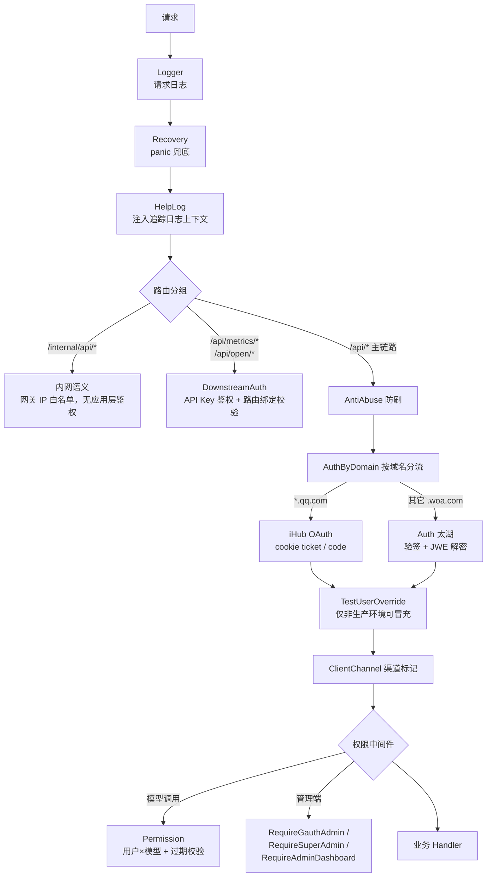

# 重点 16：企业级双鉴权与细粒度权限——JWE 网关身份、API Key 与分层授权

> **一句话亮点（简历可直接用）**：设计并落地了面向企业内部平台的鉴权体系：太湖智能网关 JWE 身份解密为主、iHub OAuth 按域名分流、下游 Agent API Key 独立通道的三轨鉴权架构，叠加"全局角色 → 管理员授权域 → 用户×模型"四层权限模型，并用 Gin 中间件链实现各层职责完全解耦；主链路鉴权纯本地解密微秒级完成，零外部调用。

## 为什么这是一个值得重点介绍的难点

企业内部 ToB 平台的鉴权和互联网 C 端完全不同：没有注册/登录页，身份来自公司 SSO 网关；同一个服务要同时承接**内网员工**（SSO 身份）、**公网入口**（OAuth）、**机器调用方**（Agent/脚本，没有浏览器，走不了任何登录跳转）三类调用者；权限上既要"谁能进系统"，又要"谁能用哪个模型"，还要"管理员能看哪个部门的数据"。

难点不在任何一种鉴权本身，而在**多轨鉴权在同一套路由体系里共存且不互相污染**：浏览器用户不能伪造机器身份，机器 Key 不能获得用户权限，测试环境能"冒充用户"联调但生产环境必须焊死这个口子，任何一环缺位就是越权事故。同时鉴权还是每个请求的第一跳，它的延迟直接加在所有接口上——所以主链路必须做到纯本地校验，不能每请求都调远端鉴权服务。

## 先备知识：本文涉及的术语与变量

| 术语/变量 | 含义与示例 |
|---|---|
| **太湖智能网关** | 公司内部统一接入网关。用户经它访问后端时，网关完成 OA 登录并把加密身份注入请求头转发给后端——后端不需要自己实现登录。 |
| **x-tai-identity** | 太湖网关注入的请求头，值是一段 **JWE** 密文，解密后得到 `{loginname, staffid, expiration}`，例：`{"loginname":"mattfang","staffid":123456}`。 |
| **JWE（JSON Web Encryption）** | 一种加密 token 格式（区别于只签名的 JWT）。本项目用 `dir + A256GCM`：网关与后端共享一把 32 字节对称密钥，网关加密身份、后端解密，内容对中间人不可读且不可篡改。 |
| **taiToken / tai_app_token** | 上面那把共享密钥（32 字节 ASCII），同时用于网关请求签名校验与 JWE 解密。 |
| **网关签名（signature）** | 防重放/防伪：`SHA256(timestamp + appToken + "x-rio-seq,,," + timestamp)` 大写，且 `timestamp` 与当前时间偏差须 ≤ 180s，证明请求确实经由网关新鲜转发。 |
| **login_name** | 全系统统一的用户标识（公司 RTX 英文名，如 `mattfang`），鉴权通过后由中间件 `c.Set("login_name", ...)` 注入 Gin 上下文，后续所有权限/审计/计费都以它为准。 |
| **iHub OAuth** | 公网入口（`*.qq.com` 域名）的鉴权方式：浏览器 cookie 里的 `ihub-Ticket` / `ihub-CTool-Ticket` 票据，或 OAuth 回调 code 换票。 |
| **API Key（下游 Key）** | 机器调用方的凭据，形如 `k_<前缀>_<主体>`。两种携带方式：`Authorization: Bearer k_xxx` 或 `X-Downstream-Token: k_xxx`。Key 绑定 service_id、允许访问的 agent 模式、模型范围、接口路由，可撤销。 |
| **GAuth** | 公司内部权限系统，管理"角色"：超级管理员（iRoleTypeID 1087）/管理员（1079）/开发者（1074）/产品（1084）（`internal/pkg/gauth/client.go:131-134`）。 |
| **admin_scopes（管理员授权域）** | 内部表，给"看板管理员"划定数据可见范围：按组织架构路径授权，深度 4=center 级、深度 5=group 级，该管理员只能看自己域内的数据。 |
| **permissions 表** | 用户×模型权限表，`{user_id, model_id, status, expires_at, granted_by}`。`expires_at` 为空表示永久，否则到期自动失效。 |
| **中间件链** | Gin 的请求处理管线：`Use()` 注册的中间件按序包裹 handler，任一环节 `Abort()` 即终止请求。 |

## 技术剖析

### 中间件链全景



全局三层（`router.go:240-242`）：`Logger → Recovery → HelpLog`，每个请求先进日志、再有 panic 兜底、再注入追踪上下文。主链路 `authenticated` 分组（`router.go:765-785`）再叠加 `AntiAbuse → AuthByDomain → TestUserOverride → ClientChannel`。

### 第一轨：太湖 JWE——无 Cookie 的企业 SSO

`Auth` 中间件（`middlewares/auth.go:24-70`）三步：

```go
// Step 1：x-tai-identity 头存在性
// Step 2：tai.CheckSignature(taiToken, timestamp, signature, rioSeq) 验网关签名
// Step 3：tai.DecryptIdentity(taiIdentity, []byte(taiToken))  JWE A256GCM 解密
c.Set("login_name", identity.LoginName)
c.Set("staff_id", fmt.Sprintf("%d", identity.StaffId))
```

设计的精妙处在于**后端零会话、零登录页、零外部调用**：身份验证完全是一次本地 SHA256 + 一次本地 AES-GCM 解密，不需要查库、不需要调远端鉴权服务，单请求鉴权开销在微秒级。安全性由三层保证：共享密钥不出服务端；签名带 180s 时间戳窗口（`internal/pkg/tai/identity.go:28`）防重放；JWE 内还有 Expiration 过期字段（解密后校验，允许 3 分钟时钟宽限，`identity.go:117-126`）。因为请求必然经过公司网关（直连后端的网络路径不存在），"伪造 x-tai-identity 头"等价于"攻破网关或偷到 32 字节密钥"，信任边界清晰。

### 按域名分流：AuthByDomain

同一套服务部署在内网（`aier.woa.com`，有太湖网关）和公网（`aier.qq.com`，无网关）两个入口。`AuthByDomain`（`middlewares/auth_by_domain.go:49-71`）按 Host 二选一：`.qq.com` 结尾走 iHub OAuth，其余走太湖。两个细节：

- **失败安全**：`ihubClient == nil` 时 qq.com 分支自动退化为太湖鉴权（`auth_by_domain.go:47-48` 注释 + `:65` 的判定顺序），宁可拒绝服务也不出现"该验没验"的放行；
- **为什么不做"先太湖失败再 iHub"的兜底**：按 Host 直接选定一条链路，语义清晰，也避免 qq.com 下每个请求都先做一次注定失败的太湖校验（文件头注释 L15-17）。

iHub 侧两个工程细节：OAuth code 兑换成功后会**回写 `ihub-Ticket` cookie**（域 `.qq.com`、24h 有效期、SameSite=None，`auth_by_domain.go:97-102`），让后续请求直接走 cookie ticket 路径，不必每个请求都带 code 换一次票；SameSite=None 是因为聊天分享预览页常被 iHub 浮窗以 iframe 嵌入，跨站上下文必须带得上 cookie。

### 第二轨：下游 API Key——机器调用方的独立身份体系

Agent、脚本这类调用方没有浏览器，走不了任何 SSO。它们走 `DownstreamAuth`（`middlewares/downstream_auth.go:42-98`）：从 `Authorization: Bearer` 或 `X-Downstream-Token` 取 Key，`Authenticate` 用"前缀索引 + SHA-256 哈希 + 常数时间比较"验证（`services/downstream/downstream_api_key_service.go:219-243`），通过后把 `service_id`、`agent_name_pattern`（允许访问哪些 bot）、`allowed_models`、`owner_rtx` 写入上下文。明文 Key 只在签发时完整展示一次，服务端只存 SHA-256 哈希。还有两个硬化设计：

1. **绑定接口校验**：Key 可以绑定到具体路由（`route_id`），开启 enforce 后命中路由与绑定路由不一致直接 403（`downstream_auth.go:74-83`）——一把"只能上报指标"的 Key 被偷了也读不了会话数据；
2. **高敏接口强制绑定**：`RequireDownstreamRouteBound`（`downstream_auth.go:105-132`）连历史"未绑定路由"的老 Key 也一律拒绝，用于会话捕获导出这类高敏只读接口，防止旧 Key 意外获得全站读取能力。

### 细粒度权限层之一：用户×模型（含过期时间）

模型调用路由 `/api/models/:model_name/*` 挂 `Permission` 中间件（`router.go:1351-1353` → `middlewares/permission.go:11-47`），最终落到一条 SQL（`repositories/permission_repo.go:21-33`）：

```go
Where("user_id = ? AND model_id = ? AND status = ?", userID, modelID, "active").
Where("(expires_at IS NULL OR expires_at > NOW())")
```

`permissions` 表 `(user_id, model_id)` 唯一索引（`models/permission.go:8-9`），同一用户对同一模型只有一条记录；`expires_at` 字段（`models/permission.go:11`）支持临时授权——比如给某员工开通两周的 Opus 试用，到期数据库层面自然失效，不需要定时任务清理。

### 细粒度权限层之二：管理员三级门禁

管理端不是"是管理员就全能看"，而是三级（均见 `router.go` 注册点）：

| 门禁 | 判定 | 典型用途 |
|---|---|---|
| `RequireGauthAdmin`（`gauth_admin.go:34-80`） | GAuth 管理员（1079）或超管（1087）角色，全局视野 | 链路追踪审计（`router.go:1651`）、模型故障开关（`router.go:1391`） |
| `RequireSuperAdmin`（`super_admin.go:25-64`） | GAuth 超管角色 | API Key 管理（`router.go:1760`）、授权域管理（`router.go:1786`） |
| `RequireAdminDashboard`（`admin_dashboard.go:34-96`） | 超管，或命中 `admin_scopes` 授权域 | 数据看板：只能看自己组织路径下的数据（`router.go:1538`） |

`admin_scopes` 授权域（`services/adminscope/admin_scope_service.go`）按组织架构路径授权：深度 4 为中心级、深度 5 为团队级，一个"中心看板管理员"登录后，看板查询自动按其 `Paths` 前缀收敛数据范围；`GetScope` 带 60s 进程内缓存（`admin_scope_service.go:60-89`），且会把"该用户作为静态名单 leader 的默认可视范围"合并进来（`applyLeaderDefaults`，深度 3 的 leader 直接等同超管视野）。另有 `RequirePlatformAdmin`（`platform_admin.go:35-74`）用"GAuth 超管 ∨ env 白名单"双通道（`auth_service.go:105-119`，env 白名单先行、GAuth 挂了也能进），专门保住排障只读能力。这就是"细粒度"的最后一层：**不仅控制能不能进，还控制进来后能看多宽**。

### 测试冒充的生产焊死

`TestUserOverride`（`middlewares/auth.go:86-102`）允许联调时用 `test-user` 头冒充任意用户。它的安全设计值得单独说：**双重 production 判定**——路由层按 `opts.Env != "production"` 决定是否启用（`router.go:782`），中间件内部再查一次 `GO_ENV != "production"`（`auth.go:87`），任一判定为生产则整段 no-op、绝不读该头。联调便利性与线上安全用"两道独立开关"兜底，而不是指望运维不填错配置。

## 关键设计决策与权衡

1. **鉴权按路由轨制而非全局优先级**：浏览器轨（太湖/iHub）与机器轨（API Key）挂在不同路由分组上，互不进入对方链路。好处是每条链路只有一种身份语义（`login_name` vs `owner_rtx`），代码不会出现"既像用户又像机器"的模糊态；代价是新路由要显式选轨。
2. **信任网关，但验证网关**：后端不自己验用户密码，但坚持验"这是网关发来的"（签名 + 时间戳 + 解密），把信任边界精确停在"网关与后端共享密钥"这一点上。
3. **权限校验放中间件不放 handler**：Permission、RequireXxx 全部在路由注册处声明，handler 拿到的就是已鉴权请求。职责分离让越权 bug 只能出现在中间件一处，便于审计。
4. **机器 Key 能力最小化**：Key 可绑 agent 范围、模型范围、接口路由三维，默认最小权限——比"一把 Key 全站通用"的常见做法多了一步管理成本，换来泄露时的爆炸半径收敛。

## 面试话术（怎么讲）

> 平台要同时承接三类调用者：内网员工、公网用户、机器 Agent，我设计了三轨鉴权。内网走太湖网关 JWE：后端本地验签加 AES-GCM 解密拿到身份，零外部调用微秒级完成；公网入口按域名分流到 iHub OAuth，且 iHub 客户端缺失时自动回退太湖，失败安全；机器调用走独立 API Key 体系，SHA-256 哈希存储、常数时间比较，Key 可绑定 agent 范围、模型范围和具体接口路由，泄露了爆炸半径也可控。权限是多层：GAuth 全局角色、超管门禁、admin_scopes 组织路径授权域控制看板数据宽度、用户×模型表控制模型调用且带 expires_at 临时授权。所有权限逻辑都在 Gin 中间件层声明式挂载，handler 不感知。联调用 test-user 头冒充用户，但中间件内部对 production 环境双重判定焊死这个口子。

## 可能的追问及答案

**Q：JWE 和 JWT 有什么区别？为什么用 JWE？**
A：JWT 默认只是签名（JWS），payload 是 Base64 明文，谁都能读出里面的用户身份；JWE 是加密，payload 对中间人不可读。身份头会经过网关到后端之间的网络路径，用 JWE 保证即使链路被旁路监听，也拿不到用户标识，同时密钥只有网关与后端持有，不可伪造。

**Q：如果太湖网关本身被攻破呢？**
A：那属于公司级基础设施事故，任何依赖 SSO 的系统都会受影响，不是应用层能防的。应用层能做的是缩小信任面：签名带 180s 时间戳窗口防重放，JWE 有 Expiration（解密后还带 3 分钟时钟宽限校验），密钥走配置中心而非代码库。

**Q：API Key 怎么存储，明文还是哈希？**
A：Key 只在创建时完整展示一次给用户，服务端只存 SHA-256 哈希；验证时前缀索引定位记录、常数时间比较防时序侧信道（`subtle.ConstantTimeCompare`），并异步记录 `last_used_at`（`TouchLastUsed`）便于审计和发现失窃 Key。撤销是即时的，下一次请求就 401。

**Q：用户×模型权限校验每个请求都查库，性能怎么保证？**
A：`permissions` 表 `(user_id, model_id)` 有唯一索引，单次查询是主键级开销；且模型调用本身的 LLM 耗时在秒级，权限查询的毫秒级开销占比可忽略。真正高热的路径（聊天 SSE）不走这个中间件。

**Q：如果重新设计，会改什么？**
A：会把权限判定从"查库"演进为"登录时签发能力票据（capability token）"：鉴权通过后一次性算出该用户的角色、授权域、模型权限，签进一个短时效票据，后续请求本地验票即可，进一步消除每请求查库，也让权限变更的生效语义（票据过期即收敛）更明确。

## 事实边界

- 本文全部行号以 `application/` 目录现行代码（2026-07 快照）为准；
- "三轨"是按路由分组的并列关系，不是同一路由上依次尝试三种方式（主 API 链路不接受 API Key，下游路由也不接受 JWE）；
- GAuth 角色判定依赖外部 GAuth 服务在线，`RequireGauthAdmin`/`RequireSuperAdmin` 查询失败返回 500 而非放行；`RequirePlatformAdmin` 则是 env 白名单先行，GAuth 故障时白名单人员仍可排障；
- `expires_at` 过期判定依赖数据库 `NOW()`，撤销（status=revoked）即时生效，但"到期"语义以库时间为准；
- TestUserOverride 仅在非 production 生效，属"路由参数 + GO_ENV 双重判定"而非"三重"；
- **已知隐患（诚实披露）**：模型路由的 `Permission` 中间件读取 gin context 的 `user_id`（int64）键（`middlewares/permission.go:20`），但现行鉴权链只注入 `login_name`/`staff_id` 字符串，全仓库无任何 `c.Set("user_id", ...)` 调用——按现状该中间件会 fail-closed 返回 401。由于生产主聊天链路（/api/dm/chat 等）不经过它，该隐患未造成事故；permissions 表与 repo 层 SQL 本身设计完整，属"中间件与身份体系演进脱节"的真实代码发现。

## 简历亮点描述（可直接引用）

- 设计企业级三轨鉴权体系（太湖 JWE SSO / iHub OAuth 域名分流 / 下游 API Key），主链路鉴权纯本地微秒级完成，机器 Key 支持 agent/模型/接口三维绑定收敛泄露爆炸半径；
- 落地多层细粒度权限模型：GAuth 角色 → 超管门禁 → admin_scopes 组织路径授权域 → 用户×模型（含 expires_at 临时授权），全部以 Gin 中间件声明式挂载；
- 设计联调冒充机制的生产环境双重焊死方案，兼顾联调效率与线上安全；排障通道采用 env 白名单 + GAuth 双通道，鉴权服务故障时仍保排障能力。

## 代码依据

- `application/admin/internal/api/router.go:240-242`（全局 Logger/Recovery/HelpLog）、`:765-785`（authenticated 组 AntiAbuse→AuthByDomain→TestUserOverride→ClientChannel）、`:1351-1353`（模型路由 Permission 中间件）、`:1391`（RequireGauthAdmin 管模型健康）、`:1651`（RequireGauthAdmin 管链路追踪）、`:1760/1786`（RequireSuperAdmin 管 API Key 与授权域）、`:1538`（RequireAdminDashboard 管看板）
- `application/admin/internal/api/middlewares/auth.go:24-70`（Auth 太湖 JWE 三步）、`:86-102`（TestUserOverride 双判定）
- `application/admin/internal/pkg/tai/identity.go:28`（180s 签名窗口）、`:44-63`（CheckSignature）、`:69-129`（DecryptIdentity JWE A256GCM + 3 分钟宽限）
- `application/admin/internal/api/middlewares/auth_by_domain.go:49-71`（按域名分流 + iHub 缺失回退）、`:97-102`（ihub-Ticket cookie 回写 SameSite=None）
- `application/admin/internal/api/middlewares/downstream_auth.go:42-98`（API Key 鉴权 + 路由绑定）、`:105-132`（RequireDownstreamRouteBound）
- `application/admin/internal/services/downstream/downstream_api_key_service.go:219-243`（Authenticate 哈希 + 常数时间比较）、`:257-264`（TouchLastUsed 异步）
- `application/admin/internal/api/middlewares/permission.go:11-47`、`application/admin/internal/repositories/permission_repo.go:21-33`（active + expires_at 校验）、`application/admin/internal/models/permission.go:6-16`（expires_at 字段与唯一索引）
- `application/admin/internal/api/middlewares/gauth_admin.go:34-80`（RequireGauthAdmin）、`application/admin/internal/api/middlewares/super_admin.go:25-64`（RequireSuperAdmin）、`application/admin/internal/api/middlewares/admin_dashboard.go:34-96`（RequireAdminDashboard）、`application/admin/internal/api/middlewares/platform_admin.go:35-74`（RequirePlatformAdmin）
- `application/admin/internal/services/auth_service.go:105-119`（IsPlatformPrivileged env 白名单先行）、`application/admin/internal/services/adminscope/admin_scope_service.go:60-128`（GetScope 60s 缓存与多源合并）
- `application/admin/internal/pkg/gauth/client.go:131-134`（GAuth 角色 ID 常量）
