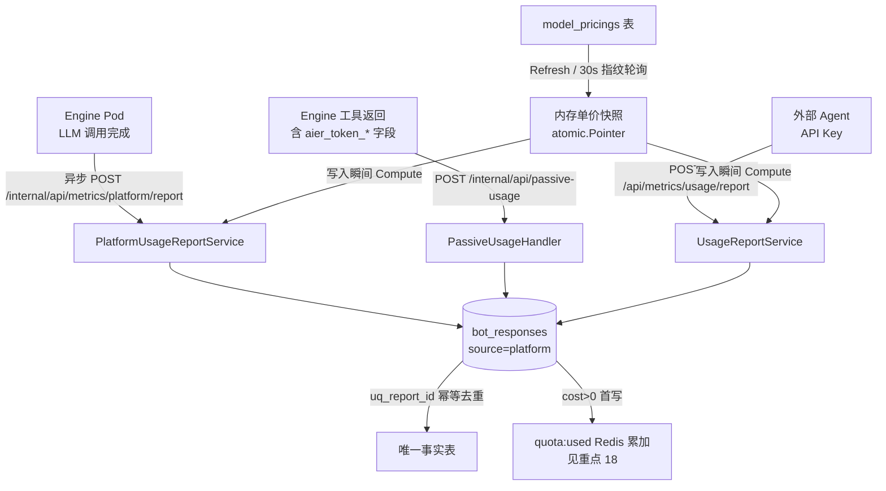

# 重点 17：计量计费——usage 三通道汇聚与成本快照固化

> **一句话亮点（简历可直接用）**：设计了 LLM 计量计费体系：platform（engine 直调上报）/ passive（工具返回被动解析）/ downstream（外部 Agent API Key 上报）三通道统一汇聚到 bot_responses 事实表，基于 model_pricings 单价内存快照在写入瞬间完成成本固化（DECIMAL(12,6) USD），并用"inflated prompt_tokens 归一化"公式消除 cache 段双算，与上游厂商账单口径 1:1 对齐（修复前实测偏差 2.35 倍）。

## 为什么这是一个值得重点介绍的难点

"算钱"在 LLM 平台里是个容易被低估的工程问题。表面上就是 `token 数 × 单价`，但真实场景有三个结构性难点：

1. **数据来源是异构的**：平台自己的数字员工（engine 内部 LLM 调用）、员工调工具时下游系统消耗的 token、以及外部合作方 Agent 的主动上报，三条链路的协议、鉴权、到达时机完全不同，但财务视角必须是**同一张账**；
2. **单价是会变的**：厂商调价、内部补贴价调整是常态。如果"查账时按当前单价算"，历史账单会随单价调整悄悄变化——财务上不可接受，审计会爆炸；
3. **token 口径有坑**：上游返回的 `prompt_tokens` 是"虚胖"值（包含了 cache 读/写部分），直接乘单价会对 cache 段**双重计费**，实测线上偏差达 2.35 倍。

这套体系的难点就在于：三个通道要幂等汇聚、单价要以快照而非引用方式参与、计算口径要和厂商真实账单对齐。

## 先备知识：本文涉及的术语与变量

| 术语/变量 | 含义与示例 |
|---|---|
| **bot_responses** | 计量事实表，一行 = 一次 bot 推理回复的计量记录。关键字段：`prompt_tokens`、`completion_tokens`、`cache_read/write_tokens`、`model_name`、`cost`、`cost_status`、`source`、`report_id`、`sender_id`（`models/bot_response.go:62-104`）。 |
| **source 三通道** | `bot_responses.source` 字段区分来源：`platform`=平台内部（engine）LLM 调用；`downstream`=下游 Agent 上报。被动上报复用 `downstream` 通道。 |
| **platform 通道** | engine 完成一次 LLM 调用后，异步直调 `POST /internal/api/metrics/platform/report` 上报 usage，由 `PlatformUsageReportService` 落库。 |
| **passive 通道** | engine 调用工具后，从**工具返回字段**里解析下游消耗的 token（`aier_token_total` 等），上报 `POST /internal/api/passive-usage`。是"被动"获得的，下游无感知。 |
| **downstream 通道** | 外部 Agent 用 API Key 主动调 `POST /api/metrics/usage/report` 上报自己的 LLM 消耗，由 `UsageReportService` 落库。 |
| **report_id** | 幂等键，如 `{chat_id}-{bot_id}-{message_id}`。`bot_responses` 上有唯一索引 `uq_report_id`，重复上报在 DB 层去重，返回 `existed=true` 不算错误。 |
| **model_pricings** | 单价表，一行一个标准模型：`canonical_model_id`、`aliases`（历史别名）、`input_per_1m`、`output_per_1m`、`cached_input_per_1m`、`cache_write_per_1m`，单位 USD/百万 token（`models/model_pricing.go:72-89`）。 |
| **canonical_model_id** | 标准模型名，与上游 `/v1/models` 暴露的 id 对齐，如 `claude-opus-4-6`。 |
| **AliasResolver** | 别名解析器（`services/pricing/alias_resolver.go`）：把 `claude-4-6-opus`、`claude_opus_4_6` 这类历史/变体写法归一化到 canonical id，保证"换了个名字"不会漏计费。 |
| **cost / cost_status** | 固化成本（DECIMAL(12,6) USD）与其口径标记：`priced`（成功计费）/`unpriceable_no_model`（缺模型名）/`unpriceable_unknown_model`（单价表查不到）/`error_zero`（错误且 0 token，记 0 元）/`pending`（计算器未注入，待回填）（`models/model_pricing.go:117-123`）。 |
| **inflated prompt_tokens** | 上游（LiteLLM/OpenAI 风格）返回的 `prompt_tokens` = 真实新输入 + cache_read + cache_write，是"虚胖"的。直接用它乘 input 单价会对 cache 段双算。 |
| **UsageBreakdown** | 计费入参结构 `{Input, Output, CacheRead, CacheWrite}`（`pricing/model_pricing_service.go:44-49`）。 |

## 技术剖析

### 三通道汇聚架构



三条通道的差异化设计：

- **platform**（`platform_usage_report_service.go:165-252`）：走 `/internal/api/*` 内网前缀，由网关 IP 白名单保护，不做应用层 Token 鉴权（`router.go:302-313` 注释说明），幂等靠 `report_id`；
- **passive**（`api/passive/passive_usage_handler.go:7-9` 头注）：同样内网前缀，鉴权下沉到业务层——按 `bot_id` 查 `employees.passive_report_enabled`，员工未开启被动上报直接 403 丢弃（`passive_usage_handler.go:122-126`）；
- **downstream**（`router.go:595-597`）：走 API Key 鉴权（见重点 16），Key 的 `agent_name_pattern` 还会与上报的下游 Agent 名做二次校验。

殊途同归：三条链路最终都构造 `BotResponse` 实体，走 `CreateOrGetByReportID` 幂等落库（`repositories/bot_response_repo.go:42-63`，先插后查的幂等实现：Create 撞上唯一索引再 SELECT 回老行，返回 `existed=true`）。

### 单价快照：写时固化，不回头看

计费的核心时序是"**在记录首次写入的瞬间，按当时单价算出 cost 一并落库**"（`platform_usage_report_service.go:198-219`）：

```go
// cost snapshot：在首次写入瞬间按当前单价固化。
if in.IsError && rec.TotalTokens == 0 {
    rec.Cost = &zero; rec.CostStatus = &errorZero
} else if s.costComp != nil {
    res := s.costComp.Compute(rec.ModelName, pricing.UsageBreakdown{...})
    rec.Cost = res.Cost
    rec.CostStatus = &res.Status
}
```

为什么用快照而不是"查账时实时 join 单价表"：假设 3 月单价是 \$5/1M，4 月厂商降到 \$3/1M。如果账单是查询时计算的，3 月的历史账单在 4 月会"变便宜"——财务对账永远对不上。**cost 一旦写入就不再变**，单价调整只影响之后的新记录。这也是 `models/model_pricing.go:7-8` 头注释明确写的不变量："runtime 写入 bot_responses.cost 时按当时单价固化，单价后续变更不影响历史"。

快照的工程实现：`ModelPricingService` 把整张单价表加载进内存，存 `atomic.Pointer[pricingSnapshot]`（`model_pricing_service.go:69,98-113`），Compute 是 O(1) map 查表，**计费热路径零 DB 查询**。写操作（超管改价）后 `refreshAsync` 重建快照；多 Pod 部署下其他实例靠 `StartAutoRefresh` 每 30s 轮询变更指纹 `(COUNT(*), MAX(updated_at))`（`model_pricing_service.go:264-320`）感知变化——指纹不变就跳过，一次轻量查询换一个 30 秒内的全网最终一致。

### 双算陷阱：inflated prompt_tokens 归一化

计费公式（`model_pricing_service.go:188-207`）：

```go
rawInput := u.Input - u.CacheRead - u.CacheWrite
if rawInput < 0 { rawInput = 0 }
cost = rawInput*input_per_1m + output*output_per_1m
     + cacheRead*cached_input_per_1m + cacheWrite*cache_write_per_1m  (均 /1M)
```

关键就在第一行：上游返回的 `prompt_tokens` 包含 cache 部分，而 cache_read/cache_write 有**独立的、低得多的单价**（如 Claude Opus input \$5 vs cache read \$0.50）。若不减去，cache 段先按 input 全价算一遍、又按 cache 单价算一遍——实测线上一次 Opus 调用算出 \$0.79，而厂商真实账单是 \$0.34，**2.35 倍偏差**（`model_pricing_service.go:151-154` 注释记录的实测数据）。归一化后与 Anthropic/Bedrock/Vertex/Azure/OpenAI 五家官方账单口径 1:1 对齐。对不上账的计费系统比没有计费系统更糟。

### 失败口径与 model_name 兜底

计费系统还做了三件"防漏账"的事：

1. **cost_status 枚举**（`models/model_pricing.go:117-123`）：不能计费的记录也不是"沉默的 NULL"，而是显式打标原因——缺模型名、单价表查不到、错误 0 token，各有专属状态，巡检和回填脚本按状态分类处理，账务无死角；
2. **model_name 兜底**（`platform_usage_report_service.go:185-195`）：engine 流式路径偶发漏传 model_name，会导致整笔无法计费。兜底逻辑按 bot_id 回查员工当前配置模型补齐——"宁可按配置模型计，绝不让 token 白烧"；
3. **下游自报 cost 的尊重与防范**（`usage_report_service.go:155-180`）：downstream 通道的 cost 优先级是 `error_zero > 上游显式传入 cost > 平台单价重算 > pending`——自治 Agent 自带 USD 估值时尊重其上报，否则一律按平台同款单价表重算，避免"下游自报 cost=0"绕过计费。

## 关键设计决策与权衡

1. **快照固化而非实时引用**：财务正确性优先。代价是单价表修改不影响历史（这正是目的），历史错账要修正只能走专门的回填脚本，流程重但语义干净。
2. **三通道同表而非分表**：一张事实表 + source 区分，财务查询一处搞定；代价是表字段要兼容三路的最宽协议（downstream_agent 等可空列）。
3. **幂等下沉到 DB 唯一索引**：`uq_report_id` 兜底，应用层 `CreateOrGetByReportID` 天然幂等，engine 网络重试、超时重发都不会重账——**计费系统的重试安全性必须是结构性的，不能靠调用方自觉**。
4. **计费失败不阻断主链路**：cost 计算器未注入时降级为 `pending`，usage 落库照常（`platform_usage_report_service.go:216-219`）。聊天是业务，计费是旁路，绝不能因为算不出钱让用户聊不了天。

## 面试话术（怎么讲）

> 我设计了平台的 LLM 计量计费体系。三条来源不同的通道——engine 直调上报、工具返回字段的被动解析、外部 Agent 的 API Key 上报——统一汇聚到 bot_responses 事实表，用 report_id 唯一索引做 DB 层幂等，网络重试不会重账。成本在记录首次写入瞬间按内存单价快照固化，单价调整不影响历史账单，保证财务可对账。计费热路径是 atomic 指针指向的内存 map，零 DB 查询，多实例靠 30 秒指纹轮询最终一致。最大的一个坑是上游 prompt_tokens 是含 cache 的虚胖值，直接乘单价会对 cache 段双算，实测偏差 2.35 倍，我做了 raw_input 归一化与五家厂商账单口径对齐。另外不能计费的记录全部显式打 cost_status 标记，模型名缺失按员工配置兜底，账务不留灰色地带。

## 可能的追问及答案

**Q：三通道会不会重复记账？比如一次调用既走了 platform 又被 passive 解析到？**
A：不会。platform 记录的是"engine 自己的 LLM 调用"，passive/downstream 记录的是"这次调用中工具下游消耗的 token"，记账主体不同（bot_id vs downstream_agent）。同通道内的重复靠 report_id 唯一索引；跨通道在指标查询侧按 source + 维度区分汇总，口径文档（`doc/31-数字员工可选模型计费说明.md`）有明确定义。

**Q：单价快照期间改价，正在进行的会话会怎么算？**
A：每条 bot_response 写入时取当时的快照，同一会话内不同消息可能按不同单价计费——这是正确语义：计费单价应该对齐"消费发生时刻"的价格，就像股票按成交时刻计价。

**Q：缓存 token 的单价从哪来，上游不返回怎么办？**
A：单价由超管在管理端按厂商刊例维护。缺价的项按 0 计入（`computeCost` 的 `add` 函数对 nil 单价返回 0），缺一项不会把整次调用判为不可计费——这是刻意的宽松策略，宁可少算不可不算。另外管理端还有上游 `/v1/models` diff/sync 工具（`model_pricing_service.go:373-448`），能发现"上游有、单价表无"的新模型并按 0 价占位入库，提醒超管补价。

**Q：为什么 passive 通道不需要 API Key？**
A：它挂在 `/internal/api/*` 前缀下，网络层只有内网可达（网关 IP 白名单），伪造请求需要先进入内网。业务层再加一道 `passive_report_enabled` 开关按员工粒度放行，两道防线对内网场景足够；加 API Key 反而增加 engine 部署的配置负担。

**Q：如果重新设计，会改什么？**
A：会把"写入瞬间固化"演进为"事件溯源 + 物化快照"：usage 事件先进 append-only 日志，cost 由独立计费 worker 按事件时间戳对应的价格版本计算，这样单价表的每次变更也有版本历史，错账重算不需要专门的回填脚本，系统自己就能重演任意时点的账单。

## 事实边界

- 本文全部行号以 `application/` 目录现行代码（2026-07 快照）为准；早期 `digi-pal/` 快照**没有** pricing 模块，platform 上报不写 cost，downstream 通道仅透传上游自报 cost——"写时固化 + 单价快照"是后续版本（V052 前后）才补齐的能力；
- cost 是**估算口径**（`doc/31` 声明"最终费用以厂商/平台实际账单为准"），用于内部额度管控与成本看板，不用于对外结算；
- 汇率层面内部统一 USD 存储，看板按固定汇率（默认 1 USD = 7 RMB，可在全局参数调整）换算展示，详见重点 18；
- passive 通道的 token 数依赖下游工具在返回中如实填写 `aier_token_*` 字段，属于协议信任，无法校验其真实性；
- 30s 指纹轮询意味着跨实例价格生效最坏有 30s 窗口，改价瞬间的少量记录可能按旧价固化；
- 参考文档称"幂等靠 DB 唯一索引"，实测实现为"先 Create、撞唯一索引后 SELECT 回老行"（`bot_response_repo.go:52-62`），语义等价但非 INSERT IGNORE。

## 简历亮点描述（可直接引用）

- 设计 LLM 计量计费体系，platform/passive/downstream 三通道异构来源统一汇聚事实表，report_id 唯一索引实现 DB 层幂等，重试零重账；
- 实现单价内存快照 + 写时成本固化机制，计费热路径零 DB 查询，价格调整不影响历史账单，多实例 30s 指纹轮询最终一致；
- 发现并修复 inflated prompt_tokens 导致的 cache 段双算问题（实测偏差 2.35 倍），计费口径与 Anthropic/Bedrock/OpenAI 等五家厂商账单 1:1 对齐。

## 代码依据

- `application/admin/internal/services/platform_usage_report_service.go:165-252`（Report 主流程）、`:185-195`（model_name 兜底）、`:198-219`（cost 快照固化）、`:226-228`（quota 累加钩子）、`:291-318`（入参校验 hard gate）
- `application/admin/internal/services/downstream/usage_report_service.go:82-96`（下游通道 V052 设计与降级原则）、`:128-201`（Report + cost 优先级 switch）、`:155-180`（error_zero/自报 cost/重算/pending 四分支）、`:191-193`（quota 钩子）
- `application/admin/internal/api/passive/passive_usage_handler.go:7-9`（内网 + 业务级鉴权语义）、`:122-126`（passive_report_enabled 开关 hard gate）
- `application/admin/internal/services/pricing/model_pricing_service.go:44-49`（UsageBreakdown）、`:158-178`（Compute）、`:188-207`（computeCost 归一化公式）、`:98-113`（Refresh 内存快照）、`:264-320`（StartAutoRefresh 指纹轮询）、`:151-154`（2.35 倍偏差实测注释）、`:373-448`（上游 diff/sync 工具）
- `application/admin/internal/models/bot_response.go:62-104`（事实表结构与 cost/cost_status 列）、`application/admin/internal/models/model_pricing.go:72-89`（单价表）、`:117-123`（cost_status 枚举）、`:7-8`（快照不变量注释）
- `application/admin/internal/repositories/bot_response_repo.go:42-63`（CreateOrGetByReportID 幂等实现）
- `application/admin/internal/api/router.go:302-313`（platform 内网上报路由）、`:595-597`（downstream API Key 路由）
- `application/admin/internal/repositories/chat_session_repo.go:244`（IncrTokens 原子 SQL 累加）
