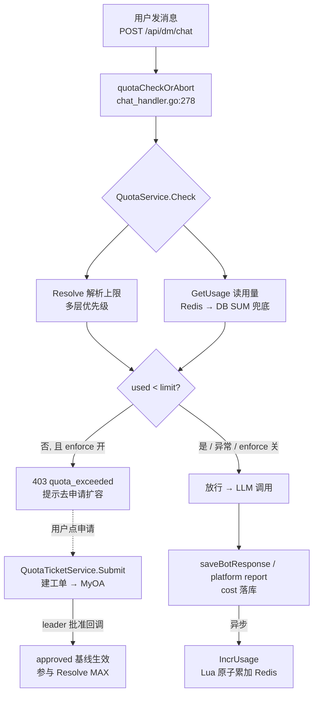

# 重点 18：额度管控——多层覆盖 quota 体系与 Redis Lua 原子累加

> **一句话亮点（简历可直接用）**：设计并实现了用户月度额度管控体系：leader 豁免 → 个人覆盖（与审批基线取 MAX）→ 部门多级覆盖 → 全局兜底的优先级解析，Redis Lua 脚本保证"存在才累加 / 不存在 SET-NX-or-GET"的原子性防并发超扣，配合 10s 内存快照 + singleflight 防击穿，以及 MyOA 审批工单自助扩容闭环，入口拦截失败永远 fail-open 保主链路。

## 为什么这是一个值得重点介绍的难点

给全公司员工开放 LLM 调用，成本管控是刚需：每人每月一个默认额度，超了要拦，不够要能申请加。听上去是"查一下余额、超了就拒"的简单逻辑，但工程上有四个真实难点：

1. **额度来源是多层的**：超管可以配全局默认值、给某部门单独配、给某个人单独配；用户还能走审批工单自助扩容。这些来源冲突时听谁的？我们的答案演进过四个版本（V049~V052），每一版都是被真实 case 打出来的；
2. **并发超扣**：额度判断是"读用量 → 比对 → 放行 → 累加用量"，高并发下裸写 Redis 会出现"两个请求同时读到余额充足都放行"或"累加覆盖丢增量"，必须用原子操作把竞态钉死；
3. **性能**：每次 LLM 调用前都要查额度，如果每次都打 DB 全量 SUM，DB 必挂；但缓存又带来"管理员改了额度多久生效"的一致性问题；
4. **可用性悖论**：额度系统是管控组件，但它自己故障时怎么办？答案是 **fail-open**——宁可放行也不能因为额度系统抖动让全公司聊不了天，这与直觉相反但符合业务优先级。

## 先备知识：本文涉及的术语与变量

| 术语/变量 | 含义与示例 |
|---|---|
| **quota / 额度** | 一个用户一个自然月可消耗的 LLM 成本上限，展示口径为人民币（RMB），如默认 3000 元/月。存储与计算域是 USD，出口处乘汇率换算。 |
| **quota_configs** | 额度配置表，三种作用域（`scope_type`）：`global`（全局默认）、`dept`（部门）、`user`（个人）。`scope_key` 分别是 `*`、部门路径、RTX。 |
| **quota_settings** | 系统参数 KV 表，如 `default_monthly_limit_usd`（全局默认，fallback 3000）、`max_expand_step_usd`（单次扩容固定增量，默认 1000）、`personal_quota_cap_usd`（个人绝对上限，默认 10000）、`usd_to_cny_rate`（汇率，默认 7.0）。注：列名带 `_usd` 后缀是历史兼容，V050 起 limit 类值语义为 RMB（`quota_service.go:52-77`）。 |
| **override（覆盖）** | 管理员对某 scope 的显式配置，如"给 mattfang 配 8000 元/月"就是一条 user override。 |
| **approved_baseline（审批基线）** | 用户历史所有"已批准"扩容工单中 `requested_limit` 的最大值，独立于 override 存在——管理员临时调低 override 不会影响已经审批生效的额度。 |
| **quota:used:<rtx>:<YYYYMM>** | Redis 用量 key，如 `quota:used:mattfang:202607`，值是该月累计 USD 成本（由 bot_responses.cost 写入后增量累加）。TTL 钉到次月 2 日 0 点，月内绝不淘汰。 |
| **Resolve** | 额度解析函数（`quota_service.go:372`）：输入 RTX，输出 `{Limit, IsUnlimited, Source}`——这个用户本月上限是多少、从哪层配置来的。 |
| **GetUsage** | 用量查询（`quota_service.go:528`）：Redis 命中直接读，miss 则 DB `SUM(cost)` 兜底并回写 Redis。返回 RMB。 |
| **IncrUsage** | 用量累加（`quota_service.go:578`）：每写完一条带 cost 的 bot_response，异步把 cost 增量加进 Redis。 |
| **singleflight** | Go 并发原语：N 个协程同时请求同一个 key 时，只有 1 个真正执行，其余等结果。用于防缓存击穿。 |
| **enforce 灰度开关** | `atomic.Bool`（`quota_service.go:203`）：false 时入口只观测不拦截，true 才真正 403。新管控上线的标准姿势——先影子运行看数据，再开闸。 |
| **MyOA** | 公司 OA 审批系统。扩容申请提交后在 MyOA 建工单（流程名 `DigiPal/QuotaApply`），leader 在 OA 里审批，回调按流程名分发回 admin。 |
| **deptFull** | 用户的完整组织路径，如 `IEG互动娱乐事业群/IEG公共技术线/用户增值部/智能工具与效率服务团队`，路径深度（Depth）用于 leader 层级判定。 |

## 技术剖析

### 整体链路



### 额度解析：四层优先级（V052 现行版）

`Resolve`（`quota_service.go:372-453`）自上而下、命中即停：

1. **leader 豁免**：顶层 leader（用户增值部负责人）或倒数第二级（Depth==4）团队负责人 → 无限额度。逻辑依据是组织树 `orgtree.PathsLedBy(rtx)` 动态推导（`quota_service.go:385-410`），不是硬编码名单（顶层 leader 除外）；
2. **个人层**：`user_override` 与 `approved_baseline` **取 MAX**——这是 V052 的关键修正：早期版本 user_override 绝对优先，结果出现"用户审批涨到 8000，超管旧的 5000 override 把它截断回 5000"的 bug。现在两者谁大听谁的（`quota_service.go:418-427`）；
3. **强覆盖层**：沿 deptFull 自下而上收集所有 dept override + 审批基线，任一存在即屏蔽兜底层，多候选取 MAX（`collectStrongCandidates`，`quota_service.go:470-485`）；
4. **兜底层**：外包身份 → `external_monthly_limit`（默认 3000）；否则 global override 或 `default_monthly_limit`（默认 3000）。

这个分层的历史演进（`quota_service.go:366-371` 注释完整记录）本身就是最好的设计课：V049"全部取 MAX"让管理员失去下压能力；V050"user 绝对优先"导致全局参数反向拉高部门额度；V051 三层模型；V052 修正 override 截断审批单。**优先级合并策略没有理论最优解，只有被真实管理诉求打磨出来的解**。

### Redis Lua 原子累加：防并发超扣的核心

用量累加有两个竞态场景，分别用一段 Lua 在 Redis 服务端原子解决：

**场景一：IncrUsage 累加时 key 不存在**（`luaIncrIfExists`，`quota_service.go:87-93`）：

```lua
local exists = redis.call('EXISTS', KEYS[1])
if exists == 0 then return 0 end        -- key 不存在就跳过
redis.call('INCRBYFLOAT', KEYS[1], ARGV[1])
redis.call('EXPIREAT', KEYS[1], ARGV[2])
return 1
```

为什么不能"不存在就 SET"：key 不存在说明 baseline 还没懒加载（本月的 DB SUM 尚未回写进 Redis），此刻凭空创建一个只含本次增量的 key，后续 GetUsage 命中它读到的就是**严重偏低的用量**——用户等于被"刷新"了额度。所以宁可跳过，把完整账留给下一次 GetUsage 用 DB SUM 全量重建（届时已包含本次 cost，因为 IncrUsage 约定必须在 DB 落盘之后调用，`quota_service.go:573`）。

**场景二：GetUsage miss 回写 baseline 时的并发覆盖**（`luaSetNXOrGet`，`quota_service.go:101-107`）：

```lua
local cur = redis.call('GET', KEYS[1])
if cur then return cur end              -- 已存在就返回现值
redis.call('SET', KEYS[1], ARGV[1])     -- 不存在才写 baseline
redis.call('EXPIREAT', KEYS[1], ARGV[2])
return ARGV[1]
```

两个请求同时 miss、同时算出 DB SUM、同时回写——裸 SET 会后写覆盖先写，把其间别的 IncrUsage 增量冲掉。SET-NX-or-GET 原子化后只有第一个写入生效，后来者直接拿现值，与并发 IncrUsage 协作零丢失。两段 Lua 的分工哲学是：**把"幂等的写入决策"放在 Redis 服务端原子执行，多实例并发 race 从结构上不存在**（`quota_service.go:79` 注释原话）。

### 读路径性能：内存快照 + singleflight + 10s TTL

每次 LLM 调用前的 Check 绝不能打 DB。方案（`quota_service.go:318-350`）：

- 全量 `quota_configs`/`quota_settings`/审批基线加载为**不可变内存快照**（`quotaSnap`，`quota_service.go:157-173`），存 `atomic.Pointer`，读路径仅 atomic load 不加锁，Resolve 单用户是 map O(1) 查询；
- 快照 TTL 10s（`configCacheTTL`，`quota_service.go:76`）：管理员改额度最坏 10s 全网生效，写路径成功后会立即调 `Refresh()` 主动失效（`quota_service.go:260-268`）；
- 过期重建用 **singleflight** 收敛（`quota_service.go:264`）：100 个并发请求同时发现快照过期，只有 1 个协程真正打 DB，其余 99 个等它的结果——DB 压力与流量洪峰解耦；
- 刷新失败降级用旧快照（`quota_service.go:328-330`），DB 抖动不影响主链路。

### 入口拦截：fail-open 的灰度闸门

聊天入口的拦截（`chat_handler.go:278-312`，DM 挂载点 `:467-469`、Room 挂载点 `:958-960`）体现"管控组件不绑架业务"：

- `enforce=false`（灰度未开）→ 无条件放行，数据照常带回供观测（`quota_service.go:632-635`）；
- Resolve/GetUsage 任何异常 → warn 日志 + **放行**（`quota_service.go:610-629` 的 Check 把所有错误吞掉记日志）；
- 拦截本身带 2s 超时（`chat_handler.go:285`），quota 链路慢不能拖住用户消息；
- 真超额才 403，响应里带 `limit`/`used` 具体数值和引导文案（"请前往个人中心 → 额度管理申请扩容"，`chat_handler.go:303-310`）。

### 自助扩容闭环：MyOA 审批工单

用户超额后点"申请扩容"→ `QuotaTicketService.Submit`（`quota_ticket_service.go:97-194`）：校验当前额度与申请目标（单次增量固定 +N，个人总额不超 cap——"加速度 + 终点站"设计，防自助路径被滥用拉到很高数值，`quota_ticket_service.go:123-139`）→ 解析审批人（所在部门 Depth==4 的 leader，自审自批拒绝，`:275-300`）→ 入库 pending → MyOA 建工单（流程名 `DigiPal/QuotaApply`，`:38`）→ 企微通知审批人。批准后**不写 user_override**，而是形成独立的 approved_baseline 参与 Resolve 的 MAX 比较（`quota_ticket_service.go:8-12` 头注）——审批通道与超管手动通道完全隔离，杜绝"再次申请覆盖超管破例"类 bug。另外 Web 端审批与 MyOA 回调两条决议路径之间用 `TransitionFromPending` 状态守卫防"双批"（`quota_ticket_service.go:494-501/579-591`）：谁先推进到终态谁生效，后来者只留审计 payload。

## 关键设计决策与权衡

1. **USD 存储 / RMB 展示分离**：Redis 与 DB 统一存 USD 原值，汇率换算集中在 GetUsage 出口（`quota_service.go:538-543`）。超管改汇率下一次查询立即生效，无需清 Redis、无需回写历史。
2. **拦截 fail-open 而非 fail-closed**：额度是成本管控，不是安全边界。管控系统故障时阻断业务，等于把一个辅助系统的可用性绑架到公司级业务上——放行超扣的损失可事后补算，业务中断的损失不可逆。
3. **Lua 原子化而非分布式锁**：累加与回写都用服务端 Lua 脚本一次性完成，比"GET → 判断 → SET"的客户端事务或分布式锁简单且无线程安全问题；代价是逻辑拆成两段脚本，需要仔细论证两脚本间的协作不变量。
4. **审批基线与 override 解耦**：两条通道各自独立、Resolve 时取 MAX，避免了单一配置项被两类写入者互相覆盖的整个 bug 类别。

## 面试话术（怎么讲）

> 我给平台设计了用户月度额度管控。额度解析是多层优先级：leader 豁免、个人覆盖与审批基线取 MAX、部门多级覆盖、全局兜底，这套合并策略演进过四版，每一版都是被真实管理 case 驱动的。用量侧，cost 落库后异步累加 Redis 月度 key，我用两段 Lua 脚本把累加和 baseline 回写原子化——"存在才累加"防止凭空建 key 导致用量偏低，"SET-NX-or-GET"防并发 miss 覆盖丢增量，从结构上消除多实例超扣。读路径是 10s 内存快照加 singleflight，LLM 入口校验零 DB。入口拦截刻意 fail-open：quota 系统任何异常都放行，因为成本管控不能绑架业务可用性；新上线时先用 enforce 开关影子运行观测数据再开闸。超额用户走 MyOA 审批工单自助扩容，审批基线与管理员 override 完全解耦。

## 可能的追问及答案

**Q：为什么用 Lua 脚本而不是 Redis 事务（MULTI/EXEC）或分布式锁？**
A：MULTI/EXEC 只能打包命令，中间不能根据前一个命令的结果分支（"存在才累加"做不到）；分布式锁要先拿锁再读写，多一次网络往返且有锁粒度、死锁、续期一堆问题。Lua 脚本在 Redis 服务端原子执行，判断+写入一气呵成，是实现"读-判-写"原子语义的最简方案。

**Q：用户跨月的第一秒发起请求，用量 key 怎么处理？**
A：key 里带月份（`quota:used:rtx:202607`），跨月自然是新 key，从零开始。旧 key 的 TTL 钉在次月 2 日 0 点（`monthEndExpireUnix`，`quota_service.go:785-790`），月初切换不丢首日数据，旧 key 到期自然清理。

**Q：超管把某用户额度调低，已经超了的部分怎么办？**
A：额度校验只看"当前用量 < 当前上限"，调低后用户立即处于超额状态，下一次请求被拦。已产生的用量不回溯、不追缴——额度是前置闸门不是事后结算。

**Q：为什么 Check 失败要放行而不是拒绝？万一被恶意利用呢？**
A：放行有观测兜底：所有"解析失败放行"都打了 warn 日志，监控可以发现异常放量；且 quota 故障（DB/Redis 抖动）通常是分钟级，窗口内的超扣可事后通过 bot_responses 事实表核算。真正的恶意消耗有上游 AntiAbuse 与登录态两道防线，quota 不承担安全职责。

**Q：如果重新设计，会改什么？**
A：会引入"预扣 + 结算"两段式：请求开始时按预估 max_tokens 预扣额度，响应完成后按实际 usage 结算差额。现在的模型是"先用后算"，极端情况（一次超长响应烧掉大量余额）只能在事后拦截下一次；两段式能把单次超发也兜住，代价是要处理预扣超时释放的边界。

## 事实边界

- 本文全部行号以 `application/` 目录现行代码（2026-07 快照）为准；早期 `digi-pal/` 快照中**不存在** quota 模块（无 quota_service/quota_ticket，无 pricing，bot_responses 仅透传 cost），该体系是后续版本整体新增的；
- 额度语义是"月度成本上限（RMB 展示/USD 存储）"，不是 token 数上限；
- leader 豁免中"顶层 leader"是静态名单配置，"倒数第二级 leader"由组织树动态推导，组织调整即时生效；
- enforce 灰度开关是进程内 atomic，多实例各自持有，开闸通过配置下发，存在秒级不一致窗口；
- IncrUsage 失败仅 warn（下次 GetUsage 用 DB SUM 兜底重建），所以"Redis 里的用量"是优化项，DB 才是权威账本；
- quota 校验只在用户主动发消息入口（DMChat/RoomChat）执行一次，子 agent、心跳、兜底任务不二次拦截（`chat_handler.go:464-466` 注释），极端边界下"刚好超额的那个长任务"会跑完，属有意为之的宽松。

## 简历亮点描述（可直接引用）

- 设计多层覆盖的用户月度额度体系（leader 豁免/个人/部门/全局 + 审批基线 MAX 合并），支持 MyOA 审批工单自助扩容，双通道解耦杜绝覆盖类 bug；
- 用 Redis Lua 脚本（存在才累加 + SET-NX-or-GET）实现用量原子累加，从结构上消除多实例并发超扣，key TTL 钉月末防淘汰断档；
- 实现 10s 内存快照 + singleflight 防击穿的读路径，LLM 入口校验零 DB；拦截链路 fail-open + 灰度开关，管控系统故障零业务影响。

## 代码依据

- `application/admin/internal/services/quota/quota_service.go:87-107`（两段 Lua 脚本）、`:157-173`（quotaSnap 结构）、`:203`（enforce 灰度开关）、`:260-350`（快照/singleflight/降级）、`:372-453`（Resolve 四层优先级）、`:418-427`（user override 与审批基线取 MAX）、`:470-485`（dept 多级收集）、`:528-569`（GetUsage 双路径 + 汇率出口）、`:578-597`（IncrUsage）、`:610-640`（Check fail-open）、`:750-761`（usageKey 与 DB SUM）、`:785-790`（monthEndExpireUnix TTL）
- `application/admin/internal/services/quota/quota_ticket_service.go:5-12`（审批基线隔离设计）、`:38`（MyOA 流程名 DigiPal/QuotaApply）、`:97-194`（Submit 流程）、`:123-139`（固定增量与个人上限校验）、`:275-300`（Depth==4 审批人解析与自审拒绝）、`:434-537`（webDecide 事务 + TransitionFromPendingTx 防双批）、`:540-626`（HandleCallback 原子守卫）、`:642-686`（Revoke/Restore 运维）
- `application/admin/internal/api/chat_handler.go:278-312`（quotaCheckOrAbort 入口闸门，2s 超时）、`:467-469`（DM 挂载点）、`:958-960`（Room 挂载点）
