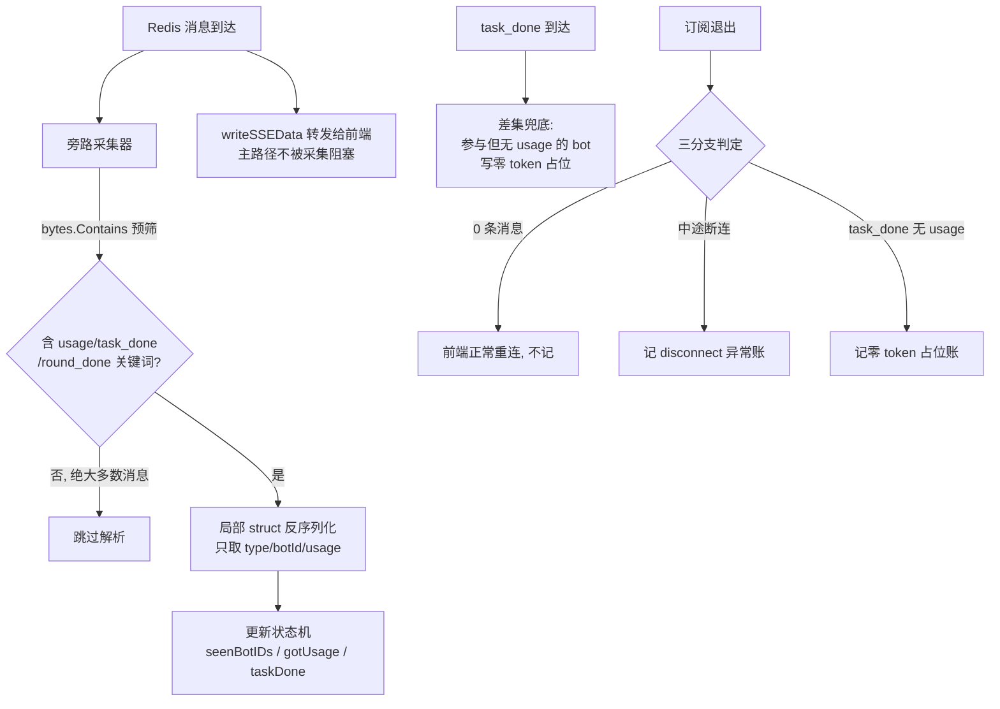

# 重点 19：流式旁路指标采集——在 SSE 订阅循环里"顺路"记账

> **一句话亮点（简历可直接用）**：在 SSE 订阅代理循环中实现旁路指标采集：bytes.Contains 字节级预筛 + 局部 struct 增量反序列化，对每条流经的消息只做"看一眼"级别的解析，识别 usage/task_done/round_done 事件并维护 per-task 参与 bot 状态机，配合零 token 占位与异常断连双兜底，做到主转发路径零感知、指标采集全覆盖。

## 为什么这是一个值得重点介绍的难点

指标采集（这次调用哪个 bot、烧了多少 token、耗时多久、归到哪个用户头上）必须拿数据，而数据就"流经" SSE 订阅代理——admin 是把 Redis 消息转发给前端的中间人，每条流式事件都从它手里过。直觉方案是在转发时把每条消息完整 JSON 反序列化、提取字段、写库。但这条路径是**全平台对话的流量咽喉**：

- 一次对话流产生几十到几百条消息（text_delta 逐 token、工具事件、usage 帧），每条都做全量 JSON 解析，CPU 开销直接挂在用户首 token 延迟上；
- 解析失败、写库慢，都会影响转发主链路——为了记账把聊天搞卡，本末倒置；
- 群聊（Room）模式一个 chat_id 扇出到多个 bot，指标归属不是一条消息一个 bot 那么简单，要维护"这次任务到底有哪些 bot 参与过"的状态；
- 上游网关不返回流式 usage 帧的时期，整条流可能**没有任何 usage 事件**，不兜底的话整次调用在账务上蒸发。

难点的本质是：**怎么在一条对延迟零容忍的热路径上，做一件必须全量覆盖、但又绝不能拖累热路径的事**。答案是旁路（sidecar）模式——看一眼、记状态、异步写，绝不挡路。

## 先备知识：本文涉及的术语与变量

| 术语/变量 | 含义与示例 |
|---|---|
| **旁路采集（sidecar metrics）** | 在主数据流（SSE 转发）旁边"挂"一个采集器：不改变、不阻塞主流，只是观察流经的数据并提取指标。类似在高速路边架测速仪，而不是设卡拦车检查。 |
| **sseMetricsContext（mctx）** | 采集上下文体（`chat_handler.go:326-341`）：订阅建立时组装一次，携带 `BotID`/`SessionID`/`ChatID`/`SenderID`/`Mode`/`StartTime`/`ClientChannel`，之后每条消息的分析结果都记在它名下。 |
| **text_delta / tool_start / tool_done / usage / round_done / task_done** | engine 发布的流式事件类型。`text_delta`=逐 token 文本；`usage`=一次 LLM 调用的 token 统计帧；`round_done`=群聊一轮结束（携带本轮权威 bot 列表）；`task_done`=整个任务结束哨兵。 |
| **sseUsageData** | usage 帧的解析结构（`chat_handler.go:3686-3704`）：`prompt_tokens`、`completion_tokens`、`cache_read/write_tokens`、`elapsed_ms`、`model_name`、`trace_id` 等。 |
| **bytes.Contains 预筛** | 解析前先做字节级子串匹配（如 `bytes.Contains(payload, []byte("\"usage\""))`）：不含关键词的消息直接跳过 JSON 解析。字节扫描比 JSON 反序列化快一到两个数量级。 |
| **局部 struct 反序列化** | 只定义含目标字段的小 struct（如 `{Type, BotID}` 两字段）做 Unmarshal，JSON 里其余几十 KB 字段全部跳过不建模，比全量解析省内存省 CPU。 |
| **seenBotIDs / usageSavedBotIDs** | Room 模式的两个 map（`chat_handler.go:1174-1175`）：前者记录本次任务"出现过"的所有 bot，后者记录"已上报过 usage"的 bot。task_done 时取差集，就是"参与但漏账"的 bot。 |
| **saveBotResponse** | 落库函数（`chat_handler.go:3707`）：把采集结果异步写入 bot_responses 表，带 cost 计算与 quota 累加钩子（见重点 17/18）。 |
| **gotUsage / taskDone / writeFailed** | DM 模式的三个布尔标记（`chat_handler.go:1647-1649`），订阅循环退出后按它们的组合做三分支补账判定。 |
| **engine 直调上报（platform/report）** | 指标的**主**写入路径：engine 完成调用后自己异步上报 admin（见重点 17）。SSE 旁路如今已退居"观测 + 兜底"角色——这是本设计后来的演进，面试中要讲清楚这个分层。 |

## 技术剖析

### 旁路在订阅循环中的位置



注意图中的关键结构：**B（采集）与 G（转发）是并列消费同一条消息，而非串行**。采集无论多慢都不会挡住 G。

### 性能手段一：字节级预筛，九成消息不解析

DM 订阅循环（`chat_handler.go:1666-1685`）：

```go
if !gotUsage && bytes.Contains(payload, []byte("\"usage\"")) {
    var usageEnvelope struct {
        Usage *sseUsageData `json:"usage"`
    }
    if json.Unmarshal(payload, &usageEnvelope) == nil && usageEnvelope.Usage != nil {
        gotUsage = true
    }
}
if !taskDone && bytes.Contains(payload, []byte("\"task_done\"")) { ... }
```

一条流里绝大多数消息是 text_delta（逐 token 文本），它们不含 `"usage"`、`"task_done"` 子串，`bytes.Contains` 一次 SIMD 友好的内存扫描就排除了——**不需要为它们付出任何 JSON 解析成本**。两个标记位的短路（`!gotUsage &&`、`!taskDone &&`）更进一步：已确认过 usage 之后，连预筛都跳过。

### 性能手段二：局部 struct，只为自己关心的字段付费

Room 模式（`chat_handler.go:1199-1205`）的"顶层 botId 收集"只用了一个两字段 struct：

```go
var topPeek struct {
    Type  string `json:"type"`
    BotID string `json:"botId"`
}
if json.Unmarshal(payload, &topPeek) == nil && topPeek.BotID != "" {
    seenBotIDs[topPeek.BotID] = struct{}{}
}
```

engine 的流式消息本体可能几十 KB（工具参数、长文本），但 `topPeek` 只建模两个字段，反序列化器扫到目标字段即取，其余跳过——内存分配和 CPU 都与消息大小近似解耦。round_done 同理只取 `bots[].id`（`chat_handler.go:1207-1221`）。这就是"局部 struct 反序列化"：**绝不在热路径上为不关心的字段建内存对象**。

### Room 模式的状态机：谁参与了、谁漏账了

群聊一次任务扇出多个 bot，而 usage 帧逐 bot 携带自己的 botId。采集器维护两张表（`chat_handler.go:1174-1175`）：

- `seenBotIDs`：任何流式事件顶层带 botId 的、以及 round_done 权威 bots 列表里的，都算"本次任务实际参与者"（两个来源取并集，因为有的 bot 可能只被 @ 到但没产出流式文本）；
- `usageSavedBotIDs`：观察到 usage 帧的 bot。

`task_done` 到达时（`chat_handler.go:1242-1260`）取差集 `seenBotIDs - usageSavedBotIDs`，对差集中每个 bot 写一条**零 token 占位记录**。背景是上游网关一度不返回流式 usage chunk（代码注释 `chat_handler.go:1101-1105` 明确记录），若不兜底，群聊整次调用在账务与指标上完全蒸发。占位记录保证"至少有一条账"，上游修复后自然变成真实 token。每个 task_done 处理完调用 `resetTaskScope` 清空两张表（`chat_handler.go:1176-1179`），群聊多轮任务互不串账。

### DM 模式的退出三分支：区分"正常重连"与"真断连"

前端 EventSource 约 60s 无消息自动断开重连，这是**正常 SSE 语义**，绝不能误记成异常。DMSubscribe 退出后（`chat_handler.go:1705-1730`）：

1. `msgCount == 0`：一条消息都没收到——纯粹的前端重连或任务未开始，不记任何账；
2. `writeFailed || (ctx.Err() != nil && !taskDone)`：收到过消息但中途断开且任务未完——真异常，记 `error_type=disconnect` 的账；
3. `taskDone && !gotUsage`：任务正常结束但没有 usage——记零 token 占位账。

这套判定的价值在于**指标的可归因性**：disconnect 账多了说明 engine 或网络有问题，no_usage 账多了说明上游网关 usage 链路有问题，各自指向明确的排查方向。

### 从"旁路写库"到"旁路观测"的架构演进

讲这个设计必须讲它的演进：最初 SSE 旁路就是指标的**唯一**写入路径，后来演进为 engine 直调 `/internal/api/metrics/platform/report` 为主写入（幂等、带完整 usage），旁路退居观测 + 兜底（`chat_handler.go:1223-1225` 注释明确记录"真实写库已迁移到 engine 直调"）。为什么改：旁路能看到什么取决于 engine 往 Redis 发了什么，usage 数据在 engine 手里最全，直调上报让 engine 自己当权威信源，admin 旁路只做状态机与兜底——**信源权威性与链路简洁性都更优，旁路则保留了 engine 不上报/上报失败时的最后防线**。兜底路径自身也在进化：saveBotResponse 现在会同步计算 cost 并打 cost_status（`chat_handler.go:3745-3772`），写库成功后异步累加 quota（`chat_handler.go:3803-3807`），与主路径同口径，避免"主备两本账"。

## 关键设计决策与权衡

1. **旁路而非侵入**：采集不阻塞转发，写库全部 `go saveBotResponse(...)` 异步化（`chat_handler.go:1256/1724/1728`）。代价是极端情况（进程崩溃）可能丢最后一条账——可接受，DB SUM 仍是权威兜底。
2. **预筛 + 局部解析而非全量解析**：用"可能误筛但绝不漏筛"的子串预筛（搜 `"usage"` 子串，任何含 usage 的消息必然命中，误命中的交给后续 Unmarshal 校验 type 字段），换取热路径近零解析成本。
3. **占位账优于没有账**：零 token 记录会让"平均 token"类指标略偏低，但换来"调用次数、参与 bot、错误率"类指标完整——指标体系中"有没有发生"通常比"发生了多少"更重要。
4. **主写路径让位给权威信源**：engine 直调上线后旁路降级为兜底，而不是两条路径双写——避免重复账，幂等靠 report_id（见重点 17）。

## 面试话术（怎么讲）

> 平台对话流量的咽喉是 SSE 订阅代理，我在它上面做了旁路指标采集，原则是不改变不阻塞主流、只观察。性能上用两层手段：bytes.Contains 字节预筛让九成以上的 text_delta 消息零解析，解析时用只含目标字段的局部 struct，不为几十 KB 的消息本体付全量反序列化的成本。业务上最难的是群聊：一个任务扇出多个 bot，我维护了 seen/usage-saved 两个集合的状态机，task_done 时取差集给漏账的 bot 写零 token 占位，解决上游不返回 usage 帧期间整次调用账务蒸发的问题。DM 侧退出时做三分支判定，把前端 60 秒正常重连和真异常断连区分开，让 disconnect 类指标可归因。后来这个架构演进为 engine 直调上报为主、旁路兜底为辅，因为 usage 的权威信源在 engine 手里，旁路保留为最后防线。

## 可能的追问及答案

**Q：bytes.Contains 会不会误判？比如文本内容里恰好出现 "usage" 这个词？**
A：会，预筛搜的是带引号的 `"usage"` 子串，LLM 输出恰好含这三个字符组合的概率不为零。但预筛的定位就是"宁可误放进、不可漏掉"：误放进的消息会再走局部 struct Unmarshal 并校验 `type` 字段，不符合的事件不会被采信，正确性由第二层保证，预筛只影响性能不影响准确。

**Q：异步写库失败怎么办？账就丢了吗？**
A：单次异步写失败确实会丢，但有两个兜底：一是 GetUsage 等关键读路径以 DB SUM(bot_responses.cost) 为权威来源，二是指标看板基于事实表重算。设计上接受"边缘记录可丢、总量口径不丢"，因为为每条账做强一致同步写会把延迟带回主链路，违背旁路初衷。

**Q：为什么不用更专业的方案，比如 OpenTelemetry span 或消息队列削峰？**
A：项目里链路追踪（agent_traces/agent_spans）确实独立建设了，它回答的是"这次调用经过哪些环节"；旁路采集回答的是"这次调用花了多少 token 归到谁头上"，是账务口径。两者互补。消息队列会把一次转发变成两次网络跳转，为记账引入新基础设施和运维成本，对"看一眼就够"的场景过重。

**Q：Room 差集兜底会不会误伤？比如某 bot 被 @ 了但根本没轮到它说话？**
A：seenBotIDs 的两个来源都尽量保守：流式事件顶层 botId 只有真产出过事件的 bot 才有；round_done 的 bots 列表是 engine 认定的本轮参与者。理论上仍有"参与定义为真但实际未调用 LLM"的边界，这正是占位账记零 token 的原因——它的存在意义是"该 bot 在本次任务的责任范围内出现过"，而非"它消耗了资源"。

**Q：如果重新设计，会改什么？**
A：会把状态机从"订阅连接生命周期"改为"任务生命周期"：现在用户刷新页面重建订阅会重置 seenBotIDs，跨订阅的任务可能拆成两笔账。以 task_id 为 key 把采集状态存到 Redis 短 TTL，订阅重连后接续状态，账务就以任务为原子单位完整聚合。

## 事实边界

- 本文全部行号以 `application/` 目录现行代码（2026-07 快照）为准；
- 旁路采集目前对 usage 事件只做"观测标记"，真实写库以 engine 直调 `/internal/api/metrics/platform/report` 为主；旁路的实际写入仅剩 task_done 零 token 占位与 disconnect 异常账两类兜底；
- 预筛子串与事件类型字段依赖 engine 发布协议（`type`/`botId`/`usage` 字段名），协议变更需要双端同步；
- 零 token 占位账在"平均 token 消耗"类指标中会产生轻微下偏，分析时需按 cost_status/is_error 过滤；
- 采集状态在单条订阅连接内有效，跨连接的任务归集依赖 task_done 在同一连接内到达。

## 简历亮点描述（可直接引用）

- 在 SSE 订阅热路径上设计旁路指标采集体系，bytes.Contains 字节预筛 + 局部 struct 增量反序列化，实现主转发路径零解析成本、采集全覆盖；
- 设计群聊多 bot 场景的双集合状态机与 task_done 差集兜底，解决上游缺失 usage 帧时的整次调用账务蒸发问题；DM 侧三分支判定区分正常重连与异常断连，指标可归因；
- 主导"旁路写库 → engine 权威直调 + 旁路兜底"的架构演进，平衡信源权威性与链路简洁性。

## 代码依据

- `application/admin/internal/api/chat_handler.go:326-341`（sseMetricsContext）、`:1101-1105`（上游不返回 usage chunk 的背景注释）、`:1172-1261`（Room 旁路状态机与 task_done 差集兜底）、`:1199-1221`（topPeek 局部 struct 与 round_done 解析）、`:1223-1239`（usage 观测标记，写库已迁 engine 直调）、`:1646-1730`（DM 旁路标记与退出三分支）、`:1666-1685`（bytes.Contains 预筛）、`:3686-3704`（sseUsageData）、`:3707-3833`（saveBotResponse 异步落库 + cost/quota 钩子）、`:1256/1724/1728`（go saveBotResponse 异步化）
- `application/admin/internal/services/platform_usage_report_service.go:1-25`（engine 直调主路径与旁路的职责划分说明）
