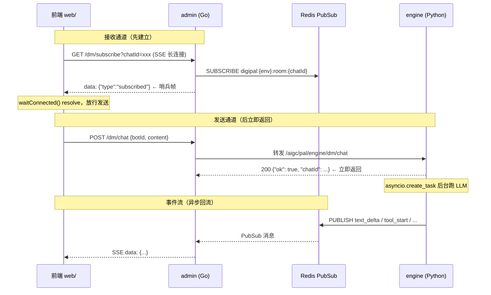

# 重点 20：读写分离架构 —— Fire-And-Forget 与哨兵握手

> **一句话亮点（简历可直接用）**：设计并落地了聊天链路的"读写分离"架构——发送走 POST 立即返回（fire-and-forget），接收走独立 SSE 长连接经 Redis PubSub 转发；针对"HTTP 200 不代表订阅就绪"的分布式竞态，设计了 subscribed 哨兵握手 + 后端 NUMSUB 轮询的双保险机制，并配套 35 秒静默断线检测、指数退避重连与断线自愈，支撑页面刷新、跨容器切换场景下消息零丢失。

## 为什么这是一个值得重点介绍的难点

传统的 LLM 聊天前端是"一个 POST 挂到底"：请求发出后保持连接，服务端把 token 逐个写进响应体。这种写法在 demo 阶段没问题，但生产环境有三个硬伤：

1. **连接即状态**——HTTP 连接断了，任务状态就丢了。用户刷新页面、切换网络、容器负载均衡把连接挪到另一个 Pod，流式输出就永远中断；
2. **长连接占用业务连接数**——一个 5 分钟的 Agent 任务就挂住一个 HTTP 连接 5 分钟，网关层连接数被打满；
3. **发送与接收耦合**——想实现"刷新页面后重连继续看流式输出"在单连接模型下几乎不可能，因为响应流和请求生命周期绑死。

本项目的解法是彻底拆开两条路径：**发送路径**（POST `/dm/chat`，服务端立即返回 200，任务在后台跑）与**接收路径**（独立的 SSE 长连接 `/dm/subscribe`，流式事件经 Redis PubSub 中转广播）。但拆开后立刻引入一个新的分布式竞态：**POST 返回 200 只代表 HTTP 连接建立，Redis 的 SUBSCRIBE 是异步传播的**——如果前端在订阅真正生效前就 POST，engine 侧 PUBLISH 的早期事件会因为没有订阅者而直接丢失（Redis Pub/Sub 无持久化、无缓冲）。这个"窗口期丢事件"问题在单次请求-响应模型里根本不存在，是读写分离架构独有的代价。本文讲清楚这个竞态的成因，以及前端哨兵握手 + 后端 NUMSUB 轮询的双保险解法。

## 先备知识：本文涉及的术语与变量

| 术语/变量 | 含义与示例 |
|---|---|
| **Fire-and-forget（发了就忘）** | 一种调用模式：客户端发出请求后只等"服务端已受理"的确认（HTTP 200），不等业务结果。业务结果通过另一条通道异步推送。示例：前端 POST `/dm/chat` 后几毫秒内拿到 `{"ok": true, "chatId": "dm-xxx"}`，真正的 LLM 回复几秒后才从 SSE 通道流回来。 |
| **SSE（Server-Sent Events）** | 服务端推送协议：一个长期保持的 HTTP GET 连接，服务端不断往响应体里写 `data: {...}\n\n` 格式的帧。本项目用它做接收通道，如 `GET /aigc/pal/api/dm/subscribe?chatId=xxx`。 |
| **Redis Pub/Sub** | Redis 的发布订阅能力：`PUBLISH channel msg` 广播消息，`SUBSCRIBE channel` 接收。特点：**无持久化、无缓冲**——发布时频道上没有订阅者，消息直接丢弃，事后订阅收不到历史消息。这是窗口期丢事件的根源。 |
| **SUBSCRIBE 传播延迟** | 客户端执行 `SUBSCRIBE` 命令后，Redis（尤其是经过代理的云 Redis）需要一段时间把订阅关系传播到所有节点。在这段时间内 `PUBLISH` 的消息该订阅者收不到。代码注释原话："Subscribe() 是异步的，此时 Redis proxy 可能还没完成订阅传播，早期 PUBLISH 的消息可能丢失（0 subscribers）"（`admin/internal/api/chat_handler.go:1140-1141`）。 |
| **subscribed 哨兵** | admin 在 SSE 连接建立、本地 `Subscribe()` 调用完成后，主动往 SSE 流里写的第一帧：`{"type":"subscribed"}`（`chat_handler.go:1620`）。它不是业务事件，而是一个"订阅通道已就绪"的握手信号。 |
| **waitConnected()** | 前端函数（`web/src/composables/useChat.ts:1833`）。返回一个 Promise，在收到 subscribed 哨兵时 resolve；兜底 3 秒超时强制 resolve（兼容没有哨兵机制的老服务端）。`_streamDM` 在 POST 前必须 `await` 它。 |
| **NUMSUB 轮询** | 后端侧的第二道保险：engine 在发布事件前，循环调用 Redis 的 `PUBSUB NUMSUB channel` 命令查询订阅者数量，每 200ms 查一次、最多等 8 秒，确认至少 1 个订阅者在线才开始 PUBLISH（`engine/nanobot/server/server.py:3150-3175`）。 |
| **_streamDM** | 前端发送函数（`useChat.ts:468`）。职责：等待订阅就绪 → 预创建等待气泡 → POST 消息 → 立即返回。 |
| **useDMPush** | 前端接收 composable（`useChat.ts:1852`）。职责：建立 `/dm/subscribe` SSE 长连接、解析事件帧、断线重连。 |
| **BACKOFF** | 前端常量数组 `[1000, 2000, 5000]`（`useChat.ts:1867`），单位毫秒。重连延迟按尝试次数递增：第 1 次等 1 秒、第 2 次等 2 秒、第 3 次起封顶 5 秒（cap）。 |
| **READ_TIMEOUT** | 前端常量 `35_000` 毫秒（`useChat.ts:1868`）。SSE 读操作的静默超时：35 秒内一个帧都没读到就判定连接假死，主动断开重连。 |
| **task_done** | 业务事件帧，表示"这个任务跑完了"。前端收到后做两件事：finalize 残留气泡 + 延迟 3 秒重新拉 history 补洞（`useChat.ts:2394-2437`）。 |
| **_finalizeCurrent** | 前端函数（`useChat.ts:2503`）。把当前流式气泡"封口"：有内容的气泡标记 streaming=false 保留，纯空壳气泡删除。 |

## 技术剖析

### 整体架构：两条独立通道



发送链路在代码上体现为两个"立即返回"：engine 的 `dm_chat` handler 在解析请求后只做一件事——`asyncio.create_task(_dm_bot_task(...))` 把真正的 LLM 调用扔进后台任务（`server.py:3055-3056`），随即返回 200；admin 的 `DMChat` 则是个透明代理，校验、鉴权、路由后 `proxyPlain` 转发（`chat_handler.go:399-558`）。前端 `_streamDM` 的注释把这个契约写得很明白（`useChat.ts:480-483`）：

```typescript
// 1. Fire-and-forget: POST 消息到后端，后端立即返回 200
//    流式事件通过 /dm/subscribe SSE 接收（由 useDMPush 管理）
// Wait for DM subscribe connection to be ready before sending POST,
// ensuring the subscriber is registered in Redis before events are published.
if (_dmWaitConnected) {
  await _dmWaitConnected()
}
```

### 竞态详解：200 OK 不等于订阅就绪

接收通道的建立涉及两次异步，两次都可能"看起来成功了但其实没生效"：

- **第一次异步：HTTP 层**。前端 `fetch` SSE 拿到 200 状态码，只代表响应头到达了，不代表服务端已经完成了 Redis 订阅。前端代码里的注释专门警告了这一点（`useChat.ts:2130-2132`）："do NOT resolve _connectedResolve here — fetch() returning 200 only means the HTTP response headers arrived. Redis SUBSCRIBE on the admin side is still async."
- **第二次异步：Redis 层**。admin 侧 go-redis 的 `Subscribe()` 调用本身也是异步传播的（`chat_handler.go:1605` 发起订阅，注释在 `:1140-1141` 说明传播延迟），经过 Redis 代理时延迟更明显。此时若 engine 侧开始 `PUBLISH`，命令返回的订阅者计数是 0，消息被直接丢弃。

丢失的后果很严重：早期事件（比如第一帧 `text_delta`、会话状态快照）丢了，用户看到的是"发出了消息但 bot 一直没反应"，且因为 Pub/Sub 无缓冲，这些事件**永远补不回来**，只能靠后续兜底机制慢慢自愈。

### 解法第一道：subscribed 哨兵握手（前端等信号）

admin 在本地 `Subscribe()` 调用完成后，立刻往 SSE 流里写一帧哨兵（`chat_handler.go:1618-1624`）：

```go
// subscribed 哨兵 — 通知前端 Redis 订阅已就绪
middlewares.LocalInfof(c, "[dm_subscribe] sending subscribed sentinel channel=%s", channel)
if err := writeSSEData(c.Writer, `{"type":"subscribed"}`); err != nil {
    ...
}
```

前端 `useDMPush` 在事件循环里识别这帧并放行等待中的发送（`useChat.ts:2163-2171`）：

```typescript
if (chunk.type === 'subscribed') {
  console.info('[dmPush] ✓ subscribed event received — Redis channel ready')
  const resolve = _connectedResolve as ((() => void) | null)
  if (resolve) {
    _connectedResolve = null
    resolve()
  }
  continue
}
```

`waitConnected()` 用 `Promise.race` 实现"等哨兵，但最多等 3 秒"（`useChat.ts:1833-1840`）：

```typescript
function waitConnected(): Promise<void> {
  if (!_connectedPromise) return Promise.resolve()
  // Race: subscribed event vs 3s timeout fallback
  return Promise.race([
    _connectedPromise,
    new Promise<void>(r => setTimeout(r, 3000)),
  ])
}
```

3 秒超时是**向后兼容兜底**：老版本服务端没有哨兵机制，前端不能因此永远卡住发不出消息。宁可承担老服务端上的丢事件风险，也不阻塞主流程——这是渐进式协议升级的常见做法。

### 解法第二道：NUMSUB 轮询（后端数人头）

哨兵 handshake 依赖"前端发了消息前订阅已就绪"，但还有一条路径绕过了这个约定：engine 后台任务自身在发布第一帧前，无法假设订阅者一定在。于是 engine 在 `_dm_bot_task` 里做了发布前的"数人头"（`server.py:3150-3175`）：

```python
# ── 等待至少一个 subscriber 就绪（NUMSUB 轮询，最多 8s）──
if pubsub is not None:
    _sub_channel = f"{ROOM_CHANNEL_PREFIX}{chat_id}"
    for _wait_i in range(40):  # 40 * 200ms = 8s
        try:
            numsub_result = await pubsub._redis.pubsub_numsub(_sub_channel)
            if isinstance(numsub_result, dict):
                _nsub = int(numsub_result.get(_sub_channel, 0))
            else:
                _nsub = int(dict(numsub_result).get(_sub_channel, 0))
            if _nsub > 0:
                logger.info("dm_bot_task NUMSUB ready: ...")
                break
        except Exception as e:
            logger.debug("dm_bot_task NUMSUB check failed ...")
        await asyncio.sleep(0.2)
    else:
        logger.warning("dm_bot_task NUMSUB timeout (8s) — proceeding without subscriber")
```

两个工程细节值得注意：一是兼容了 redis-py 4.x（返回 `List[Tuple]`）与 5.x（返回 `Dict`）两种返回类型，否则老版本永远数到 0、白白等满 8 秒；二是超时后**仍然继续发布**而不是失败——因为落盘 JSONL + 后续 loadHistory 是最终兜底，NUMSUB 只是"最大化实时送达率"的优化，不是正确性依赖。这与前端 3 秒超时兜底的设计哲学一致：**保险丝可以熔断，主链路必须容错**。同文件里 NUMSUB 还有两处变体：Room 链式调用路径（`server.py:5291` 起，同样最多 8 秒）和通知发布路径（`server.py:5197` 起，只等 2 秒——`10 * 200ms`，注释说明"超时也无妨，落盘 + 后续 loadHistory 会兜住"），按业务重要程度分档。

### 配套机制：断线检测、重连与自愈

读写分离后，SSE 长连接的健康完全由前端负责，配套三件事：

**35 秒静默检测**（`useChat.ts:2137-2145`）：每次读操作与 35 秒定时器 race，超时抛错进入重连流程。为什么需要它？TCP 连接在 NAT/代理环境下会"假死"——连接没断开但再也不来数据，只有应用层超时能发现。35 秒覆盖了 LLM 首 token 延迟（冷启动可能 20 秒以上）的正常波动。

**指数退避重连**（`useChat.ts:2494-2499`）：断开后按 `BACKOFF = [1000, 2000, 5000]` 递增等待，第三次起封顶 5 秒，避免服务端故障时前端疯狂重连造成雪崩。重连成功后 `attempt = 0` 重置（`useChat.ts:2129`）。

**重连后的自愈**：连接恢复后，第一个 `text_delta` 到达时 `_ensureMsg` 会通过"领养"机制把断线前的气泡找回来继续写（详见重点 23）；若任务在断线期间已完成，`task_done` 处理器会 finalize 所有残留 streaming 气泡，并**延迟 3 秒重新拉取 history** 补齐断线窗口丢失的内容（`useChat.ts:2417-2434`，3 秒是等 engine 把 JSONL 落盘）。断线异常分支也会就地 finalize 已有内容的气泡（`useChat.ts:2467-2486`），空壳占位则刻意保留给重连续写。

### 这套架构换来了什么

- **刷新可恢复**：任务跑在服务端，状态在 Redis 频道和 JSONL 里，页面刷新后重建 SSE 订阅即可继续接收事件，`task_done` 后的 history 补洞保证最终一致；
- **跨容器可恢复**：前端与 admin 之间、admin 与 engine 之间都没有粘性会话要求，SSE 连到任何 admin 实例都能订阅同一个 Redis 频道；
- **发送路径极轻**：POST 毫秒级返回，配额拦截（403）等错误同步可见（`useChat.ts:529-547`），业务结果异步推送。

## 关键设计决策与权衡

1. **为什么不用 WebSocket**：事件流是单向的（服务端→客户端），SSE 基于 HTTP 语义，天然穿透企业代理/网关，且自动携带 Cookie 鉴权；WebSocket 的双向能力在这个场景用不上，还引入额外的升级握手和运维复杂度。
2. **为什么不用 Redis Stream 替代 Pub/Sub**：Stream 有持久化，可以彻底消灭窗口期问题，但引入了消费组管理、积压清理的运维成本。选择 Pub/Sub + 哨兵 + NUMSUB + history 补洞的组合，用应用层机制把丢失率压到可接受，换取基础设施的极简。
3. **双保险而非单保险**：哨兵管"前端别急着发"，NUMSUB 管"后端别急着发"，两者防御的入口不同（用户主动发送 vs 后台任务/链式调用自动发布），任何单一道都盖不住全部发布路径。
4. **超时兜底一律放行而非失败**：3 秒哨兵超时、8 秒 NUMSUB 超时后都选择继续执行。这类优化机制的失败模式应该是"降级到次优体验（可能丢早期事件，靠 history 补）"，而不是"阻塞用户操作"。
5. **fire-and-forget 的错误可见性补偿**：POST 立即返回意味着 LLM 执行期的错误（如额度耗尽）没法走 HTTP 状态码，因此配额拦截被刻意设计为 POST 阶段同步前置校验（`chat_handler.go:467-469`），保证硬错误仍同步可达。

## 面试话术（怎么讲）

> 我们的聊天链路做了读写分离：发送是 POST fire-and-forget，服务端立即返回 200 后在后台跑 Agent；接收是一条独立的 SSE 长连接，流式事件经 Redis PubSub 中转。拆开之后最大的坑是一个分布式竞态——HTTP 200 只代表连接建立，Redis 的 SUBSCRIBE 是异步传播的，此刻发布的事件会因为 0 订阅者被直接丢弃，而 Pub/Sub 无缓冲，丢了就永远丢了。我做了双保险：admin 在订阅就绪后给 SSE 流写一帧 `{"type":"subscribed"}` 哨兵，前端 waitConnected 收到它才放行 POST，3 秒超时兜底兼容老服务端；engine 发布前用 PUBSUB NUMSUB 每 200ms 轮询订阅者数量，最多等 8 秒确认有人收听才发。配套上，前端有 35 秒静默断线检测、1/2/5 秒指数退避重连，重连后通过气泡领养续写、task_done 后延迟 3 秒拉 history 补洞。这套架构让页面刷新、跨容器切换都不丢消息，发送路径也从长连接中解放出来。

## 可能的追问及答案

**Q：为什么不在 POST 响应里直接流式返回，非要拆两条连接？**
A：单连接模型下连接即状态，刷新页面、网络切换、LB 调度都会导致流式输出永久中断且无法恢复。拆分后任务状态在服务端（Redis 任务 key + JSONL 落盘），客户端连接只是"观察窗口"，可以随时重建。这是用协议复杂度换状态可恢复性。

**Q：哨兵帧会不会也可能丢？比如 SSE 连接其实不健康。**
A：会，所以哨兵不是唯一手段——3 秒超时兜底保证前端不被卡死，后端 NUMSUB 是第二道独立防线，最后还有 task_done 后的 history 重拉做最终一致性兜底。单点机制都可以失效，组合起来丢失概率被压到极低，且最坏情况可自愈。

**Q：35 秒 READ_TIMEOUT 怎么定的？**
A：依据是 LLM 首 token 延迟的线上观测——冷启动场景 POST 到首个 text_delta 之间可能超过 20 秒。35 秒留出约 1.75 倍余量；再长会让真断线的发现变慢，再短会误杀正常的长首 token 任务。

**Q：Redis Pub/Sub 丢消息的根本解法是换 Stream 或消息队列，为什么不做？**
A：成本收益权衡。Stream 引入消费组、ACK、积压管理的完整心智负担，而聊天事件是"高频、可丢失、有最终兜底（history 补洞）"的数据，不值得上可靠消息队列。架构决策要匹配数据的可靠性等级。

**Q：如果让你重新设计，会改什么？**
A：会把哨兵协议升级为带版本号的显式握手（如 `{"type":"subscribed","v":2,"channel":"..."}`），把 3 秒盲等兜底去掉；同时在 admin 侧记录"哨兵发出时 NUMSUB 实际值"的指标，把窗口期丢事件从"日志可排查"升级为"指标可监控"，量化双保险的真实拦截率。

## 事实边界

- 本文基于 application/ 工作区（engine develop 2026-07-31 / admin 2026-07-28 / web 2026-07-21）核实；digi-pal/ 为 2026-05 旧快照，不作为依据。
- 文中行号基于当前工作区源码；`useChat.ts` 中 useRoomPush（Room 模式）与 useDMPush（DM 模式）各有独立的订阅实现，本文以 DM 链路为主线，Room 链路的哨兵机制对称（`chat_handler.go:1143`）。
- NUMSUB 轮询在 engine 有多处副本：DM 任务（`server.py:3150`）、Room chaining（`server.py:5291`）、通知发布（`server.py:5197`，仅等 2 秒），参数略有差异。
- "零丢失"指最终一致性意义上的不丢（history 补洞兜底），Pub/Sub 通道本身不保证单帧必达。
- 3 秒哨兵超时、35 秒静默检测、1/2/5 秒退避均为工程经验值，非理论推导。

## 简历亮点描述（可直接引用）

- 设计并实现聊天链路读写分离架构（fire-and-forget POST + 独立 SSE 订阅 + Redis PubSub 中转），将任务状态从 HTTP 连接生命周期中解耦，实现页面刷新/跨容器切换下的流式会话可恢复；
- 识别并修复 Pub/Sub 订阅传播延迟导致的窗口期丢事件竞态，设计 subscribed 哨兵握手（前端 3s 超时兜底）+ 后端 NUMSUB 轮询（200ms×40）双保险机制；
- 实现 35s 应用层静默断线检测、指数退避重连（1s/2s/5s cap）与重连后气泡领养 + history 补洞的自愈闭环。

## 代码依据

- `web/src/composables/useChat.ts:468`（_streamDM fire-and-forget）、`:484-486`（POST 前等待订阅就绪）、`:522-527`（POST /dm/chat）、`:1833-1840`（waitConnected 哨兵等待 + 3s 兜底）、`:1852`（useDMPush）、`:1867-1868`（BACKOFF / READ_TIMEOUT 常量）、`:2111-2145`（连接与 35s 静默检测循环）、`:2163-2171`（subscribed 哨兵处理）、`:2394-2437`（task_done：finalize + 3s 延迟 history 补洞）、`:2467-2499`（断线自愈与退避重连）
- `admin/internal/api/chat_handler.go:399`（DMChat 代理转发）、`:1557`（DMSubscribe）、`:1605`（Redis Subscribe）、`:1618-1624`（subscribed 哨兵下发）、`:3891-3895`（B1 snapshot 首帧说明）
- `engine/nanobot/server/server.py:2963-2968`（dm_chat 契约）、`:3055-3056`（asyncio.create_task 后台任务）、`:3150-3175`（NUMSUB 轮询双保险）
