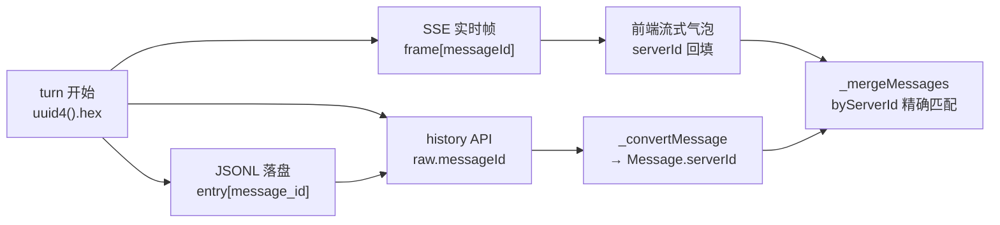

# 重点 21：服务端权威 ID 与历史合并算法

> **一句话亮点（简历可直接用）**：为流式聊天系统设计了"服务端权威消息 ID"机制——engine 在每个 turn 开始生成 UUID，同时注入 SSE 分段、JSONL 落盘与 history API 三条数据通路；前端以此实现基于 ID 精确匹配的实时气泡与历史快照合并算法（历经六代演进，淘汰了内容指纹、位置对齐等启发式方案），彻底解决了刷新/切会话场景下的消息重复、丢失、错位问题。

## 为什么这是一个值得重点介绍的难点

流式聊天前端有一个教科书不讲、生产必踩的问题：**同一条 bot 回复有两条数据来源**——一条是 SSE 实时推过来的 delta 流（前端边收边渲染成气泡），另一条是服务端落盘的历史记录（刷新页面、切换会话时通过 history API 拉回来的快照）。刷新恢复的瞬间，两条来源在前端相遇：本地有一个流式中的气泡，服务端返回一个内容相似但不完全相同的条目。**怎么判断它们是不是同一条消息？**

判断错了只有两种死法，都很难看：

- **误判为不同** → 同一段回复显示两遍（用户看到"复读机"）；
- **误判为相同** → 不同的两条回复被折叠成一条（用户连发三次"hello"，bot 回复三次"你好"，结果只剩一条）。

这个问题难在它处在**分布式系统数据一致性和前端 UI 渲染的交叉口**：两端的写入时序不可控（SSE 推送与 JSONL 落盘有先后）、内容本身不可靠（LLM 回复经常高度重复）、消息数量动态变化（工具调用会中途插入新行）。本项目先后用六代方案才收敛，每一代的失败模式都是真实的线上 bug。最终的答案朴素但深刻：**任何基于内容或位置的启发式都必然失败，唯一可靠的是端到端的身份标识——本质上是给每条消息发一个"幂等键"**。

## 先备知识：本文涉及的术语与变量

| 术语/变量 | 含义与示例 |
|---|---|
| **turn（轮次）** | 用户发一条消息到 bot 给出完整回复的完整过程。一个 turn 内可能有多次 LLM 调用和多个工具调用。 |
| **serverId** | 前端 `Message` 类型上的字段（`web/src/types/index.ts:153`），保存"服务端权威消息 ID"。值是 engine 生成的 UUID，如 `"a3f8c2e1b94d4f2e8c1a0b5d6e7f8a9b"`。 |
| **assistant_message_id** | engine 侧变量名。turn 开始时由 `AgentLoop._process_message` 生成（`engine/nanobot/agent/loop.py:3884-3886`），写入 `msg.metadata`，随后被注入 SSE 帧、JSONL 落盘条目。 |
| **SSE 分段 / chunk** | 流式事件帧，如 `{"type":"text_delta","delta":"你好","messageId":"a3f8..."}`。同一 turn 的所有帧共享同一个 `messageId`。 |
| **JSONL** | engine 的会话落盘格式：每行一个 JSON 对象（一条消息），追加写入 `workspace/sessions/` 目录。assistant 行带 `message_id` 字段。 |
| **history API / bot_history** | 前端刷新后拉取历史的接口，返回 JSONL 里已落盘的消息列表，每条带 `messageId`（来自 JSONL 的 `message_id`）。 |
| **_mergeMessages(serverMsgs, clientMsgs)** | 前端合并函数（`web/src/composables/useHistory.ts:159`）。输入是服务端历史快照和本地实时消息列表，输出合并后的消息列表。这是本文主角。 |
| **空壳 streaming（empty shell）** | `streaming=true` 但 `content=''` 且 `segments=[]` 的气泡——POST 后预创建的"正在输入"占位符，还没收到任何 delta。判定函数 `isEmptyShellStreaming`（`useHistory.ts:172-173`）。 |
| **实体 streaming（content-bearing）** | `streaming=true` 且已有可见内容（文本或工具卡片）的气泡。判定函数 `isContentBearingStreaming`（`useHistory.ts:181-182`）。与空壳的处理策略截然不同：空壳可以用 server 数据填充，实体绝不能用 server 中段快照回滚。 |
| **领养（adopt）** | 合并时把 server 条目的身份（serverId）"过继"给本地流式占位气泡的操作，让后续 SSE delta 继续落到同一个气泡上，避免双气泡。 |
| **_convertMessage** | 前端函数（`useHistory.ts:543`），把 history API 返回的原始条目转成前端 `Message` 对象，其中 `raw.messageId` 被映射为 `serverId`（`useHistory.ts:643`）。 |
| **气泡（bubble）** | UI 上的一条消息卡片。本文中"气泡"≈ 一个 `Message` 对象。 |
| **_save_turn** | engine 函数，把本轮新增消息增量写入 JSONL。同一 turn 会多次调用（每个工具轮都写一次），首条 assistant 行复用 turn 级 `assistant_message_id`，后续行各配独立 UUID（`loop.py:1739-1745` 注释）。 |

## 技术剖析

### ID 的产生与三路注入

整个机制的根基在 engine 侧 turn 入口（`loop.py:3884-3886`）：

```python
if msg.metadata is None:
    msg.metadata = {}
if "assistant_message_id" not in msg.metadata:
    msg.metadata["assistant_message_id"] = uuid.uuid4().hex
```

这一个 UUID 随后流向三条通路：



- **SSE 通路**：`channels/http.py:1042-1046` 把 `assistant_message_id` 写进每个流式帧的 `messageId` 字段（text_delta、tool_*、usage、done 全覆盖），前端收到后回填到气泡的 `serverId`；
- **JSONL 通路**：`_save_turn` 落盘时首条 assistant 行复用这个 UUID，后续增量行用 `entry.setdefault("message_id", uuid.uuid4().hex)` 各配独立 ID（`loop.py:5156-5161`）；
- **history 通路**：`bot_history` 读 JSONL 透传 `message_id` → 前端 `_convertMessage` 映射为 `serverId`（`useHistory.ts:643`：`...(raw.messageId ? { serverId: raw.messageId } : {})`）。

三条通路共享同一身份源，这是合并算法能成立的前提。字段的完整设计意图写在类型注释里（`types/index.ts:139-152`），包括它"替代早期基于位置/指纹的启发式合并"的演进背景。

### 合并算法 `_mergeMessages` 的三级匹配

合并函数的完整实现在 `useHistory.ts:159-460`，核心是以 server 快照为基线（baseline），逐条尝试与 client 气泡对齐：

**第一级：byServerId 精确匹配**（`useHistory.ts:190-195` 建索引，`:227-282` 主路径）。client 侧所有带 `serverId` 的气泡先建 `Map<serverId, Message>`，server 条目拿自己的 `serverId` 直接查表。命中后还要细分：

- client 是**实体 streaming** 且 server 没比它更完整 → 保留 client 内容不动（防止 server 的中段 `_save_turn` 快照把用户正在看的流式内容回滚到旧检查点），只同步 serverId（`:264-270`）；
- client 是实体 streaming 但 **server 更完整**（segments 更多或 content 更长）→ 说明 SSE 的 `task_done` 事件丢了、client 的 streaming 标志是僵尸状态，信任 server 终态数据覆盖（`:243-262`）；
- client 是**空壳 streaming** → 用 server 数据填充，但保留 `streaming: true`，让后续 SSE delta 接力到同一气泡（`:275-280`，`carryStreaming` 逻辑）。

**第二级：流式占位按 botId 领养**（`:202-219` 建索引，`:284-328` 处理）。覆盖过渡窗口：server 条目带了 serverId，但 client 的流式占位还没收到第一帧 `messageId` 回填。按 `botId` 严格匹配（多 bot 群聊防错配），把 server 身份注入 client 占位。每个占位只能被领养一次（`adoptedClientIds` 集合去重）。

**第三级：timestamp 守门捞回 pending**（`:365` 起）。client 条目两级都没命中，必须满足以下任一条件才保留：仍在流式（SSE 没结束）；或时间戳不早于 server 窗口最新条目（本地比服务端窗口还新，比如 DM user 气泡 100ms 内还没回填 serverId 的过渡态）。其余一律丢弃——它们是被滑动窗口滑出的老缓存。

最后还有一道防御性去重（`:337-363`）：baseline 内按 serverId first-occurrence-wins 去重，防 `_save_turn` 增量落盘 + 跨进程 race 产生的重复行污染索引。

### 演进史：五代失败方案与最终答案

文件头注释（`useHistory.ts:152-157`）直接刻着血泪教训：

```
 * ── 避免的反模式（来自 v3/v4 教训）──────
 *   - ❌ 位置对齐：sliding window 偏移下必然错配
 *   - ❌ headRetained / clientHead spread：保留老 client 前缀引发末尾错位
 *   - ❌ 内容指纹：重复内容折叠
 *   - ❌ tail-append：未匹配 client 追加到末尾导致"看似时间倒错"的视觉 bug
```

- **v1 内容指纹**：按消息内容判重。失败于 LLM 的天然重复性——用户连发三次"hello"，bot 三次回复内容相同，被折叠成一条；
- **v2 位置对齐**：按下标一一对应。失败于窗口偏移——history 是滑动窗口分页返回的，server 第 0 条和 client 第 0 条根本不是同一条；
- **v3/v4 混合启发式**：保留 client 前缀 + 尾部追加，引发末尾错位和"时间倒错"的视觉 bug；
- **v5/v6 ID-match**：引入 serverId 后的当前版本，以精确匹配为主、botId 领养为兜底、timestamp 守门收尾。

这个演进过程本身说明了一个分布式系统的经典教训：**当两端各自缓存同一份数据时，靠内容或位置推导"同一性"都是错的，必须在数据产生时就把身份标识写进去并全链路透传**——与支付系统的幂等键、消息系统的 dedup key 是同一个思想。同一套身份体系也在向 user 消息收敛：DM 模式下 engine 的 `dm_chat` 响应直接携带 server 权威 `userMessageId`（`server.py:3072`），前端 `_streamDM` 解析后回填本地 user 气泡的 serverId（`useChat.ts:549-558`），让 user 气泡也走 byServerId 主路径——注释里记录了这个 B-1 方案要根治的真实事故：DM A→B→A 切换后 A 中"你好"被位置对齐 fallback 错改写成 bot 的 markdown+tool 内容。

## 关键设计决策与权衡

1. **ID 在 turn 开始时生成，而非 LLM 响应后**：SSE 第一帧（可能只是一个 thinking 事件）就需要携带身份，等响应完成再生成太迟。代价是取消的空 turn 也会产生未使用的 UUID，无害。
2. **同一 turn 首条复用、后续行独立 UUID**：一个 turn 内多次 `_save_turn` 会产生多条 assistant 行。首条复用 turn 级 ID 保证 SSE（所有帧共享 turn ID）能精确锚定第一条；后续行独立 ID 防止前端把多条落盘行合并成一个气泡。
3. **合并以 server 为基线而非 client**：server 是 ground truth，client 的富结构（流式状态、UI 锚点 id）是叠加层。保留 client `id` 是为了 Vue 列表渲染的 key 稳定，避免整棵 DOM 重建。
4. **空壳与实体 streaming 区别处理**：这是被真实 bug 逼出来的——空壳可以被 server 填充（它本来就是占位），实体绝不能被中段快照回滚（用户正看着的内容突然变少，是不可接受的视觉跳变）。
5. **防御性去重 + console.warn 留监控线索**：对"理论上不该发生"的 serverId 重复，代码选择静默修复 + 告警而非抛错——UI 层的健壮性优先。

## 面试话术（怎么讲）

> 流式聊天刷新恢复时，本地流式气泡和服务端历史快照会相遇，判断"是不是同一条消息"是个坑。我们演进过六代方案：v1 按内容指纹判重，结果用户连发三次 hello 被折叠；v2 按位置对齐，结果 history 滑动窗口一偏移就错配；v3/v4 的混合启发式引发了末尾错位和时间倒错。最终我意识到这是分布式系统的同一性问题，正确解法是端到端身份标识，类似支付系统的幂等键。我让 engine 在 turn 开始时生成 UUID，同时注入 SSE 帧的 messageId、JSONL 落盘的 message_id 和 history API 三个通路；前端合并算法分三级：byServerId 精确匹配为主，流式占位按 botId 领养兜底过渡窗口，timestamp 守门捞回本地未同步的 pending 消息。合并时还区分空壳 streaming 和实体 streaming 两种状态区别处理，防止服务端中段快照回滚用户正在看的流式内容。上线后这类重复/丢失 bug 归零。

## 可能的追问及答案

**Q：为什么不用客户端生成 ID 发给服务端？**
A：消息的生命周期主人是服务端——JSONL 落盘、history 分页、多终端同步都以服务端为准。客户端只是观察者，它生成的 ID 无法约束服务端的老数据（历史 JSONL 里没有），也无法覆盖 bot-to-bot 链式调用等客户端不在场的产生路径。权威 ID 必须由权威数据源签发。

**Q：serverId 缺失的老数据怎么兼容？**
A：三级匹配的第二、三级就是兼容层：老 JSONL 没有 message_id 的条目直接以 server 数据落地（`_mergeMessages` 步骤 3.3）；admin 对老 ROOM 数据派生 `legacy::chatID::lineIndex` 形式的兼容 ID；客户端纯本地消息（system 提示条）没有 serverId，走 timestamp 守门路径。

**Q：合并算法的复杂度是多少？消息多了会不会卡？**
A：建两个 Map 索引后是 O(n)，n 为窗口内消息数。history API 本身是滑动窗口分页的，单页几十条，实测无性能问题。真正要小心的是别在合并里做 O(n²) 的嵌套查找——这正是早期版本按内容判重时的另一个隐性代价。

**Q：为什么 SSE 帧和 JSONL 行不用同一个序列号（比如自增序号）而用 UUID？**
A：自增序号需要中心化发号或单写者保证，而 engine 是多进程架构（每个数字员工独立进程），UUID 天然无冲突；且 UUID 不透明，前端不会对它产生"顺序"的错误假设——消息顺序永远由数组位置决定，ID 只负责同一性。

**Q：如果让你重新设计，会改什么？**
A：会把"turn 内多条 assistant 行"的 ID 模型显式化：现在是首条复用 turn ID + 后续行独立 UUID 的隐式约定，新加入者容易踩坑（注释 `:1739-1745` 就是在修一个由此引发的 tool 卡片重复渲染 bug）。重新设计会让 SSE 帧同时携带 `turnId` 和 `messageId` 两个维度，合并时先按 messageId 精确匹配、同 turn 内再按序合并，语义更直白。

## 事实边界

- 本文基于 application/ 工作区（engine develop 2026-07-31 / admin 2026-07-28 / web 2026-07-21）核实；digi-pal/ 为 2026-05 旧快照，不作为依据（旧快照中 engine `dm_chat` 响应尚无 `userMessageId` 字段，application/ 中该 B-1 方案已完整落地）。
- 现行实现为 v5/v6（ID-match），v1-v4 的代码已被替换，其失败模式描述来自源码注释与文档记录，非逐行考古；
- "bug 归零"指该类合并问题在 ID-match 上线后未再出现线上反馈，不代表不存在极端未覆盖场景；
- turn 内"首条复用 turn ID、后续行独立 UUID"的规则见 `loop.py:1739-1745` 注释及 `:5156-5161` 实现；DM 模式 user 消息的 server 权威 ID（B-1）见 `server.py:3072` 响应与 `useChat.ts:549-558` 回填。

## 简历亮点描述（可直接引用）

- 设计服务端权威消息 ID 机制（turn 级 UUID 注入 SSE/JSONL/history 三通路），以端到端身份标识替代内容指纹、位置对齐等启发式，根治流式刷新恢复的消息重复/丢失/错位问题；
- 实现三级匹配的历史合并算法（byServerId 精确匹配 → botId 占位领养 → timestamp 守门），区分空壳/实体 streaming 状态防止快照回滚，合并复杂度 O(n)；
- 主导六代合并策略演进并沉淀反模式文档，将一类高频 UI bug 转化为可监控、可归因的工程问题。

## 代码依据

- `web/src/types/index.ts:139-153`（serverId 字段设计注释）
- `web/src/composables/useHistory.ts:152-157`（反模式教训）、`:159`（_mergeMessages 主体）、`:172-182`（空壳/实体 streaming 判定）、`:190-219`（双索引构建）、`:227-335`（三级匹配主流程）、`:337-363`（baseline 去重）、`:543`（_convertMessage）、`:643`（raw.messageId → serverId 映射）
- `engine/nanobot/agent/loop.py:3884-3886`（turn 开始生成 UUID）、`:1739-1745`（turn 内多行 ID 规则注释）、`:5156-5161`（落盘 message_id）
- `engine/nanobot/channels/http.py:819-823`（messageId 透传设计注释）、`:1042-1046`（SSE 帧注入）
- `engine/nanobot/server/server.py:3072`（dm_chat 响应携带 userMessageId）、`web/src/composables/useChat.ts:549-558`（B-1 回填）
