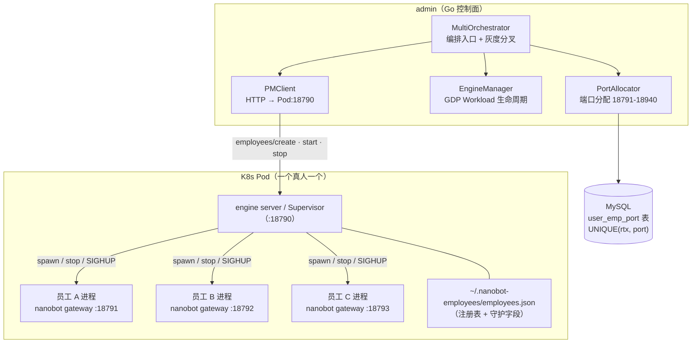

# 重点 22：多进程数字员工架构与 K8s 编排

> **一句话亮点（简历可直接用）**：设计并落地了"每个数字员工 = 独立 Agent 进程"的多进程运行时架构：engine 侧实现进程 Supervisor（崩溃重启 + 熔断 + 期望状态 reconcile），admin 侧实现基于 DB 唯一键的跨 Pod 安全端口分配器与 K8s Workload 编排（GDP），将部署单元从"一员工一 Pod"演进为"一真人一 Pod 多子进程"，支撑数百数字员工在同平台 7×24 运行且故障相互隔离。

## 为什么这是一个值得重点介绍的难点

"数字员工平台"听起来就是"跑几个 LLM 脚本"，真正的工程难度在**运行模型**的选择上：几十个、几百个 Agent 实例跑在一起，一个员工的 LLM 死循环、内存泄漏、进程崩溃，绝不能把其他员工拖下水。备选方案有三类：

- **线程/协程隔离**：所有员工跑在一个进程里，用 asyncio 任务区分。隔离性最差——一个员工的同步阻塞调用卡死事件循环，全员停摆；Python GIL 下 CPU 密集型工具（如文件解析）还会互相抢核；
- **一员工一 Pod（容器）**：隔离性最好，但资源开销巨大——每个 Pod 都要一份 Python 运行时 + 基础镜像，几百个员工就是几百个 Pod，K8s 调度与成本都不可接受；
- **进程级隔离（本项目选择）**：每个真人用户一个 Pod，Pod 内一个 Supervisor 进程（engine server）管理多个员工子进程。隔离性上，子进程崩溃只影响单个员工；资源上，一份运行时服务多个员工；运维上，Pod 数量与用户而非员工挂钩，规模可控。

难点随之转移到新问题上：**端口怎么分**（多进程共享 Pod 网络命名空间，端口冲突即事故）、**进程怎么管**（崩溃自动拉起、反复崩溃要熔断、Pod 重启要按期望状态恢复）、**编排怎么灰度**（新旧两套部署模式并存，按用户维度切换）。这些都是本文的实际设计点。

## 先备知识：本文涉及的术语与变量

| 术语/变量 | 含义与示例 |
|---|---|
| **数字员工 / bot / employee** | 一个独立的 AI Agent 实例，有自己的配置（模型、Prompt、渠道）、会话历史和工作区。代码里三个词混用，示例 ID：`"emp-backend-01"`。 |
| **nanobot gateway** | 员工进程的运行形态：一条 `ams-nanobot gateway --config /path/config.json` 命令拉起一个员工，监听自己的 HTTP 端口接收消息。 |
| **engine server / Supervisor 宿主** | engine 包内的管理进程（`engine/nanobot/server/server.py`），监听管理端口 18790，承担员工生命周期 API（职责 A）、SSE 代理网关（职责 B）、Chat UI API（职责 C）、历史 API（职责 D）四大职责。它同时是子进程的"保姆"。 |
| **ProcessManager** | engine 侧的进程管理器（`engine/nanobot/server/process.py`），负责 spawn/stop 子进程、日志透传、端口池。 |
| **Supervisor** | engine 侧守护循环（`engine/nanobot/server/supervisor.py`），独立于 ProcessManager：周期探活、崩溃退避重启、滑动窗口熔断，两者通过回调解耦。 |
| **PortPool** | engine 侧端口池（`process.py:66`），固定范围 18791~18890（`process.py:54-55`），带锁的显式 acquire/release，替代"bind 一下试试"的探测式分配。 |
| **EmployeeRegistry / employees.json** | engine 侧员工注册表（`engine/nanobot/server/employees.py`），JSON 文件持久化在 `~/.nanobot-employees/employees.json`，记录每个员工的 pid、port、config_path 及守护字段。内存缓存 + tmp+rename 原子写盘。 |
| **desired_state** | 员工记录字段，`"running"` 或 `"stopped"`。Pod 重启后 Supervisor 按它做 reconcile（该拉起的拉起），默认 `stopped` 保证保守行为（`employees.py:24-28, 50-54`）。 |
| **crash_loop（熔断标志）** | 员工记录字段。一个员工反复崩溃时置 True，Supervisor 停止自动拉起，避免"崩溃→重启→再崩溃"的死循环打满 CPU（`employees.py:28`）。 |
| **instances.json** | 多实例注册表（`~/.nanobot/instances.json`），运行中的 gateway 实例自注册（含 configPath、PID、端口、bot 名称），供工具发现；读取时通过 `os.kill(pid, 0)` 探测清理已退出的僵尸条目（`engine/nanobot/config/loader.py:23`）。K8s 环境下跳过注册（`engine/nanobot/cli/commands.py:1487`）。 |
| **admin platform 包** | admin 侧的编排层（`admin/internal/platform/`），包含 EngineManager（K8s Workload 生命周期）、PMClient（与 Pod 内 Supervisor 通信的 HTTP 客户端）、PortAllocator（端口分配）、MultiOrchestrator（编排入口）。 |
| **GDP** | 腾讯内部的 K8s workload 管理平台，admin 通过 GDPClient 对 Workload 做 ScaleUp/ScaleDown、复制模板创建等操作（`admin/internal/platform/client.go:22`）。 |
| **PortAllocator** | admin 侧端口权威分配器（`admin/internal/platform/port_allocator.go:47`）。端口区间 18791~18940（`:26-31`），按 (rtx, employee_id) 固定分配、一旦分配永不变化。 |
| **PMClient** | admin 调 Pod 内 Supervisor 管理 API 的客户端（`engine_pm_client.go:35`），默认管理端口 18790，默认超时 20 秒。 |
| **RTX** | 腾讯内部员工账号名，多进程模式按"真人 RTX"聚合 Workload——一个真人一个 Pod。 |

## 技术剖析

### 整体拓扑



### 进程级隔离的实现细节

engine 侧 `ProcessManager` spawn 子进程时用了两个关键手段（`process.py:1-24` 模块注释）：

1. **`start_new_session=True`**：子进程脱离父进程进程组，用户 Ctrl-C 停掉 server 时 SIGINT 不会传播到员工进程——否则调试 Supervisor 会误杀全部员工；
2. **三态日志透传**：调试模式 stdout 直连终端；多进程模式 stdout 接 PIPE + 后台读线程，按行加 `[emp_id]` 前缀转发并写环形缓冲（供 `kubectl logs` 聚合与 `/logs` 接口查询）；旧单员工模式直接丢 DEVNULL。

Supervisor 的守护语义由注册表字段驱动（`employees.py:24-28`）：`desired_state` 决定 Pod 重启后的 reconcile 行为，`restart_count` 累计重启次数持久化不随进程退出清零，`crash_loop` 是熔断闸——反复崩溃的员工被标记后不再自动拉起，`last_error` 留下最后一次崩溃摘要供排障。注册表采用内存缓存 + `_flush` 落盘模型，落盘用 tmp 文件 + rename 原子替换（`employees.py:83-91`），防止 Supervisor 中途被杀留下残缺 JSON。

守护循环本身（`supervisor.py`）是独立模块，与 ProcessManager 通过回调解耦，核心参数全部硬编码为可预期档位：

```python
DEFAULT_BACKOFF_STEPS: tuple[float, ...] = (1.0, 5.0, 30.0)   # 退避档位（秒）
DEFAULT_BACKOFF_RESET_AFTER: float = 30.0   # 稳定运行 30s 后重置退避
DEFAULT_BREAKER_THRESHOLD: int = 5          # 熔断阈值
DEFAULT_BREAKER_WINDOW: float = 300.0       # 滑动窗口（秒）
DEFAULT_TICK_INTERVAL: float = 5.0          # 探活周期（秒）
```

三个设计细节：退避用固定档位（1s→5s→30s 到顶复用）而非连续指数，保证 P95 恢复时间可预期；退避重置依据"已连续运行 ≥30 秒"而非"启动即重置"——进程刚起就崩是最典型的 crash_loop 信号，启动即重置会让熔断永远攒不够次数；熔断用 5 次/300 秒滑动窗口而非连续失败计数，因为 crash_loop 常表现为"起来跑几秒又挂"的交替模式。探活周期 5 秒而不是更激进，注释说明原因：请求路径上有 `_auto_spawn` 实时兜底，Supervisor 只是后台保底。

### 端口分配：从"探测式"到"权威记账式"

端口是多进程架构最脆弱的资源——两个员工绑到同一端口，后启动的直接失败，且故障表现诡异。项目里存在三代设计：

- **engine 老接口 `find_free_port`**：递增探测 + 赌 bind，存在 TOCTOU 竞态（探测成功到实际 bind 之间端口可能被抢），且无上限可能探到管理端口。仍服务 Desktop 单员工场景，保持行为不变（`process.py:9-17` 注释）；
- **engine PortPool**：固定范围 [18791, 18890] 带锁分配，支持 Pod 重启后按注册表 port 字段"预占回来"，避免旧端口被新员工抢走（`process.py:66-76`）；
- **admin PortAllocator（现行权威）**：端口语义上收到 admin——区间 [18791, 18940]，避开管理端口 18790 与 19000（`port_allocator.go:26-31`），按 (rtx, employee_id) 固定分配、永不变化，通过 `NANOBOT_HTTP_PORT` 环境变量注入子进程（`port_allocator.go:5-7, 38`）。

PortAllocator 的并发安全设计是多 Pod 部署的典型范式（`port_allocator.go:41-46, 81-130`）：**正确性靠 DB 唯一键 `UNIQUE(rtx, port)` 兜底**（跨 Pod 绝不可能分重）；**性能靠 per-RTX 进程内互斥锁**（单 Pod 内串行化）；**冲突重试用 5-30ms 随机抖动退避**（`5+rand.IntN(26)` 毫秒），最多 10 次。另有 `BatchAllocateOrGet`（`:144`）在多 bot 批量启动前先串行预分配（批量查已有 → bitmap 选空闲 → 批量 INSERT，冲突整轮重试最多 3 次），让后续并发启动全部命中"主键点查"快速路径，彻底消除冲突窗口。每一步都假设并发冲突会发生。

### 编排层：从"一员工一 Pod"到"一真人一 Pod"

admin 侧新旧模式的本质区别写在 PMClient 的注释里（`engine_pm_client.go:27-31`）：

```
· 旧：每个员工一个 Pod，Admin 通过 GDP ScaleUp/ScaleDown 启停整个 Pod；
· 新：每个真人一个 Pod，里面跑多个子进程，Admin 通过 PMClient 按
      employee_id 启停**子进程**，Pod 本身保持 replicas=1 常驻。
```

编排入口 `MultiOrchestrator`（`multiworkload.go:35-49`）把"按 RTX 聚合 Workload、调 PMClient 管子进程、记账端口"收敛为一个对象，业务层只需 `if orch.ShouldUseMultiMode(rtx) { ... }` 一行分叉。灰度开关存在 `user_profiles.multi_employee_enabled` 字段，读取失败一律降级为 false 回旧路径（`multiworkload.go:91-103`）——**可用性优先于特性**的保守语义。Workload 的创建通过 GDPClient 复制 demo 模板完成（`engine.go:57-69`），复制后立刻绑定 owner_rtx。

K8s 环境与本地环境的差异也有显式处理：本地多实例靠 `~/.nanobot/instances.json` 自注册 + `os.kill(pid, 0)` 清理僵尸条目做发现（`loader.py:8-13`）；K8s 下进程注册被容器编排取代，`NANOBOT_K8S=true` 时 gateway 跳过本地注册、退出时跳过注销（`commands.py:1487, 1753`）。

### 端口总账（跨包速查）

| 用途 | 端口 | 来源 |
|---|---|---|
| engine server 管理端口 | 18790 | 固定，分配器必须避开 |
| 员工子进程（admin 分配） | 18791–18940 | `port_allocator.go:27-28`，最多 150 个/真人 |
| 员工子进程（engine PortPool） | 18791–18890 | `process.py:54-55`，最多 100 个 |
| 6-bot demo（本地调试） | 8331–8339 | 根 `CLAUDE.md`：backend=8331, frontend=8332, pm=8333, demand=8336, test=8339, check=8338 |
| chatui / config-ui | 8888 / 9000 | 本地开发接入点 |

## 关键设计决策与权衡

1. **进程级而非线程/协程级隔离**：用内存与启动开销换故障爆炸半径的最小化。LLM Agent 的工具调用不可信（任意 shell、文件操作），协程级隔离下一个死循环就拖死全进程——这在生产上不可接受。
2. **一真人一 Pod，而非一员工一 Pod**：Pod 粒度从"员工"抬到"真人"，数量降一个数量级；真人内部员工共享 Pod 网络与存储，天然支持同用户员工间互调（Room 模式）。
3. **端口语义收到 admin，engine 不再自分配**：单一权威源消除"两边各分各的"的冲突可能；端口与员工绑定后永不变化，Pod 重启、滚动更新后 Chat 路由稳定。
4. **正确性靠 DB 约束，锁只是性能优化**：分布式系统里"锁"跨不了 Pod，唯一可信的是数据库唯一键。这是所有多实例资源分配场景的通用范式。
5. **熔断 + 期望状态，而非无限重启**：Supervisor 模式最容易犯的错误是"永远拉起"，崩溃循环会把 Pod CPU 打满连累其他员工。`crash_loop` 熔断把"自动恢复"和"人工介入"分开。

## 面试话术（怎么讲）

> 数字员工平台的核心运行模型是每个员工一个独立 Agent 进程，我从三个层面做了设计。隔离上，选进程级而非协程级——LLM 工具调用不可信，一个员工的死循环或崩溃不能拖垮其他员工；部署上，从一员工一 Pod 演进到一真人一 Pod，Pod 内 engine server 作为 Supervisor 宿主管理多个员工子进程，守护循环 5 秒探活、1/5/30 秒固定档位退避重启、稳定运行 30 秒才重置退避、5 次/300 秒滑动窗口熔断，带 desired_state 重启 reconcile。端口是多进程最脆弱的资源，我把分配语义收到 admin 侧的 PortAllocator：按真人加员工 ID 固定分配、永不变化，正确性由 MySQL 唯一键兜底，进程内锁只是性能优化，跨 Pod 冲突靠 5-30ms 随机抖动重试 10 次，批量启动前还有批量预分配消除冲突窗口。编排上通过 GDP 管 K8s Workload，新旧模式按用户维度灰度开关切换，读失败一律降级回旧路径。这套架构支撑数百员工在同平台运行，故障相互隔离。

## 可能的追问及答案

**Q：为什么不用协程？Python asyncio 一个进程跑几百个 Agent 不也行吗？**
A：三个原因。一是故障隔离：Agent 的工具调用包含任意 shell 和文件操作，协程共享内存空间，一个 bug 全灭；二是 Python 的 GIL：CPU 密集工具（解析大文件、图片处理）在协程模型下互相抢核；三是独立扩缩容与升级——进程粒度可以单独重启、单独换配置（SIGHUP 热重载），协程做不到。

**Q：一个 Pod 里最多多少员工？瓶颈在哪？**
A：端口池硬上限是 150 个/真人（18791-18940）。实际瓶颈是内存——每个 nanobot 进程是一份独立 Python 运行时加会话上下文，实测瓶颈远先于端口到达。端口区间留了扩展余量（注释说明可扩，只需避开 18790 和 19000）。

**Q：Pod 重启后员工状态怎么恢复？**
A：两层。注册表 employees.json 记录每个员工的 desired_state，Supervisor 启动时 reconcile，该拉起的按注册的 port 预占回 PortPool 再 spawn；admin 侧端口映射在 MySQL 里，不受 Pod 生命周期影响，所以 Chat 路由在重启前后完全稳定。

**Q：admin 挂了，正在运行的员工会受影响吗？**
A：不会。admin 只是控制面，员工进程由 Pod 内 Supervisor 直接守护，聊天链路（web → admin 代理 → engine）中 admin 是代理层，重启后路由信息（端口映射）从 DB 恢复。这是控制面与数据面分离的基本收益。

**Q：如果让你重新设计，会改什么？**
A：两个方向。一是把 Supervisor 的健康检查从"进程活着"升级为"语义健康"——现在崩溃能检出，但 LLM 死循环、事件循环卡死这类"活着但不干活"的状态依赖上层 stop_reason 指标间接发现，可以加应用层心跳；二是评估把端口分配推广为通用的"实例寻址注册中心"，现在端口即地址的设计在容器网络（Pod IP 漂移）场景下是简化假设，长期看服务发现更稳。

## 事实边界

- 本文基于 application/ 工作区（engine develop 2026-07-31 / admin 2026-07-28 / web 2026-07-21）核实；digi-pal/ 为 2026-05 旧快照，不作为依据（旧快照中 admin 端口区间为 18791-18890，application/ 已扩至 18791-18940 共 150 个；Supervisor 探活周期旧快照为 1s，application/ 为 5s）。
- 文中"数百员工"为设计容量量级描述，非压测数据；单 Pod 实际上限受内存约束，端口池 150 是配置上限而非实测值。
- engine PortPool（18791-18890）与 admin PortAllocator（18791-18940）区间不同是历史演进所致：多进程模式下以 admin 分配为准，engine 侧 PortPool 主要服务本地/Desktop 场景与重启预占。
- GDP 为腾讯内部 K8s 管理平台，外部等价物是原生 K8s API / Operator。
- 本地多 bot 调试（8331-8339 端口段）与云端多进程模式是两套并存的使用场景。

## 简历亮点描述（可直接引用）

- 设计"每数字员工一独立进程"的多进程运行时，实现 engine 侧 Supervisor（5s 探活、1/5/30s 退避重启、5 次/300s 滑动窗口熔断、desired_state 重启 reconcile）与缓存 + tmp/rename 原子持久化注册表，保证单员工故障不扩散；
- 实现 admin 侧权威端口分配器：DB 唯一键保证跨 Pod 正确性、per-RTX 锁优化性能、批量预分配消除冲突窗口，端口与员工绑定永不变化，路由稳定；
- 主导部署单元从"一员工一 Pod"到"一真人一 Pod 多子进程"的架构演进，设计按用户维度的灰度开关与失败降级路径，支撑平台规模化运行。

## 代码依据

- `engine/nanobot/server/server.py:1-37`（四大职责）、`engine/nanobot/server/process.py:1-24`（进程组隔离/三态日志）、`:54-55`（PortPool 区间）、`engine/nanobot/server/employees.py:1-29`（注册表与守护字段）、`:83-91`（缓存 + tmp/rename 原子写盘）
- `engine/nanobot/server/supervisor.py`（退避档位 :49-50、稳定重置 :52-54、熔断窗口 :56-58、探活周期 :60-62）
- `engine/nanobot/config/loader.py:8-23`（instances.json 注册表与僵尸清理）、`engine/nanobot/cli/commands.py:1487`（K8s 跳过注册）、`:1753`（退出注销）
- `admin/internal/platform/port_allocator.go:26-31`（端口区间 18791-18940）、`:41-46`（并发安全设计）、`:81-130`（AllocateOrGet，maxRetries=10 + 5-30ms 抖动）、`:144`（BatchAllocateOrGet）
- `admin/internal/platform/engine_pm_client.go:25-31`（新旧模式对比）、`:53-64`（管理端口契约，默认 18790 / 20s 超时）
- `admin/internal/platform/multiworkload.go:35-49`（编排入口）、`:91-103`（灰度开关降级）
- `admin/internal/platform/engine.go:57-69`（复制多进程 demo 模板绑定 owner_rtx）、`admin/internal/platform/client.go:22`（GDPClient）
- 根 `CLAUDE.md`（运行时端口分配表）
