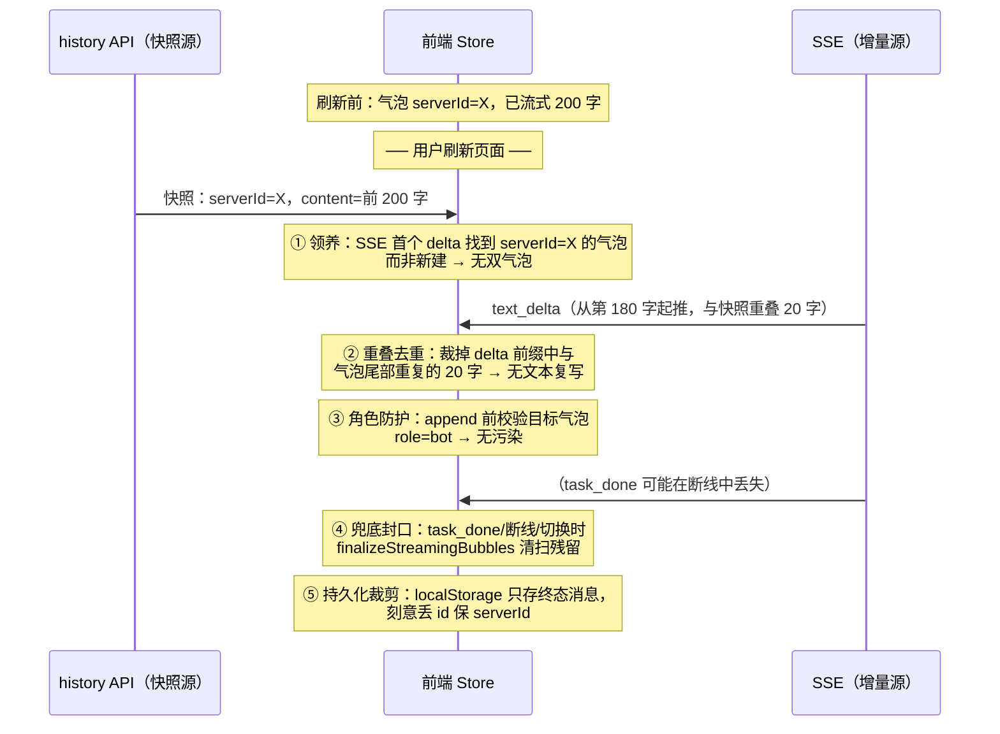

# 重点 23：流式恢复防御体系

> **一句话亮点（简历可直接用）**：为"页面刷新/断线重连后，服务端历史快照与 SSE 实时流重叠"这一流式系统经典难题，设计了五道正交幂等的纵深防御体系——尾部气泡领养、追加文本重叠去重、角色污染防护、终态兜底封口、持久化字段裁剪；任何一道防线失效都有下游防线自愈，将一类高频疑难 UI bug 系统性清零。

## 为什么这是一个值得重点介绍的难点

刷新一个正在流式输出的聊天页面，看似简单的操作，在数据层面是一次**两个数据源的危险会师**：

- **数据源 A（历史快照）**：`onMounted` 时前端从 history API 拉回 engine 已落盘 JSONL 的内容，其中包含当前正在运行任务的 bot 回复**前缀**（engine 每个工具轮都增量落盘一次）；
- **数据源 B（SSE 增量）**：SSE 重连成功后，Redis Pub/Sub 从**它自己的进度**继续推 delta——这个进度与 JSONL 落盘进度并不对齐。

两个源对"同一条 bot 回复"的认知存在三种偏差：**身份偏差**（A 里的条目和 B 里的流，是同一 turn 吗）、**内容偏差**（A 已落盘到第 100 字，B 从第 80 字开始推，中间 20 字重复）、**状态偏差**（A 说这条还在流式，B 的 task_done 帧可能在断线期间已经丢了）。每一种偏差处理不好就是一个肉眼可见的 bug：双气泡、中段文本复写、"正在思考"永远转圈、bot 回复写进用户气泡。

这类问题的可怕之处在于**单次修复不可靠**——你修了双气泡，下周冒出文本复写；修了复写，又冒出角色污染。本项目的答案是防御纵深（defense in depth）：不追求某一道防线完美，而是部署五道**正交、幂等**的防线，让任何一个环节的失效都被下游接住。

## 先备知识：本文涉及的术语与变量

| 术语/变量 | 含义与示例 |
|---|---|
| **快照（snapshot）** | 刷新后从 history API 拉到的消息列表，内容是 engine JSONL 的已落盘前缀。示例：bot 完整回复 500 字，快照里可能只有前 200 字。 |
| **delta** | SSE 推送的增量文本片段，如 `{"type":"text_delta","delta":"第三步："}`。 |
| **气泡 / Message** | 前端一条消息对象。关键字段：`id`（运行时 id，如 `m12`）、`serverId`（服务端权威 UUID）、`role`（user/bot/system）、`streaming`（是否流式中）、`segments`（文本与工具卡片的有序数组）、`hidden`（软删标记）。 |
| **领养（adopt）** | SSE 首个 delta 到达时，不新建气泡，而是找到 history 合入的那条同身份气泡，把它的 `streaming` 置 true、后续 delta 继续写进它。 |
| **_streamingMsg** | useDMPush 闭包内的指针（`useChat.ts:1860`），记录"当前 SSE 流正往哪个气泡写"。刷新后它是 null，需要重建——领养就是重建的方式。 |
| **_msgId 计数器** | 前端模块级自增计数器，分配 `m{N}` 形式的运行时 id。**刷新后从 0 重启**——这是 id 冲突 bug 的根源。 |
| **角色污染** | 指 bot 的流式内容被错误地 append 到 role=user/system 的气泡里（用户气泡末尾冒出 bot 回复正文）。成因就是 `_msgId` 重置后 `_streamingMsg.msgId` 撞上了恢复出来的用户气泡 id。 |
| **finalize / 封口** | 把气泡的 `streaming` 从 true 翻为 false 的终态操作。残留未封口的 streaming 气泡会让 UI 永远显示"正在思考"。 |
| **MIN_OVERLAP** | 常量 4（`web/src/stores/chat.ts:1262`）。重叠去重的最小公共子串长度：低于 4 容易误伤 LLM 正常重复片段（"的""了""。"），高于 10 又会漏掉常见 bug 区间，4 是经验平衡点。 |
| **task_done** | 任务终态事件帧。刷新恢复场景下它可能在断线窗口丢失——这是"僵尸 streaming"的来源。 |
| **localStorage 持久化** | 前端把已完成消息序列化存 localStorage（`nanobot:messages:{sessionId}` 前缀），刷新后在 history API 返回前先把上次内容摆出来，避免白屏。 |

## 技术剖析

### 会师时刻的全景



### 防线一：尾部气泡领养（`_tryAdoptTailBotBubble`）

SSE 重连后第一个 delta 到达时，`_ensureMsg`（`useChat.ts:1870`）发现 `_streamingMsg` 为 null，此时若无脑 `addBotMessage` 会产出第二条气泡——快照气泡冻结在原地，新气泡从零开始流，用户看到"同一回复出现两次"。领养逻辑（`useChat.ts:1946-1981`）按优先级找可接管的气泡：

1. **serverId 精确匹配**：从后往前扫，找 `role=bot && !hidden && serverId === chunk.messageId` 的气泡——这就是同一个 turn，最精确；
2. **尾部启发式回退**：session 末尾消息是 `role=bot`、`botId` 匹配、且（`streaming=false` 的落盘快照，或 `streaming=true` 的空壳占位）——对应"loadHistory 刚合入快照"的典型刷新场景。

领养成功后把 `streaming` 置 true、`toolCount` 取已有 tool segment 数量（防止后续 `addToolCall` 的 index 冲突，`useChat.ts:1913-1915`），SSE 后续 delta 全部接力写进这同一条气泡。

### 防线二：追加文本重叠去重（`appendBotText`）

领养解决了"两个气泡"，但还有一个更隐蔽的问题：快照落了 200 字，SSE 从第 180 字继续推（落盘进度滞后于推送进度），直接拼接就是 "abc...xyz" + "xyz...end"——中段 20 字被复写一次。`appendBotText`（`stores/chat.ts:1261-1279`）在每次追加前做"末尾后缀 vs 新 delta 前缀"的最长公共子串检测：

```typescript
const prev = last.content ?? ''
const MIN_OVERLAP = 4
let incoming = text
if (prev.length >= MIN_OVERLAP && incoming.length >= MIN_OVERLAP) {
  const maxK = Math.min(prev.length, incoming.length)
  let overlap = 0
  for (let k = maxK; k >= MIN_OVERLAP; k--) {
    if (prev.endsWith(incoming.slice(0, k))) {
      overlap = k
      break
    }
  }
  if (overlap > 0) {
    incoming = incoming.slice(overlap)  // 裁掉重叠前缀再 append
  }
}
```

`MIN_OVERLAP = 4` 的取值注释（`chat.ts:1257-1260`）写明了权衡：低于 4 会误伤 LLM 正常重复（"的""了""。"这类单字重复太常见），高于 10 会漏掉真实重叠区间。正常非恢复场景几乎永不触发，触发时打 warn 日志留监控线索。

### 防线三：角色污染防护（计数器抬升 + role 双岗哨）

这条防线防御的是最诡异的一类 bug：用户气泡里冒出 bot 回复。根因是 `_msgId` 计数器刷新后从 0 重启，而恢复/合并路径上存在多个 id 分配源（`m{K}` 与历史专用的 `h{K}`），一旦分配撞车，`_streamingMsg.msgId` 可能指向一条 role=user 的消息，后续 `appendBotText` 就把 bot 内容写进了用户气泡。

防护是双层结构（`stores/chat.ts:40-69` 注释完整记录了 bug 史）：

- **源头防护 `_bumpMsgIdPast`**（`chat.ts:56-69`）：每个可能新增 `m{K}` id 的入口（addBotMessage / addUserMessage / restorePersistedMessages 等六个入口）先扫描全部 session 把计数器抬到现存最大 id 之上，保证 `newId()` 永远分配全局唯一 id；
- **落点防护 role guard**：所有写入 action 的入口校验目标角色，`appendBotText`（`chat.ts:1241-1244`）、`updateBotMessage`（`chat.ts:1175-1178`）、`addToolCall` 等一律 `if (msg.role !== 'bot') { warn; return }`——即使上游 id 撞车，污染也写不进去，上层（`_ensureMsg` 的 stale 检测，`useChat.ts:1883-1890`）再自愈重建气泡。

### 防线四：终态兜底封口（`updateBotMessage(done=true)` + `finalizeStreamingBubbles`）

`task_done` 帧在断线窗口丢失后，气泡会永远卡在 streaming=true（"正在思考"转圈到世界尽头），更糟的是残留的 `done:false` 工具卡片永远显示"执行中"。两道封口机制：

- **单气泡封口**（`chat.ts:1195-1212`）：`updateBotMessage` 收到 `done=true` 时，把气泡内所有未完成 tool segment 统一置 done——engine 后端其实已把工具标记完成并落盘，只是 tool_done 帧没到前端，这些残留视为异常遗留统一收尾；
- **全 session 清扫 `finalizeStreamingBubbles`**：A/B 两路——全空壳软删（hidden=true），有部分内容的仅翻 streaming flag 保留气泡 id（让 mergeHistory 后续用 server 完整内容覆盖补齐）。它在 task_done（`useChat.ts:2409-2414`）、订阅停止、chatId 切换（`useChat.ts:2070-2074`）、断线异常（`useChat.ts:2467-2486`）四个入口都会被调用。

### 防线五：持久化的字段裁剪（`_serializeMessage`）

localStorage 持久化是最容易"随手全量 JSON.stringify"的地方，但本项目刻意做了字段选择（`chat.ts:1871-1896`）：

- **丢 `id`**：运行时 `m{N}` 在刷新后必然撞车（计数器从 0 重启），持久化它等于把炸弹埋进下次启动。反序列化时一律 `newId()` 发新号（`chat.ts:1905-1907`）；
- **保 `serverId`**：服务端权威 UUID 必须跨过刷新存活，否则恢复后的消息在 `_mergeMessages` 里全部落不到 ID-match 主路径，退回启发式（`chat.ts:1887-1890` 注释）；
- **丢瞬态字段**：`streaming`、`hidden`、`lastEventAt`、`cancelled` 一律不存——持久化层只认终态，流式状态必须通过 SSE 重建，不允许从磁盘"复活"一个僵尸流式态。配合只持久化"已完成、非 hidden"消息（`chat.ts:1936-1938`）和 chatId 安全闸（chatId 不匹配直接清空，`chat.ts:2019-2020`），把持久化引入的二手状态降到最低。

### 为什么是"五道"而不是"一道大的"

这五道防线各自防御的失效模式不同、触发时机不同、且**每一道都幂等**（重复执行无副作用：领养过的气泡不会重复领养，去重对已对齐的文本是 no-op，封口对已封口气泡跳过）。这意味着它们可以独立失效、独立修复：领养漏了（serverId 缺失的老数据），重叠去重还在；去重没拦住（重叠不足 4 字符），至少不会写错气泡（role guard）；全都漏了，task_done 的 finalize + 3 秒后 history 重拉做最终一致性兜底。这是把"一个不可能一次修对的启发式问题"转化为"一组各自简单、组合可靠的小机制"。

## 关键设计决策与权衡

1. **幂等性优先于精确性**：每道防线都允许"多执行一次"，不允许"执行错一次"。重叠去重宁可裁不掉（不足 4 字符漏检）也不误裁（误伤正常文本）。
2. **防护落在写入点而非读取点**：role guard 加在 action 入口而非渲染层——渲染层有 N 个消费方，写入点只有一个，防御成本最低。
3. **软删优于硬删**：空壳气泡 `hidden=true` 而非 remove，保留排查线索且避免响应式引用悬空（`_streamingMsg` 闭包指针可能还指着它）。
4. **持久化做减法**：凡是可以从服务端重建的状态一律不持久化。localStorage 是"白屏急救包"而非第二数据源。
5. **所有防线带 warn 日志**：防御代码静默生效会掩盖上游 bug，每条防线触发都打日志，把"防线拦截率"变成可观测信号。

## 面试话术（怎么讲）

> 刷新一个正在流式输出的聊天页面，本质是两个进度不对齐的数据源——history 快照和 SSE 增量流——在前端会师。我把它拆成身份、内容、状态三类偏差，部署了五道正交幂等的防线：第一道尾部气泡领养，SSE 首帧按 serverId 精确匹配或尾部启发式接管快照气泡，消灭双气泡；第二道追加文本重叠去重，末尾后缀对新 delta 前缀做最长公共子串检测，4 字符阈值裁掉重复段；第三道角色污染防护，id 计数器抬升加所有写入 action 的 role 岗哨，根治 bot 内容写进用户气泡的诡异 bug；第四道终态兜底封口，done=true 时统一收尾残留工具卡片，四个入口都会触发全 session 清扫；第五道持久化字段裁剪，localStorage 刻意丢运行时 id、保 serverId、丢一切瞬态字段。设计要点是每道防线幂等且独立失效可自愈——这是防御纵深思想在前端状态管理上的落地。

## 可能的追问及答案

**Q：为什么不在服务端保证 SSE 和 JSONL 进度对齐，而要前端做这么多防御？**
A：理论上可以（比如 SSE 也走持久化通道），但那要把 Redis Pub/Sub 换成 Stream 并在服务端做断点续传，基础设施复杂度上一个台阶。前端防御的成本是一个文件的纯函数逻辑，且对网络抖动、跨容器切换等其他场景同样有效。是成本收益的选择，不是能不能的问题。

**Q：4 字符的重叠阈值可靠吗？会不会误判？**
A：会漏判（重叠 3 字符以下不裁），几乎不误判。LLM 正常输出里"末尾 4 字与新 delta 开头 4 字完全相同"在非恢复场景极少出现；且即使误判，代价只是少显示 4 个重复字符——这在多数情况下本来就是重复。阈值是经验值，代码注释里写明了上下界的取舍逻辑。

**Q：id 撞车的根本解不是该用 UUID 吗？为什么还在修计数器？**
A：运行时 id 用自增计数器是为了 Vue key 的稳定和调试可读性（`m12` 比 UUID 好排查）。根本解确实是"身份只用 serverId"，前端运行时 id 只是 UI 锚点——防线五的持久化裁剪（丢 id 保 serverId）就是这个思想的体现。计数器抬升是兼容存量路径的务实修补。

**Q：这些防线会不会互相打架？**
A：设计上保证了正交：领养只管"写哪个气泡"，去重只管"写什么内容"，role guard 只管"能不能写"，封口只管"何时结束"，持久化只管"哪些状态过夜"。每道防线触发都有独立日志，线上没观察到防线间互相干扰的案例。

**Q：如果让你重新设计，会改什么？**
A：会引入显式的"流式会话状态机"替代散落的防线——把 idle / streaming / adopting / finalizing 建模成状态机，防线规则变成状态迁移的 guard 条件，可读性和可测试性都会更好。现在的形态是多代 bug 修复有机生长出来的，功能正确但认知负担偏高。

## 事实边界

- 本文基于 application/ 工作区（engine develop 2026-07-31 / admin 2026-07-28 / web 2026-07-21）核实；digi-pal/ 为 2026-05 旧快照，不作为依据。
- 五道防线是归纳视角，源码中它们分散在 useChat.ts、stores/chat.ts、useHistory.ts 多处，是多代真实 bug 修复的沉淀，非一次性设计；
- MIN_OVERLAP=4、35s 静默检测等均为经验值；
- "系统性清零"指防线体系上线后该类 bug 未再出现线上反馈，个别极端场景（如 engine 落盘严重滞后）仍依赖 task_done 后 3 秒的 history 重拉兜底。

## 简历亮点描述（可直接引用）

- 针对流式刷新恢复的快照/增量重叠问题，设计五道正交幂等的纵深防御体系（气泡领养、重叠去重、角色防护、终态封口、持久化裁剪），将一类高频疑难 UI bug 系统性清零；
- 设计"末尾后缀 vs 新 delta 前缀"最长公共子串去重算法，4 字符阈值平衡误伤与漏检，正常路径零开销；
- 建立"运行时 id 与权威 id 分离"的前端状态模型：localStorage 持久化刻意丢弃瞬态字段与运行时 id、仅保留 serverId，从源头消除跨会话 id 冲突。

## 代码依据

- `web/src/composables/useChat.ts:1870-1928`（_ensureMsg 与 stale 自愈）、`:1946-1981`（_tryAdoptTailBotBubble 领养双优先级）、`:2394-2437`（task_done 封口 + 延迟补拉）、`:2467-2486`（断线 finalize）
- `web/src/stores/chat.ts:56-69`（_bumpMsgIdPast）、`:1233-1291`（appendBotText 重叠去重 + role guard）、`:1169-1212`（updateBotMessage done 封口残留 tool）、`:1871-1896`（_serializeMessage 字段裁剪）、`:1905-1920`（_deserializeMessage 重发号）、`:1936-1938`（只持久化终态消息）
