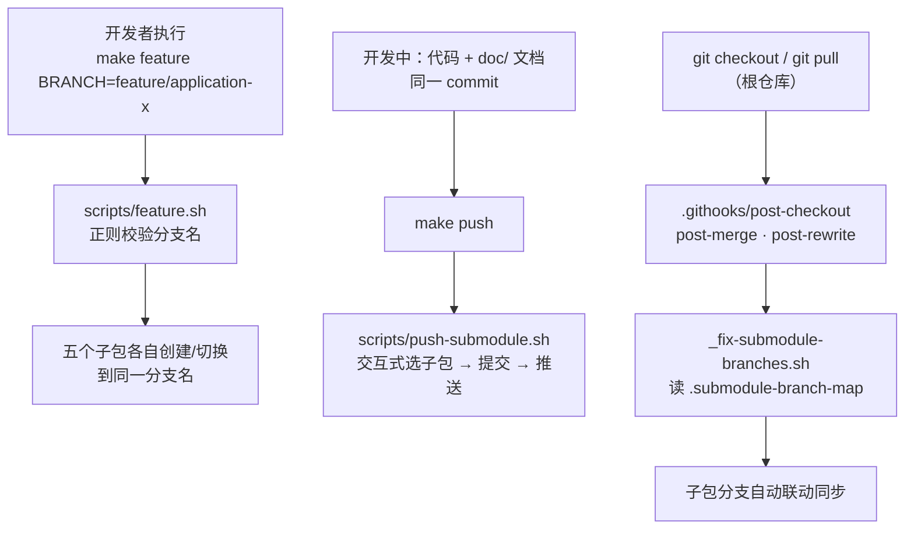
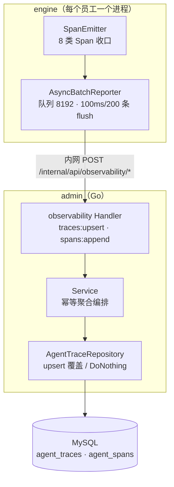

# 重点 24：工程化实践 —— monorepo 工作流与可观测性

> **一句话亮点（简历可直接用）**：为五语言/五子包的 Agent 平台设计了基于 Git Submodule 的 monorepo 工作流——根 Makefile 统一命令、分支命名正则校验、githooks 实现跨子包分支联动、文档与代码同 commit 的文档驱动开发；同时为 Agent 运行时从零实现轻量链路追踪体系（Trace/Span 模型 + 主链路零阻塞的异步批量上报 + 服务端幂等写入双表），让"Agent 卡死"从玄学变成可归因的监控指标。

## 为什么这是一个值得重点介绍的难点

工程化不是"配套设施"，在这个项目里它直接决定两件事能否成立：

**第一，五个子包如何像一个团队一样协作。** 项目是 Go（admin）+ Python（engine）+ TypeScript×3（web/desktop/vscode-plugin）的多语言组合，拆成五个独立 Git 仓库（各自有独立 MR 流程），但一次业务改动经常横跨三个子包（比如"消息 ID 透传"要同时改 engine 的 SSE 帧、admin 的代理、web 的合并算法）。没有统一工作流时，子包分支漂移、提交不同步、文档过期是必然结局。

**第二，Agent 系统如何被观测。** 普通 Web 服务的可观测性是"请求-响应"模型，而 Agent 一次用户消息可能触发 80 轮 LLM 调用、几十次工具执行、跨多个子 Agent——没有链路追踪，线上看到"Agent 卡住"时连它在第几轮、调哪个工具、烧了多少 token 都无从得知。但接入重型 APM（如完整 OpenTelemetry SDK）对"每员工一进程"的多进程架构又是不可承受之重。

本文分别讲这两个问题的落地：monorepo 工作流（协作侧）与自研轻量可观测体系（运行时侧）。

## 先备知识：本文涉及的术语与变量

| 术语/变量 | 含义与示例 |
|---|---|
| **Git Submodule（子模块）** | Git 的仓库嵌套机制：根仓库不保存子包代码，只保存"子包仓库地址 + 当前指向的 commit"。本项目五个子包（engine/desktop/web/admin/vscode-plugin）都是 submodule，根仓库是纯聚合入口，不承载业务代码。 |
| **.submodule-branch-map** | 根仓库维护的分支映射文件：定义"根仓库的某分支对应各子包的哪分支"，是跨包分支联动的规则源。当前内容为 `master=master`、`develop=develop`、`release-pre=release-pre`、`release=release` 四条精确匹配规则。 |
| **post-checkout / post-merge / post-rewrite hook** | `.githooks/` 下的三个 Git 钩子。根仓库切换分支或拉取后自动触发，调用 `_fix-submodule-branches.sh` 按映射表把所有子包同步到对应分支。需 `make setup` 配置 `core.hooksPath` 后生效（`scripts/setup.sh:20-24`）。 |
| **make feature / make push** | 根 Makefile 统一命令。`make feature BRANCH=feature/application-xxx` 让所有子包切到同一 feature 分支；`make push` 交互式选择子包、填写 commit message、提交推送（`scripts/push-submodule.sh` 是唯一提交入口）。 |
| **文档驱动开发** | 项目规约：代码变更与子包 `doc/` 目录的功能文档更新必须在**同一个 commit** 提交（根 `CLAUDE.md:181, 247`）。 |
| **Trace（链路）** | 一次完整任务（一条用户消息 → Agent 处理完成）的追踪记录，对应 admin `agent_traces` 表一行。含总轮数、总 token、总成本、耗时、终态等汇总字段。 |
| **Span（跨度）** | Trace 内的一个原子操作记录：一次 LLM 调用、一次工具执行、一次 MCP 调用等，对应 `agent_spans` 表一行。8 种类型：`trace_root / iteration / llm_call / tool_call / mcp_call / hil_wait / subagent / finalize`（`engine/nanobot/observability/span_emitter.py:26-34`）。 |
| **SpanEmitter** | engine 侧发射器，把 Trace/Span 记录"塞入异步上报通道"，主链路零阻塞。字段命名借鉴 OpenTelemetry GenAI 语义约定，但**刻意不接入 OTel SDK**（`span_emitter.py:9-13`）。 |
| **AsyncBatchReporter** | engine 侧异步批量上报器（`engine/nanobot/observability/reporter.py:78`）。内存队列 + 后台 task 定时批量 POST 给 admin。 |
| **_QUEUE_MAX / _BATCH_MAX_ITEMS / _FLUSH_INTERVAL_S** | 上报器三个核心参数（`reporter.py:38-40`）：队列上限 8192 条、单批最多 200 条、每 0.1 秒 flush 一次。可用环境变量覆盖。 |
| **traces:upsert / spans:append** | admin 侧两个写入端点（`admin/internal/api/router.go:334-335`）：trace 逐条 upsert（OnConflict 覆盖统计），span 批量 INSERT（主键幂等）。 |
| **幂等写入** | 同一条数据写多次与写一次效果相同。重试、多进程重复上报都不会产生脏数据——这是"允许失败重试"的前提。 |

## 技术剖析

### monorepo 工作流：五个仓库，一套动作



工作流的三个关键机制：

**1. 分支名正则强约束**。根 `CLAUDE.md:185-225` 规定全项目只允许六种分支形态，用正则在校验脚本里强制执行：

```
^(master|develop|release|release-pre|feature\/application-\w+|fix\/application-\w+)$
```

`feature/login`（缺 application- 前缀）、`release-v2`（不在枚举内）这类名字在脚本层直接被拒（`scripts/feature.sh:23` 的 `^(feature|fix)/application-[a-zA-Z0-9_]+$` 校验、`scripts/push-submodule.sh:10` 的 `BRANCH_REGEX` 全量校验）。约束的价值在于：分支名本身成为机器可读的元数据——hook 可以根据名字决定子包联动行为，MR 机器人可以按前缀路由评审人。

**2. hook 驱动的分支联动**。`make setup` 把 `core.hooksPath` 指到 `.githooks/`（`scripts/setup.sh:20`），此后根仓库每次 checkout/merge 都自动触发 `_fix-submodule-branches.sh`：从 `.submodule-branch-map` 精确匹配当前根分支对应的子包分支，然后 `git submodule foreach` 逐个 fetch + checkout + pull（`.githooks/_fix-submodule-branches.sh:11-37`）；未匹配到规则的分支保持子包现状不变（`:19-20` 的兜底）。开发者不需要记"改了根分支还要同步子包"这种规程——**规程被编码进工具，而不是依赖人的自觉**。

**3. 提交唯一入口**。根仓库不追踪子包 SHA 变更，所有提交通过 `make push` → `push-submodule.sh` 完成，commit message 强制 `<type>: <描述>` 格式（feat/fix/refactor/docs/chore/style/perf 七种，根 `CLAUDE.md:167-179`）。最有特色的一条规约是**文档与代码同 commit**：新增功能必须在子包 `doc/` 新增功能点文档并更新目录，修改功能必须同步更新条目——这让"文档过期"这个慢性病在流程上被根治：文档不过期不是靠提醒，而是因为不过期的 MR 不合规。

### 可观测性：为 Agent 运行时定制的轻量链路追踪

#### 数据模型：Trace 汇总 + Span 明细

Span 类型刻意收敛为 8 类基础语义（`span_emitter.py:26-34`），注释明确"新增工具/编排时不要扩枚举，改为往 metadata 加字段"——枚举稳定意味着 admin 侧的存储、查询、UI 渲染都不用随业务演进返工。Trace 状态机覆盖 Agent 特有的终态：除常规的 `OK / ERROR / TIMEOUT` 外，还有 `INTERRUPTED`（用户打断）和 `ASK_USER`（Agent 暂停等用户作答，`span_emitter.py:37-43`）——后者是普通 Web 追踪里不存在、Agent 系统必须有的状态。采集侧按三层组合落地（engine `observability/` 目录）：`provider_decorator.py`（LLM Provider 装饰器）、`tool_intercept.py`（Tool/MCP 入口拦截）、`runner_hook.py`（AgentHook），辅以 `trace_context.py`（上下文）、`subagent_link.py`（父子 Trace 链接）等模块。

#### 上报侧：主链路零阻塞

`AsyncBatchReporter` 的设计要点（`reporter.py:7-17` 模块注释）：

```python
_QUEUE_MAX = 8192          # 内存队列上限，超载丢旧数据
_BATCH_MAX_ITEMS = 200     # 单批最多 200 条
_FLUSH_INTERVAL_S = 0.1    # 每 100ms flush 一次
_MAX_RETRY = 3             # POST 失败重试 3 次后 drop
```

四条防线保证"观测绝不拖累业务"：enqueue 同步入队即返回、不抛异常；队列满时丢最旧数据（`popleft`）并打 warn 指标（30 秒节流，`reporter.py:109-124`）；后台 task 在事件循环上批量 flush（`_bg_flush_loop`，HTTP 超时 connect 2s/read 5s）；失败重试 3 次后 drop——**数据已从队列出列就不回滚**，宁可丢观测数据也不背压主链路。端点发现复用现有的 admin base 解析链（环境变量 → 运行时注册），不引入新配置。进程退出时 shutdown 触发最后一次 best-effort flush（`reporter.py:168-177`）。

#### 写入侧：幂等聚合双表

admin 侧两个端点（`router.go:326-335`）对应两种幂等策略：

- `traces:upsert`：逐条 upsert，冲突时覆盖统计字段——因为同一个 Trace 会被多次上报（任务开始时 status=RUNNING 一条，结束时 status=OK + 完整汇总一条，ASK_USER 暂停时中间态一条），后来者应覆盖先者的统计值（`admin/internal/services/observability/service.go:125-148`）；
- `spans:append`：批量插入，`OnConflict + DoNothing` 等价 INSERT IGNORE（`admin/internal/repositories/agent_trace_repo.go:110-111`）——span 是不变事实，重复插入直接忽略。

多进程架构下同一 turn 可能被 engine 进程内多处各上报一次，去重依赖以 turn 级 `assistant_message_id` 为首选键构造的 report_id（`engine/nanobot/channels/http.py:742-748`）——与重点 21 的服务端权威 ID 是同一套身份体系的复用。



#### 为什么自研而不接 OpenTelemetry

`span_emitter.py:12-13` 的注释写明：字段命名借鉴 OTel GenAI 语义约定，但不接 OTel SDK。原因是部署形态：每个数字员工是独立 Python 进程，可能成百个实例，OTel SDK + Collector 的sidecar/daemon 体系对单员工进程太重；且 Agent 语义（iteration、ask_user、tool_call 嵌套）需要定制模型，与其在 OTel 框架里做大量 adapter，不如直接用 HTTP + JSON 上报到自家 admin，存储查询一体。这是一个"标准 vs 适配"的典型权衡——借鉴标准的词汇表，放弃标准的运行时。

## 关键设计决策与权衡

1. **Submodule 聚合而非 monorepo 实体合并**：五个子包保留独立仓库与 MR 流程（符合组织内代码权限边界），用根仓库 + hook 解决联动问题。代价是工作流复杂，用 Makefile 统一入口来对冲。
2. **规约工具化**：分支命名、提交格式、文档同步这些"靠自觉必然失守"的规则，全部编码进脚本和 hook，让违规在本地就失败，而不是到评审才暴露。
3. **观测数据可靠性等级低于业务数据**：队列满丢旧数据、重试耗尽 drop、shutdown best-effort——观测系统的失败模式被刻意设计为"静默降级"，绝不阻塞或拖垮被观测对象。
4. **幂等写入使重试安全**：上报方可以无脑重试，正确性由服务端 upsert/主键保证。这是分布式数据管道的标准分工。
5. **枚举封闭 + metadata 开放**：Span 类型冻结为 8 类保证存储与 UI 稳定，扩展信息走 metadata 字典，兼顾演进灵活性。

## 面试话术（怎么讲）

> 工程化上我负责两条线。一是 monorepo 工作流：项目是 Go、Python、三个 TypeScript 共五个独立仓库的 submodule 聚合，我设计了根 Makefile 统一命令入口、分支命名正则校验、githooks 跨子包分支联动，以及"代码与 doc/ 文档同 commit"的文档驱动开发规约——核心思想是规约工具化，让违规在本地脚本层就失败，而不是靠评审和自觉。二是 Agent 运行时的可观测性：普通 APM 对"每员工一进程"的部署形态太重，我从零实现了轻量链路追踪——engine 侧 SpanEmitter 定义 8 类封闭枚举的 Span 模型，AsyncBatchReporter 用 8192 条内存队列加 100ms/200 条的批量 flush 做到主链路零阻塞，超载丢旧数据、失败重试三次后 drop，观测绝不拖累业务；admin 侧 traces 走 upsert 覆盖统计、spans 走主键幂等插入，多进程重复上报靠 turn 级消息 ID 去重。这套体系让"Agent 卡死"这类问题从玄学变成可按 stop_reason、按工具、按 token 维度归因的监控指标。

## 可能的追问及答案

**Q：五个独立仓库为什么不直接合成一个 monorepo？**
A：组织约束加技术权衡。子包在组织内有独立的代码权限和 MR 评审流，合并仓库会破坏权限边界；且五个技术栈的构建体系完全不同（Go modules / pip / 三个 npm），单一仓库的构建编排收益有限。Submodule + hook 的方案用较小的工具成本拿到了"跨包原子演进"的核心收益。

**Q：文档同 commit 会不会拖慢开发？**
A：短期多写几百字，长期省的是"代码和文档对不上"的排查成本。关键是文档粒度被约束为"功能点说明"而非设计长文，单点更新成本很低；且规约让文档始终保持"可信任"状态，后来者的阅读效率是复利。

**Q：观测数据丢失怎么办？比如队列溢出。**
A：设计上允许丢。观测数据的可靠性等级低于业务数据——队列溢出说明上报通道已经异常，此时拖累主链路才是最大事故。丢失有 warn 日志和 drop_total 计数，可以监控"观测系统自身的健康度"。关键路径的计量计费不走这条通道（走独立的 usage 三通道，见重点 17），观测丢失不影响计费正确性。

**Q：Span 枚举为什么不允许扩展？**
A：枚举值是存储、查询、UI 三方的硬契约。8 类语义（含 iteration、hil_wait、subagent 这些 Agent 特有类型）已覆盖 Agent 运行时的全部原子操作；新增工具只是 tool_call 的一个新 name，走 metadata 即可。枚举封闭让下游消费者可以安全地做穷举式渲染。

**Q：如果让你重新设计，会改什么？**
A：两点。一是工作流会补一个"跨子包 MR 关联"机制——现在三个子包的 MR 靠人在描述里互相引用，可以用分支名约定自动生成关联链接；二是观测侧会加采样率控制——目前全量上报，员工规模再上一个数量级后 admin 写入压力需要按 trace 采样的能力，字段模型里预留采样标记即可平滑升级。

## 事实边界

- 本文基于 application/ 工作区（engine develop 2026-07-31 / admin 2026-07-28 / web 2026-07-21；desktop 2026-05 / vscode-plugin 2026-03）核实；digi-pal/ 为 2026-05 旧快照（仅 admin/engine/web 三仓、无根仓与子模块工作流），不作为依据。
- 上报参数（8192 队列 / 200 条批 / 100ms flush）为当前默认值，均可被环境变量覆盖；具体数值是经验调优结果而非理论推导。
- "主链路零阻塞"指上报路径不阻塞 Agent 循环的 LLM/工具调用；极端情况下（事件循环整体卡死）后台 flush task 同样受影响，此时观测数据丢失但业务已另有故障。
- OpenTelemetry 对比基于本项目的多进程部署形态；对单体式服务，OTel 是更优解。
- githooks 方案要求每个开发者执行一次 `make setup`，未执行时分支联动不生效（脚本内已做提示，属已知边界）。

## 简历亮点描述（可直接引用）

- 设计五子包 Git Submodule monorepo 工作流：根 Makefile 统一入口、分支命名正则校验、githooks 跨包分支联动、代码与文档同 commit 的文档驱动开发，将协作规约全面工具化；
- 从零实现 Agent 运行时轻量链路追踪：封闭枚举 Trace/Span 模型 + 异步批量上报（8192 队列 / 100ms×200 条 flush / 超载丢弃），主链路零阻塞，观测系统失败模式为静默降级；
- 设计 admin 侧幂等写入管道（traces upsert 覆盖统计 + spans 主键幂等），以 turn 级消息 ID 解决多进程重复上报去重，支撑 Agent 行为的可归因监控。

## 代码依据

- 根 `CLAUDE.md:7-9`（根仓纯聚合不提交）、`:165-181`（提交规范与文档同 commit）、`:185-225`（分支策略与命名正则）、`:227-232`（关键文件说明）、根 `Makefile:4-56`（统一命令）、`scripts/setup.sh:20-24`（hook 配置）、`scripts/feature.sh:21-25`（分支名正则校验）、`scripts/push-submodule.sh:10`（BRANCH_REGEX 全量校验）、`.githooks/_fix-submodule-branches.sh:11-37`（分支联动核心）、`.submodule-branch-map`（分支映射规则）
- `engine/nanobot/observability/span_emitter.py:26-43`（Span 枚举与状态机）、`:9-13`（不接 OTel 的决策注释）
- `engine/nanobot/observability/reporter.py:38-43`（队列/批量/重试参数）、`:109-124`（超载丢弃）、`:142-166`（批量 flush 到 traces:upsert / spans:append）、`:197-219`（失败重试 3 次 drop）
- `admin/internal/api/router.go:326-335`（写入端点注册）、`admin/internal/services/observability/service.go:125-148`（幂等写入编排）、`admin/internal/repositories/agent_trace_repo.go:110-111`（span 主键幂等 DoNothing）
- `engine/nanobot/channels/http.py:742-748`（report_id 去重键）
