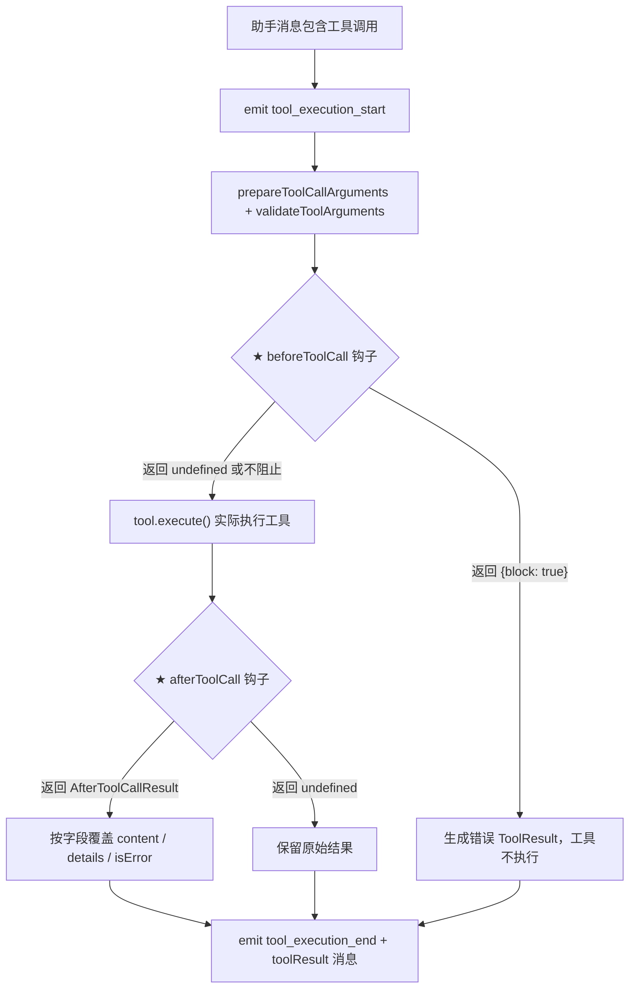

# 第 3 章附录：先读的 10 个文件 — 逐文件深度解读

> **定位**：本文档是 `ch03-reading-map.md` 的伴读文档。目标是让读者 **仅凭本文档就能掌握源码中 90% 以上的信息**，包括每个类型的每个字段、每个函数的签名与调用场景、源码注释中的关键细节。
>
> **阅读顺序**：自底向上 —— pi-ai → pi-agent-core → pi-coding-agent。底层类型是上层的地基，先读地基能让你在读到上层时自然理解 "为什么这样设计"。

---

## 第一部分：pi-ai — LLM 调用的统一抽象层

pi-ai 是整个系统中离 LLM 最近的一层。它的职责是：**把"调用一个模型"这件事抽象成一个统一的接口，屏蔽 10+ 种 provider 的差异**。上层代码（agent-core、coding-agent）永远不需要知道当前请求走的是 Anthropic API 还是 OpenAI API。

---

### 文件 1：`packages/ai/src/types.ts` — pi-ai 的类型系统

> 优先级 #6（按 ch03 排列），但按自底向上的逻辑应当最先读。

这是 pi-ai 层的"公共 API 契约"。上层代码只通过这些类型与 ai 层交互。全文约 400 行，信息密度极高。

#### 1.1 Provider 与 API 标识

```typescript
export type KnownApi =
  | "openai-completions"
  | "mistral-conversations"
  | "openai-responses"
  | "azure-openai-responses"
  | "openai-codex-responses"
  | "anthropic-messages"
  | "bedrock-converse-stream"
  | "google-generative-ai"
  | "google-gemini-cli"
  | "google-vertex";

export type Api = KnownApi | (string & {});
```

- `KnownApi`：枚举了所有内置支持的 API 协议。注意这里区分的是 **API 协议**而非厂商 —— OpenAI 就有 `openai-completions` 和 `openai-responses` 两种不同的 API 协议。
- `Api = KnownApi | (string & {})`：联合一个 `string & {}` 是 TypeScript 的经典技巧 —— 它让 IDE 对已知值提供自动补全，同时允许任意字符串（支持自定义 provider）。

```typescript
export type KnownProvider =
  | "amazon-bedrock" | "anthropic" | "google" | "google-gemini-cli"
  | "google-antigravity" | "google-vertex" | "openai" | "azure-openai-responses"
  | "openai-codex" | "github-copilot" | "xai" | "groq" | "cerebras"
  | "openrouter" | "vercel-ai-gateway" | "zai" | "mistral"
  | "minimax" | "minimax-cn" | "huggingface" | "opencode" | "opencode-go"
  | "kimi-coding";

export type Provider = KnownProvider | string;
```

- `Provider` 标识的是 **服务商品牌** —— 一个 provider 可能对应多个 API 协议（如 OpenAI 同时有 completions 和 responses）。
- 目前支持 20+ 个 provider，这解释了为什么 pi-ai 需要如此强的抽象能力。

**`Api` vs `Provider` 的关系**：`Api` 决定"用什么协议和消息格式发请求"，`Provider` 决定"请求发到哪个服务商"。`api-registry.ts` 按 `Api` 注册处理函数，`Model` 同时持有两者。

#### 1.2 Model — 模型的完整元数据

```typescript
export interface Model<TApi extends Api> {
  id: string;           // 模型标识，如 "claude-sonnet-4-20250514"
  name: string;         // 人类友好名称，如 "Claude 4 Sonnet"
  api: TApi;            // 使用的 API 协议，如 "anthropic-messages"
  provider: Provider;   // 服务商标识，如 "anthropic"
  baseUrl: string;      // API 端点 URL
  reasoning: boolean;   // 是否支持扩展思维/推理模式
  input: ("text" | "image")[];  // 支持的输入模态
  cost: {
    input: number;      // 每百万 token 的输入成本 (USD)
    output: number;     // 每百万 token 的输出成本
    cacheRead: number;  // 缓存读取成本
    cacheWrite: number; // 缓存写入成本
  };
  contextWindow: number;  // 上下文窗口大小（token 数）
  maxTokens: number;      // 最大输出 token 数
  headers?: Record<string, string>;  // 自定义 HTTP 头
  compat?: ...;           // OpenAI 兼容性配置（条件类型，见下文）
}
```

**泛型 `TApi`**：`Model` 是泛型的，这意味着当你持有一个 `Model<"anthropic-messages">` 时，TypeScript 能推断出它对应的 `compat` 类型为 `never`（因为 compat 只在 OpenAI 系 API 有意义）。这种类型安全集中在 provider/stream 边界，而不是把 Context 一路参数化到底。

**`compat` 字段**：通过条件类型按 `TApi` 决定可用的兼容性配置：
- 当 `TApi extends "openai-completions"` 时，compat 为 `OpenAICompletionsCompat`
- 当 `TApi extends "openai-responses"` 时，compat 为 `OpenAIResponsesCompat`
- 其他情况为 `never`

`OpenAICompletionsCompat` 是一个庞大的兼容性接口（约 30 行），包含：
- `supportsStore`、`supportsDeveloperRole`、`supportsReasoningEffort` 等特性探测
- `thinkingFormat`：支持 `"openai"` | `"openrouter"` | `"zai"` | `"qwen"` | `"qwen-chat-template"` 五种推理参数格式
- `openRouterRouting`、`vercelGatewayRouting`：网关特有的路由配置

**典型字面量示例**：

```typescript
const claudeSonnet: Model<"anthropic-messages"> = {
  id: "claude-sonnet-4-20250514",
  name: "Claude 4 Sonnet",
  api: "anthropic-messages",
  provider: "anthropic",
  baseUrl: "https://api.anthropic.com",
  reasoning: false,
  input: ["text", "image"],
  cost: { input: 3, output: 15, cacheRead: 0.3, cacheWrite: 3.75 },
  contextWindow: 200000,
  maxTokens: 16384,
};
```

#### 1.3 消息类型体系 — Message 联合

pi-ai 定义了三种消息角色，它们共同构成 `Message` 联合类型：

```typescript
export type Message = UserMessage | AssistantMessage | ToolResultMessage;
```

##### UserMessage

```typescript
export interface UserMessage {
  role: "user";
  content: string | (TextContent | ImageContent)[];
  timestamp: number;  // Unix 毫秒时间戳
}
```

- `content` 支持纯文本字符串或混合内容数组（文本+图片），这使得多模态输入成为一等公民。

##### AssistantMessage

```typescript
export interface AssistantMessage {
  role: "assistant";
  content: (TextContent | ThinkingContent | ToolCall)[];
  api: Api;                    // 产生此消息的 API 协议
  provider: Provider;          // 产生此消息的服务商
  model: string;               // 产生此消息的模型 ID
  responseId?: string;         // Provider 特有的响应标识符
  usage: Usage;                // Token 用量与成本
  stopReason: StopReason;      // 停止原因
  errorMessage?: string;       // 仅在 stopReason 为 "error"/"aborted" 时有值
  timestamp: number;
}
```

**content 的三种内容块**：

| 类型 | 接口 | 关键字段 |
|------|------|----------|
| `TextContent` | `{ type: "text"; text: string; textSignature?: string }` | `textSignature` 用于 OpenAI 响应的消息元数据（遗留 ID 字符串或 `TextSignatureV1` JSON） |
| `ThinkingContent` | `{ type: "thinking"; thinking: string; thinkingSignature?: string; redacted?: boolean }` | `redacted` 为 `true` 时表示思维内容被安全过滤器编辑，加密有效载荷存储在 `thinkingSignature` 中以供多轮连续性 |
| `ToolCall` | `{ type: "toolCall"; id: string; name: string; arguments: Record<string, any>; thoughtSignature?: string }` | `thoughtSignature` 是 Google 特有的不透明签名，用于重用思维上下文 |

**`Usage` 接口** —— 每条 assistant 消息都携带完整的 token 用量：

```typescript
export interface Usage {
  input: number;       // 输入 token 数
  output: number;      // 输出 token 数
  cacheRead: number;   // 缓存读取 token 数
  cacheWrite: number;  // 缓存写入 token 数
  totalTokens: number; // 总 token 数
  cost: {
    input: number;     // 输入成本（USD）
    output: number;    // 输出成本
    cacheRead: number; // 缓存读取成本
    cacheWrite: number;// 缓存写入成本
    total: number;     // 总成本
  };
}
```

- 这个结构在全局中地位特殊：它是 **成本追踪** 的基石。每次 LLM 调用完成后，Usage 随 AssistantMessage 一起返回，coding-agent 层的 footer 组件读取它来实时显示 token 消耗和花费。

**`StopReason`**：

```typescript
export type StopReason = "stop" | "length" | "toolUse" | "error" | "aborted";
```

- `"stop"`：模型正常停止输出
- `"length"`：达到 maxTokens 限制
- `"toolUse"`：模型请求调用工具（循环引擎据此判断是否需要继续循环）
- `"error"`：运行时或 API 错误
- `"aborted"`：用户主动取消

##### ToolResultMessage

```typescript
export interface ToolResultMessage<TDetails = any> {
  role: "toolResult";
  toolCallId: string;       // 对应 ToolCall.id
  toolName: string;         // 工具名称
  content: (TextContent | ImageContent)[];  // 返回给模型的内容
  details?: TDetails;       // 任意结构化详情（用于日志/UI 渲染）
  isError: boolean;         // 是否为错误结果
  timestamp: number;
}
```

- `details` 是泛型的 —— 每种工具可以在这里附带任意结构化数据。例如 edit 工具的 `details` 类型为 `EditToolDetails`（包含 diff 字符串和首个变更行号），TUI 组件读取它来渲染 diff 视图。`details` 不会发送给 LLM，它只服务于 UI 和日志。

**字面量示例**：

```typescript
const toolResult: ToolResultMessage<EditToolDetails> = {
  role: "toolResult",
  toolCallId: "toolu_01abc",
  toolName: "edit",
  content: [{ type: "text", text: "Successfully replaced 1 block(s) in src/app.ts." }],
  details: { diff: "--- a/src/app.ts\n+++ b/src/app.ts\n@@ ...", firstChangedLine: 42 },
  isError: false,
  timestamp: 1713200000000,
};
```

#### 1.4 Tool — 工具的最小定义

```typescript
export interface Tool<TParameters extends TSchema = TSchema> {
  name: string;
  description: string;
  parameters: TParameters;  // TypeBox schema
}
```

- 这是 **ai 层** 对工具的最小抽象 —— 只有名称、描述、参数 schema，没有执行逻辑。
- 它会出现在 `Context.tools` 中，告诉 LLM 可以调用什么工具以及每个工具的参数格式。
- 执行逻辑在更上层的 `AgentTool`（agent-core 层）中定义。

#### 1.5 Context — 发送给 LLM 的完整上下文

```typescript
export interface Context {
  systemPrompt?: string;
  messages: Message[];
  tools?: Tool[];
}
```

- **这是整个系统中最关键的"交接面"之一**。agent-loop 在每轮 LLM 调用前，把当前消息历史转换为 `Context` 后交给 stream 函数。
- `systemPrompt` 可选是因为某些场景不需要 system prompt（如测试、简单补全）。
- `tools` 可选是因为某些调用不提供工具（如纯对话模式）。
- 到了 `Context` 这一层，所有 provider 差异已被抹平 —— 不再有泛型参数。这是"类型安全主要集中在 provider/stream 边界，而不是把 Context 一路参数化到底"的具体体现。

#### 1.6 StreamFunction — Provider 实现的契约

```typescript
export type StreamFunction<
  TApi extends Api = Api,
  TOptions extends StreamOptions = StreamOptions
> = (
  model: Model<TApi>,
  context: Context,
  options?: TOptions,
) => AssistantMessageEventStream;
```

源码注释明确了 **三条契约**：
1. 必须返回一个 `AssistantMessageEventStream`
2. 一旦被调用，请求/模型/运行时故障应编码在返回的流中，而不是抛出异常
3. 错误终止必须产生一个 `stopReason` 为 `"error"` 或 `"aborted"` 且带 `errorMessage` 的 `AssistantMessage`

这意味着 **所有 provider 的错误处理都被统一了** —— 调用方不需要 try/catch，只需读取流中的事件即可。

#### 1.7 StreamOptions — 流式调用的选项

```typescript
export interface StreamOptions {
  temperature?: number;
  maxTokens?: number;
  signal?: AbortSignal;          // 中断信号
  apiKey?: string;               // API 密钥
  transport?: Transport;         // "sse" | "websocket" | "auto"
  cacheRetention?: CacheRetention; // "none" | "short" | "long"，默认 "short"
  sessionId?: string;            // 会话级缓存标识
  onPayload?: (payload: unknown, model: Model<Api>) => unknown | undefined | Promise<...>;
  headers?: Record<string, string>;
  maxRetryDelayMs?: number;      // 最大重试等待时间，默认 60000ms
  metadata?: Record<string, unknown>;
}
```

- `onPayload`：可选的回调，允许在发送给 provider 之前检查或替换请求载荷。Extension 通过 `before_provider_request` 事件使用此机制。
- `maxRetryDelayMs`：如果服务器请求的重试等待超过此值，请求立即失败并包含请求的延迟信息，允许上层重试逻辑以用户可见的方式处理。
- `metadata`：Provider 按需提取字段。例如 Anthropic 使用 `user_id` 进行滥用追踪和速率限制。

```typescript
export interface SimpleStreamOptions extends StreamOptions {
  reasoning?: ThinkingLevel;               // "minimal" | "low" | "medium" | "high" | "xhigh"
  thinkingBudgets?: ThinkingBudgets;       // 每个思维级别的 token 预算
}
```

- `SimpleStreamOptions` 在 `StreamOptions` 上增加了推理控制。agent-core 层的 `AgentLoopConfig` 继承自它。

#### 1.8 AssistantMessageEvent — 流式事件协议

```typescript
export type AssistantMessageEvent =
  | { type: "start"; partial: AssistantMessage }
  | { type: "text_start"; contentIndex: number; partial: AssistantMessage }
  | { type: "text_delta"; contentIndex: number; delta: string; partial: AssistantMessage }
  | { type: "text_end"; contentIndex: number; content: string; partial: AssistantMessage }
  | { type: "thinking_start"; contentIndex: number; partial: AssistantMessage }
  | { type: "thinking_delta"; contentIndex: number; delta: string; partial: AssistantMessage }
  | { type: "thinking_end"; contentIndex: number; content: string; partial: AssistantMessage }
  | { type: "toolcall_start"; contentIndex: number; partial: AssistantMessage }
  | { type: "toolcall_delta"; contentIndex: number; delta: string; partial: AssistantMessage }
  | { type: "toolcall_end"; contentIndex: number; toolCall: ToolCall; partial: AssistantMessage }
  | { type: "done"; reason: Extract<StopReason, "stop" | "length" | "toolUse">; message: AssistantMessage }
  | { type: "error"; reason: Extract<StopReason, "aborted" | "error">; error: AssistantMessage };
```

源码注释说明了协议规则：
> 流应在部分更新之前发出 `start`，然后以 `done`（成功）或 `error`（失败）终止。

事件类型形成三组：

1. **生命周期**：`start` → `done` / `error`
2. **文本流**：`text_start` → `text_delta`* → `text_end`（thinking 和 toolcall 同理）
3. **所有部分更新事件都携带 `partial: AssistantMessage`** —— 这是一个持续更新的快照，调用方可以直接拿它渲染 UI。

`contentIndex` 标识当前事件对应 `assistantMessage.content` 数组中的哪个元素 —— 一个 assistant 消息可能同时包含多个 text/thinking/toolcall 块。

补充说明：**`contentIndex` 是 provider 适配层在本地维护的**——每收到一个原始 SSE chunk，要么通过 API 自带的 block index 查找（Anthropic），要么通过检测 delta 类型是否变化来判断是追加到当前 block 还是新建一个 block（OpenAI），从而确定它在 `content[]` 数组中的位置。

#### 1.9 AssistantMessageEventStream — 事件流载体

```typescript
class AssistantMessageEventStream
  extends EventStream<AssistantMessageEvent, AssistantMessage> {
  constructor() {
    super(
      (event) => event.type === "done" || event.type === "error",
      (event) => {
        if (event.type === "done") return event.message;
        if (event.type === "error") return event.error;
        throw new Error("Unexpected event type for final result");
      }
    );
  }
}
```

底层的 `EventStream<T, R>` 是一个泛型异步迭代器：
- `push(event)` 将事件推入队列（或直接传递给等待的消费者）
- `end(result?)` 终止流
- `[Symbol.asyncIterator]()` 让你可以 `for await (const event of stream)` 消费事件
- `result(): Promise<R>` 返回最终结果的 Promise

**关键设计**：流可以同时被 `for await` 遍历（逐事件消费）和通过 `.result()` 获取最终消息。agent-loop 利用了这两种能力 —— 遍历用于实时 UI 更新，`.result()` 用于获取完整的 `AssistantMessage` 加入消息历史。

---

### 文件 2：`packages/ai/src/api-registry.ts` — Provider 注册表

> 优先级 #2，仅 98 行。整个系统的 LLM 调用多态性建立在这个文件之上。

#### 2.1 核心数据结构

```typescript
const apiProviderRegistry = new Map<string, RegisteredApiProvider>();
```

一个简单的 Map —— key 是 `Api` 字符串，value 是包装后的 provider 实现。

#### 2.2 Provider 接口

```typescript
// 注册阶段的静态约束，保证 api 属性、stream/streamSimple 方法的
// 第一个参数 model 的 api 属性三者在类型上统一
export interface ApiProvider<TApi extends Api, TOptions extends StreamOptions> {
  api: TApi;
  stream: StreamFunction<TApi, TOptions>;
  streamSimple: StreamFunction<TApi, SimpleStreamOptions>;
}
```

这个接口的存在意义：**静态约束**。它确保注册时 `api` 标识、`stream` 函数接受的 `Model<TApi>` 类型、以及 `streamSimple` 接受的 `Model<TApi>` 类型三者一致。如果你尝试注册一个 `api: "anthropic-messages"` 但 stream 函数接受 `Model<"openai-completions">`，TypeScript 会在编译期报错。

`stream` 和 `streamSimple` 的区别：
- `stream`：完整版，传递 provider 特有的选项类型
- `streamSimple`：简化版，只接受 `SimpleStreamOptions`（包含 reasoning 参数），供上层统一调用

#### 2.3 四个公共函数

##### `registerApiProvider(provider, sourceId?)`

```typescript
export function registerApiProvider<TApi extends Api, TOptions extends StreamOptions>(
	provider: ApiProvider<TApi, TOptions>,
	sourceId?: string,
): void {
	apiProviderRegistry.set(provider.api, {
		provider: {
			api: provider.api,
			stream: wrapStream(provider.api, provider.stream),
			streamSimple: wrapStreamSimple(provider.api, provider.streamSimple),
		},
		sourceId,
	});
}
```

注册一个 API provider。内部通过 `wrapStream` 和 `wrapStreamSimple` 把泛型擦除为统一的内部类型：

```typescript
function wrapStream<TApi extends Api, TOptions extends StreamOptions>(
  api: TApi,
  stream: StreamFunction<TApi, TOptions>,
): ApiStreamFunction {
  return (model, context, options) => {
    if (model.api !== api) {
      throw new Error(`Mismatched api: ${model.api} expected ${api}`);
    }
    return stream(model as Model<TApi>, context, options as TOptions);
  };
}
```

- 这里有一个运行时断言 `model.api !== api` —— 在注册时，`ApiProvider<TApi>`会保证api和stream函数的有编译期类型检查保证一致性，但调用时类型已被擦除，只能靠运行时断言兜底。。
- `sourceId` 用于标识 provider 的来源（例如 extension 的路径），以便 `unregisterApiProviders` 能按来源批量移除。

**调用场景**：在 `packages/ai/src/providers/register-builtins.ts` 中，所有内置 provider 通过此函数注册自己：

```typescript
// 伪代码
registerApiProvider({
  api: "anthropic-messages",
  stream: anthropicStream,
  streamSimple: anthropicStreamSimple,
});
```

##### `getApiProvider(api)`

```typescript
export function getApiProvider(api: Api): ApiProviderInternal | undefined
```

按 `api` 标识查找 provider。返回 `undefined` 表示未注册。被 `stream.ts` 中的 `resolveApiProvider` 调用。

##### `getApiProviders()`

```typescript
export function getApiProviders(): ApiProviderInternal[]
```

返回所有已注册的 provider。用于系统内省（如列出可用 API）。

##### `unregisterApiProviders(sourceId)`

```typescript
export function unregisterApiProviders(sourceId: string): void
```

按 `sourceId` 批量移除 provider。这是 Extension 系统的关键 —— 当一个 extension 被卸载或重新加载时，它注册的 provider 可以被干净地移除。

##### `clearApiProviders()`

```typescript
export function clearApiProviders(): void
```

清空整个注册表。主要用于测试。

#### 2.4 为什么这 98 行如此重要

这个文件是整个 pi 系统 **LLM 调用多态性** 的基石。它实现了一个极简的 **策略模式**：

1. 每个 provider 在启动时注册自己
2. 运行时按 `model.api` 查找对应实现
3. 上层代码（agent-loop）完全不关心具体 provider

添加一个新 provider 只需要：实现 `stream` 和 `streamSimple` → 调用 `registerApiProvider` → 完毕。不需要修改任何上层代码。

---

### 文件 3：`packages/ai/src/stream.ts` — 公共 API 入口

> 优先级 #5，仅 60 行。

#### 3.1 文件结构

文件开头有一行关键的副作用导入：

```typescript
import "./providers/register-builtins.js";
```

这确保在首次使用 stream 模块时，所有内置 provider 已经注册到 api-registry 中。

#### 3.2 四个公共函数

##### `stream(model, context, options?)`

```typescript
export function stream<TApi extends Api>(
  model: Model<TApi>,
  context: Context,
  options?: ProviderStreamOptions,
): AssistantMessageEventStream
```

核心流式调用。逻辑极简：

1. `resolveApiProvider(model.api)` —— 从注册表取 provider（找不到就抛错）
2. `provider.stream(model, context, options)` —— 调用 provider 的 stream 实现
3. 返回 `AssistantMessageEventStream`

##### `complete(model, context, options?)`

```typescript
export async function complete<TApi extends Api>(
  model: Model<TApi>,
  context: Context,
  options?: ProviderStreamOptions,
): Promise<AssistantMessage>
```

非流式版本。内部就是 `stream(...).result()` —— 等流结束，直接返回最终的 `AssistantMessage`。

##### `streamSimple(model, context, options?)`

```typescript
export function streamSimple<TApi extends Api>(
  model: Model<TApi>,
  context: Context,
  options?: SimpleStreamOptions,
): AssistantMessageEventStream
```

简化版流式调用，使用 `SimpleStreamOptions`（包含 `reasoning` 参数）。**这是 agent-core 层默认使用的函数** —— `agent-loop.ts` 中 `streamAssistantResponse` 的默认 `streamFunction` 就是 `streamSimple`。

##### `completeSimple(model, context, options?)`

```typescript
export async function completeSimple<TApi extends Api>(
  model: Model<TApi>,
  context: Context,
  options?: SimpleStreamOptions,
): Promise<AssistantMessage>
```

`streamSimple` 的非流式版本。

#### 3.3 在全局中的地位

这个文件是 pi-ai 的 **唯一公共出口**（对于 LLM 调用而言）。上层代码要调用 LLM，只需要：

```typescript
import { streamSimple } from "@mariozechner/pi-ai";
const stream = streamSimple(model, context, options);
for await (const event of stream) { /* 处理流式事件 */ }
const message = await stream.result();
```

简单是因为复杂性被推到了三个地方：各 provider 的实现、api-registry 的查找逻辑、以及 `Context` 的构造（由 agent-loop 负责）。

---

## 第二部分：pi-agent-core — 循环引擎与有状态壳

pi-agent-core 是介于 pi-ai 和 coding-agent 之间的 **运行时层**。它的职责是：**在 LLM 调用的基础上实现"调用 LLM → 执行工具 → 再调用 LLM"的循环**，同时提供可扩展的消息类型和事件系统。

---

### 文件 4：`packages/agent/src/types.ts` — Agent 系统的全部类型

> 优先级 #1 —— 是整个 agent 系统的 "schema"，应逐行读完。

#### 4.1 StreamFn — agent 层的流函数类型

```typescript
export type StreamFn = (
  ...args: Parameters<typeof streamSimple>
) => ReturnType<typeof streamSimple> | Promise<ReturnType<typeof streamSimple>>;
```

源码注释明确了三条契约：
1. 不能抛出异常或返回拒绝的 Promise
2. 必须返回 `AssistantMessageEventStream`
3. 故障必须编码在返回的流中

它直接复用了 `streamSimple` 的参数和返回类型，但额外允许返回 `Promise`（用于需要异步初始化的场景）。

#### 4.2 ToolExecutionMode — 工具执行策略

```typescript
export type ToolExecutionMode = "sequential" | "parallel";
```

源码注释说明：
- `"sequential"`：每个工具调用依次执行 prepare → execute → finalize，完成后才开始下一个
- `"parallel"`：工具调用依次 prepare（确保权限检查等是串行的），然后允许的工具并发执行。最终结果仍按源顺序发出

**为什么需要这个区分**：prepare 阶段可能包含 `beforeToolCall` 钩子（如权限检查、用户确认），这些必须串行；但实际执行（如读文件、运行命令）可以并发以提升效率。

#### 4.3 BeforeToolCall / AfterToolCall 钩子

这两组接口定义了循环引擎的**工具执行拦截点** —— 它们不只是数据结构，而是整个钩子机制的类型基础。真正的钩子是 `AgentLoopConfig` 中的两个 **函数属性**（见 4.4 节），agent-loop 在工具执行的特定阶段调用它们。

##### 钩子在工具执行生命周期中的位置



##### 结果类型

```typescript
export interface BeforeToolCallResult {
  block?: boolean;   // 返回 true 阻止工具执行
  reason?: string;   // 阻止原因，出现在错误 tool result 中
}

export interface AfterToolCallResult {
  content?: (TextContent | ImageContent)[];  // 替换 tool result 的 content
  details?: unknown;                          // 替换 tool result 的 details
  isError?: boolean;                          // 替换 tool result 的错误标志
}
```

##### 上下文类型

`BeforeToolCallContext` 提供的上下文包括：

```typescript
export interface BeforeToolCallContext {
  assistantMessage: AssistantMessage;  // 请求此工具调用的 assistant 消息
  toolCall: AgentToolCall;             // 原始工具调用块
  args: unknown;                       // 经过验证的工具参数（可就地修改）
  context: AgentContext;               // 当前 agent 上下文
}
```

`AfterToolCallContext` 额外包含 `result`（已执行的工具结果）和 `isError`：

```typescript
export interface AfterToolCallContext {
  assistantMessage: AssistantMessage;
  toolCall: AgentToolCall;
  args: unknown;
  result: AgentToolResult<any>;  // 执行后的原始工具结果
  isError: boolean;              // 当前是否被视为错误
  context: AgentContext;
}
```

##### 钩子函数签名（在 AgentLoopConfig 中声明）

```typescript
beforeToolCall?: (context: BeforeToolCallContext, signal?: AbortSignal) => Promise<BeforeToolCallResult | undefined>;
afterToolCall?: (context: AfterToolCallContext, signal?: AbortSignal) => Promise<AfterToolCallResult | undefined>;
```

两个钩子都接收 `AbortSignal`，需要自行处理中止逻辑。

##### beforeToolCall 的三种行为

1. **阻止执行**：返回 `{ block: true, reason: "bash is disabled" }` → 工具不会执行，循环生成包含 reason 文本的错误 tool result
2. **修改参数**：直接就地修改 `context.args`（agent-loop 测试验证了这个行为 —— beforeToolCall 把参数从 `"hello"` 改为 `123`，工具实际收到的就是 `123`，且修改后 **不会重新进行 schema 验证**）
3. **放行**：返回 `undefined` → 正常执行

核心调用逻辑在 `agent-loop.ts` 的 `prepareToolCall` 函数中（参数验证之后、工具执行之前）：

```typescript
if (config.beforeToolCall) {
  const beforeResult = await config.beforeToolCall(
    { assistantMessage, toolCall, args: validatedArgs, context: currentContext },
    signal,
  );
  if (beforeResult?.block) {
    return {
      kind: "immediate",
      result: createErrorToolResult(beforeResult.reason || "Tool execution was blocked"),
      isError: true,
    };
  }
}
```

##### afterToolCall 的合并语义

调用时机：工具执行完成之后、`tool_execution_end` 事件发射之前。

**重要设计细节**（源码注释）：
> `AfterToolCallResult` 的合并语义是逐字段替换 —— `content` 如果提供则**完全替换**整个数组（不是深合并），`details` 同理。省略的字段保留原值。

核心调用逻辑在 `finalizeExecutedToolCall` 函数中：

```typescript
if (config.afterToolCall) {
  const afterResult = await config.afterToolCall(
    { assistantMessage, toolCall: prepared.toolCall, args: prepared.args,
      result, isError, context: currentContext },
    signal,
  );
  if (afterResult) {
    result = {
      content: afterResult.content ?? result.content,   // 提供则完全替换
      details: afterResult.details ?? result.details,   // 提供则完全替换
    };
    isError = afterResult.isError ?? isError;
  }
}
```

##### 在 parallel / sequential 模式下的执行时序

- **Sequential 模式**：每个工具调用依次执行 `prepare(含 beforeToolCall) → execute → finalize(含 afterToolCall)`，两个钩子都串行执行。
- **Parallel 模式**：
  1. **Preflight 阶段串行**：逐个调用 `prepareToolCall`（含 beforeToolCall），决定哪些工具可以执行。串行保证了权限检查、用户确认等操作的有序性。
  2. **Execute 阶段并发**：所有被允许的工具同时执行 `executePreparedToolCall`。
  3. **Finalize 阶段按源顺序串行**：逐个 await 执行结果并调用 `finalizeExecutedToolCall`（含 afterToolCall），保证最终事件按助手消息中的原始工具调用顺序发出。

##### 实际应用：coding-agent 的 Extension 拦截

`coding-agent` 的 `AgentSession._installAgentToolHooks()` 方法利用这两个钩子将 Extension 系统接入工具执行流程：

```typescript
// beforeToolCall → 转发给 Extension 的 tool_call handler，Extension 可返回 { block: true } 阻止执行
this.agent.beforeToolCall = async ({ toolCall, args }) => {
  const runner = this._extensionRunner;
  if (!runner?.hasHandlers("tool_call")) return undefined;
  return await runner.emitToolCall({
    type: "tool_call", toolName: toolCall.name, toolCallId: toolCall.id,
    input: args as Record<string, unknown>,
  });
};

// afterToolCall → 转发给 Extension 的 tool_result handler，Extension 可修改返回给 LLM 的内容
this.agent.afterToolCall = async ({ toolCall, args, result, isError }) => {
  const runner = this._extensionRunner;
  if (!runner?.hasHandlers("tool_result")) return undefined;
  const hookResult = await runner.emitToolResult({ ... });
  if (!hookResult || isError) return undefined;
  return { content: hookResult.content, details: hookResult.details };
};
```

这种设计的优点是 **hook 只需安装一次**——回调在运行时动态读取 `this._extensionRunner`，所以 Extension 重新加载后无需重新安装钩子。

#### 4.4 AgentLoopConfig — 循环引擎的完整配置

```typescript
export interface AgentLoopConfig extends SimpleStreamOptions {
  model: Model<any>;
  convertToLlm: (messages: AgentMessage[]) => Message[] | Promise<Message[]>;
  transformContext?: (messages: AgentMessage[], signal?: AbortSignal) => Promise<AgentMessage[]>;
  getApiKey?: (provider: string) => Promise<string | undefined> | string | undefined;
  getSteeringMessages?: () => Promise<AgentMessage[]>;
  getFollowUpMessages?: () => Promise<AgentMessage[]>;
  toolExecution?: ToolExecutionMode;
  beforeToolCall?: (...) => Promise<BeforeToolCallResult | undefined>;
  afterToolCall?: (...) => Promise<AfterToolCallResult | undefined>;
}
```

逐字段详解：

| 字段 | 类型 | 作用 | 契约 |
|------|------|------|------|
| `model` | `Model<any>` | 使用的模型 | 必填 |
| `convertToLlm` | `(AgentMessage[]) => Message[]` | 将扩展消息列表转换为 LLM 兼容的 `Message[]` | 不能抛出异常，返回安全回退值 |
| `transformContext` | `(AgentMessage[]) => AgentMessage[]` | 在 `convertToLlm` 之前变换上下文（如裁剪旧消息、注入外部上下文） | 不能抛出异常 |
| `getApiKey` | `(provider) => string?` | 动态解析 API 密钥（用于短期 OAuth token，如 GitHub Copilot） | 不能抛出异常 |
| `getSteeringMessages` | `() => AgentMessage[]` | 返回中途注入的"转向"消息（用户在 agent 工作时输入的新指令） | 不能抛出异常，返回 `[]` 表示无消息 |
| `getFollowUpMessages` | `() => AgentMessage[]` | 返回 agent 停止后的"后续"消息 | 不能抛出异常，返回 `[]` 表示无消息 |
| `toolExecution` | `ToolExecutionMode` | 工具执行策略，默认 `"parallel"` | — |
| `beforeToolCall` | 钩子函数 | 工具执行前拦截 | — |
| `afterToolCall` | 钩子函数 | 工具执行后拦截 | — |

**`convertToLlm` 的核心作用**：`AgentMessage` 联合中包含自定义消息类型（如 `CustomMessage`、`BranchSummaryMessage` 等），LLM 不理解这些。`convertToLlm` 负责把它们转换为 `UserMessage`、`AssistantMessage` 或 `ToolResultMessage`，或过滤掉 UI-only 的消息。

源码中的示例代码：

```typescript
// 示例：convertToLlm
convertToLlm: (messages) => messages.flatMap(m => {
  if (m.role === "custom") {
    // 自定义消息 → 用户消息
    return [{ role: "user", content: m.content, timestamp: m.timestamp }];
  }
  if (m.role === "notification") {
    // UI-only 消息 → 过滤掉
    return [];
  }
  // 标准 LLM 消息原样传递
  return [m];
})
```

**`getSteeringMessages` vs `getFollowUpMessages` 的区别**：
- `getSteeringMessages` 在 **每轮工具执行完成后** 调用 —— 用于"agent 正在工作时，用户输入了新指令"的场景
- `getFollowUpMessages` 在 **agent 即将停止时** 调用 —— 用于"agent 完成后，还有需要继续处理的消息"的场景

#### 4.5 ThinkingLevel（agent 层扩展版）

```typescript
export type ThinkingLevel = "off" | "minimal" | "low" | "medium" | "high" | "xhigh";
```

源码注释特别说明：
> `"xhigh"` 仅被 OpenAI gpt-5.1-codex-max、gpt-5.2、gpt-5.2-codex、gpt-5.3、gpt-5.3-codex 模型支持。

注意 agent 层的 `ThinkingLevel` 比 ai 层多了 `"off"`（ai 层是 `"minimal" | "low" | "medium" | "high" | "xhigh"`），因为 agent 层需要表达"不启用思维"的状态。

#### 4.6 CustomAgentMessages — 可扩展的消息类型机制

```typescript
// 默认为空 —— 应用通过声明合并扩展
export interface CustomAgentMessages {}

export type AgentMessage = Message | CustomAgentMessages[keyof CustomAgentMessages];
```

这是一个 **声明合并（declaration merging）** 的扩展点。coding-agent 层通过以下方式注册自定义消息类型：

```typescript
// 在 coding-agent 的类型文件中
declare module "@mariozechner/agent" {
  interface CustomAgentMessages {
    custom: CustomMessage;
    branchSummary: BranchSummaryMessage;
    compactionSummary: CompactionSummaryMessage;
    bashExecution: BashExecutionMessage;
  }
}
```

之后，`AgentMessage` 的实际类型就变成了：

```
UserMessage | AssistantMessage | ToolResultMessage | CustomMessage | BranchSummaryMessage | CompactionSummaryMessage | BashExecutionMessage
```

**设计意义**：agent-core 层不知道也不关心应用定义了哪些自定义消息，但它的 `AgentMessage` 类型会自动包含它们。这使得 agent-core 可以作为一个通用的循环引擎，被任何应用复用。

#### 4.7 AgentState — 公共状态接口

```typescript
export interface AgentState {
  systemPrompt: string;
  model: Model<any>;
  thinkingLevel: ThinkingLevel;
  set tools(tools: AgentTool<any>[]);
  get tools(): AgentTool<any>[];
  set messages(messages: AgentMessage[]);
  get messages(): AgentMessage[];
  readonly isStreaming: boolean;
  readonly streamingMessage?: AgentMessage;
  readonly pendingToolCalls: ReadonlySet<string>;
  readonly errorMessage?: string;
}
```

源码注释说明了两个重要的设计选择：
1. `tools` 和 `messages` 使用 **accessor 属性**（getter/setter），赋值时会复制数组。这防止外部代码持有内部数组的引用并意外修改它。
2. `isStreaming` 在 **awaited `agent_end` 监听器 settle 之后** 才变为 `false` —— 也就是说，`agent_end` 事件的监听器仍被视为"运行中"的一部分。

#### 4.8 AgentToolResult 和 AgentTool — 工具的运行时接口

```typescript
export interface AgentToolResult<T> {
  content: (TextContent | ImageContent)[];  // 返回给模型的内容
  details: T;                               // 结构化详情（用于 UI/日志）
}

export type AgentToolUpdateCallback<T = any> =
  (partialResult: AgentToolResult<T>) => void;
```

```typescript
export interface AgentTool<TParameters extends TSchema, TDetails = any>
  extends Tool<TParameters> {
  label: string;  // UI 显示的人类友好标签
  prepareArguments?: (args: unknown) => Static<TParameters>;
  execute: (
    toolCallId: string,
    params: Static<TParameters>,
    signal?: AbortSignal,
    onUpdate?: AgentToolUpdateCallback<TDetails>,
  ) => Promise<AgentToolResult<TDetails>>;
}
```

`AgentTool` 是 ai 层 `Tool` 的 **超集**：

| 来自 `Tool` | `AgentTool` 新增 |
|------------|-----------------|
| `name` | `label`（UI 显示标签） |
| `description` | `prepareArguments`（参数兼容性 shim） |
| `parameters` | `execute`（实际执行逻辑） |

- `prepareArguments`（可选）：在 schema 验证之前对原始参数进行转换。典型用途是兼容旧版工具调用格式（如 edit 工具的 legacy `oldText`/`newText` 参数）。
- `execute`：源码注释说明"失败时抛出异常，而不是在 content 中编码错误" —— agent-loop 会 catch 异常并转化为错误 tool result。
- `onUpdate`：允许工具在执行过程中流式推送部分结果，UI 可以据此渲染实时进度。

#### 4.9 AgentContext — 循环引擎的输入快照

```typescript
export interface AgentContext {
  systemPrompt: string;
  messages: AgentMessage[];
  tools?: AgentTool<any>[];
}
```

这与 pi-ai 的 `Context` 结构相似但有关键区别：
- `messages` 是 `AgentMessage[]`（包含自定义消息类型），不是 `Message[]`
- `tools` 是 `AgentTool<any>[]`（带执行逻辑），不是 `Tool[]`（只有 schema）

agent-loop 在调用 LLM 前，会将 `AgentContext` 转换为 `Context`：通过 `convertToLlm` 转换消息，通过类型兼容性自然向上转型 `AgentTool` → `Tool`。

#### 4.10 AgentEvent — 事件流

```typescript
export type AgentEvent =
  // Agent 生命周期
  | { type: "agent_start" }
  | { type: "agent_end"; messages: AgentMessage[] }
  // Turn 生命周期
  | { type: "turn_start" }
  | { type: "turn_end"; message: AgentMessage; toolResults: ToolResultMessage[] }
  // Message 生命周期
  | { type: "message_start"; message: AgentMessage }
  | { type: "message_update"; message: AgentMessage; assistantMessageEvent: AssistantMessageEvent }
  | { type: "message_end"; message: AgentMessage }
  // 工具执行生命周期
  | { type: "tool_execution_start"; toolCallId: string; toolName: string; args: any }
  | { type: "tool_execution_update"; toolCallId: string; toolName: string; args: any; partialResult: any }
  | { type: "tool_execution_end"; toolCallId: string; toolName: string; result: any; isError: boolean };
```

事件形成严格的嵌套结构：

```
agent_start
├── turn_start
│   ├── message_start (user prompt)
│   ├── message_end
│   ├── message_start (assistant response, streaming)
│   ├── message_update* (N 个流式更新)
│   ├── message_end
│   ├── tool_execution_start*
│   ├── tool_execution_update*
│   ├── tool_execution_end*
│   ├── message_start (tool result)
│   └── message_end
│   └── turn_end
├── turn_start (下一轮)
│   └── ...
└── agent_end
```

源码注释特别强调：
> `agent_end` 是运行发出的最后一个事件，但 awaited 的 `Agent.subscribe()` 监听器仍是运行 settlement 的一部分。agent 只有在这些监听器完成后才变为 idle。

**`message_update` 中的 `assistantMessageEvent`**：这里直接嵌套了 pi-ai 层的 `AssistantMessageEvent`，使得 UI 层可以获取细粒度的流式更新（如 `text_delta`），而不只是整个消息的快照。

---

### 文件 5：`packages/agent/src/agent-loop.ts` — 循环引擎核心

> 优先级 #3，约 630 行。这是整个 agent 系统的 **心脏**。

#### 5.1 入口函数

```typescript
export function agentLoop(
  prompts: AgentMessage[],
  context: AgentContext,
  config: AgentLoopConfig,
  signal?: AbortSignal,
  streamFn?: StreamFn,
): EventStream<AgentEvent, AgentMessage[]>
```

- 返回 `EventStream<AgentEvent, AgentMessage[]>` —— 消费者可以 `for await` 遍历事件，也可以 `.result()` 获取所有新消息。
- `streamFn` 可选 —— 默认使用 `streamSimple`，但允许注入自定义实现（测试或代理场景）。

```typescript
export function agentLoopContinue(
  context: AgentContext,
  config: AgentLoopConfig,
  signal?: AbortSignal,
  streamFn?: StreamFn,
): EventStream<AgentEvent, AgentMessage[]>
```

无需新 prompt 即可继续的变体。源码注释强调：
> 上下文中的最后一条消息必须通过 `convertToLlm` 转换为 `user` 或 `toolResult` 消息。如果不满足，LLM provider 将拒绝请求。

#### 5.2 主循环逻辑 —— `runLoop`

```typescript
async function runLoop(
  currentContext: AgentContext,
  newMessages: AgentMessage[],
  config: AgentLoopConfig,
  signal: AbortSignal | undefined,
  emit: AgentEventSink,
  streamFn?: StreamFn,
): Promise<void>
```

双层循环结构（附完整实现）：

```typescript
async function runLoop(
  currentContext: AgentContext,
  newMessages: AgentMessage[],
  config: AgentLoopConfig,
  signal: AbortSignal | undefined,
  emit: AgentEventSink,
  streamFn?: StreamFn,
): Promise<void> {
  let firstTurn = true;
  // 启动时就检查 steering 消息（用户可能在等待期间已输入）
  let pendingMessages: AgentMessage[] = (await config.getSteeringMessages?.()) || [];

  // 外层循环：当 agent 即将停止时，检查 followUp 消息，有则继续
  while (true) {
    let hasMoreToolCalls = true;

    // 内层循环：处理 tool calls 和 steering messages
    while (hasMoreToolCalls || pendingMessages.length > 0) {
      if (!firstTurn) {
        await emit({ type: "turn_start" });
      } else {
        firstTurn = false;
      }

      // 1. 注入 pending steering messages 到上下文
      if (pendingMessages.length > 0) {
        for (const message of pendingMessages) {
          await emit({ type: "message_start", message });
          await emit({ type: "message_end", message });
          currentContext.messages.push(message);
          newMessages.push(message);
        }
        pendingMessages = [];
      }

      // 2. 调用 LLM 获取 assistant 响应
      const message = await streamAssistantResponse(currentContext, config, signal, emit, streamFn);
      newMessages.push(message);

      // 3. 错误/中止 → 立即返回
      if (message.stopReason === "error" || message.stopReason === "aborted") {
        await emit({ type: "turn_end", message, toolResults: [] });
        await emit({ type: "agent_end", messages: newMessages });
        return;
      }

      // 4. 提取 tool calls
      const toolCalls = message.content.filter((c) => c.type === "toolCall");
      hasMoreToolCalls = toolCalls.length > 0;

      // 5. 执行 tool calls，结果加入上下文
      const toolResults: ToolResultMessage[] = [];
      if (hasMoreToolCalls) {
        toolResults.push(...(await executeToolCalls(currentContext, message, config, signal, emit)));
        for (const result of toolResults) {
          currentContext.messages.push(result);
          newMessages.push(result);
        }
      }

      // 6. 发出 turn_end
      await emit({ type: "turn_end", message, toolResults });

      // 7. 检查 steering messages → 有则继续内层循环
      pendingMessages = (await config.getSteeringMessages?.()) || [];
    }

    // 内层结束后 → 检查 followUp messages
    const followUpMessages = (await config.getFollowUpMessages?.()) || [];
    if (followUpMessages.length > 0) {
      pendingMessages = followUpMessages;
      continue; // 继续外层循环
    }

    break; // 无更多消息，退出
  }

  await emit({ type: "agent_end", messages: newMessages });
}
```

**关键洞察**：循环引擎是 **纯函数式** 的 —— 所有输入（消息、工具、配置）都从参数传入，所有输出都通过事件流返回。它不持有任何状态。状态管理被推给了上层的 `Agent` 类。

#### 5.3 streamAssistantResponse —— LLM 调用边界

```typescript
async function streamAssistantResponse(
  context: AgentContext,
  config: AgentLoopConfig,
  signal: AbortSignal | undefined,
  emit: AgentEventSink,
  streamFn?: StreamFn,
): Promise<AssistantMessage>
```

这是 AgentMessage[] → Message[] 的 **唯一转换点**。核心实现：

```typescript
async function streamAssistantResponse(
  context: AgentContext,
  config: AgentLoopConfig,
  signal: AbortSignal | undefined,
  emit: AgentEventSink,
  streamFn?: StreamFn,
): Promise<AssistantMessage> {
  // 1. 可选的 AgentMessage 级变换（如裁剪旧消息）
  let messages = context.messages;
  if (config.transformContext) {
    messages = await config.transformContext(messages, signal);
  }

  // 2. AgentMessage[] → Message[]（唯一转换点）
  const llmMessages = await config.convertToLlm(messages);

  // 3. 构造 LLM Context
  const llmContext: Context = {
    systemPrompt: context.systemPrompt,
    messages: llmMessages,
    tools: context.tools,
  };

  const streamFunction = streamFn || streamSimple;

  // 4. 解析 API key（支持动态 OAuth token）
  const resolvedApiKey =
    (config.getApiKey ? await config.getApiKey(config.model.provider) : undefined) || config.apiKey;

  // 5. 调用 stream 函数
  const response = await streamFunction(config.model, llmContext, {
    ...config,
    apiKey: resolvedApiKey,
    signal,
  });

  // 6. 遍历流事件，维护 partialMessage
  let partialMessage: AssistantMessage | null = null;
  let addedPartial = false;

  for await (const event of response) {
    switch (event.type) {
      case "start":
        partialMessage = event.partial;
        context.messages.push(partialMessage); // 就地 push 到上下文
        addedPartial = true;
        await emit({ type: "message_start", message: { ...partialMessage } });
        break;

      case "text_start": case "text_delta": case "text_end":
      case "thinking_start": case "thinking_delta": case "thinking_end":
      case "toolcall_start": case "toolcall_delta": case "toolcall_end":
        if (partialMessage) {
          partialMessage = event.partial;
          context.messages[context.messages.length - 1] = partialMessage; // 就地替换引用
          await emit({
            type: "message_update",
            assistantMessageEvent: event,
            message: { ...partialMessage },
          });
        }
        break;

      case "done":
      case "error": {
        const finalMessage = await response.result();
        if (addedPartial) {
          context.messages[context.messages.length - 1] = finalMessage;
        } else {
          context.messages.push(finalMessage);
        }
        if (!addedPartial) {
          await emit({ type: "message_start", message: { ...finalMessage } });
        }
        await emit({ type: "message_end", message: finalMessage });
        return finalMessage;
      }
    }
  }

  // 兜底：流正常结束但没有 done/error 事件
  const finalMessage = await response.result();
  if (addedPartial) {
    context.messages[context.messages.length - 1] = finalMessage;
  } else {
    context.messages.push(finalMessage);
    await emit({ type: "message_start", message: { ...finalMessage } });
  }
  await emit({ type: "message_end", message: finalMessage });
  return finalMessage;
}
```

**partial message 的就地更新**：函数在收到 `start` 事件时将 `partialMessage` push 到 `context.messages`，后续的 delta 事件直接替换数组中的引用。这避免了频繁的数组操作，但意味着外部代码不应缓存 `context.messages` 的引用。

#### 5.4 工具执行 —— prepareToolCall / executePreparedToolCall / finalizeExecutedToolCall

工具执行分为三个阶段，这种分离使得 sequential 和 parallel 模式可以复用相同的逻辑：

##### 阶段 1：prepareToolCall

```typescript
async function prepareToolCall(
  currentContext: AgentContext,
  assistantMessage: AssistantMessage,
  toolCall: AgentToolCall,
  config: AgentLoopConfig,
  signal: AbortSignal | undefined,
): Promise<PreparedToolCall | ImmediateToolCallOutcome> {
  // 1. 查找工具 → 找不到返回 immediate error
  const tool = currentContext.tools?.find((t) => t.name === toolCall.name);
  if (!tool) {
    return {
      kind: "immediate",
      result: createErrorToolResult(`Tool ${toolCall.name} not found`),
      isError: true,
    };
  }

  try {
    // 2. 调用工具的 prepareArguments shim（如有）
    const preparedToolCall = prepareToolCallArguments(tool, toolCall);
    // 3. 用 AJV 验证参数，支持类型强制转换
    const validatedArgs = validateToolArguments(tool, preparedToolCall);
    // 4. beforeToolCall 钩子检查
    if (config.beforeToolCall) {
      const beforeResult = await config.beforeToolCall(
        { assistantMessage, toolCall, args: validatedArgs, context: currentContext },
        signal,
      );
      if (beforeResult?.block) {
        return {
          kind: "immediate",
          result: createErrorToolResult(beforeResult.reason || "Tool execution was blocked"),
          isError: true,
        };
      }
    }
    return { kind: "prepared", toolCall, tool, args: validatedArgs };
  } catch (error) {
    return {
      kind: "immediate",
      result: createErrorToolResult(error instanceof Error ? error.message : String(error)),
      isError: true,
    };
  }
}
```

返回类型是联合：`PreparedToolCall`（可以执行）或 `ImmediateToolCallOutcome`（立即返回错误结果，无需执行）。

##### 阶段 2：executePreparedToolCall

```typescript
async function executePreparedToolCall(
  prepared: PreparedToolCall,
  signal: AbortSignal | undefined,
  emit: AgentEventSink,
): Promise<ExecutedToolCallOutcome> {
  const updateEvents: Promise<void>[] = [];

  try {
    const result = await prepared.tool.execute(
      prepared.toolCall.id,
      prepared.args as never,
      signal,
      (partialResult) => {
        // 收集 onUpdate 回调产生的 tool_execution_update 事件
        updateEvents.push(
          Promise.resolve(
            emit({
              type: "tool_execution_update",
              toolCallId: prepared.toolCall.id,
              toolName: prepared.toolCall.name,
              args: prepared.toolCall.arguments,
              partialResult,
            }),
          ),
        );
      },
    );
    await Promise.all(updateEvents);
    return { result, isError: false };
  } catch (error) {
    await Promise.all(updateEvents);
    // 异常被 catch 并转化为 error result
    return {
      result: createErrorToolResult(error instanceof Error ? error.message : String(error)),
      isError: true,
    };
  }
}
```

调用 `tool.execute()`，同时收集 `onUpdate` 回调产生的 `tool_execution_update` 事件。异常被 catch 并转化为 error result。

##### 阶段 3：finalizeExecutedToolCall

```typescript
async function finalizeExecutedToolCall(
  currentContext: AgentContext,
  assistantMessage: AssistantMessage,
  prepared: PreparedToolCall,
  executed: ExecutedToolCallOutcome,
  config: AgentLoopConfig,
  signal: AbortSignal | undefined,
  emit: AgentEventSink,
): Promise<ToolResultMessage> {
  let result = executed.result;
  let isError = executed.isError;

  // 调用 afterToolCall 钩子（如有），按字段合并覆盖结果
  if (config.afterToolCall) {
    const afterResult = await config.afterToolCall(
      {
        assistantMessage,
        toolCall: prepared.toolCall,
        args: prepared.args,
        result,
        isError,
        context: currentContext,
      },
      signal,
    );
    if (afterResult) {
      result = {
        content: afterResult.content ?? result.content,   // 提供则完全替换
        details: afterResult.details ?? result.details,   // 提供则完全替换
      };
      isError = afterResult.isError ?? isError;
    }
  }

  // 发出事件并构造 ToolResultMessage
  return await emitToolCallOutcome(prepared.toolCall, result, isError, emit);
}
```

调用 `config.afterToolCall` 钩子（如有），按字段合并覆盖结果，最终通过 `emitToolCallOutcome` 发出事件并构造 `ToolResultMessage`。

##### Sequential vs Parallel

**Sequential**（`executeToolCallsSequential`）：

```typescript
async function executeToolCallsSequential(
  currentContext: AgentContext,
  assistantMessage: AssistantMessage,
  toolCalls: AgentToolCall[],
  config: AgentLoopConfig,
  signal: AbortSignal | undefined,
  emit: AgentEventSink,
): Promise<ToolResultMessage[]> {
  const results: ToolResultMessage[] = [];

  for (const toolCall of toolCalls) {
    await emit({ type: "tool_execution_start", toolCallId: toolCall.id, toolName: toolCall.name, args: toolCall.arguments });

    const preparation = await prepareToolCall(currentContext, assistantMessage, toolCall, config, signal);
    if (preparation.kind === "immediate") {
      results.push(await emitToolCallOutcome(toolCall, preparation.result, preparation.isError, emit));
    } else {
      const executed = await executePreparedToolCall(preparation, signal, emit);
      results.push(await finalizeExecutedToolCall(currentContext, assistantMessage, preparation, executed, config, signal, emit));
    }
  }

  return results;
}
```

**Parallel**（`executeToolCallsParallel`）：

```typescript
async function executeToolCallsParallel(
  currentContext: AgentContext,
  assistantMessage: AssistantMessage,
  toolCalls: AgentToolCall[],
  config: AgentLoopConfig,
  signal: AbortSignal | undefined,
  emit: AgentEventSink,
): Promise<ToolResultMessage[]> {
  const results: ToolResultMessage[] = [];
  const runnableCalls: PreparedToolCall[] = [];

  // prepare 阶段始终串行（beforeToolCall 钩子可能需要用户确认）
  for (const toolCall of toolCalls) {
    await emit({ type: "tool_execution_start", toolCallId: toolCall.id, toolName: toolCall.name, args: toolCall.arguments });

    const preparation = await prepareToolCall(currentContext, assistantMessage, toolCall, config, signal);
    if (preparation.kind === "immediate") {
      results.push(await emitToolCallOutcome(toolCall, preparation.result, preparation.isError, emit));
    } else {
      runnableCalls.push(preparation);
    }
  }

  // execute 阶段并发启动
  const runningCalls = runnableCalls.map((prepared) => ({
    prepared,
    execution: executePreparedToolCall(prepared, signal, emit),
  }));

  // finalize 按源顺序串行收集（保证结果顺序一致）
  for (const running of runningCalls) {
    const executed = await running.execution;
    results.push(await finalizeExecutedToolCall(currentContext, assistantMessage, running.prepared, executed, config, signal, emit));
  }

  return results;
}
```

关键点：prepare 阶段始终是串行的（因为 `beforeToolCall` 钩子可能需要用户确认），execute 阶段并发，finalize 按源顺序串行（保证结果顺序一致）。

---

### 文件 6：`packages/agent/src/agent.ts` — 有状态壳

> 优先级 #4，约 540 行。

#### 6.1 Agent 类的核心职责

源码注释：
> Stateful wrapper around the low-level agent loop. `Agent` owns the current transcript, emits lifecycle events, executes tools, and exposes queueing APIs for steering and follow-up messages.

它回答了一个核心问题：**如果循环引擎是无状态的，状态保存在哪里？** 答案就是这个 `Agent` 类。

#### 6.2 AgentOptions — 构造选项

```typescript
export interface AgentOptions {
  initialState?: Partial<Omit<AgentState, "pendingToolCalls" | "isStreaming" | "streamingMessage" | "errorMessage">>;
  convertToLlm?: (messages: AgentMessage[]) => Message[] | Promise<Message[]>;
  transformContext?: (messages: AgentMessage[], signal?: AbortSignal) => Promise<AgentMessage[]>;
  streamFn?: StreamFn;
  getApiKey?: (provider: string) => Promise<string | undefined> | string | undefined;
  onPayload?: SimpleStreamOptions["onPayload"];
  beforeToolCall?: ...;
  afterToolCall?: ...;
  steeringMode?: QueueMode;   // "all" | "one-at-a-time"
  followUpMode?: QueueMode;
  sessionId?: string;
  thinkingBudgets?: ThinkingBudgets;
  transport?: Transport;
  maxRetryDelayMs?: number;
  toolExecution?: ToolExecutionMode;
}
```

- `steeringMode` 和 `followUpMode` 控制消息队列的排出策略：
  - `"all"`：一次排出所有等待的消息
  - `"one-at-a-time"`（默认）：每次只排出第一条
- `streamFn` 默认为 `streamSimple`，但可以注入自定义实现

#### 6.3 PendingMessageQueue — 消息队列

```typescript
class PendingMessageQueue {
  constructor(public mode: QueueMode) {}
  enqueue(message: AgentMessage): void    // 入队
  hasItems(): boolean                      // 是否有待处理消息
  drain(): AgentMessage[]                  // 按 mode 排出消息
  clear(): void                            // 清空队列
}
```

`drain()` 的行为取决于 `mode`：

```typescript
class PendingMessageQueue {
  private messages: AgentMessage[] = [];

  constructor(public mode: QueueMode) {}

  enqueue(message: AgentMessage): void {
    this.messages.push(message);
  }

  hasItems(): boolean {
    return this.messages.length > 0;
  }

  drain(): AgentMessage[] {
    if (this.mode === "all") {
      // 返回全部消息并清空
      const drained = this.messages.slice();
      this.messages = [];
      return drained;
    }

    // "one-at-a-time"：返回第一条消息，其余保留
    const first = this.messages[0];
    if (!first) {
      return [];
    }
    this.messages = this.messages.slice(1);
    return [first];
  }

  clear(): void {
    this.messages = [];
  }
}
```

#### 6.4 MutableAgentState — 内部可变状态

```typescript
function createMutableAgentState(initialState?): MutableAgentState {
  let tools = initialState?.tools?.slice() ?? [];
  let messages = initialState?.messages?.slice() ?? [];
  
  return {
    systemPrompt: initialState?.systemPrompt ?? "",
    model: initialState?.model ?? DEFAULT_MODEL,
    thinkingLevel: initialState?.thinkingLevel ?? "off",
    get tools() { return tools; },
    set tools(nextTools) { tools = nextTools.slice(); },  // 赋值时复制
    get messages() { return messages; },
    set messages(nextMessages) { messages = nextMessages.slice(); },  // 赋值时复制
    isStreaming: false,
    streamingMessage: undefined,
    pendingToolCalls: new Set<string>(),
    errorMessage: undefined,
  };
}
```

注意 getter/setter 的 **防御性复制**：每次赋值 `tools` 或 `messages` 都会 `.slice()` 创建副本。这确保外部代码不会意外修改 agent 的内部状态。

#### 6.5 Agent 类的核心 API

##### 事件订阅

```typescript
subscribe(listener: (event: AgentEvent, signal: AbortSignal) => Promise<void> | void): () => void
```

- 监听器按订阅顺序 await
- 监听器收到当前运行的 abort signal
- `agent_end` 监听器 settle 前，agent 不被视为 idle
- 返回取消订阅函数

##### 消息发送

```typescript
// 发起新对话轮
async prompt(message: AgentMessage | AgentMessage[]): Promise<void>;
async prompt(input: string, images?: ImageContent[]): Promise<void>;
async prompt(input: string | AgentMessage | AgentMessage[], images?: ImageContent[]): Promise<void> {
  if (this.activeRun) {
    throw new Error("Agent is already processing a prompt. Use steer() or followUp() to queue messages, or wait for completion.");
  }
  const messages = this.normalizePromptInput(input, images);
  await this.runPromptMessages(messages);
}

// normalizePromptInput 将各种输入形式统一为 AgentMessage[]
private normalizePromptInput(input: string | AgentMessage | AgentMessage[], images?: ImageContent[]): AgentMessage[] {
  if (Array.isArray(input)) return input;
  if (typeof input !== "string") return [input];
  const content: Array<TextContent | ImageContent> = [{ type: "text", text: input }];
  if (images && images.length > 0) content.push(...images);
  return [{ role: "user", content, timestamp: Date.now() }];
}

// 继续当前对话（最后一条必须是 user/toolResult）
async continue(): Promise<void> {
  if (this.activeRun) {
    throw new Error("Agent is already processing. Wait for completion before continuing.");
  }
  const lastMessage = this._state.messages[this._state.messages.length - 1];
  if (!lastMessage) throw new Error("No messages to continue from");

  if (lastMessage.role === "assistant") {
    // 尝试从 steering 或 followUp 队列排出消息来继续
    const queuedSteering = this.steeringQueue.drain();
    if (queuedSteering.length > 0) {
      await this.runPromptMessages(queuedSteering, { skipInitialSteeringPoll: true });
      return;
    }
    const queuedFollowUps = this.followUpQueue.drain();
    if (queuedFollowUps.length > 0) {
      await this.runPromptMessages(queuedFollowUps);
      return;
    }
    throw new Error("Cannot continue from message role: assistant");
  }

  await this.runContinuation();
}

// 在 agent 工作时注入消息（当前轮工具执行完成后处理）
steer(message: AgentMessage): void {
  this.steeringQueue.enqueue(message);
}

// 在 agent 停止后追加消息
followUp(message: AgentMessage): void {
  this.followUpQueue.enqueue(message);
}
```

`prompt` 的重载设计很实用 —— 既支持传入纯字符串（自动构造 `UserMessage`），也支持传入预构造的 `AgentMessage` 数组。

`continue` 的特殊逻辑：如果最后一条消息是 `assistant` 角色（正常情况下不能 continue），它会尝试从 steering 或 followUp 队列中排出消息来继续。

##### 生命周期控制

```typescript
abort(): void                    // 中止当前运行
waitForIdle(): Promise<void>     // 等待当前运行完成
reset(): void                    // 重置所有状态和队列
get signal(): AbortSignal | undefined  // 当前运行的 abort signal
```

#### 6.6 processEvents — 状态归约

```typescript
private async processEvents(event: AgentEvent): Promise<void>
```

这个方法是 Agent 状态管理的核心 —— 它像一个 **reducer** 一样，根据事件更新内部状态：

```typescript
private async processEvents(event: AgentEvent): Promise<void> {
  switch (event.type) {
    case "message_start":
      this._state.streamingMessage = event.message;
      break;

    case "message_update":
      this._state.streamingMessage = event.message;
      break;

    case "message_end":
      this._state.streamingMessage = undefined;
      this._state.messages.push(event.message);
      break;

    case "tool_execution_start": {
      const pendingToolCalls = new Set(this._state.pendingToolCalls);
      pendingToolCalls.add(event.toolCallId);
      this._state.pendingToolCalls = pendingToolCalls;
      break;
    }

    case "tool_execution_end": {
      const pendingToolCalls = new Set(this._state.pendingToolCalls);
      pendingToolCalls.delete(event.toolCallId);
      this._state.pendingToolCalls = pendingToolCalls;
      break;
    }

    case "turn_end":
      if (event.message.role === "assistant" && event.message.errorMessage) {
        this._state.errorMessage = event.message.errorMessage;
      }
      break;

    case "agent_end":
      this._state.streamingMessage = undefined;
      break;
  }

  // 顺序 await 所有注册的 listener
  const signal = this.activeRun?.abortController.signal;
  if (!signal) {
    throw new Error("Agent listener invoked outside active run");
  }
  for (const listener of this.listeners) {
    await listener(event, signal);
  }
}
```

状态变更后，顺序 await 所有注册的 listener。

#### 6.7 createLoopConfig — 配置构造

```typescript
private createLoopConfig(): AgentLoopConfig
```

这个方法桥接了 Agent（有状态）和 agentLoop（无状态）—— 它将 Agent 的各种公开属性和内部队列组装成 `AgentLoopConfig`：

```typescript
private createLoopConfig(options: { skipInitialSteeringPoll?: boolean } = {}): AgentLoopConfig {
  let skipInitialSteeringPoll = options.skipInitialSteeringPoll === true;
  return {
    model: this._state.model,
    reasoning: this._state.thinkingLevel === "off" ? undefined : this._state.thinkingLevel,
    sessionId: this.sessionId,
    onPayload: this.onPayload,
    transport: this.transport,
    thinkingBudgets: this.thinkingBudgets,
    maxRetryDelayMs: this.maxRetryDelayMs,
    toolExecution: this.toolExecution,
    beforeToolCall: this.beforeToolCall,
    afterToolCall: this.afterToolCall,
    convertToLlm: this.convertToLlm,
    transformContext: this.transformContext,
    getApiKey: this.getApiKey,
    getSteeringMessages: async () => {
      if (skipInitialSteeringPoll) {
        skipInitialSteeringPoll = false;
        return [];
      }
      return this.steeringQueue.drain();
    },
    getFollowUpMessages: async () => this.followUpQueue.drain(),
  };
}
```

- `getSteeringMessages` → `this.steeringQueue.drain()`
- `getFollowUpMessages` → `this.followUpQueue.drain()`
- `reasoning` → 从 `thinkingLevel` 转换（`"off"` 映射为 `undefined`）
- 其余字段直接透传

#### 6.8 runWithLifecycle — 运行生命周期管理

```typescript
private async runWithLifecycle(executor: (signal: AbortSignal) => Promise<void>): Promise<void> {
  if (this.activeRun) {
    throw new Error("Agent is already processing.");
  }

  // 1. 创建 AbortController 和一个 Promise（用于 waitForIdle）
  const abortController = new AbortController();
  let resolvePromise = () => {};
  const promise = new Promise<void>((resolve) => {
    resolvePromise = resolve;
  });

  // 2. 设置 activeRun
  this.activeRun = { promise, resolve: resolvePromise, abortController };

  // 3. isStreaming = true
  this._state.isStreaming = true;
  this._state.streamingMessage = undefined;
  this._state.errorMessage = undefined;

  try {
    // 4. 执行 executor(signal)
    await executor(abortController.signal);
  } catch (error) {
    // 5. 如果异常 → handleRunFailure（构造 error/aborted 的 AssistantMessage）
    await this.handleRunFailure(error, abortController.signal.aborted);
  } finally {
    // 6. finishRun()（清理运行时状态，resolve promise）
    this.finishRun();
  }
}

private async handleRunFailure(error: unknown, aborted: boolean): Promise<void> {
  const failureMessage = {
    role: "assistant",
    content: [{ type: "text", text: "" }],
    api: this._state.model.api,
    provider: this._state.model.provider,
    model: this._state.model.id,
    usage: EMPTY_USAGE,
    stopReason: aborted ? "aborted" : "error",
    errorMessage: error instanceof Error ? error.message : String(error),
    timestamp: Date.now(),
  } satisfies AgentMessage;
  this._state.messages.push(failureMessage);
  this._state.errorMessage = failureMessage.errorMessage;
  await this.processEvents({ type: "agent_end", messages: [failureMessage] });
}

private finishRun(): void {
  this._state.isStreaming = false;
  this._state.streamingMessage = undefined;
  this._state.pendingToolCalls = new Set<string>();
  this.activeRun?.resolve();
  this.activeRun = undefined;
}
```

**handleRunFailure 的设计**：即使循环引擎崩溃，Agent 也会构造一条 "失败" 的 AssistantMessage 放入消息历史。这确保了消息历史的连续性 —— UI 始终能看到每个请求的结果（即使是错误）。

---

## 第三部分：pi-coding-agent — 产品化层

pi-coding-agent 是面向用户的产品层。它消费 agent-core 提供的循环引擎，添加了会话持久化、system prompt 装配、具体工具实现、以及 Extension 扩展系统。

---

### 文件 7：`packages/coding-agent/src/core/session-manager.ts` — 会话树

> 优先级 #7，约 1420 行。这是让 pi 的对话可以"时间旅行"的关键机制。

#### 7.1 核心设计概念

源码注释总结了 `SessionManager` 的设计：

> Manages conversation sessions as **append-only trees** stored in JSONL files.
> Each session entry has an id and parentId forming a tree structure. The "leaf" pointer tracks the current position. Appending creates a child of the current leaf. Branching moves the leaf to an earlier entry, allowing new branches without modifying history.

**关键洞察**：会话不是线性列表，而是 **树**。每次"回退到某个历史节点重新提问"不会删除任何东西，而是从那个节点分叉出一条新分支。所有历史永久保留。

#### 7.2 文件格式 —— JSONL

每个会话存储为一个 `.jsonl` 文件，第一行是 header，后续每行是一个 entry：

```jsonl
{"type":"session","version":3,"id":"abc123","timestamp":"2024-01-15T10:00:00.000Z","cwd":"/Users/alice/project"}
{"type":"message","id":"a1b2c3d4","parentId":null,"timestamp":"2024-01-15T10:00:01.000Z","message":{"role":"user","content":"Hello","timestamp":1705312801000}}
{"type":"message","id":"e5f6g7h8","parentId":"a1b2c3d4","timestamp":"2024-01-15T10:00:05.000Z","message":{"role":"assistant",...}}
```

##### SessionHeader

```typescript
export interface SessionHeader {
  type: "session";
  version?: number;           // v1 没有此字段
  id: string;                 // 会话唯一标识（UUID）
  timestamp: string;          // ISO 时间戳
  cwd: string;                // 会话创建时的工作目录
  parentSession?: string;     // 父会话文件路径（fork 场景）
}
```

`CURRENT_SESSION_VERSION = 3`，版本迁移链：v1 → v2（添加 id/parentId 树结构）→ v3（重命名 `hookMessage` 角色为 `custom`）。

#### 7.3 SessionEntry 联合类型 —— 八种条目

```typescript
export type SessionEntry =
  | SessionMessageEntry      // 消息（user/assistant/toolResult/custom/...）
  | ThinkingLevelChangeEntry // 思维级别变更
  | ModelChangeEntry         // 模型切换
  | CompactionEntry          // 上下文压缩记录
  | BranchSummaryEntry       // 分支摘要
  | CustomEntry              // 扩展自定义数据（不参与 LLM 上下文）
  | CustomMessageEntry       // 扩展自定义消息（参与 LLM 上下文）
  | LabelEntry               // 用户标签/书签
  | SessionInfoEntry         // 会话元数据（如显示名称）
```

所有条目共享的基础字段：

```typescript
export interface SessionEntryBase {
  type: string;          // 条目类型鉴别器
  id: string;            // 8 位十六进制短 ID
  parentId: string | null;  // 父条目 ID（null 表示根节点）
  timestamp: string;     // ISO 时间戳
}
```

逐类型详解：

| 类型 | 额外字段 | 说明 |
|------|---------|------|
| `SessionMessageEntry` | `message: AgentMessage` | 核心消息条目，承载所有 LLM 交互 |
| `ThinkingLevelChangeEntry` | `thinkingLevel: string` | 用户切换思维级别时记录 |
| `ModelChangeEntry` | `provider: string; modelId: string` | 用户切换模型时记录 |
| `CompactionEntry<T>` | `summary: string; firstKeptEntryId: string; tokensBefore: number; details?: T; fromHook?: boolean` | 上下文压缩。`summary` 是 LLM 生成的摘要，`firstKeptEntryId` 标记从哪个条目开始保留原始消息 |
| `BranchSummaryEntry<T>` | `fromId: string; summary: string; details?: T; fromHook?: boolean` | 从 `fromId` 分支时对被放弃路径的摘要 |
| `CustomEntry<T>` | `customType: string; data?: T` | Extension 持久化数据（不参与 LLM 上下文）。源码注释："On reload, extensions can scan entries for their customType and reconstruct internal state" |
| `CustomMessageEntry<T>` | `customType: string; content: string \| (TextContent \| ImageContent)[]; details?: T; display: boolean` | Extension 注入的消息（参与 LLM 上下文）。`display` 控制 TUI 渲染：`false` 完全隐藏，`true` 以特殊样式渲染 |
| `LabelEntry` | `targetId: string; label: string \| undefined` | 用户标签。`label` 为 `undefined` 表示清除标签 |
| `SessionInfoEntry` | `name?: string` | 会话元数据，如用户定义的显示名称 |

#### 7.4 buildSessionContext — 核心算法

```typescript
export function buildSessionContext(
  entries: SessionEntry[],
  leafId?: string | null,
  byId?: Map<string, SessionEntry>,
): SessionContext
```

返回值：

```typescript
export interface SessionContext {
  messages: AgentMessage[];              // 发送给 LLM 的消息
  thinkingLevel: string;                 // 当前思维级别
  model: { provider: string; modelId: string } | null;  // 当前模型
}
```

算法流程（附完整实现）：

```typescript
export function buildSessionContext(
  entries: SessionEntry[],
  leafId?: string | null,
  byId?: Map<string, SessionEntry>,
): SessionContext {
  // 1. 构建索引
  if (!byId) {
    byId = new Map<string, SessionEntry>();
    for (const entry of entries) {
      byId.set(entry.id, entry);
    }
  }

  // 2. 定位叶子
  let leaf: SessionEntry | undefined;
  if (leafId === null) {
    // 显式 null → 返回空消息列表（导航到第一条消息之前）
    return { messages: [], thinkingLevel: "off", model: null };
  }
  if (leafId) {
    leaf = byId.get(leafId);
  }
  if (!leaf) {
    // leafId 为 undefined 时回退到最后一个条目
    leaf = entries[entries.length - 1];
  }
  if (!leaf) {
    return { messages: [], thinkingLevel: "off", model: null };
  }

  // 3. 从叶子走到根，收集路径
  const path: SessionEntry[] = [];
  let current: SessionEntry | undefined = leaf;
  while (current) {
    path.unshift(current);
    current = current.parentId ? byId.get(current.parentId) : undefined;
  }

  // 4. 沿路径提取设置和最新 compaction
  let thinkingLevel = "off";
  let model: { provider: string; modelId: string } | null = null;
  let compaction: CompactionEntry | null = null;

  for (const entry of path) {
    if (entry.type === "thinking_level_change") {
      thinkingLevel = entry.thinkingLevel;
    } else if (entry.type === "model_change") {
      model = { provider: entry.provider, modelId: entry.modelId };
    } else if (entry.type === "message" && entry.message.role === "assistant") {
      model = { provider: entry.message.provider, modelId: entry.message.model };
    } else if (entry.type === "compaction") {
      compaction = entry;
    }
  }

  // 5. 构建消息
  const messages: AgentMessage[] = [];

  const appendMessage = (entry: SessionEntry) => {
    if (entry.type === "message") {
      messages.push(entry.message);
    } else if (entry.type === "custom_message") {
      messages.push(createCustomMessage(entry.customType, entry.content, entry.display, entry.details, entry.timestamp));
    } else if (entry.type === "branch_summary" && entry.summary) {
      messages.push(createBranchSummaryMessage(entry.summary, entry.fromId, entry.timestamp));
    }
  };

  if (compaction) {
    // 有压缩：先输出压缩摘要
    messages.push(createCompactionSummaryMessage(compaction.summary, compaction.tokensBefore, compaction.timestamp));

    const compactionIdx = path.findIndex((e) => e.type === "compaction" && e.id === compaction.id);

    // 输出从 firstKeptEntryId 开始的保留消息
    let foundFirstKept = false;
    for (let i = 0; i < compactionIdx; i++) {
      const entry = path[i];
      if (entry.id === compaction.firstKeptEntryId) foundFirstKept = true;
      if (foundFirstKept) appendMessage(entry);
    }

    // 输出压缩之后的消息
    for (let i = compactionIdx + 1; i < path.length; i++) {
      appendMessage(path[i]);
    }
  } else {
    // 无压缩：直接输出所有消息
    for (const entry of path) {
      appendMessage(entry);
    }
  }

  return { messages, thinkingLevel, model };
}
```

**这个算法是会话系统的核心** —— 它将树形的、带压缩的、带分支的会话历史，归约为一个扁平的 `AgentMessage[]`，交给 agent-loop 处理。

#### 7.5 SessionManager 类 —— 公共 API

##### 静态工厂方法

```typescript
static create(cwd: string, sessionDir?: string): SessionManager
// 创建新会话

static open(path: string, sessionDir?: string, cwdOverride?: string): SessionManager
// 打开指定会话文件

static continueRecent(cwd: string, sessionDir?: string): SessionManager
// 继续最近的会话，或创建新会话（如果没有）

static inMemory(cwd: string = process.cwd()): SessionManager
// 创建内存中的会话（无文件持久化）

static forkFrom(sourcePath: string, targetCwd: string, sessionDir?: string): SessionManager
// 从另一个项目的会话 fork 到当前项目

static async list(cwd: string, sessionDir?, onProgress?): Promise<SessionInfo[]>
// 列出某个目录下的所有会话

static async listAll(onProgress?): Promise<SessionInfo[]>
// 列出所有项目目录下的所有会话
```

##### 写入方法（Append-only）

```typescript
appendMessage(message: Message | CustomMessage | BashExecutionMessage): string  // 返回 entry id
appendThinkingLevelChange(thinkingLevel: string): string
appendModelChange(provider: string, modelId: string): string
appendCompaction<T>(summary, firstKeptEntryId, tokensBefore, details?, fromHook?): string
appendCustomEntry(customType: string, data?: unknown): string
appendCustomMessageEntry<T>(customType, content, display, details?): string
appendSessionInfo(name: string): string
appendLabelChange(targetId: string, label: string | undefined): string
```

所有写入方法都遵循相同模式：
1. 生成唯一 ID
2. 设置 `parentId = this.leafId`
3. 调用 `_appendEntry`（push 到 fileEntries、更新 byId、更新 leafId、持久化）

**关键约束**（源码注释）：`appendMessage` 不允许直接写入 `CompactionSummaryMessage` 和 `BranchSummaryMessage` —— 这些必须通过 `appendCompaction()` 和 `branchWithSummary()` 方法写入，以确保它们作为顶级条目存在而非嵌套在 message 条目中。

##### 分支操作

```typescript
branch(branchFromId: string): void
// 将叶子指针移到指定条目。下一次 append 将从该点分叉。

resetLeaf(): void
// 重置叶子指针到 null（下一次 append 将创建新根）

branchWithSummary(branchFromId, summary, details?, fromHook?): string
// 分支 + 附带被放弃路径的摘要

createBranchedSession(leafId: string): string | undefined
// 从树中提取单条路径，创建新的会话文件
```

##### 查询方法

```typescript
getLeafId(): string | null
getLeafEntry(): SessionEntry | undefined
getEntry(id: string): SessionEntry | undefined
getChildren(parentId: string): SessionEntry[]
getLabel(id: string): string | undefined
getBranch(fromId?: string): SessionEntry[]  // 从指定节点到根的路径
getTree(): SessionTreeNode[]                 // 完整树结构
getHeader(): SessionHeader | null
getEntries(): SessionEntry[]                 // 所有条目（不含 header）
getSessionName(): string | undefined
buildSessionContext(): SessionContext         // 委托给 buildSessionContext 函数
```

##### ReadonlySessionManager

```typescript
export type ReadonlySessionManager = Pick<SessionManager,
  | "getCwd" | "getSessionDir" | "getSessionId" | "getSessionFile"
  | "getLeafId" | "getLeafEntry" | "getEntry" | "getLabel"
  | "getBranch" | "getHeader" | "getEntries" | "getTree"
  | "getSessionName"
>;
```

Extension 拿到的是 `ReadonlySessionManager` —— 只有查询方法，没有写入方法。这是 **最小权限原则** 的体现。

#### 7.6 持久化策略 —— 延迟写入

`_persist` 方法实现了一个有趣的延迟写入策略：

```typescript
_persist(entry: SessionEntry): void {
  if (!this.persist || !this.sessionFile) return;
  
  // 如果还没有 assistant 消息，标记为未刷新并返回
  const hasAssistant = this.fileEntries.some(
    e => e.type === "message" && e.message.role === "assistant"
  );
  if (!hasAssistant) {
    this.flushed = false;
    return;
  }
  
  // 首次刷新：写入所有累积的条目
  if (!this.flushed) {
    for (const e of this.fileEntries) {
      appendFileSync(this.sessionFile, JSON.stringify(e) + "\n");
    }
    this.flushed = true;
  } else {
    // 增量追加
    appendFileSync(this.sessionFile, JSON.stringify(entry) + "\n");
  }
}
```

**设计意图**：只有当 LLM 产生了第一条回复后，会话文件才会被创建。这避免了用户输入一条消息但 LLM 还没回复就产生大量空会话文件的问题。

#### 7.7 SessionInfo — 会话列表信息

```typescript
export interface SessionInfo {
  path: string;               // 文件路径
  id: string;                 // 会话 ID
  cwd: string;                // 工作目录
  name?: string;              // 用户设置的显示名称
  parentSessionPath?: string; // 父会话路径
  created: Date;              // 创建时间
  modified: Date;             // 最后活动时间
  messageCount: number;       // 消息数量
  firstMessage: string;       // 第一条用户消息文本
  allMessagesText: string;    // 所有消息的文本拼接（用于搜索）
}
```

这个结构被会话选择器 UI 使用，用于显示会话列表、搜索会话内容。

---

### 文件 8：`packages/coding-agent/src/core/system-prompt.ts` — Prompt 装配

> 优先级 #8，约 170 行。

#### 8.1 核心函数

```typescript
export function buildSystemPrompt(options: BuildSystemPromptOptions = {}): string
```

#### 8.2 BuildSystemPromptOptions — 装配选项

```typescript
export interface BuildSystemPromptOptions {
  customPrompt?: string;       // 自定义 prompt（替换默认 prompt）
  selectedTools?: string[];    // 活跃工具名列表，默认 ["read", "bash", "edit", "write"]
  toolSnippets?: Record<string, string>;  // 每个工具的一行摘要
  promptGuidelines?: string[];            // 追加到 Guidelines 段的指南
  appendSystemPrompt?: string;            // 追加到 prompt 末尾的文本
  cwd?: string;               // 工作目录，默认 process.cwd()
  contextFiles?: Array<{ path: string; content: string }>;  // 预加载的上下文文件（AGENTS.md 等）
  skills?: Skill[];           // 预加载的 skills
}
```

#### 8.3 装配逻辑 —— 两条路径

**路径 A：自定义 prompt**

如果提供了 `customPrompt`，则使用它替代默认 prompt，但仍会追加：
1. `appendSystemPrompt`（如果有）
2. 项目上下文文件（`contextFiles`）
3. Skills 信息（如果 `read` 工具可用且有 skills）
4. 当前日期和工作目录

**路径 B：默认 prompt**

默认 prompt 由以下部分组成：

```
1. 角色定义
   "You are an expert coding assistant operating inside pi, a coding agent harness..."

2. Available tools（工具列表 + 摘要）
   - edit: Make precise file edits...
   - bash: Execute shell commands...
   只有提供了 toolSnippets 的工具才会出现在列表中

3. Guidelines（行为指南）
   - 文件探索指南（根据可用工具动态生成）
   - 用户自定义指南（promptGuidelines）
   - "Be concise in your responses"
   - "Show file paths clearly when working with files"

4. Pi documentation（pi 自身文档路径）
   指向 README、docs、examples 目录

5. appendSystemPrompt（用户追加内容）

6. Project Context（项目上下文文件）
   格式：## <文件路径>\n\n<文件内容>

7. Skills（可用的 skill 列表，XML 格式）
   <available_skills>
     <skill>
       <name>...</name>
       <description>...</description>
       <location>...</location>
     </skill>
   </available_skills>

8. Current date / Current working directory
```

#### 8.4 Guidelines 的去重机制

```typescript
const guidelinesSet = new Set<string>();
const addGuideline = (guideline: string): void => {
  if (guidelinesSet.has(guideline)) return;
  guidelinesSet.add(guideline);
  guidelinesList.push(guideline);
};
```

使用 Set 去重 —— 如果 extension 和默认 guidelines 有重复内容，不会出现两次。

#### 8.5 Skill 类型与格式化

```typescript
export interface Skill {
  name: string;                    // skill 名称
  description: string;             // 描述（最多 1024 字符）
  filePath: string;                // SKILL.md 文件的绝对路径
  baseDir: string;                 // 包含 SKILL.md 的目录
  sourceInfo: SourceInfo;          // 来源信息（user/project/path）
  disableModelInvocation: boolean; // 为 true 时不出现在 prompt 中
}
```

`formatSkillsForPrompt` 过滤掉 `disableModelInvocation = true` 的 skill，将其余 skill 格式化为 XML 输出。带有 `disableModelInvocation` 标志的 skill 只能通过显式的 `/skill:name` 命令调用。

#### 8.6 设计洞察

System prompt 是一个 **运行时动态组装** 的产物，不是静态字符串。它的内容取决于：
- 当前启用的工具（工具列表和指南都会变化）
- 项目上下文文件（AGENTS.md、CLAUDE.md 等）
- 用户配置（自定义 prompt、追加内容）
- 已加载的 skills
- Extension 注入的 guidelines

这解释了为什么 pi 可以根据项目和配置动态调整行为 —— 每次调用 LLM 时，system prompt 都是新鲜组装的。

---

### 文件 9：`packages/coding-agent/src/core/tools/edit.ts` — 工具设计范例

> 优先级 #9，约 308 行。

这个文件展示了 pi 中一个 **完整的工具定义** 的所有组成部分。

#### 9.1 参数 Schema（TypeBox）

```typescript
const replaceEditSchema = Type.Object({
  oldText: Type.String({
    description: "Exact text for one targeted replacement. It must be unique in the original file and must not overlap with any other edits[].oldText in the same call.",
  }),
  newText: Type.String({
    description: "Replacement text for this targeted edit.",
  }),
}, { additionalProperties: false });

const editSchema = Type.Object({
  path: Type.String({
    description: "Path to the file to edit (relative or absolute)",
  }),
  edits: Type.Array(replaceEditSchema, {
    description: "One or more targeted replacements. Each edit is matched against the original file, not incrementally. Do not include overlapping or nested edits. If two changes touch the same block or nearby lines, merge them into one edit instead.",
  }),
}, { additionalProperties: false });
```

**description 的精心设计**：每个字段的 description 不只是解释参数含义，还包含 **使用约束** —— 比如"必须在原始文件中唯一"、"不允许重叠或嵌套的编辑"。这些约束直接影响 LLM 的行为。

#### 9.2 ToolDefinition — 完整定义

```typescript
export function createEditToolDefinition(
  cwd: string,
  options?: EditToolOptions,
): ToolDefinition<typeof editSchema, EditToolDetails | undefined, EditRenderState>
```

返回的 `ToolDefinition` 包含以下字段：

##### 元数据

```typescript
{
  name: "edit",
  label: "edit",
  description: "Edit a single file using exact text replacement. Every edits[].oldText must match a unique, non-overlapping region of the original file. If two changes affect the same block or nearby lines, merge them into one edit instead of emitting overlapping edits. Do not include large unchanged regions just to connect distant changes.",
  promptSnippet: "Make precise file edits with exact text replacement, including multiple disjoint edits in one call",
  promptGuidelines: [
    "Use edit for precise changes (edits[].oldText must match exactly)",
    "When changing multiple separate locations in one file, use one edit call with multiple entries in edits[] instead of multiple edit calls",
    "Each edits[].oldText is matched against the original file, not after earlier edits are applied. Do not emit overlapping or nested edits. Merge nearby changes into one edit.",
    "Keep edits[].oldText as small as possible while still being unique in the file. Do not pad with large unchanged regions.",
  ],
  parameters: editSchema,
}
```

- `promptSnippet`：出现在 system prompt 的 "Available tools" 段
- `promptGuidelines`：出现在 system prompt 的 "Guidelines" 段
- `description`：出现在 LLM 的 tool definition 中（JSON Schema 的 description）

三层 description 服务于不同目的：
- `description` → LLM 做 tool selection 时参考
- `promptSnippet` → 让 LLM 知道有这个工具
- `promptGuidelines` → 指导 LLM 如何正确使用工具

##### prepareArguments — 兼容性 shim

```typescript
prepareArguments: prepareEditArguments
```

```typescript
function prepareEditArguments(input: unknown): EditToolInput {
  // 如果参数中有旧格式的 oldText/newText 顶层字段，
  // 将其转换为 edits[] 数组格式
  const args = input as LegacyEditToolInput;
  if (typeof args.oldText !== "string" || typeof args.newText !== "string") {
    return input as EditToolInput;
  }
  const edits = Array.isArray(args.edits) ? [...args.edits] : [];
  edits.push({ oldText: args.oldText, newText: args.newText });
  const { oldText: _oldText, newText: _newText, ...rest } = args;
  return { ...rest, edits } as EditToolInput;
}
```

这个 shim 确保了向后兼容 —— 如果 LLM 仍然发送旧格式的 `{ path, oldText, newText }` 参数，它会被自动转换为新格式 `{ path, edits: [{ oldText, newText }] }`。

##### execute — 执行逻辑

执行流程：

1. 验证输入 → 确保 `edits` 数组非空
2. `resolveToCwd(path, cwd)` → 将相对路径解析为绝对路径
3. `withFileMutationQueue(absolutePath, ...)` → 文件级互斥锁，防止并发编辑同一文件
4. 检查 abort signal
5. `ops.access(absolutePath)` → 检查文件是否可读写
6. `ops.readFile(absolutePath)` → 读取文件内容
7. `stripBom(rawContent)` → 移除 BOM 标记（模型不会在 oldText 中包含不可见的 BOM）
8. `detectLineEnding(content)` → 检测换行符类型（CRLF/LF）
9. `normalizeToLF(content)` → 统一为 LF 进行匹配
10. `applyEditsToNormalizedContent(normalizedContent, edits, path)` → 应用所有编辑
11. `restoreLineEndings(newContent, originalEnding)` → 恢复原始换行符
12. `ops.writeFile(absolutePath, bom + finalContent)` → 写入文件（保留 BOM）
13. `generateDiffString(baseContent, newContent)` → 生成 unified diff

整个过程中多次检查 abort signal，确保用户取消可以及时生效。

##### EditOperations — 可插拔的文件操作

```typescript
export interface EditOperations {
  readFile: (absolutePath: string) => Promise<Buffer>;
  writeFile: (absolutePath: string, content: string) => Promise<void>;
  access: (absolutePath: string) => Promise<void>;
}
```

默认使用本地文件系统，但可以替换为远程操作（如 SSH）。这是 **策略模式** 的又一例。

##### renderCall / renderResult — TUI 渲染

```typescript
renderCall(args, theme, context) {
  // 渲染为 "edit src/app.ts" 形式
  const text = formatEditCall(args, theme);
  return text; // 返回 Text 组件
}

renderResult(result, options, theme, context) {
  // 如果是错误，渲染红色错误信息
  // 如果成功，渲染 diff 视图
  return text; // 返回 Text 或 Container 组件
}
```

`renderCall` 在工具调用参数流式传入时就开始渲染（即使路径还不完整也能显示 `"edit ..."`）。`renderResult` 利用 `details.diff` 渲染彩色 diff 视图。

#### 9.3 EditToolDetails

```typescript
export interface EditToolDetails {
  diff: string;              // Unified diff 字符串
  firstChangedLine?: number; // 新文件中首个变更的行号（用于编辑器导航）
}
```

`firstChangedLine` 的存在使得 TUI 或 IDE 可以在编辑完成后自动跳转到变更位置。

#### 9.4 wrapToolDefinition — 从 ToolDefinition 到 AgentTool

edit 工具最终通过 `wrapToolDefinition` 转化为 `AgentTool`：

```typescript
export function createEditTool(cwd: string, options?: EditToolOptions): AgentTool<typeof editSchema> {
  return wrapToolDefinition(createEditToolDefinition(cwd, options));
}
```

`wrapToolDefinition` 做了简单的属性映射，关键是 `execute` 的包装 —— 它在调用时注入 `ExtensionContext`（如果有 `ctxFactory`）：

```typescript
execute: (toolCallId, params, signal, onUpdate) =>
  definition.execute(toolCallId, params, signal, onUpdate, ctxFactory?.() as ExtensionContext),
```

#### 9.5 为什么 edit 是"最好的范例"

1. **完整的 ToolDefinition 结构**：name、label、description、promptSnippet、promptGuidelines、parameters、prepareArguments、execute、renderCall、renderResult —— 包含了一个工具可以拥有的所有组成部分
2. **参数兼容性处理**：`prepareArguments` 展示了如何优雅地处理 schema 演进
3. **可插拔操作**：`EditOperations` 展示了策略模式在工具中的应用
4. **abort 信号处理**：展示了正确处理中断的模式
5. **文件互斥**：`withFileMutationQueue` 展示了并发安全的设计
6. **BOM/换行符处理**：展示了面对现实文件系统时必须处理的边界情况

读完 edit 工具，你就知道了其他所有工具的结构 —— 它们都遵循相同的 `ToolDefinition` 模板。

---

### 文件 10：`packages/coding-agent/src/core/extensions/types.ts` — Extension API

> 优先级 #10，约 1450 行。这个文件定义了 pi 的 **可扩展性边界**。

#### 10.1 ExtensionFactory — 入口

```typescript
export type ExtensionFactory = (pi: ExtensionAPI) => void | Promise<void>;
```

每个 Extension 是一个工厂函数，接收 `ExtensionAPI` 对象，通过它注册事件处理器、工具、命令等。支持同步和异步初始化。

#### 10.2 ExtensionAPI — Extension 可以做什么

`ExtensionAPI` 是 Extension 与系统交互的唯一界面，分为以下几大类：

##### 事件订阅（26+ 种事件）

```typescript
export interface ExtensionAPI {
  // 资源发现
  on(event: "resources_discover", handler: ...): void;
  
  // 会话生命周期
  on(event: "session_start", handler: ...): void;
  on(event: "session_before_switch", handler: ...): void;  // 可取消
  on(event: "session_before_fork", handler: ...): void;    // 可取消
  on(event: "session_before_compact", handler: ...): void; // 可取消/自定义
  on(event: "session_compact", handler: ...): void;
  on(event: "session_shutdown", handler: ...): void;
  on(event: "session_before_tree", handler: ...): void;    // 可取消
  on(event: "session_tree", handler: ...): void;
  
  // Agent 生命周期（与 AgentEvent 对应）
  on(event: "context", handler: ...): void;           // 可修改消息
  on(event: "before_provider_request", handler: ...): void;  // 可替换 payload
  on(event: "before_agent_start", handler: ...): void;
  on(event: "agent_start", handler: ...): void;
  on(event: "agent_end", handler: ...): void;
  on(event: "turn_start", handler: ...): void;
  on(event: "turn_end", handler: ...): void;
  on(event: "message_start" / "message_update" / "message_end", handler: ...): void;
  on(event: "tool_execution_start" / "tool_execution_update" / "tool_execution_end", handler: ...): void;
  on(event: "model_select", handler: ...): void;
  
  // 工具事件
  on(event: "tool_call", handler: ...): void;   // 可阻止
  on(event: "tool_result", handler: ...): void; // 可修改结果
  
  // 用户事件
  on(event: "user_bash", handler: ...): void;
  on(event: "input", handler: ...): void;  // 可变换/拦截输入
  
  // ...
}
```

事件可以分为三类：
1. **通知型**：`session_start`、`agent_start`、`message_update` 等 —— 只读，不能影响流程
2. **可拦截型**：`session_before_switch`、`tool_call` 等 —— 返回 `{ cancel/block: true }` 可以阻止操作
3. **可修改型**：`context`、`tool_result`、`input` 等 —— 返回修改后的数据影响后续流程

##### 工具注册

```typescript
registerTool<TParams extends TSchema, TDetails, TState>(
  tool: ToolDefinition<TParams, TDetails, TState>,
): void;
```

Extension 注册的工具与内置工具使用完全相同的 `ToolDefinition` 接口 —— 包括 execute、renderCall、renderResult。

##### 命令、快捷键、CLI 标志

```typescript
registerCommand(name: string, options: {
  description?: string;
  getArgumentCompletions?: (prefix: string) => AutocompleteItem[] | null | Promise<...>;
  handler: (args: string, ctx: ExtensionCommandContext) => Promise<void>;
}): void;

registerShortcut(shortcut: KeyId, options: {
  description?: string;
  handler: (ctx: ExtensionContext) => Promise<void> | void;
}): void;

registerFlag(name: string, options: {
  description?: string;
  type: "boolean" | "string";
  default?: boolean | string;
}): void;
```

##### Provider 注册

```typescript
registerProvider(name: string, config: ProviderConfig): void;
unregisterProvider(name: string): void;
```

Extension 可以注册全新的 provider（包含 models、OAuth 流程、自定义 streamSimple 处理器），或覆盖现有 provider 的 baseUrl。源码注释中有三种使用场景的示例：

```typescript
// 场景 1：注册新 provider + 自定义模型
pi.registerProvider("my-proxy", {
  baseUrl: "https://proxy.example.com",
  apiKey: "PROXY_API_KEY",
  api: "anthropic-messages",
  models: [{ id: "claude-sonnet-4-20250514", ... }],
});

// 场景 2：覆盖现有 provider 的 URL
pi.registerProvider("anthropic", {
  baseUrl: "https://proxy.example.com",
});

// 场景 3：带 OAuth 的 provider
pi.registerProvider("corporate-ai", {
  baseUrl: "https://ai.corp.com",
  api: "openai-responses",
  models: [...],
  oauth: {
    name: "Corporate AI (SSO)",
    async login(callbacks) { ... },
    async refreshToken(credentials) { ... },
    getApiKey(credentials) { return credentials.access; },
  },
});
```

##### Actions（主动操作）

```typescript
sendMessage<T>(message: Pick<CustomMessage<T>, ...>, options?: { triggerTurn?: boolean; deliverAs?: "steer" | "followUp" | "nextTurn" }): void;
sendUserMessage(content: string | ..., options?: { deliverAs?: "steer" | "followUp" }): void;
appendEntry<T>(customType: string, data?: T): void;
setSessionName(name: string): void;
setLabel(entryId: string, label: string | undefined): void;
exec(command: string, args: string[], options?: ExecOptions): Promise<ExecResult>;
setModel(model: Model<any>): Promise<boolean>;
setThinkingLevel(level: ThinkingLevel): void;
setActiveTools(toolNames: string[]): void;
// ...
```

`sendMessage` 的 `deliverAs` 选项对应 Agent 的三种消息注入方式：
- `"steer"`：在当前 turn 结束后注入
- `"followUp"`：在 agent 完全停下后注入
- `"nextTurn"`：等到下一次用户输入时一起处理

##### 共享事件总线

```typescript
events: EventBus;
```

Extension 之间可以通过 `EventBus` 通信，无需直接引用对方。

#### 10.3 ExtensionContext — 事件处理器的运行时上下文

```typescript
export interface ExtensionContext {
  ui: ExtensionUIContext;               // UI 交互方法
  hasUI: boolean;                        // UI 是否可用（print/RPC 模式下为 false）
  cwd: string;                           // 当前工作目录
  sessionManager: ReadonlySessionManager; // 只读会话管理器
  modelRegistry: ModelRegistry;          // 模型注册表
  model: Model<any> | undefined;         // 当前模型
  isIdle(): boolean;                     // agent 是否空闲
  signal: AbortSignal | undefined;       // 当前 abort 信号
  abort(): void;                         // 中止当前操作
  hasPendingMessages(): boolean;         // 是否有等待的消息
  shutdown(): void;                      // 优雅关闭 pi
  getContextUsage(): ContextUsage | undefined;  // 上下文用量
  compact(options?: CompactOptions): void;       // 触发压缩
  getSystemPrompt(): string;             // 获取当前 system prompt
}
```

**ExtensionCommandContext** 继承自 `ExtensionContext`，额外提供了只在命令处理器中安全使用的方法：

```typescript
export interface ExtensionCommandContext extends ExtensionContext {
  waitForIdle(): Promise<void>;
  newSession(options?: { parentSession?; setup? }): Promise<{ cancelled: boolean }>;
  fork(entryId: string): Promise<{ cancelled: boolean }>;
  navigateTree(targetId, options?): Promise<{ cancelled: boolean }>;
  switchSession(sessionPath): Promise<{ cancelled: boolean }>;
  reload(): Promise<void>;
}
```

这两个上下文的分离是 **安全设计** —— 事件处理器（可能在 agent 运行中被调用）不能执行 `newSession`、`fork` 这类有副作用的操作，只有用户主动触发的命令处理器才能这样做。

#### 10.4 ExtensionUIContext — UI 交互能力

```typescript
export interface ExtensionUIContext {
  select(title, options, opts?): Promise<string | undefined>;
  confirm(title, message, opts?): Promise<boolean>;
  input(title, placeholder?, opts?): Promise<string | undefined>;
  notify(message, type?): void;
  onTerminalInput(handler): () => void;
  setStatus(key, text): void;
  setWorkingMessage(message?): void;
  setHiddenThinkingLabel(label?): void;
  setWidget(key, content, options?): void;
  setFooter(factory): void;
  setHeader(factory): void;
  setTitle(title): void;
  custom<T>(factory, options?): Promise<T>;
  pasteToEditor(text): void;
  setEditorText(text): void;
  getEditorText(): string;
  editor(title, prefill?): Promise<string | undefined>;
  setEditorComponent(factory): void;
  readonly theme: Theme;
  getAllThemes(): { name: string; path: string | undefined }[];
  getTheme(name): Theme | undefined;
  setTheme(theme): { success: boolean; error?: string };
  getToolsExpanded(): boolean;
  setToolsExpanded(expanded): void;
}
```

UI 方法覆盖了：
- **对话框**：select、confirm、input、editor
- **通知**：notify
- **状态栏/面板**：setStatus、setWidget、setFooter、setHeader
- **编辑器控制**：setEditorText、getEditorText、setEditorComponent、pasteToEditor
- **主题**：theme、getAllThemes、getTheme、setTheme
- **底层访问**：onTerminalInput、custom（自定义组件 + 键盘焦点）

源码注释中有 `setEditorComponent` 的详细示例 —— 展示了如何实现一个 Vim 模式编辑器：

```typescript
class VimEditor extends CustomEditor {
  private mode: "normal" | "insert" = "insert";
  handleInput(data: string): void {
    if (this.mode === "normal") {
      if (data === "i") { this.mode = "insert"; return; }
    }
    super.handleInput(data); // 委托给 app keybindings + 默认文本编辑
  }
}
ctx.ui.setEditorComponent((tui, theme, keybindings) => new VimEditor(tui, theme, keybindings));
```

#### 10.5 ToolDefinition — 工具定义的完整接口

```typescript
export interface ToolDefinition<TParams extends TSchema, TDetails = unknown, TState = any> {
  name: string;
  label: string;
  description: string;
  promptSnippet?: string;           // system prompt "Available tools" 段的一行摘要
  promptGuidelines?: string[];      // system prompt "Guidelines" 段的指南
  parameters: TParams;
  prepareArguments?: (args: unknown) => Static<TParams>;
  execute(toolCallId, params, signal, onUpdate, ctx: ExtensionContext): Promise<AgentToolResult<TDetails>>;
  renderCall?: (args, theme, context: ToolRenderContext<TState>) => Component;
  renderResult?: (result, options, theme, context: ToolRenderContext<TState>) => Component;
}
```

注意 `execute` 的签名比 `AgentTool.execute` 多了一个 `ctx: ExtensionContext` 参数 —— 这是 `ToolDefinition`（coding-agent 层）和 `AgentTool`（agent-core 层）的关键区别。`wrapToolDefinition` 负责桥接这个差异。

`ToolRenderContext` 提供了丰富的渲染上下文：

```typescript
export interface ToolRenderContext<TState, TArgs> {
  args: TArgs;                // 当前工具调用参数
  toolCallId: string;         // 唯一执行 ID
  invalidate: () => void;     // 触发重绘
  lastComponent: Component | undefined;  // 上一次渲染返回的组件（可复用）
  state: TState;              // 共享渲染状态
  cwd: string;                // 工作目录
  executionStarted: boolean;  // 执行是否已开始
  argsComplete: boolean;      // 参数是否完整
  isPartial: boolean;         // 是否为流式/部分结果
  expanded: boolean;          // 结果视图是否展开
  showImages: boolean;        // 是否显示内联图片
  isError: boolean;           // 是否为错误结果
}
```

#### 10.6 ToolCallEvent / ToolResultEvent — 工具事件的类型安全

Extension 处理工具事件时，可以通过工具名称获得精确的类型收窄：

```typescript
// 内置工具自动收窄
if (isToolCallEventType("bash", event)) {
  event.input.command;  // string — 完全类型安全
}

// 自定义工具需要显式类型参数
if (isToolCallEventType<"my_tool", MyToolInput>("my_tool", event)) {
  event.input.action;  // MyToolInput 的字段
}
```

源码注释解释了为什么不能用简单的 `event.toolName === "bash"` 来收窄：

> 直接通过 `event.toolName === "bash"` 收窄不生效，因为 `CustomToolCallEvent.toolName` 是 `string`，与所有字面量类型重叠。

#### 10.7 Extension 加载结果

```typescript
export interface Extension {
  path: string;                              // 原始路径
  resolvedPath: string;                      // 解析后的绝对路径
  sourceInfo: SourceInfo;                    // 来源信息
  handlers: Map<string, HandlerFn[]>;        // 事件 → 处理器列表
  tools: Map<string, RegisteredTool>;        // 工具名 → 注册的工具
  messageRenderers: Map<string, MessageRenderer>; // customType → 渲染器
  commands: Map<string, RegisteredCommand>;  // 命令名 → 注册的命令
  flags: Map<string, ExtensionFlag>;         // 标志名 → 标志定义
  shortcuts: Map<KeyId, ExtensionShortcut>;  // 快捷键 → 快捷键定义
}
```

#### 10.8 ExtensionRuntimeState —— 加载/运行时分离

```typescript
export interface ExtensionRuntimeState {
  flagValues: Map<string, boolean | string>;
  pendingProviderRegistrations: Array<{ name: string; config: ProviderConfig; extensionPath: string }>;
  registerProvider: (name, config, extensionPath?) => void;
  unregisterProvider: (name, extensionPath?) => void;
}
```

源码注释说明了一个关键的生命周期细节：

> Before bindCore(): queues registrations / removes from queue.
> After bindCore(): calls ModelRegistry directly for immediate effect.

这意味着 Extension 在初始加载阶段注册的 provider 会被排队，直到运行时核心绑定完成后才真正生效。但在事件回调或命令处理器中注册的 provider 会立即生效（无需 `/reload`）。

---

## 总结：类型如何串连整个系统

读完这 10 个文件，你会发现一条清晰的类型依赖链：

```
pi-ai: Model → Context → StreamFunction → AssistantMessageEventStream → AssistantMessageEvent
  ↓
pi-agent-core: AgentMessage(扩展 Message) → AgentTool(扩展 Tool) → AgentLoopConfig → AgentEvent
  ↓
pi-coding-agent: SessionManager(围绕 AgentMessage[]) → ToolDefinition(扩展 AgentTool) → ExtensionAPI(注册 ToolDefinition[])
```

每一层都 **扩展而不替换** 下层的类型：
- `AgentMessage = Message | 自定义消息` （不是新类型，是超集）
- `AgentTool extends Tool`（添加执行逻辑）
- `ToolDefinition` 比 `AgentTool` 多了渲染和 prompt 元数据
- `AgentEvent` 包装了 `AssistantMessageEvent`

这种设计使得每层都可以独立测试和复用 —— pi-ai 可以单独用于 LLM 调用，pi-agent-core 可以用于构建非 coding 的 agent，pi-coding-agent 则是完整的产品。
