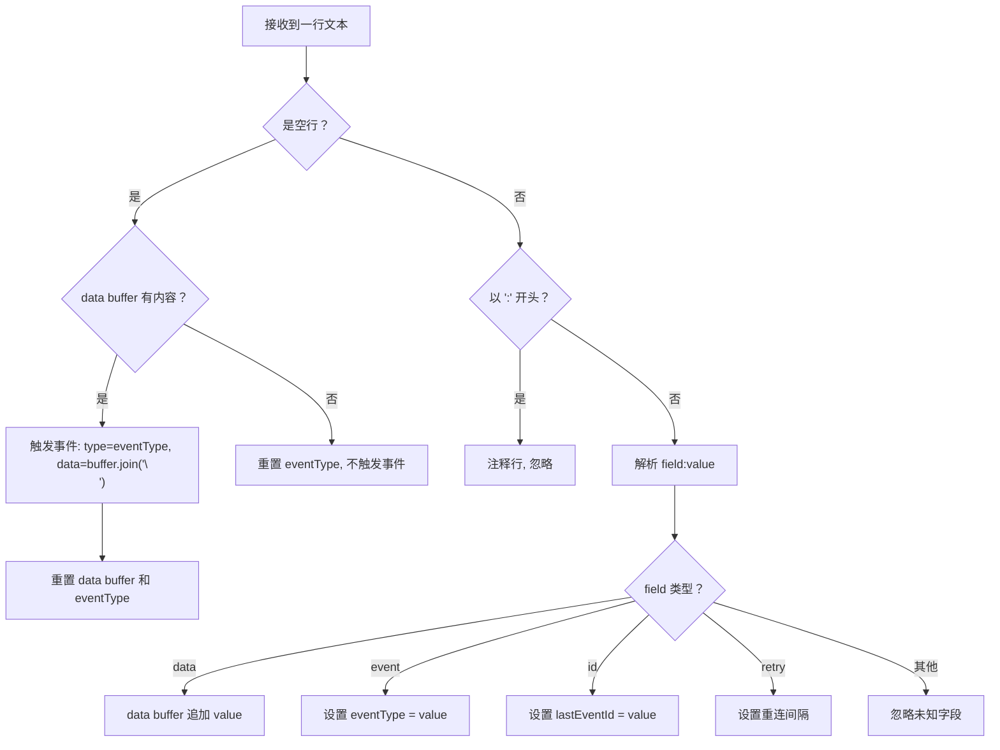
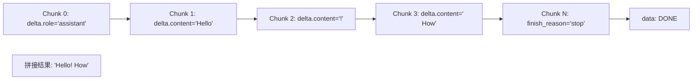
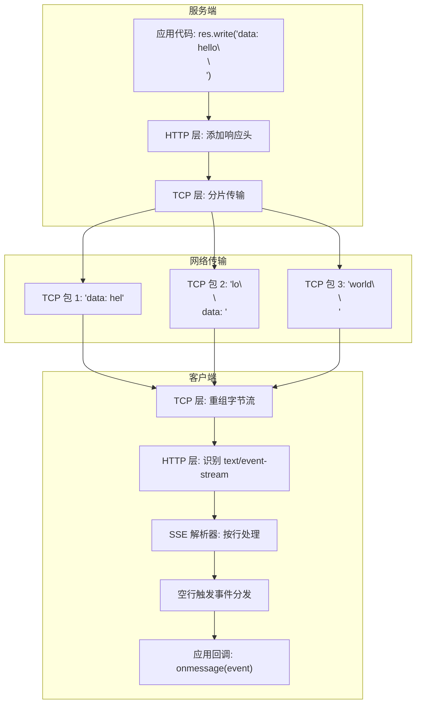

# SSE (Server-Sent Events) 学习 Demo

本 demo 从零演示 HTTP SSE 协议的原始数据格式，以及 OpenAI 流式响应是如何基于 SSE 工作的。

## 目录结构

```
sse-demo/
├── README.md                    # 本文档
├── package.json
└── src/
    ├── server.ts                # SSE 服务端（展示原始字节发送）
    ├── client.ts                # SSE 客户端（展示原始字节接收 + 解析）
    ├── openai-mock-server.ts    # 模拟 OpenAI 流式响应服务端
    ├── openai-client.ts         # OpenAI 流式客户端（展示完整解析过程）
    └── raw-sse-parser.ts        # 纯解析器演示（无需服务端，直接运行）
```

## 快速运行

```bash
# 推荐：直接运行解析器，无需启动服务端
npx tsx src/raw-sse-parser.ts

# 或者启动 SSE 服务端 + 客户端
npx tsx src/server.ts          # 终端 1
npx tsx src/client.ts          # 终端 2

# 或者启动 OpenAI 模拟服务 + 客户端
npx tsx src/openai-mock-server.ts   # 终端 1
npx tsx src/openai-client.ts        # 终端 2

# 也可以用 curl 直接看原始字节
curl -N http://localhost:3456/basic
curl -N http://localhost:3456/full-format
```

---

## 一、SSE 是什么

SSE (Server-Sent Events) 是 **HTTP/1.1 协议上的单向推送机制**。

核心思路：客户端发起一个普通 HTTP GET 请求，服务端返回一个 `Content-Type: text/event-stream` 的响应，**body 不关闭，持续发送文本数据**。

```
┌─────────┐     HTTP GET /sse         ┌─────────┐
│  Client  │ ─────────────────────────→ │  Server  │
│          │                            │          │
│          │ ← HTTP 200                 │          │
│          │   Content-Type:            │          │
│          │   text/event-stream        │          │
│          │                            │          │
│          │ ← data: hello\n\n          │          │
│          │ ← data: world\n\n          │          │
│          │ ← data: ...\n\n            │          │
│          │ ← (连接持续打开)            │          │
└─────────┘                            └─────────┘
```

**和 WebSocket 的区别**：
- SSE 是**单向**的（服务端→客户端），WebSocket 是双向的
- SSE 使用普通 HTTP，不需要协议升级
- SSE 原生支持自动重连
- SSE 更简单，适合"服务端推数据"的场景（如 LLM 流式输出）

---

## 二、SSE 原始数据格式

### 2.1 HTTP 响应头

```http
HTTP/1.1 200 OK
Content-Type: text/event-stream    ← 必须是这个 MIME 类型
Cache-Control: no-cache            ← 禁止缓存
Connection: keep-alive             ← 保持长连接
```

### 2.2 事件格式

SSE 的 body 是**纯文本**，由一系列事件组成。每个事件由若干行组成，**事件之间用空行（`\n\n`）分隔**：

```
[id: <事件ID>]\n          ← 可选
[event: <事件类型>]\n      ← 可选，默认 "message"
[retry: <毫秒>]\n         ← 可选，设置重连间隔
data: <数据第1行>\n        ← 至少一行 data
[data: <数据第2行>]\n      ← 可选，多行 data
\n                         ← 空行 = 事件结束
```

### 2.3 最基础的例子

服务端发送的原始字节（你在 `curl -N` 或 tcpdump 中看到的）：

```
data: Hello 1\n
\n
data: Hello 2\n
\n
data: Hello 3\n
\n
```

> 注意 `\n` 是实际的换行符（0x0A），这里用 `\n` 表示。

每个 `data: ...\n\n` 块就是一个事件。浏览器的 `EventSource` API 或客户端代码会在收到 `\n\n` 时触发一次事件回调。

### 2.4 完整格式例子

```
id: 1\n
event: message\n
data: {"text":"hello"}\n
\n

id: 2\n
event: custom-event\n
data: {"value":42}\n
\n

id: 3\n
event: multiline\n
data: line 1\n
data: line 2\n
data: line 3\n
\n

: 这是注释，客户端会忽略\n
\n

retry: 3000\n
id: 4\n
data: with retry\n
\n
```

### 2.5 各字段含义

| 字段 | 说明 | 示例 |
|------|------|------|
| `data:` | 事件数据（必须） | `data: hello` |
| `event:` | 事件类型（可选，默认 `message`） | `event: update` |
| `id:` | 事件ID（可选，用于断线重连） | `id: 42` |
| `retry:` | 重连间隔毫秒（可选） | `retry: 3000` |
| `:` | 注释行（客户端忽略，可用作心跳） | `: keepalive` |

### 2.6 多行 data

如果数据包含多行，每行都需要 `data:` 前缀：

```
data: line 1\n
data: line 2\n
data: line 3\n
\n
```

客户端收到后会将多行 data 用 `\n` 拼接为：`"line 1\nline 2\nline 3"`

---

## 三、SSE 解析算法

浏览器的 `EventSource` 和各种 SSE 客户端库内部都按照 [WHATWG 规范](https://html.spec.whatwg.org/multipage/server-sent-events.html#event-stream-interpretation) 解析。核心逻辑：



完整实现见 `src/raw-sse-parser.ts` 中的 `SSEParser` 类。

### 处理 TCP 分片

SSE 数据通过 TCP 传输，可能在任意位置被分片。客户端必须维护一个 buffer，遇到完整行（`\n`）才处理：

```
TCP Chunk 1:  "data: hel"        ← 行未结束，缓存
TCP Chunk 2:  "lo\n\ndata: wo"   ← 行结束，处理；新行开始，缓存
TCP Chunk 3:  "rld\n\n"          ← 行结束，处理
```

---

## 四、OpenAI 流式响应格式

OpenAI 的 Chat Completions API (stream: true) 使用 SSE 传输。以下是真实的原始字节。

### 4.1 请求

```http
POST /v1/chat/completions HTTP/1.1
Host: api.openai.com
Authorization: Bearer sk-xxx
Content-Type: application/json

{
  "model": "gpt-4o",
  "messages": [{"role": "user", "content": "Hello!"}],
  "stream": true
}
```

### 4.2 响应的原始 SSE 字节

```http
HTTP/1.1 200 OK
Content-Type: text/event-stream
Cache-Control: no-cache
Connection: keep-alive
```

响应 body（这就是你在网络层看到的原始文本）：

```
data: {"id":"chatcmpl-abc","object":"chat.completion.chunk","created":1700000000,"model":"gpt-4o-2024-05-13","choices":[{"index":0,"delta":{"role":"assistant","content":""},"finish_reason":null}]}\n
\n
data: {"id":"chatcmpl-abc","object":"chat.completion.chunk","created":1700000000,"model":"gpt-4o-2024-05-13","choices":[{"index":0,"delta":{"content":"Hello"},"finish_reason":null}]}\n
\n
data: {"id":"chatcmpl-abc","object":"chat.completion.chunk","created":1700000000,"model":"gpt-4o-2024-05-13","choices":[{"index":0,"delta":{"content":"!"},"finish_reason":null}]}\n
\n
data: {"id":"chatcmpl-abc","object":"chat.completion.chunk","created":1700000000,"model":"gpt-4o-2024-05-13","choices":[{"index":0,"delta":{"content":" How"},"finish_reason":null}]}\n
\n
data: {"id":"chatcmpl-abc","object":"chat.completion.chunk","created":1700000000,"model":"gpt-4o-2024-05-13","choices":[{"index":0,"delta":{},"finish_reason":"stop"},"usage":{"prompt_tokens":9,"completion_tokens":4,"total_tokens":13}]}\n
\n
data: [DONE]\n
\n
```

### 4.3 OpenAI SSE 的特点

1. **只用 `data:` 字段** —— 不使用 `event:`、`id:`、`retry:`
2. **每个 `data:` 是一行 JSON** —— 即 `chat.completion.chunk` 对象
3. **流结束标记** —— `data: [DONE]`（不是 JSON）
4. **增量式 delta** —— 每个 chunk 的 `choices[0].delta` 只包含本次增量

### 4.4 从 chunk 组装完整消息



客户端解析逻辑：

```typescript
let fullContent = "";

for await (const sseEvent of stream) {
  const data = sseEvent.data;

  // 检查流结束
  if (data === "[DONE]") break;

  // 解析 JSON
  const chunk = JSON.parse(data);
  const delta = chunk.choices[0].delta;

  // 拼接 content
  if (delta.content) {
    fullContent += delta.content;
  }
}

console.log(fullContent); // "Hello! How can I help you?"
```

### 4.5 Tool Call 流式响应

当模型调用工具时，SSE 格式相同，但 delta 中包含 `tool_calls`：

```
data: {"choices":[{"delta":{"role":"assistant","tool_calls":[{"index":0,"id":"call_abc","type":"function","function":{"name":"get_weather","arguments":""}}]},"finish_reason":null}]}

data: {"choices":[{"delta":{"tool_calls":[{"index":0,"function":{"arguments":"{\"lo"}}]},"finish_reason":null}]}

data: {"choices":[{"delta":{"tool_calls":[{"index":0,"function":{"arguments":"cation"}}]},"finish_reason":null}]}

data: {"choices":[{"delta":{"tool_calls":[{"index":0,"function":{"arguments":"\":\"SF\"}"}}]},"finish_reason":null}]}

data: {"choices":[{"delta":{},"finish_reason":"tool_calls"}]}

data: [DONE]
```

Tool call 的 `arguments` 是**逐步流出的 JSON 字符串片段**，客户端需要拼接后再 `JSON.parse`：

```typescript
// 拼接过程：
// "" → "{\"lo" → "{\"location" → "{\"location\":\"SF\"}"
// 最终: JSON.parse("{\"location\":\"SF\"}") → { location: "SF" }
```

---

## 五、SSE 与浏览器 EventSource API

浏览器内置了 `EventSource` 类，自动处理 SSE 连接：

```javascript
const source = new EventSource("/sse");

// 监听默认的 "message" 事件
source.onmessage = (event) => {
  console.log(event.data);        // data 字段的值
  console.log(event.lastEventId); // id 字段的值
};

// 监听自定义事件类型
source.addEventListener("custom-event", (event) => {
  console.log(event.data);
});

// 错误/断线处理（EventSource 会自动重连）
source.onerror = (event) => {
  console.log("连接断开，将自动重连...");
};

// 关闭连接
source.close();
```

**注意**：`EventSource` 只支持 GET 请求。OpenAI 的 POST 请求需要用 `fetch` + 手动解析（如本 demo 所示）。

---

## 六、完整数据流图

从 HTTP 请求到应用层事件的完整路径：



---

## 七、总结对比

| 特性 | 原始 SSE | OpenAI SSE |
|------|----------|------------|
| 协议 | HTTP/1.1, Content-Type: text/event-stream | 相同 |
| 数据格式 | `data: <任意文本>\n\n` | `data: <JSON>\n\n` |
| 事件类型 | 支持 `event:` 字段 | 不使用 |
| 事件ID | 支持 `id:` 字段 | 不使用 |
| 重连 | 支持 `retry:` 字段 | 不使用 |
| 流结束 | 服务端关闭连接 | `data: [DONE]` |
| 请求方式 | 通常 GET | POST |
| 认证 | 通常无 | Authorization: Bearer |
