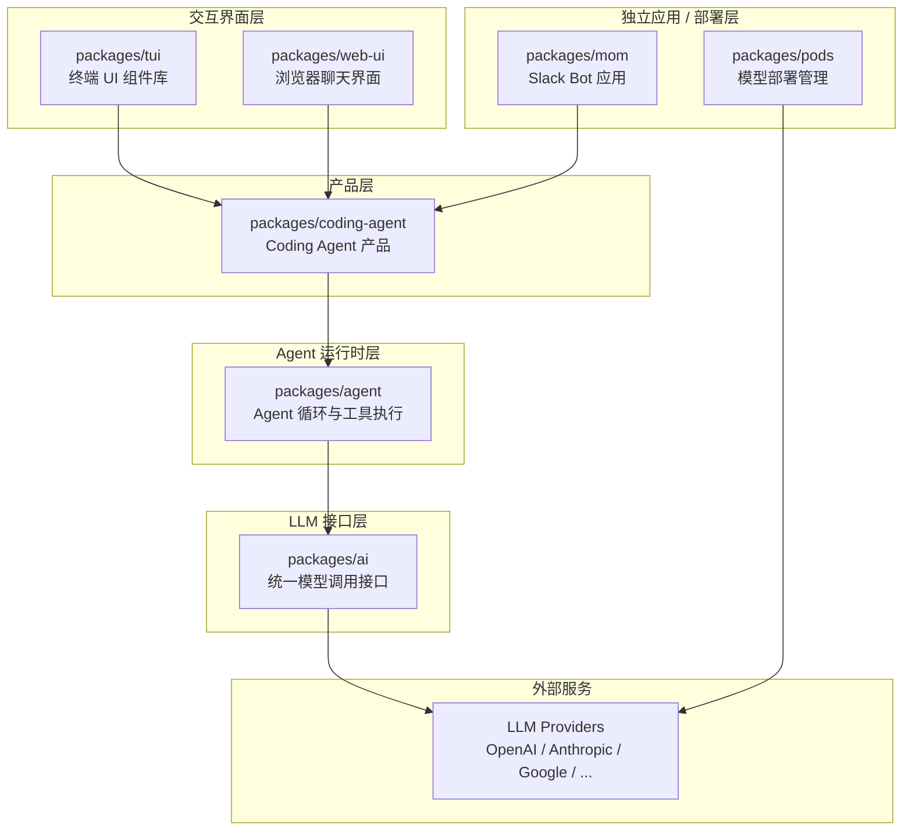
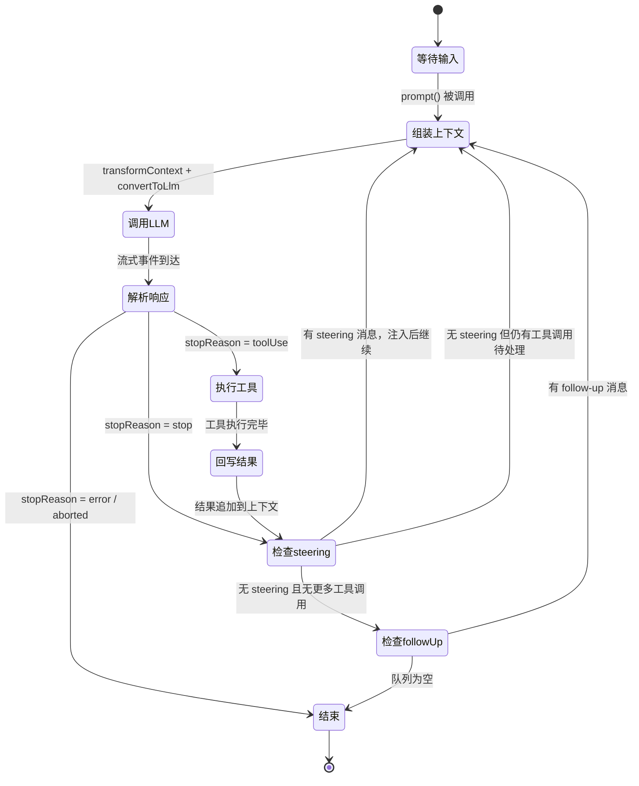

# 第 0 章：一条消息的完整旅程

## 前置知识

本章是整个教程系列的起点，不需要任何前置知识。你只需要对"AI 聊天助手"有一个模糊的印象——你输入一句话，它回复一段文字。

本章的目标不是教你写代码，而是给你一张**地图**。后续每一章都会深入地图上的某个区域，而本章让你先看到全貌。

## 本章聚焦的层次

本章不聚焦于任何单一层次，而是**纵贯所有层次**。

我们会从用户在终端按下回车的那一刻开始，追踪一条消息在 pi 系统内部的完整旅程：它经过了哪些模块、发生了哪些变换、触发了哪些动作，最终如何变成你在屏幕上看到的回复。

在 pi-mono 的分层架构中，这条消息会依次穿过：

- **交互界面层**（`packages/tui`）——接收你的输入，渲染最终的输出
- **产品层**（`packages/coding-agent`）——管理会话、扩展系统、工具注册
- **Agent 运行时层**（`packages/agent`）——驱动"模型 → 工具 → 模型"的核心循环
- **LLM 接口层**（`packages/ai`）——把请求发给模型，把响应翻译成统一格式

后续章节会逐一深入每个层次。本章的任务是让你先看清楚这些层次之间的关系，以及一条消息是如何在它们之间流转的。

## 为什么需要这张地图

如果你直接跳进某个包的源码，很容易迷失在细节里：

- 看 `packages/ai` 时，你可能会问："这些事件是谁在消费？"
- 看 `packages/agent` 时，你可能会问："agent loop 是谁启动的？消息从哪来？"
- 看 `packages/coding-agent` 时，你可能会问："这么多模块，它们之间是什么关系？"

这些问题的答案，都藏在"一条消息的完整旅程"里。

本章就是要回答一个问题：

> **当你在 pi 的终端里输入"帮我读取 config.json 并总结内容"，然后按下回车，接下来到底发生了什么？**

我们会用这个具体场景作为主线，从头到尾走一遍完整流程。每经过一个阶段，我们都会标注它属于哪个包、做了什么事、产出了什么。走完这一遍之后，你就拥有了一张完整的心智地图，后续学习任何一章时都能在这张地图上找到自己的位置。

## 系统分层架构

在追踪消息旅程之前，先看一眼 pi-mono 的整体架构。这张图展示了各个包之间的层次关系：



从下往上看，每一层都在上一层的基础上增加新的能力：

**LLM Providers（外部服务）**——OpenAI、Anthropic、Google 等模型提供商。它们各自有完全不同的 API 格式、认证方式和事件结构。你的消息最终会被发送到这里，模型在这里生成回复。

**`packages/ai`（LLM 接口层）**——统一模型调用接口。它把不同 provider 的差异封装起来，对上层暴露一套统一的类型和函数（`stream`、`complete`）。上层代码不需要知道底层用的是 OpenAI 还是 Anthropic。**它为上层提供**：统一的消息格式（`Message`）、统一的事件流（`AssistantMessageEvent`）、统一的模型元数据（`Model`）。**它依赖**：各 provider 的 SDK 或 HTTP API。

**`packages/agent`（Agent 运行时层）**——agent 循环与工具执行引擎。它在 LLM 接口层之上，实现了"调用模型 → 解析响应 → 执行工具 → 回写结果 → 再次调用模型"的核心循环。**它为上层提供**：`Agent` 类、事件订阅机制、工具注册与执行、steering（中途插话）和 follow-up（追加任务）能力。**它依赖**：`packages/ai` 的 `streamSimple` 函数和消息类型。

**`packages/coding-agent`（产品层）**——面向真实开发任务的 coding agent 产品。它在 agent 运行时之上，增加了会话管理（session）、上下文压缩（compaction）、内置工具（read、write、edit、bash）、扩展系统（extension）、提示模板（prompt template）等产品级能力。**它为上层提供**：`AgentSession` 类、完整的 CLI 入口、SDK 接口。**它依赖**：`packages/agent` 的 `Agent` 类和事件系统。

**`packages/tui`（终端 UI 层）** 和 **`packages/web-ui`（浏览器 UI 层）**——交互界面。它们消费 `AgentSession` 发出的事件，把文本流、工具执行进度、思考过程等实时渲染给用户。**它们依赖**：`packages/coding-agent` 的事件流和状态。

**`packages/mom`（Slack Bot 应用）** 和 **`packages/pods`（模型部署管理）**——独立的应用和部署层。`mom` 把 coding agent 放进 Slack 频道，`pods` 管理 GPU 上的模型部署。它们是系统的"最外层"，解决的是"怎么把 agent 放进真实环境"的问题。

一句话总结这个分层：

> **`ai` 解决"怎么和模型说话"，`agent` 解决"怎么让模型循环工作"，`coding-agent` 解决"怎么做成产品"，`tui` / `web-ui` 解决"怎么让人看到和操作"。**

理解了这个分层之后，我们就可以开始追踪消息的旅程了。

## 旅程开始：用户按下回车

假设你在 pi 的终端界面中输入了这句话：

> 帮我读取 config.json 并总结内容

然后按下回车。接下来发生的一切，就是本章要讲的故事。

### 第一站：终端 UI 接收输入 `[packages/tui]`

你按下回车的那一刻，终端 UI 层（`packages/tui`）捕获了你的输入文本。

`packages/tui` 是一个终端 UI 组件库，它提供了编辑器组件（Editor）、Markdown 渲染、焦点管理等能力。在 pi 的交互模式下，它负责：

1. 接收你在编辑器中输入的文本
2. 把文本传递给上层的产品逻辑
3. 后续还会负责把 agent 的响应实时渲染到终端

此时，你的输入还只是一个普通的字符串：`"帮我读取 config.json 并总结内容"`。它还不是任何结构化的消息对象。

### 第二站：产品层接收并预处理 `[packages/coding-agent]`

文本从 TUI 层传递到 `packages/coding-agent` 的交互模式（interactive mode）。这是 pi 的产品层，它要对你的输入做一系列预处理，然后才会交给 agent 运行时。

预处理的步骤大致如下：

**① 检查扩展命令**

pi 支持扩展系统（extension system）。扩展可以注册自定义命令（如 `/plan`、`/search`）。产品层首先检查你的输入是否匹配某个扩展命令。如果匹配，就直接交给扩展处理，不会进入 agent 循环。

我们的输入 `"帮我读取 config.json 并总结内容"` 不是扩展命令，所以继续往下走。

**② 触发 `input` 扩展事件**

即使不是扩展命令，扩展系统仍然有机会介入。产品层会触发一个 `input` 事件，让所有注册了该事件的扩展有机会：

- **拦截**（handled）：扩展自己处理输入，跳过 agent
- **变换**（transform）：修改输入文本或附加图片，然后继续
- **放行**（continue）：不做任何修改，让输入继续流转

大多数情况下，没有扩展会拦截普通的用户输入，所以我们的消息继续前进。

**③ 展开技能和提示模板**

pi 支持技能（skill）和提示模板（prompt template）。如果你的输入以 `/skill:` 开头或匹配某个提示模板，产品层会把它展开成完整的提示文本。

我们的输入是普通文本，不需要展开，继续前进。

**④ 构建用户消息**

经过上述预处理后，产品层把你的输入文本包装成一个结构化的用户消息：

```
原始输入: "帮我读取 config.json 并总结内容"
    ↓
AgentMessage: {
  role: "user",
  content: [{ type: "text", text: "帮我读取 config.json 并总结内容" }],
  timestamp: 1713000000000
}
```

注意这里的类型是 `AgentMessage`，不是 LLM 直接理解的 `Message`。`AgentMessage` 是 `packages/agent` 定义的应用层消息类型，它比 LLM 的消息类型更丰富——除了标准的 `user`、`assistant`、`toolResult` 角色之外，还可以包含自定义消息类型（如扩展注入的上下文消息）。为什么需要这个区分，后续章节（第 14 章）会详细解释。

**⑤ 触发 `before_agent_start` 扩展事件**

在把消息交给 agent 之前，产品层还会触发一个 `before_agent_start` 事件。扩展可以利用这个时机：

- 注入额外的上下文消息（比如"当前处于 plan 模式，只允许读操作"）
- 修改系统提示词（system prompt）

这些注入的消息会和你的用户消息一起被送进 agent 循环。

### 第三站：Agent 循环启动 `[packages/agent]`

产品层调用 `agent.prompt(messages)` 把消息数组交给 agent 运行时。从这一刻起，控制权从产品层转移到了 `packages/agent`。

`Agent` 类是一个有状态的封装，它管理着：

- 当前的消息历史（transcript）
- 可用的工具列表
- 模型配置
- 事件订阅者

当 `prompt()` 被调用时，agent 做了两件事：

1. 把你的消息追加到消息历史中
2. 启动 agent loop（agent 循环）

agent loop 是整个系统的核心引擎。它的职责是：**不断调用模型，直到模型不再请求工具调用为止**。

循环启动后，首先发出 `agent_start` 和 `turn_start` 事件，通知所有订阅者"agent 开始工作了"。UI 层收到这些事件后，会显示加载状态。

### 第四站：上下文组装 `[packages/agent]`

在调用模型之前，agent loop 需要把当前的消息历史组装成模型能理解的格式。这个过程经历两次关键变换：

**第一次变换：`transformContext()`**

`transformContext` 是一个可选的钩子函数，由产品层（`packages/coding-agent`）提供。它的作用是在消息送进模型之前，对消息列表做裁剪或注入：

```
AgentMessage[]（完整的消息历史）
    ↓ transformContext()
AgentMessage[]（裁剪/注入后的消息历史）
```

为什么需要这一步？因为消息历史会随着对话不断增长，很容易超出模型的上下文窗口（context window）。`transformContext` 可以：

- 删除过早的历史消息
- 把长消息压缩成摘要
- 注入外部上下文（比如项目规则文件的内容）

如果没有配置 `transformContext`，消息列表原样传递。

**第二次变换：`convertToLlm()`**

`convertToLlm` 是一个必需的函数，它把应用层的 `AgentMessage[]` 转换成 LLM 能理解的 `Message[]`：

```
AgentMessage[]（应用层消息，可能包含自定义类型）
    ↓ convertToLlm()
Message[]（LLM 消息：user / assistant / toolResult）
```

为什么需要这一步？因为 `AgentMessage` 可以包含 LLM 不认识的自定义消息类型（比如扩展注入的上下文消息、bash 执行记录、压缩摘要等）。`convertToLlm` 负责：

- 过滤掉 LLM 不需要看到的消息（比如纯 UI 展示用的消息）
- 把自定义消息类型转换成 LLM 能理解的 `user` 或 `assistant` 消息
- 确保最终的消息数组符合 LLM 的格式要求

经过这两次变换后，agent loop 手里有了一个干净的、LLM 能直接消费的上下文：

```
Context: {
  systemPrompt: "You are a helpful coding assistant...",
  messages: [
    { role: "user", content: "帮我读取 config.json 并总结内容" }
  ],
  tools: [
    { name: "read", description: "Read a file", parameters: {...} },
    { name: "bash", description: "Execute a command", parameters: {...} },
    { name: "edit", description: "Edit a file", parameters: {...} },
    { name: "write", description: "Write a file", parameters: {...} },
    // ...更多工具
  ]
}
```

注意 `tools` 字段——它告诉模型"你可以调用哪些工具"。这些工具定义是 `packages/coding-agent` 在初始化时注册的，包括 `read`（读文件）、`write`（写文件）、`edit`（编辑文件）、`bash`（执行命令）等内置工具，以及扩展注册的自定义工具。

### 第五站：调用 LLM `[packages/ai]`

上下文组装完毕后，agent loop 调用 `streamSimple()` 函数，把请求发送给模型。

控制权从 `packages/agent` 转移到 `packages/ai`。`packages/ai` 根据当前模型的 API 类型（比如 `anthropic-messages` 或 `openai-completions`），找到对应的 provider 实现，把统一格式的上下文翻译成该 provider 特有的请求格式，然后发送 HTTP 请求。

```
Context（统一格式）
    ↓ packages/ai 的 provider 实现
Provider 特有的请求格式（如 Anthropic 的 Messages API）
    ↓ HTTP 请求
LLM Provider 服务器
    ↓ 流式响应（SSE）
Provider 特有的事件格式
    ↓ packages/ai 的 provider 实现
AssistantMessageEvent（统一的事件流）
```

这个过程对上层完全透明——agent loop 不需要知道底层用的是 OpenAI 还是 Anthropic，它只消费统一的 `AssistantMessageEvent` 事件流。

### 第六站：流式响应到达 `[packages/ai → packages/agent]`

模型开始生成回复。回复不是一次性返回的，而是以**流式事件**（streaming events）的形式逐步到达。

```
LLM 只管吐符合特定格式的 token，这些 token 本质上还是字符串，只是格式特殊；供应商 API 层把字符串中的工具调用意图分离出来；pi-mono 的 provider 代码再把各家不同格式翻译成统一的 12 种事件。
```

| 层次                                | 谁负责                     | 输出什么                           |
| ----------------------------------- | -------------------------- | ---------------------------------- |
| LLM 模型                            | 预测下一个 token           | 一坨 token（字符串片段）           |
| Provider API（OpenAI/Anthropic 等） | 把 token 流包装成 HTTP SSE | 各自格式的 chunk/event             |
| pi-mono provider 实现               | 解析原始 chunk，维护状态机 | **统一的 `AssistantMessageEvent`** |
| Agent runtime / UI                  | 消费统一事件               | 执行工具、显示文本                 |

`packages/ai` 的 provider 实现把原始的流式数据翻译成统一的事件类型：

- `text_delta`——文本片段到达，比如模型输出了 `"我来帮你"`
- `thinking_delta`——推理过程片段到达（如果模型支持 thinking）
- `toolcall_start`——模型开始请求调用一个工具
- `toolcall_delta`——工具调用的参数片段到达
- `toolcall_end`——工具调用参数接收完毕，包含完整的工具名和参数
- `done`——模型生成结束

agent loop 消费这些事件，逐步构建出一个完整的 `AssistantMessage`（助手消息）。同时，它把这些事件通过 `message_update` 事件转发给所有订阅者——UI 层收到后，就能实时显示模型正在输出的文本。

在我们的场景中，模型看到了用户的请求"帮我读取 config.json 并总结内容"，也看到了可用的工具列表。它判断需要先读取文件，于是生成了一个工具调用请求：

```
AssistantMessage: {
  role: "assistant",
  content: [
    { type: "text", text: "我来帮你读取 config.json 的内容。" },
    {
      type: "toolCall",
      id: "call_abc123",
      name: "read",
      arguments: { path: "config.json" }
    }
  ],
  stopReason: "toolUse"   // ← 关键：模型主动停下来，等待工具结果
}
```

注意 `stopReason` 是 `"toolUse"`——这告诉 agent loop："模型没有说完，它在等工具执行的结果"。

### 第七站：工具执行 `[packages/agent → packages/coding-agent]`

agent loop 从 `AssistantMessage` 中提取出所有 `toolCall`，然后逐一执行。

执行过程中有几个关键的控制点：

**① 参数校验**

每个工具都有一个参数 schema（JSON Schema），定义了它接受什么参数。agent loop 会用这个 schema 校验模型生成的参数是否合法。如果参数不合法（比如缺少必需字段、类型错误），工具调用会被拒绝，错误信息会作为工具结果返回给模型。

**② `beforeToolCall` 钩子**

在实际执行工具之前，agent loop 会调用 `beforeToolCall` 钩子。这个钩子由产品层或扩展系统提供，可以：

- 拦截工具调用（比如在 plan 模式下禁止写操作）
- 要求用户确认（比如执行危险的 bash 命令前弹出确认框）
- 修改工具参数

**③ 实际执行**

校验通过、钩子放行后，工具开始执行。在我们的场景中，`read` 工具读取 `config.json` 文件的内容。工具执行期间，agent loop 发出 `tool_execution_start` 和 `tool_execution_update` 事件，UI 层据此显示工具执行进度。

**④ `afterToolCall` 钩子**

工具执行完毕后，`afterToolCall` 钩子有机会修改或审计工具结果。

执行完成后，工具返回一个结果：

```
ToolResultMessage: {
  role: "toolResult",
  toolCallId: "call_abc123",
  content: [
    { type: "text", text: '{ "name": "my-app", "version": "1.0.0", ... }' }
  ]
}
```

这个 `ToolResultMessage` 被追加到消息历史中，agent loop 发出 `tool_execution_end` 事件。

### 第八站：再次调用模型——循环继续 `[packages/agent → packages/ai]`

工具结果回写到上下文后，agent loop 检查：还有没有更多的工具调用需要执行？

在我们的场景中，这一轮只有一个工具调用（`read`），已经执行完毕。但 `stopReason` 是 `"toolUse"`，意味着模型还没说完——它需要看到工具结果后继续生成回复。

于是 agent loop 开启新的一轮（turn）：

1. 发出 `turn_end`（上一轮结束）和 `turn_start`（新一轮开始）事件
2. 再次组装上下文（这次消息历史中多了助手的工具调用和工具结果）
3. 再次调用 `streamSimple()`，把更新后的上下文发给模型

此时模型看到的上下文大致是：

```
messages: [
  { role: "user", content: "帮我读取 config.json 并总结内容" },
  { role: "assistant", content: [
    { type: "text", text: "我来帮你读取 config.json 的内容。" },
    { type: "toolCall", name: "read", arguments: { path: "config.json" } }
  ]},
  { role: "toolResult", content: [
    { type: "text", text: '{ "name": "my-app", "version": "1.0.0", ... }' }
  ]}
]
```

模型看到了文件内容，现在可以生成总结了。这一次，模型输出纯文本回复，不再请求工具调用：

```
AssistantMessage: {
  role: "assistant",
  content: [
    { type: "text", text: "config.json 是一个 Node.js 项目配置文件，主要内容包括：\n- 项目名称：my-app\n- 版本号：1.0.0\n- ..." }
  ],
  stopReason: "stop"   // ← 模型主动结束，不再需要工具
}
```

`stopReason` 是 `"stop"`——模型认为任务完成了。agent loop 检查到没有更多的工具调用，也没有 steering 消息或 follow-up 消息在排队，于是结束循环，发出 `turn_end` 和 `agent_end` 事件。

## Agent 循环的核心状态机

上面的旅程中，我们已经看到了 agent loop 的工作方式。现在把它抽象成一张状态转换图，帮助你建立更清晰的心智模型：



这张图有两个关键的回路，理解它们就理解了 agent 为什么能持续工作：

**回路一：工具调用驱动的持续循环。** 当模型返回 `stopReason = toolUse` 时，agent 执行工具、把结果回写到上下文，然后检查 steering 队列。无论有没有 steering 消息，只要上一轮有工具调用，循环就会回到"组装上下文"并再次调用 LLM——因为模型需要看到工具结果后才能继续推理。这个回路可以反复执行多次：模型读了一个文件后可能还要读另一个文件，读完后可能还要执行一个命令，每次都是"调用 LLM → 工具调用 → 执行 → 回写 → 再次调用 LLM"。

**回路二：follow-up 驱动的额外循环。** 当模型返回 `stopReason = stop`（不再请求工具）且没有 steering 消息时，agent 本来要结束了。但如果 follow-up 队列中有消息，它会把这些消息注入上下文并重新进入循环。

一句话概括：

> **只要模型还在请求工具，循环就不会停；即使模型停了，排队的消息也能让循环继续；只有当模型不再请求工具、steering 和 follow-up 队列也都为空时，循环才真正结束。**

### `stopReason` 决定循环走向

模型每次生成回复时，都会附带一个 `stopReason`（停止原因），它决定了 agent loop 接下来做什么：

| stopReason | 含义                              | agent loop 的行为                                        |
| ---------- | --------------------------------- | -------------------------------------------------------- |
| `stop`     | 模型主动结束，认为任务完成        | 检查 steering 和 follow-up 队列，都为空则结束循环        |
| `toolUse`  | 模型请求调用工具                  | 执行工具，回写结果，再次组装上下文并调用 LLM（循环继续） |
| `error`    | 模型调用出错（如 API 错误、超时） | 结束循环，产品层可能触发自动重试                         |
| `aborted`  | 用户主动中断（按了 Escape）       | 立即结束循环                                             |

### Steering 和 Follow-up：循环不是"问一次答一次"

在上面的状态图中，你可能注意到了"检查队列"这个状态。这涉及到两个重要机制：

**Steering（中途插话）**——当 agent 正在执行工具时，你可以输入新的消息。这些消息不会打断当前的工具执行，而是被放入 steering 队列。等当前轮次的所有工具执行完毕后，steering 消息会被注入到上下文中，模型在下一轮会看到它们。

**Follow-up（追加任务）**——当 agent 本来要结束循环时（`stopReason = stop`，没有工具调用），如果 follow-up 队列中有消息，agent 会把它们注入上下文并继续运行，而不是结束。

这两个机制让 pi 的交互不是简单的"你问一句，它答一句"，而是一个**持续协作的过程**。你可以在 agent 工作的过程中随时补充信息或修改方向。

关于 steering 和 follow-up 的详细机制，第 18 章会深入讲解。

## 事件流：agent 内部与 UI 的桥梁

在整个旅程中，你可能已经注意到我们反复提到"发出事件"、"UI 层收到事件后渲染"。现在来系统地看一下这个事件机制。

### 为什么需要事件流

如果 agent 是"等模型全部生成完再一次性返回"，那用户体验会很差——你按下回车后，屏幕上什么都没有，直到几秒甚至几十秒后突然出现一大段文字。

pi 的做法是：agent 内部的每一步操作都会发出事件，UI 层订阅这些事件并实时渲染。这样用户可以：

- 看到模型正在逐字输出文本
- 看到工具正在执行以及执行进度
- 在 agent 工作过程中随时中断或插话

### 核心事件类型

agent 循环发出的事件分为三个层次：

**Agent 生命周期事件：**

| 事件          | 含义                           |
| ------------- | ------------------------------ |
| `agent_start` | agent 开始处理，整个运行的起点 |
| `agent_end`   | agent 处理完毕，整个运行的终点 |

**Turn（轮次）生命周期事件：**

一个 turn 是"一次 LLM 调用 + 对应的工具执行"。一次 agent 运行可能包含多个 turn（比如我们的场景就有两个 turn：第一轮调用工具，第二轮生成总结）。

| 事件         | 含义                             |
| ------------ | -------------------------------- |
| `turn_start` | 新的一轮开始                     |
| `turn_end`   | 一轮结束，携带助手消息和工具结果 |

**Message（消息）和 Tool（工具）生命周期事件：**

| 事件                    | 含义                                                                                                    |
| ----------------------- | ------------------------------------------------------------------------------------------------------- |
| `message_start`         | 一条消息开始（user / assistant / toolResult）                                                           |
| `message_update`        | 助手消息的流式更新，携带 `AssistantMessageEvent`（如 `text_delta`、`thinking_delta`、`toolcall_delta`） |
| `message_end`           | 一条消息结束                                                                                            |
| `tool_execution_start`  | 工具开始执行                                                                                            |
| `tool_execution_update` | 工具执行过程中的进度更新                                                                                |
| `tool_execution_end`    | 工具执行完毕                                                                                            |

### 事件流在我们场景中的完整序列

回到"帮我读取 config.json 并总结内容"这个场景，完整的事件序列是：

```
agent_start
├─ turn_start                                    // 第一轮
│  ├─ message_start  { user: "帮我读取..." }     // 用户消息
│  ├─ message_end    { user: "帮我读取..." }
│  ├─ message_start  { assistant: ... }           // 模型开始回复
│  ├─ message_update { text_delta: "我来" }       // 逐字输出
│  ├─ message_update { text_delta: "帮你" }
│  ├─ message_update { toolcall_start: ... }      // 开始工具调用
│  ├─ message_update { toolcall_delta: ... }      // 参数片段
│  ├─ message_update { toolcall_end: read(...) }  // 工具调用完整
│  ├─ message_end    { assistant, stopReason: toolUse }
│  ├─ tool_execution_start { read, config.json }  // 开始读文件
│  ├─ tool_execution_end   { read, 文件内容 }     // 读取完毕
│  ├─ message_start  { toolResult: 文件内容 }     // 工具结果消息
│  ├─ message_end    { toolResult: 文件内容 }
│  └─ turn_end
│
├─ turn_start                                    // 第二轮
│  ├─ message_start  { assistant: ... }           // 模型生成总结
│  ├─ message_update { text_delta: "config" }
│  ├─ message_update { text_delta: ".json 是" }
│  ├─ message_update { text_delta: "一个..." }
│  ├─ ...
│  ├─ message_end    { assistant, stopReason: stop }
│  └─ turn_end
│
└─ agent_end
```

### UI 如何消费这些事件

UI 层（`packages/tui` 或 `packages/web-ui`）通过 `agent.subscribe()` 订阅事件。不同的事件触发不同的渲染行为：

- 收到 `message_update` 中的 `text_delta` → 在终端追加文本，实现"打字机效果"
- 收到 `tool_execution_start` → 显示"正在执行 read(config.json)..."
- 收到 `tool_execution_end` → 显示工具执行结果（可折叠）
- 收到 `agent_end` → 隐藏加载状态，恢复输入框焦点

这种事件驱动的架构意味着 UI 和 agent 逻辑是**解耦**的。同一套 agent 运行时可以驱动终端 UI、浏览器 UI，甚至 Slack Bot——它们只是消费同一套事件的不同渲染器。

## 旅程终点：会话持久化与收尾

agent 循环结束后，消息的旅程还没有完全结束。产品层（`packages/coding-agent`）还需要做几件收尾工作。

### 会话持久化 `[packages/coding-agent]`

在整个 agent 运行过程中，`AgentSession` 会在每条消息结束时（`message_end` 事件）自动把消息持久化到磁盘。这是通过 `SessionManager`（会话管理器）实现的。

`SessionManager` 的核心职责是：

- **保存消息**：每条 user、assistant、toolResult 消息都会被追加到会话文件中
- **支持恢复**：下次启动 pi 时，可以从会话文件中恢复之前的对话状态
- **支持分支**：你可以从对话历史中的任意一点创建分支，探索不同的方向
- **支持树形导航**：对话历史不是线性的，而是一棵树——你可以在不同分支之间切换

这意味着即使你关闭终端，下次打开 pi 时仍然可以继续之前的对话，所有的消息历史、工具调用结果都还在。

### 上下文压缩检查 `[packages/coding-agent]`

agent 运行结束后，`AgentSession` 还会检查当前上下文是否需要压缩（compaction）。

随着对话的进行，消息历史会不断增长。当消息占用的 token 数接近模型的上下文窗口上限时，系统会自动触发压缩：把较早的消息压缩成摘要，释放上下文空间。

压缩不是简单地删除旧消息——它会用模型生成一份摘要，保留关键信息（比如"用户之前让我修改了哪些文件"、"当前任务的目标是什么"），然后用摘要替换原始消息。

关于压缩的详细机制，第 22 章会深入讲解。

### 扩展系统在全流程中的介入点总结

在整个旅程中，扩展系统（extension system）在多个关键节点都有机会介入。这里做一个汇总：

| 介入点                          | 时机                         | 扩展可以做什么                 |
| ------------------------------- | ---------------------------- | ------------------------------ |
| `input`                         | 用户输入到达后，agent 启动前 | 拦截、变换或处理输入           |
| `before_agent_start`            | agent 循环启动前             | 注入上下文消息、修改系统提示词 |
| `message_start` / `message_end` | 每条消息开始/结束时          | 监听消息生命周期               |
| `turn_start` / `turn_end`       | 每轮开始/结束时              | 监听轮次生命周期               |
| `before_tool_call`              | 工具执行前                   | 拦截、修改参数、要求确认       |
| `after_tool_call`               | 工具执行后                   | 修改结果、审计                 |

扩展系统让 pi 具备了高度的可定制性——你可以在不修改核心代码的情况下，通过扩展改变 agent 的行为。但这只是概览，详细的扩展开发将在第 23 章展开。

## 全流程数据变换总览

最后，把消息在整个旅程中经历的关键数据变换串联起来，形成一张完整的变换链路图：

```
用户输入（字符串）
  ↓ packages/coding-agent: 预处理 + 构建消息
AgentMessage（应用层消息）
  ↓ packages/agent: transformContext()
AgentMessage[]（裁剪/注入后）
  ↓ packages/agent: convertToLlm()
Message[]（LLM 消息）+ Context（系统提示词 + 工具定义）
  ↓ packages/ai: stream() → provider 实现
HTTP 请求（provider 特有格式）
  ↓ LLM Provider 服务器
流式响应（provider 特有事件格式）
  ↓ packages/ai: provider 实现
AssistantMessageEvent（统一事件流）
  ↓ packages/agent: agent loop 消费事件
AssistantMessage（包含 text + toolCall）
  ↓ packages/agent: 提取 toolCall，执行工具
ToolResultMessage（工具执行结果）
  ↓ packages/agent: 回写到上下文，继续循环
  ↓ ... 直到 stopReason = stop
最终 AssistantMessage（纯文本回复）
  ↓ packages/agent: 发出 agent_end 事件
  ↓ packages/coding-agent: 持久化到 SessionManager
  ↓ packages/tui: 渲染到终端
用户看到回复
```

每一个箭头都是一次数据变换，每一次变换都跨越了一个层次边界。理解这条链路，就理解了 pi 的核心工作原理。

## 后续章节导航

现在你已经看完了一条消息的完整旅程。后续每一章都会深入这张地图上的某个区域。下面是各章节在全流程中的位置：

### 第一阶段：建立正确心智模型（第 1-6 章）

| 章节                                | 聚焦的流程阶段                                                   |
| ----------------------------------- | ---------------------------------------------------------------- |
| **第 1 章：什么是 LLM**             | 全流程中"调用 LLM"这一步的基础——模型是什么、能做什么、不能做什么 |
| **第 2 章：什么是 Agent**           | 为什么需要 agent loop，而不是直接调用模型                        |
| **第 3 章：Agent 的最小闭环**       | 全流程中"调用模型 → 工具调用 → 回写结果 → 再次调用"这个核心循环  |
| **第 4 章：为什么工具调用是分水岭** | 全流程中"工具调用解析 → 工具执行"这一段                          |
| **第 5 章：上下文为什么总是不够用** | 全流程中"上下文组装"和"上下文压缩"这两个阶段                     |
| **第 6 章：记忆、会话、状态**       | 全流程中"会话持久化"这一段，以及跨会话的状态管理                 |

### 第二阶段：理解底层 LLM 接口层（第 7-12 章）

| 章节                              | 聚焦的流程阶段                                      |
| --------------------------------- | --------------------------------------------------- |
| **第 7 章：统一模型接口**         | 全流程中 `packages/ai` 如何屏蔽不同 provider 的差异 |
| **第 8 章：消息格式**             | 全流程中消息在各层之间的格式变换                    |
| **第 9 章：流式输出与事件流**     | 全流程中"流式响应到达"这一段的底层机制              |
| **第 10 章：Schema 与结构化参数** | 全流程中"工具参数校验"这一步                        |
| **第 11 章：多模型切换**          | 全流程中模型选择和运行时切换                        |
| **第 12 章：错误、中断与恢复**    | 全流程中 `stopReason = error / aborted` 的处理      |

### 第三阶段：理解 Agent Runtime（第 13-18 章）

| 章节                                         | 聚焦的流程阶段                                      |
| -------------------------------------------- | --------------------------------------------------- |
| **第 13 章：Agent Loop**                     | 本章状态机图的详细实现                              |
| **第 14 章：Agent 的消息类型**               | `AgentMessage` vs `Message` 的区分和 `convertToLlm` |
| **第 15 章：Context Transform**              | `transformContext()` 的详细机制                     |
| **第 16 章：工具执行策略**                   | 并行 vs 串行工具执行                                |
| **第 17 章：beforeToolCall / afterToolCall** | 工具执行前后的拦截机制                              |
| **第 18 章：Steering 和 Follow-up**          | 中途插话和追加任务的详细机制                        |

### 第四阶段：从 Runtime 到真实产品（第 19-24 章）

| 章节                       | 聚焦的流程阶段                                        |
| -------------------------- | ----------------------------------------------------- |
| **第 19 章：Coding Agent** | 产品层如何在 runtime 之上构建完整产品                 |
| **第 20 章：内置工具**     | 全流程中 `read`、`write`、`edit`、`bash` 等工具的设计 |
| **第 21 章：Session**      | 会话持久化、分支、树形导航的详细机制                  |
| **第 22 章：Compaction**   | 上下文压缩的详细算法和策略                            |
| **第 23 章：Extensions**   | 扩展系统的完整开发指南                                |
| **第 24 章：UI**           | 事件流如何驱动 UI 渲染                                |

### 第五阶段：走向完整系统（第 25-30 章）

| 章节                           | 聚焦的流程阶段                 |
| ------------------------------ | ------------------------------ |
| **第 25-26 章：TUI / Web UI**  | 终端和浏览器界面的具体实现     |
| **第 27 章：Slack Bot**        | 把 agent 放进团队协作场景      |
| **第 28 章：模型部署**         | agent 依赖的推理基础设施       |
| **第 29 章：评估与安全**       | 生产环境的质量和安全保障       |
| **第 30 章：做你自己的 Agent** | 把所有知识串起来，构建完整系统 |

## 小练习

1. **画出你自己的流程图**：不看本章内容，尝试凭记忆画出"用户输入一条消息到看到回复"的完整流程。然后对照本章检查，看看你遗漏了哪些步骤。遗漏的部分往往就是你需要重点学习的。

2. **追踪一个更复杂的场景**：想象用户输入"帮我在 src/utils/ 下创建一个 format.ts 文件，实现一个日期格式化函数"。这个场景和本章的"读取并总结"场景有什么不同？提示：模型可能需要调用多个工具（`bash` 查看目录结构、`write` 创建文件），agent loop 会经历更多轮次。

3. **找到代码入口**：在 `packages/agent/src/agent-loop.ts` 中，找到 `runLoop` 函数。对照本章的状态机图，看看代码中的 `while (true)` 循环是如何实现"不断调用模型直到不再需要工具"这个逻辑的。不需要理解每一行代码，只需要找到循环的入口、工具调用的检查点、和循环结束的条件。
